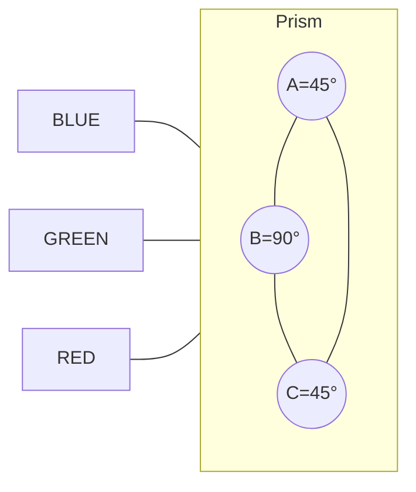
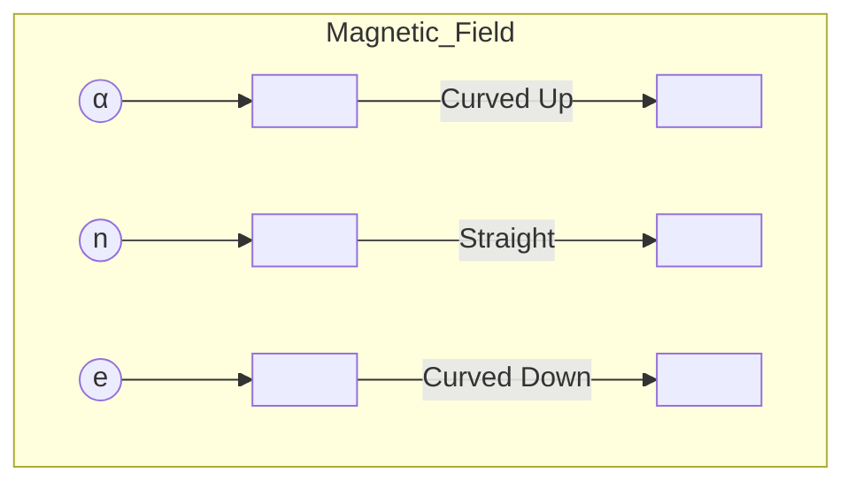

Kendriya Vidyalaya Sangathan logo

# केन्द्रीय विद्यालय संगठन
# KENDRIYA VIDYALAYA SANGATHAN
# AHMEDABAD REGION

Kendriya Vidyalaya Sangathan emblem

<table>
  <thead>
    <tr>
      <th colspan="13"></th>
    </tr>
  </thead>
  <tbody>
    <tr>
      <td></td>
<td></td>
<td></td>
<td></td>
<td></td>
<td></td>
<td></td>
<td></td>
<td></td>
<td></td>
<td></td>
<td></td>
<td></td>
    </tr>
<tr>
      <td></td>
<td></td>
<td></td>
<td></td>
<td></td>
<td></td>
<td></td>
<td></td>
<td></td>
<td></td>
<td></td>
<td></td>
<td></td>
    </tr>
<tr>
      <td colspan="13"></td>
    </tr>
<tr>
      <td colspan="13">CLASS–XII
SESSION- 2022-23</td>
    </tr>
  </tbody>
</table>

SESSION- 2022-23

Physics related illustrations and formulas

# PHYSICS

---

# QUESTION BANK/SUPPORT MATERIAL

**<u>For Bright/High Achievers( SECTION – A )</u>**
**<u>&Late Bloomer/Slow Learners ( SECTION – B )</u>**
**<u>– Class –XII</u>**

# INSPIRATION

**PATRONS**
**Mrs.ShrutiBhargava**
**DeputyCommissioner,**
**AhmedabadRegion**

**Mrs.VinitaSharma**
**AssistantCommissioner,**
**AhmedabadRegion**

**MENTOR**
**Sh.YeshdeepRohilla**
**Principal,**
**KVNo.1,Ichhanath,**
**Surat**

---

# CONTENT DEVELPOMENT TEAM

## SECTION – A

## For Bright/High Achievers of XII -2022-23

<table>
  <thead>
    <tr>
        <th>S. NO.</th>
        <th>NAME OF THE TEACHER</th>
        <th>NAME OF THE KV</th>
        <th>NAME OF THE CHAPTER</th>
        <th>NAME OF THE REVIEWER/ CHECKER</th>
        <th>NAME OF THE FINAL REVIEWER</th>
    </tr>
  </thead>
  <tbody>
    <tr>
        <td>1.</td>
<td>SH. ANANT PRATAP SINGH</td>
<td>SILVASSA</td>
<td>CHAPTER–1: ELECTRIC CHARGES AND FIELDS</td>
        <td rowspan="5">SH. VIKAS SHARMA</td>
        <td rowspan="5">SH. V.K. PATHAK</td>
    </tr>
<tr>
        <td>2.</td>
<td>SH. T C AGRAWAL</td>
<td>ONGC CHANDKHEDA</td>
<td>CHAPTER–2: ELECTROSTATIC POTENTIAL AND CAPACITANCE</td>
    </tr>
<tr>
        <td>3.</td>
<td>SH.ACHLESHWAR SANKHLA</td>
<td>ONGC MEHSANA</td>
<td>CHAPTER–3: CURRENT ELECTRICITY</td>
    </tr>
<tr>
        <td>4.</td>
<td>SH. DEEPAK KUMAR SINGHAL</td>
<td>AFS NALIYA</td>
<td>CHAPTER–4: MOVING CHARGES AND MAGNETISM</td>
    </tr>
<tr>
        <td>5.</td>
<td>SH. BALWANT KUMAR</td>
<td>NO 2 AHMEDABAD CANTT</td>
<td>CHAPTER–5: MAGNETISM AND MATTER</td>
    </tr>
<tr>
        <td>6.</td>
<td>SH. R H PARMAR</td>
<td>SAC AHMEDABAD</td>
<td>CHAPTER–6: ELECTROMAGNETIC INDUCTION</td>
        <td rowspan="5">SH. M.P. DABI</td>
        <td rowspan="5">SH. R.M. SHUKLA</td>
    </tr>
<tr>
        <td>7.</td>
<td>SH. RAM</td>
<td>INS VALSURA</td>
<td>CHAPTER–7: ALTERNATING CURRENT</td>
    </tr>
<tr>
        <td>8.</td>
<td>SH. GURMEET SINGH CHANI</td>
<td>HIMMATNAGAR</td>
<td>CHAPTER–8: ELECTROMAGNETIC WAVES</td>
    </tr>
<tr>
        <td>9.</td>
<td>SH. RAM NARAYAN</td>
<td>NO.1 SHAHIBAUG, AHMEDABAD</td>
<td>CHAPTER–9: RAY OPTICS AND OPTICAL INSTRUMENTS</td>
    </tr>
<tr>
        <td>10.</td>
<td>MS. ANJU KUMARI</td>
<td>AFS WADSAR</td>
<td>CHAPTER–10: WAVE OPTICS</td>
    </tr>
<tr>
        <td>11.</td>
<td>SH.HINGORJA SABBIRSHA RAHIMSHA</td>
<td>NO.1 AFS BHUJ</td>
<td>CHAPTER–11: DUAL NATURE OF RADIATION AND MATTER</td>
        <td rowspan="4">SH. SUNIL KUMAR DEVRANI</td>
        <td rowspan="4">SH. PAWAN KUMAR</td>
    </tr>
<tr>
        <td>12.</td>
<td>SH. S.K. KOLI</td>
<td>NO 1 SEC 30 GANDHINAGAR</td>
<td>CHAPTER–12: ATOMS</td>
    </tr>
<tr>
        <td>13.</td>
<td>SH. MOHIT BANSAL</td>
<td>KV AFS SAMANA</td>
<td>CHAPTER–13: NUCLEI</td>
    </tr>
<tr>
        <td>14.</td>
<td>SH. BHOOR SINGH MEENA</td>
<td>K V NO. 3 GANDHINAGAR CANTT</td>
<td>CHAPTER–14: SEMICONDUCTOR ELECTRONICS: MATERIALS, DEVICES AND SIMPLE CIRCUITS</td>
    </tr>
  </tbody>
</table>


---

# <u>MESSAGE</u>

Providing Quality Question Bank/Support Material, as per latest CBSE guideline/norms, to the students is a tradition in Kendriya Vidyalaya Sangathan. The Question Bank/Support Material prepared by the subject experts includes all the necessary changes/modifications introduced by the CBSE so as to acquaint our student with the changes in curriculum, pattern and design of questions, unit/topic-wise weightage of marks of Competency Based Questions (CBQS), MCQs, Objective Type Questions (OTQs) & SA/LA Types Questions. This students’ support material is surely a meticulous work undertaken by the subject experts of the Region with an aim to help students’ excellent learning. Each Chapter/Unit has been organized scholastically keeping in mind the doubts that may arise while a young learner deals with the concepts.

All varieties of questions in different designs have been dealt with, to prepare the students for the current pattern/format that could appear in theCBSE Examination for the year 2022-23.

I hope this material will prove to be a good tool for quick recap and will serve the purpose of enhancing students’ confidence level to help them perform better. Planned study blended with hard work, good time management and sincerity will help the students reach the pinnacle of success.

I would like to compliment the dedicated team of teachers for their sincere efforts with professionalism which made it possible to accomplish this work in stipulated time. I alsotake this opportunity to convey my heartfelt best of wishes to all the students forsuccessin theirfuture endeavors.

**Sh. YeshdeepRohilla**
**Principal**
**KV No.1, Ichhanath, Surat**

---

# INDEX-SECTION -A

<table>
  <thead>
    <tr>
        <th>SR. NO.</th>
        <th>TOPIC</th>
        <th>MARKS</th>
        <th>PAGE NO.</th>
    </tr>
  </thead>
  <tbody>
    <tr>
        <td>1.</td>
<td><strong>SYLLABUS (THEORY)</strong></td>
<td>70</td>
<td>1 - 4</td>
    </tr>
<tr>
        <td>2.</td>
<td><strong>SYLLABUS (PRACTICAL)</strong></td>
<td>30</td>
<td>5</td>
    </tr>
<tr>
        <td>3.</td>
<td>Chapter–1: Electric Charges and Fields</td>
        <td rowspan="3">16</td>
<td>6 - 21</td>
    </tr>
<tr>
        <td>4.</td>
<td>Chapter–2: Electrostatic Potential and Capacitance</td>
<td>22 - 39</td>
    </tr>
<tr>
        <td>5.</td>
<td>Chapter–3: Current Electricity</td>
<td>40 - 54</td>
    </tr>
<tr>
        <td>6.</td>
<td>Chapter–4: Moving Charges and<br/>Magnetism</td>
        <td rowspan="4">17</td>
<td>55 - 68</td>
    </tr>
<tr>
        <td>7.</td>
<td>Chapter–5: Magnetism and Matter</td>
<td>69 - 81</td>
    </tr>
<tr>
        <td>8.</td>
<td>Chapter–6: Electromagnetic Induction</td>
<td>82 - 95</td>
    </tr>
<tr>
        <td>9.</td>
<td>Chapter–7: Alternating Current</td>
<td>96 - 106</td>
    </tr>
<tr>
        <td>10.</td>
<td>Chapter–8: Electromagnetic Waves</td>
        <td rowspan="3">18</td>
<td>107 - 118</td>
    </tr>
<tr>
        <td>11.</td>
<td>Chapter–9: Ray Optics and Optical Instruments</td>
<td>119 - 141</td>
    </tr>
<tr>
        <td>12.</td>
<td>Chapter–10: Wave Optics</td>
<td>142 - 153</td>
    </tr>
<tr>
        <td>13.</td>
<td>Chapter–11: Dual Nature of Radiation and Matter</td>
        <td rowspan="3">12</td>
<td>154 - 166</td>
    </tr>
<tr>
        <td>14.</td>
<td>Chapter–12: Atoms</td>
<td>167 - 183</td>
    </tr>
<tr>
        <td>15.</td>
<td>Chapter–13: Nuclei</td>
<td>184 - 195</td>
    </tr>
<tr>
        <td>16.</td>
<td>Chapter–14: Semiconductor Electronics: Materials,<br/>Devices and Simple Circuits</td>
<td>7</td>
<td>196 - 213</td>
    </tr>
  </tbody>
</table>

1

---

# SYLLABUS(THEORY)

## Unit I: Electrostatics

**Chapter–1: Electric Charges and Fields**

Electric charges, Conservation of charge, Coulomb's law-force between two-point charges, forces between multiple charges; superposition principle and continuous charge distribution.
Electric field, electric field due to a point charge, electric field lines, electric dipole, electric field due to a dipole, torque on a dipole in uniform electric field.
Electric flux, statement of Gauss's theorem and its applications to find field due to infinitely long straight wire, uniformly charged infinite plane sheet and uniformly charged thin spherical shell (field inside and outside).

**Chapter–2: Electrostatic Potential and Capacitance**

Electric potential, potential difference, electric potential due to a point charge, a dipole and system of charges; equipotential surfaces, electrical potential energy of a system of two-point charges and of electric dipole in an electrostatic field.
Conductors and insulators, free charges and bound charges inside a conductor. Dielectrics and electric polarization, capacitors and capacitance, combination of capacitors in series and in parallel, capacitance of a parallel plate capacitor with and without dielectric medium between the plates, energy stored in a capacitor (no derivation, formulae only).

## Unit II: Current Electricity

**Chapter–3: Current Electricity**

Electric current, flow of electric charges in a metallic conductor, drift velocity, mobility and their relation with electric current; Ohm's law, V-I characteristics (linear and non-linear), electrical energy and power, electrical resistivity and conductivity, temperature dependence of resistance, Internal resistance of a cell, potential difference and emf of a cell, combination of cells in series and in parallel, Kirchhoff's rules, Wheatstone bridge.

## Unit III: Magnetic Effects of Current and Magnetism

**Chapter–4: Moving Charges and Magnetism**

Concept of magnetic field, Oersted's experiment.
Biot - Savart law and its application to current carrying circular loop.
Ampere's law and its applications to infinitely long straight wire. Straight solenoid (only qualitative treatment), force on a moving charge in uniform magnetic and electric fields.
Force on a current-carrying conductor in a uniform magnetic field, force between two parallel current-carrying conductors-definition of ampere, torque experienced by a current loop in uniform magnetic field; Current loop as a magnetic dipole and its magnetic dipole moment, moving coil galvanometer-its current sensitivity and conversion to ammeter and voltmeter.

2


---

# Chapter–5: Magnetism and Matter

Bar magnet, bar magnet as an equivalent solenoid (qualitative treatment only), magnetic field intensity due to a magnetic dipole (bar magnet) along its axis and perpendicular to its axis (qualitative treatment only), torque on a magnetic dipole (bar magnet) in a uniform magnetic field (qualitative treatment only), magnetic field lines.

Magnetic properties of materials- Para-, dia- and ferro - magnetic substances with examples, Magnetization of materials, effect of temperature on magnetic properties.

# Unit IV: Electromagnetic Induction and Alternating Currents

## Chapter–6: Electromagnetic Induction

Electromagnetic induction; Faraday's laws, induced EMF and current; Lenz's Law, Self and mutual induction.

## Chapter–7: Alternating Current

Alternating currents, peak and RMS value of alternating current/voltage; reactance and impedance; LCR series circuit (phasors only), resonance, power in AC circuits, power factor, wattless current.

AC generator, Transformer.

# Unit V: Electromagnetic waves

## Chapter–8: Electromagnetic Waves

Basic idea of displacement current, Electromagnetic waves, their characteristics, their transverse nature (qualitative idea only).

Electromagnetic spectrum (radio waves, microwaves, infrared, visible, ultraviolet, X-rays, gamma rays) including elementary facts about their uses.

# Unit VI: Optics

## Chapter–9: Ray Optics and Optical Instruments

**Ray Optics:** Reflection of light, spherical mirrors, mirror formula, refraction of light, total internal reflection and optical fibers, refraction at spherical surfaces, lenses, thin lens formula, lens maker’s formula, magnification, power of a lens, combination of thin lenses in contact, refraction of light through a prism.

Optical instruments: Microscopes and astronomical telescopes (reflecting and refracting) and their magnifying powers.

## Chapter–10: Wave Optics

**Wave optics:** Wave front and Huygen’s principle, reflection and refraction of plane wave at a plane surface using wave fronts. Proof of laws of reflection and refraction using Huygen’s principle. Interference, Young's double slit experiment and expression for fringe width (No derivation final expression only), coherent sources and sustained interference of light, diffraction due to a single slit, width of central maxima (qualitative treatment only).

# Unit VII: Dual Nature of Radiation and Matter

## Chapter–11: Dual Nature of Radiation and Matter

Dual nature of radiation, Photoelectric effect, Hertz and Lenard's observations; Einstein's photoelectric equation-particle nature of light.Experimental study of photoelectric effect Matter waves-wave nature of particles, de-Broglie relation.

3


---

**Unit VIII: Atoms and Nuclei**

**Chapter–12: Atoms**

Alpha-particle scattering experiment; Rutherford's model of atom; Bohr model of hydrogen atom, Expression for radius of nth possible orbit, velocity and energy of electron in his orbit, hydrogen line spectra (qualitative treatment only).

**Chapter–13: Nuclei**

Composition and size of nucleus, nuclear force
Mass-energy relation, mass defect; binding energy per nucleon and its variation with mass number; nuclear fission, nuclear fusion.

**Unit IX: Electronic Devices**

**Chapter–14: Semiconductor Electronics: Materials, Devices and Simple Circuits**

Energy bands in conductors, semiconductors and insulators (qualitative ideas only) Intrinsic and extrinsic semiconductors- p and n type, p-n junction
Semiconductor diode - I-V characteristics in forward and reverse bias, application of junction diode -diode as a rectifier.

4


---

# SYLLABUS (PRACTICAL/ACTIVITIES)

<u>**Syllabus/Pattern/Modalities of Practical Examination as per latest CBSE Norms -30 Marks.**</u>

The record, to be submitted by the students, at the time of their annual examination, has to include:

* Record of at least 8 Experiments [with 4 from each section A & B], to be performed by the students.

* Record of at least 6 Activities [with 3 each from section A and section B], to be performed by the students.

* Report of the project carried out by the students.

<u>**EVALUATION SCHEME - Time 3 Hours , Max. Marks: 30**</u>

<table>
  <thead>
    <tr>
        <th>Topic</th>
        <th>Marks</th>
    </tr>
  </thead>
  <tbody>
    <tr>
        <td>Two experiments one from each section</td>
<td>7+7 = 14</td>
    </tr>
<tr>
        <td>Practical record (Experiment and Activities)</td>
<td>5</td>
    </tr>
<tr>
        <td>One activity from any section</td>
<td>3</td>
    </tr>
<tr>
        <td>Investigatory Project</td>
<td>3</td>
    </tr>
<tr>
        <td>Viva on Experiments, Activities and Project</td>
<td>5</td>
    </tr>
<tr>
        <td><strong>Total</strong></td>
<td><strong>30</strong></td>
    </tr>
  </tbody>
</table>

**<u>Special Note</u> –The list of the Experiments/Activities given herewith is only Suggestive in nature, actual Experiments/Activities are to be carried out/chosen from the <u>OVERALL</u> options/choices given within the Sections and <u>INTERNAL</u> options/choices provided within the Experiment/Activity itself, depending upon the actual availability of the Laboratory items/equipments/devices/gadgets in the Vidyalaya Laboratory.**

<table>
  <thead>
    <tr>
        <th>S.No.</th>
        <th>List of Experiments</th>
        <th>Month</th>
    </tr>
  </thead>
  <tbody>
    <tr>
        <td colspan="3">Section– A</td>
    </tr>
<tr>
        <td>1</td>
<td>To determine resistivity of two /three wires by plotting a graph for potential difference versus current.</td>
<td>April</td>
    </tr>
<tr>
        <td>2</td>
<td>To find resistance of a given wire / standard resistor using metre bridge.</td>
<td>April</td>
    </tr>
<tr>
        <td>3</td>
<td>To verify the laws of combination (series) of resistances using a metre bridge.</td>
<td>July</td>
    </tr>
<tr>
        <td>4</td>
<td>To determine resistance of a galvanometer by half-deflection method and to find its figure of merit.</td>
<td>July</td>
    </tr>
<tr>
        <td colspan="3">Section - B</td>
    </tr>
<tr>
        <td>5</td>
<td>To find the focal length of a convex mirror, using a convex lens.</td>
<td>August</td>
    </tr>
<tr>
        <td>6</td>
<td>To find the focal length of a convex lens by plotting graphs between u and v or between 1/u and 1/v</td>
<td>August</td>
    </tr>
<tr>
        <td>7</td>
<td>To determine angle of minimum deviation for a given prism by plotting a graph between angle of incidence and angle of deviation.</td>
<td>September</td>
    </tr>
<tr>
        <td>8</td>
<td>To determine refractive index of a glass slab using a travelling microscope.</td>
<td>September/ October</td>
    </tr>
<tr>
        <td colspan="3">List of Activities</td>
    </tr>
<tr>
        <td colspan="3">Section - A</td>
    </tr>
<tr>
        <td>1</td>
<td>To assemble the components of a given electrical circuit.</td>
<td>June</td>
    </tr>
<tr>
        <td>2</td>
<td>To study the variation in potential drop with length of a wire for a steady current.</td>
<td>July</td>
    </tr>
<tr>
        <td>3</td>
<td>To draw the diagram of a given open circuit comprising at least a battery, resistor/rheostat, key, ammeter and voltmeter. Mark the components that are not connected in proper order and correct the circuit and also the circuit diagram.</td>
<td>August</td>
    </tr>
<tr>
        <td colspan="3">Section - B</td>
    </tr>
<tr>
        <td>4</td>
<td>To identify a diode, a LED, a resistor and a capacitor from a mixed collection of such items.</td>
<td>September</td>
    </tr>
<tr>
        <td>5</td>
<td>To observe refraction and lateral deviation of a beam of light incident obliquely on a glass slab.</td>
<td>October</td>
    </tr>
<tr>
        <td>6</td>
<td>To study the nature and size of the image formed by a (i) convex lens, or (ii) concave mirror, on a screen by using a candle and a screen (for different distances of the candle from the lens/mirror).</td>
<td>October/ November</td>
    </tr>
  </tbody>
</table>

5


---

# <u>CHAPTER – 1</u> <u>ELECTRIC CHARGES & FIELDS</u>

## SECTION-A -- Question 1-15 MCQs

Question 16- 18 A-R TYPE( 1 Mark each )

Q1.If a charge q is placed at the centre of the line joining two equal charges Q such that the system is in equilibrium then the value of q is

(a) Q/2 (b) –Q/2 (c) Q/4 (d) –Q/4

(d) –Q/4

Q2.A metallic spherical shell has an inner radius R₁ and outer radius R₂ . A charge is placed at the centre of the spherical cavity. The surface charge density on the inner surface is

(a) –q/4πR₁<sup>2</sup> (b) q/4πR₁<sup>2</sup>(c) -q/4πR₂<sup>2</sup> (d) q/4πR₂<sup>2</sup>

(a) –q/4πR₁<sup>2</sup>

Q3.A cylinder of radius R and length A is placed in a uniform electric field E parallel to the axis of the cylinder. The total flux over the curved surface of the cylinder is

(a) Zero (b) πR²E (c) 2πR²E (d) E / πR²

(a) zero

Q4.At the centre of a cubical box + Q charge is placed. The value of total flux that is coming out a wall is

(a) Q / ϵ₀ (b) Q / 3 ϵ₀ (c) Q / 4 ϵ₀ (d) Q / 6 ϵ₀

(d) Q / 6 ϵ₀

Q5.Intensity of an electric field (E) depends on distance r, due to a dipole, is related as

(a) E∝ 1/r³ (b) E∝ 1/r² (c) E∝ 1/r (d) E∝ r³

(a) E∝ 1/r³

Q6.An electric dipole is put in north-south direction in a sphere filled with water. Which statement is correct?

(a) Electric flux is coming towards sphere

(b) Electric flux is coming out of sphere

(c) Electric flux entering into sphere and leaving the sphere are same

(d) Water does not permit electric flux to enter into sphere

(c)Electric flux entering into sphere and leaving the sphere are same

6


---

Q7.The surface density on the copper sphere is $\sigma$. The electric field strength on the surface of the sphere is

(a) $\sigma$ (b) $\sigma/2$ (c) $\sigma/2\epsilon_0$ (d) $\sigma/\epsilon_0$

(d) $\sigma/\epsilon_0$

Q8.A charge Q is enclosed by a Gaussian spherical surface of radius R. If the radius is doubled, then the outward electric flux will

(a) increase four times (b) be reduced to half

(c) remain the same (d) be doubled

(c) remain the same

Q9.A point positive charge is brought near an isolated conducting sphere (Fig. given below). The electric field is best given by

Diagram (i) and (iii) showing electric field lines between a positive charge and a sphere

Diagram (ii) and (iv) showing electric field lines between a positive charge and a sphere

(a) figure i (b) Figure ii (c) Figure iii (d) Figure iv

(a) figure i

Q10.Two point charges A and B, having charges +q and –q respectively, are placed at certain distance apart and force acting between them is F. If 25% charge of A is transferred to B, then force between the charges becomes:

(a) F (b) 9F/16 (c) 16F/9 (d) 4F/3

(b) 9F/16

Q11.If Ea be the electric field strength of a short dipole at a point on its axial line and Ee that on the equatorial line at the same distance, then

(a) Ee = 2Ea (b) Ea = 2Ee (c) Ea = Ee (d) None of the above

(b) Ea = 2Ee

Q12.If electric field in a region is radially outward with magnitude E = Ar, the charge contained in a sphere of radius r centred at the origin is

(a) $Ar^3/4\pi\epsilon_0$ (b) $Ar^3 4\pi\epsilon_0$ (c) $A/4\pi\epsilon_0 r^3$ (d) $4\pi\epsilon_0 A/r^3$

(b) $Ar^3 4\pi\epsilon_0$

7


---

Q13.An electron falls from the rest through a vertical distance h in a uniform and vertically upward directed electric field E. The direction of electric field is now reversed, keeping its magnitude the same. A proton is allowed to fall from rest in it through the same vertical distance h. The time of fall of the electron, in comparison to the time of fall of the proton is

(a) smaller (b) 5 times greater (c) 10 times greater (d) equal

(a) smaller

Q14.Suppose a closed square loop whose area is 2i-6j is placed in an electric field of 2i+4j then what will be electric flux?

(a) (2i-4j)Vm (b) 34Vm (c) 10Vm (d) ( 3i-2j)Vm

(b) 34Vm

Q15.A free electron and a free proton are placed between two oppositely charged parallel plates. Both are closer to the positive plate than the negative plate. Which of the following statements is true?

I. The force on the proton is greater than the force on the electron.

II. The potential energy of the proton is greater than that of the electron.

III. The potential energy of the proton and the electron is the same.

(a) I only (b) II only (c) III and I only (d) II and I only

(b) II only

From question 16 to 18 there are two statements labelled as Assertion (A) and Reason (R),

Select the most appropriate Ans from the options given below:

(a) Assertion is correct, reason is correct; reason is a correct explanation for assertion.

(b) Assertion is correct, reason is correct; reason is not a correct explanation for assertion

(c) Assertion is correct, reason is incorrect

(d) Assertion is incorrect, reason is correct.

Q16.Assertion: A point charge is brought in an electric field, the field at a nearby point will increase or decrease, depending on the nature of charge.

Reason : The electric field is independent of the nature of charge.

Ans c

Q17.Assertion : A uniformly charged disc has a pin hole at its centre. The electric field at the centre of the disc is zero.

Reason : Disc can be supposed to be made up of many rings. Also electric field at the centre of uniformly charged ring is zero.

Ans a

Q18.Assertion : A small metal ball is suspended in a uniform electric field with an insulated thread. If high

8


---

energy X-ray beam falls on the ball, the ball will be deflected in the electric field.

Reason : X-rays emits photoelectron and metal becomes negatively chargedare represented by the three sides of a triangle taken in the same order. Therefore, electric field intensity at centre is zero.

Ans c

# SECTION-B

Short Ans Type ( 2 Mark each )

Q19.a) An electrostatic field line is a continuous curve. That is, a field line cannot have sudden breaks. Why is it so?

(b) Explain why two field lines never cross each other at any point.

**(a)** Electrostatic field line is a continuous curve because a charge experiences a continuous force when placed in an electrostatic field. The field line cannot have sudden breaks because the charge moves continuously and does not jump from one point to another.

**(b)** Two field lines never cross each other because due to this there will be two directions for electric field, which is not possible. So, two field lines never cross each other at any point.

Q20.Depict the orientation of the dipole in (a) stable, (b) unstable equilibrium in a uniform electric field.

(a) Stable equilibrium, θ = 0° p is parallel to E

(b) Unstable equilibrium, θ = 180° p is anti parallel to E

Q21. A spherical Gaussian surface encloses a charge of 8.85 × 10<sup>-10</sup> C.

(i) Calculate the electric flux passing through the surface.

(ii) How would the flux change if the radius of the Gaussian surface is doubled and why?

(i) Total flux enclosed q /ε₀ = 8.85 × 10<sup>-10</sup> /8.85 x10<sup>-12</sup> = 100 Nm²C⁻¹

(ii) The flux would not change if the radius of Gaussian surface is double because enclosed charge remains the same.

Q22. Show that the electric field at the surface of a charged conductor is given by $\vec{E} = \sigma / \varepsilon_0 \hat{n}$ where σ is the surface charge density and n is a unit vector normal to the surface in the outward direction.

Electric field at a point on the surface of charged conductor, $E = \frac{1}{4\pi\varepsilon_0} \frac{q}{R^2}$

For simplicity we consider charged conductor as a sphere of radius ‘R’. If ‘σ’ is in surface charge density, then

$$ Q = 4\pi R^2\sigma \qquad E = \frac{1}{4\pi\varepsilon_0} \frac{4\pi R^2\sigma}{R^2} = \frac{\sigma}{\varepsilon_0} $$

$$ \vec{E} = \frac{\sigma}{\varepsilon_0} \hat{n} $$

where [ n^ is a unit vector normal to the surface in the outward direction]

Q23.Given a uniform electric field E= 5x10³i N/C, find the flux of this field through a square of 10 cm on a side whose plane is parallel to the Y-Z plane. What would be the flux through the same square if the plane makes a 30° angle with the X-axis?

9


---

(i) When plane is parallel to Y-Z plane, the normal to plane is along X-axis $\Phi = 50\text{NC}^{-1}\text{m}^2$

(ii) When the plane makes a $30^\circ$ angle with the X-axis, the normal to its plane makes $60^\circ$ angle with X-axis $\Phi = 25\text{NC}^{-1}\text{m}^2$

Q24. Figure shows three-point charges, $+2\text{q}$, $-\text{q}$ and $+3\text{q}$. Two charges $+2\text{q}$ and $-\text{q}$ are enclosed within a surface 'S'. What is the electric flux due to this configuration through the surface 'S'

Answer:

According to *Gauss's law*, $\phi = \oint\limits_{\text{S}} \vec{\text{E}} \cdot d\vec{\text{S}} = \frac{q_1}{\varepsilon_0}$

...where [$q_1$ is the total charge enclosed by the surface S

$\phi = \frac{2q - q}{\varepsilon_0} = \frac{q}{\varepsilon_0} \therefore \text{Electric flux, } \phi = \frac{q}{\varepsilon_0}$ Diagram showing a surface S enclosing charges +2q and -q, with charge +3q outside.

Q25. Define the term 'electric flux'. Write its S.I. units. What is the flux due to electric field $\vec{\text{E}} = 3 \times 10^3 \hat{i} \text{ N/C}$ through a square of side 10 cm, when it is held normal to it?

Answer:

Electric flux over an area in an electric field is the total number of lines of force passing through the area. It is represented by $\phi$. It is a scalar quantity. Its S.I unit is $\text{Nm}^2 \text{ C}^{-1}$ or Vm.

*i.e.*, $\phi = \oint\limits_{\text{S}} \vec{\text{E}} \cdot d\vec{\text{S}} = \frac{q}{\varepsilon_0}$

Electric flux $\phi$ by $q_{\text{enclosed}}$

Hence the electric flux through the surface of sphere remains same.

**Given :** $\text{E} = 3 \times 10^3 \hat{i} \text{ N/C}$

$\text{A} = 10 \times 10 \text{ cm}^2 = \frac{10}{100} \times \frac{10}{100} \text{ m}^2$

$\phi = \vec{\text{E}} \times \vec{\text{A}} = \text{EA cos } \theta$

$\because \theta = 0 \text{ and cos } \theta = 1$

$= \text{EA}$

$= (3 \times 10^3) \times \left( \frac{10}{100} \times \frac{10}{100} \right)$

$= \mathbf{30 \text{ Nm}^2 \text{ C}^{-1}}$

SECTION - C - Long Ans Type ( 3 Mark each )

Q26. Obtain the expression for the torque $\vec{\tau}$ experienced by an electric dipole of dipole moment $\vec{\text{p}}$ in a uniform electric field E .

Torque on electric dipole : Consider an electric dipole consisting of two equal and opposite point charges

10


---

separated by a small distance 2a having dipole moment

$$ | \vec{p} | = q (2 \vec{a}) $$
Dipole in a uniform electric field diagram

*Dipole in a uniform electric field*

**Let the dipole held in a uniform external electric field $\vec{E}$ at an angle $\theta$**

$\therefore$ **Force on charge $(+q) = q \vec{E}$ along the direction of $\vec{E}$**

**Force on charge $(-q) = -q \vec{E}$ along the opposite direction of $\vec{E}$**

$\therefore$ **Net translatory force on the dipole**
$$ = q \vec{E} - q \vec{E} = 0 $$

So net force on the dipole is zero

Since $\vec{E}$ is uniform, hence the dipole does not undergo any translatory motion.

These forces being equal, unlike and parallel, from a couple, which rotates the dipole in clock-wise direction

$\therefore$ Magnitude of torque = Force $\times$ arm of couple
$\tau = \text{F. AC} = q\text{E. AB sin } \theta = (q\text{E}) \text{ 2a sin } \theta$

or $\tau = q(2\text{a) E sin } \theta$
or $\tau = p \text{ E Sin } \theta$ $[\because p = q(2\vec{a})]$

$\therefore \vec{\tau} = \vec{p} \times \vec{E}$

[The direction of $\tau^{\rightarrow}$ is given by right hand screw rule and is normal to $p^{\rightarrow}$ ] and $E^{\rightarrow}$

Special cases

(i) when $\theta = 0$ then $\tau = \text{PE sin } 0 = 0$

$\therefore$ Torque is zero and the dipole is in stable equilibrium

(ii) When $\theta = 90$ then $\tau = \text{PE sin } 90 = \text{PE}$

$\therefore$ The Torque is maximum
Q27. A charge is distributed uniformly over a ring of radius 'a'. Obtain an expression for the electric intensity E at a point on the axis of the ring. Hence show that for points at large distances from the ring, it behaves like a point charge.

Electric Intensity on the axis of a ring:

11

---

Diagram showing electric field components from a charged ring at a point P on its axis

Net electric field at point P = $$ \int_{0}^{2\pi a} dE \cos \theta $$

$dE$ = Electric field due to a small element having charge $dq$

$$ = \frac{1}{4\pi\epsilon_0} \frac{dq}{r^2} $$

Let $\lambda$ = Linear charge density = $$ \frac{dq}{dl} $$

$dq = \lambda dl$

Hence, E = $$ \int_{0}^{2\pi a} \frac{1}{4\pi\epsilon_0} \frac{\lambda dl}{r^2} \times \frac{x}{r} $$, where $$ \cos \theta = \frac{x}{r} $$

$$ = \frac{\lambda x}{4\pi\epsilon_0 r^3} (2\pi a) $$

$$ = \frac{1}{4\pi\epsilon_0} \frac{Qx}{(x^2 + a^2)^{\frac{3}{2}}} $$, where total charge Q = $\lambda \times 2\pi a$

At large distance i.e. $x \gg a$

E = $$ \frac{1}{4\pi\epsilon_0} \cdot \frac{Q}{x^2} $$

<u>This is the Electric Field due to a point charge at distance x.</u>

Q28. Write 4 properties of electric lines of force.

The properties of electric lines of force are:

i) Lines of force start from positive charge and terminate at negative charge.

ii) Lines of force never intersect.

iii) The tangent to a line of force at any point gives the direction of the electric field at that point.

iv) The number of lines per unit area, through a plane at right angles to the lines is proportional to the magnitude of E.

That is, when the lines of force are close together, E is large and where they are far apart, E is small.

Q29. Consider two hollow concentric spheres, S<sub>1</sub> and S<sub>2</sub>, enclosing charges 2Q and 4Q respectively as shown in the figure.

Diagram of two concentric spheres S1 and S2 enclosing charges 2Q and 4Q

12


---

(i) Find out the ratio of the electric flux through them.

(ii) How will the electric flux through the sphere S<sub>1</sub> change if a medium of dielectric constant '$\varepsilon_r$' is introduced in the space inside S<sub>1</sub>, in place of air? Deduce the necessary expression.

Ratio of flux

We know electric flux ($\phi$) = $\frac{Q}{\varepsilon_0}$

Thus, $\phi_1$ due to S<sub>1</sub> = $\frac{2Q}{\varepsilon_0}$,

$\phi_2$ due to S<sub>2</sub> = $\frac{2Q + 4Q}{\varepsilon_0} = \frac{6Q}{\varepsilon_0}$

$\frac{\phi_2}{\phi_1} = \frac{6Q / \varepsilon_0}{2Q / \varepsilon_0} = \frac{3}{1}$ $\therefore$ **Ratio = 3 : 1**

(ii) $\phi_m = \frac{2Q}{\varepsilon_0} \times \frac{1}{\varepsilon_r}$

$\therefore$ Electric flux through the sphere S<sub>1</sub> decreases with the introduction of dielectric inside it.

Q30. Two-point charges + q and -2q are placed at the vertices 'B' and 'C' of an equilateral triangle ABC of side as given in the figure. Obtain the expression for (i) the magnitude and (ii) the direction of the resultant electric field at the vertex A due to these two charges.

Equilateral triangle ABC with charges +q at B and -2q at C, and side length a

13


---

(i) **Magnitude,**

$$ |\vec{E}_{AB}| = \frac{1}{4\pi\epsilon_0} \frac{q}{a^2} = E $$
$$ |\vec{E}_{AC}| = \frac{1}{4\pi\epsilon_0} \frac{2q}{a^2} = 2E $$
$$ E_{net} = \sqrt{(2E)^2 + E^2 + 2 \times 2E \times E \times \left(-\frac{1}{2}\right)} $$
$$ [\because \cos 120^\circ = -\frac{1}{2} $$
$$ = \sqrt{4E^2 + E^2 - 2E^2} $$
$$ = \sqrt{3E^2} = E\sqrt{3} = \frac{1}{4\pi\epsilon_0} \frac{q\sqrt{3}}{a^2} $$

(ii) **Direction of resultant electric field at vertex A,**

$$ \tan \alpha = \frac{E_{AB} \sin 120^\circ}{E_{AC} + E_{AB} \cos 120^\circ} $$
$$ = \frac{E \times \frac{\sqrt{3}}{2}}{2E + E \times \left(\frac{-1}{2}\right)} = \frac{\frac{E\sqrt{3}}{2}}{\frac{3E}{2}} = \frac{\sqrt{3}}{3} $$
$$ = \frac{1}{\sqrt{3}} = \tan 30^\circ $$
$$ \therefore \alpha = 30^\circ \text{ (with side AC)} $$

## SECTION-D - Long Ans Type ( 5 Mark each )

Q31. a) Derive an expression for the electric field E due to a dipole of length '2a' at a point distant r from the centre of the dipole on the axial line. (b) Draw a graph of E versus r for r >> a.

(c) If this dipole were kept in a uniform external electric field diagrammatically represent the position of the dipole in stable and unstable equilibrium and write the expressions for the torque acting on the dipole in both the cases.

Answer:

(a) Expression for electric field due to dipole on its axial lane:

14


---

Diagram showing electric dipole with charges -q and +q separated by distance 2a, and a point P at distance x from the center O.

Electric field intensity at point P due to charge $-q$,

$$ \vec{E}_{-q} = \frac{1}{4\pi\epsilon_0} \cdot \frac{q}{(x + a)^2} (\hat{x}) $$

Due to charge $+q$,

$$ \vec{E}_{+q} = \frac{1}{4\pi\epsilon_0} \cdot \frac{q}{(x - a)^2} (\hat{x}) $$

Net Electric field at point P, $\vec{E} = \vec{E}_{-q} + \vec{E}_{+q}$

$$ = \frac{q}{4\pi\epsilon_0} \times \left[ \frac{1}{(x - a)^2} - \frac{1}{(x + a)^2} \right] (\hat{x}) $$

$$ = \frac{1}{4\pi\epsilon_0} \left[ \frac{4aqx}{(x^2 - a^2)^2} \right] (\hat{x}) = \frac{1}{4\pi\epsilon_0} \frac{(q \times 2a)2x}{(x^2 - a^2)^2} (\hat{x}) $$

$$ \vec{E} = \frac{1}{4\pi\epsilon_0} \cdot \frac{2px}{(x^2 - a^2)^2} \hat{x} \qquad \because p = (q \times 2a) $$

For $x \gg a$

$$ (x^2 - a^2)^2 \approx x^4 \qquad \vec{E} = \frac{1}{4\pi\epsilon_0} \cdot \frac{2p}{x^3} \hat{x} $$

(b) Only the faces perpendicular to the direction of x-axis, contribute to the Electric flux. The remaining faces of the cube given zero

Diagram of a cube in a 3D coordinate system (X, Y, Z) with faces labeled I and II.

Total flux $\phi = \phi_{\text{I}} + \phi_{\text{II}}$

$$ = \oint_{\text{I}} \vec{E} \cdot \vec{ds} + \oint_{\text{II}} \vec{E} \cdot \vec{ds} = 0 + 2(a) \cdot a^2 $$
$$ \therefore \phi = 2a^3 $$

**Charge enclosed** $(q) = \phi\epsilon_0 = 2a^3\epsilon_0 \left[ \because \phi = \frac{q}{\epsilon_0} \right]$

15


---

(b) Graph between E Vs r

<table>
  <tbody>
    <tr>
        <td>r</td>
<td>E</td>
    </tr>
<tr>
        <td>[low]</td>
<td>[high]</td>
    </tr>
<tr>
        <td>[high]</td>
<td>[low]</td>
    </tr>
  </tbody>
</table>

(i) Diagrammatic representation

(ii) Torque acting on these cases

(i) In stable equilibrium, torque is zero ($\theta = 0$)

Diagram showing stable equilibrium of a dipole in a uniform electric field. The dipole moment vector p is parallel to the electric field vector E.

(ii) In unstable equilibrium also, torque is zero ($\theta = 180^\circ$)

$$[\because \vec{\tau} = \vec{p} \times \vec{E} = pE \sin \theta]$$

Diagram showing unstable equilibrium of a dipole in a uniform electric field. The dipole moment vector p is anti-parallel to the electric field vector E.

Q32. (a) Using Gauss' law, derive an expression for the electric field intensity at any point outside a uniformly charged thin spherical shell of radius R and charge density a C/m<sup>2</sup>. Draw the field lines when the charge density of the sphere is

(i) positive,

(ii) negative.

(b) A uniformly charged conducting sphere of 2.5 m in diameter has a surface charge density of 100 $\mu$C/m<sup>2</sup>. Calculate the

(i) charge on the sphere

(ii) total electric flux passing through the sphere

Answer:

(a) (i) To find out electric field at a point outside a spherical charged shell we imagine a symmetrical Gaussian surface in such a way that the point lies on it.

16

---

From Gauss's theorem, $\phi = \oint\limits_{S} \vec{E} \cdot d\vec{S} = \frac{q_m}{\epsilon_0}$

Flux $\phi$ through $S'$

$\phi = \oint\limits_{S'} \vec{E} \cdot d\vec{S} = \oint\limits_{S'} E dS = E \cdot 4\pi r^2$

$\Rightarrow E \cdot 4\pi r^2 = \frac{q_m}{\epsilon_0}$

$\Rightarrow E = \frac{1}{4\pi\epsilon_0} \cdot \frac{q_m}{r^2}$

Diagram of a sphere with surface charge density showing electric field lines and area vector

(ii)
Diagrams showing electric field lines for a positive point charge (q > 0) and a negative point charge (q < 0)

(b) (i) **Given**: $r = \frac{2.5}{2}$ m, $\sigma = 100 \mu\text{C/m}^2$

Charge on the sphere, $Q = \sigma \cdot 4\pi r^2$

or $Q = 100 \times 10^{-6} \times 4 \times 3.14 \times \left(\frac{2.5}{2}\right)^2$

$= 19.6 \times 10^{-4} \text{ C} = \mathbf{1.96 \times 10^{-3} \text{C}}$

(ii) Flux passing through the sphere

$\phi = \frac{Q}{\epsilon_0}$ or $\phi = \frac{19.6 \times 10^{-4}}{8.85 \times 10^{-12}}$

$\therefore \phi = \mathbf{2.2 \times 10^8 \text{ Nm}^2\text{/C}}$

Q33. A hollow cylindrical box of length 1m and area of cross-section 25 cm<sup>2</sup> is placed in a three-dimensional coordinate system as shown in the figure. The electric field in the region is given by $\vec{E} = 50 \text{ X } \hat{i}$ where E is in NC<sup>-1</sup> and x is in meters. Find Net flux through the cylinder.

Charge enclosed by the cylinder.

17


---

Diagram showing a cylinder placed along the X-axis in a 3D coordinate system (X, Y, Z) with its left face at a distance of 1 m from the origin.

Answer:

(i) The magnitude of the electric field at the left face is

$E = 50\text{ NC}^{-1}$
Therefore flux through this face
$\phi_L = \text{EA cos }\theta$
$= 50 \times 25 \times 10^{-4} \times \cos 180^\circ$
$= -125 \times 10^{-3}\text{ NC}^{-1}\text{ m}^2$

Diagram showing a cylinder in a coordinate system with labels 1, 2, 3 and a distance of 1m from the origin.

The magnitude of the electric field at the right face is
$E = 100\text{ NC}^{-1}$
Therefore flux through this face
$\phi_R = 100 \times 25 \times 10^{-4} \times \cos 0^\circ$
$= 250 \times 10^{-3}\text{ NC}^{-1}\text{ m}^2$

Therefore net flux through cylinder is

$\phi_R + \phi_L = 125 \times 10^{-3}\text{ NC}^{-1}\text{ m}^2$

(ii) Charge enclosed by the cylinder $\phi = \frac{Q}{\varepsilon_0}$

$Q = \phi_{\text{net}} \times \varepsilon_0$
$= 125 \times 10^{-3} \times 8.856 \times 10^{-12}\text{ C}$
$= 1107 \times 10^{-15}\text{ C}$

$Q = 1.107\text{ pC}$

18


---

# SECTION-E

(Case Study Based) ( 4 Mark each )

## Case-1 - Electric Dipole

Q34.An electric dipole is defined as a couple of opposite charges “q” and “–q” separated by a distance “d”. By default, the direction of electric dipoles in space is always from negative charge “-q” to positive charge “q”. The midpoint “q” and “–q” is called the centre of the dipole. The simplest example of an electric dipole is a pair of <u>electric charges</u> of two opposite signs and equal magnitude separated by distance.

Diagram of an electric dipole showing negative charge -q and positive charge +q separated by distance 2a, with dipole moment vector p pointing from negative to positive.

*Electric Dipole*

1. What is physical significance of an electric dipole?

Or How can you realize an electric dipole in practice?

In most molecules the centre of positive and negative charges coincide at the same point because of which the distance between two charges is zero. Carbon dioxide and methane fall under the category of zero dipole moment. This type of molecules is known as non-polar molecules. The molecules that have permanent dipole moment as the centre of positive and negative charge don’t coincide are called polar molecules e.g. water molecule.

2.In an electric dipole two equal and opposite charges are situated at very small separation, why they do not recombine to become neutral?

The charges in a dipole are bounded in the molecule hence they are not free to recombine.

3. What happens when an electric dipole is held in non-uniform electric field?

An electric dipole always experiences a torque when placed in uniform as well as non-uniform electric field. But in non-uniform electric field, dipole will also experience net force of attraction. So the electric dipole in non-uniform electric field experiences both torque and force.

19


---

4. In which orientation,a dipole placed in a uniform electric field is in (i) stable equilibrium (ii) unstable equilibrium?

(1)When the dipole is aligned parallel to the electric field (i.e. the angle between dipole moment and the electric field is 0<sup>o</sup>), then the dipole is in stable equilibrium.

(2)When the dipole is aligned anti-parallel to the electric field (i.e. the angle between dipole moment and the electric field is 180<sup>o</sup>), then the dipole is in unstable equilibrium.

**Case-2 - Gauss’s Theorem**

Q35.According to the Gauss law, the total flux linked with a closed surface is 1/ε<sub>0</sub> times the charge enclosed by the closed surface.

For example, a point charge q is placed inside a sphere of radius r. Now, as per Gauss law, the flux through the sphere is q/ε<sub>0</sub>.

The electric field is the basic concept of knowing about electricity. Generally, the electric field of the surface is calculated by applying Coulomb‘s law, but to calculate the electric field distribution in a closed surface, we need to understand the concept of Gauss law. It explains the electric charge enclosed in a closed or the electric charge present in the enclosed closed surface.

Diagram illustrating Gauss's Law with a spherical Gaussian surface enclosing a charge, electric field lines, and the mathematical formula for electric flux.

1. What is the electric flux through a cube of side 1 cm which encloses an electric dipole?
Net electric flux is zero.

Reason: (i) Independent to the shape and size. (ii) Net charge of the electric dipole is zero

2. Fig. shows three point charges +2q, – q and +3q. The charges +2q and –q areenclosed within a surface

20


---

‘S’. What is the electric flux due to this configuration through the surface ‘S’?

Diagram showing a closed surface S containing charges +2q and -q, with a charge +3q outside the surface.

Net charge inclosed $+2q + (-q) = +q$, so flux $= q / \epsilon_0$

3. An infinite line charge produced a field of $9 \times 10^4$ N/C at a distance of 4cm. Calculate the linear charge density.

$2 \times 10^{-7}$ C/m

4. The electric field due to an infinite plane sheet of charge at a distance of 3cm is $9 \times 10^4$ N/C, then what will be electric field at a distance of 9cm.

$9 \times 10^4$ N/C , Reason: electric field due to infinite plane thin sheet of charge is independent of distance.

21


---

# CHAPTER – 2 ELECTRIC POTENTIAL AND CAPACITANCE

## SECTION-A( MCQs and Assertion/ Reasoning Questions) – 1 Mark each

1. Equipotential at a great distance from a collection of charges whose total sum is not zero are approximately

(A) Spheres. (B) Planes. (C) Paraboloids. (D) Ellipsoids.

**Ans** Option (A) is correct.

Explanation: For equipotential surface, these surfaces are perpendicular to the field lines. So there must be electric field, which cannot be without charge. So the algebraic sum of all charges must not be zero. Equipotential surface at a great distance means that space of charge is negligible as compared to distance. So the collection of charges is considered as a point charge.

Electric potential due to point charge is, $$V= Kq/r$$

which explains that electric potentials due to point charge is same for all equidistant points. The locus of these equidistant points, which are at same potential, forms spherical surface.

2. A positively charged particle is released from rest in a uniform electric field. The electric potential energy of the charge

(A) remains a constant because the electric field is uniform.

(B) increases because the charge moves along the electric field.

(C) decreases because the charge moves along the electric field.

(D) decreases because the charge moves opposite to the electric field.

**Ans** Option (C) is correct.

Explanation: As we know that, an equipotential surface is always perpendicular to the direction of electric field. Positive charge experiences the force in the direction of electric field. When a positive charge is released from rest in uniform electric field, its velocity increases in the direction of electric field. So K.E. increases, and the P.E. decreases due to law of conservation of energy.

3. Figure shows some equipotential lines distributed in space. A charged object is moved from point A to point B.

<table>
  <thead>
    <tr>
        <th>Figure</th>
        <th>Potential at A</th>
        <th>Potential at B</th>
    </tr>
  </thead>
  <tbody>
    <tr>
        <td>Fig. (i)</td>
<td>20V</td>
<td>40V</td>
    </tr>
<tr>
        <td>Fig. (ii)</td>
<td>20V</td>
<td>40V</td>
    </tr>
<tr>
        <td>Fig. (iii)</td>
<td>20V</td>
<td>40V</td>
    </tr>
  </tbody>
</table>

22


---

(A) The work done in Figure (i) is the greatest.

(B) The work done in Figure (ii) is least.

(C) The work done is the same in Figure (i), Figure (ii) and Figure (iii).

(D) The work done in Figure (iii) is greater than Figure (ii), but equal to that in Figure (i).

**Ans** Option (C) is correct.

Explanation: The work done by the electrostatic force is given by W<sub>12</sub> = q (V<sub>2</sub> – V<sub>1</sub>)

As the potential difference between *A* and *B* in all three figures are equal, 20 V, so work done by any charge in moving from *A* to *B* surface will be equal

4. The shape of equipotential surfaces due to an isolated charge is

(A) Concentric spherical shells and the distance between the shells increases with the decrease in electric field

(B) Concentric spherical shells and the distance between the shells decreases with the decrease in electric field

(C) Equi-spaced concentric spherical shells

(D) Changes with the polarity of the charge.

**Ans** Option (A) is correct.

Explanation: Concentric spherical shells and the distance between the shells increases with the decrease in electric field. It does not depend on the polarity of the charge.Q.

5. In the circuit shown in Figure, initially key K<sub>1</sub> is closed and key K<sub>2</sub> is open. Then K<sub>1</sub> is opened and K<sub>2</sub> is closed. Then

Circuit diagram showing a battery, two switches K1 and K2, and two capacitors C1 and C2 in parallel.

(A) Voltage across C1 = Voltage across C2

(B) Voltage across C1 > Voltage across C2 , if C1 > C2

(C) Charge on C1 = charge on C2

(D) None of the above

**Ans** Option (A) is correct.

Explanation: Since C1 and C2 are in parallel, Voltage across C1 = Voltage across C2

23


---

6. Capacitance of a parallel plate capacitor can be increased by

(A) Increasing the distance between the plates.

(B) Decreasing the distance between the plates.

(C) Decreasing the area of plates.

(D) Increasing the thickness of the plates.

Ans Option (B) is correct.

Explanation: $$ C = k\epsilon_{0}A / d $$

7. A parallel plate capacitor is charged by connecting it to a battery. Which of the following will remain constant if the distance between the plates of the capacitor is increased in this situation?

(A) Energy stored

(B) Electric field

(C) Potential difference

(D) Capacitance

Ans Option (C) is correct.

Explanation: As the battery remains connected with the capacitor, the potential difference remain constant.

8. Two spheres are separately charged and then brought in contact, so

(A) Total charge on the two spheres is conserved.

(B) total energy of the two spheres is conserved.

(C) Both (a) and (b)

(D) None of the above

Ans Option (A) is correct.

Explanation: According to the law of conservation of charge, total charge on the two spheres is conserved.

9. A parallel plate condenser has a capacitance 50 µ F in air and 110 µF when immersed in an oil. The dielectric constant 'k' of the oil is

(A) 0.45 (B) 0.55 (C) 1.10 ( D) 2.20

Ans Option (D) is correct.

Explanation: k= C/C₀ = 110 µF /50 µ F = 2.20

24


---

10. The variation potential V with r & electric field E with r for a point charge is correctly shown in the graphs

<table>
  <thead>
    <tr>
        <th>Panel</th>
        <th>Category (r)</th>
        <th>Potential (V)</th>
        <th>Electric Field (E)</th>
    </tr>
  </thead>
  <tbody>
    <tr>
        <td>(a)</td>
<td>r</td>
<td>1/r curve</td>
<td>1/r² curve (intersecting)</td>
    </tr>
<tr>
        <td>(b)</td>
<td>r</td>
<td>1/r curve</td>
<td>1/r² curve (E above V)</td>
    </tr>
<tr>
        <td>(c)</td>
<td>r</td>
<td>1/r curve</td>
<td>1/r² curve (E below V)</td>
    </tr>
<tr>
        <td>(d)</td>
<td>r</td>
<td>1/r curve</td>
<td>1/r² curve (linear V)</td>
    </tr>
  </tbody>
</table>

**Ans** Option (B) is correct.

Explanation: $V \propto 1/r$ and $E \propto 1/r^2$

11. A soap bubble is given negative charge, its radius will

(A) Increase (B) decrease (C) remains unchanged (D) fluctuate

**Ans** Option (A) is correct.

Explanation: Due to mutual repulsion of charges distributed on the surface of bubble, the radius will increase.

12. In the given figure, three capacitors $C_1$, $C_2$ and $C_3$ are joined to a battery, with symbols having their usual meanings, the correct conditions will be:

Circuit diagram showing capacitor C1 in series with a parallel combination of C2 and C3, connected to a battery V.

(A) $Q_1 = Q_2 = Q_3$ and $V_1 = V_2 = V_3 + V$

(B) $Q_1 = Q_2 + Q_3$ and $V = V_1 + V_2 + V_3$

(C) $Q_1 = Q_2 + Q_3$ and $V = V_1 + V_2$

(D) $Q_3 = Q_2$ and $V_2 = V_3$

**Ans** Option (C) is correct.

Explanation: In Q in series is same and in parallel is distributed but V in series is distributed and in parallel is same.

13. Two conducting spheres A and B of radii a & b respectively are at the same potential. The ratio of surface charge densities of A and B is

(A) b/a (B) a/b (C) $a^2/b^2$ (D) $b^2/a^2$

**Ans** Option (A) is correct.

25


---

Explanation: Joined by a wire means they are at the same potential. For same

potential $kQ_1/a_1 = kQ_2/a_2 \Rightarrow Q_1/Q_2 = a/b$

Further, the surface charge density of the sphere having radius R and charge Q is $Q/4\pi R^2$

$\therefore \sigma_1/\sigma_2 = \frac{Q_1}{a^2} / \frac{Q_2}{b^2} = \frac{Q_1}{Q_2} \times \frac{b^2}{a^2} = b/a$

14. The electric field at the Centre of a cavity is-

(A) Zero (B) $kq/a^2$ (C) $kq/a$ (D) $kq/2a^2$

**Ans** Option (A) is correct.

Explanation: We know that electric field inside the conductor is zero. When a conductor is placed in an electric field $E_0$, the free electrons inside conductor starts moving in the direction opposite to the applied field. And this re-distribution of charges creates its own field $E_p$. $E_p$ is in a direction opposite to $E_0$. Hence, net electric field inside the conductor is always zero.

15. A dipole is placed parallel to electric field. If W is the work done in rotating the dipole from 0° to 60°, then work done in rotating it from 0° to 180°is

(A) 2 (B) 3W (C) 4 W (D) W/2

**Ans** Option (C) is correct.

Explanation: Work done in rotating dipole by $\theta$ angle from 0°, $W = PE(1 - \cos\theta)$

$W = PE(1 - \cos60^\circ) = PE(1 - 1/2) = PE/2$

Or, $PE = 2W$

$W' = PE(1 - \cos180^\circ) = PE(1 - (-1)) = 2PE = 2 \times 2W = 4W$

Directions : In the following questions no. 16 to 18, A statement of Assertion (A) is followed by a statement of Reason (R). Mark the correct choice as.

(A) Both A and R are true and R is the correct explanation of A

(B) Both A and R are true but R is NOT the correct explanation of A

(C) A is true but R is false

(D) A is false and R is True

16. Assertion (A): Capacity of a conductor is independent on the amount of charge on it.
Reason (R): Capacitance depends on the dielectric constant of surrounding medium, shape and size of the conductor

**Ans** Option (A) is correct.

Explanation: $C = \varepsilon_0 A / d$

In the expression, there is no involvement of charge. So, capacitance is independent of charge.

Hence the assertion is true. It depends on permittivity of the surrounding medium and the area of the

26


---

plate. So, reason is also true. Reason explains the assertion.

17. Assertion (A): Circuit containing capacitors should be handled very carefully even when the power is off.

Reason (R): The capacitors may break down at any time.

**Ans** Option (C) is correct.

Explanation: Even when power is off capacitor may have stored charge which may discharge through human body and thus one may get a shock. So, assertion is true. Breakdown of capacitors requires high voltage. So, reason is false.

18. Assertion (A): Electric field is always normal to equipotential surfaces and along the direction of decreasing order of potential.

Reason (R): Negative gradient of electric potential is electric field.

**Ans** Option (A) is correct.

Explanation: $$ E = - dV/dr $$

So, The electric field is always perpendicular to equipotential surface. Negative gradient of electric potential is electric field. So, direction of electric field must be in the direction of the decreasing order of electric potential.

## SECTION-B ( SA- I Type Questions) - 2 Marks each

19. A capacitor of 4 μF is connected as shown in the circuit Figure. The internal resistance of the battery is 0.5 Ω. Find the amount of charge on the capacitor plates.

Circuit diagram showing a 4μF capacitor in series with a 10Ω resistor, connected in parallel with a 2.5V battery and a 2Ω resistor.

**Ans** As capacitor offer infinite resistance for DC circuit. So current from cell will not flow across branch of 4 μF and 10 Ω.

So Current will flow across 2 ohm branch.

Total resistance in the branch is 2+0.5=2.5 Ω. Current following in 2 Ω resistance is 1 A. So Potential Difference (PD) across 2 Ω resistance V = RI = 2 × 1 = 2 Volt. As battery, capacitor and 2 branches are in parallel. So PD will remain same across all three branches. As current does not flow through capacitor branch, so no potential drop will be across 10 Ω.

So PD across 4 μF capacitor = 2 Volt

$$ Q = CV = 4 \mu F \times 2 V = 8 \mu C $$

27


---

20. The capacitance of a parallel plate capacitor is 10 μF. When a dielectric plate is introduced in between the plates, its potential becomes 1/4<sup>th</sup> of its original value. What is the value of the dielectric constant of the plate introduced?

Ans C' = KC (where K is the dielectric constant).

V = Q/C

V' = Q/C'

$$ V' = V/4 = Q/C' = Q/KC = V/K $$

∴K = 4

21. A capacitor is charged by a battery. The battery is removed and another identical uncharged capacitor is connected in parallel. What factor of the total electrostatic energy of resulting system?

Ans U<sub>i</sub>= ½ CV²

After second uncharged capacitor is connected, the charge gets distributed and voltage across both becomes half. Equivalent capacitance C+C=2C due to parallel combination.

$$ U_f = ½ (2C)(V/2)^2 = ½ U_i $$

So, total electrostatic energy of resulting system is decreases by a factor of 2

22. Draw the graph between the capacitance of a parallel plate capacitor and charge given to it, Justify this graph.

Ans Graph showing capacitance C is constant regardless of charge Q

Since Capacitance C is independent of charge Q.

23. Depict the Equipotential surfaces for a system of two identical positive point charges placed a distance ‘d’ apart.

Ans Diagram of equipotential surfaces between two identical positive charges q separated by distance d

28


---

24. A test charge ‘q’ is moved without acceleration from A to C along the path from A to B and then from B to C in electric field E as shown in the figure. (i) Calculate the potential difference between A and C. (ii) At which point (of the two) is the electric potential more and why?

Diagram showing a uniform electric field E directed to the right. A triangle is formed by points A(6, 0), B(2, 3), and C(2, 0). The path goes from A to B and then B to C.

Ans Since work done is independent of the path therefore we may directly move from A to C. Potential difference between A and C,

$$ V_C - V_A = -\int_A^C \vec{E} \cdot d\vec{l} $$
$$ = -\int_A^C E dl \cos 180^\circ $$
$$ = -E(-1) \int_A^C dl $$
$$ = E \times 4 $$

$$ = 4E $$

So, $V_C - V_A = 4E$

(ii) Electric potential will be more at point C as direction of electric field is in decreasing potential.

Hence

$V_C > V_A$

25. Deduce the expression for the potential energy of a system of two point charges $q_1$ and $q_2$ brought from infinity to the points $\vec{r_1}$ and $\vec{r_2}$ respectively in the presence of external electric field $\vec{E}$.

Ans The work done in bringing charge $q_1$ from infinity to $\vec{r_1}$ is $q_1 V(\vec{r_1})$.

Work done on $q_2$ against external field = $q_2 V(\vec{r_2})$

Work done on $q_2$ against the field due to $q_1 = \frac{q_1 q_2}{4\pi\epsilon_o r_{12}}$

Where, $r_{12}$ is the distance between $q_1$ and $q_2$.

By the superposition principle for fields,

29

---

Work done in bringing $q_2$ to $\vec{r_2}$ is $\left( q_2 V(\vec{r_2}) + \frac{q_1 q_2}{4 \pi \varepsilon_o r_{12}} \right)$.

Thus,

Potential energy of system = The total work done in assembling the configuration

$= q_1 V(\vec{r_1}) + q_2 V(\vec{r_2}) + \frac{q_1 q_2}{4 \pi \varepsilon_o r_{12}}$

### SECTION-C( SA - II Type Questions)- 3 Marks each

26. A parallel plate capacitor is made of two dielectric blocks in series. One of the blocks has thickness $d_1$ and dielectric constant $k_1$ and the other has thickness $d_2$ and dielectric constant $k_2$ as shown in Figure. This arrangement can be thought as a dielectric slab of thickness $d$ ($= d_1 + d_2$) and effective dielectric constant $k$. Then find $k$.

Diagram of a parallel plate capacitor with two dielectric layers of thicknesses d1 and d1 (labeled as d2 in text) and constants k1 and k2.

Ans Capacitance of a parallel plate capacitor filled with dielectric of constant $k_1$ and thickness $d_1$ is,

$$C_1 = \frac{k_1 \varepsilon_0 A}{d_1}$$

Similarly, for other capacitance of a parallel plate capacitor filled with dielectric of constant $k_2$ and thickness $d_2$ is,

$$C_2 = \frac{k_2 \varepsilon_0 A}{d_2}$$

30


---

Both capacitors are in series so equivalent capacitance C is related as :

$$ \frac{1}{C} = \frac{1}{C_1} + \frac{1}{C_2} = \frac{d_1}{k_1 \varepsilon_0 A} + \frac{d_2}{k_2 \varepsilon_0 A} $$
$$ = \frac{1}{\varepsilon_0 A} \left[ \frac{k_2 d_1 + k_1 d_2}{k_1 k_2} \right] $$
$$ \text{So, } C = \frac{k_1 k_2 \varepsilon_0 A}{(k_1 d_2 + k_2 d_1)} \dots (i) $$

$$ C' = \frac{k \varepsilon_0 A}{d} = \frac{k \varepsilon_0 A}{(d_1 + d_2)} \dots (ii) $$

where, $d = (d_1 + d_2)$
Comparing eqns. (i) and (ii), the dielectric constant of new capacitor is :

$$ k = \frac{k_1 k_2 (d_1 + d_2)}{(k_1 d_2 + k_2 d_1)} $$

27. A parallel plate condenser with a dielectric of dielectric constant k between the plates has a capacity C and is charged to a potential V volt. The dielectric slab is slowly removed and then reinserted. Find net work done by the system in this process.

Ans Initial potential energy of the capacitor $U_i = \frac{1}{2} CV^2$

When dielectric is removed potential energy becomes $U' = \frac{1}{2} (C/k)V^2$

When again reinsert the dielectric slab potential energy becomes $U_f = \frac{1}{2} CV^2$

So, net work done $W = U_f - U_i = 0$

28. Two point charges $4Q, Q$ are separated by $1\text{ m}$ in air. At what point on the line joining the charges is the electric field intensity zero? Also calculate the electrostatic potential energy of the system of charges, taking the value of charge, $Q = 2 \times 10^{-7}\text{ C}$.

Ans Diagram showing two charges 4Q and Q separated by 1m, with a point P at distance x from 4Q

Electrostatic potential energy of the system is

Let the point be at a distance $x$ from

$$ U = k \frac{q_1 q_2}{r} $$

$4Q$ charge.

$$ \Rightarrow U = k \cdot \frac{4Q \cdot Q}{r} = k \frac{4Q^2}{r} $$

Electric field at $P$ due to $4Q = \text{Electric field}$

$$ U = 9 \times 10^9 \times \frac{4 \times (2 \times 10^{-7})^2}{1} $$

at $P$ due to $Q$

$$ U = 9 \times 10^9 \times \frac{4 \times 4 \times 10^{-14}}{1} $$

$$ U = 144 \times 10^{-5} = 1.44 \times 10^{-3}\text{ J} $$

31

---

$$ \therefore k = \frac{4Q}{x^2} = k \times \frac{Q}{(1-x)^2} $$

$$ \frac{4}{x^2} = \frac{1}{(1-x)^2} \Rightarrow \frac{2}{x} = \pm \frac{1}{1-x} $$

$$ \frac{2}{x} = \frac{1}{1-x} \text{ or } \frac{2}{x} = -\frac{1}{1-x} $$

$$ x = 2 - 2x \text{ or } -x = 2 - 2x $$

$$ x + 2x = 2 \text{ or } -x + 2x = 2 $$

$$ 3x = 2 \text{ or } x = 2 $$

$$ x = \frac{2}{3} \text{ or } x = 2 $$

$\because x = 2 \text{ m is not possible}$

$$ \therefore x = \frac{2}{3} \text{ m} $$

29. (i) Net capacitance of three identical capacitors in series is $2 \text{ \mu F}$. What will be their net capacitance if connected in parallel?

(ii) Find the ratio of energy stored in the two configurations if they are both connected to the same source.

Ans Solution:

(i) When connected in series, the net capacitance is $2 \text{ \mu F}$.

$$ \Rightarrow \frac{1}{C} + \frac{1}{C} + \frac{1}{C} = \frac{1}{2} $$

$$ \Rightarrow C = 6 \text{ \mu F} $$

When connected in parallel,

$$ C_{eq} = C_1 + C_2 + C_3 = 6 \text{ \mu F} + 6 \text{ \mu F} + 6 \text{ \mu F} = 18 \text{ \mu F}. $$

(ii) Energy for series combination

$$ E_s = \frac{1}{2} C_{eq,s} V^2 = \frac{1}{2} \times 2 \times 10^{-6} \times V \quad \quad (1) $$

Energy for parallel combination

$$ E_p = \frac{1}{2} C_{eq,p} V^2 = \frac{1}{2} \times 18 \times 10^{-6} \times V \quad \quad (2) $$

As both are connected to the same source

32


---

$$ \frac{E_s}{E_p} = \frac{\frac{1}{2} \times 2 \times 10^{-6} \times V}{\frac{1}{2} \times 18 \times 10^{-6} \times V} = \frac{1}{9} $$

30. A parallel-plate capacitor is charged to a potential difference V by a dc source. The capacitor is then disconnected from the source. If the distance between the plates is doubled, state with reason how the following change:

(i) electric field between the plates

(ii) capacitance, and

(iii) energy stored in the capacitor

Ans (i)

$Q = CV$

(ii)

(iii)

$Q = \left( \frac{\varepsilon_0 A}{d} \right) (Ed)$

Let the initial capacitance be $C$ and the final

Energy of a capacitor, $U = \frac{1}{2} \frac{Q^2}{C}$

$Q = \varepsilon_0 AE$

capacitance be $C'$.

Since $Q$ remains the same but the capacitance decreases,

$\therefore E = \frac{Q}{\varepsilon_0 A}$

Accordingly,

$C = \frac{\varepsilon_0 A}{d}$

Therefore, the electric field between the parallel plates depends only on the charge and the plate area. It does not depend on the distance between the plates.

$C' = \frac{\varepsilon_0 A}{2d}$

$U' = \frac{1}{2} \frac{Q^2}{\left( \frac{C}{2} \right)}$

$\frac{C}{C'} = 2$

$\frac{U}{U'} = \frac{1}{2}$

$C' = \frac{C}{2}$

$U' = 2U$

The energy stored in the capacitor gets doubled when the distance between the plates is doubled.

Since the charge as well as the area of the plates does not change, the electric field between the plates also does not change.

Hence, the capacitance of the capacitor gets halved when the distance between the plates is doubled.

## SECTION-D( LA type Questions) - 5 Marks each

31. (a) Find the expression for the potential energy of a system of two point charges q<sub>1</sub> and q<sub>2</sub> located at r<sub>1</sub> and r<sub>2</sub> respectively in an external electric field E.

(b) Draw equipotential surfaces due to an isolated point charge (+q) and depict the electric field lines.

(c) Three point charges +1$\mu$C, -1$\mu$C and +2$\mu$C are initially at infinite distance apart. Calculate the work done in assembling these charges at the vertices of an equilateral triangle of side 10

33

---

cm.

Ans (a) (i) work done to bring a charge q in the electric field at a distance r<sub>1</sub>=q<sub>1</sub>V(r<sub>1</sub>)

(ii) work done to bring a charge q in the electric field at a distance r<sub>2</sub>=q<sub>2</sub>V(r<sub>2</sub>)

(iii) work done on q<sub>2</sub> to move it against the force of q<sub>1</sub>= Kq<sub>1</sub>q<sub>2</sub>/r<sub>12</sub>

$\therefore$ The potential energy of the system = q<sub>1</sub>V(r<sub>1</sub>)+ q<sub>2</sub>V(r<sub>2</sub>)+ Kq<sub>1</sub>q<sub>2</sub>/r<sub>12</sub>

(b)An equipotential surface is a surface at every point of which the electric potential is same.

Equipotential surfaces are always perpendicular to field lines. For an isolated point charge,

equipotential surfaces are the surfaces of concentric spheres with charge at the centre as depicted in the following figure

Diagram of equipotential surfaces around a positive point charge

(c) At infinity , net potential energy is:

$$PE_{\infty} = 0$$

In the Triangular Configuration, potential energy will be :

$$\implies PE_{\Delta} = \left\{ -\frac{k}{d} - \frac{2k}{d} + \frac{2k}{d} \right\} \times 10^{-12}$$

$$\implies PE_{\Delta} = \left\{ -\frac{3k}{d} + \frac{2k}{d} \right\} \times 10^{-12}$$

$$\implies PE_{\Delta} = \left\{ -\frac{k}{d} \right\} \times 10^{-12}$$

$$\implies PE_{\Delta} = \left\{ -\frac{9 \times 10^{9}}{\left( \frac{10}{100} \right)} \right\} \times 10^{-12}$$

$$\implies PE_{\Delta} = \left\{ -9 \times 10^{10} \right\} \times 10^{-12}$$

$$\implies PE_{\Delta} = -9 \times 10^{-3} \text{ J}$$

<u>So, work done is :</u>

$$W = (-9 \times 10^{-3}) - 0$$

34

---

$$\implies \text{W} = -9 \times 10^{-3} \text{ joule}$$

32. Two point charges q and –q are located at point (0,0,-a) and (0,0,a) respectively.

(a) Find the electrostatic potential at (0,0,z) and (x,y,0).

(b)How much work is done in moving a small test charge from the point (5,0,0) to (-7,0,0) along the x-axis?

(c) How would your Ans change if the path of the test charge between the same points is not along the x-axis but along any other random path?

(d) If the above point charges are now placed in the same positions in a uniform external field E, what would be potential energy of the charge system in its orientation of unstable equilibrium? Justify your Ans in each case.

Ans (a) Charge $- q$ is located at (0, 0, $- a$) and charge $+ q$ is located at (0, 0, a). Hence, they form a dipole. Point (0, 0, z) is on the axis of this dipole and point (x, y, 0) is normal to the axis of the dipole. Hence, electrostatic potential at point (x, y, 0) is zero. Electrostatic potential at point (0, 0, z) is given by,

$$V = \frac{1}{4\pi \in_{0}} \left( \frac{q}{z - a} \right) + \frac{1}{4\pi \in_{0}} \left( -\frac{q}{z + a} \right)$$
$$= \frac{q(z + a - z + a)}{4\pi \in_{0} \left( z^{2} - a^{2} \right)}$$
$$= \frac{2qa}{4\pi \in_{0} \left( z^{2} - a^{2} \right)} = \frac{p}{4\pi \in_{0} \left( z^{2} - a^{2} \right)}$$

Where,

$\in_{0}$ = Permittivity of free space

p = Dipole moment of the system of two charges = 2qa

(b) A test charge is moved from point (5, 0, 0) to point (−7, 0, 0) along the x-axis. Electrostatic potential ($V_{1}$) at point (5, 0, 0) is given by,

$$V_{1} = \frac{-q}{4\pi \in_{0}} \frac{1}{\sqrt{(5 - 0)^{2} + (-a)^{2}}} + \frac{q}{4\pi \in_{0}} \frac{1}{\sqrt{(5 - 0)^{2} + a^{2}}}$$
$$= \frac{-q}{4\pi \in_{0} \sqrt{25^{2} + a^{2}}} + \frac{q}{4\pi \in_{0} \sqrt{25 + a^{2}}}$$
$$= 0$$

Electrostatic potential, $V_{2}$, at point (− 7, 0, 0) is given by,

35


---

$$ \begin{aligned} V_{2} &= \frac{-q}{4\pi \in_{0}} \frac{1}{\sqrt{(-7)^{2} + (-a)^{2}}} + \frac{q}{4\pi \in_{0}} \frac{1}{\sqrt{(-7)^{2} + (a)^{2}}} \\ &= \frac{-q}{4\pi \in_{0} \sqrt{49 + a^{2}}} + \frac{q}{4\pi \in_{0} \sqrt{49 + a^{2}}} \\ &= 0 \end{aligned} $$

Hence, no work is done in moving a small test charge from point (5, 0, 0) to point (−7, 0, 0) along the $x$-axis.

(c) The Ans does not change because work done by the electrostatic field in moving a test charge <mark>between the two points is independent of the path connecting the two points. Because electrostatic field is conservative.</mark>

(d) The two charges make an electric dipole.

Dipole moment p = q.2a

Potential energy in position of unstable equilibrium = 2pE

33. (a) Define the capacitance of a capacitor. Obtain the expression for the capacitance of a parallel plate capacitor in vacuum in in term of plate area and separation d between the plates.

(b) a slab of dielectric constant K has the same area as the plates of a parallel plate capacitor but has a thickness 3d/4. Find the ratio of the capacitance with dielectric inside it.

Ans The capacitance of any capacitor is its ability to store charge

$$ C = Q / V $$

C= capacitance

Q= Charge

V= Potential across capacitor.

The SI unit of capacitance is farad(F).

Consider a parallel plate capacitor consisting of two large conducing plates held parallel to each other and separated by a small distance (d),

A → area of each plate

if plate (1) carries a charge + Q and (2) carries - Q then, due to attraction the charges exist only on inner surfaces facing each other.

Let surface density of charge on (1) and (2) be $\sigma_{1}=Q/A$ and $\sigma_{2}=Q/A$ respectively.

36


---

Diagram of a parallel plate capacitor with plates 1 and 2, showing electric field vectors E1, E2, and E at point P between the plates separated by distance d.

The electric field due to a plane charged sheet, at a point close to it in vacuum is $\sigma/2\epsilon_0$ directed normal to the surface.

The field at a point P between the plates then is:

$$E = E_1 + E_2 = \sigma/2\epsilon_0 + \sigma/2\epsilon_0 = \sigma/\epsilon_0 \rightarrow (1)$$

along the direction from (1) to (2), due to both plates.

The work done in moving a unit positive charge from the negative to positive plate against field is Ed. Which is by definition 'V' or the potential difference between the plates.

Hence, we have $V = Ed = Q d/\epsilon_0 A \rightarrow (2)$

$\therefore$ Capacitance of the parallel plate capacitor is $C = Q/V = \epsilon_0 A/d$

(b) $C = \epsilon_0 A/d$

$C' = A\epsilon_0 / (d - t + t/K)$

Put $t = (3/4)d$;

$C' = A\epsilon_0 / (d - 3d/4 + 3d/4K)$

$C' = A\epsilon_0 / (d/4 + 3d/4K)$

$C' = A\epsilon_0 / (K + 3)/4K$

$C' = 4KA\epsilon_0 / (K + 3)$

$C/C' = (K + 3)/4K$

## SECTION-E (Case Study/Source Based Questions) – 4 Marks each

34. **CASE 1: Electrostatic Potential & Field**: Read the passage given below and Ans the following questions:

The potential at any observation point P of a static electric field is defined as the work done by the external agent (or negative of work done by electrostatic field) in slowly bringing a unit positive point charge from infinity to the observation point. Figure shows the potential variation along the line of charges. Two point charges $Q_1$ and $Q_2$ lie along a line at a distance from each other.

37


---

Graph of electric potential V versus distance r for two charges Q1 and Q2, with points 1, 2, and 3 marked.

The following questions are multiple choice questions. Choose the most appropriate Ans

1. At which of the points 1, 2 and 3 is the electric field is zero?

Ans As $\frac{-dV}{dr} = E_r$, the negative of the slope of V versus r curve represents the component of electric field along r. Slope of curve is zero only at point 3.

Therefore, the electric field vector is zero at point 3.

2. What is the nature charges Q<sub>1</sub> and Q<sub>2</sub> respectively?

Ans. Near positive charge, net potential is positive and near a negative charge, net potential is negative. Thus, charge Q<sub>1</sub> is positive and Q<sub>2</sub>, is negative.

3. Positive and negative point charges of equal magnitude are kept at $(0, 0, \frac{a}{2})$ and $(0, 0, \frac{-a}{2})$ respectively. Find the work done by the electric field when another positive point charge is moved from $(-a, 0, 0)$ to $(0, a, 0)$.

Ans It can be seen that potential at the points both A and Bare zero. When the charge is moved from A to B, work done by the electric field on the charge will be zero.

Coordinate diagram showing points A(-a, 0, 0) and B(0, a, 0) with charges +q and -q on the z-axis.

35. CASE 2: Energy store in Capacitor- A capacitor is a device to store energy. The process of charging up to a capacitor involves the transferring of electric charges from its one place to another. This work done in charging the capacitor is stored as its electrical potential energy.

38


---

1. What will be the energy stored in the system of 2 capacitors of same capacitance C connected in series across a potential difference V.

Ans- Total capacitance in series combination(C')= C/2

Energy stored (U)= ½ C/2xV<sup>2</sup> = ¼ C V<sup>2</sup>

2.A metallic sphere of radius 18 cm has been given a charge of 5x10<sup>-6</sup>C. Calculate the energy stored in the conductor.

Ans- C= 4π <mark>ϵ<sub>0</sub></mark>R= 2x10<sup>-11</sup>F

$$ U= \frac{q^2}{2C} = 0.625 \text{ J} $$

3.a capacitor with capacitances 5x10<sup>-6</sup>F is charged to 5x10<sup>-6</sup>C. if the plates are pulled apart to reduce the capacitance to 2x10<sup>-6</sup>F, how much work is done?

Ans- work done W= U<sub>f</sub>- U<sub>i</sub>=$ \frac{q^2}{2C_f} - \frac{q^2}{2C_i} = 3.75x10^{-6} \text{J} $

39


---

# <u>CHAPTER 3 - CURRENT ELECTRICITY</u>

## SECTION-A( MCQs and Assertion/ Reasoning Questions) – 1 Mark each

1 If steady exists in a wire is $i = 5\ A$ then total electrons passed by a given point in a second will be

a) $0.125 \times 10^{19}$ b) $3.125 \times 10^{19}$ c) $0.125 \times 10^{18}$ d) $3.125 \times 10^{18}$

**Ans.** Correct Option (ii) $i = 5$

$$i = \frac{dq}{dt} = 5$$

After integral q= 5t since t=1 s therefore q= 5 C

$$n = \frac{5}{1.6 \times 10^{-19}} = 3.125 \times 10^{19} \text{ electrons} \quad \{ \text{Since q=ne} \}$$

2 Current $i$ is passing through the sections 1 and 2 as shown in figure. Area of section 1 is doubled than area of section 2. Ratio of charge passing through sections 1 and 2 is

Diagram showing a conductor with two cross-sections labeled 1 and 2, with current i flowing through it.

a) 1:2 b) 1:4 c) 1:1 d) 2:1

**Ans.** Correct Option:(iii) 1:1 Since Current $i$ is same at both the sections

3 In a wire of circular cross-section with radius r, free electrons travel with a drift velocity v, when a current $i$ flows through the wire. What is the current in another wire of half the radius and of the same material when the drift velocity is 2v

a) $2i$ b) $i$ c) $\frac{i}{2}$ d) $\frac{i}{4}$

**Ans.** Correct Option: (iii) $\frac{i}{2}$ Hint: $i = neAv_d = ne\pi r^2 v_d = ne\pi \left(\frac{r}{2}\right)^2 2v_d$

The V-I graph of a conductor at two different temperatures is shown in fig. The ratio of temperature $\frac{T_1}{T_2}$ is

a) $tan^2\theta$
b) $cot^2\theta$
c) $sec^2\theta$
d) $cosec^2\theta$

V-I graph showing two lines for temperatures T1 and T2. T1 makes an angle theta with the V-axis, and T2 makes an angle theta with the I-axis. There is also an angle theta between the two lines.

**Ans.** Correct Option: (ii) $cot^2\theta$

40


---

5 The ratio of mobility of $\alpha$ —Particle and a proton is—

a) 1:1 b) 2:1 c) 1:2 d) 1:4

Ans. Correct Option: (iii) 1:2 ; Mobility $\mu = \frac{e \tau}{m} \frac{m_{\alpha}}{m_{p}} = \frac{2e}{4m} x \frac{m}{e} = \frac{1}{2}$

6 The specific resistance of a wire is $\rho$, its volume is $3\text{ m}^{3}$ and its resistance is 3 *ohms*, then its length will be

a) $\sqrt{\frac{1}{\rho}}$ b) $\frac{3}{\sqrt{\rho}}$ c) $\frac{\sqrt{3}}{\rho}$ d) $3\sqrt{\frac{1}{\rho}}$

Ans. Correct Option: (ii) $\frac{3}{\sqrt{\rho}}$

Volume $= Al = 3 \Rightarrow A = \frac{3}{l}$

Now $R = \rho \frac{l}{A} \Rightarrow 3 = \frac{\rho \times l}{3/l} = \frac{\rho l^{2}}{3} \Rightarrow l^{2} = \frac{9}{\rho} = \frac{3}{\sqrt{\rho}}$

7 It is easier to start a car engine on a hot day than on a cold day. This is because the internal resistance of the car battery

a) Decreases with rise in temperature b) Increases with rise in temperature

c) Decreases with a fall in temperature d) Does not change with a change in temperature

Ans. Correct Option: (a) Decreases with rise in temperature

because Internal resistance $\propto \frac{1}{\text{Temperature}}$

8 A metallic block has no potential difference applied across it, then the mean velocity of free electrons is -(Where T = absolute temperature of the block)

a) Proportional to T b) Proportional to $\sqrt{T}$

c) Zero d) Finite but independent of temperature

Ans. Correct Option: (ii) Proportional to $\sqrt{T}$

In the absence of external electric field mean velocity of free electron ($V_{rms}$) is given by
$V_{rms} = \sqrt{\frac{3KT}{m}} \Rightarrow V_{rms} \propto \sqrt{T}$

41


---

9 Three equal resistances each of value $R$, are joined as shown in the figure. The equivalent resistance between $M$ and $N$ is
Circuit diagram showing three resistors in parallel configuration with nodes L, M, N, Z

a) R b) 2R c) $\frac{R}{2}$ d) $\frac{R}{3}$

Ans. Correct Option: (iv)$\frac{R}{3}$

Three resistances are in parallel.

$\therefore \frac{1}{R'} = \frac{1}{R} + \frac{1}{R} + \frac{1}{R} = \frac{3}{R}$

The equivalent resistance $R' = \frac{R}{3} \Omega$

10 The figure shows a network of currents. The magnitude of currents is shown here. The current $i$ will be
Current network diagram showing nodes with currents 15A, 3A, 8A, 5A, and i

a) 3A

b) 13 A

c) 23A

d) -3A

Ans. Correct Option (iii) 23 A

By Kirchhoff's current law: $15+3+5-i = 0$

11 The current density (number of free electrons per $m^3$) in metallic conductor is of the order of

a) $10^{22}$ b) $10^{24}$ c) $10^{26}$ d) $10^{28}$

Ans. Correct Option: $(iv) 10^{28}$

by using the formula $n = \frac{i}{eAv_d}$

12 A strip of copper and another of germanium are cooled from room temperature to 80 K. The resistance of

a) Each of these increases

b) Each of these decreases

c) Copper strip increases and that of germanium decreases

d) Copper strip decreases and that of germanium increases

Ans. Correct Option: (iv) Copper strip decreases and that of germanium increases

42


---

13 The filament of 60W and 100 W bulbs are of same length. Then

a) 60W filament is thicker b) 100W filament is thicker

c) Both are of same thickness d) both cannot have same length

Ans. Correct Option: (ii) 100W filament is thicker

We know that, $$P = \frac{V^2}{R}$$ for same mains circuit V is same.

Thus, R<sub>60</sub>>R<sub>100</sub>

Also, $$R = \frac{\rho l}{A}$$ where ρ= resistivity, A=area and L= length of wire.

Thus less resistor implies thicker element.

So the 100 W bulb has thicker filament.

14 The resistance of silver wire at 0<sup>0</sup> is 1.25 Ω. Up to what temperature it must be heated so that its resistance is doubled? (givenα for silver=0.0041<sup>0</sup>C<sup>-1</sup>)

a) 350<sup>0</sup>C b) 200<sup>0</sup>C c) 244<sup>0</sup>C d) 300<sup>0</sup>C

Ans. Correct Option: (iii) 244<sup>0</sup>C

R = R<sub>0</sub> (1 + αΔT)

here, R<sub>0</sub> = initial resistance = 1.25Ω

α = temperature coefficient = 0.0041<sup>0</sup>C<sup>-1</sup>

and R = 2R<sub>0</sub>

∴ 2R<sub>0</sub> = R<sub>0</sub> [1 + 0.0041 × (T - 0)]

⇒ 2 = 1 + 0.0041 × T

⇒ T = 1/0.0041 = 243.90 °C ≈ 244 °C

15 A cell having emf of 1.5V, when connected across a resistance of 14 Ω, produces a voltage of only 1.4V across the resistance. The internal resistance of the cell must be

a) 1Ω b) 1.4Ω c) 0.5Ω d) 1.5Ω

Ans. Correct Option: (a) 1 Ω

In case of discharging of a cell

ε = V + ir

$$1.5 = 1.4 + \left( \frac{1.5}{14 + r} \right) r$$

43


---

$$ 0.1 = \left( \frac{1.5}{1.4 + r} \right) r $$

$1.5\ r = 1.4 + 0.1\ r$

$1.4\ r = 1.4$

$r = 1\ \Omega$

16 Two statements are given-one labelled Assertion (A) and the other labelled Reason (R). Select the correct Ans to these questions from the codes (a), (b), (c) and (d) as given below.

(a) Both A and R are true and R is the correct explanation of A

(b) Both A and R are true and R is NOT the correct explanation of A

(c) A is true but R is false

(d) A is false and R is also false

**Assertion:** An electrical bulb starts glowing instantly as it is switched on.

**Reason:** Drift speed of electrons in a metallic wire is very large

**Ans.** Correct Option: (c) A is true but R is false

As the conductor is full of electrons, with slight drift anywhere the queue starts moving. As a result bulb starts glowing instantly. Drift velocity of electrons in a good conductor is very low.

17 Two statements are given-one labelled Assertion (A) and the other labelled Reason (R). Select the correct Ans to these questions from the codes (a), (b), (c) and (d) as given below.

(a) Both A and R are true and R is the correct explanation of A

(b) Both A and R are true and R is NOT the correct explanation of A

(c) A is true but R is false

(d) A is false and R is also false

**Assertion:** Two bulbs of same wattage, one having a carbon filament and the other having a metallic filament are connected in series. Metallic bulbs will glow more brightly than carbon filament bulb
**Reason:** Carbon is a semiconductor.

**Ans.** Correct Option: (d) A is false and R is also false

In series, current remains same. So, power P is proportional to resistance R, i.e, P $\propto$ R. Now, resistance of carbon is more than a metal since carbon is a non-metal. So, carbon filament glows more brightly. Also, carbon is not a semiconductor.

44


---

18 Two statements are given-one labelled Assertion (A) and the other labelled Reason (R). Select the correct Ans to these questions from the codes (a), (b), (c) and (d) as given below.

(a) Both A and R are true and R is the correct explanation of A

(b) Both A and R are true and R is NOT the correct explanation of A

(c) A is true but R is false

(d) A is false and R is also false

Assertion: Conductivity of a metal is much higher than that of an electrolyte at room temperature.

Reason: Free electron density in metals is much lesser than the density of ions in electrolytes and also free electrons have smaller mobility than ions.

Ans. Correct Option: (c) A is true but R is false

## SECTION: B

19 A particle of charge 2$\mu$C and mass 1.6 g is moving with a velocity $4\hat{i}$ ms<sup>-1</sup>. At t=0 s the particle enters in a region having an electric field $\vec{E}$(in NC<sup>-1</sup>) = $80\ \hat{i} + 60\hat{j}$. Find the velocity of the particle at t= 5s.

Ans.

$\vec{u} = 4\hat{i}$ ms<sup>-1</sup>, q=2$\mu$C, m=1.6 g =$1.6 \times 10^{-3}$kg and $\vec{E} = 80\ \hat{i} + 60\hat{j}$ NC<sup>-1</sup>

$\vec{a} = \frac{\vec{F}}{m} = \frac{q\vec{E}}{m} = \frac{2 \times 10^{-6} \times (80\ \hat{i} + 60\hat{j})}{1.6 \times 10^{-3}}$

$\vec{a} = (100\ \hat{i} + 75\hat{j}) \times 10^{-3}$ ms<sup>-2</sup>

$\vec{v} = \vec{u} + \vec{a}t = 4\hat{i} + (100\ \hat{i} + 75\hat{j}) \times 10^{-3} \times 5$ms<sup>-1</sup>

$\vec{v} = (4.5\hat{i} + 0.375\hat{j})$ms<sup>-1</sup>

20 Figure represents a part of closed circuit. What is the potential difference between points A and B?

Circuit diagram showing points A and B with a 2A current, 2 ohm resistor, 3V battery, and 1 ohm resistor

Ans. Potential difference across 2$\Omega$=2$\times$2=4V

Potential difference across 1$\Omega$=1$\times$2 = 2V

Given that e.m.f. of the cell is 3 V.

Circuit diagram for Kirchhoff's voltage law analysis

Therefore; By Kirchhoff's voltage law: $\sum \varepsilon = \sum iR$

V<sub>AB</sub> - 3 = 4+2 OR V<sub>AB</sub> = 9 V

21 The emf of a cell is always greater than its terminal voltage. Why? Give reason.

Ans. (a) In an open circuit, the emf of a cell and terminal voltage are same.

(ii) In closed circuit, a current is drawn from the source, so, $V = E - Ir$, it is true/valid, because each cell has some finite internal resistance.

45


---

22 $I - V$ graph for two identical conductors of different materials $A$ and $B$ is shown in the figure. Which one of the two has higher resistivity?

I-V graph for materials A and B

**Ans.** The resistivity of material $B$ is higher.

Reason: If the same amount of the current flows through them, then $V_B > V_A$, and from Ohm's law $R_B > R_A$. Hence the resistivity of the material $B$ is higher.

23 Plot a graph showing variation of voltage (y-axis) versus the current (x-axis) drawn from the cell. (a) What is the intercept on y-axis?

(ii) What is the slope of the graph?

**Ans.**

Graph of V (volt) vs I (ampere)

(i) The intercept on y-axis gives the emf of the cell.

(ii) The slope of graph gives the internal resistance.

24 What will be the value of current through the $2\ \Omega$ resistance for the circuit shown in the figure? Give reason to support your Ans.

Circuit diagram with two loops and a 2 ohm resistor

**Ans.** No current will flow through $2\ \Omega$ resistor, because in a closed loop, total p.d. must be zero. So

$$10 - 5I_1 = 0 \dots(a)$$

$$20 - 10I_2 = 0 \dots(ii)$$

and resistor $2\ \Omega$ is not part of any loop $ABCD$ and $EFGH$

25 Figure shows two circuits each having a galvanometer and a battery of $3\text{ V}$. When the galvanometers in each arrangement do not show any deflection, obtain the ratio $\frac{R_1}{R_2}$.

Two Wheatstone bridge circuits
Wheatstone bridge circuit 1
Wheatstone bridge circuit 2

46


---

Ans. For balanced Wheatstone bridge, if no current flows through the galvanometer

$$ \frac{4}{R_1} = \frac{6}{9} $$

$$ \frac{4}{R_1} = \frac{6}{9} $$

$$ R_1 = \frac{4 \times 9}{6} = 6 \Omega $$

For another circuit

$$ \frac{6}{12} = \frac{R_2}{8} $$

$$ R_2 = \frac{6 \times 8}{12} = 4 \Omega $$

$$ \frac{R_1}{R_2} = \frac{6}{4} = \frac{3}{2} $$

### SECTION: C

26 The following table gives the length of three copper wires, their diameters, and the applied potential difference across their ends. Arrange the wires in increasing order according to the following:

(i) The magnitude of the electric field within them,

(ii) The drift speed of electrons through them, and

(iii) The current density within them.

<table>
  <thead>
    <tr>
        <th>Wire No.</th>
        <th>Length</th>
        <th>Diameter</th>
        <th>Potential Difference</th>
    </tr>
  </thead>
  <tbody>
    <tr>
        <td>1</td>
<td>L</td>
<td>3d</td>
<td>V</td>
    </tr>
<tr>
        <td>2</td>
<td>2L</td>
<td>d</td>
<td>V</td>
    </tr>
<tr>
        <td>3</td>
<td>3L</td>
<td>2d</td>
<td>2V</td>
    </tr>
  </tbody>
</table>

Ans (i) $E_1 = \frac{V}{L}, E_2 = \frac{V}{2L}, E_3 = \frac{2V}{3L}$

$\Rightarrow E_2 < E_3 < E_1$

(ii) $v_d \propto E$

$\Rightarrow v_{d_2} < v_{d_3} < v_{d_1}$

(iii) $I = neAv_d$

$I$ = Current produced

$A$ = Cross-sectional area of conductor

$n$ = no. of electrons per unit volume in the conductor

$v_d$= drift velocity

$e$ = charge on electron = $-1.6 \times 10^{-19}$ C

47


---

Current density $J = \frac{I}{A} = nev_d \Rightarrow J \propto v_d \Rightarrow J_2 < J_3 < J_1$

27 Calculate the value of the current drawn from a 5 V battery in the circuit as shown.

Circuit diagram with resistors and a 5V battery

Ans. The equivalent wheatstone bridge for the given combination is shown in figure alongside.

The resistance of arm $ACD$, $R_{s_1} = 10 + 20 = 30 \Omega$

Also, the resistance of arm $ABD$, $R_{s_2} = 5 + 10 = 15 \Omega$

Equivalent Wheatstone bridge diagram

Since the condition $\frac{P}{Q} = \frac{R}{S}$ is satisfied, it is a balanced Wheat stone bridge.

No current flows along arm $BC$.

$\therefore$ Equivalent resistance $R_{eq} = \frac{R_{s_1} \times R_{s_2}}{R_{s_1} + R_{s_2}}$

$$R_{eq} = \frac{30 \times 15}{30 + 15} = \frac{30 \times 15}{45} = 10 \Omega$$

Current drawn from the source,

$$I = \frac{V}{R_{eq}} = \frac{5}{10} = 0.5 \text{ A}$$

28 Under what condition will the current in a wire be the same when connected in series and in parallel of $n$ identical cells each having internal resistance $r$ and external resistance $R$?

Ans. When internal resistance of cell $r$ is equal to external resistance.

Let $n$ identical cell of internal resistance $r$ connected in series and parallel with external resistance $R$.

$$I_s = \frac{n\varepsilon}{R + nr}$$

And

$$I_p = \frac{\varepsilon}{R + \frac{r}{n}} = \frac{n\varepsilon}{nR + r}$$

According to question- $I_s = I_p$

$$\frac{n\varepsilon}{R + nr} = \frac{n\varepsilon}{nR + r}$$

48


---

$$ \Rightarrow R + nr = Rn + r $$
$$ \Rightarrow nr - r = Rn - R $$
$$ \Rightarrow r(n - 1) = R(n - 1) $$
$$ r = R $$

29 Plot a graph showing the variation of current density $\vec{J}$ versus the electric field $\vec{E}$ for two conductors of different materials. What information from this plot regarding the properties of the conducting material, can be obtained which can be used to select suitable materials for use in making (a) standard resistance and (ii) connecting wires in electric circuits?

Ans. The current density $\vec{J}$ is related to electric field as $\vec{J} = \sigma \vec{E}$

Here, $\sigma$ is the conductivity of the material.

The above relation is equivalent to Ohm's law.

Now, for a given material, $\sigma$ is a constant.

Hence, the plot of j versus E will be a straight line starting from the origin.

Graph showing current density j vs electric field E for two materials 1 and 2, where slope equals conductivity sigma.

The slope of the graph gives the conductivity $\sigma$ of the material.

The graph with a greater slope is a better conductor and the graph with a lesser slope is a poor conductor than the other.

(a) To make a standard resistance: A resistor should allow only a limited current to flow through it. Hence, from the graph, we come to know that the material whose plot is similar to plot (2) should be used to make a resistor.

(ii) To make a connecting wire: A wire should allow all the current to flow through it without resisting it. So, it should have a higher conductivity. Hence, from the graph, we come to know that the material whose plot is similar to plot (1) should be used to make a wire.

49


---

30 Two cells of emfs 1.5 V and 2.0 V having internal resistance 0.2 $\Omega$ and 0.3 $\Omega$ respectively are connected in parallel. Calculate the emf and internal resistance of the equivalent cell.

Circuit diagram showing two cells E1 and E2 with internal resistances r1 and r2 connected in parallel, with an equivalent cell E and internal resistance r shown below.

Ans. $r_1 = 0.2\ \Omega, r_2 = 0.3\ \Omega$

E=?, r=? (When two cells are connected in parallel)

$$E = \frac{E_1r_2 + E_2r_1}{r_1 + r_2} = \frac{1.5 \times 0.3 + 2 \times 0.2}{0.2 + 0.3} = \frac{0.45 + 0.40}{0.5} = 1.7\ V$$

$$r = \frac{r_1r_2}{r_1 + r_2} = \frac{0.2 \times 0.3}{0.2 + 0.3} = \frac{0.06}{0.5}\ \Omega = 0.12\ \Omega$$

SECTION: D

31 (i) If $\vec{J} = \frac{\vec{E}}{x}$ Where $\vec{J}$ is current density and $\vec{E}$ is electric field. Name the physical quantity "x" and on what factors it does depend?

(ii) A metallic wire with resistance $\lambda$ per unit length is bent to form a circle of radius R. Calculate the effective resistance between the points P and Q, making an angle of 90° with each other at the centre.

Diagram of a circular wire with radius R, showing points P and Q on the circumference subtending a 90 degree angle at the center.

Ans. (a) x is resistivity. It depends on temperature and nature of the material.

(ii) Let $R_1$ = Resistance of part PMQ

$R_2$ = Resistance of part PQ

Circumference of circle $2\pi R$ (Here R is the radius of the circle)

If $\lambda$ = resistance per unit length then: $R_1 = \frac{3}{4} \times 2\pi R\lambda$ and $R_2 = \frac{1}{4} \times 2\pi R\lambda$

$$R = \frac{R_1R_2}{R_1 + R_2} = \frac{\frac{3}{4} \times 2\pi R\lambda \times \frac{1}{4} \times 2\pi R\lambda}{\frac{3}{4} \times 2\pi R\lambda + \frac{1}{4} \times 2\pi R\lambda}$$

$$R = \frac{\frac{3}{16}(2\pi R)^2\lambda^2}{2\pi R\lambda}$$

$$R = \frac{3}{8}\pi R\lambda$$

50

---


32 One heater coil takes time t<sub>1</sub> to heat a glass of water and another takes time t<sub>2</sub> to heat the same amount of water. How much time will it take to heat the same amount of water when the two are connected in series and when the two are connected in parallel? Voltage applied is same in all cases.

Let $R_1$ and $R_2$ be the resistances of two coils.

$t_1$ = Time taken by coil 1 to heat water

$t_2$ = Time taken by coil 2 to heat water

V= voltage supply

For, 1<sup>st</sup> coil, heat supplied by it, $H = \frac{V^2}{R_1}t_1$

For, 2<sup>nd</sup> coil, heat supplied by it, $H = \frac{V^2}{R_2}t_2$

To heat the same amount of water to same temperature, heat supplied by the coils must be equal.
$$\frac{V^2}{R_1}t_1 = \frac{V^2}{R_2}t_2$$
$$\frac{R_2}{R_1} = \frac{t_2}{t_1} \dots \dots \dots \dots \dots \dots \dots \dots \dots (1)$$

(i) When the coils are connected in series. Then, resultant resistance $R_1 + R_2$

t' = Time taken to heat up water in this case. Then;

$$\frac{V^2}{R_1 + R_2}t' = H = \frac{V^2}{R_1}t_1$$

$$t' = \frac{R_1 + R_2}{R_1}t_1$$

$$t' = \left( 1 + \frac{R_2}{R_1} \right)t_1$$

$t' = t_1 + t_2$ {using eq. 1}

(ii) When the coils are connected in parallel then, the resultant resistance = $\frac{R_1R_2}{R_1+R_2}$
Let t'' be the time to heat water in this case. Then;

$$\frac{V^2}{\frac{R_1R_2}{R_1+R_2}}t'' = H = \frac{V^2}{R_1}t_1$$

$$t'' = \left( \frac{R_1R_2}{R_1 + R_2} \right) \frac{t_1}{R_1} = \frac{R_2t_1}{R_1 + R_2} = \left( \frac{1}{\frac{R_1}{R_2} + 1} \right)t_1$$

$$t'' = \left( \frac{1}{\frac{t_1}{t_2} + 1} \right)t_1 = \frac{t_1t_2}{t_1+t_2}$$ {using eq. 1}

33 Two wires of equal length, one of aluminium and the other of copper have the same resistance. Which

51


---

of the two wires is lighter? Hence explain why aluminium wires are preferred for overhead power

cables. ($\rho_{Al} = 2.63 \times 10^{-8} \Omega m$, $\rho_{cu} = 1.72 \times 10^{-8} \Omega m$, Relative density of Al = 2.7, of Cu = 8.9)

Ans Resistivity of aluminium, $\rho_{Al} = 2.63 \times 10^{-8} \Omega m$

Relative density of aluminium, $d_1 = 2.7$

Let $l_1$ be the length of aluminium wire and $m_1$ be its mass.

Resistance of the aluminium wire = $R_1$

Area of cross-section of the aluminium wire = $A_1$

Resistivity of copper, $\rho_{cu} = 1.72 \times 10^{-8} \Omega m$

Relative density of copper, $d_2 = 8.9$

Let $l_2$ be the length of copper wire and $m_2$ be its mass.

Resistance of the copper wire = $R_2$

Area of cross-section of the copper wire = $A_2$

The two relations can be written as

$$R_1 = \rho_1 \frac{l_1}{A_1} \dots \dots (1)$$

$$R_2 = \rho_2 \frac{l_2}{A_2} \dots \dots (2)$$

It is given that, $R_1 = R_2$

$$\therefore \rho_1 \frac{l_1}{A_1} = \rho_2 \frac{l_2}{A_2}$$

And, $l_1 = l_2$

$$\therefore \frac{\rho_1}{A_1} = \frac{\rho_2}{A_2}$$

OR $\frac{A_1}{A_2} = \frac{\rho_1}{\rho_2} = \frac{2.63 \times 10^{-8}}{1.72 \times 10^{-8}} = \frac{2.63}{1.72}$

Mass of the aluminium wire,

$$m_1 = Volume \times Density$$

$= A_1 l_1 \times d_1 = A_1 l_1 d_1 \dots \dots (3)$

Mass of the copper wire,

$m_2 = Volume \times Density$

$= A_2 l_2 \times d_2 = A_2 l_2 d_2 \dots \dots (4)$

Dividing equation (3) by equation (4), we obtain

$$\frac{m_1}{m_2} = \frac{A_1 l_1 d_1}{A_2 l_2 d_2}$$

For $l_1 = l_2$

$$\frac{m_1}{m_2} = \frac{A_1 d_1}{A_2 d_2}$$
52

---

$$ \text{For } \frac{A_1}{A_2} = \frac{2.63}{1.72} $$

$$ \frac{m_1}{m_2} = \frac{A_1 d_1}{A_2 d_2} = \frac{2.63}{1.72} x \frac{2.7}{8.9} = 0.46 $$

It can be inferred from this ratio that $m_1$ is less than $m_2$. Hence, aluminium is lighter than copper.

Since aluminium is lighter, it is preferred for overhead power cables over copper.

## SECTION: E

34

## CASE 1: .Kirchhoff's Rules

In 1942, a German physicist Kirchhoff extended Ohm's law to complicated circuits and gave two laws, which enable us to determine current in any part of such a circuit. According to Kirchhoff's first rule, the algebraic sum of the currents meeting at a junction x in a closed electric circuit is zero. The current flowing in a conductor towards the junction is taken as positive and the current flowing away from the junction is taken as negative.

According to Kirchhoff's second rule, in a closed loop, the algebraic sum of the emf's and algebraic sum of the products of current and resistance in the various arms of the loop is zero. While traversing a loop, if negative pole of the cell is encountered first, then its emf is negative, otherwise positive.

1. Name the physical quantities which are conserved in Kirchhoff's laws.

Ans - Charge and energy

2. Find the value of current I in the given circuit.

Diagram of currents meeting at a junction for Kirchhoff's first law

Ans- I= 2 A

3. What is the Potential difference between A and in the circuit shown

Circuit diagram with resistors and voltage sources

Ans- 5.6 V

53


---


35.

# CASE 2 : Grouping of Cells:

A single cell provides a feeble current. In order to get a higher current in a circuit, we often use a combination of cells. A combination of cells is called a battery. Cells can be joined in series, parallel or in a mixed way.

Two cells are said to be connected in series when negative terminal of one cell is connected to positive terminal of the other cell and so on. Two cells are said to be connected in parallel if positive terminal of each cell is connected to one point and negative terminal of each cell connected to the other point. In mixed grouping of cells, a certain number of identical cells are joined in series and all such rows are then connected in parallel with each other.

Circuit diagram showing a mixed grouping of m rows of n cells each, connected to an external resistor R with current I.

Read the given passage carefully and give Ans of the following questions:

(1) To draw the maximum current from a combination of cells, how should the cells be grouped?

ANS : Depends upon the relative values of internal and external resistances.

(2) What is the total emf of the cells when n identical cells each of emf $\epsilon$ are connected in parallel?

ANS Total emf of the cells when n identical cells each of emf $\epsilon$ are connected in parallel is $\epsilon$

(3) 4 cells each of emf 2V and internal resistance of 1$\Omega$ are connected in parallel to a load resistor of 2$\Omega$. Find the current through the load resistor.

ANS. I= mE/ mR+ r

m = number of cells = 4

$$ E = 2V, R = 2\Omega, r = 1\Omega $$

$$ I = 8/8+1 = 8/9 = 0.888A $$

54


---

# <u>CHAPTER – 4 -MOVING CHARGE AND MAGNETISM</u>

## SECTION-A( MCQs and Assertion/ Reasoning Questions) – 1 Mark each

Q.1 If an electron is moving with velocity v produces a magnetic field Bthen-

(a) the direction of field Bwill be same as the direction of velocity v.

(b) the direction of field Bwill be opposite to the direction of velocity v.

(c) the direction of field B will be perpendicular to the direction of velocity v.

(d) the direction of field Bdoes not depend upon the direction of velocity v

Ans (c)

Q.2 Current flows through uniform, square frames as shown in the figure. In which case is the magnetic field at the center of the frame not zero?

Diagram showing four square frames (a, b, c, d) with current entering and leaving at different points.

Ans (c)

Q.3 In an inertial frame of reference, the magnetic force on a moving charged particle is F. Its value in another inertial frame of reference will be-

(a) remained same

(b) changed due to change in the amount of charge

(c) changed due to change in velocity of charged particle

(d) changed due to change in field direction

Ans (c)

Q.4 The magnetic field of a given length of a ware for single turn coil at its center is B. Then.Its value for two turns of coil will be:

(a) B/4 (b) B/2 (c) 4B (d) 2B

Ans (c)

Q.5 10 ev electron is circulating in a plane at right angle to a uniform field of magnetic induction 10<sup>-1</sup> Wb/m<sup>2</sup> (1G). The orbital radius of electron is:

(a) 12 cm (b) 16 cm (c) 11 cm (d) 18 cm

Ans (c)

55


---

Q.6 There are two straight long wires, insulated from each other, along x and y axis carrying equal currents as shown in figure. AB and CD are lines in x-y plane and at 45° with the axes. The magnetic field of the system is zero at points on the line:-

Diagram showing two perpendicular axes X and Y with currents I, and two diagonal lines AB and CD intersecting at origin O.

(a) AB

(b) OB but not on OA

(c)CD

(d) OC but not on OD

Ans (a)

Q.7 A proton and an α-particle moving with the same velocity and enter into a uniform magnetic field which is acting normal to the plane of their motion. The ratio of the radii of the circular paths described by the proton and a-particle respectively:-

(a) 1: 2

(b) 1: 4

(c) 1: 16

(d) 4: 1

Ans (a)

Q.8 Wire in the form of a right-angle ABC, with AB=3cm and BC = 4cm, carries a current of 10A. There is a uniform magnetic field of 5T perpendicular to the plane of the wire. The force on the wire will be:

(a) 1.5N

(b) 2.0N

(c) 2.5N

(d) 3.5N

Ans (c)

Q.9 In a region constant uniform electric and magnetic field is present. Both fields are parallel. In this region a charge released from rest, then path of particle is:-

(a) Circle

(b) Helical

(c) Straight line

(d) Ellipse

Ans (c)

Q.10 A particle of mass m, charge Q and kinetic energy T enters a transverse uniform magnetic field of induction. After 3 seconds the kinetic energy of the particle will be:

(a) T

(b) 4T

(c) 3T

(d) 2T

Ans (a)

Q.11 A horizontal overhead powerline is at a height of 4m from the ground and carries a current of 100 A from east to west. The magnetic field directly below it on the ground is:-

(a) 2.5 × 10<sup>-7</sup> T, southward

(b) 5 × 10<sup>-6</sup> T, northward

(c) 5 ×10<sup>-6</sup> T, southward

(d) 2.5 ×10<sup>-7</sup> T, northward

56


---

Ans (c)

Q.12 A current of 10 A is flowing in a wire of length 1.5 m. A force of 15 N acts on it when it is placed in a uniform magnetic field of 2 T. The angle between the magnetic field and the direction of the current is

(a) 30° (b) 45° (c) 60° (d) 90°

Ans (a)

Q.13 If resistance of a galvanometer is 6 Ω and it can measure a maximum current of 2 A. Then required shunt resistance to convert it into an ammeter reading up to 6 A, will be

(a) 2 Ω (b) 3 Ω (c) 4 Ω (d) 5 Ω

Ans (b)

Q.14 The magnetic field due to a straight conductor of uniform cross-section of radius a and carrying a steady current is represented by

Four line charts showing the relationship between magnetic field B and distance r for a straight conductor of radius a. Option (a) shows a linear increase up to r=a followed by a 1/r decrease. Option (b) shows a constant field up to r=a followed by a 1/r decrease. Option (c) shows a linear increase up to r=a followed by a linear decrease. Option (d) shows a 1/r^2 decrease starting from r=a.

Ans (a)

Q.15 A charged particle moves through a magnetic field perpendicular to its direction. Then
(a) kinetic energy changes but the momentum is constant

(b) the momentum changes but the kinetic energy is constant

(c) both momentum and kinetic energy of the particle are not constant

(d) both momentum and kinetic energy of the particle are constant.

Ans (b)

Q.16 Assertion: A circular loop carrying current lies in XY plane with its center at origin having a magnetic flux in Z-axis direction.

Reason: Magnetic flux direction is independent of the direction of current in the conductor.

Ans (c) The direction of magnetic field due to current carrying conductor can be found by applying right hand thumb rule or right-hand palm rule. When electric current is passed through a circular conductor, the magnetic field lines near the center of the conductor are almost straight lines. Magnetic flux direction is determined only by the direction of current.

57


---

Q.17 Assertion: The magnetic field at the ends of a very long current carrying solenoid is half of that at the center.

Reason: If the solenoid is sufficiently long, the field within it is uniform.

Ans (b) For a solenoid $B_{end} = \frac{1}{2} B_{in}$. Also, for a long solenoid, magnetic field is uniform within it but this reason is not explaining the assertion.

Q.18 Assertion: If two long wires, hanging freely are connected to a battery in series, they come closer to each other.

Reason: Force of attraction acts between the two wires carrying current.

Ans (d) When two long parallel wires, are connected to a battery in series. They carry currents in opposite directions; hence they repel each other.

## SECTION-B(2 Mark)

Q.19 A beam of a particles projected along +x-axis, experiences a force due to a magnetic field along the +y-axis. What is the direction of the magnetic field?

Ans $\vec{F} = q(\vec{v} \times \vec{B})$
Direction of the magnetic field is towards negative direction of z-axis.

Q.20 A charge 'q' moving B along the X-axis with a velocity v is subjected to a uniform magnetic field B acting along the Z-axis as it crosses the origin O.

(i) Trace its trajectory.

(ii) Does the charge gain kinetic energy as it enters the magnetic field? Justify your Ans.

Diagram showing a charge q moving in the X-Y plane with a magnetic field B along the Z-axis, and its resulting helical trajectory.

Ans (i)

(ii)K.E. does not change irrespective of the direction of the charge as

58


---

Power delivered, $\vec{F} \cdot \vec{v} = q(\vec{v} \times \vec{B}) \cdot \vec{v} = 0$

[$\because$ scalar triple product $(\vec{v} \times \vec{B}) \cdot \vec{v} = 0$]

**Q.21** A proton and a deuteron, each moving with velocity $\vec{v}$ enter simultaneously in the region of magnetic field $\vec{B}$ acting normal to the direction of velocity. Trace their trajectories establishing the relationship between the two.

**Ans** Diagram showing trajectories of a proton and a deuteron in a uniform magnetic field represented by crosses.

**Q.22** A particle of mass $10^{-3}\text{ kg}$ and charge $5\text{ pC}$ enters into a uniform electric field of $2 \times 10^5\text{ NC}^{-1}$, moving with a velocity of $20\text{ ms}^{-1}$ in a direction opposite to that of the field. Calculate the distance it would travel before coming to rest.

**Ans** $\text{F} = q\text{E}, \quad \Rightarrow ma = q\text{E}$
$\therefore a = \frac{q\text{E}}{m} = \frac{5 \times 10^{-6} \times 2 \times 10^5}{10^{-3}} = 10^3\text{ ms}^{-2}$
As $v^2 = u^2 - 2aS, v = 0$, when particle comes at rest
$\therefore \text{Distance, S} = \frac{u^2}{2a} = \frac{20 \times 20}{2 \times 10^3} = \frac{400}{2} \times 10^{-3} = 0.2\text{ m}$
$\therefore \text{S} = 20\text{ cm}$

**Q.23** Write the expression for Lorentz magnetic force on the particle of charge q moving with velocity v in a magnetic field B. Show that no work is done by this force on the charged particle.

**Ans** Lorentz magnetic force $\text{F} = q(\text{v} \times \text{B})$
As the magnetic force F acts in the direction perpendicular to the direction of velocity V or the direction of motion of the charge particle, so the work done is zero.

So, $\text{W} = \text{F.ds} = \text{FdsCos}\theta = \text{Fds cos } 90 = 0$

**Q.24** Match the following -

(i) An Ammeter (a) A low resistance device connected in parallel

(ii) A voltmeter (b) A low resistance device connected in series.

(iii) An ideal voltmeter (c) Has infinite resistance.

59


---

Ans (i) b (ii) a (iii) c

Q.25 Which one of the following will have a minimum frequency of revolution, when projected with the same velocity v perpendicular to the magnetic field B:

(i) $\alpha$ – particle and (ii) $\beta$ – particle.

Ans Frequency of revolution $\upsilon = qB/2\pi m$ and $q/m$ of $\alpha$ – particle is less, hence $\alpha$ – particle will have minimum frequency of revolution.

## SECTION-C(3 Mark)

Q.26 Two long straight parallel conductors carry steady currents $I_1$ and $I_2$ separated by a distance d. If the currents are flowing in the same direction, show how the magnetic field set-up in one produce an attractive force on other. Obtain the expression for this force. Hence define one ampere.

Ans Consider two infinitely long parallel conductors carrying current $I_1$ and $I_2$ in the same direction.

Let d be the distance of separation between these two conductors.

$$ B_1 = \frac{\mu_0 I_1}{2\pi d} $$
$$ F_2 = I_2 \times l_2 \times B_1 \sin \theta $$
$$ (\sin \theta = 1) $$
$$ \Rightarrow F_2 = I_2 \times l_2 \times \frac{\mu_0 \times I_1}{2\pi d} $$
$$ \text{Force per unit length,} $$
$$ F = \frac{\mu_0 I_1 I_2}{2\pi d}, B_2 = \frac{\mu_0 I_2}{2\pi d} $$
$$ F_1 = I_1 \times l_1 \times B_2 \sin \theta \quad (\sin \theta = 1) $$
$$ \Rightarrow F_1 = \frac{\mu_0 I_1 I_2 l_1}{2\pi d} $$

$$ \therefore \text{Force per unit length, } F = \frac{\mu_0 I_1 I_2}{2\pi d} $$

According to flaming left hand rule, this force acts at right angle to CD, towards AB in the plane of the paper similarly, an equal force is excited on the wire AB by the field of wire CD.

When the current in the two wires in the same direction the force between them are attractive.

When the current in the two parallel wires flow opposite direction then the force between them is repulsive.

Definition of 1 ampere = 1 ampere is that value of steady current, which on flowing in each of the two parallel infinitely long conductors of negligible cross section placed in the vacuum at distance of 1 m from each other, produces between them a force of $2 \times 10^{-7}$ Newton per meter of their length.

60


---

Q.27 A galvanometer of resistance G is converted into a voltmeter to measure up to V volts by connecting a resistance R<sub>1</sub> in series with the coil. If a resistance R<sub>2</sub> is connected in series with it, then it can measure up to V/2 volts. Find the resistance, in terms of R<sub>1</sub> and R<sub>2</sub> required to be connected to convert it into a voltmeter that can read up to 2V. Also find the resistance G of the galvanometer in terms of R<sub>1</sub> and R<sub>2</sub>.

Ans For voltmeter of range V, $$ V = I_g (G + R_1) \dots \dots (1) $$

For voltmeter of range V/2, $$ V/2 = I_g (G + R_2) \dots \dots (2) $$

Dividing the (1) by (2) we get

$$ 2 = (G + R_1) / (G + R_2) \quad \text{or} \quad 2G + R_2 = G + R_1 \quad \text{so} \quad G = R_1 - 2R_2 $$

Let R<sub>3</sub> be resistance required for conversion into voltmeter of range 2 V. Then

$$ 2V = I_g (G + R_3) \dots \dots (3) $$

From equation (1) and (3)

$$ 2 = (G + R_3) / (G + R_1) \text{ or } 2G + 2 R_1 = G + R_3 \text{ So } R_3 = G + 2 R_1 = (R_1 - 2R_2) + 2 R_1 $$
$$ = 3R_1 - 2R_2. $$

Q.28 A long straight wire of a circular cross-section of radius 'a' carries a steady current 'I'. The current is uniformly distributed across the cross-section. Apply Ampere's circuital law to calculate the magnetic field at a point V in the region for
(i) r < a and (ii) r > a.

Ans Consider an infinite long thick wire of radius V with axis XY. Let I be the current flowing through the wire.

When the point P lies outside the wire:

Diagram of a cylindrical wire with magnetic field loops and point P

Let r be the perpendicular distance of point P from the axis of the cylinder, where r > a.
Here B $\rightarrow$ and d l $\rightarrow$ are acting in the same direction.

Applying Ampere's circuital law, we have

61


---

$$ \oint \vec{B} \cdot d\vec{l} = \mu_0 I \implies \oint B dl \cos \theta = \mu_0 I $$

$$ \implies B \int_0^{2\pi r} dl = \mu_0 I \quad \dots [\because \cos 0 = 1] $$

$$ \implies B \cdot 2\pi r = \mu_0 I \implies B = \frac{\mu_0 I}{2\pi r} \quad \therefore B \propto \frac{1}{r} $$

When the point P lies inside the wire:

Here r $\le$ a. We have two possibilities:

According to Ampere circuital law,

(i) "Whenever the current floras only through the surface of the wire, B = 0 as current in the closed path will be zero."

(ii) "Wherever in the case when current is uniformly distributed through the cross-section of conductor, current through the closed path will be:

I' = Current per unit area of the wire $\times$ area of the circle of radius r

$$ = \frac{I}{\pi a^2} \times \pi r^2 = \frac{I r^2}{a^2} $$

**Applying Ampere's circuital law,**

$$ \oint \vec{B} \cdot d\vec{l} = \mu I' $$

$$ \implies B \times 2\pi r = \mu_r \mu_0 \times \frac{I r^2}{a^2} $$

$$ \implies B = \frac{\mu_r \mu_0}{2\pi} \frac{I r}{a^2} \quad \therefore B \propto r $$

Q.29 An ammeter of resistance 0.80 $\Omega$ can measure current upto 1.0 A.

(i) What must be the value of shunt resistance to enable the ammeter to measure current upto 5.0A?

(ii) What is the combined resistance of the ammeter and the shunt?

62

---

Ans $(i)$ $\text{R}_{\text{g}} = 0.80\ \Omega,$ $i_{\text{g}} = 1.0\ \text{A},$ $i = 5\text{A}$
$$\text{Shunt, S} = \left( \frac{i_{\text{g}}}{i - i_{\text{g}}} \right) \text{R}_{\text{g}} = \left( \frac{1}{5 - 1} \right) 0.80$$
$$= \frac{1}{4} \times 0.80 = \mathbf{0.20\ \Omega}$$

$(ii)$ Combined resistance of ammeter and shunt,

$$\frac{1}{\text{R}_{\text{combined}}} = \frac{1}{\text{R}_{\text{g}}} + \frac{1}{\text{S}} = \frac{1}{0.80} + \frac{1}{0.20}$$
$$= \frac{1 + 4}{0.80} = \frac{5}{0.80} = \frac{50}{8}$$
$$\therefore\ \text{R}_{\text{combined}} = \frac{8}{50} = \mathbf{0.16\ \Omega}$$

Q.30 Two identical circular wires P and Q each of radius R and carrying current 'I' are kept in perpendicular planes such that they have a common center as shown in the figure. Find the magnitude and direction of the net magnetic field at the common center of the two coils.

Diagram showing two perpendicular circular coils P and Q with current I

Ans Magnetic field produced by the two coils at their common center are:

$$\text{B}_1 = \frac{\mu_0 \text{NI}}{2\text{R}}$$
and $\text{B}_2 = \frac{\mu_0 \text{NI}}{2\text{R}}$
The resultant field at the common centre is:
Vector diagram of magnetic fields B1 and B2 resulting in B at angle theta

$$\text{B} = \sqrt{\text{B}_1^2 + \text{B}_2^2}$$
$$= \frac{\sqrt{2}\ \mu_0 \text{NI}}{2\text{R}} = \frac{\mu_0 \text{NI} \times \sqrt{2}\sqrt{2}}{2\sqrt{2}\text{R}} = \frac{\mu_0 \text{NI}}{\sqrt{2}\ \text{R}}$$

$\tan\ \theta = \frac{\text{B}_2}{\text{B}_1}$ $\tan\ \theta = 1$ $\therefore\ \theta = 45^\circ$

The net magnetic field is directed at an angle of $45^\circ$ with either of the fields.

63


---


SECTION-D (5 Mark)

Q.31 Applying ampere's circuital law to calculate the magnetic field inside a long straight solenoid.

Ans

Figure shows the longitudinal sectional view of long current carrying solenoid. The current comes out of the plane of paper at points marked.

Longitudinal sectional view of a long current carrying solenoid with a rectangular Amperean loop abcda

The **B** is the magnetic field at any point inside the solenoid.

Considering the rectangular closed path *abcda*. Applying Ampere's circuital law over loop *abcda*. (1)

$$ \oint \mathbf{B} \cdot d\mathbf{l} = \mu_0 \times (\text{Total current passing through loop } abcd) $$

$$ \int_a^b \mathbf{B} \cdot d\mathbf{l} + \int_b^c \mathbf{B} \cdot d\mathbf{l} + \int_c^d \mathbf{B} \cdot d\mathbf{l} + \int_d^a \mathbf{B} \cdot d\mathbf{l} = \mu_0 \left( \frac{N}{L} li \right) $$

where, $\frac{N}{L} =$ number of turns per unit length
$ab = cd = l =$ length of rectangle.

$$ \int_a^b B dl \cos 0^\circ + \int_b^c B dl \cos 90^\circ + 0 + \int_d^a B dl \cos 90^\circ = \mu_0 \left( \frac{N}{L} \right) li $$

$$ B \int_a^b dl = \mu_0 \left( \frac{N}{L} \right) li \Rightarrow Bl = \mu_0 \left( \frac{N}{L} \right) li $$

$$ \Rightarrow B = \mu_0 \left( \frac{N}{L} \right) i \quad \text{or} \quad B = \mu_0 ni $$

64


---

**Q.32** Applying Biot-Savart law to find the magnetic field due to a circular current carrying loop at a point on the axis of the loop state the rules used to find the direction of this magnetic field.

**Ans**

Diagram showing a circular current loop of radius r and a point P on its axis at distance x. It illustrates the magnetic field components dB at point P due to current elements dl at points A and A'.

By Biot- Savart’s law, the field dB due to a small element dl of the circle, centered at A is given by,

$$dB = \frac{\mu_{0}}{4\pi} I \frac{dl}{(x^{2} + r^{2})}$$ (1)

This can be resolved into two components, one along the axis OP, and other PS, which is perpendicular to OP. PS is exactly cancelled by the perpendicular component PS’ of the field due to a current and centered at A’. So, the total magnetic field at a point which is at a distance x away from the axis of a circular coil of radius r is given by,

$$B_{x} = \frac{\mu_{0} I}{2} \frac{r^{2}}{(x^{2} + r^{2})^{3/2}}$$

If there are $n$ turns in the coil, then

$$B_{x} = \frac{\mu_{0} n I}{2} \frac{r^{2}}{(x^{2} + r^{2})^{3/2}}$$ (2)

where $\mu_{0}$ is the absolute permeability of free space.

**Q.33** Derive an expression for the torque on a rectangular coil of area A, carrying a current I and place in a magnetic field B. The angle between direction of B and vector perpendicular to the plane of the coil is $\theta$. Indicate the direction of the torque acting on the loop. consider a rectangular coil PQRS

Diagrams (a) and (b) showing a rectangular current-carrying coil PQRS in a uniform magnetic field B, illustrating the forces and torque acting on it.

suspended in a uniform magnetic field B, with its axis perpendicular to the field.

65


---

Ans Let us now consider the case when the magnetic field B is in the plane with the rectangular loop. No force is exerted by the field on the arms of the loop that is parallel to the magnets, but the arms perpendicular to the magnets experience a force given by F₁,

$$ F_1 = IbB $$

This force is directed into the plane.

Similarly, we can write the expression for a force F₂ which is exerted on the arm CD,

$$ F_2 = IbB = F_1 $$

We see that the net force on the loop is zero and the torque on the loop is given by,

$$ \tau = F_1 \frac{a}{2} + F_2 \frac{a}{2} $$
$$ \tau = IbB \frac{a}{2} + IbB \frac{a}{2} = I(ab)B = IAB $$

Where ab is the area of the rectangle. Here, the torque tends to rotate the loop in the anti-clockwise direction.

Let us consider the case when the plane of the loop is not along the <u>magnetic field</u>. Let the angle between the field and the normal to the coil be given by θ. We can see that the forces on the arms BC and DA will always act opposite to each other and will be equal in magnitude. Since these forces are the equal opposite and collinear at all points, they cancel out each other‘s effect and this results in zero-force or torque. The forces on the arms AB and CD are given by F₁ and F₂. These forces are equal in magnitude and opposite in direction and can be given by,

$$ F_1 = F_2 = IbB $$

These forces are not collinear and thus act as a couple exerting a torque on the coil. The magnitude

$$ \tau = F_1 \frac{a}{2} \sin \theta + F_2 \frac{a}{2} \sin \theta $$
$$ \tau = IabB \sin \theta $$
$$ \tau = IAB \sin \theta $$

of the torque can be given by,

66


---

# SECTION-E (Case Study Based )

Q.34 CASE 1: HELICAL MOTION OF CHARGED PARTICLES: A charged particle of mass m and charge q, entering a region of magnetic field $\vec{B}$ with an initial velocity $\vec{v}$ making an angle $\theta$ with $\vec{B}$. Let this velocity have a component $v_p$ ($v \cos \theta$) parallel to the magnetic field and a component $v_n$ ($v \sin \theta$) normal (perpendicular) to it. There is no force on a charged particle in the direction of the field. Hence the particle continues to travel with the velocity $v_p$ parallel to the field. The normal component $v_n$ of the particle results in a Lorentz force ($\vec{v_n} \times \vec{B}$) which is perpendicular to both $\vec{v_n}$ and $\vec{B}$. The particles thus has a tendency to perform a circular motion in a plane perpendicular to the magnetic field. When this is coupled with the velocity parallel to the field, the resulting trajectory will be a helix along the magnetic field line, as shown in Figure below.

Diagram showing the helical path of a charged particle in a magnetic field, with components of velocity $v \sin \theta$ and $v \cos \theta$, radius, and pitch labeled.

(i) Two charged particles A and B having the same charge, mass and speed enter into a magnetic field in such a way that the initial path of A makes an angle of 30° and that of B makes an angle of 90° with the field. Then what will be relation between the radius of curvature of the trajectory followed by them.

Ans A will have smaller radius of curvature than that of B, because $r = mv \sin \theta / qB$

(ii) A neutron enters a region of uniform magnetic field 0.15 T with a velocity making an angle 30° with the magnetic field vector. The path of the neutron will be?

Ans Straight line because neutron has not any charge so there will not be any magnetic force on it.

(iii) A negatively charged particle having velocity $\vec{v}$ enters a region of uniform magnetic field at an angle 30° with the direction of magnetic field. Then what will be effect on its kinetic energy?

Ans Kinetic energy will remain constant because magnetic force never changes magnitude of velocity. It changes direction only.

67


---

Q.35 Case 2: Moving coil galvanometer: Moving coil galvanometer is an electromagnetic device that can measure small values of current. It consists of permanent cylindrically cut magnets, coil, soft iron core, pivoted spring, non-metallic frame, scale, and pointer. The magnetic field in moving coil galvanometer is radial in nature it means the magnetic field always lies in the plane of coil which makes the torque acting on the coil maximum. When the current is passed through the coil a torque acts on the coil. Due to this torque the coil rotates and with the coil spring also rotates. This rotation in the coil generates a restoring torque in the spring. In equilibrium condition torque in the coil due to current is equal to the restoring torque in the spring.

Engineering drawing of a moving coil galvanometer showing scale, pointer, permanent magnet, coil, soft-iron core, and uniform radial magnetic field.

(i) What is the function of a moving coil galvanometer?

Ans It is a deflection instrument which gives a deflection when a current flows through its coil.

(ii) How to make the field radial in a moving coil galvanometer?

Ans Poles are cylindrically cut and make the shape concave (Horse shoe)

(iii) In a moving coil galvanometer, having a coil of N-turns of area A and carrying current i is placed in a radial field of strength B. What will be torque acting on the coil?

Ans Torque (τ) = NiABsinθ

In radial magnetic θ=90<sup>0</sup> so τ =NiAB

68


---

# <u>CHAPTER – 5 - MAGNETISM AND MAGNETIC MATERIAL</u>

## SECTION-A( MCQs and Assertion/ Reasoning Questions) – 1 Mark each

**Q.1** The magnetic dipole moment of a current carrying coil does not depend upon:

(A) number of turns of the coil. (B) cross-sectional area of the coil.
(C) current flowing in the coil. (D) material of the turns of the coil.

**ANS** (D) material of the turns of the coil.

**Q.2** The net magnetic flux through any closed surface, kept in a magnetic field is:

(A) Zero (B) 4π/μ<sub>0</sub> (C) 4μ<sub>0</sub>π (D) μ<sub>0</sub>/4π

**ANS** (A) Zero

**Q.3** The equatorial magnetic field of Earth is 0.4 G. Then its dipole moment on equator is:

(A) 1.05 X 10<sup>23</sup> Am<sup>2</sup> (B) 2.05 X 10<sup>23</sup> Am<sup>2</sup>
(C) 105 X 10<sup>21</sup> Am<sup>2</sup> (D) 2.05 X 10<sup>21</sup> Am<sup>2</sup>

**ANS** (A) 1.05 X 10<sup>23</sup> Am<sup>2</sup>

**Q.4** A magnetising field of 2×10<sup>3</sup>Am<sup>−1</sup>produces a magnetic flux density of 8πT in an iron rod. The relative permeability of the rod will be:

(A) 10<sup>23</sup> (B) 1 (C) 10<sup>4</sup> (D) 10<sup>3</sup>

**ANS** (C) 10<sup>4</sup>

**Q.5** A magnet of magnetic moment *M* and pole strength *m* is divided in two equal parts, then magnetic moment of each part will be

(A) M/2 (B) M/4 (C) M (D) 2M

**ANS** (A) M/2

**Q.6** Which of the following is true

(A) Diamagnetism is temperature dependent (B) Paramagnetism is temperature dependent

(C) Paramagnetism is temperature independent (D) None of these

**ANS** (B) Paramagnetism is temperature dependent

**Q.7** The major contribution of magnetism in substances is due to

(A) Orbital motion of electrons (B) Spin motion of electrons

(C Equally due to orbital and spin motions of electrons (D) Hidden magnets

**ANS** (B) Spin motion of electrons

**Q.8** A magnet of magnetic moment 50 *i* A-m<sup>2</sup>is placed along the x-axis in a magnetic field B = (0.5*i*+3.0*j* )T. Thetorque acting on the magnet is

(A) 175 *k Nm* (B) 150 *k Nm* (C) 75*i Nm* (D) 25 √37 *k Nm*

**ANS** (B) 150 *k Nm*

69


---

Q.9 A bar magnet is held perpendicular to a uniform magnetic field, If the couple acting on the magnet is to be halved by rotating it, then the angle by which it is to be rotated is

(A) 30° (B) 45° (C) 60° (D) 90°

ANS (A) 30°

Q.10 The SI unit of magnetic permeability is

(A) Wb A<sup>-1</sup> m (B) Wb A<sup>-1</sup> m<sup>-1</sup> (C) Hm (D) Tm<sup>-1</sup> A.

ANS (B) Wb A<sup>-1</sup> m<sup>-1</sup>

Q.11 The magnetic material, which moves from stronger to weaker parts of a magnetic field is known as

(A) Diamagnetic (B) Paramagnetic (C) Ferromagnetic (D) Anti-ferromagnetic

ANS (A) Diamagnetic

Q.12 A small rod of bismuth is suspended freely between the poles of a strong electromagnet. It is found to arrange itself at right angles to the magnetic field. This observation establishes that bismuth is

(A) Diamagnetic (B) Paramagnetic (C) Ferromagnetic (D) Anti-ferromagnetic

ANS (A) Diamagnetic

Q.13 For a paramagnetic substance

(A) µ<sub>r</sub> = 1 (B) µ<sub>r</sub> = 0 (C) µ<sub>r</sub> > 1 (D) µ<sub>r</sub> = infinity

ANS (C) µ<sub>r</sub> > 1

Q.14 According to Curie's law, the magnetic susceptibility of a substance at an absolute temperature *T* is proportional to

(A) *T* (B) 1/ *T*<sup>2</sup> (C) *T*<sup>2</sup> (D) 1/*T*

ANS (D) 1/*T*

Q.15 Intensity of magnetization is given as

(A) Magnetic moment per unit mass (B) Magnetic moment per unit volume

(C) Magnetic moment per unit atomic weight (D) None of the above

ANS (B) Magnetic moment per unit volume

70


---

SECTION – A

ASSERTION REASION TYPE QUESTIONS

Directions: (16-18) for assertion and Reason Type Questions In this type of question, a statement of assertion [A] is followed by a statement of reason [R]. Mark the correct choice as :

(A) Both assertion and reason are true and reason is the correct explanation of assertion.

(B) Both assertion and reason are true and reason is not the correct explanation of assertion.

(C) Assertion is true but reason is false.

(D) Both assertion and reason are false.

Q.16 ASSERTION: In magnet, the molecular magnets are aligned in same direction.

REASON: Iron behaves as magnet.

ANS (C) Assertion is true but reason is false.

Q.17 ASSERTION: Basic difference between an electric line and magnetic line of force is that former is discontinuous and the latter is continuous or endless.

REASON: No electric lines of forces exist inside a charged body but magnetic lines do exist inside a magnet.

ANS (A) Both assertion and reason are true and reason is the correct explanation of assertion.

Q.18 ASSERTION: In water, value of magnetic field decreases.

REASON: Water is a diamagnetic substance.

ANS (A) Both assertion and reason are true and reason is the correct explanation of assertion.

SECTION -B

Q.19 A magnetic dipole is situated in the direction of a magnetic field. What is its potential energy? If it is rotated by 180°, then what amount of work will be done?

ANS P.E. Of dipole = - M B cos 0<sup>0</sup>= - M B
Work done = MB(cos 0<sup>0</sup>- cos 180<sup>0</sup>)
= MB(1 + 1) = 2MB.

Q.20 Define the term magnetic susceptibility and write its relation in terms of relative magnetic permeability.

ANS Magnetic susceptibility is a property which determines how easily a specimen can be magnetised, when placed in the magnetising field. Magnetic susceptibility of a material is defined as the ratio of intensity of magnetisation (M) induced in the material to the magnetising force (H) applied on it. It is represented by χ<sub>m</sub>.

i.e., χ<sub>m</sub>= M/H

relative magnetic permeability μ<sub>r</sub> is related to χ<sub>m</sub>by the relation μ<sub>r</sub>= 1 + χ<sub>m</sub>

71


---

Q.21 Two magnetic materials A and B have relative magnetic permeabilities of 0.96 and 500. Identify the magnetic materials A and B.

ANS For magnetic material A, $\mu_r = 0.96 < 1$. A must be diamagnetic in nature.
For magnetic material B, $\mu_r = 500$ which is high. Therefore, B must be a ferromagnetic material.

Q.22 Under what situation a magnet suspended in a uniform magnetic field will be (a) in stable equilibrium and (b) in unstable equilibrium?

ANS When axis of the magnet of magnetic moment m makes an angle $\theta$ with the direction of magnetic field B, then torque on magnet is $\tau = mB \sin \theta$ and its PE, $U = - m B \cos \theta$.

(a) The magnet will be in stable equilibrium if $\tau = 0$ and U is minimum. It will be so if the magnetic moment of magnet acts in the direction of magnetic field, i.e., $\theta = 0^0$.

(b) The magnet will be in unstable equilibrium if $\tau = 0$ and U is maximum. It will be so if the magnetic moment of magnet acts in opposite direction to that of magnetic field.

Q.23 Two circular loops of radii r and 2 r have currents I and I/2 flowing through them in clockwise and anticlockwise sense respectively. If their equivalent magnetic moments are $m_1$ and $m_2$ what is the relation between $m_1$ and $m_2$?

ANS $m_1 = I\pi r^2$
$m_2 = I(\pi 4r^2)/2 = I(2\pi r^2)$
$m_1/m_2 = 1/2$

The direction of $m_1$ is opposite to the direction $m_2$

Q.24 Define the term: Magnetic dipole moment of a current loop. Write the expression for the magnetic moment when an electron revolves at a speed v around an orbit of radius r in hydrogen atom.

ANS A current carrying loop behaves as a system of two equal and opposite magnetic poles separated by a distance. Hence it behaves as a magnetic dipole. Magnetic dipole moment of current loop is the product of current I and area A enclosed by the loop of current, i.e.

$m = IA = I \times \pi r^2 = (e/T) \pi r^2$
$\frac{e}{2\pi r/V} \times \pi r^2 = \frac{evr}{2}$

72


---

Q.25 Three identical specimens of magnetic materials nickel, antimony and aluminium are kept in a non-uniform magnetic field. Draw the modifications in the field lines in each case. Justify your Ans.

ANS The modifications in field lines are as shown in given figure. This is because, Nickel is ferromagnetic, Antimony is diamagnetic and Aluminium is paramagnetic.

Diagram showing magnetic field lines around specimens of Nickel, Antimony, and Aluminium. Nickel shows field lines strongly concentrated inside the material. Antimony shows field lines being repelled or pushed away from the material. Aluminium shows field lines slightly concentrated inside the material.

### SECTION –C

Q.26 Find expression for work done in rotating a bar magnet in a uniform magnetic field.

ANS When a magnetic dipole of moment m is held at an angle $\theta$ with the direction of a uniform magnetic field B. the magnitude of the torque acting on the dipole is
$\tau = \text{mB sin } \theta$

This torque tends to align the dipole in the direction of the field. Work has to be done in rotating the dipole against the action of the torque. This work done is stored in the magnetic dipole as potential energy of the dipole.

Now, small amount of work done in rotating the dipole through a small angle de against the restoring.

$$dw = \tau \text{ d } \theta = \text{mBsin}\theta\text{d}\theta$$

Total work done in rotating the dipole from $\theta = \theta_1$ to $\theta = \theta_2$

$$W = \int_{\theta_1}^{\theta_2} \text{mB sin}\theta\text{d}\theta = \text{-mB (cos}\theta_2\text{-cos}\theta_1\text{)}$$

Therefore potential energy of the dipole is $U = \text{-mB (cos}\theta\text{-cos}90^0\text{)}$

When $\theta_1 = 90^0 \text{and } \theta_2 = \theta, \text{then } U = \text{-mB (cos}\theta_2\text{-cos}\theta_1\text{)}$

$U = w = \text{-mB cos } \theta$

73


---

Q.27 Deduce an expression for the magnetic dipole moment of an electron orbiting around the nucleus and hence define Bohr magneton.

**ANS** In every atom, electrons revolve around the nucleus. A revolving electron is like a loop of current, which has a definite magnetic dipole moment. When electron revolves in anticlockwise direction, the equivalent current is clockwise, Therefore, upper face of the electron loop acts as south pole and lower face acts as north pole, Hence an atom behaves as a magnetic dipole.

If e is the charge on an electron revolving in an orbit of radius r with a uniform angular velocity $\omega$,

Diagram showing an electron orbiting a nucleus in two views: (a) top view of the circular orbit and (b) side view showing the magnetic dipole moment vector N.

then equivalent current

$$I = \frac{\text{charge}}{\text{time}} = \frac{e}{T}$$

where, T = the period of revolution of electron = $2 \pi / \omega$

$$I = \frac{e}{2\pi/\omega} = \frac{\omega e}{2 \pi}$$

Area of the orbit $A = \pi r^2$

Magnetic moment of the atom is given by

$$m = IA = \frac{\omega e}{2 \pi} \times \pi r^2 = \frac{1}{2} e \omega r^2$$

According to Bohr's theory, an electron in an atom can revolve only in certain stationary orbits, in which angular momentum of electron (m v r) is an integral multiple of $nh / 2 \pi$ where h is Planck's constant. $mvr.r = nh / 2 \pi m_e$ (Where $m_e$ is mass of electron)

$m = neh / 4 \pi m_e$

n=1 for first orbit electrons

$\mu_B = eh / 4 \pi m_e$ is known as Bohr magneton

The magnetic moment of first orbit electrons is known as Bohr Magneton.

74


---

Q.28 Write three points of differences between para-, dia- and ferro-magnetic materials, giving one example of each.

ANS Diamagnetic Materials:

(i)When a diamagnetic material is suspended in a uniform magnetic field, they set their longest axis at right angles to the direction of the field, i.e., the shortest axis are along the direction of the field. This is shown in Fig.

(ii) When a sample of diamagnetic material is placed in a non-uniform magnetic field, these substances have a tendency to move from stronger parts of the field to the weaker parts.

(iii) When a specimen of a diamagnetic material is placed in a magnetising field, the magnetic field lines prefer not to pass through the specimen. It implies that the magnetic field lines are repelled or expelled and the field inside the material is reduced. This reduction is slight, being one part in 10<sup>5</sup>.

Paramagnetic Material:

(i) When a paramagnetic substance is suspended in a uniform magnetic field, they rotate so as to bring their longest axis along the direction of the field. This is shown in Fig.

(ii) When a sample of paramagnetic substance is placed in a non-uniform magnetic field, they tend to move from weaker parts of the field to the stronger parts. It implies that paramagnetic substances get weakly attracted to a magnet

(iii) When a specimen of a paramagnetic substance is placed in a magnetising field. the magnetic field lines prefer to pass through the specimen rather than through air.

Ferromagnetic materials:

(i) They are strongly magnetised in the direction of external magnetising field in which they are placed.

(ii) They have a strong tendency to move from a region of weak magnetic field to the region of strong magnetic field, i.e., they get strongly attracted to a magnet.

(iii) Relative magnetic permeability of ferromagnetic materials is very large (= 10<sup>3</sup> to 10<sup>5</sup>)

Q.29 Define magnetising field, magnetic induction, permeability, intensity of magnetisation and susceptibility. Write the relation between permeability and susceptibility.

ANS Magnetising Field: The magnitude of magnetising force may be defined as the number of ampere turns flowing round unit length of toroidal solenoid to produce the magnetic induction B, in the solenoid.

Magnetic Induction:The force experienced by a unit positive charge moving with unit velocity in a direction perpendicular to the magnetic field.

Magnetic permeability:

75


---

Magnetic permeability of a material is equal to the ratio of the magnitude of magnetic induction (B) to the magnetising force or magnetising intensity (H) It is represented by μ.

Intensity of magnetisation:

The intensity of magnetisation of a magnetic material is defined as the magnetic moment per unit volume of the material placed in the magnetising field.

Magnetic Sucessptibility:

Susceptibility of a magnetic material is defined as the ratio of the intensity of magnetisation (I) induced in the material to the magnetising force (H) applied on it. Magnetic susceptibility is represented by χ.

Relation between relative permeability and magnetic Sucessptibility is

$$ \mu_r = 1 + \chi $$

Q.30 Derive an expression for torque acting on a bar magnet held at an angle with the direction of a uniform magnetic field.

ANS A magnetic dipole is placed in a uniform magnetic field is represented by equidistant parallel lines. NS is a bar magnet of length 2*l* and strength of each pole is m. The magnet is held at angle θ with the direction of magnetic field B.

Diagram of a bar magnet in a uniform magnetic field showing forces mB on poles and perpendicular distance NA

Force on N-pole = mB, along vector B

Force on S-pole = mB, opposite to vector B

These forces being equal, unlike and parallel will form a couple, which tends to rotate the magnet clockwise so as to align it along vector B.

Draw NA perpendicular to B and SA ||B

Torque acting on the bar magnet τ= moment of the couple = force x perpendicular distance

= mB x NA

In Δ NAS sinθ = NA/NS = NA/2*l* , NA = 2*l* sinθ

τ = mB x 2*l* sinθ = M X B where M = mx2*l*

τ = M X B

76


---

# SECTION –D

**Q.31** (a) Discuss briefly electron theory of magnetism. How does it account for the three kinds of behaviour of magnetic substances?

(b) A bar magnet of length 10 cm has a pole strength of 10 Am. Calculate the magnetic field at a distance of 0.2 m from its centre at a point on its (i) axial line (ii) equatorial line.

**ANS** (a) We know that each electron in an atom is revolving in an orbit around the nucleus. The revolving electron is equivalent to a tiny loop of current. Therefore, it possesses some orbital magnetic dipole moment

Diagram showing an electron revolving around a nucleus with orbital magnetic moment vector M and velocity vector v Diagram showing an electron revolving in an elliptical orbit with velocity vector v and magnetic moment vector M

In addition to the orbital motion, every electron is assumed to have a spin motion around its axis. Therefore, another dipole magnetic moment called spin magnetic moment M<sub>s</sub> is also associated with electron.

M = current x area of the loop.

The vector sum of M<sub>*l*</sub> and M<sub>S</sub> provides the net magnetic dipole moment M to the atom, i.e.,
M= M<sub>*l*</sub> +M<sub>S</sub>,

In a diamagnetic substance, M<sub>*l*</sub> and M<sub>S</sub>, cancels each other for every atom so that the atom has no net magnetic dipole moment.

Diagrams showing the effect of an external magnetic field B on the magnetic moments of revolving electrons, illustrating changes in magnetic moment (M - ΔM) and (M + ΔM)

77


---

Therefore, motion of all the electrons in an atom of a diamagnetic material is assumed to be reduced to motion of two electrons revolving with same angular velocity in a circular orbit of same radius, but in opposite sense. The magnetic moment of the two being equal and opposite, cancel each other (in the absence of any external magnetic field) so that net magnetic moment of each atom is zero.

(b) Here $2l = 10\text{ cm}$, $l = 5\text{ cm} = 0.05\text{ m}$,

$m = 10\text{ Am}$

$B_1 = ?$, $B_2 = ?$, $d = 0.2\text{m}$:

$M = m \times 2l = 10 \times 0.1 = 1\text{ Am}^2$

$$B_1 = B_{\text{axial}} = \frac{\mu_0}{4\pi} \frac{2Md}{(d^2 - l^2)^2} = 2.84 \times 10^{-5}\text{ T}$$

**Q.32** The given figure shows the variation of intensity of magnetisation (M) versus the applied magnetic field intensity (H), for two materials A and B.

M vs H graph for materials A and B

(a) Identify the materials A and B.

(b) For the material A, plot the variation of intensity of magnetisation versus temperature.

**ANS** Since $M/H = \chi_m$ (susceptibility of material), slope of M-H graphs gives $\chi_m$. For material A, since slope is positive and has a smaller value, it is likely to be a paramagnetic. For material B, since slope is also positive but has a large value, it is likely to be ferromagnetic.

M vs T graph for paramagnetic material A

The M-T graph for A (a paramagnetic material) is shown in the above figure.

**Q.33** Ans the following:
(a) Why does a paramagnetic sample display greater magnetisation (for the same magnetising field)

78


---

when cooled?

(b) Why is diamagnetism, in contrast, almost independent of temperature?

(c) If a toroid uses bismuth for its core, will the field in the core be (slightly) greater or (slightly) less than when the core is empty?

(d) Is the permeability of a ferromagnetic material independent of the magnetic field? If not, is it more for lower or higher fields?

(e) Magnetic field lines are always nearly normal to the surface of a ferromagnetic at every point. (This fact is analogous to the static electric field lines being normal to the surface of a conductor at every point.) Why?

**ANS** (a)Alignment of magnetic dipoles increases with decrease in temperature. This gives rise to greater resultant magnetic moment.

(b) The induced dipole moment in a diamagnetic substance is opposite to B and is independent of the internal motion of the atom.

(c) We know that bismuth is diamagnetic and as such
$\mu < \mu_0$ or $\mu / \mu_0 < 1$

$B/B_0 = \mu / \mu_0$ , $B/B_0 < 1$

Or $B < B_0$

Hence, the field in the core (B) is less than the field ($B_0$) when the core is empty. But B is only slightly less than $B_0$ as for bismuth $\mu / \mu_0$ is only slightly less than 1.

(d) The permeability of ferromagnetic substances is field dependent and it is more for higher fields.

(e) At the interface of the two media, magnetic field lines meet that medium normally which has very large value of $\mu$. This is so in case of ferromagnetic surface.

# SECTION – E

## Q.34 CASE BASED STUDY TYPE QUESTIONS

### CASE-1

Directions:

When the atomic dipoles are aligned partially or fully, there is a net magnetic moment in the direction of the field in any small volume of the material. The actual magnetic field inside material placed in magnetic field is the sum of the applied magnetic field and the magnetic field due to magnetisation. This field is called magnetic intensity(H). $H = B/\mu_0 - M$ where M is the magnetisation of the material, $\mu_0$ is the permittivity of vacuum and B is the total magnetic field. The measure that tells us how a magnetic material responds to an external field is given by a dimensionless quantity is appropriately called the magnetic susceptibility: for a certain class of magnetic materials, Intensity of magnetisation is directly proportional to the magnetic intensity.

79


---

(1) What is the net magnetic moment of diamagnetic material?

ANS net magnetic moment of a diamagnetic material is zero.

(2) Write the relation between relative permeability and Sucessptibility.

ANS $$ \mu_{\text{r}} = 1 + \chi_{\text{m}} $$

(3)Why do magnetic lines of force prefer to pass through ferromagnetic materials?

ANS This is because permeability ($$ \mu $$) and susceptibility ($$ \chi_{\text{m}} $$) of such materials are very high.

Q.35 CASE -2

Current loop behaves like a magnetic dipole and has a magnetic field. They behave just like a magnet. Interesting part is, it depends upon the direction of current in loop which decides whether magnetic field line is in outward or inward direction. With the help of this outward and inward direction of magnetic field, north and south poles get decided.

Diagram showing current loops and the right-hand rule using a woodscrew analogy to determine magnetic poles. The left side shows a clockwise current creating a South Pole (Woodscrew Head). The right side shows an anticlockwise current creating a North Pole (Woodscrew Point).

Anticlockwise direction of current creates north pole (outward direction magnetic field) and clockwise direction of current creates a south pole (inward direction magnetic field). Magnetic dipole moment M with the circular current loop carrying a current I and of area A. The magnitude of M is given by

$$ |\mathbf{M}| = \text{I} \times \text{A} $$

80

---

Current in the circular coil produces magnetic field and Amperes found out that magnetic field created due to circular coil is similar to the magnetic field due to a bar magnet. Wood screw head sign shows that direction of screw is inward because we are not able to see pointed part of screw and so direction is inward. This inward direction of screw denotes the direction of the magnetic field.

Read the given passage carefully and give Ans of the following questions:

(1) Why the net magnetic moment of a diamagnetic material is zero?

ANS The magnetic moment of the two being equal and opposite, cancel each other so the net magnetic moment of each atom is zero.

(2) How the direction of magnetic moment of a current carrying circular loop is decided?

ANS The direction of magnetic moment of a current carrying circular loop is decided by right hand thumb rule.
(3) A thin circular wire carrying a current I, has a magnetic moment M. The shape of the wire is changed to a square and it carries the same current. What will be the magnetic moment of the square loop?

ANS Since $2\pi R = 4s$ ; $s = \pi R/2$
Therefore area of square loop $= (\pi R/2)^2$ ;
Magnetic moment of square loop $= IA = I \pi^2 R^2/4$:
M' $= I \times \pi R^2 \times \pi/4$; $= M \pi/4$

81


---

# CHAPTER – 6- ELECTROMAGNETIC INDUCTION

## SECTION-A( MCQs and Assertion/ Reasoning Questions) – 1 Mark each

**Q.No**

1 In electromagnetic induction, the induced charge is independent of

(a) Change of flux

(b) time.

(c) resistance of the coil

(d) None of these

2 According to Faraday’s law of electromagnetic induction

(a) Electric field is produced by time varying magnetic flux.

(b) Magnetic field is produced by time varying electric flux.

(c) Magnetic field is associated with a moving charge.

(d) None of these

3 A moving conductor coil produces an induced e.m.f. This is in accordance with

(a) Lenz’s law

(b) Faraday’s law

(c) Coulomb’s law

(d) Ampere’s law

4 The self-inductance of a coil is a measure of

(a) electrical inertia

(b) electrical friction

(c) induced e.m.f.

(d) induced current

5 Two pure inductors each of self-inductance L are connected in series, the net inductance is

(a) L

(b) 2 L

(c) L/2

(d) L/4

6 A magnet is moved towards a coil (i) quickly (ii) slowly, then the induced e.m.f. is

(a) larger in case (i)

(b) smaller in case (i)

(c) equal to both the cases (d) larger or smaller depending upon the radius of the coil

7 When current in a coil changes from 5 A to 2 A in 0.1 s, average voltage of 50 V is produced. The self-inductance of the coil is

(a) 1.67 H

(b) 6 H

(c) 3 H

(d) 0.67 H

8 A coil having 500 sq. loops of side 10 cm is placed normal to magnetic flux which increases at a rate of 1 T/s. The induced emf is

(a) 0.1 V

(b) 0.5 V

(c) 1 V

(d) 5 V

9 The north pole of a long bar magnet was pushed slowly into a short solenoid connected to a short galvanometer. The magnet was held stationary for a few seconds with the north pole in the middle of the solenoid and then withdrawn rapidly. The maximum deflection of the galvanometer was observed when the magnet was

(a) moving towards the solenoid

(b) moving into the solenoid

(c) at rest inside the solenoid

(d) moving out of the solenoid

82


---

10 The magnetic flux linked with a coil of N turns of area of cross section A held with its plane parallel to the field B is

**(a)** $\frac{NAB}{2}$ **(b)** NAB **(c)** $\frac{NAB}{4}$ **(d)** zero

11 If number of turns in primary and secondary coils is increased to two times each, the mutual inductance

(a) becomes 4 times (b) becomes 2 times

(c) becomes A times (d) remains unchanged 4

12 There are two coils A and B as shown in Figure. A current starts flowing in B as shown, when A is moved towards B and stops when A stops moving. The current in A is counter clockwise. B is kept stationary when A moves. We can infer that

Diagram showing two circular coils A and B. Coil A is moving towards coil B with velocity v. Coil B has a clockwise current indicated by an arrow.

(a) there is a constant current in the clockwise direction in A.

(b) there is a varying current in A.

(c) there is no current in A.

(d) there is a constant current in the counter clockwise direction in A.

13 An e.m.f is produced in a coil, which is not connected to an external voltage source. This is NOT due to

(a) the coil being in a time varying magnetic field.

(b) the coil moving in a time varying magnetic field.

(c) the coil moving in a constant magnetic field.

(d) the coil is stationary in external spatially varying magnetic field, which does not change with time.

14 A cylindrical bar magnet is rotated about its axis (Figure). A wire is connected from the axis and is made to touch the cylindrical surface through a contact Then

83


---

Diagram of a bar magnet rotating about its axis with an ammeter connected to its poles.

a) a direct current flows in the ammeter A.

(b) no current flows through the ammeter A.

(c) an alternating sinusoidal current flows through the ammeter A with a time period T = 2πω

(d) a time varying non-sinosoidal current flows through the ammeter.

15 The relation between the direction of induced emf and the direction of motion of the conductor is?

(a) Parallel

(b) Equal

(c) Not related

(d) Perpendicular

16 Assertion: Lenz's laws is consequence of conservation of energy.

Reason : If a conducting wire is placed in time varying magnetic field then current is induced in it.

(a) If both Assertion and Reason are correct and the Reason is a correct explanation of the Assertion.

(b) If both Assertion and Reason are correct but Reason is not a correct explanation of the Assertion.

(c) If the Assertion is correct but Reason is incorrect.

(d) If both the Assertion and Reason are incorrect.

17 Assertion: Figure shows a horizontal solenoid connected to a battery and a switch. A copper ring is placed on a smooth surface, the axis of the ring being horizontal. As the switch is close the ring will move away from the solenoid.

Reason : Induced emf in the ring, e=-dΦ/dt take polarity in such a way that it opposes the strength of current in the solenoid.

Circuit diagram showing a solenoid connected to a battery and switch, with a copper ring on a surface nearby.

(a) If both Assertion and Reason are correct and the Reason is a correct explanation of the Assertion.

(b) If both Assertion and Reason are correct but Reason is not a correct explanation of the Assertion.

(c) If the Assertion is correct but Reason is incorrect.

(d) If both the Assertion and Reason are incorrect.

18 Assertion: Mutual Inductance of two long coaxial solenoid depends on current flowing through the two solenoids.

84


---

Reason: Mutual Inductance of two current carrying coils is independent of orientation of the two coils.

(a) If both Assertion and Reason are correct and the Reason is a correct explanation of the Assertion.

(b) If both Assertion and Reason are correct but Reason is not a correct explanation of the Assertion.

(c) If the Assertion is correct but Reason is incorrect.

(d) If both the Assertion and Reason are incorrect.

<table>
  <tbody>
    <tr>
        <td><strong>Question</strong></td>
<td><strong>1</strong></td>
<td><strong>2</strong></td>
<td><strong>3</strong></td>
<td><strong>4</strong></td>
<td><strong>5</strong></td>
<td><strong>6</strong></td>
<td><strong>7</strong></td>
<td><strong>8</strong></td>
<td><strong>9</strong></td>
    </tr>
<tr>
        <td><strong>Ans</strong></td>
<td><strong>b</strong></td>
<td><strong>a</strong></td>
<td><strong>b</strong></td>
<td><strong>a</strong></td>
<td><strong>b</strong></td>
<td><strong>a</strong></td>
<td><strong>a</strong></td>
<td><strong>d</strong></td>
<td><strong>d</strong></td>
    </tr>
<tr>
        <td><strong>Question</strong></td>
<td><strong>10</strong></td>
<td><strong>11</strong></td>
<td><strong>12</strong></td>
<td><strong>13</strong></td>
<td><strong>14</strong></td>
<td><strong>15</strong></td>
<td><strong>16</strong></td>
<td><strong>17</strong></td>
<td><strong>18</strong></td>
    </tr>
<tr>
        <td><strong>Ans</strong></td>
<td><strong>d</strong></td>
<td><strong>a</strong></td>
<td><strong>d</strong></td>
<td><strong>d</strong></td>
<td><strong>a</strong></td>
<td><strong>a</strong></td>
<td><strong>c</strong></td>
<td><strong>a</strong></td>
<td><strong>d</strong></td>
    </tr>
  </tbody>
</table>

## SECTION-B (SA-I Type)

19 An induced current has no direction of its own, comment.

Ans-Yes, it is perfectly correct to say that an induced current has no fixed direction of its own. The direction of induced current depends upon the change in magnetic flux because in accordance with Lenz's law the induced current always opposes the change in magnetic flux.

20 A metallic rod held horizontally along the east-west direction is allowed to fall under gravity. Will there be an emf induced at its ends? Justify your Ans.

Ans-Lenz's law states that the polarity of the induced emf is such that it tends to oppose the cause of its production. Yes, as it will cut the horizontal component of the earth's magnetic field.

21 Kamla peddles a stationary bicycle the pedals of the bicycle are attached to a 100 turn coil of area 0.10 m<sup>2</sup>. The coil rotates at half a revolution per second and it is placed in a uniform magnetic field of 0.01 T perpendicular to the axis of rotation of the coil. What is the maximum voltage generated in the coil?

Solution Here f = 0.5 Hz; N =100, A = 0.1 m2 and B = 0.01 T.

Employing Eq. $\epsilon_0 = \text{NBA } (2 \pi \nu) = 100 \times 0.01 \times 0.1 \times 2 \times 3.14 \times 0.5 = 0.314 \text{ V}$

85


---

The maximum voltage is 0.314 V

22 Two concentric circular coils one of small radius r<sub>1</sub> and the other of large radius r<sub>2</sub>, such that r<sub>1</sub> << r<sub>2</sub>, are placed co-axially with centres coinciding. Obtain the mutual inductance of the arrangement.

**Solution** Let a current $I_2$ flow through the outer circular coil. The field at the centre of the coil is $B_2 = \mu_0 I_2 / 2r_2$. Since the other co-axially placed coil has a very small radius, $B_2$ may be considered constant over its cross-sectional area. Hence,

$\Phi_1 = \pi r_1^2 B_2$

$= \frac{\mu_0 \pi r_1^2}{2r_2} I_2$

$= M_{12} I_2$

Thus,
$M_{12} = \frac{\mu_0 \pi r_1^2}{2r_2}$

From Eq. (6.14)

$M_{12} = M_{21} = \frac{\mu_0 \pi r_1^2}{2r_2}$

Note that we calculated $M_{12}$ from an approximate value of $\Phi_1$, assuming the magnetic field $B_2$ to be uniform over the area $\pi r_1^2$. However, we can accept this value because $r_1 << r_2$.

23 A rectangular frame of wire is placed in a uniform magnetic field directed outwards, normal to the paper. AB is connected to a spring which is stretched to AB and then released at time t = 0. Explain qualitatively how induced e.m.f. in the coil would vary with time. (Neglect damping of oscillations of spring

Diagram of a rectangular wire frame ABCD in a magnetic field, with side AB connected to a spring.

Ans-As the spring is released AB is pulled out of the field. This increases the area of the loop inside the magnetic field. This increases flux and hence an induced emf is produced. The portion AB does not stop at AB but moves outwards. Now the spring will push AB inwards. This will decrease the area of the loop thereby decreasing the induced emf. This continues and hence the emf increases and decreases periodically.

86

---

24 The figure below shows two positions of a loop PQR in a perpendicular uniform magnetic field. In which position of the coil is there induced emf?

Diagram showing two positions (a) and (b) of a triangular loop PQR moving through a magnetic field represented by crosses. In (a), the loop is partially inside the field; in (b), it is moving out of the field.

Ans- In position b. as magnetic flux is changing with the loop.

25 Rectangular loop PQMN with movable ' arm PQ of length 10 cm and resistance 4 $\Omega$ is placed in a uniform magnetic field of 0.25 T acting perpendicular to the plane of the loop as is shown in the figure. The resistances of the arms MN, NP and MQ are negligible.

calculate the

(i) emf induced in the arm PQ and

(ii) current induced in the loop when arm PQ is moved with velocity 20 m s<sup>-1</sup>.

Diagram of a rectangular loop PQMN in a magnetic field. Arm PQ is moving to the right with velocity v.

given L = 10 cm = 0.1 m, B = 0.25 T, v = 20 m s<sup>-1</sup>

(a) $\varepsilon = \text{BLv} = 0.25 \times 0.1 \times 20 = 0.5 \text{ V}$

(b) $\text{I} = \varepsilon/\text{R} = 0.5/4 = 0.125 \text{ A}$

SECTION - C (SA-II Type)

26 Obtain the expression for the magnetic energy stored in an ideal inductor of self-inductance L when a current I passes through it.

Ans-Let i be the current at some instant through a pure inductor. If di / dt is the rate of change of current through the inductor then the voltage between the terminals of the inductor at this instant is

V=L di / dt

87

---

Therefore instantaneous power in the inductor is

$$ P = V_{ab} \text{ i} = L \text{i} \frac{di}{dt} $$

The energy di supplied to the inductor during an infinitesimal time interval dt is

$$ dU = P \text{ dt, so } dU = L\text{i } di $$

The total amount of energy supplied while the current increases from zero to a final value I is

$$ U = L \int_{0}^{I} di = \frac{1}{2} L I^{2} $$

This gives the expression for the energy stored in an inductor.

27 State Lenz's law. The energy f required to build up a steady current I, in a given coil, varies with I in the manner as shown. Calculate the self-inductance of the coil.

<table>
  <thead>
    <tr>
        <th>I (in mA)</th>
        <th>E (in mJ)</th>
    </tr>
  </thead>
  <tbody>
    <tr>
        <td>100</td>
<td>1</td>
    </tr>
<tr>
        <td>200</td>
<td>4</td>
    </tr>
<tr>
        <td>300</td>
<td>9</td>
    </tr>
  </tbody>
</table>

Ans Lenz's law- states that the direction of induced emf is such that it opposes the cause of its production.

The energy stored in an inductor is given by the relation

$$ E = 1/2 LI^{2} $$

From the graph for a current of 200 mA the energy is 4 mJ, therefore self-inductance of the coil.

$$ 2E/I^{2} = L $$

or

$$ 2 \times 4 \times 10^{-3} / (200 \times 10^{-3})^{2} = 0.2 \text{ H} $$

or

$$ L = 200 \text{ mH} $$

28 In a ceiling fan, each blade rotates in a circle of radius 0.5 m. If the fan makes 2 rotations per second and the vertical component of the earth's magnetic field is $8 \times 10^{-5}$ T, calculate the emf induced between the inner and outer ends of each blade.

88

---

Ans-

**Here $r = 0.5\text{ m}$, $v = 2\text{ rps}$, $B = 8 \times 10^{-5}\text{ T}$, $e = ?$**
$\therefore \omega = 2\pi v = 2 \times \pi \times 2 = 4\pi$

$\therefore \text{Induced emf. } e = \frac{1}{2} Brv = \frac{1}{2} Brr\omega = \frac{Br^2\omega}{2}$

$= \frac{8 \times 10^{-5} \times (0.5)^2 4\pi}{2}$

$e = 12.56 \times 10^{-5}\text{ V}$

29 (i) State Faraday's law of electromagnetic induction.

(ii) A jet plane is travelling towards west at a speed of $1800\text{ km/h}$. What is the voltage difference developed between the ends of the wing having a span of $25\text{ m}$, if the Earth's magnetic field at the location has a magnitude of $5 \times 10^{-4}\text{ T}$ and the dip angle is $30^\circ$?

(i)

Mathematically $|\varepsilon| = \frac{d\phi}{dt}$

(ii) $v = 1800\text{ km/h}$ in the west, $l = 25\text{ m}$, $B_R = 5 \times 10^{-4}\text{ tesla}$, $\delta = 30^\circ$

since $v$, $l$ and $B$ are to be perpendicular to get induce emf, the vertical component alone will contribute to the induction

$B_V = B_R \sin \delta = 5 \times 10^{-4} \times \sin 30^\circ$
$= 2.5 \times 10^{-4}\text{ tesla}$

The induced emf $= - B_V vl$
$= - 2.5 \times 10^{-4} \times \frac{1800 \times 10^3}{3600} \times 25$

$= - \frac{62.5}{2} \times 10^{-1} = - 3.125\text{ volt}$

30 Derive an expression for the self-inductance of a long air-cored solenoid of length $l$ and number of turns $N$.

Ans-Consider a long solenoid of length $l$ and radius $r$ with $r \ll l$ and having $n$ turns per unit length. If a current $I$ flows through the coil, then the magnetic field inside the coil is almost constant and is given by

$B = \mu_0 nI$

Magnetic flux linked with each turn $= BA = \mu_0 nIA$

89

---

...where [$A = \pi r^2$ = cross-sectional area of the solenoid]

$\therefore$ Magnetic flux linked with the entire solenoid is
$\phi$ = Flux linked with each turn $\times$ Total number of turns

= $\mu_0 n I A \times n l = \mu_0 n^2 l A I$

But $\phi = LI$

$\therefore$ Self-inductance of the long solenoid is
$L = \mu_0 n^2 l A$

If N is the total number of turns in the solenoid

then $n = \frac{N}{l}$

$\therefore L = \frac{\mu_0 N^2 A}{l}$

SECTION - D LONG ANSWER TYPE

31 Define mutual inductance between two long coaxial solenoids. Find out the expression for the mutual inductance of inner solenoid of length l having the radius $r_1$ and the number of turns $n_1$ per unit length due to the second outer solenoid of same length and $n_2$ number of turns per unit length.

Ans-

Mutual induction is the phenomenon of inducing emf in a coil due to the rate of change of current in a nearby coil.

When a current $I_2$ is set up through $S_2$ (outer solenoid), it in turn sets up a magnetic flux through $S_1$.

Let us denote it by $\phi_1$, The corresponding flux linkage with solenoid $S_1$ is,

$N_1 \phi_1 = M_{12} I_2$ ...(1)

(Here $N_1$ is total no. of turns with $S_1$)

$M_{12}$ is referred to as coeficient of mutual inductance.

Engineering drawing of two coaxial solenoids $S_1$ and $S_2$ with lengths l, radii $r_1$ and $r_2$, and turn counts $N_1$ and $N_2$.

90

---

The flux linkage with coil S<sub>1</sub> is,

$$ \begin{aligned} N_1\phi_1 &= (n_1l) (\pi r_1^2) (\mu_0n_2I_2) \\ &= \mu_0n_1n_2\pi r_1^2lI_2 \end{aligned} \qquad \dots(2) $$

from equation (1)

$$ M_{12} = \mu_0n_1n_2\pi r_1^2l $$

Now consider reverse case

$$ N_2\phi_2 = M_{21}I_1 \qquad \dots(3) $$

Here N<sub>2</sub> is total no. of turns with S<sub>2</sub>)

M<sub>21</sub> is referred to as coefficient of mutual inductance of solenoid S<sub>2</sub> with respect to solenoid S<sub>1</sub>.
Thus, flux linkage with solenoid S<sub>2</sub> is

$$ \begin{aligned} N_2\phi_2 &= (n_2l) (\pi r_1^2) (\mu_0n_1I_1) \qquad \dots(4) \\ \therefore \quad \text{from } &\text{equation (3), we get} \\ M_{21} &= \mu_0n_1n_2\pi r_1^2l \end{aligned} $$

Using equations (2) and (3), we get

M<sub>12</sub> = M<sub>21</sub> = M

If a medium of relative permeability (it had been present the mutual inductance would be

$$ \boxed{M = \mu_r\mu_0n_1n_2\pi r_1^2l} $$

32 Starting from the expression for the energy w = 1/2LI<sup>2</sup>, stored in a solenoid of self-inductance L to build up the current I, obtain the expression for the magnetic energy in terms of the magnetic field B, area A and length l of the solenoid having n number of turns per unit length. Hence show that the energy density is given by B<sup>2</sup>/2&mu;<sub>0</sub>

91


---

$$ L = \frac{Nd\phi / dt}{dI / dt} = \frac{N\phi}{I} \quad (N = n \times l) $$

$$ \Rightarrow L = \frac{N(\vec{B} \cdot A)}{I} = \frac{N(\mu_0 n I)A}{I} $$

$$ \Rightarrow L = \frac{nl(\mu_0 n I)A}{I} = \mu_0 n^2 Al $$

Since magnetic energy $ = \frac{1}{2} LI^2 = \frac{1}{2} (\mu_0 n^2 Al)I^2 $

$ \Rightarrow $ Expression for magnetic energy

$$ = \frac{1}{2} (\mu_0 n^2 I^2 Al) $$

Energy density $ = \frac{\text{Energy}}{\text{Volume}} $

$$ = \frac{\frac{1}{2} \mu_0^2 n^2 I^2 (Al)}{\mu_0 (Al)} \quad (V = Al) $$

$$ = \frac{1}{2} \frac{(\mu_0 n I)^2}{\mu_0} $$

$$ \therefore \text{Energy density} = \frac{B^2}{2\mu_0} $$

33 The current through two inductors of self-inductance 15 mH and 25 mH is increasing with time at the same rate. Draw graphs showing the variation of the

(a) emf induced with the rate of change of current

(b) energy stored in each inductor with the current flowing through it.

Compare the energy stored in the coils, if the power dissipated in the coils is the same

L<sub>1</sub> = 15 mH and L<sub>2</sub> = 25 mH

Graph (a) showing induced emf vs rate of change of current for two inductors L1 and L2

[CHART TYPE] Line chart
[AXES & SERIES] Category axis: I. Value axis: u. Series: L2 = 25 mH, L1 = 15 mH.
[DIMENSIONS] 2 columns x 2 rows
[PRECISION] Qualitative
[EXCEPTIONS] None
[CAPTION] (b)
[PROOF ROW] I	u

(b)

<table>
  <tbody>
    <tr>
        <td>I</td>
<td>u</td>
    </tr>
<tr>
        <td>L2 = 25 mH</td>
<td>[curved line]</td>
    </tr>
<tr>
        <td>L1 = 15 mH</td>
<td>[curved line]</td>
    </tr>
  </tbody>
</table>

$$ \frac{u_1}{u_2} = \frac{\frac{1}{2} L_1 i_1^2}{\frac{1}{2} L_2 i_2^2} $$

But $ \epsilon_1 i_1 = \epsilon_2 i_2 $ ($\because$ power dissipated is same)

$$ \therefore \frac{i_1}{i_2} = \frac{\epsilon_2}{\epsilon_1} = \frac{L_2}{L_1} \quad \left( \because \frac{dI}{dt} \text{ is same and } \epsilon = -L \frac{dI}{dt} \right) $$

$$ \therefore \frac{u_1}{u_2} = \frac{L_1}{L_2} \left( \frac{L_2}{L_1} \right)^2 = \frac{L_2}{L_1} = \frac{25}{15} = 1.66 $$

92

---

SECTION - E (Case Based Study Questions)

34 Motional EMF : Conductor PQ of length L moving towards right with velocity V perpendicular to magnetic field B directed into the plane of paper as the conductor pk moves it its free electrons also move in the same direction and experience magnetic Lorentz force F=evB. By Fleming's left hand rule electrons move from P to Q within the conductor the end P becomes positive and end Q becomes negative. An electric field is set up in the conductor from P to Q this exerts a force F=eE on the free electrons. The accumulation of charges at the two ends continues till these two forces balance each other ie F<sub>m</sub>=F<sub>e</sub> or evB=eE or vB=E. Potential difference between the ends P and Q is V=El=vBl. It is the magnetic force on the free electrons that maintains potential difference and produces the EMF E=Blv. This MF is produced due to the motion of conductor it is called a motional EMF.

Diagram showing a conductor PQ moving with velocity v in a magnetic field B (represented by crosses). The diagram illustrates the forces Fe and Fm acting on an electron e within the conductor.

(i) A conducting wire sits on smooth metal rails as shown in the figure a variable magnetic field points out the page the strength of this field is increased linearly from zero immediately after the field start to increase what will be the direction of the current in the wire and the direction of the wires motion

93


---

Diagram showing conducting rails with a wire in a magnetic field and a compass rose indicating North, South, East, and West.

Ans – wire - South and Motion - West

(ii) A 50 cm long bar ab is moved with a speed of 4 metre per second in a magnetic field B=0.01 T as shown in the figure. Find the EMF generated in the bar.

Ans – e = Blv = 0.02 V

(iii) Use Lenz’s law to determine the direction of induced current in the situations described by Fig. (a) A wire of irregular shape turning into a circular shape; (b) A circular loop being deformed into a narrow straight wire.

Two diagrams labeled (a) and (b) showing loops of wire in magnetic fields. Diagram (a) shows an irregular shape expanding into a circle. Diagram (b) shows a circular loop being compressed.

Ans – (a) anticlockwise (b) anticlockwise

35

In year 1820, Oersted discovered the magnetic effect of current. Faraday gave the thought that reverse of this phenomenon is also possible i.e., current can also be produced by magnetic field. Faraday showed that when we move a magnet towards the coil which is connected by a sensitive galvanometer. The galvanometer gives instantaneous deflection showing that there is an electric current in the loop. Whenever relative motion between coil and magnet takes place an emf induced in coil. If coil is in

94


---

closed circuit then current is also induced in the circuit. This phenomenon is called electromagnetic induction.

Diagram showing a bar magnet moving towards a circular coil C1 connected to a galvanometer G, illustrating electromagnetic induction.

(i) Two similar circular loops carry equal currents in the same direction. On moving the coils further apart, the electric current will

Ans Remains same.

(ii) A closed iron ring is held horizontally and a bar magnet is dropped through the ring with its length along the axis of the ring. Will acceleration of the falling magnet be greater or less than ‘g’?

Ans Less than ‘g’

(iii) On what factors the magnitude of induced emf set up in the coil depends whenever there is a relative motion between them? ( any two)

Ans : (a) relative speed between the coil and magnet

(b) magnetic moment of the coil

(c) resistance of the coil.

95


---

# <u>Chapter–7 - Alternating Current</u>

## SECTION-A( MCQs and Assertion/ Reasoning Questions) – 1 Mark each

Q 1 to Q 15 are MCQ type carry one mark each

Q 1. The instantaneous voltage through a device of impedance 20 $\Omega$ is E = 80 sin 100 $\pi$ t. The effective value of the current is

(a) 3 A (b) 2.828 A (c) 1.732 A (d) 4 A

Ans. Hint: E<sub>0</sub> = 80 V, I<sub>0</sub> = E<sub>0</sub> / Z, I<sub>rms</sub>= I<sub>0</sub> / $\sqrt{2}$

Q 2. If the rms current in a 50 Hz ac circuit is 5 A, the value of the current 1/300 seconds after its value becomes zero is

(a) 5 $\sqrt{2}$A (b) 5 $\sqrt{3/2}$ A (c) 5/6 A (d) 5/$\sqrt{2}$ A

Q 3. When a voltage measuring device is connected to AC mains, the meter shows the steady input voltage of 220V. This means

(a) input voltage cannot be AC voltage, but a DC voltage.

(b) maximum input voltage is 220V.

(c) the meter reads not v but < v<sup>2</sup> >and is calibrated to read $\sqrt{< v^2 >}$

(d) the pointer of the meter is stuck by some mechanical defect.

Q 4. To reduce the resonant frequency in an LCR series circuit with a generator

(a) the generator frequency should be reduced.

(b) another capacitor should be added in parallel to the first.

(c) the iron core of the inductor should be removed.

(d) dielectric in the capacitor should be removed.

Ans. Hint: $\omega_0 = 1/ \sqrt{LC}$ , resonant frequency can be reduced by increasing capacitance.

96


---

Q 5. A conducting ring of radius 1 m kept in a uniform magnetic field B of 0.01 T, rotates uniformly with an angular velocity 100 rad s<sup>-1</sup> with its axis of rotation perpendicular to B. The maximum induced emf in it is

(a) 1.5 $\pi$V (b) $\pi$ V

(c) 2$\pi$ V (d) 0.5 $\pi$ V

Ans. Hint: The maximum induced emf = BA$\omega$

Q 6. An inductor of reactance 1 $\Omega$ and a resistor of 2 $\Omega$ are connected in series to the terminals of a 6 V (rms) a.c. source. The power dissipated in the circuit is

(a) 8 W (b) 12 W

(c) 14.4 W (d) 18 W

Ans. Hint: P = V<sub>rms</sub>I<sub>rms</sub> cos $\phi$, I<sub>rms</sub>= V<sub>rms</sub>/ Z, V<sub>rms</sub>= 6 V, Z = $\sqrt{R^2 + X_L^2}$ , cos $\phi$ = R/Z

Q 7. The output of a step-down transformer is measured to be 24 V when connected to a 12 watt light bulb. The value of the peak current is

(a) 1/ $\sqrt{2}$ A (b) $\sqrt{2}$ A

(c) 2 A (d) 2$\sqrt{2}$ A

Q 8. A 20 volt AC is applied to a circuit consisting of a resistor and a coil with negligible resistance. If the voltage across the resistor is 12 volt, the voltage across the coil is

(a) 16 V (b) 10 V

(c) 8 V (d) 6 V

Ans. Hint: V = $\sqrt{V_R^2 + V_L^2}$ , V= 20 Volt, V<sub>R</sub> = 12 Volt

Q 9. A sinusoidal voltage of peak value 283 V and frequency 50 Hz is applied to a series LCR circuit in which R = 3 $\Omega$, L = 25.48 mH, and C = 796 $\mu$F, then the power dissipated at the resonant condition will be

(a)39.70 kW (b) 26.70 kW

(c)13.35 kW (d)Zero

Ans. Hint: At resonance, Power dissipated = $I_{rms}^2$R , I<sub>rms</sub> = I<sub>0</sub> / $\sqrt{2}$ , I<sub>0</sub> = V<sub>0</sub> / R

Q 10. In an LCR series a.c. circuit, the voltage across each of the components, L, C and R is 50V. The voltage across the LC combination will be

(a) 100 V (b) 50 $\sqrt{2}$ V

(c) 50 V (d) 0 V

Ans. Hint: since the phase difference between L & C is $\pi$. Therefore net voltage difference across LC is 50 - 50 = 0

97


---

Q 11. A circuit is connected to an ac source of variable frequency. As the frequency of the source is increased, the current first increases and then decreases. Which of the following combinations is likely to comprise the circuit?

* (a) L, C and R
* (b) L and C
* (c) L and R
* (d) R and C

Q 12. A 15 ohm resistor, an 80 mH inductor and a capacitor of capacitance C are connected in series with a 50 Hz ac source. If the source voltage and current in the circuit are in phase, then value of capacitance is

* (a) 100 µ F
* (b) 127 µ F
* (c) 142 µ F
* (d) 160 µ F

Ans. Hint: $\tan \varphi = \frac{X_L - X_C}{R} = 0$, $X_L - X_C = 0$, $C = \frac{1}{\omega_0^2 L}$ , $\omega_0 = 50 \text{ Hz}$

Q 13. A 300 ohm resistor and a capacitor of $(25/\pi) \text{ µ F}$ are connected in series to a 200 V – 50 Hz ac source. The current in the circuit is

* (a) 0.1 A
* (b) 0.4 A
* (c) 0.6 A
* (d) 0.8 A

Ans. Hint: $I = V/Z$, $Z = \sqrt{R^2 + X_C^2}$ , $X_C = 1/\omega C$

Q 14. A transformer having efficiency of 90% is working on 200V and 3kW power supply. If the current in the secondary coil is 6A, the voltage across the secondary coil and the current in the primary coil respectively are

* (a) 300 V, 15A
* (b) 450 V, 15A
* (c) 450V, 13.5A
* (d) 600V, 15A

Ans. Hint: $\text{Efficiency} = \frac{P_{out}}{P_{in}} \times 100$ , $V_p I_p = 3000$

Q 15. A transformer is used to light a 140 W, 24 V bulb from a 240 V a.c. mains. The current in the main cable is 0.7 A. The efficiency of the transformer is

* (a) 63.8 %
* (b) 83.3 %

98


---

(c) 16.7 % (d) 36.2 %

Ans. Hint: Efficiency $=\frac{P_{out}}{P_{in}} \times 100$, $P_{out} = 140\text{ W}$, $P_{in} = 240 \times 0.7 = 166\text{ W}$

Q 16 to Q 18 are Assertion Reason type carry one mark each.

Q 16. Assertion : A step up transformer cannot be used as a step down transformer.

Reason : Transformer works only in one direction.

(a) Both A and R are true and R is the correct explanation of A

(b) Both A and R are true but R is not the correct explanation of A.

(c) A is true but R is false.

(d) A is false and R is also false.

Q 17. Assertion : The power in an ac circuit is minimum if the circuit has only a resistor.

Reason: Power of a circuit is independent of the phase angle.

(a) Both A and R are true and R is the correct explanation of A

(b) Both A and R are true but R is not the correct explanation of A.

(c) A is true but R is false.

(d) A is false and R is also false.

Q 18. Assertion : Choke coil is preferred over a resistor to control the current in an AC circuit.

Reason : Power factor of an ideal inductor is zero.

(a) Both A and R are true and R is the correct explanation of A

(b) Both A and R are true but R is not the correct explanation of A.

(c) A is true but R is false.

(d) A is false and R is also false.

Ans. Hint: Power factor = Cos $\phi$, $\phi$= phase difference between voltage and current

<table>
  <thead>
    <tr>
        <th colspan="10">ANS. (MCQs)</th>
    </tr>
<tr>
        <th>1</th>
        <th>2</th>
        <th>3</th>
        <th>4</th>
        <th>5</th>
        <th>6</th>
        <th>7</th>
        <th>8</th>
        <th>9</th>
        <th>10</th>
    </tr>
  </thead>
  <tbody>
    <tr>
        <td>b</td>
<td>b</td>
<td>c</td>
<td>b</td>
<td>b</td>
<td>c</td>
<td>a</td>
<td>a</td>
<td>c</td>
<td>d</td>
    </tr>
<tr>
        <th>11</th>
        <th>12</th>
        <th>13</th>
        <th>14</th>
        <th>15</th>
        <th>16</th>
        <th>17</th>
        <th>18</th>
        <th> </th>
        <th> </th>
    </tr>
<tr>
        <td>a</td>
<td>b</td>
<td>c</td>
<td>b</td>
<td>b</td>
<td>d</td>
<td>d</td>
<td>a</td>
<td> </td>
<td> </td>
    </tr>
  </tbody>
</table>

Q 19 to Q 25 are SA – I type carry 2 marks each

Q 19. A resistor R and an inductor L are connected in series to a source of voltage $V = V_0 \sin \omega t$. The voltage is found to lead current by $\pi/4$. If the inductor is replaced by capacitor C, the voltage lags behind current by $\pi/4$. When L, C and R are connected in series with the same source, find (i) average power dissipated (ii) instantaneous current in the circuit.

99


---

Ans. For LR circuit, tan $\phi$ = 1, X<sub>L</sub> /R = 1, X<sub>L</sub> = R.

For CR circuit, tan $\phi$ = 1, X<sub>C</sub>/R = 1, X<sub>C</sub> = R.

For LCR circuit, when L, C and R are connected in series then actually three R are connected in series. Thus circuit will be resistive.

Impedance = 3 R. And

V = V<sub>0</sub> Sin wt

I = I<sub>0</sub> Sin wt.

(i) P<sub>av</sub> = V<sub>rms</sub>I<sub>rms</sub> cos0 = V<sub>rms</sub>I<sub>rms</sub>= (V<sub>0</sub> / $\sqrt{2}$ ) x (I<sub>0</sub> / $\sqrt{2}$ )

(ii) instantaneous current, I = I<sub>0</sub> Sin wt

**Q 20.** A girl peddles a stationary bicycle the pedals of the bicycle are attached to a 100 turn coil of area 0.10 m<sup>2</sup>. The coil rotates at half a revolution per second and it is placed in a uniform magnetic field of 0.01 T perpendicular to the axis of rotation of the coil. Find (i) maximum voltage generated in the coil (ii) average emf generated in coil over one complete rotation.

Ans. Here f = 0.5 Hz; N =100, A = 0.1 m<sup>2</sup> and B = 0.01 T.

(i) E<sub>0</sub> = NBA (2 $\pi$ f) = 100 $\times$ 0.01 $\times$ 0.1 $\times$ 2 $\times$ 3.14 $\times$ 0.5 = 0.314 V.

The maximum voltage is 0.314 V.

(ii) Zero.

**Q 21.** A device 'X' is connected to an a.c source. The variation of voltage, current and power in one complete cycle is shown in Fig.

(a) Which curve shows power consumption over a full cycle?

(b) Identify the device 'X'.

Graph showing variation of voltage, current and power over time with curves labeled A, B, and C

Ans. (a) Power is the product of voltage and current (Power, P = VI).

So, the curve of power will be having maximum amplitude, equals to the product of amplitudes of voltage (V) and current (I) curve. Frequencies, of B and C are-equal, therefore they represent V and I curves. So, the curve A represents power.

(b) Here phase difference between V and I is $\pi$ /2. Therefore, the device 'X' may be an inductor

100


---

(L) or capacitor (C) or the series combination of L and C.

Q 22. The current through a resistor is 2 A when connected to a 220 V, 50 Hz line. Find the value of capacitor which is to be connected to reduce the current to 1 A.

Ans. To reduce the current from 2 A to 1 A, the impedance is to be doubled.

When only R is present then R=V/I = 220/2= 110 ohm.

Now a capacitor is connected in series and impedance becomes 220 ohm.

$$ Z = \sqrt{R^2 + X_C^2} $$, $$ X_C = 110 \sqrt{3} $$, f= 50 Hz
$$ X_C = 1/2\pi f C $$, C= 16.7 µ F.

Q 23. A coil of 0.01 henry inductance and 1 ohm resistance is connected to 200 volt, 50 Hz ac supply. Find the impedance of the circuit and time lag between max. alternating voltage and current.

Ans. R=1 ohm, L= 0.01 H, V= 200 Volt, f= 50 Hz

Impedance, $$ Z = Z = \sqrt{R^2 + X_L^2} = 3.3 \text{ ohm} $$

For phase angle,

$$ \tan \phi = Z/R = X_L /R = 3.14 $$
$$ \phi = 72^0 = 1.2 \text{ radian} $$

time lag between alternating voltage and current

$$ \phi = w t, t = \phi/w = (1/250) \text{ second} $$

Q 24. Calculate the current drawn by the primary of a 90 % efficient transformer which steps down 220 V to 22 V, if the output resistance is 440 ohm.

Ans. Efficiency = $$ (V_s I_s)/(V_p I_p) \times 100 = 90 \% $$,

$$ V_s = 22 \text{ V}, V_p = 220 \text{ V} $$,

$$ I_s/I_p = 9 $$,

Also $$ I_s = V_s/R = 22/440 $$,

Therefore , $$ I_p = 0.0056 \text{ A} $$

Q 25. Explain why the reactance provided by a capacitor to an alternating current decreases with increasing frequency.

Ans. Capacitor plates get charged and discharged when an AC voltage is applied across the plates. So the current through capacitor is as a result of charging of its plates. Because the frequency of the capacitive circuit increases, the polarities of the charged plates change more rapidly with time, giving rise to a larger current. The capacitance reactance due to a capacitor C varies as the inverse of the frequency (f) (as $$ X_C=1/2\pi f C $$) and hence approaches zero as f approaches infinity. The current is zero in a DC capacitive circuit, which corresponds to infinite reactance.

Q 26 to Q 30 are SA- II type carry three marks each

101


---

Q 26. 1MW power is to be delivered from a power station to a town 10 km away. One uses a pair of Cu wires of radius 0.5 cm for this purpose. Calculate the fraction of ohmic losses to power transmitted if

(i) power is transmitted at 220V. Comment on the feasibility of doing this.

(ii) a step-up transformer is used to boost the voltage to 11000 V, power transmitted, then a step down transformer is used to bring voltage to 220 V. (resistivity of copper is 1.7x 10<sup>-8</sup> SI unit)

Ans. (i) P = 1 MW = 10<sup>6</sup> W, V= 220V

$$ P = VI, I = P/V = (50000/11) A $$

$$ R = \rho \text{ l/A, } \rho = 1.7x \text{ 10}^{-8} \text{ ohm m, l = 20000 m, A = } \pi \text{ r}^2 = 3.14x \text{ 0.5x0.5x 10}^{-4} $$

R = $\rho$ l/A= 4 ohm

Power loss in transmission, P<sub>loss</sub>= I<sup>2</sup>R = 82.6 MW > 1 MW

Hence this method of power transmission at 220 V is not feasible.

(ii) Proceeding in the same way as in part (i), we will get

$$ P_{loss}= 3.3 \times 10^4 \text{ W} $$

Fractional power loss = 0.033

Power loss in % = 3.3 %.

Therefore this method is feasible.

Q 27. (i) Find the value of the phase difference between the current and the voltage in the circuit shown below. Which one leads in phase: current or voltage?

(ii) Without making any other change, find the value of additional capacitor C<sub>1</sub> ,to be connected in parallel with the capacitor C in order to make the power factor of the circuit unity.

Circuit diagram showing an inductor L = 100 mH, a capacitor C = 2μF, and a resistor R = 400 Ω in series with an AC source.

V = V<sub>0</sub>sin (1000 t +$\phi$)

Ans. (i) X<sub>L</sub> = w L= 100 ohm
X<sub>C</sub> = 1/wC = 500 ohm

Since X<sub>C</sub>> X<sub>L</sub>, hence current leads the voltage.

$$ \text{Tan } \phi = (X_C - X_L)/R = 1, \phi = 45^0 $$

102


---

(ii) To make power factor unity,

$$X_C' = X_L \text{ , } 1/\omega C' = 100,$$

$$C' = 10 \text{ } \mu \text{ F,}$$

$$C' = C + C_1 \text{ , } 10 = 2 + C_1 \text{ , } C_1 = 8 \text{ } \mu\text{F}$$

**Q 28.** A capacitor of unknown capacitance, a resistor of 100 $\Omega$ and an inductor of self-inductance = $4/\pi^2$ henry are connected in series to an ac source of 200V and 50 Hz. Calculate the value of the capacitance and impedance of the circuit when the current is in phase with the voltage. Calculate the power dissipated in the circuit.

**Ans.** R=100 $\Omega$, L= $4/\pi^2$ H, V<sub>RMS</sub>=200V, f=50Hz

When current and voltages are in phase

$2\pi\text{fL}=1/2\pi\text{fC}$

$$2\pi \times 50 \times \frac{4}{\pi^2} = \frac{1}{2\pi \times 50C}$$

$$C = \frac{1}{4} \times 10^{-4} \text{ F}$$

When the current is in phase with the voltages then Z=R=100$\Omega$

Current, i<sub>rms</sub>=$\frac{V_{rms}}{R}$=2A

Power =200x 2x cos 0= 400 W

**Q 29.** A capacitor (C) and resistor(R) are connected in series with an ac source of voltage of frequency 50Hz. The potential difference across C and R are respectively 120V, 90V and the current in the circuit is 3A. Calculate

(i) the impedance of the circuit

(ii) the value of the inductance, which when connected in series with C and R will make the power factor of the circuit unity.

**Ans.** (i) $Z = \sqrt{R^2 + X_C^2}$

$$R = \frac{V_R}{I_R} = 30\Omega$$

$$X_C = \frac{V_C}{I_C} = 40\Omega$$

Z = 50 ohm.

X<sub>C</sub>=X<sub>L</sub>

(II) As power factor =1

$100\pi\text{L}=40$

$$L = \frac{2}{5\pi} \text{ henry}$$

103


---

Q 30. In a step up voltage transformer, explain giving reasons, the following facts:

(a) the output current is less than the input current

(b) the iron core is laminated

(c) the input power is more than the output power

Ans. (a) In an ideal transformer, P= V<sub>p</sub> I<sub>p</sub>= V<sub>s</sub> I<sub>s</sub>

In a step up transformer output voltage V<sub>s</sub> > input voltage V<sub>p</sub>

So the output current I<sub>s</sub> < input current I<sub>p</sub>

(b) the laminated iron core minimises the energy losses due to eddy current

(c) In an actual transformer, small energy losses occur due to flux leakages, resistance of windings, eddy currents and hysteresis. So the input power is less than the output power.

Q 31 to Q 33 are LA type carry 5 marks each

Q 31. An electrical device draws 2kW power from AC mains (voltage 223 V<sub>rms</sub> = $\sqrt{50000}$ V). The current differs (lags) in phase by $\phi$ (tan $\phi$ = -3/4) as compared to voltage. Find (i) R, (ii) X<sub>C</sub> – X<sub>L</sub>, and (iii) I<sub>M</sub>.

Another device has twice the values for R, X<sub>C</sub> and X<sub>L</sub>. How are the Anss affected?

Ans. P=2000W Current lags the voltage so

V<sup>2</sup>=50000V, X<sub>C</sub>>X<sub>L</sub>

Tan$\phi = \frac{-3}{4}$

P=$\frac{V^2}{Z}$

2000=50000/Z

Z= 50000/2000=25$\Omega$

Z= $\sqrt{R^2 + (X_C - X_L)^2}$

R<sup>2</sup>+ (X<sub>C</sub> - X<sub>L</sub>)<sup>2</sup>=25<sup>2</sup> ........(I)

tan$\phi = \frac{-3}{4}$

X<sub>C</sub> - X<sub>L</sub> = $\frac{-3}{4}$R

(X<sub>C</sub> - X<sub>L</sub>)<sup>2</sup> = $\frac{9}{16}R^2$ ..........(II)

Putting this in eqn I

R<sup>2</sup> + $\frac{9}{16}R^2$ =625

R=20$\Omega$

X<sub>C</sub> - X<sub>L</sub> =-15$\Omega$

104


---

I<sub>rms</sub>=V/Z=223/25= 9A approx

I<sub>O</sub>=12.6A

Q 32. (i) Describe, the working principle of a step up transformer with the help of a suitable diagram. Obtain the relation between input and output voltages in terms of the number of turns of primary and secondary windings and the currents in the input and output circuits.

(ii) Given the input 15A and the input voltage of 100V for a step-up transformer having 90% efficiency, find the output power and the voltage in the secondary if the output current is 3A.

Ans. (i) Diagram

Principle

Relation between voltage, number of turns and currents

(ii)input power, P<sub>i</sub> = I<sub>i</sub> x V<sub>i</sub> = 15x100=1500W

output power, P<sub>o</sub>= P<sub>i</sub> x $\frac{90}{100}$ =1350W

I<sub>o</sub>V<sub>o</sub>= 1350W

output voltage, V<sub>o</sub> = 1350/3= 450V

Q 33. (a) Draw graphs showing the variations of inductive reactance and capacitive reactance with frequency of applied ac source.

(b) Draw the phasor diagram for a series RC circuit connected to an AC source.

(c) An alternating voltage of 220V is applied across a device X, a current of 0.25A flows, which lag behind the applied voltage in phase by $\frac{\pi}{2}$ radian. If the same voltage is applied across another device

Y, the same current flows but now it is in phase with the applied voltage.

(i) Name the devices X and Y.

(ii) Calculate the current flowing in the circuit when the same voltage is applied across the series combination of X and Y.

Ans. (a) Correct graphs

(b) Correct phasor diagram

(c) in device X:

Current lags behind the voltage by $\frac{\pi}{2}$

X is an inductor

In device Y:

Current in phase with the applied voltage

Y is resistor

We are given that

105


---

$$0.25=220/X_L$$

$$X_L = 880 \Omega$$

Also $$0.25=220/R$$

$$R = 880 \Omega$$

For the series combination of X and Y

Equivalent impedance = $$\sqrt{X_L^2 + R^2} = 880\sqrt{2} \Omega$$

Current flowing = $$220/880\sqrt{2} = 0.177 \text{ A}$$

Q 34 to 35 are case based questions carry 4 marks each

**Q 34. Read the following paragraph and Anss the questions:**

The large-scale transmission and distribution of electrical energy over long distances is done with the use of transformers. The voltage output of the generator is stepped-up. It is then transmitted over long distances to an area sub-station near the consumers. There the voltage is stepped down. It is further stepped down at distributing sub-stations and utility poles before a power supply of 240 V reaches our homes.

(i) A power transmission line feeds input power at 2300 V to a step down transformer with its primary windings having 4000 turns. What should be the number of turns in the secondary in order to get output power at 230 V?

(ii) Why we need to step-up the voltage for power transmission? Explain.

(iii) Suggest at least two ways with reason by which energy losses can be reduced in a transformer?

**Ans.** (i) Using $$E_p/E_s = N_p/N_s$$,

$$2300/230 = 4000/N_s, N_s = 400$$

(ii) On increasing the voltage, the current through transmission line is reduced and consequently $$I^2R$$ loss is cut down.

(iii) Laminating soft iron core so that loss due to eddy currents can be minimized.

Using soft iron core so that flux leakage can be reduced.

Using windings of good conductor so heat loss can be minimized.

**Q 35. AC Voltage applied to a capacitor:** Let a source of alternating e.m.f $$E = E_0 \sin(\omega t)$$ be connected to a capacitor of capacitance C. If I is the instantaneous value of current in the circuit at instant t, then $$I = \frac{E_0}{w C} \sin(\omega t + \frac{\pi}{2})$$. The capacitive reactance limits the amplitude of current in a purely capacitive circuit and It is given by $$X_C = 1/\omega C$$.

(i) Does a capacitor allow the flow of direct current through it? Justify your Ans.

(ii) What is the capacitive reactance of a 5 µF capacitor for a frequency of $$10^6$$ Hz?

(iii) How capacitive reactance vary with frequency of alternating voltage? Show it graphically also.

**Ans.** (i) No. Capacitive reactance is infinite for direct current.

(ii) $$X_C = 1/\omega C = 1887 \text{ ohm}$$

(iii) $$X_C \propto 1/f$$, $$X_C$$ decreases on increasing f. ( Appropriate Graph)

106


---

# <u>CHAPTER: 8 - E.M. WAVE</u>

## SECTION-A ( MCQs and Assertion/ Reasoning Questions) – 1 Mark each

### MULTIPLE CHOICE QUESTIONS:

1. The amplitude of electric field in an electromagnetic wave is 5 V m<sup>-1</sup>. The amplitude of the magneticfield in this wave is?

(A) 5 T

(B) 1.5 x 10<sup>9</sup> T

(C) 1.67 x 10<sup>-8</sup> T

(D) 1.67 x 10<sup>-10</sup> T

2. What is the ratio of speed of infrared and ultraviolet rays in vacuum?

(A) 2:1

(B) 1:2

(C) 1:1

(D) 1:√2

3. Arrange the following electromagnetic radiations in the order of increasing energy:

A: Blue light B: Yellow light C: X rays D: Radio wave

(A) D,B,A,C

(B) A,B,D,C

(C) C,A,B,D

(D) B,A,D,C

4. During the propagation of electromagnetic waves in a medium:

(A) Electric energy density is half of the magnetic energy density.

(B) Electric energy density is equal to the magnetic energy density.

(C) Both electric and magnetic energy densities are zero.

(D) Electric energy density is double of the magnetic energy density.

5. The charging current for a capacitor is 0.25A. What is the displacement current across its plates?

(A) 0.25 A

(B) 0.5 A

(C) 2.5 A

(D) 5 A

6. A capacitor has been charged by a dc source of 0.1 A and 6 Volt. What are the magnitudes of the charging Current and displacement current when the capacitor is fully charged?

(A). Ic=Id=0.1 A

(B) Ic=Id = 6 A

(C) Ic=Id =0

(D).Ic≠Id

7. Choose the correct Ans from the alternatives given.

A parallel plate capacitor with plate area A and separation between the plates d is charged by a constant current I. Consider a plane surface of area A/2 parallel to the plate and drawn between the plates. The displacement current through the area is:

(A) I<sub>0</sub>

(B) I₀ / 2

(C) I₀ / 4

(D) I₀ / 8

Hint : use formula E =Q/ Aε₀ ; Ø<sub>E</sub> = (A/2)E & I<sub>D</sub> = d Ø<sub>E</sub> /dt

107


---

8. The electric field of a plane electromagnetic wave varies with time of amplitude 2 Vm<sup>-1</sup> propagating along a z-axis. The average energy density of the magnetic field (in Jm<sup>-3</sup>) is

(A) 13.29 x 10<sup>-12</sup> (B) 8.86 x 10<sup>-12</sup>

(C) 17.72 x 10<sup>-12</sup> (D) 4.43 x 10<sup>-12</sup>

Hint : use formula U<sub>B</sub> = ¼ (B₀²/μ₀) ; B₀ = E₀ / c ; & c = 1/ √μ₀ ε₀

9. A Charge particle oscillates with frequency of 50 nHz. The frequency of EM wave generated is
(A) 50 nHz (B) 100 nHz (C) 25 nHz (D) 50 Hz

10. One requires 11 eV of energy to dissociate a carbon monoxide molecule into carbon and oxygen atoms. The minimum frequency of the appropriate electromagnetic radiation to achieve the dissociation lies in

(A) visible region (B) infrared region

(C) ultraviolet region (D) microwave region

Hint : use formula E = h ν

11. The phenomenon which shows quantum nature of electromagnetic radiation is

(A) Piezoelectric effect (B) Photoelectric effect

(C) Hall effect (D) Tyndall effect

12. Which one of the following statements are correct?

(A) X-rays are suitable for radar system and aircraft navigation.

(B) Water molecules readily absorb infrared radiation and their thermal motion increases.

(C) Microwaves are produced in Coolidge tube.

(D) Gamma radiations generate due to electron transitions between upper and lower energy levels of heavy element when excited by electron bombardment

13. A plane electromagnetic wave of energy U is reflected from the surface. Then the momentum transferred by electromagnetic wave to the surface is

(A) 0 (B) 2U /c

(C) U/2c (D) 2Uc

14. A plane electromagnetic wave propagating along x direction can have the following pairs of EandB

(i) Ex, By (ii) Ey, Bz (iii) Bx, Ey (iv) Ez, By

(A). i , ii (B). ii , iv

(C). i , iii (D).i , iii , iv

108


---

15. Source of generation of EM waves is

(A) Constant Charge (B) Oscillating Charge

(c) constant magnetic Field (d) None of the above

16. Assertion: Electromagnetic radiation exerts pressure.

Reason: Electromagnetic waves carry both - Momentum & Energy.

A. Both assertion and reason are True, and reason is the correct explaination.

B. Both assertion and reason are True, but reason is not the correct explaination.

C. Assertion is True , but reason is False.

D. Both assertion and reason are False.

17. Assertion: The EM waves of shorter wavelength can travel longer distances on earth‘s surface than those of longer wavelengths.

Reason: Shorter the wavelength, the larger is the Velocity of propagation.

A. Both assertion and reason are True, and reason is the correct explaination.

B. Both assertion and reason are True, but reason is not the correct explaination.

C. Assertion is True , but reason is False .

D. Both assertion and reason are False.

18. Assertion : When an em wave going through vacuum is described as :

$$ E = E_0 \sin (kx-\omega t) $$ , then $\omega/k$ is independent of wavelength.

Reason: $\omega / k$ is speed of the wave.

A. Both assertion and reason are True, and reason is the correct explaination .

B. Both assertion and reason are True, but reason is not the correct explaination .

C. Assertion is True , but reason is False.

D. Both assertion and reason are False.

ANS. (MULTIPLE CHOICE QUESTIONS):

<table>
  <thead>
    <tr>
        <th>Q.NO.</th>
        <th>ANS</th>
        <th>Q.NO.</th>
        <th>ANS</th>
        <th>Q.NO.</th>
        <th>ANS</th>
    </tr>
  </thead>
  <tbody>
    <tr>
        <td>1.</td>
<td>C</td>
<td>6.</td>
<td>C</td>
<td>11.</td>
<td>B</td>
    </tr>
<tr>
        <td>2.</td>
<td>C</td>
<td>7.</td>
<td>B</td>
<td>12.</td>
<td>B</td>
    </tr>
<tr>
        <td>3.</td>
<td>A</td>
<td>8.</td>
<td>B</td>
<td>13.</td>
<td>B</td>
    </tr>
<tr>
        <td>4.</td>
<td>B</td>
<td>9.</td>
<td>A</td>
<td>14.</td>
<td>B</td>
    </tr>
<tr>
        <td>5.</td>
<td>A</td>
<td>10.</td>
<td>C</td>
<td>15.</td>
<td>B</td>
    </tr>
<tr>
        <td>16.</td>
<td>B</td>
<td>17.</td>
<td>C</td>
<td>18.</td>
<td>A</td>
    </tr>
  </tbody>
</table>

109


---

19 (a)Welders wear special goggles or face masks with glass windows to protect their eyes from electromagnetic radiations. Name the radiations and write the range of their frequency.
(b)Optical and radiotelescopes are built on the ground but X-ray astronomy is possible only from a satellite orbiting the earth, why?

Ans(a). Ultraviolet radiations. Frequency range 10<sup>15</sup> – 10<sup>17</sup>Hz.

Ans(b). The visible radiations and radiowaves can penetrate the earth's atmosphere but X-rays are absorbed by the atmosphere

20 Gamma rays and radio waves travel with the same velocity in free space. Distinguish between them in terms of their origin and the main application.

Ans Gamma rays : These rays are of nuclear origin and are produced in the disintegration of radioactive atomic nuclei and in the decay of certain subatomic particles. They are used in the treatment of cancer and tumours.

Radio waves : These waves are produced by the accelerated motion of charges in conducting wires or oscillating electric circuits having inductor and capacitor. These are used in satellite, radio and television communication

21 The electric field in an electromagnetic wave is given by :

$$ E = (50\text{ N C}^{-1})\sin \omega(t - x/c). $$

Find the energy contained in a cylinder of cross-section 10 cm<sup>2</sup> and length 50 cm along the x-axis.

Ans The energy density is

$$ U_{av} = \frac{1}{2} \varepsilon_0 E_0^2 = 1/2 \times (8.85 \times 10^{-12}) \times (50)^2 $$

$$ = 1.1 \times 10^{-8}\text{ J m}^{-3} $$

The volume of the cylinder is V = 5 × 10<sup>-4</sup> m<sup>3</sup>. (calculate by vol. formula of cylinder)

The energy contained in cylinder is

$$ U = (1.1 \times 10^{-8}\text{ J m}^{-3}) \times (5 \times 10^{-4}\text{ m}^3) = 5.5 \times 10^{-12}\text{ J} $$

22 (a) The charge on a parallel plate capacitor varies as q = q<sub>0</sub>cos 2πνt. The plates are very large and close together (area = A, separation = d). Neglecting the edge effects, find the displacement current through the capacitor?

(b) A variable frequency ac source is connected to a capacitor. How will the displacement current change with decrease in frequency?

Ans (a). Conduction current I<sub>C</sub> = Displacement current I<sub>D</sub>

$$ I_C = I_D = dq/dt = d(q_0\cos 2\pi\nu t)/dt = - 2\pi q_0\nu\sin 2\pi\nu t $$

Ans(b). On decreasing the frequency, reactance X<sub>C</sub> = 1/ ωc will increase which will lead to decrease in conduction current. In this case I<sub>D</sub> = I<sub>C</sub>, hence displacement current will decrease.

110


---

23 (a) Explain briefly how electromagnetic waves are produced by an oscillating charge. How is the frequency of the e.m. waves produced related to that of the oscillating charge?

(b) How are infrared waves produced? Why are these referred as heat waves?

Ans(a): An oscillating or accelerated charge is supposed to be source of an electromagnetic wave. An oscillating charge produces an oscillating electric field in space which further produces an oscillating magnetic field which in turn is a source of electric field. These oscillating electric and magnetic field hence, keep on regenerating each other and an electromagnetic wave is produced. The frequency of e.m. wave = Frequency of oscillating charge.

Ans(b):Infra red waves are produced by hot bodies and molecules. They are produced due to the de-excitation of atoms. Infrared waves incident on a substance increase the internal energy and hence the temperature of the substance. That is why they are called heat waves

24 About 5% of the power of a 100 W light bulb is converted to visible radiation. What is the average intensity of visible radiation.

(a) at a distance of 1 m from the bulb?

(b) at a distance of 10 m?

Assume that the radiation is emitted isotopically and neglect reflection.

Ans :Power in visible radiation, P = (5/100)x100 = 5 W

For a point source, Intensity I = p/4πr<sup>2</sup>, where r is distance from the source.

(a) When distance r = 1 m, I = p/4π(1)<sup>2</sup> = 0.4 W/m<sup>2</sup>

(b) When distance r = 10 m, I = p/4π(10)<sup>2</sup>= 0.004 W/m<sup>2</sup>

25 Compare the following:

(a) Wavelengths of the incident solar radiation absorbed by the earth‘s surface and the radiation re-radiated by the earth.

(b) Tanning effect produced on the skin by UV radiation incident directly on the skin and that coming through glass window.

Ans. (a) The radiation re-radiated by the earth has greater wavelength.

(b) Tanning effect is significant for UV radiation incident directly on the skin while the effect is negligibly small for the UV radiation coming through glass window.

SECTION: C – S.A. II TYPE (3 MARK QUESTION)

26. Suppose that the electric field part of an electromagnetic wave in vacuum is

$$ E = ( . 3 1 N/C) cos [(1.8rad/m )y + (5.4 \times 10^8 rad/s) t] (i) $$

(a) What is the direction of propagation?

111


---

(b) What is the wavelength l?

(c) What is the frequency n?

Ans : (a) The waves is propagating along negative y-direction of its direction is – j. (b) Comparing the given equation with the standard equation.

$$ E = E_0 \cos [ 2 \pi (y/ \lambda + \nu t)] $$

We get $2 \pi / \lambda = 1.8$

So wave length, $\lambda = 2 \pi / 1.8 = 3.5 \text{ m}$.

(c) Also, $2 \pi \nu = 5.4 \times 10^6$

$\text{n} = 5.4 \times 10^6 / 2 \pi = 85.9 \times 10^6 \text{ Hz}$.

27. The electric field of a plane electromagnetic wave in vacuum is represented by

$$ E_y = 0.5 \text{Cos}[2 \pi \times 10^8 (t - x/c)] \text{ & } E_x = 0, \quad E_z = 0 $$

(a) What is the direction of propagation of the wave?

(b) Compute the component of associated magnetic field.

(c) Determine the wave length of the wave.

Ans.(a) it travels along x-axis

(b) $B_y = (0.5 / 3 \times 10^8) \text{ Cos}[2 \pi \times 10^8 (t - x/c)]$

(c) $\lambda = 3 \text{ m}$

28. Electric part of an em wave in vacuum is
$$ E = [3.1 \cos \{1.8(\text{rad/m})x + (5.4 \times 10^6 \text{rad/s})t\}]j \text{ N/C}. $$

a). What is the direction of the wave ?

b). what is wavelength of wave?

c) What is the frequency $\nu$?

d). what is the amplitude of magnetic field vector?

Ans (a) –ve x direction

(b) $\lambda = 2 \pi / k = 2.49 \text{m}$,

(c) $\nu = \omega / 2 \pi = 8.6 \times 10^5 \text{Hz}$,

(d) $B = E/c = 1.03 \times 10^{-8} \text{T}$

(put the values of variables & get the result required in above)

112


---

29. Write the generalised expression for the Ampere's circuital law in terms of the conductioncurrent and the displacement current. Mention the situation when there is:

(i) only conduction current and no displacement current.

(ii) only displacement current and no conduction current.

(iii) write a difference between displacement current and conduction current

Ans :Generalised Ampere's circuital Law—

$$ \oint \vec{B} \cdot \vec{dl} = \mu_o I_C + \mu_o \varepsilon_o \frac{d\Phi_E}{dt} $$

Line integral of magnetic field over closed loop is equal to $\mu_0$times sum of conduction currentand displacement current.

(i) In case of steady electric field in a conducting wire, electric field does not change withtime, conduction current exists in the wire but displacement current may be zero. So,

$$ \oint \vec{B} \cdot \vec{dl} = \mu_o I_C $$

(ii) In large region of space, where there is no conduction current, but there is only a displacementcurrent due to time varying electric field (or flux).
So,

$$ \oint \vec{B} \cdot \vec{dl} = \mu_o \varepsilon_o \frac{d\Phi_E}{dt} $$

(iii) Conduction current is due to the flow of electrons in a circuit. It exists even if electrons flow at a uniform rate. Displacement current is due to the time-varying electric field. It does not exist under steady conduction

113


---

30. (a)Why is the orientation of the portable radio with respect to broadcasting station important?
(b)Professor C.V. Raman surprised his students by suspending freely a tiny light ball in atransparent vacuum chamber by shining a laser beam on it. Which property of em waves washe exhibiting? Give one more example of this property.
(c) E.M. wave is constituted by electric and magnetic field both, then why we consider only electric field in some phenomenon like polarization etc. ?

Ans. (a)As electromagnetic waves are plane polarised, so the receiving antenna should be parallel to electric/magnetic part of the wave.

(b) Electromagnetic waves exert radiation pressure. Tails of comets are due to solar radiation.

(c) Since c is a very large number, the electric field component in an em wave is much larger than its magnetic component. As E = B x c.

In other words, an em wave is predominantly an electric wave. That is why if we have to change the polarisation (or any other characteristics) of an

em wave, we need to affect the electric field

SECTION C : L.A. TYPE (5 MARKS)

31. (i) Identify the part of the electromagnetic spectrum which is:

(a) Suitable for radar system used in aircraft navigation.

(b) Produced by bombarding a metal target by high speed electrons.

(ii) Why does a galvanometer show a momentary deflection at the time of charging ordischarging a capacitor? Write the necessary expression to explain this observation.

(iii) (a)Write in brief, how X-Rays can be produced.

(b)Write suitable comment on frequency range w.r.t. wave length range of X-Rays.

Ans. (i) (a) Microwaves

(b) X-rays

(ii) Due to conduction current in the connecting wires and the production of displacementcurrent between the plates of capacitor on account of changing electric field.

Current inside the capacitor is given by : I<sub>D</sub> = ε<sub>0</sub>dØ<sub>e</sub>/dt

(iii) (a)X-rays are produced by the bombardment of high energy electrons on a metal target of highatomic weight (like tungsten).

114


---

(b) X-ray, electromagnetic radiation of extremely short wavelength and high frequency, with wavelengths ranging from about $10^{-8}$ to $10^{-12}$m and corresponding frequencies from about $10^{16}$ to $10^{20}$ hertz (Hz).

32. (a) A variable frequency AC source is connected to a capacitor. How will the displacement current change with decrease in frequency?

(b) You are given a 2 $\mu$F parallel plate capacitor. How would you establish an instantaneous displacement current of 1 mA in the space between its plates?

(c) One requires 11 eV of energy to dissociate a carbon monoxide molecule into carbon and oxygen atoms. The minimum frequency of the appropriate electromagnetic radiation to achieve the dissociation lies in which part of em wave.

(1+2+2)

Ans (a)

Capacitive reactance $X_c = 1 / 2\pi\ f\ c$

Hence $X_c \propto 1/f$

As frequency decreases, $X_c$ increases and the conduction current is inversely proportional to $X_c$. It means the displacement current also decreases as the conduction current is equal to the displacement current.

(b) The capacitance of capacitor C=2$\mu$F

Displacement current $I_D$=1 mA

Charge in capacitor,q=CV

$I_D dt = CdV.$ [as q=it]

Or $I_D = C\ dV/dt$

$1 \times 10^{-3} = 2 \times 10^{-6} \times dV/dt$

Or $dV/dt = (1/2) \times 10^3 = 500V/s$

Hence by applying a varying potential difference of 500 V/s, we would produce a displacement current of desired value.

(c) Here it is given, the energy required to dissociate a carbon monoxide molecule into carbon and oxygen atoms is E = 11 eV

We know that, E = hf, where h=$6.62 \times 10^{-34}$ J-s
so $f = 11 \times 1.6 \times 10^{-19} / 6.62 \times 10^{-34}$

$f = 2.65 \times 10^{15}$ Hz

this frequency radiation belongs to ultraviolet region.

115


---

33. (a) How can you say em waves carries the energy?

(b) What is meant by the transverse nature of electromagnetic waves? Draw a diagram showing the propagation of an electromagnetic wave along X-direction, indicating clearly the directions of oscillating electric and magnetic fields associated with it.

Ans :(a) The EM waves are produced by the accelerated charge. The electron

jumping from outer to inner orbit of the electron radiates EM

waves. EM waves are propagated as electric & magnetic fields

oscillation in mutually perpendicular directions which shows that EM

waves carry momentum & energy.

(b) Transverse Nature of Electromagnetic Waves: In an electromagnetic wave, the electric and magnetic field vectors oscillate perpendicular to the direction of propagation of wave. This is called transverse nature of electromagnetic wave.

In an electromagnetic wave, the three vectors E,B and K form a right handed system.

Accordingly if a wave is propagating along X-axis, the electric field vector oscillates along Y-axis and magnetic field vector oscillates along Z-axis. Diagram is shown in figure.

Diagram showing the propagation of an electromagnetic wave along the X-axis, with electric field E oscillating along the Y-axis and magnetic field B oscillating along the Z-axis. The diagram labels the "Envelope of $\vec{E}$" and "Envelope of $\vec{B}$".

116


---

# CASE STUDY BASED QUESTIONS:

Q34 TOPIC: The electromagnetic (EM) spectrum is the range of all types of EM radiation. Radiation is

CASE 1. energy that travels and spreads out as it goes – the visible light that comes from a lamp in your house and the radio waves that come from a radio station are two types of electromagnetic radiation. The other types of EM radiation that make up the electromagnetic spectrum are microwaves, infrared light, ultraviolet rays, X- rays and gamma rays.

(i). On which thing the classification is roughly based?

Ans Production and detection of waves.

(ii). Write any two uses of EM waves in our daily life?

Ans : Any two uses from daily life.

(iii). Identify among the following the pair of EM waves having highest frequency and highest wavelength and write their frequency and wavelength range.

(A) UV rays and X- rays (B) Gamma rays and Microwaves.

(C) Gamma rays and Radio waves. (D) Radio waves and UV rays

Ans : (C) , Gamma rays – 10<sup>20</sup> Hz – 10<sup>22</sup> Hz Radio Waves λ > 0.1 m

Q 35 TOPIC: Maxwell showed that the speed of an electromagnetic wave depends on the permeability

CASE and permittivity of the medium through which it travels. The speed of an electromagnetic wave in

2. free space is given by $c = 1/\sqrt{\mu_0 \epsilon_0}$. The fact led Maxwell to predict that light is an electromagnetic wave. The emergence of the speed of light from purely electromagnetic considerations is the crowning achievement of Maxwell's electromagnetic theory. The speed of an electromagnetic wave in any medium of permeability μ and permittivity ε will be $= c/\sqrt{K} \mu_r$. Where K is the dielectric constant of the medium and μr is the relative permeability.

117


---

(i) What is dimensionsalformula of $1/2 \epsilon_0 E^2$

Where ($\epsilon_0$ permittivity of free space; E =electric field) is

Ans $[ML^2 T^{-2}]$

(ii) What is speed of EM wave in medium having dielectric constant 10 and relative magnetic permeability 40.

Ans : $v = c/\sqrt{K \mu_r} = 1.5 \times 10^7$ m/s.

(iii). Ans the following questions:

(a) Show, by giving a simple example, how EM waves carry energy and momentum.

(b) Why is it necessary in microwaves ovens to select the frequency of microwaves to match the resonant frequency of water molecules?

Ans (i) EM Waves set the charge particle in motion on a surface at which they incident.

(ii) Maximum energy transfer takes place from microwaves to the water molecules of the food stuff and amplitude of oscillation becomes very large.

118


---

# CHAPTER – 9 - RAY OPTICS AND OPTICAL INSTRUMENTS

## SECTION-A( MCQs and Assertion/ Reasoning Questions) – 1 Mark each

MCQs (Question 1 to 15 - 1 mark each)

Q1. A convergent lens will become less convergent in :

(a) oil (b) water

(c) both of (a) and (b) (d) none of these

Q2. A prism is filled with liquid of refractive index of $\sqrt{2}$. If angle of prism is $60^0$, find angle of minimum deviation.

(a) $75^0$ (b) $60^0$ (c) $45^0$ (d) $30^0$

Q3. A=$45^0$



A beam of light consisting of red, green and blue colours is incident on a right-angled prism. The refractive index of the material of the prism for the above red, green and blue wavelengths are 1.39, 1.44 and 1.47 respectively. The prism will

(a) Separate part of the red colour from the green and blue colours

(b) Separate part of the blue colour from the red and green colours

(c) Separate all the three colours from each other

(d) Not separate even partially any colour from the other two colours

Q4. Refractive index of water and glass are 4/3 and 5/3. A light ray is going to water from glass. Then, its critical angle will be:

(a) $\sin^{-1} 4/5$ (b) $\sin^{-1} 5/6$ (c) $\sin^{-1} 1/2$ (d) $\sin^{-1}(2/1)$

Q5. What is the correct relation between the refractive indices n and n<sub>1</sub> if the behaviour of light rays is as shown in the figure given below?

Diagram showing light rays diverging after passing through a convex lens in a medium

(a) n<sub>1</sub> < n (b) n<sub>1</sub> > n

(c) n<sub>1</sub> = n (d) None of these

Hint: In the figure shown, the convex lens is behaving as concave lens, it is possible only when refractive index of lens is less than the surroundings i.e. n<sub>1</sub> < n.

119

---

Q6. The magnifying power of an astronomical telescope in normal adjustment is 100. The distance between the objective and the eyepiece is 101 cm. The focal length of the objectives and eyepiece is

(a) 10 cm and 1 cm respectively (b) 100 cm and 1 cm respectively

(c) 1 cm and 100 cm respectively (d) 1 cm and 10 cm respectively

Hint: In normal adjustment, the object and final image are both at infinity and the separation between the objective and the eye piece is f<sub>o</sub> + f<sub>e</sub>.

Therefore, f<sub>o</sub> + f<sub>e</sub> = 101 cm …(i)

The magnifying power of the telescope in normal adjustment is: M = -f<sub>o</sub>/f<sub>e</sub> = -100

⇒ f<sub>o</sub> = 100f<sub>e</sub> …. (ii)

Solving equation …(i) and …(ii), we get f<sub>o</sub> = 100 cm and f<sub>e</sub> = 1 cm.

Q7. The objective of a telescope must be of large diameter in order to

(a) remove chromatic aberration

(b) remove spherical aberration and high magnification

(c) gather more light and for high resolution

(d) increase its range of observation

Q8. You are given following three lenses. Which two lenses will you use as an eyepiece and as anobjective to construct an astronomical telescope?

<table>
  <thead>
    <tr>
        <th>Lenses</th>
        <th>Power (D)</th>
        <th>Aperture (cm)</th>
    </tr>
  </thead>
  <tbody>
    <tr>
        <td>L₁</td>
<td>3</td>
<td>8</td>
    </tr>
<tr>
        <td>L₂</td>
<td>6</td>
<td>1</td>
    </tr>
<tr>
        <td>L₃</td>
<td>10</td>
<td>1</td>
    </tr>
  </tbody>
</table>

(a) Objective-L₁ & Eyepiece-L₃ (b) Objective-L₂ & Eyepiece-L₃

(c) Objective-L₃ & Eyepiece-L₂ (d) Objective-L₃ & Eyepiece-L₁

Q9. You are given following three lenses. Which two lenses will you use as an eyepiece and as an objective to construct a compound microscope?

<table>
  <thead>
    <tr>
        <th>Lenses</th>
        <th>Power (D)</th>
        <th>Aperture (cm)</th>
    </tr>
  </thead>
  <tbody>
    <tr>
        <td>L₁</td>
<td>6</td>
<td>2</td>
    </tr>
<tr>
        <td>L₂</td>
<td>3</td>
<td>8</td>
    </tr>
<tr>
        <td>L₃</td>
<td>10</td>
<td>1</td>
    </tr>
  </tbody>
</table>

(a) Objective-L₁ & Eyepiece-L₃ (b) Objective-L₂ & Eyepiece-L₃

(c) Objective-L₃ & Eyepiece-L₂ (d) Objective-L₃ & Eyepiece-L₁

120


---

Q10. Which of the following is not due to total internal reflection?

(a) Working of optical fibre

(b) Difference between apparent and real depth of a pond

(c) Mirage on hot summer days

(d) Brilliance of diamond

Q11. The wavelength of light in air is 6000 A<sup>0</sup> and in medium its value is 4000 A<sup>0</sup>. It means that the R.I of that medium with respect to air is

(a) 1.2 (b) 2.4 (c) 0.66 (d) 1.5

Q12. A screen is placed 90 cm from an object. The image of the object on the screen is formed by a convex lens at two different locations separated by 20 cm, then the focal length of the lens is

(a) 21.4 cm (b) 15 cm

(c) 10 cm (d) None of these

Hint: USE FORMULA: - f = (D<sup>2</sup>-x<sup>2</sup>)/4D= (90<sup>2</sup>-20<sup>2</sup>)/4x90

Q13. If two thin lenses are kept coaxially together, then their power is proportional (R₁, R₂ radii of curved surfaces) to

(a) R₁ + R₂ (b) (R₁ R₂)/ R₁ + R₂

(c) (R₁ + R₂)/R₁ R₂ (d) None of these

Q14. The magnifying power of a telescope is 9. When it is adjusted for parallel rays the distancebetween the objective and eyepiece is 20 cm. The focal lengths of its lenses are

(a) 10 cm, 10 cm (b) 15 cm, 5 cm

(c) 18 cm, 2 cm (d) 11 cm, 9 cm

Q15. A double convex air bubble in water behaves as

(a) Convergent lens (b) divergent lens

(c) plane slab (d) concave mirror

## ASSERTION REASON QUESTIONS:

Directions: Each of these questions contains two statements, Assertion and Reason. Each of these questions also has four alternative choices, only one of which is the correct Ans. You have to select one of the codes (a), (b), (c), (d) and (e)given below.

(a) Assertion is correct, reason is correct; reason is a correct explanation for assertion.

(b) Assertion is correct, reason is correct; reason is not a correct explanation for assertion

(c) Assertion is correct, reason is incorrect

(d) Assertion is incorrect, reason is correct.

Q16. Assertion: When a convex lens (µ<sub>g</sub>= 3/2) of focal length f is dipped in water, its focal length becomes (4/3)f .

121


---

Reason: The focal length of convex lens in water becomes 4f.

Hint:

$$ f_w = f \frac{_a\mu_g - 1}{\left( \frac{_a\mu_g}{_a\mu_w} - 1 \right)} = f \frac{\left( \frac{3}{2} - 1 \right)}{\left( \frac{3/2}{4/3} - 1 \right)} = 4f $$

Q17. Assertion: If objective and eye lenses of a microscope are interchanged then it can work as telescope.

Reason: The objective of telescope has small focal length.

Hint: We cannot interchange the objective and eye lens of a microscope to make a telescope. The reason is that the focal length of lenses in microscope are very small, of the order of mm or a few cm and the difference (fo&fe) is very small, while the telescope objective have a very large focal length as compared to eye lens of microscope.

Q18. Assertion: Spherical aberration occur in lenses of larger aperture.

Reason: The two rays, paraxial and marginal rays focus at different points.

<table>
  <thead>
    <tr>
        <th>Q.NO.</th>
        <th>ANS</th>
        <th>Q.NO.</th>
        <th>ANS</th>
    </tr>
  </thead>
  <tbody>
    <tr>
        <td>1</td>
<td>B</td>
<td>11</td>
<td>D</td>
    </tr>
<tr>
        <td>2</td>
<td>D</td>
<td>12</td>
<td>A</td>
    </tr>
<tr>
        <td>3</td>
<td>A</td>
<td>13</td>
<td>C</td>
    </tr>
<tr>
        <td>4</td>
<td>B</td>
<td>14</td>
<td>C</td>
    </tr>
<tr>
        <td>5</td>
<td>A</td>
<td>15</td>
<td>B</td>
    </tr>
<tr>
        <td>6</td>
<td>B</td>
<td>16</td>
<td>D</td>
    </tr>
<tr>
        <td>7</td>
<td>C</td>
<td>17</td>
<td>D</td>
    </tr>
<tr>
        <td>8</td>
<td>A</td>
<td>18</td>
<td>A</td>
    </tr>
<tr>
        <td>9</td>
<td>D</td>
<td> </td>
<td> </td>
    </tr>
<tr>
        <td>10</td>
<td>B</td>
<td> </td>
<td> </td>
    </tr>
  </tbody>
</table>

122


---

# SECTION –B (2 MARKS )

Q19 Draw a labelled ray diagram of an astronomical telescope in the near point position. Write the expression for its magnifying power.

Solution:

Astronomical telescope in the near point position:

Labelled ray diagram of an astronomical telescope in the near point position showing objective lens, eyepiece, and image formation at distance D.

Magnifying power,

$$ m = \frac{F_0}{F_e} \left( 1 + \frac{F_e}{D} \right) $$

Q20 Find the radius of curvature of the convex surface of a plano-convex lens, whose focal length is 0.3 m and the refractive index of the material of the lens is 1.5.

Solution:

The focal length of a combined lens can be determined by the formula

$$ \frac{1}{f} = (\mu - 1) \left( \frac{1}{R_1} - \frac{1}{R_2} \right) $$

Here, $R_2 = \infty$ and $f = 0.3\text{ m}$

$$ \frac{1}{0.3} = (\mu - 1) \times \frac{1}{R_1} $$

$$ R_1 = 0.3(\mu - 1) $$
$$ = 0.3(1.5 - 1) $$
$$ = 0.3 \times 0.5 $$
$$ = 0.15\text{ m} $$

$$ = 15\text{ cm} $$

123


---

Q21 (i) Out of blue and red light which is deviated more by a prism? Give reason.

(ii) Give the formula that can be used to determine refractive index of materials of a prism in minimum deviation condition.

Solution:

(i) Between blue and red light, blue light is deviated more by a prism. This is because the wavelength of blue light is smaller than that of red light. Therefore, the speed of blue light is lower than that of red light in a medium.

(ii) The formula used for determining the refractive index of materials of a prism in minimum deviation condition,

$$ n_{21} = \frac{\sin[(A + D_m) / 2]}{\sin\left[\frac{A}{2}\right]} $$

Where, $n_{21}$ → Refractive index of prism material with respect to the surrounding medium

A → Angle of the prism

$D_m$ → Angle of minimum deviation

124


---

Q22 Draw a labeled ray diagram of a reflecting telescope. Mention its two advantages over the refracting telescope.

Solution:

Reflecting Telescope,

Ray diagram of a reflecting telescope showing secondary mirror, objective mirror, and eyepiece.

Its two advantages over Refracting telescope:

Its two advantages over Refracting telescope:

1. It reduces the spherical aberration and forms a clear focused image.

2. It doesn't require a lens of very large aperture as refracting type requires that cannot be manufactured easily.

Q23 A convex lens of focal length f<sub>1</sub> is kept in contact with a concave lens of focal length f<sub>2</sub>. Find the focal length of the combination.

Solution:

For convex lens, focal length, f = f<sub>1</sub> and for concave lens, the focal length, f = -f<sub>2</sub>

The equivalent focal length of a combination of convex lens and concave lens is given as:

$$ \frac{1}{F} = \frac{1}{f_1} + \frac{1}{-f_2} $$

$$ \Rightarrow F = \frac{f_1 f_2}{f_2 - f_1} $$

125


---

Q24 Two monochromatic rays of light are incident normally on the face AB of an isosceles right-angled prism ABC. The refractive indices of the glass prism for the two rays '1' and '2' are respectively 1.35 and 1.45. Trace the path of these rays after entering the prism.

Diagram of two rays '1' and '2' incident normally on face AB of an isosceles right-angled prism ABC with 45 degree angles.

Solution:

Critical angle of ray 1:

$$\sin(c1) = 1/\mu1 = 1/1.35 \Rightarrow c1 = \sin^{-1}(1/1.35) = 47.73^\circ$$

Similarly, critical angle of ray 2:

$$\sin(c2) = 1/\mu2 = 1/1.45 \Rightarrow c2 = \sin^{-1}(1/1.45) = 43.6^\circ$$

Both the rays will fall on the side AC with angle of incidence ($i$) equal to $45^\circ$. Critical angle of ray 1 is greater than that of $i$. Hence, it will emerge from the prism, as shown in the figure. Critical angle of ray 2 is less than that of $i$. Hence, it will be internally reflected, as shown in the figure.

Ray diagram showing ray 1 refracting out of face AC and ray 2 undergoing total internal reflection at face AC.

Q25 For the same value of angle of incidence, the angles of refraction in three media A, B and C are $15^\circ$, $25^\circ$ and $35^\circ$ respectively. In which medium would the velocity of light be minimum?

Solution:

As light travels from a rarer to denser medium it bends towards the normal as its speed decreases. So, if the bending is more, the speed of the light would be less in that medium, compared to other media. As the angle of refraction is measured with respect to the normal, the ray making the least angle of refraction would bend more and the speed of light would be minimum in that case. So, the correct option is medium A where refracting angle is $15^\circ$.

126

---

# SECTION-C (3 MARKS)

Q26 How does the frequency of a beam of ultraviolet light get affected when it goes from air into glass?

A ray of light incident on an equilateral glass prism shows minimum deviation of 30°.

Calculate the speed of light through the glass prism.

Solution:

The frequency of the ultraviolet beam of light does not change when it goes from air to glass. This is because frequency is the property of source and does not change with medium.

$$ \mu = \frac{\sin\left(\frac{A + \delta_m}{2}\right)}{\sin \frac{A}{2}} $$
$$ \mu = \frac{\sin\left(\frac{60 + 30}{2}\right)}{\sin\left(\frac{60}{2}\right)} $$
$$ \mu = \frac{\sin 45^\circ}{\sin 30^\circ} = \frac{\text{Speed of light in vacuum}}{\text{Speed of light in glass}} $$

Speed of light in glass

$$ = 3 \times 10^8 \times \sin 30 \times \frac{1}{\sin 45^\circ} $$

$$ = 3 \times 10^8 \times \frac{1}{2} \times \sqrt{2} $$

$$ = \frac{3 \times 10^8}{\sqrt{2}} $$
$$ = 2.13 \times 10^8 \text{ m/s} $$

Q27 You are given three lenses L₁, L₂ and L₃ each of focal length 20 cm. A object is kept at 40 cm in front of L₁, as shown. The final real image is formed at the focus 'I' of L₃. Find the separation between L₁, L₂ and L₃.

127


---

Engineering drawing showing three lenses L1, L2, and L3 with an object at 40 cm from L1 and an image I at 20 cm from L3.

Solution:

Engineering drawing showing the same three lenses with distances x1 between L1 and L2, and x2 between L2 and L3.

Here $f_1 = f_2 = f_3 = 20\text{ cm}$

Now, $u_1 = -40\text{ cm}$

From lens makers formula

$$
\begin{aligned}
\frac{1}{v_1} - \frac{1}{u_1} &= \frac{1}{f_1} \\
\frac{1}{v_1} &= \frac{1}{f_1} + \frac{1}{u_1} \\
&= \frac{1}{20} + \frac{1}{-40} \\
&= \frac{2-1}{20} = \frac{1}{40} \\
v_1 &= 40\text{ cm}
\end{aligned}
$$

Here, image by L<sub>3</sub> is formed at focus. So the object should lie at infinity for L<sub>3</sub>. Hence, L<sub>2</sub> will produce image at infinity. So, we can conclude that object for L<sub>2</sub> should be at its focus.

But, we have seen above that image by L<sub>1</sub> is formed at 40 cm right of L<sub>1</sub> which is at 20 cm left of L<sub>2</sub>(focus of L<sub>2</sub>).

So X<sub>1</sub> = distance between L<sub>1</sub> and L<sub>2</sub> = (40 + 20) cm

= 60 cm

Again distance between L<sub>2</sub> and L<sub>3</sub> does not matter as the image by L<sub>2</sub> is formed at infinity so X<sub>2</sub>can take any value

128


---

Q28 A compound microscope uses an objective lens of focal length 4 cm and eyepiece lens of focal length 10 cm. An object is placed at 6 cm from the objective lens. Calculate the magnifying power of the compound microscope. Also calculate the length of the microscope.

Ray diagram of a compound microscope showing objective and eyepiece lenses, object AB, intermediate image A'B', and final virtual image A''B''.

**Solution:**

First we shall find the image distance for the objective ($v_o$),

$$ \frac{1}{f_o} = \frac{1}{v_o} - \frac{1}{u_o} ; f_o = 4 \, cm, u_o = -6 \, cm $$
$$ \Rightarrow v_o = 12 \, cm $$

Magnification of the microscope is,

$$ m = m_o m_e = \frac{v_o}{u_o} \left( 1 + \frac{D}{f_e} \right) = \left( \frac{12}{-6} \right) \left( 1 + \frac{25}{10} \right) $$

$= -7$, negative sign indicates that the image is inverted.

The length of the microscope is $v_o + u$, $u = |u_e|$ is the object distance for the eyepiece. And $u_e$ can be found using,

$$ \frac{1}{f_e} = \frac{1}{D} - \frac{1}{u_e} \text{; as } D \text{ is the image distance for the eyepiece.} $$

$$ \Rightarrow \frac{1}{10} = \frac{1}{-25} - \frac{1}{u_e} \Rightarrow u_e = -7.14 \, cm $$

Hence, $u = |u_e| = 7.14 \, cm$.

Length of the microscope $v_o + u = 19.14 \, cm$

129


---

Length of the microscope is given as

$$ L = \frac{m f_o f_e}{D} = \frac{7 \times 4 \times 10}{25} = 11.2 \text{ cm} $$

**Q29** A giant refracting telescope at an observatory has an objective lens of focal length 15 m. If an eyepiece lens of focal length 1.0 cm is used, find the angular magnification of the telescope. If this telescope is used to view the moon, what is the diameter of the image of the moon formed by the objective lens? The diameter of the moon is $3.42 \times 10^6 \text{ m}$ and the radius of the lunar orbit is $3.8 \times 10^8 \text{ m}$.

Solution:

$$ \text{Angular magnification} = -\frac{f_o}{f_e} \left( 1 + \frac{f_e}{D} \right) = -\frac{1500}{1} \left( 1 + \frac{1}{25} \right) = -1560 $$

Negative sign indicates that the image is inverted.

Ray diagram of a refracting telescope showing light rays from a distant object (moon) passing through an objective lens and an eyepiece lens to form an image at the eye.

Diameter of the image of the moon formed by the objective lens = d (say)

$$ \tan \alpha \approx \alpha = \frac{\text{diameter of the moon}}{\text{radius of the orbit}} = \frac{d}{f_o} $$

$$ \text{or, } \frac{3.42 \times 10^6}{3.8 \times 10^8} = \frac{d}{15} \Rightarrow d = 0.135 \text{ m} $$

**Q30** A convex lens made up of glass of refractive index 1.5 is dipped, in turn, in (i) a medium of refractive index 1.6, (ii) a medium of refractive index 1.3.

(a) Will it behave as a converging or a diverging lens in the two cases?

(b) How will its focal length change in the two media?

130


---

Solution:

Given Refractive index of glass, $\mu_a = 1.5$

Refractive index of I<sup>st</sup> medium, $\mu_1 = 1.6$

Refractive index of II<sup>nd</sup> medium, $\mu_2 = 1.3$

(a) For I<sup>st</sup> medium

$$ \mu_1 > \mu_a \Rightarrow \frac{\mu_a}{\mu_1} < 1 $$

Hence, $f > 0$; concave lens or diverging lens

(ii) For II<sup>nd</sup> medium

$$ \mu_2 > \mu_a \Rightarrow \frac{\mu_a}{\mu_2} > 1 $$

Hence, $f < 0$; convex lens or converging lens

(b)

(i) For first medium,

Ray diagram of a convex lens showing focal points F1, F2 and centers of curvature C1, C2 with radii R2

$$ \frac{1}{f_1} = \left( 1 - \frac{\mu_a}{\mu_1} \right) \left( \frac{1}{R_1} - \frac{1}{R_2} \right) \begin{matrix} R_1 > 0 \\ -R_2 > 0 \end{matrix} $$
$$ = \left( 1 - \frac{1.5}{1.6} \right) \quad \text{(Positive number) for convex lens} $$
$$ = (1 - 0.9) \quad \text{(Positive number)} $$
$$ = (0.1) \quad \text{(Positive number)} $$

Original focal length

131


---

$$ \frac{1}{f} = (1 - \mu_a) \left( \frac{1}{R_1} - \frac{1}{R_2} \right) $$
$$ \frac{1}{f} = -0.5 \quad \text{(Positive number)} $$
$$ \Rightarrow \frac{f_1}{f} = -\frac{0.5}{0.1} $$
$$ \Rightarrow f_1 = -5f $$

Hence, focal length will be 5 times the original focal length and its nature will become diverging.

(ii) For second medium

$$ \frac{1}{f_2} = \left( 1 - \frac{\mu_a}{\mu_2} \right) \left( \frac{1}{R_1} - \frac{1}{R_2} \right) $$
$$ = \left( 1 - \frac{1.5}{1.3} \right) \left( \frac{1}{R_1} - \frac{1}{R_2} \right) $$
$$ = (1 - 1.15) \left( \frac{1}{R_1} - \frac{1}{R_2} \right) $$
$$ = 0.2 \left( \frac{1}{R_1} - \frac{1}{R_2} \right) $$
$$ \Rightarrow \frac{f_2}{f} = \frac{0.2}{0.1} $$
$$ \Rightarrow f_2 = 2f $$

Hence, focal length will be twice the original focal length and its nature (Converging nature) will remain same

## SECTION –D (5 MARKS)

**Q31** Derive the lens formula, $$ \frac{1}{f} = \frac{1}{v} - \frac{1}{u} $$ for a concave lens, using the necessary ray diagram.

Two lenses of powers 10 D and – 5 D are placed in contact.

(i) Calculate the power of the new lens.

(ii) Where should an object be held from the lens, so as to obtain a virtual image of magnification 2?

Solution:

Derivation of lens formula:

132


---

Ray diagram showing image formation by a concave lens

AB is an object held perpendicular to the principal axis of the lens. A virtual, erect, and smaller image A'B' is formed due to refraction through concave lens as shown in figure.

As $\Delta$s A'B'C and ABC are similar,

$$ \therefore \frac{\text{A'B'}}{\text{AB}} = \frac{\text{CB'}}{\text{CB}} \qquad \text{(i)} $$

Again as $\Delta$s A'B'F and CDF are similar,

$$ \therefore \frac{\text{A'B'}}{\text{CD}} = \frac{\text{B'F}}{\text{CF}} $$

However, CD = AB

$$ \therefore \frac{\text{A'B'}}{\text{AB}} = \frac{\text{B'F}}{\text{CF}} \qquad \text{(ii)} $$

From (i) and (ii),

$$ \frac{\text{CB'}}{\text{CB}} = \frac{\text{B'F}}{\text{CF}} = \frac{\text{CF - CB'}}{\text{CF}} \qquad \text{(iii)} $$

Using new Cartesian sign conventions, let

CB = $-u$, CB' = $-v$

CF = $-f$
$$ \frac{-v}{-u} = \frac{-f + v}{-f} $$
$vf = uf - uv$
$uv = uf - vf$

Dividing both sides by $uvf$, we obtain

133


---

$$ \frac{uv}{uvf} = \frac{uf}{uvf} - \frac{vf}{uvf} $$
$$ \boxed{\frac{1}{f} = \frac{1}{v} - \frac{1}{u}} $$

This is the required lens formula.

(i) Power of new lens, $P = P_1 + P_2$

$\therefore P = 10 - 5 = + 5 \text{ D}$

(ii) Here, $u = ?$

$$ f = \frac{1}{P} = \frac{1}{5} m = \frac{100}{5} \text{ cm} = 20 \text{ cm} $$

$$ m = 2 \text{ i.e., } \frac{-v}{-u} = 2 \text{ or } v = 2u $$

Using lens formula,

$$ \frac{1}{f} = \frac{1}{v} - \frac{1}{u} $$
$$ \frac{1}{20} = \frac{1}{2u} - \frac{1}{u} $$
$$ \frac{1}{20} = \frac{1 - 2}{2u} \Rightarrow \frac{1}{20} = - \frac{1}{2u} \therefore u = -10 \text{ cm} $$

$\therefore$ Object distance = 10 cm

**Q32** Draw a ray diagram to show the working of a compound microscope. Deduce an expression for the total magnification when the final image is formed at the near point.

In a compound microscope, an object is placed at a distance of 1.5 cm from the objective of focal length 1.25 cm. If the eye piece has a focal length of 5 cm and the final image is formed at the near point, estimate the magnifying power of the microscope.

Solution:

Ray diagram for a compound microscope

134


---

Ray diagram of a compound microscope showing the objective lens, eyepiece, and image formation.

Total angular magnification, $$ m = \frac{\beta}{\alpha} $$

$\beta \rightarrow$ Angle subtended by the image

$\alpha \rightarrow$ Angle subtended by the object

Since $\alpha$ and $\beta$ are small,

$\tan \alpha \approx \alpha$ and $\tan \beta \approx \beta$

$$ m = \frac{\tan \beta}{\tan \alpha} $$

$$ \tan \alpha = \frac{AB}{D} $$

And

$$ \tan \beta = \frac{A''B''}{D} $$

$$ m = \frac{\tan \beta}{\tan \alpha} = \frac{A''B''}{D} \times \frac{D}{AB} = \frac{A''B''}{AB} $$

On multiplying the numerator and the denominator with A'B', we obtain

$$ m = \frac{A''B'' \times A'B'}{A'B' \times AB} $$

Now, magnification produced by objective, $$ m_0 = \frac{A'B'}{AB} $$

Magnification produced by eyepiece, $$ m_e = \frac{A''B''}{A'B'} $$

Therefore,

Total magnification, $(m) = m_0 \ m_e$

135


---

$$ m_0 = \frac{v_0}{u_0} = \frac{\text{(Image distance for image produced by objective lens )}}{\text{(Object distance for the objective lens)}} $$

$$ m_e = \left( 1 + \frac{D}{f_e} \right) $$

$f_e \rightarrow$ Focal length of eyepiece

$$ m = m_0 m_e $$
$$ = \frac{v_0}{u_0} \left( 1 + \frac{D}{f_e} \right) $$

$v_0 \approx L$ (Separation between the lenses)

$u_0 \approx -f_0$
$$ \therefore m = \frac{-L}{f_0} \left( 1 + \frac{D}{f_e} \right) $$

$u_0 = -1.5 \text{ cm}$

$f_0 = +1.5 \text{ cm}$

$$ \frac{1}{f_0} = \frac{1}{v_0} - \frac{1}{u_0} $$

$$ \frac{1}{1.25} = \frac{1}{v_0} + \frac{1}{1.5} $$

$$ \frac{1}{v_0} = \frac{1}{1.25} - \frac{1}{1.5} $$

$$ = \frac{100}{125} - \frac{10}{15} $$
$$ = \frac{1500 - 1250}{1875} $$

$$ \frac{1}{v_0} = \frac{250}{1875} $$

$v_0 = +7.5 \text{ cm}$
$f_e = +5 \text{ cm}$

$$ m = \frac{v_0}{u_0} \left( 1 + \frac{D}{f_e} \right) $$
$$ = \frac{7.5}{-1.5} \left( 1 + \frac{25}{5} \right) $$
$$ = -\frac{7.5}{1.5} \times 6 $$

**$m = -30$**

136


---

Q33 Trace the rays of light showing the formation of an image due to a point object placed on the axis of a spherical surface separating the two media of refractive indices n<sub>1</sub> and n<sub>2</sub>. Establish the relation between the distances of the object, the image and the radius of curvature from the central point of the spherical surface.

Hence derive the expression of the lens maker‘s formula.

Solution:

Ray diagram showing image formation by a thin lens with object O and image I

Ray diagram showing refraction at the first spherical surface of a lens with object O and virtual image I1

Ray diagram showing refraction at the second spherical surface of a lens with virtual object I1 and final image I

In the given figure, image is I and object is denoted as O.

The centre of curvature is C.

The rays are incident from a medium of refractive index n<sub>1</sub> to another of refractive index n<sub>2</sub>.

We consider NM to be perpendicular to the principal axis.

137


---

$$ \tan \angle \text{NOM} = \frac{\text{MN}}{\text{OM}} $$

$$ \tan \angle \text{NCM} = \frac{\text{MN}}{\text{MC}} $$

$$ \tan \angle \text{NIM} = \frac{\text{MN}}{\text{MI}} $$

For $\Delta \text{NOC}$, $i$ is the exterior angle.

Therefore, $i = \angle \text{NOM} + \angle \text{NCM}$

$$ i = \frac{\text{MN}}{\text{OM}} + \frac{\text{MN}}{\text{MC}} $$

Similarly,

$$ r = \angle \text{NCM} - \angle \text{NIM} $$

$$ \text{i.e., } r = \frac{\text{MN}}{\text{MC}} - \frac{\text{MN}}{\text{MI}} $$

According to Snell's law,

$$ n_1 \sin i = n_2 \sin r $$

For small angles,

$$ n_1 i = n_2 r $$

Substituting $i$ and $r$, we obtain

$$ \frac{n_1}{\text{OM}} + \frac{n_2}{\text{MI}} = \frac{n_2 - n_1}{\text{MC}} $$

Where, OM, MI, and MC are the distances

$$ \text{OM} = -u $$

$$ \text{MC} = +R $$

$$ \text{MI} = v $$

Substituting these, we obtain

$$ \frac{n_2}{v} - \frac{n_1}{u} = \frac{n_2 - n_1}{R} \quad \dots(i) $$

Applying equation (i) to lens ABCD, we obtain for surface ABC,

138


---

$$ \frac{n_1}{\text{OB}} + \frac{n_2}{\text{BI}_1} = \frac{n_2 - n_1}{\text{BC}_1} \quad \dots \text{(ii)} $$

For surface ADC, we obtain

$$ \frac{-n_2}{\text{DI}_1} + \frac{n_1}{\text{DI}} = \frac{n_2 - n_1}{\text{DC}_2} \quad \dots \text{(iii)} $$

For a thin lens,

$$ \text{BI}_1 = \text{DI}_1 $$

Adding (ii) and (iii), we obtain

$$ \frac{n_1}{\text{OB}} + \frac{n_1}{\text{DI}} = (n_2 - n_1) \left[ \frac{1}{\text{BC}_1} + \frac{1}{\text{DC}_2} \right] $$

Suppose object is at infinity and DI = $f$, then

$$ \frac{n_1}{f} = (n_2 - n_1) \left[ \frac{1}{\text{BC}_1} + \frac{1}{\text{DC}_2} \right] $$

Using sign convention,

$$ \text{BC}_1 = +R_2 $$
$$ \text{DC}_2 = -R_2 $$

We obtain:

$$ \frac{1}{f} = (n_{21} - 1) \left( \frac{1}{R_1} - \frac{1}{R_2} \right) $$
$$ n_{21} = \frac{n_2}{n_1} $$

$n_{21} \rightarrow$ Refractive index of medium 2 with respect to medium 1

This is known as lens maker's formula.

139


---

# SECTION –E ( CASE STUDY )

**Q34 1. Optical fibre:**

Diagram showing light rays entering an optical fibre, illustrating the acceptance angle α, critical angle θc, and total internal reflection at the interface between core n₁ and cladding n₂. The formula for Numerical Aperture is given as NA = sin α = √(n₁² - n₂²).

3D cross-section diagram of an optical fibre showing its layers: Core, Cladding, Coating, Outer jacket, and Strength Member.

An optical fibre is a structure comprising of thin rod of high-quality glass of refractive index n₁ surrounded by a medium of refractive index n₂. Very little light is absorbed by the glass. Light getting in at one end undergoes repeated total internal reflection, even when the fibre is bent, and emerges at the other end. All rays with angle of incidence θ<sub>i</sub> less than critical angle θ<sub>c</sub> is confined inside optical fibre

Numerical aperture (NA) of structure is defined as sin α.

1. What should be the refractive index of core and cladding of optical fibre?

2. What are the uses of optical fibres? ( any two)

3. What are the necessary conditions for Total Internal Reflection to take place?

Ans (i) Refractive index of core should be greater than cladding.

(ii) Endoscopy, Communication

(iii) (a) light must move from denser to rarer medium.

(b) angle of incidence must be greater than critical angle.

**Q35 2: Lens in a medium:**

A lens is a portion of transparent refracting medium bound by two spherical refracting surfaces or one spherical surface and the other plane surface. A lens behaves according to the medium in

140


---

which it is present.

Lens maker’s formula is relation between radii of curvature of bounding surfaces and the

refractive index of the material of the lens given by $$\frac{1}{f} = \left( \frac{n2}{n1} - 1 \right) \left( \frac{1}{R1} - \frac{1}{R2} \right)$$, n2 is refractive

index of material f lens and n1 is refractive index of surrounding.

In an activity picture is stuck on the exterior curved surface of the transparent glass jar such that the side of the paper with picture is facing the interior of the jar. The picture is observed from the diametrically opposite end. According to different conditions following observations are noted and concluded that a convex lens (or concave lens) made up of material with refractive index n2 behaves as a converging lens (or diverging lens) when placed in a medium of refractive index n1 if n2>n1and vice-versa.

1. What is the focal length of a double convex lens(n=3/2) if radius of curvature of its surfaces is 15cm?

Ans 15cm. use $$\frac{1}{f} = \left( \frac{n2}{n1} - 1 \right) \left( \frac{1}{R1} - \frac{1}{R2} \right)$$

2. A glass lens is immersed in water. What will be the effect on the power of lens?

Ans It decreases ( since p α n<sub>2</sub>/ n<sub>1</sub>)

3. A biconvex lens made of a transparent material of refractive index 1.5 is immersed in water of refractive index 1.33. What will be change in nature and focal length of the lens ?

Ans : nature remains same and f = 80 cm

141


---

# <u>CHAPTER – 10 - WAVE OPTICS</u>

## SECTION-A( MCQs and Assertion/ Reasoning Questions) – 1 Mark each

Q 1 A laser beam is coherent because it contains

(A) waves of several wavelengths.

(b) incoherent waves of a single wavelength.

(c) coherent waves of several wavelengths

(d) coherent waves of a single wavelength.

Q 2 If two sources have a randomly varying phase difference Φ(t), the resultant intensity will be given by

(a) I₀ √2 (b) I₀/2 (c) 2I₀ (d) I₀/√2

Q 3 Two coherent monochromatic light beams of intensities I and 4I superimpose. The maximum and minimum possible intensities in the resulting beam are:

(a) 5I and I (b) 5I and 3I (c) 3I and I (d) 9I and I

Hint:

Maximum intensity, I<sub>max</sub>= $(\sqrt{I_1}+\sqrt{I_2})^2=(\sqrt{I}+\sqrt{4I})^2= 9I$

Minimum intensity I<sub>min</sub>=$(\sqrt{I_1}-\sqrt{I_2})^2 = (\sqrt{I}-\sqrt{4I})^2=I$

Q 4 In Young‘s double-slit experiment, the phase difference between the light waves reaching the third bright fringe from the central fringe will be (λ=6000 Å)

(a)Zero (b) 2π (c) 4π (d) 6π

Hint:

∵n=3

∴2nπ = 2×3×π = 6π

Q 5 A parallel beam of moving electrons is incident normally on a narrow slit. A fluorescent screen is placed at a large distance from the slit. If the size of the slit is further narrowed, then which of the following statements is correct?

(a)The diffraction pattern cannot be observed on the screen

(b)The angular width of the central maxima of the diffraction pattern will increase

(c)The angular width of the central maxima of the diffraction pattern will decrease

(d)The angular width of the central maxima of the diffraction pattern remains the same
Hint:

We know that λ=h/mv

Also for angular width

ω=2λ/d

So we can say ω ∝λ∝1/v

So if the velocity increases, the angular width of the central maximum will decrease.

Q 6 The wavefront due to a source situated at infinity is

(a) spherical

(b) cylindrical

(c) planar

(d) circular

Q 7 What is the shape of wave front on earth for sunlight?

( a ) spherical

( b ) cylindrical

( c ) planar

( d ) circular

Q 8 One of the two slits in Young‘s double slit experiment is painted that it transmits half the intensity of the other. What is the effect on the interference fringes?

142


---

( A ) the fringe system would be disappear

( B ) the bright fringes would brighter & dark fringes would be darker

( C ) the dark fringes would be brighter & bright fringes would be darker

( D ) bright as well as dark fringes would be darker

Q 9 What is the locus of all particles in a medium vibrating in the same phase called?

a. Fringe

b. Wavelet

c. Wave front

d. None of the above

Q 10 What is the geometric shape of the wavefront that originates when a plane wave passes through a convex lens?

a. Converging spherical

b. Diverging spherical

c. Plane

d. None of the above

Q 11 How can the fringe width increase in Young‘s double-slit experiment?

a. By decreasing the width of the slit

b. By reducing the separation of slits

c. By reducing the wavelength of the slits

d. By decreasing the distance between slits and the screen

Q 12 Which of the following is conserved when light waves interfere?

a. Intensity

b. Amplitude

c. Phase

d. None of the above

Q 13 If the locus of points which have same amplitude and vibrate in same phase are spheres then it is called as

a) Spherical wave

b) Spherical wavefront

c) Plane wavefront

d) None

Q 14 The energy of the wave travels in a direction ______ to the wavefront.

a) Parallel

b) Perpendicular

c) Both a and b

d) None

Q 15 What is the ratio of fringe width for bright and dark fringes in Young‘s double slit experiment?

( A ) 1 : 1

( B ) 2: 1

( C ) √2 : 1

( D ) 4 : 1

143


---

( ASSERSTION& REASON QUESTION )

Directions: These questions consist of two statements, each printed as Assertion and Reason. While

Ansing these questions, you are required to choose any one of the following four responses.

Q 16 Assertion: No interference pattern is detected when two coherent sources are infinitely close to each other.

Reason : The fringe width is inversely proportional to the distance between the two sources.

(a) If both Assertion and Reason are correct and the Reason is a correct explanation of the Assertion.

(b) If both Assertion and Reason are correct but Reason is not a correct explanation of the Assertion.

(c) If the Assertion is correct but Reason is incorrect.

(d) If both the Assertion and Reason are incorrect.

Q 17 Assertion: Coloured spectrum is seen when we look through a muslin cloth.

Reason : It is due the diffraction of white light on passing through fine slits.

(a) If both Assertion and Reason are correct and the Reason is a correct explanation of the Assertion.

(b) If both Assertion and Reason are correct but Reason is not a correct explanation of the Assertion.

(c) If the Assertion is correct but Reason is incorrect.

(d) If both the Assertion and Reason are incorrect.

Q 18 Assertion: It is necessary to have two waves of equal intensity to study interference pattern.

Reason: There will be an effect on clarity if the waves are of unequal intensity.

(a) If both Assertion and Reason are correct and the Reason is a correct explanation of the Assertion.

(b) If both Assertion and Reason are correct but Reason is not a correct explanation of the Assertion.

(c) If the Assertion is correct but Reason is incorrect.

(d) If both the Assertion and Reason are incorrect.

(Ans.MCQs)

<table>
  <tbody>
    <tr>
        <td>1</td>
<td>2</td>
<td>3</td>
<td>4</td>
<td>5</td>
<td>6</td>
<td>7</td>
<td>8</td>
<td>9</td>
<td>10</td>
    </tr>
<tr>
        <td>d</td>
<td>c</td>
<td>d</td>
<td>D</td>
<td>c</td>
<td>c</td>
<td>c</td>
<td>c</td>
<td>c</td>
<td>A</td>
    </tr>
<tr>
        <td>11</td>
<td>12</td>
<td>13</td>
<td>14</td>
<td>15</td>
<td>16</td>
<td>17</td>
<td>18</td>
<td> </td>
<td> </td>
    </tr>
<tr>
        <td>b</td>
<td>d</td>
<td>d</td>
<td>b</td>
<td>a</td>
<td>a</td>
<td>a</td>
<td>d</td>
<td> </td>
<td> </td>
    </tr>
  </tbody>
</table>

144

---

( VERY SHORT ANS TYPE QUESTION )( 2 MARKS)

Q 19 Is the phenomenon of interference of light in accordance with the law of conservation of energy? Justify.

ANS : Yes law of conservation of energy is obeyed. In case of constructive interference, intensity becomes maximum and bright fringes are formed in the screen whereas in case of destructive interference, intensity being minimum, dark fringes are formed. This implies that in interference and diffraction pattern, the intensity of light is simply being redistributed i.e. energy is only transferred from dark to bright fringe and no energy is created or destroyed in the process.

Q 20 In a single-slit diffraction experiment, the width of the slit is made double the original width. How does this affect the size and intensity of the central diffraction band ?

<mark>ANS : Use The fringe width is inversely proportional to the slit width. The intensity is directly proportional to the square of the slit width.</mark>

Step 1: In a single slit experiment, the width of the central maximum,

$$ Y_1 = 2\lambda D / d....................(1) $$

where y is the width of the central maximum in a single slit diffraction, D is the distance of the slit to the screen, $\lambda$ is the wavelength of the light, and d is the slit width

Hence, when the when the width is doubled, while every other variable is kept constant

$$ Y_2 = 2\lambda D / 2d..................(2) $$

By comparison to the first equation, we can see that $Y_2 = 2Y_1$ Hence, we can conclude that the width of the maximum central decreases.

Step 2: For the intensity, it is intensity is directly proportional to the square of the fringe width $I \propto d^2$

Then $I = kd^2$ where k is a constant of proportionality,

Hence, when the width of the slit is doubled (and allowing all the variables making up the constant),

we have $I2 = k(2d)^2$ then, $I2 = k4d^2$, hence, by comparison with the original intensity, we see that $I2 = 4I$

Q 21 In a single slit diffraction experiment, the first minima for red light (660nm) coincide with first maxima of some other wavelength $\lambda'$. Find the value of $\lambda'$.

<mark>ANS :In a single slit diffraction experiment, position of minima is given by $d \sin \theta = n\lambda$</mark>

So for first minima of red $\sin \theta = 1 \times (\lambda_R / d)$

and as first maxima is midway between first and second minima, for wavelength $\lambda'$

Its position will be

$d \sin \theta' = 2\lambda' + 2\lambda'$

$\Rightarrow \sin \theta' = 3\lambda' / // 2d$

according to given condition $\sin \theta = \sin \theta'$

$\Rightarrow \lambda' = 2/3\lambda_R$

so $\lambda' = 2/3 \times 6600 = 440 \text{ nm} = 4400\text{A}$

Q 22 ( a ) Consider a plane wave front incident on a thin convex lens. Draw a proper diagram to show how the incident wave front traverses through the lens and after refraction focusses on the focal point of the lens, giving the shape of the emergent wave front .

( b ) Does the appearance of bright and dark fringes in the interference pattern violate, in any way, conservation of energy?

ANS :

145


---

( a ) Each point of the wave front is the source,of a secondary disturbance and the wavelets emanating from these points spread out in all directions. These travel with the same velocity as that of the original wave front.

The shape and position of the wave front, after time 't', is given by the tangential envelope to the secondary wavelets.

Diagram showing Huygens' principle for plane and transverse wave fronts

( b ) Yes law of conservation of energy is obeyed. In case of constructive interference, intensity becomes maximum and bright fringes are formed in the screen whereas in case of destructive interference, intensity being minimum, dark fringes are formed. This implies that in interference and diffraction pattern, the intensity of light is simply being redistributed i.e. energy is only transferred from dark to bright fringe and no energy is created or destroyed in the process.

**Q 23** How many interference fringes will be seen if the size of each of the slit is (1/5)th the separation between the two slits?

**ANS :** Size of slit , a = d/5
Now we know that
$$ 2 \lambda D/a = n \lambda D/a $$
On putting the given values
2×5/d = n/ d
n= 10
hence , no of fringes are 10 .

**Q 24** State the reason, why two independent sources of light cannot be considered as coherent sources.

ANS: Coherent sources are defined as the sources in the initial phase difference remains constant. In the case of two independent sources, the initial phase difference cannot remain constant because light is emitted due to millions of atoms and their number goes on changing in a quite random.

**Q 25** How does the angular separation between fringes in single-slit diffraction experiment change when the distance of separation between the slit and screen is doubled?

<mark>ANS :In a single slit experiment, the angular separation is given by $\theta = \lambda / a$ where $\lambda$ be the wavelength of incident light and a be the slit width.</mark>

So, it is independent of separation (D) of slit and screen. Thus, the angular separation will be unchanged.

( 3 MARKS )

**Q 26** How will the interference pattern in Young's double slit experiment gets affected when (i) distance between the slits S<sub>1</sub> and S<sub>2</sub> is reduced and (ii) the entire set up is immersed in water. Justify your Ans in each case.

ANS :i) fringe width of interference pattern = $\beta$

$$ \beta = \frac{\lambda b}{d} $$

fringe width in inversely proportional to the distance between slits S<sub>1</sub> and S<sub>2</sub>

ii) $\beta = \frac{\lambda b}{}$

146

---

d
here $\beta$ is parposnl to $\lambda$
In water $\lambda$ of light decreases so fringe width will decrease.
$\lambda_m = \frac{\lambda_1}{\mu}$ in cur

**Q 27** In Young's double slit experiment, describe briefly how bright and dark fringes are obtained on the screen kept in front of a double slit. Hence obtain the expression for the fringe width.
ANS : When light waves from two illuminated slits is incident on the screen, the path traveled by each light wave is different. This path difference leads to a phase difference in the two light waves. The path difference is different for each point on the screen and hence, intensity is different for all the points. This leads to the formation and bright and dark fringes on the screen.
Consider point P on the screen as shown in the figure.
$(S_2P)^2 = (S_2F)^2 + (PF)^2$
$S_2P = \sqrt{D^2 + (x + 2d)^2}$

Similarly,
$S_1P = \sqrt{D^2 + (x - 2d)^2}$

Path difference is given by:
$S_2P - S_1P = \sqrt{D^2 + (x + 2d)^2} - \sqrt{D^2 + (x - 2d)^2}$

Using binomial expansion,
Ignoring higher order terms,
$\Delta x = S_2P - S_1P \approx xd/D$

For constructive interference i.e. bright fringes,
$n\lambda = xd/D$
$x_n = n\lambda D/d$

Fringe width is equal to the distance between two consecutive maxima.
$B = x_n - x_{n-1} = n\lambda D/d - (n-1)\lambda D/d$ //
$\beta = \lambda D/d$

**Q 28** For a single slit of width a, the first maximum of interference pattern of a monochromatic light of wavelength $\lambda$ occurs at an angle $\lambda/a$. At the same angle of $\lambda/a$, we get a maximum for two narrow slits separated by a distance. Explain.
ANS: Width of the slit is a

The path difference between two secondary wavelets is given by,
$N\lambda = a \sin \theta$
Since, $\theta$ is very small, $\sin \theta = \theta$

So, for the first order diffraction $n=1$, the angle is $\lambda/a$

Now, we know that $\theta$ must be very small $\theta = 0$ (nearly) because of which the diffraction pattern is minimum.

Now for interference case, for two interfering waves of intensity $I_1$ and $I_2$ we must have two slits separated by a distance.

We have the resultant intensity, $I = I_1 + I_2 + \sqrt{2I_1I_2} \cos \theta$

Since, $\theta = 0$ (nearly) corresponding to angle $a\lambda$, so $\cos \theta = 1$ (nearly)
So,
$I = I_1 + I_2 + \sqrt{2I_1I_2} \cos \theta$

We see the resultant intensity is sum of the two intensities, so there is a maxima corresponding to the

147


---

angle aλ.

This is why at the same angle aλ we get a maximum for two narrow slits separated by a distance a.

Q 29 How is a wavefront defined? Using Huygen's construction draw a figure showing the propagation of a plane wave refracting at a plane surface separating two media.

Hence verify Snell's law of refraction.

ANS: Consider the diagram given below of a plane wavefront propagating from a denser to rarer medium.

Diagram showing a plane wavefront refracting at a plane surface between Medium 1 and Medium 2, illustrating incident and refracted wavefronts with angles i and r.

In ΔABC,

sin i=BC/AC=v <sub>1</sub>t /AC

In ΔCEA,

sin r = AE/AC = v <sub>2</sub>t/AC

∴ sin i/sin r= BC/AE = v <sub>1</sub>t/v <sub>2</sub>t = v <sub>1</sub> / v <sub>2</sub>

∴ μ<sub>1</sub> = c/v <sub>1</sub>

$$ \mu_2 = c/v_2 $$

∴ μ <sub>2</sub> / μ <sub>1</sub> = v <sub>1</sub> / v <sub>2</sub>

∴ sin i/sin r = μ <sub>2</sub> / μ <sub>1</sub>

or μ <sub>2</sub>sin r = μ <sub>1</sub> sin i.

It is Snell's law.

Q 30 The ratio of the intensities at minima to the maxima in the Young's double slit experiment is 9 : 25. Find the ratio of the widths of the two slits.

ANS :If the width of the slits are A<sub>1</sub> and A<sub>2</sub> , the amplitude will also be A <sub>1</sub>andA <sub>2</sub>.

The maximum amplitude, A' will happen when constructive interference happens-

A'=(A <sub>1</sub>+A <sub>2</sub>)

The maximum amplitude, A will happen when destructive interference happens-

A=(A <sub>1</sub>-A <sub>2</sub>)

We know that intensity is proportional to the square of amplitude.

$$ I_1 / I_2 = (A_1 - A_2)^2 / (A_1 + A_2)^2 $$

148


---

$$ 9/25 = (A_1 - A_2 / A_1 + A_2)^2 $$

$$ 9/25 = (A_1 - A_2)^2 / (A_1 + A_2)^2 $$

A1:A2=4:1

( 5 MARKS )

Q 31 State Huygen's principle, On the basis of Huygen's Wave theory of light, show that angle of reflection is equal to angle of incidence. You must draw a labelled diagram for this derivation explain the following, giving reasons:

(i) Is the frequency of reflected and reflected light same as the frequency of incident light?

(ii) Does the decrease in speed imply a reduction in the energy carried by light wave?

ANS :Let SS' be the section of a plane reflecting surface and AB that of a plane wave front <u>striking at A Let v be the velocity of light and seconds the time for the edge B of the wave front to</u> reach the surface at A'.

According to Huygens' principle, such point on the wave front acts as a surface of secondary <u>wavelets. In the absence of SS', the wave front AB would have advanced to the position A'D after</u> is time t where A'D is parallel to AB. But at the presence of SS', as the wave front advances, the points on SS' successively struck by the wave front become the surface of secondary spherical wavelets. Thus, after a time t when the wave front strikes the point A', the secondary wavelet form A has acquired a radius

$$ AB' = BA' = AD = vt, $$

<u>By the time incident wave front strike A', the reflected ray has already covered a distance AB' in</u> the medium.

AB'=A'B=vt

From triangle ABA' and A'B'A

∠B=∠B'=90o

A'A common AB'=A'B=vt

Therefore, the two triangles are congruent

∴ ∠BAA'=∠B'A'A'

or ∠i=∠r

that is, the angle of incidence is equal to the angle of reflection. This is the second law of reflection. Since AB, A'S' and SS' are in the plane of the paper, they will also be in the same plane. Therefore, the incidence ray, the reflected ray and the normal at the point of incidence are all in the same plane. This is the first law of reflection.

149


---

Diagram showing incident and reflected wave fronts with rays a, b, c' and b', a' at a surface with points A, P, A', M, N, M', Q, D and angles i, r.

<u>( i ) Both reflection and refraction occur due to interaction of light with the atoms at the surface</u> of separation. These atoms may be regarded as oscillators. Light incident on such atoms forces them to vibrate with the frequency of light. As the light emitted by these charged oscillators is equal to their own frequency of oscillation, so both the reflected and refracted lights have the same frequency as the frequency of incident light.

<u>( ii ) No, reduction in speed on passing from a rarer to a denser medium does not imply a reduction in energy of light because the frequency of light remains unchanged and the energy of a light photon depends only on its frequency</u>

**Q 32** (a) (i)'Two independent monochromatic sources of light cannot produce a sustained interference pattern'. Give reason.

(ii) Light wave each of amplitude "a" and frequency "$\omega$", emanating from two coherent light sources superpose at a point. If the displacements due to these waves is given by $y_1=a \cos \omega t$ and $y_2=a \cos(\omega t+\phi)$ where $\phi$ is the phase difference between the two, obtain the expression for the resultant intensity at the point.

(b) In Young's double slit experiment, using monochromatic light of wavelength $\lambda$, the intensity of light at a point on the screen where path difference is $\lambda$, is K units. Find out the intensity of light at a point where path difference is $\lambda/3$.

<mark>ANS :(a)(i) Two independent monochromatic sources of light cannot produce a sustained interference because :</mark>

(1) If the sources are not coherent , they cannot emit waves continuously .

(2) Independent sources , emit the waves , which don't have same phase or a constant phase difference .

(ii) given $y_1=a \cos \omega t$ ,
$y_2=a \cos(\omega t+\phi)$ ,

by superposition principle ,

resultant displacement , $y=y1+y2$ ,

or $y=a \cos \omega t+a \cos(\omega t+\phi)$ ,

or $y=2a \cos(\phi/2).\cos(\omega t+\phi/2)$ ,

or $y=A \cos(\omega t+\phi/2)$ ,

it is an equation of simple harmonic plane progressive wave , whose amplitude is A ,

here $A=2a \cos(\phi/2)$ ,

now intensity is proportional to square of amplitude , therefore

$$I=KA^2=4Ka^2 \cos^2(\phi/2)$$ ,

where K is proportionality constant .

(b) In interference the intensity I at a point is given by ,

$$I=I_0 \cos^2(\pi/\lambda)x$$ ,

150


---

where x = path difference,

$\lambda$ = wavelength,

I<sub>0</sub> = intensity of central maximum,

when x = $\lambda$, I = K,

K = I<sub>0</sub>cos<sup>2</sup>($\pi$/$\lambda$)$\lambda$,

or

K = I<sub>0</sub>cos2$\pi$ = I<sub>0</sub>,

when x = $\lambda$/3, I = I',

I = I<sub>0</sub>cos<sup>2</sup>($\pi$/$\lambda$)$\lambda$/3,

or

I' = I<sub>0</sub>cos<sup>2</sup>($\pi$/3) = I<sub>0</sub>(1/2)<sup>2</sup> = K/4

**Q 33** (i) Using Huygens' construction of secondary wavelets explain how a diffraction pattern is obtained on a screen due to a narrow slit on which a monochromatic beam of light is incident normally.

(ii) Show that the angular width of the first diffraction fringe is half that of the central fringe.

(iii) Explain why the maxima $\theta = (n + 1/2) \lambda/a$ become weaker and weaker with increasing n

ANS :

Diagram showing light rays from a source S passing through a slit LN and diffracting towards points P and C on a screen.

We can regard the total contributions of the wavefront LN at some point P on the screen as the resultant effect of the superposition of its wavelets like LM, MM<sub>2</sub>, M<sub>2</sub>N. These have to be superpose taking into account their proper phase differences. We therefore, get maxima and minima, i.e. diffraction pattern, on the screen.

( b )

Diagram showing the intensity distribution of a diffraction pattern on a screen with labels for central maximum O and secondary minima and maxima D1, D2, D1', D2'.

Conditions for first minima on the screen

a sin $\theta = \lambda$
$\theta = \lambda/a$

angular width of the central fringe on the screen = 2 $\theta$ = 2 $\lambda/a$

Angular width of first diffraction fringe ( from fig. ) = $\lambda/a$

151


---

Hence angular width of central fringe is twice the angular width of first fringe.
(c) Maxima become weaker and weaker with increasing n. This is because the effective part of the wavefront, contributing to the maxima. becomes smaller and smaller, with increasing n .

# CASE BASED QUESTION

Q 34 When light from a monochromatic source is incident on a single narrow slit, it gets diffracted and a pattern of alternate bright and dark fringes is obtained on screen, called "Diffraction Pattern" of single slit. In diffraction pattern of single slit, it is found that

(I) Central bright fringe is of maximum intensity and the intensity of any secondary bright fringe decreases with increase in its order.

(II) Central bright fringe is twice as wide as any other secondary bright or dark fringe.

Diagram showing incident light passing through a slit to create a diffraction pattern on a viewing screen.

(i) A diffraction pattern is obtained by using a beam of red light. What will happen, if the red light is replaced by the blue light?

Ans. diffraction bands becomenarrower and crowded together

(ii) Name two phenomena which support the wave theory of light?

ANS : Interference and diffraction

(iii)What are the conditions for two sources to be coherent? Suggest a way to get coherent sources?

Ans Two sources are said to be coherent if they have the same wavelength and constant phase difference.

Coherent sources can be obtained by division of wave front as in Young’s double slit experiment.

152


---

Q 35 Huygen's principle is the basis of wave theory of light. Each point on a wavefront acts as a fresh source of new disturbance, called secondary waves or wavelets. The secondary wavelets spread out in all directions with the speed light in the given medium. An initially parallel cylindrical beam travels in a medium of refractive index $\mu(I) = \mu_0 + \mu_2 I$, where $\mu_0$ and $\mu_2$ are positive constants and $I$ is the intensity of the light beam. The intensity of the beam is decreasing with increasing radius.

Diagram (a) showing curved wavefronts and secondary wavelets

Diagram (b) showing plane wavefronts and secondary wavelets

(i) What is the source of cylindrical wavefront?

Ans. Linear source

(ii) What is the phase difference between two particles on a wave front ? Give Reason.

Ans. Zero. Reason-All particles on a wavefront vibrate in same phase.

(iii) Show diagrammatically how the shape of plane wave front will change (a) on passing through a prism (b) after reflection from a concave mirror?

. Ans. (a) Plane wave front will become tilted wave front on passing through the prism.

(b) Plane wave front convert into spherical wave front (converging) after reflection through concave mirror.

153


---

# <u>CHAPTER – 11- DUAL NATUREOF MATTER AND RADIATION</u>

## SECTION-A( MCQs and Assertion/ Reasoning Questions) – 1 Mark each

1. In photo electric emission, for alkali metals the threshold frequency lies in the:

(a) visible region

(b) ultraviolet region

(c) infrared region

(d) far end of the infrared region

Ans - (a) visible region

2. What is the de-Broglie wavelength of an electron accelerated from rest through a potential difference of V volts?

(a) $12.3/V^2\ A^\circ$

(b) $12.3/V\ A^\circ$

(c) $12.2/V^2\ A^\circ$

(d) None of these

Ans - (a) $12.3/V^2\ A^\circ$

3. When a yellow light is incident on a surface, no electrons are emitted while green light can emit electrons.

If the red light is incident on the surface then:

(a) no electrons are emitted

(b) photons are emitted

(c) electrons of higher energy are emitted

(d) electrons of lower energy are emitted

Ans - (a) no electrons are emitted

4. The de-Broglie wavelength of particle of mass 1 mg moving with a velocity of $1\ ms^{-1}$, in terms of Planck’s

constant h, is given by (in metre):

(a) $10^5\ h$

(b) $10^6\ h$

(c) $10^{-3}\ h$

(d) $10^3\ h$

Ans - (b) $10^6\ h$

5. When an electron jumps across a potential difference of 1 V, it gains energy equal to :

154


---

(a) 1.602 × 10<sup>-19</sup> J

(b) 1.602 × 10<sup>19</sup> J

(c) 1.602 × 10<sup>24</sup> J

(d) 1 J

Ans - (a) 1.602 × 10<sup>-19</sup> J

6. A strong argument for the particle nature of cathode rays is that they

(a) produce florescence

(b) travel through vacuum

(c) get deflected by electric and magnetic fields

(d) cast shadow

Ans - (c) get deflected by electric and magnetic fields

7. When the speed of electron increases, then the value of its specific charge

(a) increases

(b) decreases

(c) remains unchanged

(d) increases up to some velocity

Ans– (b) decreases

8. The work function of metal is

(i) Nature of the surface of metal

(ii) Dimensions of the metal

(iii) Properties of the metal

(iv) abundance of the metal

(a) (i) only

(b) (i) and (iii)

(c) (ii) and (iii)

(d) (ii) and (iv)

Ans - (d) (ii) and (iv)

155


---

9. A photosensitive substance emits      when illuminated by light.

(a) only proton

(b) only neutron

(c) proton and electron

(d) only electron

Ans – (d) only electron

10. The momentum of photon of wavelength $\lambda$ is

(a) $h\lambda$

(b) $h/\lambda$

(c) $\lambda/h$

(d) $h/c\lambda$

Ans - (b) $h/\lambda$

11. The photoelectric effect can be understood on the basis of

(a) wave theory of light only

(b) electromagnetic theory of light only

(c) quantum theory of light only

(d) none of these

Ans- (c) quantum theory of light only

12. The photoelectric work function of a metal is 4.14 eV. The cut off wavelength for this is

(a) 4125 A$^\circ$

(b) 2062.5 A$^\circ$

(c) 3000 A$^\circ$

(d) 6000 A$^\circ$

Ans - (c) 3000 A$^\circ$

13. The threshold frequency for a certain metal is $\nu_0$. When light of frequency $\nu = 2\nu_0$ is incident on it, the maximum velocity of photo electrons is $4 \times 10^6$ ms$^{-1}$. If the frequency of incident radiation is increased to $5\nu_0$, then the maximum velocity of photo electrons (m/s) is

(a) $8 \times 10^5$

(b) $2 \times 10^6$

(c) $2 \times 10^7$

(d) $8 \times 10^6$

Ans - (d) $8 \times 10^6$

156


---

14. Which one of the following graph represent correctly the variation of maximum kinetic energy

E<sub>max</sub> with

the intensity of incident radiations having a constant frequency.

<table>
  <thead>
    <tr>
        <th>Panel</th>
        <th>Trend of E_max vs. intensity</th>
    </tr>
  </thead>
  <tbody>
    <tr>
        <td>(a)</td>
<td>Linear increase starting from origin</td>
    </tr>
<tr>
        <td>(b)</td>
<td>Non-linear increase (concave down) starting from origin</td>
    </tr>
<tr>
        <td>(c)</td>
<td>Non-linear decrease (asymptotic to axes)</td>
    </tr>
<tr>
        <td>(d)</td>
<td>Constant value (horizontal line)</td>
    </tr>
  </tbody>
</table>

Ans – (d)

15. The frequency and the intensity of a beam of light falling on the surface of photoelectric material are increased by a factor of two. This will:

(a) increase the maximum K.E. of photo-electron as well as photoelectric current by a factor of two.

(b) increase maximum K.E. of photoelectrons and would increase the photo current by a factor of two.

(c) increase the maximum K.E. of photo electrons by a factor of two and will not affect photoelectric current.

(d) No effect on both maximum K.E. and photoelectric current.

Ans - (b) increase maximum K.E. of photoelectrons and would increase the photo current by a factor of two.

157


---

For question numbers 16-18, two statements are given-one labeled Assertion (A) and the other labeled Reason (R).Select the correct Ans to these questions from the codes (a), (b), (c) and (d) as given below.

(a) Both A and R are true and R is the correct explanation of A

(b) Both A and R are true but R is NOT the correct explanation of A

(c) A is true but R is false

(d) A is false and R is also false

16. Assertion (A): An electron microscope is based on De Broglie hypothesis.

Reason (R): A beam of electrons behaves as a wave which can be converged by electric and magnetic field.

(a) Both A and R are true and R is the correct explanation of A

(b) Both A and R are true but R is NOT the correct explanation of A

(c) A is true but R is false

(d) A is false and R is also false

Ans - (a) Both A and R are true and R is the correct explanation of A

17. Assertion (A): In photoelectric effect, the number photoelectrons emitted is always equal to number of photons incident.

Reason (R): All the photons falling on the surface will eject photoelectrons, is not necessary.

(a) Both A and R are true and R is the correct explanation of A

(b) Both A and R are true but R is NOT the correct explanation of A

(c) A is true but R is false

(d) A is false and R is also false

Ans - (d) A is false and R is also false

18. Assertion(A): A particle of mass M at rest decay into particles of masses m<sub>1</sub> and m<sub>2</sub>, having non-zero velocities will have ratio of de-Broglie wavelengths unity.

Reason(R) : Here we cannot apply conservation of linear momentum.

(a) Both A and R are true and R is the correct explanation of A

(b) Both A and R are true but R is NOT the correct explanation of A

(c) A is true but R is false

(d) A is false and R is also false

Ans - (a) Both A and R are true and R is the correct explanation of A

158


---

# Section – B SA – I Type Questions (2 marks each)

19. Why it is the frequency and not the intensity of the light source that determines whether the emissions of photoelectrons will occur or not? Explain.

Ans - Greater the frequency, greater is the energy possessed by the photon of the light source.

The photoelectric effect occurs when the incident light has energy greater than the threshold energy of the metal. The intensity of light merely determines the number of photons present in the light source.

20. Red light, however bright, cannot cause emission of electron from a clean zinc surface. But, even weak ultra-violate radiations can do so. Why?

Ans - This is because the threshold frequency of the given metal is greater than the frequency of red light.

21. Light from a bulb falls on a wooden table, but no photoelectrons are emitted. Why?

Ans - This is because work function for wood is much more than the energy of visible light photon.

22. The given graph shows the variation of photoelectric current(I) with the applied voltage(V) for two different materials and for two different intensities of the incident radiations. Identify the pairs of curves that correspond to different materials but same intensity of incident radiations.

Graph showing variation of photoelectric current (I) with applied voltage (V) for four curves labeled 1, 2, 3, and 4. Curves 1 and 3 reach the same saturation current, as do curves 2 and 4. Curves 1 and 2 have the same stopping potential, as do curves 3 and 4.

Ans - Pairs 1-2 and 3-4

159


---

23. An alpha particle and a proton are accelerated through same potential difference. Find the ratio (v<sub>α</sub> /v<sub>p</sub>) of velocities acquired by two particles.

Ans –
Gain in KE of particle = Qv
$$\frac{1}{2} m_p v_p^2 = K_p = q_p V_p \dots \dots \dots (i) V_p = V \propto = V$$
$$\frac{1}{2} m_\alpha v_\alpha^2 = K_\alpha = q_\alpha V_\alpha \dots \dots \dots (i)$$
(ii)/(i)
$$\frac{m_\alpha v_\alpha^2}{m_p v_p^2} = \frac{q_\alpha}{q_p} = \frac{2}{1}$$
$$\frac{v_\alpha^2}{v_p^2} = \frac{m_p \times 2}{m_\alpha \times 1} = \frac{2 m_p}{4 m_p \times 1} = \frac{1}{2}$$
V<sub>α</sub> : V<sub>p</sub> = 1 : √2

24. What is de Broglie wavelength of a bullet of mass 0.040 kg travelling at the speed of 1 km/s and why it is not seen to us?

Ans - λ = h/mv
= 6.63 x 10<sup>-34</sup> / 0.040 x 10<sup>3</sup>
= 1.65 x 10<sup>-35</sup> m

It is not visible as the wavelength is not in the range of visible light.

25. Draw the graph showing the variation of photoelectric current with anode potential for
(i) the same frequency but different intensities I<sub>3</sub> > I<sub>2</sub> > I<sub>1</sub> of incident radiation, and
(ii) the same intensity but different frequencies ν<sub>1</sub> > ν<sub>2</sub> > ν<sub>3</sub> of incident radiation.

Ans - (i) Same frequency but different intensities –

Graph showing variation of photoelectric current with anode potential for different intensities I3 > I2 > I1. The curves saturate at different levels but meet at the same stopping potential -Vo.

(ii) Same intensity but different frequencies –

Graph showing variation of photoelectric current with anode potential for different frequencies ν1 > ν2 > ν3. The curves saturate at the same level but have different stopping potentials -Vo1, -Vo2, -Vo3.

160


---

# Section – C SA – II Type Questions (3 marks each)

26. (a) Plot a graph showing the variation of photoelectric current with collector plate potential for different frequencies but of same intensity of incident light.

(b) green and blue light of same intensity are incident separately on the same photosensitive surface. If both of these cause photoelectric emission, which one will emit photoelectrons (i) having greater kinetic energy and (ii) producing larger photocurrent? Justify your Ans.

Ans - (a)

<table>
  <thead>
    <tr>
        <th>Potential</th>
        <th>Photocurrent (n1)</th>
        <th>Photocurrent (n2)</th>
        <th>Photocurrent (n3)</th>
    </tr>
  </thead>
  <tbody>
    <tr>
        <td>-V03</td>
<td>0</td>
<td>0</td>
<td>0</td>
    </tr>
<tr>
        <td>-V02</td>
<td>0</td>
<td>0</td>
<td>Value</td>
    </tr>
<tr>
        <td>-V01</td>
<td>0</td>
<td>Value</td>
<td>Value</td>
    </tr>
<tr>
        <td>0</td>
<td>Value</td>
<td>Value</td>
<td>Value</td>
    </tr>
<tr>
        <td>Saturation</td>
<td>Constant</td>
<td>Constant</td>
<td>Constant</td>
    </tr>
  </tbody>
</table>

(b) (i) blue light will emit photoelectrons having greater K.E, because frequency and hence energy (E = h$\vartheta$) of blue light is more than the frequency and hence energy of green light.

(ii) Photoelectric current will be nearly same for blue and green light, because intensity of saturation current is independent of frequency of incident light.

27. Find the ratio of the de Broglie wavelengths associated with an alpha particle and a proton, if both (i) Have the same speeds. (ii) have the same kinetic energy. (iii) are accelerated through same potential.

Ans- De Broglie wavelength $\lambda = h/mv$

(i) $\lambda\alpha / \lambda_p = 1/4$

(ii) $\lambda\alpha / \lambda_p = 1/2$

(iii) $\lambda\alpha / \lambda_p = \frac{1}{2\sqrt{2}}$

28. When a given photo sensitive material is irradiated with light of frequency $\vartheta$, the maximum speed of the emitted photoelectron equals v max. v max<sup>2</sup> is observed vary with $\vartheta$ as per the following graph. Obtain expression for (i) Planck’s constant and (ii) the work function of the given photo sensitive material, in terms of the parameters l, n and the mass of the electron (iii) How is threshold frequency determined from the graph?

161


---

Graph showing V²_max vs frequency ν with intercepts l and n

Ans - (a) Einstein photoelectric equation can be used to determine the plank's constant 'h'. thus, we Have

$$ K = \frac{1}{2}MV_{max}^2 = h\nu - \phi_0 $$

$$ \therefore V^2 = \left( \frac{2h}{m} \right) \nu - \frac{2\phi_0}{m} $$

We know, the slope of the graph is $$ \frac{2h}{m} = \frac{l}{n} $$

Hence Planck’s constant, $$ h = \frac{ml}{2n} $$

(b)From the ereraph

$$ \frac{2\phi_0}{m} = l $$

hence the work function will be

$$ \phi_0 = \frac{ml}{2} $$

(C) The threshold frequency is the intercept on horizontal axis

$$ \nu_0 = n $$

29. Find out an expression for de-Broglie wavelength of a charge q accelerated through a potential difference

of V volts. What if charge particle is an electron?

Ans - The charged particle has a mass m and charge q.

The kinetic energy of the particle is equal to the work done on it by the electric field.

KE = qV

½ mv² = qV

Momentum, p = $$ \sqrt{2mqv} $$

∴ de-Broglie wavelength associated with the particle, λ = h/p = h/ $$ \sqrt{2mqv} $$,

if charg e is electron then p = $$ \sqrt{2mev} $$,

λ = h/p = h/$$ \sqrt{2mev} $$ = 1.227/$$ \sqrt{V} $$ nm

162


---

30. Draw a graph showing the variations of de Broglie wavelength of a particle of charge $q$ and mass $m$, with the accelerating potential $V$. an alpha particle and a proton have same de Broglie wavelength equal to 1 Å. explain with calculations, which of the two has more kinetic energy.

Ans –

Graph showing variation of de Broglie wavelength λ with 1/√V

The de Broglie wavelength a particle is given by the expression,

$$ \lambda = h/p = h/\sqrt{2mE} $$

Since the alpha particle and the proton have the same de Broglie wavelength, the ratio of kinetic energy is given by

$$ E\alpha / E_P = m_p / m\alpha = 1/4 $$

**Section – D LA Type Questions (5 marks each)**

31. Using photon picture of light, show how Einstein‘s photoelectric equation can be established. Write two features of photoelectric effect which cannot be explained by wave theory.

Ans- (a) Light consists of photons. While interacting with matter the photon collides with an electron it gives its entire energy to the electron and then exists no longer in photoelectric effect.

Energy used to knock out the electron is work function and remaining energy provides K.E. to electron

$K_{max} = 1/2 mv^2$

$K_{max} = h\nu - \phi_0 = h (\nu - \nu_0 )$,

$h\nu$ is the energy of incident photon, ($h\nu_0$) is work function and rest energy is given to electron as maximum KE.

(b) (i) Greater intensity has no effect on KE of an electron, cannot be explained by wavetheory.

(ii) Wave theory also fails to explain the existence of threshold frequency.

163


---

32. (a) Explain the laws of photoelectric effect on the basis of Einstein’s photoelectric equation.

(b) A nucleus of mass M initially at rest splits into two fragments of masses M’/3 and

2M’/3 (M > M’). find the ratio of De Broglie wavelengths of the two fragments.

Ans – (a) Photo electric effect: When some photosensitive substances are exposed to Ultravioletlight, electrons are ejected from their surface which are called photoelectrons. This process is called photoelectric emission.

Laws of photoelectric emission:

(i) There is a definite cut off value of frequency below which electrons cannot be ejected by any substance.

(ii) Number of emitted electrons are directly proportional to the intensity of light incident.

(iii) Kinetic energy of emitted electrons depends on the frequency of incident light on substance.

(iv) There is no time logging between the incident of light and emission of electrons.

(b) By momentum conservation, M v = m₁v₁ + m₂v₂………...(1)

As M is initially rest so, v = 0

Now (1) becomes, 0 = m₁ v₁ + m₂ v₂

or m₁v₁= − m₂ v₂, it means that the magnitude of momentum of both masses are equal i.e $p_1 = p_2$

From de Broglie hypothesis, $\lambda_1 = h / p_1$ and $\lambda_2 = h / p_2$

So, $\lambda_2 / \lambda_1 = p_1 / p_2 = 1$ ($p_1 = p_2$)

33. (a) Obtain the de Broglie wave equation for material particles.

(b) a particle is moving three times faster than electron. The ratio of de Broglie wavelength of the Particle to that of the electron is $1.813 \times 10^{-4}$. Calculate the particle’s mass and identify the particle.

Ans - (a) Very low mass particles moving at speed less than that of light behave like a particle and wave.

De Broglie derived an expression relating the mass of such smaller particles and its wavelength.

Plank’s quantum theory relates the energy of an electromagnetic wave to its wavelength or frequency.

$$E = h\nu = hc / \lambda \dots \dots (1)$$

Einstein related the energy of particle matter to its mass and velocity, as $E = mc^2 \dots \dots (2)$
As the smaller particle exhibits dual nature, and energy being the same, de Broglie equated both these relations for the particle moving with velocity ‘v’ as,

$$E = hc / \lambda = mv^2:$$

Then, $h\lambda = mv$
or

164


---

$\lambda = h / mv = h / momentum$: where ‘h’ is the Plank’s constant.
This equation relating the momentum of a particle with its wavelength is de Broglie equation and the wavelength calculated using this relation is de Broglie wavelength.

(b) Given : $v / v_e = 3$ and $\lambda / \lambda_e = 1.813 \times 10^{-4}$
De Broglie wavelength of a moving particle having mass m and velocity v is given by

$P = mv = h / \lambda$

$h = m v \lambda = m_e v_e \lambda_e = m v \lambda$

Mass of the particle, $m = m_e [\lambda_e / \lambda] [v_e / v]$

Substituting the value, we get

$m = 9.1 \times 10^{-31} \times (1 / 3) \times (1 / 1.813 \times 10^{-4})$

or

$m = 1.67 \times 10^{-27} \text{ kg}$

Thus the particle with this mass could be a proton or a neutron.

## Section – E Case Study Based Questions (4 marks each)

34. According to de-Broglie, a moving material particle sometimes acts as a wave and sometimes as a particle or a wave associated with a moving particle which controls the particle in every respect. The wave associated with moving particle is called matter wave/ de-Broglie wave where wavelength called de-Broglie wavelength given by $\lambda = h/mv$.

(i) If a proton and an electron have the same de Broglie wavelength, then……….

(ii) Which of these particles having the same kinetic energy has the largest de Broglie wavelength?

(iii) Two particles $A_1$ and $A_2$ of masses $m_1, m_2 (m_1 > m_2)$ have the same de Broglie wavelength. What can you say about their momenta?

OR

A particle is dropped from a height H. the de Broglie wavelength of the particle as a function of height is proportional to ……..

165


---

Ans – (i) kinetic energy of electron < kinetic energy of proton
(ii) Electron
(iii) momentum of A1 is less than the momentum of A2.
OR
H<sup>-1/2</sup>

35. Photoelectric effect is the emission of electrons from metal surface, when radiations of suitable Frequency fall on them. The emitted electrons are called photoelectrons and the current so produced is Called photoelectric current.

(i) With the increase of incident radiations on phototube, the number of photoelectrons emitted per unit Time……..

(ii) It is observed that photoelectron emission stops at a certain time t after light source is switched on. Express stopping potential in terms of kinetic energy.

(iii) A point source of light power 3.2 X 10<sup>-3</sup> W emits mono energetic photons of energy 5.0 eV and work function 3.0 eV. The efficiency of photoelectron emission is 1 for every 10<sup>6</sup> photons. Assume that the photoelectrons are instantaneously swept away for emission. What is maximum kinetic energy of photon.

OR

If the frequency of incident light falling on photosensitive metal is doubled, how kinetic energy of the emitted photoelectronchanges?

Ans – (i) increase
(ii) KEmax/e
(iii) 2eV
OR
doubled

166


---

# <u>Chapter -12- Atom</u>

**SECTION-A( MCQs and Assertion/ Reasoning Questions) – 1 Mark each**

1. The transition from the state n = 3 to n = 1 in a hydrogen like atom results in ultraviolet radiation. Infrared radiation will be obtained in the transition from

(a) 2 → 1

(b) 3 → 2

(c) 4 → 2

(d) 4 → 3

Ans - (d) 4 → 3

2. In the Geiger-Marsden scattering experiment the number of scattered particles detected are maximum and minimum at the scattering angles respectively at

(a) 0° and 180°

(b) 180° and 0°

(c) 90° and 180°

(d) 45° and 90°

Ans - (a) : The number of scattered particles detected will be maximum at the angle of scattering θ = 0° and minimum at θ = 180°.

3. A 10 kg satellite circles earth once every 2 h in an orbit having a radius of 8000 km. Assuming that Bohr’s angular momentum postulate applies to a satellite just as it does to an electron in the hydrogen atom, then the quantum number of the orbit of satellite is

(a) 5.3 × 10<sup>40</sup>

(b) 5.3 × 10<sup>45</sup>

(c) 7.8 × 10<sup>48</sup>

(d) 7.8 × 10<sup>50</sup>

Ans - (b) : Here, m = 10 kg, r<sub>n</sub> = 8 × 10<sup>6</sup> m

T = 2 × 60 × 60 = 7200 s

Velocity of nth orbit, $v_n = \frac{2\pi r_n}{T}$ and from $mv_n r_n = \frac{nh}{2\pi}$

$n = \frac{2\pi}{T} \times m \times \frac{2\pi r_n}{T} \times r_n$

n = 5.3 × 10<sup>45</sup>

167


---

4. Which of the following is not correct about Bohr's model of the hydrogen atom?

(a) An electron in an atom could revolve in certain stable orbits without the emission of radiant energy.

(b) Electron revolves around the nucleus only in those orbits for which angular momentum $L_n = nh/2\pi$.

(c) When electron make a transition from one of its stable orbit to lower orbit then a photon emitted with energy $h\nu = E_f - E_i$.

(d) Bohr model is applicable to all atoms.

Ans - (d) : The first three options (a), (b) and (c) are Bohr's postulates of atomic model whereas option (d) is not correct as Bohr's model is applicable to hydrogen atom only.

5. If an electron in hydrogen atom is revolving in a circular track of radius $5.3 \times 10^{-11}$ m with a velocity of $2.2 \times 10^6$ m s<sup>-1</sup> around the proton then the frequency of electron moving around the proton is

(a) $6.6 \times 10^{12}$ Hz

(b) $3.3 \times 10^{15}$ Hz

(c) $3.3 \times 10^{12}$ Hz

(d) $6.6 \times 10^{15}$ Hz

Ans - (d) : Frequency of the electron moving around the proton is

$$v = \frac{velocity\ of\ electron\ (v)}{circumference\ (2\pi r)}$$

Here, v = $2.2 \times 10^6$ m s<sup>-1</sup> and r = $5.30 \times 10^{-11}$ m

v = $6.6 \times 10^{15}$ Hz.

6. In which of the following systems will the radius of the first orbit (n = 1) be minimum?

(a) Doubly ionized lithium.

(b) Singly ionized helium.

(c) Deuterium atom.

(d) Hydrogen atom.

Ans - (a) : Radius of first orbit, r $\propto$ 1/Z, For doubly ionized lithium, Z (= 3) will be maximum, hence for doubly ionized lithium, r will be minimum.

168


---

7. An electron in a hydrogen atom makes a transition from n = n<sub>1</sub> to n = n<sub>2</sub>. The time period of the electron in the initial state is eight times that in the final state. The possible values of n<sub>1</sub> and n<sub>2</sub> are

(a) n<sub>1</sub> = 4, n<sub>2</sub> = 2

(b) n<sub>1</sub> = 8, n<sub>2</sub> = 2

(c) n<sub>1</sub> = 8, n<sub>2</sub> = 1

(d) n<sub>1</sub> = 6, n<sub>2</sub> = 2

Ans – (a) In the n<sup>th</sup> orbit, let r<sub>n</sub> = radius and v<sub>n</sub> = speed of electron.
Time period,

$$ T_n = \frac{2\pi r_n}{v_n} \alpha \frac{r_n}{v_n} $$

Now r<sub>n</sub> $\alpha$ n<sup>2</sup> and v<sub>n</sub> $\alpha$ 1/ n

So T<sub>n</sub> $\alpha$ n<sup>3</sup>

Here 8 = (n<sub>1</sub>/n<sub>2</sub>)<sup>3</sup>

n<sub>1</sub>/n<sub>2</sub> = 2

n<sub>1</sub> = 2 n<sub>2</sub>

8. Energy is absorbed in the hydrogen atom giving absorption spectra when transition takes place from

(a) n = 1 $\rightarrow$ n′ where n′ > 1

(b) n = 2 $\rightarrow$ 1

(c) n′ $\rightarrow$ n

(d) n $\rightarrow$ n′ = $\infty$

Ans - (a) : Absorption is from the ground state n = 1 to n′ where n′ > 1.

9. In the Bohr model of the hydrogen atom, the lowest orbit corresponds to

(a) infinite energy

(b) maximum energy

(c) minimum energy

(d) zero energy.

Ans - (c) : In hydrogen atom, the lowest orbit corresponds to minimum energy.

169


---

10. The binding energy of an electron in theground state of He is equal to 24.6 eV. Theenergy required to remove both the electrons is

(a) 49.2 eV

(b) 54.4 eV

(c) 79 eV

(d) 108.8 eV

Ans - (c) : The energy needed to remove one electron from theground state of He = 24.6 eV.

As the He+ is now hydrogen-like, ionisation energy= $|-13.6| \frac{2^2}{1^2}$ eV

$\Rightarrow$ E = 54.4 eV

To remove both the electrons, energy needed

= (54.4 + 24.6) eV = 79 eV

11. Out of the following which one is not apossible energy for a photon to be emittedby hydrogen atom according to Bohr‘s atomicmodel?

(a) 0.65 eV

(b) 1.9 eV

(c) 11.1 eV

(d) 13.6 eV

Ans - (c) : The energy of nth orbit of hydrogen atom is given as

$E_n = \frac{-13.6}{n^2} eV$

$E_1 = -13.6 eV$

$E_2 = \frac{-13.6}{2^2} eV$

$E_3 = \frac{-13.6}{3^2} eV$

$E_4 = \frac{-13.6}{4^2} eV$

E3 – E2 = –1.5 – (–3.4) = 1.9 eV

E4 – E3 = –0.85 – (–1.5) = 0.65 eV

170


---

12. The ratio of the speed of the electron in the ground state of hydrogen atom to the speed of light in vacuum is

(a) 1/2

(b) 2/237

(c) 1/137

(d) 1/237

Ans -(c) : Speed of the electron in the ground state of hydrogen atom is

$$ v = \frac{2\pi e^2}{4\pi \in_0 h} = \frac{c}{137} = c\alpha $$

where, c = speed of light in vacuum,

$\alpha$ is the fine structure constant. It is a pure number whose value is 1/137

$$ \frac{v}{c} = \frac{1}{137} $$

13. Suppose an electron is attracted towards the origin by a force k/r, where k is a constant and r is the distance of the electron from the origin. By applying Bohr model to this system, the radius of n<sup>th</sup> orbit of the electron is found to be r<sub>n</sub> and the kinetic energy of the electron is found to be T<sub>n</sub>. Then which of the following is true?

(a) T<sub>n</sub> $\alpha$ 1/n<sup>2</sup>

(b) T<sub>n</sub> is independent of n; r<sub>n</sub> $\propto$ n

(c) T<sub>n</sub> $\alpha$ 1/n ; r<sub>n</sub> $\propto$ n

(d) T<sub>n</sub> $\alpha$ 1/n ; r<sub>n</sub> $\propto$ n<sup>2</sup>

Ans -(b) : Applying Bohr model to the given system,

$$ \frac{mv^2}{r_n} = \frac{k}{r_n} $$

And

$$ mvr_n = \frac{nh}{2\pi} $$

$$ v = \frac{nh}{2\pi mr_n} $$

So r<sub>n</sub> $\alpha$ n

T<sub>n</sub> $\alpha$ n<sup>2</sup>/r<sub>n</sub><sup>2</sup>

T<sub>n</sub> = k/2

T<sub>n</sub> is independent of n.

171


---

14. The electric current I created by the electronin the ground state of H atom using Bohr modelin terms of Bohr radius (α₀) and velocity ofelectron in first orbit v₀ is

(a) $\frac{ev_0}{2\pi a_0}$

(b) $\frac{2\pi a}{ev_0}$

(c) $\frac{2\pi a}{v_0}$

(d) $\frac{v_0}{2\pi a}$

Ans - (a) : In the ground state of hydrogen atom, suppose,

a₀ = Bohr radius

v₀ = velocity of electron in first orbit

Time taken by electron to complete one revolution,

$$T = \frac{2\pi a_0}{v_0}$$

Current created, $I = \frac{charge(e)}{time\ (T)} = \frac{ev_0}{2\pi a_0}$

15. If the radius of inner most electronic orbitof a hydrogen atom is $5.3 \times 10^{-11}$ m, then theradii of n = 2 orbit is

(a) 1.12 Å

(b) 2.12 Å

(c) 3.22 Å

(d) 4.54 Å

Ans - (b) : As, $r_n = n^2 a_0$

Here, $a_0 = 5.3 \times 10^{-11}$ m, n = 2

$r_2 = (2)^2 a_0$

$= 4a_0 = 4 \times 5.3 \times 10^{-11}$ m $= 21.2 \times 10^{-11}$ m = 2.12 Å.

172


---

For question numbers 16-18, two statements are given-one labeled Assertion (A) and the other labeled Reason (R).Select the correct Ans to these questions from the codes (a), (b), (c) and (d) as given below.

(a) Both A and R are true and R is the correct explanation of A

(b) Both A and R are true but R is NOT the correct explanation of A

(c) A is true but R is false

(d) A is false and R is also false

16. Assertion (A) : According to classical theory,the proposed path of an electron in Rutherford atom model will be circular.

Reason (R) : According to electromagnetic theoryan accelerated particle continuously emits radiation.

(a) Both A and R are true and R is the correct explanation of A

(b) Both A and R are true but R is NOT the correct explanation of A

(c) A is true but R is false

(d) A is false and R is also false

Ans - (b)Both A and R are true but R is NOT the correct explanation of A
According to classical electromagnetic theory, an accelerated charge continuously emits radiation. As electrons revolving in circular paths are constantly experiencing centripetal acceleration, hence they will be losing their energy continuously and the orbital radius will go on decreasing andform spiral and finally the electron will fall into the nucleus.

17. Assertion (A) : Between any two given energylevels, the number of absorption transitions is always less than the number of emissiontransitions.

Reason (R) : Absorption transitions start fromthe lowest energy level only and may end at any higher energy level. But emission transitionsmay start from any higher energy level and end at any energy level below it.

(a) Both A and R are true and R is the correct explanation of A

(b) Both A and R are true but R is NOT the correct explanation of A

(c) A is true but R is false

(d) A is false and R is also false

173


---

Ans -(a) Both A and R are true and R is the correct explanation of A

Absorption transition

Diagram showing absorption transitions between energy levels A, B, and C. Two upward arrows indicate transitions from A to B and A to C.

Two possibilities in absorption transition.

Emission transition

Diagram showing emission transitions between energy levels A, B, and C. Three downward arrows indicate transitions from C to B, C to A, and B to A.

Three possibilities in emission transition. Therefore number of absorption transition < number of emission transition. For any two states A and B such that E<sub>A</sub> < E<sub>B</sub> we have absorption spectrum for A → B transition and emission B → A. But most of the time atoms are in ground state, absorption is only from the ground state.

18. Assertion (A) : Total energy of revolving electron in any stationary orbit is negative.

Reason (R) : Energy is a scalar quantity. It can have positive or negative value.

(a) Both A and R are true and R is the correct explanation of A

(b) Both A and R are true but R is NOT the correct explanation of A

(c) A is true but R is false

(d) A is false and R is also false

Ans - (b) Both A and R are true but R is NOT the correct explanation of A

The reason is correct, but does not explain the assertion properly. Negative energy of revolving electron indicates that it is bound to the nucleus. The electron is not free to leave the nucleus.

**Section – BSA – I Type Questions (2 marks each)**

174


---

19. Why is the classical (Rutherford) model for an atom of electron orbiting around the nucleus not able to explain the atomic structure?

Ans - According to electromagnetic theory, electron revolving around the nucleus are continuously accelerated. Since an accelerated charge emits energy, the radius of the circular path of a revolving electron should go on decreasing and ultimately it should fall into the nucleus. So, it could not explain the structure of the atom. As matter is stable, we cannot expect the atoms to collapse.

20. Find the radius and energy of a He<sup>+</sup> ion in the states n = 2.

Ans $-r = 0.529 \frac{n^2}{Z}$

r (n=2) = $0.529 \frac{2^2}{2} = 1.058 \text{Å}$

E (n=2) = $-13.6 \frac{2^2}{2} = 13.6 \text{ eV}$

21. Why is the classical (Rutherford) model for an atom of electron orbitting around the nucleus not able to explain the atomic Structure?

Ans -The classical method could not explain the atomic structure as the electron revolving around the nucleus are accelerated and emits energy as the result, the radius of the circular paths goes on decreasing. Ultimately electrons fall into the nucleus, which is not in practical.

22. Find the radius of the ground state orbit of hydrogen atom.

Ans -$r_n = \frac{n^2 h^2}{4 \pi^2 m k Z e^2}$

n =1 and Z =2 so r<sub>1</sub> = 0.027 nm

23. Find the speed in the ground state electron.

Ans -$v = \frac{Z e^2}{2 \pi \epsilon_0 n h}$

n =1 and Z =2

v<sub>1</sub> = 2c/137 m/s

24. The radius of the innermost electron orbit of a hydrogen atom is 5.3 × 10<sup>–11</sup> m. What are the radii of the n = 2 and n = 3 orbits?

175


---

Ans -Radius of innermost electron

$$ r = \frac{n^2 h^2 \in_0}{\pi m e^2} $$

For n=1, r<sub>1</sub> = 5.3 × 10<sup>-11</sup> m

For n=2 r<sub>2</sub> = 2.12 × 10<sup>-10</sup> m

For n=3 r<sub>3</sub> = 4.77 × 10<sup>-10</sup> m.

25. Would the Bohr formula for the H-atom remain unchanged if proton had a charge (+4/3)e and electron a charge (-3/4)e, where e = 1.6 × 10<sup>-19</sup>C. Give reasons for your Ans.

Ans -In Bohr's formula,

$$ \frac{mv^2}{r} = \frac{1}{4\pi \in_0} (e)(-e) $$

Force ∝ (-e) (e) = -e<sup>2</sup>

If charge on proton is (+4e/3) and charge on electron is (-3e/4), then their product (+4e/3)X (-3e/4) = -e<sup>2</sup>

Thus Bohr Formula remains the same.

## Section – CSA – II Type Questions (3 marks each)

26. The electron in a given Bohr orbit has a total energy of -1.5 eV. Calculate its

(i) kinetic energy.

(ii) potential energy.

(iii) wavelength of radiation emitted, when this electron makes a transition to the ground state.

Ans –(i) The kinetic energy (E<sub>k</sub>) of the electron in an orbit is equal to negative of its total energy (E).

E<sub>k</sub> = -E = - (-1.5) = 1.5 eV

(ii) The potential energy (E<sub>p</sub>) of the electron in an orbit is equal to twice of its total energy (E).

E<sub>p</sub> = 2E = -1.5 × 2 = -3.0 eV

(iii) Here, ground state energy of the H-atom = -13.6 eV

When the electron goes from the excited state to the ground state, energy emitted is given by

E = -1.5 - (-13.6) = 12.1 eV = 12.1 × 1.6 × 10<sup>-19</sup> J

Now, E =hc/λ

Λ = hc/E = 1.025 × 10<sup>-7</sup> = 1025 Å

27. (i) How does de-Broglie hypothesis explain Bohr's quantization condition for stationary orbits?

176


---

(ii) Find the relation between the threewavelengths l₁, l₂ and l₃ from the energylevel diagram shown in the figure.

Energy level diagram showing transitions between levels C, B, and A with wavelengths λ₁, λ₂, and λ₃

Ans - (i) de-Broglie hypothesis may be used to derive Bohr’s formula by considering the electron to be a wave spread over the entire orbit, rather than as a particle which at any instant is located at a point in its orbit. The stable orbits in an atom are those which are standing waves. Formation of standing waves require that the circumference of the orbit is equal in length to an integral multiple of the wavelength. Thus, if r is the radius of the orbit

$$ 2\pi r = n\lambda = \frac{nh}{p} $$

which gives the angular momentum quantization.

$$ L = pr = \frac{nh}{2\pi} $$

Diagrams of standing waves for n=2, n=3, and n=4 orbits, and a repeated energy level diagram

Clearly, from energy level diagram,

$$ E_C - E_A = (E_C - E_B) + (E_B - E_A) $$

(On the basis of energy of emitted photon).

$$ \frac{hc}{\lambda_3} = \frac{hc}{\lambda_1} + \frac{hc}{\lambda_2} $$

$$ \lambda_3 = \frac{\lambda_1 \lambda_2}{\lambda_1 + \lambda_2} $$

which is the required relation between the three given wavelengths.

177


---

28. Show that the radius of the orbit in hydrogenatom varies as n<sup>2</sup>, where n is the principalquantum number of the atom.

Ans -Radius of nth orbit of hydrogen atom : In H-atom, an electron having charge –e revolves around the nucleus of charge +e in a circular orbit of radius r, such that necessary centripetal force is provided by the electrostatic force of attraction between the electron and nucleus.

$$ \frac{mv^{2}}{r} = \frac{kZe^{2}}{r^{2}} \text{And } mvr = \frac{nh}{2\pi} $$

Diagram of an electron orbiting a nucleus with charge +e, showing radius r and centripetal force mv²/r

Putting value of v from second equation to first we get

$$ r = \frac{n^{2}h^{2} \in_{0}}{\pi me^{2}} $$

r ∝ n<sup>2</sup>

29. A small particle of mass m movesin such a way that the potential energyU = ar<sup>2</sup> where a is a constant and r is the distanceof the particle from the origin. Assuming Bohr‘smodel of quantisation of angular momentum forcircular orbits, find the radius of nth allowedorbit.

Ans -The force at a distance r is

$$ F = -\frac{dU}{dr} = -2ar $$

Suppose r be the radius of nth orbit. The necessary centripetal force is provided by the above force. Thus,

$$ \frac{mv^{2}}{r} = 2ar $$

And

$$ mvr = \frac{nh}{2\pi} $$

Solving these we get $r = \left[ \frac{n^{2}h^{2}}{8am\pi^{2}} \right]^{\frac{1}{4}}$

30. A gas of hydrogen like atoms can absorbradiations of 68 eV. Consequently, the atoms emitradiations of only three different wavelengths. Allthe wavelengths are equal or smaller than that of the absorbed photon.

(i) Determine the initial state of the gas atoms.

178


---

(ii) Identify the gas atoms.

(iii) Find the minimum wavelength of the emitted radiations.

Ans -(i) $\frac{n(n-1)}{2} = 3$

$\therefore n = 3$

i.e. after excitation atom jumps to second excited state.

Hence, $n_f = 3$. So $n_i$ can be 1 or 2.

If $n_i = 1$ then energy emitted is either equal to, greater than or less than the energy absorbed. Hence, the emitted wavelength is either equal to, less than or greater than the absorbed wavelength.

Hence, $n_i \neq 1$

If $n_i = 2$, then $E_e \geq E_a$. Hence $\lambda_e \leq \lambda_a$

(ii) $E_3 - E_2 = 68 \text{ eV}$

$13.6 \ Z^2 \left( \frac{1}{4} - \frac{1}{9} \right) = 68$

$\therefore Z = 6$ The gas atoms correspond to carbon.

(iii) $\lambda_{min} = \frac{12400}{E_3 - E_1} = \frac{12400}{(13.6)(6)^2 (1 - \frac{1}{9})} = \frac{12400}{135.2} = 28.49 \ A^0$

# Section – D LA Type Questions (5 marks each)

31. (a) Write two important limitations of Rutherford model which could not explain the observed features of atomic spectra.

(b) How were these explained in Bohr’s model of hydrogen atom?

Ans -(a) (i) Limitation of Rutherford’s model : Rutherford’s atomic model is inconsistent with classical physics. According to electromagnetic theory, an electron is a charged particle moving in the circular orbit around the nucleus and is accelerated, so it should emit radiation continuously and thereby loose energy. Due to this, radius of the electron would decrease continuously and also the atom should then produce continuous spectrum, and ultimately electron will fall into the nucleus and atom will collapse in $10^{-8} \text{ s}$. But the atom is fairly stable and it emits line spectrum.

(ii) Rutherford’s model is not able to explain the spectrum of even most simplest H-spectrum.

(b) Bohr’s postulates to resolve observed features of atomic spectrum :

(i) Quantum condition: Of all the possible circular orbits allowed by the classical theory, the electrons are permitted to circulate only in those orbits in which the angular momentum of an electron is an integral multiple of $h/2\pi$, $h$ being Planck’s constant. Therefore, for any permitted orbit,

$$L = mvr = \frac{nh}{2\pi}, n = 1, 2, 3, ... ...$$

where n is called the principal quantum number, and this equation is called Bohr’s quantisation condition.

179


---

(ii) Stationary orbits: While revolving in the permissibleorbits, an electron does not radiate energy. These nonradiatingorbits are called stationary orbits.

(iii) Frequency condition: An atom can emit or absorbradiation in the form of discrete energy photons only whenan electron jumps from a higher to a lower orbit or from alower to a higher orbit, respectively.

hυ = E<sub>i</sub> – E<sub>f</sub>where υ is frequency of radiation emitted, E<sub>i</sub>and E<sub>f</sub>arethe energies associated with stationary orbits of principalquantum number n<sub>i</sub> and n<sub>f</sub> respectively (where n<sub>i</sub>>n<sub>f</sub>).

32. Using Bohr ’s postulates, derive theexpression for the frequency of radiation emittedwhen electron in hydrogen atom undergoestransition from higher energy state (quantumnumbern<sub>i</sub>) to the lower state, (n<sub>f</sub>). When electronin hydrogen atom jumps from energy staten<sub>i</sub> = 4 to n<sub>f</sub> = 3, 2, 1. Identify the spectral seriesto which the emission lines belong.

Ans -

$$ \frac{mv^2}{r} = \frac{kZe^2}{r^2} $$

$$ mvr = \frac{nh}{2\pi} $$

Solving these

$$ r_n = \frac{\epsilon_0 n^2 h^2}{\Pi m e^2} $$

Total energy = Kinetic energy + Potential energy = $ \frac{1}{2}mv^2 + (-) \frac{ke^2}{r} $

$$ E = - \frac{Rhc}{n^2} $$ where, R = Rydberg constant

Energy emitted ΔE = E<sub>i</sub> – E<sub>f</sub>

And ΔE = hv

$$ v = Rc \left[ \frac{1}{{n_f}^2} - \frac{1}{{n_i}^2} \right] $$

When electron in hydrogen atom jumps from energy staten<sub>i</sub> = 4 to n<sub>f</sub> = 3, 2, 1, the Paschen, Balmer and Lyman spectralseries are found.

33. If E and J<sub>n</sub>are the magnitude of total energy and angular momentum of electron in the n<sup>th</sup> Bohr orbit respectively, then show the dependency of E on J<sub>n</sub>.

180


---

Ans -

$$ \frac{mv^2}{r} = \frac{kZe^2}{r^2} $$

$$ mvr = \frac{nh}{2\pi} $$

Solving these

$$ r_n = \frac{\epsilon_0 n^2 h^2}{\Pi m e^2} $$

Total energy = Kinetic energy + Potential energy = $$ \frac{1}{2}mv^2 + (-) \frac{ke^2}{r} $$

$$ E = - \frac{Rhc}{n^2} $$ where, R = Rydberg constant

$$ E \propto \frac{1}{J_n^2} $$

## Section – E Case Study Based Questions (4 marks each)

34. Hydrogen is the simplest atom of nature. Thereis one proton in its nucleus and an electron movesaround the nucleus in a circular orbit. Accordingto Niels Bohr, this electron moves in a stationaryorbit. When this electron is in the stationaryorbit, it emits no electromagnetic radiation. Theangular momentum of the electron is quantized,i.e., mvr = (nh/2p), where m = mass of the electron,v = velocity of the electron in the orbit, r = radius ofthe orbit and n = 1, 2, 3, .... When transition takesplace from Kth orbit to Jth orbit, energy photon isemitted. If the wavelength of the emitted photonis l, we find that

$$ \frac{1}{\lambda} = R \left[ \frac{1}{J^2} - \frac{1}{K^2} \right], $$

Where R isRydberg‘sconstant.On a different planet, the hydrogen atom‘sstructure was somewhat different from ours. Theangular momentum of electron was P = 2n(h/2π),i.e., an even multiple of (h/2π).

181


---

Diagram of an electron orbiting a nucleus with charge Ze, showing force F, velocity v_n, and radius r_n

(i) What will be the minimum permissible radius of the orbit?

(ii) In our world, the velocity of electron is v<sub>0</sub> when the hydrogen atom is in the ground state.

What should be the velocity of electron in this state on the other planet?

(iii)

(a) Compare the angular momentum of the electron in n = 2 orbit and in n = 1 orbit.

(b) Compare the kinetic energy of the electron in n = 2 orbit and in n = 1 orbit.

OR

(iii) In Bohr's model of hydrogen atom, let PE represent potential energy and TE the total energy. In going to a higher orbit how PE and TE will change? (2)

Ans – (i) (b) $$\frac{4\epsilon_0 h^2}{m\pi e^2}$$

(ii) (b) v<sub>0</sub>/2

(iii) The angular momentum of the electron in n = 2 orbit is more than that in n = 1 orbit.

The kinetic energy of the electron in n = 2 orbit is less than that in n = 1 orbit.

OR

PE increases, TE increases

35. The Bohr's model explains the spectral lines of hydrogen atomic emission spectrum. While the electron of the atom remains in the ground state, its energy is unchanged. When the atom absorbs one or more quanta of energy, the electrons moves from the ground state orbit to an excited state orbit that is farther

182


---

away. The given figure shows an energy level diagramof the hydrogen atom. Several transitions are marked as I, II, III and so on. The diagram isonly indicative and not to scale.

Energy level diagram of the hydrogen atom showing transitions I through VI between principal quantum numbers n=1 to n=∞.

(i) In which transition is a Balmer series photon is absorbed (Ans with reason)? (1)

(ii) Find the wavelength of the radiation involved in transition (1)

(iii) Which transition will occur when a hydrogen atom is irradiated with radiation of wavelength1030 nm? In which transition change in energy is highest?

OR

(iii) Compare transition I and V in term of energy, frequency/wavelength. (2)

Ans – (i) VI

(ii) 487 nm

(iii) V ans V

OR

(iii) Energy for transition V is more than the transition I. Frequency for transition V is more than the transition I.

183


---

<u>Chapter -13- Nuclei</u>

**SECTION-A( MCQs and Assertion/ Reasoning Questions) – 1 Mark each**

Q1. Which of the following quantities is not conserved in a nuclear reaction?

a. Mass

b. Charge

c. Momentum

d. None of the above

Ans. (a) Mass

Q2.Particles which can be added to the nucleus of an atom without changing its chemical properties are called

a. Neutrons

b. Electrons

c. Protons

d. alpha particles

Ans. (a) Neutron

Q3.The mass of an atomic nucleus is less than the sum of the masses of its constituents. This mass defect is converted into

a. heat energy

b. light energy

c. electrical energy

d. energy which binds nucleons together

Ans. (d) energy, which binds nucleons together

Q4. Chadwick was awarded the Nobel Prize in Physics in 1935 for his discovery of:

a. Electron

b. Proton

c. Neutron

d. None of these

Ans. (c) Neutron

184


---

Q5.A nuclei having same number of neutron but different number of protons / atomic number are called

a. Isobars

b. Isomers

c. Isotones

d. isotopes

Ans. (c) Isotones

Q6.What is the ratio of the volume of atom to the volume of nucleus?

a. 10<sup>5</sup>

b. 10<sup>10</sup>

c. 10<sup>12</sup>

d. 10<sup>15</sup>

Ans. (d) 10<sup>15</sup>

Q7. Select the pairs of isobars and isotones from the following nuclei: <sub>6</sub>C<sup>14</sup>, <sub>7</sub>N<sup>13</sup>, <sub>7</sub>N<sup>14</sup>, <sub>8</sub>O<sup>16</sup>

a. Isobars (<sub>6</sub>C<sup>14</sup>, <sub>7</sub>N<sup>13</sup>), Isotones (<sub>7</sub>N<sup>14</sup>, <sub>8</sub>O<sup>16</sup>)

b. Isobars (<sub>6</sub>C<sup>14</sup>, <sub>7</sub>N<sup>14</sup>), Isotones (<sub>7</sub>N<sup>13</sup>, <sub>8</sub>O<sup>16</sup>)

c. Isobars (<sub>6</sub>C<sup>14</sup>, <sub>8</sub>O<sup>16</sup>), Isotones (<sub>7</sub>N<sup>13</sup>, <sub>7</sub>N<sup>14</sup>)

d. Isobars (<sub>6</sub>C<sup>14</sup>, <sub>7</sub>N<sup>14</sup>), Isotones (<sub>6</sub>C<sup>14</sup>, <sub>8</sub>O<sup>16</sup>)

Ans. (d) Isobars (<sub>6</sub>C<sup>14</sup>, <sub>7</sub>N<sup>14</sup>), Isotones (<sub>6</sub>C<sup>14</sup>, <sub>8</sub>O<sup>16</sup>)

Q8.Nucleus of an atom whose atomic mass is 24 consists of

a. 11 electrons, 11 protons and 13 neutrons

b. 11 electrons, 13 protons and 11 neutrons

c. 11 protons and 13 neutrons

d. 11 protons and 13 electrons

Ans. (c) 11 protons and 13 neutrons

Q9. Which one of the following has the identical property for isotopes?

a. Physical property

b. Chemical property

c. Nuclear property

d. Thermal property

Ans. (b) Chemical Property

185


---

Q10. Nuclear forces are

a. spin dependent and have no non-central part

b. spin dependent and have a non-central part

c. spin independent and have no non-central part

d. spin independent and have a non-central part

Ans. (b) spin dependent and have a non-central part

Q11. Two nuclei have mass numbers in the ratio 1:8. What is the ratio of their nuclear densities?

**a.** 1:8

**b.** 1:4

**c.** 1:2

**d.** 1:1

Ans. (d) 1:1

Q12. When the number of nucleons in nuclei increases, the binding energy per nucleon

(a) increases continuously with mass number

(b) decreases continuously with mass number

(c) remains constant with mass number

(d) first increases and then decreases with increase of mass number

Ans. (d) first increases and then decreases with increase of mass number

Q13. Fusion reactions take place at high temperature because

(a) atoms are ionised at high temperature

(b) molecules break up at high temperature

(c) nuclei break up at high temperature

(d) kinetic energy is high enough to overcome repulsionbetween nuclei

Ans. (d) kinetic energy is high enough to overcome repulsionbetween nuclei

Q14. Sun's radiant energy is due to

(a) nuclear fission.

(b) nuclear fusion.

(c) photoelectric effect.

(d) spontaneous radioactive decay.

Ans. (b) nuclear fusion

Q15. Heavy stable nuclei have more neutrons than protons. This is because of the fact that

(a) neutrons are heavier than protons.

(b) Electrostatic force between protons are repulsive.

186


---

(c) Neutrons decay into protons through beta decay.

(d) Nuclear forces between neutrons are weaker than that between protons.

Ans. (b) electrostatic force between protons are repulsive

# Assertion & Reasoning Questions

Directions: These questions consist of two statements, each printed as Assertion and Reason. While Ansing these questions, you are required to choose any one of the following four responses.

(a) If both Assertion and Reason are correct and the Reason is a correct explanation of the Assertion.

(b) If both Assertion and Reason are correct but Reason is not a correct explanation of the Assertion.

(c) If the Assertion is correct but Reason is incorrect.

(d) If both the Assertion and Reason are incorrect.

Q16. Assertion (A): Two protons can attract each other.

Reason (R): The distance between the protons within the nucleus is about 10<sup>-15</sup> m.

Ans. (a) Both Assertion and Reason are correct and the Reason is a correct explanation of the Assertion.

Q17. Assertion: The binding energy per nucleon, for nuclei with atomic mass number A > 100, decrease with A.

Reason: The forces are weak for heavier nuclei.

Ans. (c) The Assertion is correct but Reason is incorrect. Nuclear forces are constant for every nuclei.

Q18. Assertion (A): Thermonuclear fusion reactions may become the source of unlimited power for the humanity.

Reason (R): A single fusion event involving isotopes of hydrogen produces more energy than energy from nuclear fission of single uranium.

Ans. (c) The Assertion is correct but Reason is incorrect.

187

---

# Short Ans Questions Type-I

Q19. Given the mass of iron nucleus as 55.85u and A= 56. Find the nuclear density.

Ans. Use the formula density= mass (m)/volume (V)

$$V = \frac{4}{3}\pi R^3 \text{ , where R=R}_0\text{A}^{1/3}\text{, R}_0\text{= 1.2fm}$$

On solving density $(\rho) = 2.29 \times 10^{17} \text{ kg/m}^3$.

Q20. State two characteristic properties of nuclear force.

Ans. (i) Nuclear forces are the strongest force in nature.

(ii) They are saturated forces.

(iii) They are charge independent.

Q21. Express 16mg mass into equivalent energy in electron volt.

Ans It is known that,

E=mc<sup>2</sup>

$\Rightarrow \text{E}=16 \times 10^{-6} \text{kg} \times (3 \times 10^8 \text{m/s})^2$

$\Rightarrow \text{E}=16 \times 9 \times 10^{10} \text{Joules}$

$\Rightarrow \text{E}=16 \times 9 \times 10^{10} / 1.6 \times 10^{-19} \text{eV}$

$\Rightarrow \text{E}=9 \times 10^{30} \text{eV}$

Q22. What will be the ratio of the radii of two nuclei of mass numbers A<sub>1</sub> and A<sub>2</sub>?

Ans. The ratio is R1/R2=(A1/A2)<sup>1/3</sup>

Q23. Draw a plot of the binding energy per nucleon as a function of mass number.

Ans. Correct graph

<table>
  <thead>
    <tr>
        <th>Mass number (A)</th>
        <th>Binding energy per nucleon (MeV)</th>
    </tr>
  </thead>
  <tbody>
    <tr>
        <td>2 (2H)</td>
<td>1.1</td>
    </tr>
<tr>
        <td>3 (3H)</td>
<td>2.8</td>
    </tr>
<tr>
        <td>4 (4He)</td>
<td>7.1</td>
    </tr>
<tr>
        <td>6 (6Li)</td>
<td>5.3</td>
    </tr>
<tr>
        <td>12 (12C)</td>
<td>7.7</td>
    </tr>
<tr>
        <td>14 (14N)</td>
<td>7.5</td>
    </tr>
<tr>
        <td>16 (16O)</td>
<td>8.0</td>
    </tr>
<tr>
        <td>32 (32S)</td>
<td>8.4</td>
    </tr>
<tr>
        <td>56 (56Fe)</td>
<td>8.8</td>
    </tr>
<tr>
        <td>100 (100Mo)</td>
<td>8.6</td>
    </tr>
<tr>
        <td>127 (127I)</td>
<td>8.4</td>
    </tr>
<tr>
        <td>184 (184W)</td>
<td>8.0</td>
    </tr>
<tr>
        <td>197 (197Au)</td>
<td>7.9</td>
    </tr>
<tr>
        <td>238 (238U)</td>
<td>7.6</td>
    </tr>
  </tbody>
</table>

Q24. Why is nuclear fusion not possible in the laboratory?

Ans Nuclear fusion is not possible in the laboratory as it is performed in high temperatures. This cannot be attained in the laboratory.

188


---

Q25. Explain one similarity and dissimilarity between nuclear fission and nuclear fusion.

Ans. Nuclear fission and nuclear fusion are dissimilar in the sense that former involves splitting the heavy nucleus whereas latter involves fusing of two or more lighter nuclei. The similarity between two is that both involve mass defect and hence nuclear energy is released in both the process.

## Short Ans question Type-II

Q26. Draw a plot of potential energy of a pair of nucleons as a function of their separation.

Ans. A plot of the potential energy between two nucleons as a function of distance is shown in the diagram.

<table>
  <thead>
    <tr>
        <th>r (fm)</th>
        <th>Potential energy (MeV)</th>
    </tr>
  </thead>
  <tbody>
    <tr>
        <td>0.5</td>
<td>100</td>
    </tr>
<tr>
        <td>0.8</td>
<td>-100</td>
    </tr>
<tr>
        <td>1</td>
<td>-80</td>
    </tr>
<tr>
        <td>2</td>
<td>-20</td>
    </tr>
<tr>
        <td>3</td>
<td>-5</td>
    </tr>
  </tbody>
</table>

Important conclusions from the graph:

(i) The nuclear force is much stronger than the Coulomb force acting between charges or the gravitational forces between masses. The nuclear binding force has to dominate over the Coulomb repulsive force between protons inside the nucleus. This happens only because the nuclear force is much stronger than the Coulomb force. The gravitational force is much weaker than even Coulomb force.

(ii) The nuclear force between two nucleons falls rapidly to zero, as their distance is more than a few femtometers. This leads to saturation of forces in a medium or a large-sized nucleus, which is the reason for the constancy of the binding energy per nucleon.

(iii) The nuclear force between neutron- neutron, proton-neutron and proton-proton is approximately the same. The nuclear force does not depend on the electric charge.

Q27. Binding energy per nucleon versus mass number curve is as shown. <sub>Z</sub><sup>A</sup>S, <sub>Z1</sub><sup>A1</sup>w, <sub>Z2</sub><sup>A2</sup>X and <sub>Z3</sub><sup>A3</sup>Y, are four nuclei indicated on the curve.

<table>
  <thead>
    <tr>
        <th>Mass number of nuclei</th>
        <th>Binding energy/nucleon in MeV</th>
    </tr>
  </thead>
  <tbody>
    <tr>
        <td>Y</td>
<td>[low]</td>
    </tr>
<tr>
        <td>X</td>
<td>[peak]</td>
    </tr>
<tr>
        <td>W</td>
<td>[high]</td>
    </tr>
<tr>
        <td>S</td>
<td>[medium-high]</td>
    </tr>
  </tbody>
</table>

189


---

Based on the graph:

(a) Arrange X, W, and S in the increasing order of stability.

(b) Write the relation between the relevant A and Z values for the following nuclear reaction. S $\rightarrow$ X +

W

(c)Explain why binding energy for heavy nuclei is low.

Ans. (a) S, W, and X

(b) The equation is $^{A}_{Z}S \rightarrow ^{A1}_{Z1}X + ^{A2}_{Z2}W$

Z = Z<sub>1</sub> + Z<sub>2</sub> and A = A<sub>1</sub> + A<sub>2</sub>

(c) Reason for low binding energy: For heavier nuclei, the Coulomb repulsive force between protons increases considerably and offsets the attractive effects of the nuclear forces. This can result in such nuclei being unstable.

Q28. (a) Distinguish between isotopes and isobars, giving one example for each.

(b) Why is the mass of a nucleus always less than the sum of the masses of its constituents? Write one example to justify your Ans.

Or

(a) Classify the following six nuclides into (i) isotones, (ii) Isotopes, and (iii) isobars: (CBSEAI2019)

$^{12}_{6}C, ^{3}_{2}He, ^{198}_{80}Hg, ^{3}_{1}H, ^{197}_{79}Au, ^{14}_{6}C$

(b) How does the size of a nucleus depend on its mass number? Hence explain why the density of nuclear matter should be independent of the size of the nucleus.

Ans

(a) Isotopes have the same atomic number while isobars have the same mass number

Examples of isotopes $^{12}_{6}C, ^{14}_{6}C$

Examples of isobars $^{3}_{2}He, ^{3}_{1}H$

(b) Mass of a nucleus is less than its constituents because in the bound state some mass is converted into binding energy which is energy equivalent of mass defect

Or

(i) Isotones: $^{198}_{80}Hg, ^{197}_{79}Au$ (ii) Isotopes: $^{12}_{6}C, ^{14}_{6}C$

(iii) Isobars: $^{3}_{2}He, ^{3}_{1}H$

(b) The radius of the nucleus is given by

190


---

$$ R = R_o A^{1/3} $$

Volume of the nucleus $4/3 \pi R^3 = 4/3 \pi R_o^3 A$

If m is the average mass of the nucleon then the mass of the nucleus M = mA

Hence nuclear density

$$ = \frac{\text{mass}}{\text{volume}} = \frac{mA}{\frac{4}{3} \pi R_o^3 A} = \frac{m}{\frac{4}{3} \pi R_o^3} $$

Which is independent of the A i.e., the size of the nucleus

Q29. A nucleus with mass number A = 240 and B.E. /A= 7.6 MeV breaks into two fragments each of A=120 with B.E. /A = 8.5 MeV. Calculate the released energy.

Ans. Binding energy of nucleus with mass number 240,

(E<sub>BN</sub>)<sub>1</sub> = 240 × 7.6 MeV....................(i)

Binding energy of two fragments

(E<sub>BN</sub>)<sub>2</sub> = 2 × 120 × 8.5 MeV....................(ii)

Energy released = (E<sub>BN</sub>)<sub>2</sub> - (E<sub>BN</sub>)<sub>1</sub>

$$ = (2 \times 120 \times 8.5) - (240 \times 7.6) $$
$$ = 216 \text{ MeV} $$

Q30. Calculate the energy in fusion reaction :

$$ _1\text{H}^2 + \text{ }_1\text{H}^2 \longrightarrow \text{ }_2\text{He}^3 + \text{ n} $$

Where BE of $_1\text{H}^2 = 2.23 \text{ MeV}$ and of $_2\text{He}^3 \text{ } 7.73 \text{ MeV}$

Ans. Total Binding energy (BE) of initial system (E<sub>i</sub>)

$$ = \text{ }_1\text{H}^2 + \text{ }_1\text{H}^2 = (2.23 + 2.23) \text{ MeV} = 4.46 \text{ MeV} $$

Binding energy of final system

$$ _2\text{He}^3 = 7.73 \text{ MeV} $$

Hence energy released = E<sub>f</sub> - E<sub>i</sub>
$$ = 7.73 \text{ MeV} - 4.46 \text{ MeV} $$
$$ = 3.27 \text{ MeV} $$

**Long Ans Type**

Q31. We are given the following atomic masses: $_{92}^{238}\text{U} = 238.05079 \text{ u}$, $_2^4\text{He} = 4.00260 \text{ u}$, $_{90}^{234}\text{Th} = 234.04363 \text{ u}$ $_1^1\text{H} = 1.00783 \text{ u}$, $_{91}^{237}\text{Pa} = 237.05121 \text{ u}$ Here the symbol Pa is for the element protactinium (Z = 91). (a) Calculate the energy released during the alpha decay of $_{92}^{238}\text{U}$. (b) Show that cannot spontaneously emit a proton.

191

---

Ans. (i) The alpha decay of $_{92}^{238}\text{U}$ is given by

$$_{92}^{238}\text{U} \rightarrow _{90}^{234}\text{Th} + _{2}^{4}\text{He}$$

The energy released in this process is given by

$$Q = (\text{M}_{\text{u}} - \text{M}_{\text{Th}} - \text{M}_{\text{He}}) \times 931.5 \text{ MeV}$$

Substituting the atomic masses as given in the data we find that

$$Q = (238.05079 - 234.04363 - 4.00260) \times 931.5 \text{ MeV} \Rightarrow Q = 4.25 \text{ MeV}.$$

(ii) If $^{238}\text{U}$ spontaneously emits a proton, the decay process would be

$$_{92}^{238}\text{U} \rightarrow _{91}^{237}\text{Pa} + _{1}^{1}\text{H}$$

The Q for this process to happen is $Q = (\text{M}_{\text{u}} - \text{M}_{\text{pa}} - \text{M}_{\text{H}}) \times 931.5 \text{ MeV}$

$$Q = (238.05079 - 237.05121 - 1.00783) \times 931.5 \text{ MeV} \Rightarrow Q = -7.68 \text{ MeV}$$

Thus the Q of the process is negative and therefore it cannot proceed spontaneously. We will have to supply energy of 7.68 MeV to the $_{92}^{238}\text{U}$ nucleus to make it emit a proton.

Q32. Calculate the binding energy per nucleon of $\text{Fe}_{26}^{56}$ Given $\text{m}_{\text{Fe}} = 55.934939 \text{ u}$, $\text{m}_{\text{n}} = 1.008665 \text{ u}$ and $\text{m}_{\text{p}} = 1.007825 \text{ u}$.

Ans

Number of protons Z = 26

Number of neutrons (A - Z) = 30

Now mass defect is given by

$\Delta\text{m} = \text{Z m}_{\text{p}} + (\text{A} - \text{Z})\text{m}_{\text{n}} - \text{M}$

$\Delta\text{m} = 26 \times 1.007825 + 30 \times 1.008665 - 55.934939$

= 0.528461 u

Therefore binding energy

$\text{BE} = \Delta\text{m} \times 931 \text{ MeV} = 0.528461 \times 931$

= 491.99 MeV

$\text{BE/nucleon} = 491.99/56 = 8.785 \text{ MeV}$

192


---

Q33. Consider the fission of <sub>92</sub>U<sup>238</sup> by fast neutrons. In one fission event, no neutrons are emitted and the final end products, after the beta decay of the primary fragments, are <sub>58</sub>Ce<sup>140</sup> and <sub>44</sub>Ru<sup>99</sup>. Calculate Q for this fission process. The relevant atomic and particle masses are m(<sub>92</sub>U<sup>238</sup>)=238.05079 u, m(<sub>58</sub>Ce<sup>140</sup>)=139.90543, m(<sub>44</sub>Ru<sup>99</sup>)=98.90594 u

Ans In the fission of <sub>92</sub>U<sup>238</sup>, 10β<sup>−</sup> particles decay from the parent nucleus. The nuclear reaction can be written as: <sub>92</sub>U<sup>238</sup>+<sub>0</sub>n<sup>1</sup>→<sub>58</sub>Ce<sup>140</sup>+<sub>44</sub>Ru<sup>99</sup>+10 (<sub>-1</sub>e<sup>0</sup>)

It is given that:

Mass of a nucleus <sub>92</sub>U<sup>238</sup>, m1=238.05079 u

Mass of a nucleus <sub>58</sub>Ce<sup>140</sup>, m2=139.90543 u

Mass of a nucleus <sub>44</sub>Ru<sup>99</sup>, m3=98.90594 u

Mass of a neutron <sub>0</sub>n<sup>1</sup>, m4=1.008665 u

Q-value of the above equation is: Q=[m′(<sub>92</sub>U<sup>238</sup>)+m(<sub>0</sub>n<sup>1</sup>)−m′(<sub>58</sub>Ce<sup>140</sup>)−m′(<sub>44</sub>Ru<sup>99</sup>)−10m<sub>e</sub>]c<sup>2</sup>

Where,

m′= Represents the corresponding atomic masses of the nuclei

$$ m'(_{92}U^{238}) = m1 - 92m_e $$

$$ m'(_{58}Ce^{140}) = m2 - 58m_e $$

$$ m'(_{44}Ru^{99}) = m3 - 44m_e $$

m(<sub>0</sub>n<sup>1</sup>)=m4

$$ \Rightarrow Q = [m1 - 92m_e + m4 - m2 + 58m_e - m3 + 44m_e - 10m_e]c^2 $$

$$ \Rightarrow Q = [m1 + m4 - m2 - m3] c^2 $$

$$ \Rightarrow Q = [238.05079 + 1.008665 - 139.90543 - 98.90594] c^2 $$

$$ \Rightarrow Q = [0.247995 c^2] u $$

It is known that, 1u=931.5 MeV/ c<sup>2</sup>

$$ \Rightarrow Q = [0.247995 c^2] \times 931.5 \text{ MeV}/ c^2 = 231.007 \text{MeV} $$

Therefore, the Q-value of the fission process is 231.007 MeV.

# Case Study Based Questions

Q34. *Read the passage given below and Ans the following questions:*

Neutrons and protons are identical particle in the sense that their masses are nearly the same and the force, called nuclear force, does into distinguish them. Nuclear force is the strongest force. Stability of nucleus is determined by the neutron proton ratio or mass defect or packing fraction. Shape of nucleus is calculated by quadrupole moment and spin of nucleus depends on even and odd mass number. Volume

193


---

of nucleus depends on the mass number. Whole mass of the atom (nearly 99%) is centred at the nucleus.

(i) Write two characteristics of nuclear force.

(ii) The range of nuclear force is the order of

(iii) A force between two protons is same as the force between proton and neutron yes or no. Give reason.

Or

Write two differences between nuclear fission and nuclear fusion.

Ans. (i) Any two characteristics like charge independent and non central force.

(ii) The nuclear force is of short range and the range of nuclear force is the order of 1.4×10<sup>-14</sup>m.

Now, volume $\alpha$ R<sup>3</sup> $\alpha$ A

(iii) yes. Because this force is charge independent.

Or

Differences: 1. In nuclear fission heavy nucleus split into two lighter one while in nuclear fusion two lighter nuclei combine to form a big nucleus along with tremendous amount of energy.

2. In nuclear fission the nucleus is radio-active while in nuclear fusion the nuclei are non radio-active element.

Q35. Nuclear fission reaction is the nuclear reaction which is induced by neutron. For example in the fission of uranium, the energy of the order of 200 MeV per fissioning nucleus is released. While the nuclear reaction in which two or more nuclei get fused together to form the larger nucleus is called as nuclear fusion reaction. The nuclear fusion which is initiated by increasing the temperature of the system is called as thermonuclear fusion.

The controlled fusion reactions are initiated to produce steady power. The heat energy created on the sun is due to the nuclear fusion reaction 3.6×16<sup>11</sup>kj. While the huge amount of energy released after the

194


---

explosion of atom bomb is only due to the nuclear fission reaction.

Do any four Questions

(i) For which value of multiplication factor the operation of the reactor is said to be critical\_\_\_

(ii) The source of energy output in the interior of the stars is due to \_\_\_\_

(iii) The temperature of the interior of the sun is \_\_\_

or

What is the work of control rods in nuclear reactor? Give one example of material used for as control rod.

Ans. (i) K = 1

(ii) thermonuclear fusion

(ii) 1.5x 10<sup>7</sup>

or

Control rods are used to control the rate of nuclear reaction which are mostly made up of neutron absorbing material. Example: cadmium

195


---

# <u>CHAPTER -14 Semiconductor Electronics</u>

## SECTION-A( MCQs and Assertion/ Reasoning Questions) – 1 Mark each

1 If a full wave rectifier circuit is operating from 50 Hz mains, the fundamental frequency in the ripple will be

(A) 25Hz (B) 50Hz (C) 70.7Hz (D)100Hz

Ans (D)100Hz

2 If a half wave rectifier circuit is operating from 50 Hz mains, the fundamental frequency in the ripple will be

(A) 25Hz (B) 50Hz (C) 70.7Hz (D)100Hz

Ans (B) 50Hz

3 Which is reverse biased diode?

Circuit diagrams for options A and B

Circuit diagrams for options C and D

Ans (A)

Circuit diagram for the correct answer (A)

4 The depletion layer in the *P-N* junction region is caused by

(A) Drift of holes (B) Diffusion of charge carriers

(C) Migration of impurity ions ( (D) Drift of electrons

Ans (B) Diffusion of charge carriers

196


---

5 Electrical conductivity of a semiconductor

(A) Decreases with the rise in its temperature

(B) Increases with the rise in its temperature

(C) Does not change with the rise in its temperature

(D) First increases and then decreases with the rise in its temperature

Ans (B) Diffusion of charge carriers

6 A semiconductor is cooled from T<sub>1</sub> K to T<sub>2</sub> K Its resistance

(A) Will decrease (B) Will increase

(C) Will first decrease and then increase (D) Will not change

Ans (B) Will increase

7 In a PN-junction diode

(A) The current in the reverse biased condition is generally very small ~μA

(B) The current in the reverse biased condition is small but the forward biased current is independent of the bias voltage

(C) The reverse biased current is strongly dependent on the applied bias voltage

(D) The forward biased current is very small in comparison to reverse biased current

Ans (B) Will increase

8 In an unbiased p-n junction, holes diffuse from the p-region to n-region because

(A) free electrons in the n-region attract them.

(B) they move across the junction by the potential difference.

(C) hole concentration in p-region is more as compared to n-region.

(D) All the above.

Ans (A) The current in the reverse biased condition is generally very small ~μA
(B)

9 Carbon, silicon and germanium have four valence electrons each. These are characterized by valence and conduction bands separated by energy band gap respectively equal to (E<sub>g</sub>)<sub>C</sub>, (E<sub>g</sub>)<sub>Si</sub> and (E<sub>g</sub>)<sub>Ge</sub>. Which of the following statements is true?

(A) (E<sub>g</sub>)<sub>Si</sub> < (E<sub>g</sub>)<sub>Ge</sub> < (E<sub>g</sub>)<sub>C</sub> (B) (E<sub>g</sub>)<sub>C</sub> < (E<sub>g</sub>)<sub>Ge</sub> < (E<sub>g</sub>)<sub>Si</sub>

(C) (E<sub>g</sub>)<sub>C</sub> > (E<sub>g</sub>)<sub>Si</sub> > (E<sub>g</sub>)<sub>Ge</sub> (D) (E<sub>g</sub>)<sub>C</sub> = (E<sub>g</sub>)<sub>Si</sub> = (E<sub>g</sub>)<sub>Ge</sub>

Ans (C) hole concentration in p-region is more as compared to n-region

10 The circuit shown in the figure contains two diodes each with a forward resistance of 50 Ω and with infinite backward resistance. If the battery voltage is 6V, then find the value of current through the 100 Ω resistances.

197


---

Circuit diagram with diodes and resistors

(A) 0.15A (B) 0.22A (C) 0.02A (D) 0.03A

Ans (C) 0.02A

11 The unidirectional flow of current through p-n junction makes it ideal to be used as

(A) an oscillator (B) a modulator (C) a rectifier (D) a Voltage regulator

Ans (C) a rectifier

12 In the depletion region of a diode

(A) There are no mobile charges

(B) Equal number of holes and electrons exist, making the region neutral.

(C) Recombination of holes and electrons has taken place.

(D) Immobile charge ions exist.

Ans (D) Immobile charge ions exist.

13 The semiconductor X is made by doping a germanium crystal with arsenic (Z = 33). A second semiconductor Y is made by doping germanium with indium (Z = 49). The two are joined end to end and connected to a battery as shown, which of the following statements is correct?

Diagram of semiconductor junction X-Y connected to a battery

(A) X is P-type, Y is N-type and the junction is forward biased.

(B) X is N-type, Y is P-type and the junction is forward biased.

(C) X is P-type, Y is N-type and the junction is reverse biased.

(D) X is N-type, Y is P-type and the junction is reverse biased.

Ans (D) P-type with electron concentration n<sub>e</sub> = 5X10<sup>9</sup> m<sup>-3</sup>

14 Pure Si at 500 K has equal number of electrons (n<sub>e</sub>) and hole(n<sub>h</sub>) concentration of 1.5X10<sup>16</sup> m<sup>-3</sup>. Doping by indium increases hole(n<sub>h</sub>) concentration to 4.5X10<sup>22</sup> m<sup>-3</sup>. The doped semiconductor is of

(A) N-type with electron concentration n<sub>e</sub> = 5X10<sup>22</sup> m<sup>-3</sup>

(B) P-type with electron concentration n<sub>e</sub> = 2.5X10<sup>10</sup> m<sup>-3</sup>

(C) N-type with electron concentration n<sub>e</sub> = 2.5X10<sup>23</sup> m<sup>-3</sup>

198


---

(D) P-type with electron concentration n<sub>e</sub> = 5X10<sup>9</sup> m<sup>-3</sup>

Ans (B) Doping pure Si with pentavalent impurities gives p-type semiconductor.

15 Which of the following is NOT true?

(A) The resistance of intrinsic semiconductors decreases with increase of temperature.

(B) Doping pure Si with pentavalent impurities gives p-type semiconductor.

(C) The majority carriers in n-type semiconductors are electron.

(D) The p-n junction also called semiconductor diode and can act as a Rectifier.

Ans (A) Both A and R are true and R is the correct explanation of A

16 Two statements are given-one labelled Assertion (A) and the other labelled Reason (R). Select the correct Ans to these questions from the codes (A), (B), (C) and (D) as given below.

(A) Both A and R are true and R is the correct explanation of A

(B) Both A and R are true and R is NOT the correct explanation of A

(C) A is true but R is false

(D) A is false and R is also false

Assertion (A):

An n type semiconductor has a large number of electrons but still it is electrically neutral.

Reason(R): An n type semiconductor is obtained by doping of pentavalent impurity atoms and an atom on the whole is electrically neutral.

Ans (A) Both A and R are true and R is the correct explanation of A

17 Two statements are given-one labelled Assertion (A) and the other labelled Reason (R). Select the correct Ans to these questions from the codes (A), (B), (C) and (D) as given below.

(A) Both A and R are true and R is the correct explanation of A

(B) Both A and R are true and R is NOT the correct explanation of A

(C) A is true but R is false

(D) A is false and R is also false

Assertion(A): The electrical conductivity of n-type semiconductor is higher than that of p-type semiconductor at a given temperature and voltage applied.

Reason(R): The mobility of electrons is higher than that of holes.

Ans (A) Both A and R are true and R is the correct explanation of A

18 Two statements are given-one labelled Assertion (A) and the other labelled Reason (R). Select the correct Ans to these questions from the codes (A), (B), (C) and (D) as given below.

(A) Both A and R are true and R is the correct explanation of A

(B) Both A and R are true and R is NOT the correct explanation of A

(C) A is true but R is false

199


---

(D) A is false and R is also false

ASSERTION(A):

The electrical conductivity of a semiconductor increases on doping.

REASON(R):

Doping always increases the number of electrons in the semiconductor.

**Ans** (C) A is true but R is false

# SECTION – B (Short Ans Type-I)

19 The ‘black box’, shown here, converts the input voltage waveform into the output voltage waveform as is shown in the figure

Diagram showing a black box converting a sine wave input into a full-wave rectified output

Draw the circuit diagram of the circuit present in the ‘black box’ and give a brief description of its working.

**Ans** The black box represents a full wave rectifier

Circuit Diagram

Circuit diagram of a centre-tap full wave rectifier with two diodes and a load resistor

Working: The ac input voltage across the secondary coil of the transformer changes polarity after each half cycle. Suppose during the first half cycle of input ac signal, the terminal A is positive relative to centre tap and B is negative relative to centre tap. Then diode D<sub>1</sub> is forward biased and diode D<sub>2</sub> is reverse biased. Therefore, diode D<sub>1</sub> conducts while diode D<sub>2</sub> does not. The direction of current due to diode D<sub>1</sub> in load resistance R<sub>L</sub> is directed from A to B. In the next half cycle, the terminal A is negative and B is positive relative to the centre tap. The diode D<sub>1</sub> is reverse biased and diode D2 is forward biased. Therefore, diode D<sub>2</sub> conducts while D<sub>1</sub> does not. The direction of current due to diode D<sub>2</sub> in load resistance R<sub>L</sub> is still from A to B. Thus, the current in load resistance R<sub>L</sub> is in the same direction for both half cycles of input ac voltage. Thus, for an input ac signal the output current is a continuous series of unidirectional pulses.

200


---

20 The figure shows a piece of pure semiconductor S in series with a variable resistor R and a source of constant voltage V. Should the value of R be increased or decreased to keep the reading of the ammeter constant, when semiconductor S is heated? Justify your Ans

Circuit diagram showing semiconductor S, ammeter A, voltage source V, and variable resistor R

Ans To keep the reading of ammeter constant value of R should be increased as with the increase in temperature of a semiconductor, its resistance decreases and current tends to increase.

21 The graph of potential barrier versus width of depletion region for an unbiased diode is shown in graph A. In comparison to A, graphs B and C are obtained after biasing the diode in different ways. Identify the type of biasing in B and C and justify your Ans.

Three graphs labeled 'A', 'B', and 'C' showing potential barrier V(x) versus width x
Graph B showing a higher potential barrier
Graph C showing a lower potential barrier

Ans **B - reverse biased**

In the case of reverse biased diode, the potential barrier becomes higher as the battery further raises the potential of the n side.

**C -forward biased**

Due to forward bias connection the potential of P side is raised and hence the height of the potential barrier decreases.

22 Two semiconductor materials X and Y shown in the fig are made by doping a Ge-crystal with indium and arsenic respectively. The two are joined end to end and connected to a battery as shown:

Diagram showing semiconductor blocks X and Y connected to a battery

(i) Will the junction be forward biased or reverse biased.

(ii) Sketch a I-V graph for this arrangement.

Ans (i) By doping Ge with Indium X becomes p-type and by doping Ge with As Y becomes n-type. Since p type X is connected to –ve terminal of cell hence diode is reversed biased.

201


---


<table>
  <thead>
    <tr>
        <th>Feature</th>
        <th>Description</th>
    </tr>
  </thead>
  <tbody>
    <tr>
        <td>Breakdown Voltage</td>
<td>Point where current increases sharply in reverse bias</td>
    </tr>
<tr>
        <td>Reverse Breakdown</td>
<td>Region of operation after breakdown voltage is reached</td>
    </tr>
  </tbody>
</table>

Reverse bias I-V Characteristics

23 A semiconductor has equal electron and hole concentrations of $2 \times 10^8/m^3$. On doping with a certain impurity, the hole concentration increases to $4 \times 10^{10}/m^3$.

(i) What type of semiconductor is obtained from doping?

(ii) Calculate the new electron concentration of the semiconductor.

Ans (i) As on doping the hole concentration has increased, the doped semiconductor is a p-type semiconductor.

(ii) As $n_i = 2 \times 10^8/m^3$ and $n_h = 4 \times 10^{10}/m^3$.

From the relation $n_e \cdot n_h = n_i^2$,

we get, $n_e = n_i^2 / n_h = (2 \times 10^8)^2 / 4 \times 10^{10} = 10^6/m^3$.

24 Determine the current through resistance "R" in each circuit. Diodes $D_1$ and $D_2$ are identical and ideal.

Circuit diagrams showing two configurations of diodes D1 and D2 with a resistor R = 15Ω and a 3V battery.

Ans In circuit (i) Both $D_1$ and $D_2$ are forward biased hence both will conduct current and resistance of each diode is "0". Therefore $I = 3/15 = 0.2\text{ A}$

In circuit (ii) Diode $D_1$ is forward bias and $D_2$ is reverse bias, therefore resistance of diode $D_1$ is "0" and resistance of $D_2$ is infinite. Hence $D_1$ will conduct and $D_2$ do not conduct. No current flows in the circuit.

25 Draw the energy band diagram when intrinsic semiconductor (Ge) is doped with impurity atoms

202


---

of Antimony (Sb). Name the extrinsic semiconductor so obtained and majority charge carriers in it.

**Ans** Energy band diagram of n- type semiconductor

Energy band diagram of n-type semiconductor showing conduction band (C.B.), valence band (V.B.), and donor energy level (Ed) with an energy gap of approximately 0.01eV.

n- type semiconductor
electrons – majority charge carriers

### SECTION – C (Short Ans Type-II)

**26** Draw V-I characteristics of a p-n junction diode. Ans the following questions, giving reasons:

(i) Why is the current under reverse bias almost independent of the applied potential up to a critical voltage?

(ii) Why does the reverse current show a sudden increase at the critical voltage?

**Ans**

<table>
  <thead>
    <tr>
        <th>Forward Voltage VF (VOLTS)</th>
        <th>Forward Current IF (mA)</th>
        <th>Reverse Voltage VR (VOLTS)</th>
        <th>Reverse Current IR (μA)</th>
    </tr>
  </thead>
  <tbody>
    <tr>
        <td>0</td>
<td>0</td>
<td>0</td>
<td>0</td>
    </tr>
<tr>
        <td>0.1</td>
<td>~10</td>
<td>5</td>
<td>~20</td>
    </tr>
<tr>
        <td>0.2</td>
<td>~40 (A)</td>
<td>10</td>
<td>~40</td>
    </tr>
<tr>
        <td>0.3</td>
<td>~100</td>
<td>15</td>
<td>~60</td>
    </tr>
<tr>
        <td>0.4</td>
<td>~200 (B)</td>
<td>~18 (Breakdown)</td>
<td>&gt;400</td>
    </tr>
  </tbody>
</table>

(i) In the reverse biasing, the current of order of μA is due to movement/drifting of minority charge carriers from one region to another through the junction.

A small applied voltage is sufficient to sweep the minority charge carriers through the junction. So, reverse current is almost independent of critical voltage.

(ii) At critical voltage (or breakdown Reverse bias voltage), a large number of covalent bonds break, resulting in the increase of a large number of charge carriers. Hence, current increases at critical voltage.

203


---

27 Explain with a proper diagram how an ac signal can be converted into dc (pulsating) signal with output frequency as double than the input frequency using p-n junction diode. Give its input and output waveforms.

**Ans** A junction diode allows current to pass only when it is forward biased. So, if an alternating voltage is applied across a diode the current flows only in that part of the cycle when the diode is forward biased. This property is used to rectify alternating voltages and the circuit used for this purpose is called a rectifier. In full wave rectifier output frequency = 2 X input frequency. Thus here full wave rectifier used.

Circuit Diagram

Circuit diagram of a full-wave rectifier using a centre-tap transformer and two p-n junction diodes (D1 and D2) connected to a load resistor RL.

Working with input and output waveforms

<table>
  <thead>
    <tr>
        <th>Waveform Type</th>
        <th>Description</th>
    </tr>
  </thead>
  <tbody>
    <tr>
        <td>Waveform at A (i)</td>
<td>Sinusoidal AC input signal starting with a positive half-cycle.</td>
    </tr>
<tr>
        <td>Waveform at B (ii)</td>
<td>Sinusoidal AC input signal starting with a negative half-cycle (180° out of phase with A).</td>
    </tr>
<tr>
        <td>Output waveform (across RL) (b)</td>
<td>Pulsating DC signal. First pulse due to D1, second pulse due to D2, third pulse due to D1, fourth pulse due to D2.</td>
    </tr>
  </tbody>
</table>

28 (i) When a voltage drop across a p-n junction diode is increased from 0.70 V to 0.71V, the change in the diode current is 10 mA. What is the dynamic resistance of diode?

(ii) What are the limitations of the intrinsic semiconductors when we use them for developing

204


---

semiconductor devices? How can this material be converted into (a) p-type and (b) n-type extrinsic semiconductor?

**Ans** (i) Dynamic resistance =change in voltage/change in current=1ohm

(ii) Limitations of developing pure/intrinsic semiconductor-based devices

-Intrinsic semiconductor is a low conductivity material,

-There is no enough flexibility to control the number of intrinsic charge carriers and in intrinsic semiconductor it is never possible to have either large number of electrons only or large number of holes only.

(a) Intrinsic semiconductor can be converted into p-type semiconductor by doping of trivalent impurity atoms like Gallium, Indium, Boron, Aluminium.

(b) Intrinsic semiconductor can be converted into n-type semiconductor by doping of pentavalent impurity atoms like Arsenic, Phosphorous, Antimony, Bismuth.

29 An a.c. signal (input waveform) is fed into two devices/circuits X and Y and the corresponding waveform in the two cases shown in figure. Name the devices/circuits X and Y. Also draw their detailed circuit diagrams.

Diagram showing input AC waveforms passing through devices X and Y to produce half-wave and full-wave rectified output waveforms respectively.

Input Output

**Ans** X is a half wave rectifier and Y is a full wave rectifier
Circuit diagram of half wave rectifier

Circuit diagram of a half wave rectifier featuring a transformer, a diode D, and a load resistor RL.

Circuit diagram of full wave rectifier

205

---

Circuit diagram of a centre-tap transformer with two diodes (D<sub>1</sub> and D<sub>2</sub>) and a load resistor R<sub>L</sub>.

30 (i) Calculate the value of output voltage V<sub>0</sub> and Current I if Silicon diode and germanium diode conduct at 0.7 V and 0.3 V respectively (refer figure)

(ii) If now Germanium diode is connected 12 V in reverse polarity, find new value of output voltage V<sub>0</sub> and Current I.

Circuit diagram showing a 12V DC source connected to a parallel combination of a Germanium Diode and a Silicon Diode, followed by a 5kΩ resistor and output voltage V<sub>0</sub>.

Ans (i) Germanium diode conducts at 0.3 V only, so current will prefer to pass through germanium diode so,

$$ V_0 = 12 - 0.3 = 11.7 \text{ V} $$

206


---

And,

$$ I = \frac{11.7}{5 \times 10^3} $$

$$ = 2.34 \text{ mA} $$

(ii)When germanium diode is reversed biased, the current will flow through the silicon diode.
Then,
$V_0 = 12 - 0.7 = 11.3 \text{ V}$
And,

$$ I = \frac{11.3}{5 \times 10^3} $$

$$ = 2.26 \text{ mA} $$

# SECTION – D (Long Ans Question)

31 (a)Draw the typical shape of the V-I characteristics of p-n junction diode both in its (i) forward, (ii) reverse bias configuration. How do we infer, from these characteristics, that a diode can be used to rectify alternating voltages?

(b) The conduction band of a solid X is partially filled and for Solid Y is empty at 0 K but for Y it is also partially filled at room temperature. State whether X and Y are a conductor, a semiconductor or an insulator? Also draw the energy band diagram for X and Y.

207


---

Ans (a)

<table>
  <thead>
    <tr>
        <th>Voltage Type</th>
        <th>Voltage (V)</th>
        <th>Current</th>
    </tr>
  </thead>
  <tbody>
    <tr>
        <td>Forward ($V_F$)</td>
<td>0.1</td>
<td>~10 mA</td>
    </tr>
<tr>
        <td>Forward ($V_F$)</td>
<td>0.2</td>
<td>~50 mA (Point A)</td>
    </tr>
<tr>
        <td>Forward ($V_F$)</td>
<td>0.3</td>
<td>~150 mA</td>
    </tr>
<tr>
        <td>Forward ($V_F$)</td>
<td>0.4</td>
<td>~200 mA (Point B)</td>
    </tr>
<tr>
        <td>Reverse ($V_R$)</td>
<td>5</td>
<td>~20 μA</td>
    </tr>
<tr>
        <td>Reverse ($V_R$)</td>
<td>10</td>
<td>~100 μA</td>
    </tr>
<tr>
        <td>Reverse ($V_R$)</td>
<td>15</td>
<td>~400 μA (Breakdown)</td>
    </tr>
  </tbody>
</table>

A junction diode allows current to pass only when it is forward biased. So, if an alternating voltage is applied across a diode the current flows only in that part of the cycle when the diode is forward biased. This property is used to rectify alternating voltages and the circuit used for this purpose is called a rectifier.

(b)X – conductor and Y – semiconductor

**Conductor** **Semiconductor**

Energy band diagrams for (i) Conductor with a gap between bands, (ii) Conductor with overlapping conduction and valence bands, and (iii) Semiconductor with a small energy gap $E_g < 3\text{ eV}$

208


---

32 The ratio of number density of free electrons to holes, n<sub>e</sub>/n<sub>h</sub>, for three different materials, A, B and C are (i) equal to one, (ii) more than one and (iii) less than one respectively. Name the type of semiconductor to which A, B and C belong. Draw labelled energy band diagrams for the materials.

Ans (i) The material A is a pure semiconductor.

Energy band diagram for an intrinsic semiconductor (a)

Energy band diagram for an intrinsic semiconductor at T > 0K (b)

(ii) The material B is n-type semiconductor. (iii) The material C is p-type semiconductor.

Energy band diagram for n-type semiconductor showing donor energy level E_D

Energy band diagram for p-type semiconductor showing acceptor energy level E_A

209


---

33 (a) Name the device whose I-V characteristics are shown below. Draw the circuit diagram for studying these V-I characteristics. How are these characteristics made use of in rectification?

<table>
  <thead>
    <tr>
        <th>Bias Type</th>
        <th>Voltage (V)</th>
        <th>Current</th>
    </tr>
  </thead>
  <tbody>
    <tr>
        <td>Forward</td>
<td>0.1</td>
<td>~0</td>
    </tr>
<tr>
        <td>Forward</td>
<td>0.2 (A)</td>
<td>~10 mA</td>
    </tr>
<tr>
        <td>Forward</td>
<td>0.3</td>
<td>~100 mA</td>
    </tr>
<tr>
        <td>Forward</td>
<td>0.4 (B)</td>
<td>~200 mA</td>
    </tr>
<tr>
        <td>Reverse</td>
<td>~10</td>
<td>~10 μA</td>
    </tr>
<tr>
        <td>Reverse</td>
<td>~15</td>
<td>Breakdown</td>
    </tr>
  </tbody>
</table>

(b) Suppose a pure Si crystal has $5 \times 10^{28}$ atoms m$^{-3}$. It is doped by 1ppm concentration of pentavalent As. Calculate the number of electrons and holes. Given that $n_i = 1.5 \times 10^{16}$ m$^{-3}$.

**Ans** (a) P-N junction diode/Semiconductor diode/crystal diode

<table>
    <tr>
        <th>Circuit diagram for forward bias characteristic curves</th>
        <th>Circuit diagram for reverse bias characteristic curves</th>
    </tr>
<tr>
        <td>Circuit diagram for forward bias characteristic curves</td>
<td>Circuit diagram for reverse bias characteristic curves</td>
    </tr>
<tr>
        <td>(a)</td>
<td>(b)</td>
    </tr>
</table>

A p-n junction diode allows current to pass only when it is forward biased
(b) Here $n_i = 1.5 \times 10^{16} \text{m}^{-3}$

Doping concentration of pentavalent As atoms

= 1ppm = 1 part per million

Therefore, number density of pentavalent Asatoms,

$$ N_D = \frac{5 \times 10^{28}}{10^6} = 5 \times 10^{22} \text{ atom m}^{-3} $$

Now, the thermally generated electrons ($n_i = 1.5 \times 10^{16} \text{m}^{-3}$) are negligibly small as compared to those produced by doping, so

$$ n_e = N_D = 5 \times 10^{22} \text{ atom m}^{-3} $$

$$ n_h = \frac{n_i^2}{n_e} = \frac{1.5 \times 10^{16} \times 1.5 \times 10^{16}}{5 \times 10^{22}} = 4.5 \times 10^9 \text{ m}^{-3}. $$

210


---

# SECTION – E (Case study based Question)

34 Case study: Conductor, semiconductor and insulator

A band gap is the distance between the valence band of electrons and the conduction band. Essentially, the band gap represents the minimum energy that is required to excite an electron up to a state in the conduction band where it can participate in conduction. The lower energy level is the valence band, and thus if a gap exists between this level and the higher energy conduction band, energy must be input for electrons to become free. The size and existence of this band gap allows one to visualize the difference between conductors, semiconductors, and insulators. These distances can be seen in diagrams known as band diagrams, shown in Fig. below.

<table>
  <thead>
    <tr>
        <th>Material</th>
        <th>Conduction Band</th>
        <th>Valence Band</th>
        <th>Band Gap / Notes</th>
    </tr>
  </thead>
  <tbody>
    <tr>
        <td>metal</td>
<td>Partially filled / Overlap</td>
<td>Partially filled / Overlap</td>
<td>overlap</td>
    </tr>
<tr>
        <td>semiconductor</td>
<td>Empty (at 0K)</td>
<td>Full (at 0K)</td>
<td>Small band gap (Fermi energy in middle)</td>
    </tr>
<tr>
        <td>insulator</td>
<td></td>
<td>Full</td>
<td>Large band gap</td>
    </tr>
  </tbody>
</table>

(i) What is the value of the forbidden gap of insulator and semiconductor?

(ii) The conduction band of a solid X is partially filled at absolute temperature. Will X be a conductor, a semiconductor or an insulator?

(iii) Distinguish between n-type semiconductor and p-type semiconductor. Give reason, why a p-type semiconductor crystal is electrically neutral, although n<sub>h</sub>>>n<sub>e</sub>?

OR

The ratio of number density of free electrons to holes, n<sub>e</sub>/n<sub>h</sub>, for different materials, A and B, are (a) equal to one, (b) less than one respectively. Name the type of semiconductor to which A and B belong. Draw labelled energy band diagrams for the materials A and B.

211


---

Ans (i) In insulator, energy gap is > 3 eV In conductor, separation between conduction and valence bands is zero and in the insulator, it is greater than 1 eV. Hence in semiconductors the separation between conduction and valence band is 1 eV.

(ii) X will be conductor

(iii)

<table>
  <thead>
    <tr>
        <th>n-type semiconductor</th>
        <th>p-type semiconductor</th>
    </tr>
  </thead>
  <tbody>
    <tr>
        <td>1. It is obtained by adding controlled amount of pentavalent impurity to a pure semiconductor.</td>
<td>1. It is obtained by adding controlled amount of trivalent impurity to a pure semiconductor.</td>
    </tr>
<tr>
        <td>2. n<sub>e</sub>&gt;&gt;n<sub>h</sub></td>
<td>2. n<sub>h</sub>&gt;&gt;n<sub>e</sub></td>
    </tr>
<tr>
        <td>3. Its electrical conductivity is due to free electrons.</td>
<td>3. Its electrical conductivity is due to holes.</td>
    </tr>
  </tbody>
</table>

because impurity atoms added to the semiconductor are electrically neutral
OR

(a) The material A is a pure/intrinsic semiconductor.

<table>
  <thead>
    <tr>
        <th>Label</th>
        <th>Description</th>
    </tr>
  </thead>
  <tbody>
    <tr>
        <td>Ec</td>
<td>Conduction Band</td>
    </tr>
<tr>
        <td>Eg</td>
<td>Energy Gap</td>
    </tr>
<tr>
        <td>Ev</td>
<td>Valence Band</td>
    </tr>
  </tbody>
</table>

(a)

Energy band diagram for p-type semiconductor showing holes in valence band and electrons in conduction band

(b)

(b) The material B is p-type semiconductor

Energy band diagram for p-type semiconductor showing Acceptor energy level EA near valence band with energy difference 0.01 - 0.05 eV

212


---

35 Case study: p-n junction diode:

Read the following paragraph and Ans the questions

p-n junction is a semiconductor diode. It is obtained by bringing p-type semiconductor in close contact with n- type semiconductor. A thin layer is developed at the p- n junction which is devoid of any charge carrier but has immobile ions. It is called depletion layer. At the junction a potential barrier appears, which does not allow the movement of majority charge carriers across the junction in the absence of any biasing of the junction. p-n junction offers low resistance when forward biased and high resistance when reverse biased.

(i) Name the two important processes that occur during the formation of a p-n junction.

(ii) Can we take one slab of p-type semiconductor and physically join it to another n-type semiconductor to get p-n junction? Give reason.

(iii) Explain how the width of depletion region in a p-n junction diode change, when the junction is- (a) forward biased (b) reverse biased.

Ans
OR

Draw V-I characteristic of a p-n junction diode in

(a) forward bias and (b) reverse bias

(i) (a) Diffusion (b) drift

(ii) No, because continuous contact at the atomic level will not be possible at the junction

(iii) (a) Width of depletion region decreases in forward bias

Reason: In the forward bias, external battery pushes the majority charge carriers towards the junction.

(b) Width of depletion region increases in reverse bias

Reason: In the reverse bias, external battery attracts the majority charge carriers away from the junction.

OR

<table>
  <thead>
    <tr>
        <th colspan="2">Forward Bias</th>
    </tr>
<tr>
        <th>Voltage $V_F$ (VOLTS)</th>
        <th>Current $I_F$ (mA)</th>
    </tr>
  </thead>
  <tbody>
    <tr>
        <td>0</td>
<td>0</td>
    </tr>
<tr>
        <td>0.1</td>
<td>~5</td>
    </tr>
<tr>
        <td>0.2</td>
<td>~10</td>
    </tr>
<tr>
        <td>0.3 (Barrier Voltage)</td>
<td>~20 (Point A)</td>
    </tr>
<tr>
        <td>0.4</td>
<td>~100</td>
    </tr>
<tr>
        <td>0.5</td>
<td>~200 (Point B)</td>
    </tr>
<tr>
        <th colspan="2">Reverse Bias</th>
    </tr>
<tr>
        <th>Voltage $V_R$ (VOLTS)</th>
        <th>Current $I_R$ ($\mu$A)</th>
    </tr>
<tr>
        <td>0</td>
<td>0</td>
    </tr>
<tr>
        <td>5</td>
<td>~20</td>
    </tr>
<tr>
        <td>10</td>
<td>~50</td>
    </tr>
<tr>
        <td>15 (Breakdown Voltage)</td>
<td>~400</td>
    </tr>
  </tbody>
</table>

213


---

# CONTENT DEVELPOMENT TEAM

## SECTION – B

**For Late Bloomer/Slow Learners of XII -2022-23**

<table>
  <thead>
    <tr>
        <th>S. NO.</th>
        <th>NAME OF THE TEACHER</th>
        <th>NAME OF THE KV</th>
        <th>NAME OF THE CHAPTER</th>
        <th>NAME OF THE REVIEWER/ CHECKER</th>
        <th>NAME OF THE FINAL REVIEWER</th>
    </tr>
  </thead>
  <tbody>
    <tr>
        <td>1.</td>
<td>Sh. P. JAYENDRA RATHOD</td>
<td>NO. 3 AFS MAKARPURA</td>
<td>CHAPTER–1: ELECTRIC CHARGES AND FIELDS</td>
        <td rowspan="5">Sh. SUDHIR BHOOTDA</td>
        <td rowspan="5">SH. V.K. PATHAK</td>
    </tr>
<tr>
        <td>2.</td>
<td>Sh. VISWANATH</td>
<td>KV DHARANGADHRA</td>
<td>CHAPTER–2: ELECTROSTATIC POTENTIAL AND CAPACITANCE</td>
    </tr>
<tr>
        <td>3.</td>
<td>Sh. Rakesh Kumar</td>
<td>No. 1 Baroda</td>
<td>CHAPTER–3: CURRENT ELECTRICITY</td>
    </tr>
<tr>
        <td>4.</td>
<td>Sh. S. L. Verma</td>
<td>K V Dwarka</td>
<td>CHAPTER–4: MOVING CHARGES AND MAGNETISM</td>
    </tr>
<tr>
        <td>5.</td>
<td>Sh. Prakash Kumar Sah</td>
<td>V V NAGAR</td>
<td>CHAPTER–5: MAGNETISM AND MATTER</td>
    </tr>
<tr>
        <td>6.</td>
<td>Sh. Amit Bainiwal</td>
<td>KV DAHOD</td>
<td>CHAPTER–6: ELECTROMAGNETIC INDUCTION</td>
        <td rowspan="5">Ms. VANDANA BADOLA</td>
        <td rowspan="5">SH. R.M. SHUKLA</td>
    </tr>
<tr>
        <td>7.</td>
<td>Sh. Om Prakash Yadav</td>
<td>K V RAJKOT</td>
<td>CHAPTER–7: ALTERNATING CURRENT</td>
    </tr>
<tr>
        <td>8.</td>
<td>Sh.B. K.NAGODA</td>
<td>KV NO.2 AHMEDABAD CANTT</td>
<td>CHAPTER–8: ELECTROMAGNETIC WAVES</td>
    </tr>
<tr>
        <td>9.</td>
<td>Sh. PRAVEEN NOGIA</td>
<td>KV BSF DANTIWADA</td>
<td>CHAPTER–9: RAY OPTICS AND OPTICAL INSTRUMENTS</td>
    </tr>
<tr>
        <td>10.</td>
<td>Mrs.Sneh Lata</td>
<td>K V VIRAMGAM</td>
<td>CHAPTER–10: WAVE OPTICS</td>
    </tr>
<tr>
        <td>11.</td>
<td>DR. NIRAJ SINGH</td>
<td>K.V.NO3. AF-II JAMNAGAR</td>
<td>CHAPTER–11: DUAL NATURE OF RADIATION AND MATTER</td>
        <td rowspan="4">Sh.JITENDRA KUMAR JAIN</td>
        <td rowspan="4">SH. PAWAN KUMAR</td>
    </tr>
<tr>
        <td>12.</td>
<td>Sh.S. KUMAR CHADHA</td>
<td>KV NO.1 AFS JAMNAGAR</td>
<td>CHAPTER–12: ATOMS</td>
    </tr>
<tr>
        <td>13.</td>
<td>Sh.NAVEEN KUMAR</td>
<td>KV DIU</td>
<td>CHAPTER–13: NUCLEI</td>
    </tr>
<tr>
        <td>14.</td>
<td>Sh. SAHIL ANEJA</td>
<td>KV NO 2 ARMY CANTT. BHUJ</td>
<td>CHAPTER–14: SEMICONDUCTOR ELECTRONICS: MATERIALS, DEVICES AND SIMPLE CIRCUITS</td>
    </tr>
  </tbody>
</table>

214

---

# INDEX-SECTION - B

<table>
  <thead>
    <tr>
        <th>SR. NO.</th>
        <th>TOPIC</th>
        <th>MARKS</th>
        <th>PAGE NO.</th>
    </tr>
  </thead>
  <tbody>
    <tr>
        <td>1.</td>
<td><strong>SYLLABUS (THEORY)</strong></td>
<td>70</td>
<td>Refer Index of<br/>Section A</td>
    </tr>
<tr>
        <td>2.</td>
<td><strong>SYLLABUS (PRACTICAL)</strong></td>
<td>30</td>
<td>Refer Index of<br/>Section A</td>
    </tr>
<tr>
        <td>3.</td>
<td>Chapter–1: Electric Charges and Fields</td>
        <td rowspan="3">16</td>
<td>216 - 241</td>
    </tr>
<tr>
        <td>4.</td>
<td>Chapter–2: Electrostatic Potential and Capacitance</td>
<td>242 - 255</td>
    </tr>
<tr>
        <td>5.</td>
<td>Chapter–3: Current Electricity</td>
<td>256 - 271</td>
    </tr>
<tr>
        <td>6.</td>
<td>Chapter–4: Moving Charges and<br/><br/>Magnetism</td>
        <td rowspan="4">17</td>
<td>272 - 284</td>
    </tr>
<tr>
        <td>7.</td>
<td>Chapter–5: Magnetism and Matter</td>
<td>285 - 296</td>
    </tr>
<tr>
        <td>8.</td>
<td>Chapter–6: Electromagnetic Induction</td>
<td>297 - 308</td>
    </tr>
<tr>
        <td>9.</td>
<td>Chapter–7: Alternating Current</td>
<td>309 - 321</td>
    </tr>
<tr>
        <td>10.</td>
<td>Chapter–8: Electromagnetic Waves</td>
        <td rowspan="3">18</td>
<td>322 - 328</td>
    </tr>
<tr>
        <td>11.</td>
<td>Chapter–9: Ray Optics and Optical Instruments</td>
<td>329 - 343</td>
    </tr>
<tr>
        <td>12.</td>
<td>Chapter–10: Wave Optics</td>
<td>344 - 355</td>
    </tr>
<tr>
        <td>13.</td>
<td>Chapter–11: Dual Nature of Radiation and Matter</td>
        <td rowspan="3">12</td>
<td>356 - 364</td>
    </tr>
<tr>
        <td>14.</td>
<td>Chapter–12: Atoms</td>
<td>365 - 372</td>
    </tr>
<tr>
        <td>15.</td>
<td>Chapter–13: Nuclei</td>
<td>373 - 383</td>
    </tr>
<tr>
        <td>16.</td>
<td>Chapter–14: Semiconductor Electronics: Materials,<br/><br/>Devices and Simple Circuits</td>
<td>7</td>
<td>384 - 399</td>
    </tr>
  </tbody>
</table>

215


---

# CHAPTER – 1 - Electric Charges & Field

## SECTION-A( MCQs and Assertion/ Reasoning Questions) – 1 Mark each

1. When some charge is transferred to ...A... it readily gets distributed over the entire surface of ... A... If some charge is put on ... B..., it stays at the same place. Here, A and B refer to

(a) insulator, conductor (b) conductor, insulator

(c) insulator, insulator (d) conductor, conductor

Ans (b) When some charge is given to conductor it spreads on its surface. When some charge is given to insulator, it remains there, it do not spread, Free charges in conductor interact with added charge, so added charge spreads on surface to be in equilibrium.

2. In general, metallic ropes are suspended on the carriers taking inflammable materials. The reason is

(a) to control the speed of the carrier.

(b) to keep the centre of gravity of the carrier nearer to the earth.

(c) to keep the body of the carrier in contact with the earth.

(d) none of these.

Ans c

Explanation: (c) For providing a path to the charge induced on the surface of the carriers.

3. Two charges q<sub>1</sub> and q<sub>2</sub> are placed in vacuum at a distance d and the force acting between them is F. If a medium of dielectric constant 4 is introduced around them, the force now will be

(a) F (b) F/2 (c) F/4 (d) 4F

Ans c

Explanation: F/4 In the presence of medium, force becomes 1/K times.

4. Two similar spheres having +Q and -Q charges are kept at a certain distance. F force acts between the two. If at the middle of two spheres, another similar sphere having +Q charge is kept, then it experiences a force in magnitude and direction as

(a) zero having no direction.

(b) 8F towards +Q charge.

(c) 8F towards -Q charge.

(d) 4F towards +Q charge.

Ans c

Explanation: Initially, force between A and C,

216


---

$$ F = \frac{kQ^2}{r^2} $$
Diagram showing three charges A (+Q), B (+Q), and C (-Q) on a line of length r, with B at the midpoint r/2. Forces F_A and F_C on B are indicated.

When a similar sphere B having charge +Q is kept at the mid-point of line joining A and C, then net force on B is

$$ F_{net} = F_A + F_C = \frac{kQ^2}{\left(\frac{r}{2}\right)^2} + \frac{kQ^2}{\left(\frac{r}{2}\right)^2} = \frac{8kQ^2}{r^2} $$
$$ = 8F $$

The direction is shown in figure.

5. A charge Q is divided into two parts of q and Q – q. If the coulomb repulsion between them when they are separated is to be maximum, the ratio of Q/q should be

(a) 2:1

(b) 1/2

(c) 4:1

(d) 1/4

Ansa

Explanation: (a) Let separation between two parts be r, then F = k.q(Q – q)/r² , For F to be maximum dF/dq = 0 then Q/q = 2/1 = 2 : 1

6. Four equal charges q are placed at the four comers A, B, C, D of a square of length a. The magnitude of the force on the charge at B will be

Diagram of a square with charges +q at each corner A, B, C, and D, and side length a.

(a) $$ \frac{3q^2}{4\pi\epsilon_0 a^2} $$

(b) $$ \frac{4q^2}{4\pi\epsilon_0 a^2} $$

(c) $$ \frac{(1 + 2\sqrt{2})q^2}{2 \times 4\pi\epsilon_0 a^2} $$

(d) $$ \frac{\left(\frac{2+1}{\sqrt{2}}\right)q^2}{4\pi\epsilon_0 a^2} $$

217


---

Ans c

Explanation:

(c) $F_{AC} + F_D = \sqrt{F_A^2 + F_C^2}$ since

$F_A = F_C = \frac{kq^2}{a^2}$ and

$F_D = \frac{\sqrt{2} kq^2}{a^2} + \frac{kq^2}{2a^2} = \frac{kq^2}{a^2} \left( \sqrt{2} + \frac{1}{2} \right)$

$= \frac{q^2}{4\pi\epsilon_0 a^2} \left( \frac{1 + 2\sqrt{2}}{2} \right)$

Engineering drawing showing four charges +q at the corners of a square ABCD, with force vectors $F_A$, $F_C$, $F_D$ and resultant $F_{AC}$ acting on the charge at B.

7. The electric field inside a spherical shell of uniform surface charge density is

(a) zero.

(b) constant, less than zero.

(c) directly proportional to the distance from the centre.

(d) none of the these

Ans a

Explanation: All charges reside on the outer surface of the shell so according to Gauss's law, electric field inside the shell is zero.

8. A cylinder of radius R and length L is placed in a uniform electric field E parallel to the cylinder axis.

The total flux for the surface of the cylinder is given by

(a) $2\pi R^2 E$

(b) $\pi r^2$

(c) $\frac{\pi R^2 - \pi R}{E}$

(d) Zero

Ans d

218


---

Explanation:

Diagram of a cylinder in a uniform electric field E, showing surfaces A, B, and C.

Flux through surface $A$ $\phi_A = E \times \pi R^2$
and through $B$ $\phi_B = -E \times \pi R^2$

Flux through curved surface C

$\int \vec{E} \cdot \vec{ds} = \int E \, ds \cos 90^\circ = 0$

Total flux through cylinder

$= \phi_A + \phi_B + \phi_C = 0$

9. The electric field intensity due to an infinite cylinder of radius R and having charge q per unit length at a distance air r (r > R) from its axis is

(a) directly proportional to r<sup>2</sup>.

(b) directly proportional to r<sup>3</sup>.

(c) inversely proportional to r.

(d) inversely proportional to r<sup>2</sup>.

Ans c

Explanation:

(c) $\oint \vec{E} \cdot \vec{ds} = \oint ds = 2\pi rle$

According to Gauss's law (E is constant)

$E \cdot 2\pi rl = \frac{ql}{\varepsilon_0}$ or $E = \frac{q}{2\pi\varepsilon_0r}$,

i.e. $E \propto \frac{1}{r}$

219


---

10. Which of the following graphs shows the variation of electric field E due to a hollow spherical conductor of radius R as a function of distance from the centre of the sphere?

<table>
  <thead>
    <tr>
        <th>r</th>
        <th>E</th>
    </tr>
  </thead>
  <tbody>
    <tr>
        <td>0 to R</td>
<td>0</td>
    </tr>
<tr>
        <td>R</td>
<td>E_max</td>
    </tr>
<tr>
        <td>R</td>
<td>Decreasing (1/r^2)</td>
    </tr>
  </tbody>
</table>

<table>
  <thead>
    <tr>
        <th>r</th>
        <th>E</th>
    </tr>
  </thead>
  <tbody>
    <tr>
        <td>0 to R</td>
<td>Linear increase</td>
    </tr>
<tr>
        <td>R</td>
<td>E_max</td>
    </tr>
<tr>
        <td>R</td>
<td>Decreasing (1/r^2)</td>
    </tr>
  </tbody>
</table>

<table>
  <thead>
    <tr>
        <th>r</th>
        <th>E</th>
    </tr>
  </thead>
  <tbody>
    <tr>
        <td>0 to R</td>
<td>Non-linear increase</td>
    </tr>
<tr>
        <td>R</td>
<td>E_max</td>
    </tr>
<tr>
        <td>R</td>
<td>Constant</td>
    </tr>
  </tbody>
</table>

<table>
  <thead>
    <tr>
        <th>r</th>
        <th>E</th>
    </tr>
  </thead>
  <tbody>
    <tr>
        <td>0 to R</td>
<td>Exponential increase</td>
    </tr>
<tr>
        <td>R</td>
<td>E_max</td>
    </tr>
<tr>
        <td>R</td>
<td>Exponential decrease</td>
    </tr>
  </tbody>
</table>

Ans a

Explanation: (a) Electric field due to a hollow spherical conductor is governed by equations E = 0, for r < R …(i)

and $$ E = Q / 4 \pi \varepsilon_0 r^2 $$ for r ≥ R ….(ii)

i.e. inside the conductor, electric field will be zero and outside the conductor it will vary according to E ∝ 1/r<sup>2</sup>.

11. The magnitude of electric field intensity E is such that, an electron placed in it would experience an electrical force equal to its weight is given by

(a) mge

(b) mg/e

(c) e/mg

(d) e<sup>2</sup>g/m<sup>2</sup>

Ans b

Explanation: According to the question, eE = mg or E = mg/e

220


---

12. The SI unit of electric flux is

(a) N C<sup>-1</sup> m<sup>-2</sup>

(b) N C m<sup>-2</sup>

(c) N C<sup>-2</sup> m<sup>2</sup>

(d) N C<sup>-1</sup> m<sup>2</sup>

Ans d

13. The force between two small charged spheres having charges of 1 × 10<sup>-7</sup> C and 2 × 10<sup>-7</sup> C placed 20 cm apart in air is

(a) 4.5 × 10<sup>-2</sup> N

(b) 4.5 × 10<sup>-3</sup> N

(c) 5.4 × 10<sup>-2</sup> N

(d) 5.4 × 10<sup>-3</sup> N

Ans b

Here, $q_1 = 1 \times 10^{-7} \text{C}$, $q_2$ and $2 \times 10^{-7} \text{ C}$,
$r = 20 \text{ cm} = 20 \times 10^{-2} \text{ m}$

As $F = \frac{q_1 q_2}{4\pi\varepsilon_0 r^2}$

$= \frac{9 \times 10^9 \times 1 \times 10^{-7} \times 2 \times 10^{-7}}{(20 \times 10^{-2})^2} = 4.5 \times 10^{-3} \text{ N}$

14. Two insulated charged metallic sphere P and Q have their centres separated by a distance of 60 cm. The radii of P and Q are negligible compared to the distance of separation. The mutual force of electrostatic repulsion if the charge on each is 3.2 × 10<sup>-7</sup> C is

(a) 5.2 × 10<sup>-4</sup> N

(b) 2.5 × 10<sup>-3</sup> N

(c) 1.5 × 10<sup>-3</sup> N

(d) 3.5 × 10<sup>-4</sup> N

Ans b

Here $q_1 = q_2 = 3.2 \times 10^{-7} \text{ C}$, $r = 60 \text{ cm} = 0.6 \text{ m}$

Electrostatic force, $F = \frac{1}{4\pi\varepsilon_0} \frac{q_1 q_2}{r^2}$

$= \frac{9 \times 10^9 (3.2 \times 10^{-7})^2}{(0.6)^2} = 2.56 \times 10^{-3} \text{ N}$

221


---

15. An electric dipole is placed at an angle of 30° with an electric field of intensity $2 \times 10^5 \text{ NC}^{-1}$. It experiences a torque of 4 Nm. Calculate the charge on the dipole if the dipole length is 2 cm.

(a) 8 mC

(b) 4 mC

(c) 8 μC

(d) 2 mC

Ans d

Explanation: $\tau = \text{P E Sin } \theta = \text{ q l E Sin } \theta$

$\text{q} = \tau / \text{ l E Sin } \theta = 4 / 2 \times 10^{-2} \text{ X } 2 \times 10^5 \text{ (1/2)}$

$= 2 \text{ X } 10^{-3} = 2 \text{ mC}$

## Assertion and Reasoning type Questions

**Directions:** These questions consist of two statements, each printed as Assertion and Reason. While Ansing these questions, you are required to choose any one of the following four responses.

(a) Both Assertion and Reason are correct and the Reason is a correct explanation of the Assertion.

(b) Both Assertion and Reason are correct but Reason is not a correct explanation of the Assertion.

(c) Assertion is correct, Reason is incorrect

(d) Assertion is incorrect, Reason is correct

(d) Both Assertion and Reason are incorrect.

16. **Assertion:** A metallic shield in form of a hollow shell may be built to block an electric field.

**Reason:** In a hollow spherical shield, the electric field inside it is zero at every point.

Ans a

17. **Assertion:** The property that the force with which two charges attract or repel each other are not affected by the presence of a third charge.

**Reason:** Force on any charge due to a number of other charges is the vector sum of all the forces on that charge due to other charges, taken one at a time.

Ans (b) Force on any charge due to a number of other charges is the vector sum of all the forces on that charge due to the other charges, taken one at a time. The individual force is unaffected due to the presence of other charges. This is the principle of superposition of charges.

222


---

18. **Assertion:** Consider two identical charges placed distance 2d apart, along x-axis.

Diagram showing two charges Q separated by distance 2d with a midpoint O and an axis B

The equilibrium of a positive test charge placed at the point O midway between them is stable for displacements along the x-axis.

**Reason:** Force on test charge is zero.

Ans (b) If +ve charge is displaced along x-axis, then net force will always act in a direction opposite to that of displacement and the test charge will always come back to its original position.

SECTION B

19. Figure shows three-point charges, +2q, -q and + 3q. Two charges +2q and -q are enclosed within a surface ‘S’. What is the electric flux due to this configuration through the surface ‘S’

Ans

According to *Gauss's law*, $\phi = \oint\limits_{S} \vec{E} \cdot \vec{dS} = \frac{q_1}{\varepsilon_0}$

...where [$q_1$ is the total charge enclosed by the surface S

$\phi = \frac{2q - q}{\varepsilon_0} = \frac{q}{\varepsilon_0} \therefore$ **Electric flux,** $\phi = \frac{q}{\varepsilon_0}$ Diagram showing charges +2q and -q inside surface S, and +3q outside

20. Write the expression for the work done on an electric dipole of dipole moment p in turning it from its position of stable equilibrium to a position of unstable equilibrium in a uniform electric field E.

Ans

Torque, acting on the dipole is, $\tau = \text{p E sin } \theta$

Torque, acting on the dipole is, $\tau = pE \sin \theta$

$\omega = \int\limits_{\theta_1}^{\theta_2} pE \sin \theta \, d\theta \implies \omega = pE [\cos \theta_1 - \cos \theta_2]$

$\therefore \omega = pE [\cos 0^\circ - \cos 180^\circ]$
$= pE [1 - (-1)] = 2pE \therefore \omega = 2pE$

223


---

21. Show that the electric field at the surface of a charged conductor is given by $\vec{E} = \sigma / \varepsilon_0 \hat{n}$ where $\sigma$ is the surface charge density and $\hat{n}$ is a unit vector normal to the surface in the outward direction.

Ans

Electric field at a point on the surface of charged conductor, $E = \frac{1}{4\pi\varepsilon_0} \frac{q}{R^2}$

For simplicity we consider charged conductor as a sphere of radius ‘R’. If ‘$\sigma$’ is in surface charge density, then

$$Q = 4\pi R^2 \sigma \qquad E = \frac{1}{4\pi\varepsilon_0} \frac{4\pi R^2 \sigma}{R^2} = \frac{\sigma}{\varepsilon_0}$$

$$\vec{E} = \frac{\sigma}{\varepsilon_0} \hat{n}$$

…where [ $\hat{n}$ is a unit vector normal to the surface in the outward direction]

22. A thin straight infinitely long conducting wire having charge density $\lambda$ is enclosed by a cylindrical surface of radius r and length l, its axis coinciding with the length of the wire. Find the expression for the electric flux through the surface of the cylinder.

Ans

Since the field is everywhere radial, flux through the two ends of the cylindrical Gaussian surface is zero. At the cylindrical part of the surface, E is normal to the surface at every point, and its magnitude is constant, since it depends only on r. The surface area of the curved part is $2\pi rl$, where l is the length of the cylinder.

Flux through the Gaussian surface = Flux through the curved cylindrical part of the surface is zero. At the cylindrical part of the surface, E is normal to the surface at every point, and its magnitude is constant, since at every point, and its magnitude is constant, since it depends only on r. The surface area of the cylinder.

Flux through the Gaussian surface = Flux through the curved cylindrical part of the surface

$= E \times 2\pi rl$

224


---

Diagrams showing (a) electric field lines from a thin straight wire and (b) a cylindrical Gaussian surface around the wire.

(a) Electric field due to an infinitely long thin straight wire is radial.

(b) The Gaussian surface for a long thin wire of uniform linear charge density

The surface includes charge equal to $\lambda l$.

Gauss's law then gives

$$E \times 2\pi rl = \lambda l / \varepsilon_0$$
$$i.e. \quad \boxed{E = \frac{\lambda}{2\pi\varepsilon_0 r}}$$

23. Plot a graph showing the variation of coulomb force (F) versus ($1/r^2$), where r is the distance between the two charges of each pair of charges: ($1\mu\text{C}$, $2\mu\text{C}$) and ($2\mu\text{C}$, $-3\mu\text{C}$). Interpret the graphs obtained.

Ans

For ($1\mu\text{C}$, $2\mu\text{C}$)

$$F_1 = \frac{9 \times 10^9 (1 \times 10^{-6})(2 \times 10^{-6})}{r^2} = \frac{0.018}{r^2}$$

and for ($2\mu\text{C}$, $-3\mu\text{C}$)

$$F_2 = \frac{9 \times 10^9 (2 \times 10^{-6})(-3 \times 10^{-6})}{r^2} = \frac{-0.054}{r^2}$$

Graph of Force vs 1/r^2 showing a positive slope for repulsive force (1uC, 2uC) and a negative slope for attractive force (2uC, -3uC).

Here positive slope depicts that force is repulsive in nature and negative slope depicts that the force is attractive in nature.

225

---

24. Define the term ‘electric flux’. Write its S.I. units. What is the flux due to electric field $\vec{E} = 3 \times 10^3$ $\hat{i}$ N/C through a square of side 10 cm, when it is held normal to it?

Ans

Electric flux over an area in an electric field is the total number of lines of force passing through the area. It is represented by $\phi$. It is a scalar quantity. Its S.I unit is Nm$^2$ C$^{-1}$ or Vm.

$$i.e., \phi = \int\limits_S \vec{E} \cdot d\vec{S} = \frac{q}{\varepsilon_0}$$

Electric flux $\phi$ by q<sub>enclosed</sub>

Hence the electric flux through the surface of sphere remains same.

**Given :** E = $3 \times 10^3 \hat{i}$ N/C
A = 10 $\times$ 10 cm$^2$ = $\frac{10}{100} \times \frac{10}{100}$ m$^2$
$\phi = \vec{E} \times \vec{A} = \text{EA cos } \theta$
$\because \theta = 0 \text{ and cos } \theta = 1$
= EA
$= (3 \times 10^3) \times \left( \frac{10}{100} \times \frac{10}{100} \right)$
**= 30 Nm$^2$ C$^{-1}$**

25. Write 4 properties of electric lines of force.

Ans

The properties of electric lines of force are:

i) Lines of force start from positive charge and terminate at negative charge.

ii) Lines of force never intersect.

iii) The tangent to a line of force at any point gives the direction of the electric field at that point.

iv) The number of lines per unit area, through a plane at right angles to the lines is proportional to the magnitude of E. That is, when the lines of force are close together, E is large and where they are far apart, E is small.

226


---

# SECTION C

26. (i) Derive the expression for electric field at a point on the equatorial line of an electric dipole.

(ii) Depict the orientation of the dipole in

(a) stable,

(b) unstable equilibrium in a uniform electric field.

Ans

(i)

Electric dipole moment: It is the product of the magnitude of either charge and distance between them.

$$ \vec{q} = q \times 2l $$
Diagram showing a dipole with charges -q and +q separated by distance 2l

It is a vector quantity whose direction is from negative to positive charge.

Diagram of electric field at a point P on the equatorial line of an electric dipole

**Expression :**

Electric field intensity at P due to +q charge is

$$ \vec{E}_+ = \frac{1}{4\pi\epsilon_0} \frac{q}{BP^2} \text{ along PD} $$

$$ = \frac{1}{4\pi\epsilon_0 (r^2 + l^2)} \text{ along PD ...(i)} $$

Electric field intensity at P due to -q charge is,

227


---

$$ \vec{E}_{-} = \frac{1}{4\pi\epsilon_{0}} \frac{q}{AP^{2}} \text{ along PC} $$
$$ = \frac{1}{4\pi\epsilon_{0} (r^{2} + l^{2})} \text{ along PC \dots(ii)} $$

From (i) and (ii), $|\vec{E}_{+}| = |\vec{E}_{-}| = \frac{1}{4\pi\epsilon_{0}} \frac{q}{(r^{2} + l^{2})}$
$$ \dots(iii) $$

Net electric field intensity due to the electric dipole at point P

$$ \therefore E = \sqrt{E_{+}^{2} + E_{-}^{2} + 2E_{+}E_{-} \cos 2\theta} $$

$$ \Rightarrow E = \sqrt{E_{+}^{2} + E_{+}^{2} + 2E_{+}^{2} \cos 2\theta} \quad (\because E_{-} = E_{+}) $$

$$ \Rightarrow E = \sqrt{2E_{+}^{2} + 2E_{+}^{2} \cos 2\theta} $$

$$ \Rightarrow E = \sqrt{2E_{+}^{2}(1 + \cos 2\theta)} $$

$$ \Rightarrow E = \sqrt{2E_{+}^{2} 2 \cos^{2} \theta} \quad (\because 1 + \cos 2\theta = 2 \cos^{2} \theta) $$

$$ \therefore E = 2E_{+} \cos \theta = 2 \times \frac{1}{4\pi\epsilon_{0}} \frac{q}{(r^{2} + l^{2})} \cos \theta $$

[Using equation (iii)]

Now from $\Delta OAP$, $\cos \theta = \frac{l}{\sqrt{r^{2} + l^{2}}}$

$$ E = 2 \times \frac{1}{4\pi\epsilon_{0}} \frac{q}{(r^{2} + l^{2})} \times \frac{l}{(r^{2} + l^{2})^{1/2}} $$

$$ \Rightarrow E = \frac{q \times 2l}{4\pi\epsilon_{0}(r^{2} + l^{2})^{3/2}} $$

Since $q \times 2l = p$ \dots($p$ is dipole moment)

$$ E = \frac{p}{4\pi\epsilon_{0}(r^{2} + l^{2})^{3/2}} \text{ along (-)x-axis} $$

If $l \ll r$ i.e. dipole is short, then $l^{2}$ can be neglected as compared to $r^{2}$

Hence $E = \frac{p}{4\pi\epsilon_{0}r^{3}}$ along (-)x-axis

27. Obtain the expression for the torque $\vec{\tau}$ experienced by an electric dipole of dipole moment $\vec{p}$ in a uniform electric $\vec{E}$?

Ans

(i)

(a) **Torque on electric dipole** : Consider an electric dipole consisting of two equal and opposite point charges separated by a small distance 2a having dipole moment

228


---

Diagram of a dipole in a uniform electric field showing charges +q and -q separated by distance 2a at an angle theta to the field lines E.

**Dipole in a uniform electric field**

Let the dipole held in a uniform external electric field $\vec{E}$ at an angle $\theta$

$\therefore$ Force on charge $(+q) = q\vec{E}$ along the direction of $\vec{E}$

Force on charge $(-q) = -q\vec{E}$ along the opposite direction of $\vec{E}$

$\therefore$ Net translatory force on the dipole

$$= q\vec{E} - q\vec{E} = 0$$

So net force on the dipole is zero

Since $\vec{E}$ is uniform, hence the dipole does not undergo any translatory motion.

These forces being equal, unlike and parallel, from a couple, which rotates the dipole in clock-wise direction

$\therefore$ Magnitude of torque = Force $\times$ arm of couple

$\tau = F \cdot AC = qE \cdot AB \sin \theta = (qE) \ 2a \sin \theta$
or $\tau = q(2a) \ E \sin \theta$

or $\tau = pE \sin \theta$ $[\because p = q(2\vec{a})]$

$\therefore \vec{\tau} = \vec{p} \times \vec{E}$

[The direction of $\vec{\tau}$ is given by right hand screw rule and is normal to $\vec{p}$ ] and $\vec{E}$

Special cases

(i) when $\theta = 0$ then $\tau = PE \sin \theta = 0$

$\therefore$ Torque is zero and the dipole is in stable equilibrium

(ii) When $\theta = 90$ then $\tau = PE \sin 90 = PE$

$\therefore$ The Torque is maximum

229


---

28. A hollow cylindrical box of length 1m and area of cross-section 25 cm<sup>2</sup> is placed in a three-dimensional coordinate system as shown in the figure. The electric field in the region is given by $\vec{E}=50 X \hat{i}$ where E is in NC<sup>-1</sup> and x is in meters. Find Net flux through the cylinder. Charge enclosed by the cylinder.

Diagram of a cylinder in a 3D coordinate system with length 1m starting at x=1m

# Ans

(i) The magnitude of the electric field at the left face is

$$ E = 50 \text{ NC}^{-1} $$

Therefore flux through this face

$$ \phi_L = \text{EA cos } \theta $$

$$ = 50 \times 25 \times 10^{-4} \times \text{cos } 180^\circ $$
$$ = -125 \times 10^{-3} \text{ NC}^{-1} \text{ m}^2 $$

The magnitude of the electric field at the right face is
Diagram showing electric field vectors at the faces of the cylinder

$$ E = 100 \text{ NC}^{-1} $$
Therefore flux through this face
$$ \phi_R = 100 \times 25 \times 10^{-4} \times \text{cos } 0^\circ $$
$$ = 250 \times 10^{-3} \text{ NC}^{-1} \text{ m}^2 $$

Therefore net flux through cylinder is

$$ \phi_R + \phi_L = 125 \times 10^{-3} \text{ NC}^{-1} \text{ m}^2 $$

(ii) Charge enclosed by the cylinder $\phi = \frac{Q}{\epsilon_0}$

$$ Q = \phi_{net} \times \epsilon_0 $$
$$ = 125 \times 10^{-3} \times 8.856 \times 10^{-12} \text{C} $$
$$ = 1107 \times 10^{-15} \text{ C} $$

$$ Q = 1.107 \text{ pC} $$

230


---

29. Two-point charges + q and -2q are placed at the vertices ‘B’ and ‘C’ of an equilateral triangle ABC of side as given in the figure. Obtain the expression for (i) the magnitude and (ii) the direction of the resultant electric field at the vertex A due to these two charges.

Equilateral triangle ABC with charges +q at B and -2q at C, and side length a.

Ans

**(i) Magnitude,**

$$ |\vec{E}_{AB}| = \frac{1}{4\pi \epsilon_0} \frac{q}{a^2} = E $$
$$ |\vec{E}_{AC}| = \frac{1}{4\pi \epsilon_0} \frac{2q}{a^2} = 2E $$
$$ E_{net} = \sqrt{(2E)^2 + E^2 + 2 \times 2E \times E \times \left(-\frac{1}{2}\right)} $$
$$ [\because \cos 120^\circ = -\frac{1}{2} $$
$$ = \sqrt{4E^2 + E^2 - 2E^2} $$
$$ = \sqrt{3E^2} = E\sqrt{3} = \frac{1}{4\pi \epsilon_0} \frac{q\sqrt{3}}{a^2} $$

**(ii) Direction of resultant electric field at vertex A,**

$$ \tan \alpha = \frac{E_{AB} \sin 120^\circ}{E_{AC} + E_{AB} \cos 120^\circ} $$
$$ = \frac{E \times \frac{\sqrt{3}}{2}}{2E + E \times \left(\frac{-1}{2}\right)} = \frac{\frac{E \times \sqrt{3}}{2}}{\frac{3E}{2}} = \frac{\sqrt{3}}{3} $$
$$ = \frac{1}{\sqrt{3}} = \tan 30^\circ $$
$$ \therefore \alpha = 30^\circ \text{ (with side AC)} $$

231


---

30 A charge is distributed uniformly over a ring of radius 'a'. Obtain an expression for the electric intensity E at a point on the axis of the ring. Hence show that for points at large distances from the ring, it behaves like a point charge.

Ans

Electric Intensity on the axis of a ring:

Diagram showing a ring of radius 'a' with charge elements dq, point P on the axis at distance x, and the resulting electric field components dE, dE cos θ, and dE sin θ.

$$ \text{Net electric field at point P} = \int_{0}^{2\pi a} dE \cos \theta $$

$dE$ = Electric field due to a small element having charge $dq$

$$ = \frac{1}{4\pi\varepsilon_0} \frac{dq}{r^2} $$

Let $\lambda$ = Linear charge density = $\frac{dq}{dl}$
$dq = \lambda dl$

$$ \text{Hence, E} = \int_{0}^{2\pi a} \frac{1}{4\pi\varepsilon_0} \cdot \frac{\lambda dl}{r^2} \times \frac{x}{r}, \text{ where } \cos \theta = \frac{x}{r} $$
$$ = \frac{\lambda x}{4\pi\varepsilon_0 r^3} (2\pi a) $$
$$ = \frac{1}{4\pi\varepsilon_0} \frac{Qx}{(x^2 + a^2)^{\frac{3}{2}}}, \text{ where total charge Q} $$
$$ = \lambda \times 2\pi a $$

At large distance i.e. $x \gg a$

$$ E = \frac{1}{4\pi\varepsilon_0} \cdot \frac{Q}{x^2} $$

This is the Electric Field due to a point charge at distance x.

232

---

# SECTION D

31. a) Deduce the expression for the torque acting on a dipole of dipole moment $\vec{p}$ in the presence of a uniform electric field E.

(b) Consider two hollow concentric spheres, S<sub>1</sub> and S<sub>2</sub>, enclosing charges 2Q and 4Q respectively as shown in the figure.

Diagram showing two concentric spheres S1 and S2 with charges 2Q and 4Q respectively.

(i) Find out the ratio of the electric flux through them.

(ii) How will the electric flux through the sphere S<sub>1</sub> change if a medium of dielectric constant '$\epsilon_r$' is introduced in the space inside S<sub>1</sub>, in place of air? Deduce the necessary expression.

Ans

(a) **Torque on electric dipole.** Consider an electric dipole consisting of two equal and opposite point charges separated by a small distance 2a having dipole moment

$$|\vec{p}| = q(2\vec{a})$$

Diagram of an electric dipole in a uniform electric field E at an angle theta, showing forces +qE and -qE.

***Dipole in a uniform electric field***

Let the dipole held in a uniform external electric field $\vec{E}$ at an angle $\theta$

$\therefore$ Force on charge $(+q) = q\vec{E}$ along the direction of $\vec{E}$

Force on charge $(-q) = -q\vec{E}$ along the opposite direction of $\vec{E}$

$\therefore$ Net translatory force on the dipole

$= q\vec{E} - q\vec{E} = 0$

233


---

So net force on the dipole is zero

Since $\vec{E}$ is uniform, hence the dipole does not undergo any translatory motion.

These forces being equal, unlike and parallel, from a couple, which rotates the dipole in clock-wise direction

$\therefore$ Magnitude of torque = Force $\times$ arm of couple

$\tau = \text{F. AC} = q\text{E. AB} \sin \theta = (q\text{E}) \text{ 2a} \sin \theta$
or $\tau = q(2\text{a}) \text{ E} \sin \theta$

or $\tau = p \text{ E Sin } \theta$ $[\because p = q(\vec{2\text{a}})]$

$\therefore \vec{\tau} = \vec{p} \times \vec{\text{E}}$

[The direction of $\vec{\tau}$ is given by right hand screw rule and is normal to $\vec{p}$ ] and $\vec{\text{E}}$

Special cases

(i) when $\theta = 0$ then $\tau = \text{PE sin } \theta = 0$

$\therefore$ Torque is zero and the dipole is in stable equilibrium

(ii) When $\theta = 90$ then $\tau = \text{PE sin } 90 = \text{PE}$

$\therefore$ The Torque is maximum

(b) Ratio of flux

We know electric flux $(\phi) = \frac{\text{Q}}{\varepsilon_0}$

Thus, $\phi_1$ due to $\text{S}_1 = \frac{2\text{Q}}{\varepsilon_0}$,

$\phi_2$ due to $\text{S}_2 = \frac{2\text{Q} + 4\text{Q}}{\varepsilon_0} = \frac{6\text{Q}}{\varepsilon_0}$

$\frac{\phi_2}{\phi_1} = \frac{6\text{Q}/\varepsilon_0}{2\text{Q}/\varepsilon_0} = \frac{3}{1} \therefore \text{ Ratio } = 3 : 1$

(ii) $\phi_m = \frac{2\text{Q}}{\varepsilon_0} \times \frac{1}{\varepsilon_r}$

$\therefore$ Electric flux through the sphere $\text{S}_1$ decreases with the introduction of dielectric inside it.

32. (a) Derive an expression for the electric field E due to a dipole of length ‘2a’ at a point distant r from the centre of the dipole on the axial line. (b) Draw a graph of E versus r for r >> a.

(c) If this dipole were kept in a uniform external electric field diagrammatically represent the position of the dipole in stable and unstable equilibrium and write the expressions for the torque acting on the dipole in both the cases.

234


---

Ans

(a) Expression for magnetic field due to dipole on its axial lane:

Engineering drawing showing an electric dipole with charges -q and +q separated by distance 2a, and a point P at distance x from the center O where electric field vectors E-q and E+q are indicated.

Electric field intensity at point P due to charge $-q$,

$$ \vec{E}_{-q} = \frac{1}{4\pi\epsilon_0} \cdot \frac{q}{(x + a)^2} (\hat{x}) $$

Due to charge $+q$,

$$ \vec{E}_{+q} = \frac{1}{4\pi\epsilon_0} \cdot \frac{q}{(x - a)^2} (\hat{x}) $$

Net Electric field at point P, $\vec{E} = \vec{E}_{-q} + \vec{E}_{+q}$

$$ = \frac{q}{4\pi\epsilon_0} \times \left[ \frac{1}{(x - a)^2} - \frac{1}{(x + a)^2} \right] (\hat{x}) $$

$$ = \frac{1}{4\pi\epsilon_0} \left[ \frac{4aqx}{(x^2 - a^2)^2} \right] (\hat{x}) = \frac{1}{4\pi\epsilon_0} \frac{(q \times 2a)2x}{(x^2 - a^2)^2} (\hat{x}) $$

$$ \vec{E} = \frac{1}{4\pi\epsilon_0} \cdot \frac{2px}{(x^2 - a^2)^2} \hat{x} \qquad \because p = (q \times 2a) $$

For $x \gg a$

$$ (x^2 - a^2)^2 \simeq x^4 \qquad \vec{E} = \frac{1}{4\pi\epsilon_0} \cdot \frac{2p}{x^3} \hat{x} $$

(b) Only the faces perpendicular to the direction of x-axis, contribute to the Electric flux. The remaining faces of the cube given zero

235


---

Engineering drawing of a cube in a 3D coordinate system (X, Y, Z) with faces labeled I and II

Total flux $\phi = \phi_{\text{I}} + \phi_{\text{II}}$

$$= \oint_{\text{I}} \vec{E} \cdot \vec{ds} + \oint_{\text{II}} \vec{E} \cdot \vec{ds} = 0 + 2(a) \cdot a^2$$

$\therefore \phi = 2a^3$

**Charge enclosed** $(q) = \phi \epsilon_0 = 2a^3 \epsilon_0 \left[ \because \phi = \frac{q}{\epsilon_0} \right]$

(b) Graph between E Vs r

<table>
  <tbody>
    <tr>
        <td>r</td>
<td>E</td>
    </tr>
<tr>
        <td>[low]</td>
<td>[high]</td>
    </tr>
<tr>
        <td>[high]</td>
<td>[low]</td>
    </tr>
  </tbody>
</table>

(i) Diagrammatic representation

(ii) Torque acting on these cases

(i) In stable equilibrium, torque is zero ($\theta = 0$)

Diagram showing an electric dipole with charges -q and +q aligned with an external electric field E, labeled Stable equilibrium

(ii) In unstable equilibrium also, torque is zero ($\theta = 180^\circ$)

236


---

$$ [\because \vec{\tau} = \vec{p} \times \vec{E} = pE \sin \theta] $$

Diagram showing an electric dipole in an electric field in unstable equilibrium. The dipole consists of charges +q and -q, with the dipole moment vector p pointing opposite to the electric field vector E.

33. (a) Using Gauss' law, derive an expression for the electric field intensity at any point outside a uniformly charged thin spherical shell of radius R and charge density a C/m<sup>2</sup>. Draw the field lines when the charge density of the sphere is

(i) positive,

(ii) negative.

(b) A uniformly charged conducting sphere of 2.5 m in diameter has a surface charge density of 100 $\mu$C/m<sup>2</sup>. Calculate the

(i) charge on the sphere

(ii) total electric flux passing through the sphere

Ans

(a) (i) To find out electric field at a point outside a spherical charged shell we imagine a symmetrical Gaussian surface in such a way that the point lies on it.

237


---

From Gauss's theorem, $\phi = \oint\limits_{S} \vec{E} \cdot d\vec{S} = \frac{q_m}{\varepsilon_0}$

Flux $\phi$ through S'

$\phi = \oint\limits_{S'} \vec{E} \cdot d\vec{S} = \oint\limits_{S'} E dS = E \cdot 4\pi r^2$

$\Rightarrow E \cdot 4\pi r^2 = \frac{q_m}{\varepsilon_0}$

$\Rightarrow E = \frac{1}{4\pi\varepsilon_0} \cdot \frac{q_m}{r^2}$

Engineering drawing of a sphere with surface charge density and electric field vectors

Diagram showing electric field lines for positive and negative point charges

(b) (i) **Given**: $r = \frac{2.5}{2}\text{ m}$, $\sigma = 100\text{ \mu C/m}^2$
Charge on the sphere, $Q = \sigma \cdot 4\pi r^2$

or $Q = 100 \times 10^{-6} \times 4 \times 3.14 \times \left(\frac{2.5}{2}\right)^2$
$= 19.6 \times 10^{-4}\text{ C} = \mathbf{1.96 \times 10^{-3} C}$

(ii) Flux passing through the sphere

$\phi = \frac{Q}{\varepsilon_0}$ or $\phi = \frac{19.6 \times 10^{-4}}{8.85 \times 10^{-12}}$
$\therefore \phi = 2.2 \times 10^8\text{ Nm}^2/\text{C}$

# SECTION E

**Read the para given below and Ans the questions that follow:**

34. **A charge is a property associated with the matter due to which it experiences and produces an electric and magnetic field. Charges are scalar in nature and they add up like real number. Also, the total charge of an isolated system is always conserved. When the objects rub against each other charges acquired by them must be equal and opposite.**

238


---

Electric field lines of a positive point charge and a negative point charge

**i. The cause of a charging is:**

(a) the actual transfer of protons. (b) the actual transfer of electrons.
(c) the actual transfer of neutrons. (d) none the above

**AnsD**

**ii. Pick the correct statement.**

(a) The glass rod gives protons to silk when they are rubbed against each other.
(b) The glass rod gives electrons to silk when they are rubbed against each other.
(c) The glass rod gains protons from silk when they are rubbed against each other.
(d) The glass rod gains electrons when they are rubbed against each other.

**AnsB**

**iii. If two electrons are each $1.5 \times 10^{-10}$ m from a proton, the magnitude of the net electric force they will exert on the proton is**

(a) $1.97 \times 10^{-8}$N (b) $2.73 \times 10^{-8}$N

239


---

(c) $3.83 \times 10^{-8}\text{N}$ (d) $4.63 \times 10^{-8}\text{N}$

**AnsA**

**iv. A charge is a property associated with the matter due to which it produces and experiences:**

(a) electric effects only (b) magnetic effects only

(c) both electric and magnetic effects (d) none of these.

**AnsC**

**iv. The cause of quantization of electric charges is:**

(a) Transfer of an integral number of neutrons. (b) Transfer of an integral number of protons.

(c) Transfer of an integral number of electrons. (d) None of the above.

**AnsC**

35. **Read the para given below and Ans the questions that follow:**

**Surface Charge Density.** Surface charge density is defined as the charge per unit surface area the surface (Arial) charge symmetric distribution and follow Gauss law of electro statics mathematical term of surface charge density $\sigma = \Delta Q/\Delta S$

Diagram showing two parallel plates A and B with surface charge densities +σ and -σ, and regions I, II, and III.

**Two large thin metal plates are parallel and close to each other. On their inner faces, the plates have surface charge densities of opposite sign ($\pm$ s). Having magnitude $8.8 \times 10^{-12}\ cm^{-1}$ as shown here. The intensity of electrified at a point is $\text{E} = \sigma/\epsilon_0$ and flux is $\Phi = \vec{E} \cdot \vec{S}$, where $\Delta\text{S} = 1\ \text{m}^2$ (unit arial plate)**

**i. E in the outer region (I) of the first (A) plate is**

(a) $1.7 \times 10^{-22}\ \text{N/C}$ (b) $1.1 \times 10^{-12}\text{V/m}$

(c) Zero (d) Insufficient data

**AnsC**

**ii. E in the outer region (III) of the second plate (B) is**

(a) 1 N/C (b) 0.1 V/m

(c) 0.5 N/C (d) zero

**AnsD**

240


---

iii. **E between (II) the plate is**

(a) 1 N/C (b) 0.1 V/m

(c) 0.5 N/C (d) None of these

**AnsD**

iv. **The ratio of E from left side of plate A at distance 1 cm and 2 m respectively is**

(a) 1: √2 (b) 10 : √2

(c) 1 : 1 (d) √20 : 1

**AnsC**

v. **In order to estimate the electric field due to a thin finite plane metal plate the Gaussian surface considered is**

(a) Spherical (b) Linear

(c) Cylindrical (d) Cubic

**AnsC**

241


---

# <u>Chapter – 2- Electric Potential & Capacitance</u>

## SECTION-A( MCQs and Assertion/ Reasoning Questions) – 1 Mark each

1 A positively charged particle is released from rest in a uniform electric field. The electric potential energy of the charge

(a) remains a constant because the electric field is uniform.

(b) increases because the charge moves along the electric field.

(c) decreases because the charge moves along the electric field.

(d) decreases because the charge moves opposite to the electric field.

Ans c

2 Figures show some equipotential lines distributed in space. A charged object is moved from point A to point B.

Diagram showing three figures (i, ii, iii) with equipotential lines and points A and B. Figure (i) shows vertical lines at 10V, 20V, 30V, 40V, 50V. Figure (ii) shows vertical lines at 10V, 30V, 50V. Figure (iii) shows vertical lines at 10V, 20V, 40V, 50V.

(a) The work done in Fig. (i) is the greatest.

(b) °The work done in Fig. (ii) is least.

(c) The work done is the same in Fig. (i), Fig.(ii) and Fig. (iii).

(d) The work done in Fig. (iii) is greater than Fig. (ii) but equal to that in Fig. (i).

Ans c

3 Equipotential surface at a great distance from a collection of charges whose total sum is not zero are approximately.

(a) spheres (b) planes (c) paraboloids (d) ellipsoids

Ans b.

4 Two small spheres each carrying a charge q are placed r metre apart. If one of the spheres is taken around the other one in a circular path of radius r, the work done will be equal to

(a) force between them $\times$ r (b) force between them $\times$ 2$\pi$r (c) force between them/2$\pi$r (d) zero

Ans d.

5 The electric potential V at any point O (x, y, z all in metres) in space is given by V = 4x<sup>2</sup> volt. The electric field at the point (1 m, 0, 2 m) in volt/metre is

(a) 8 along negative x-axis (b) 8 along positive x-axis

(c) 16 along negative x-axis (d) 16 along positive z-axis

242


---

Ans a

6 If a unit positive charge is taken from one point to another over an equipotential surface, then

(a) work is done on the charge. (b) work is done by the charge.

(c) work done is constant. (d) no work is done.

Ans d

7 A hollow metal sphere of radius 5 cm is charged so that the potential on its surface is 10 V. The potential at the Centre of the sphere is

(a) 0 V (b) 10 V

(c) Same as at point 5 cm away from the surface (d) Same as at point 25 cm away from the surface

Ans b

8 The electrostatic force between the metal plates of an isolated parallel plate capacitor C having a charge Q and area A, is

(a) proportional to the square root of the distance between the plates.

(b) linearly proportional to the distance between the plates.

(c) independent of the distance between the plates.

(d) inversely proportional to the distance between the plates.

Ans c

9 A capacitor is charged by a battery. The battery is removed and another identical uncharged capacitor is connected in parallel. The total electrostatic energy of resulting system

(a) increases by a factor of 4. (b) decreases by a factor of 2.

(c) remains the same. (d) increases by a factor of 2.

Ansb

10 A conductor with a positive charge

(a) is always at +ve potential. (b) is always at zero potential.

(c) is always at negative potential. (d) may be at +ve, zero or -ve potential.

Ansd

11 Figure shows the electric lines of force emerging from a charged body. If the electric field at A and B are E<sub>A</sub> and E<sub>B</sub> respectively and if the displacement between A and B is r then

243


---

Diagram showing electric field lines and two points A and B separated by distance r

(a) E<sub>A</sub> > E<sub>B</sub> (b) E<sub>A</sub> < E<sub>B</sub> (c) E<sub>A</sub> = E<sub>B</sub>/r (d) E<sub>A</sub> = E<sub>B</sub> /r<sup>2</sup>

Ans a

12 Which of the following options are correct? If a conductor has a potential V $\neq$ 0 and there are no charges anywhere else outside, then

(a) there must not be charges on the surface or inside itself.

(b) there cannot be any charge in the body of the conductor.

(c) there must be charges only on the surface.

(d) there must be charges inside the surface.

Ans b

13 Which of the following options is correct? In a region of constant potential

(a) the electric field is uniform.

(b) the electric field is zero.

(c) there can be charge inside the region

(d) the electric field shall necessarily change if a charge is placed outside the region.

Ans b

14 64 drops each having the capacity C and potential V are combined to form a big drop. If the charge on the small drop is q, then the charge on the big drop will be

(a) 2q (b) 4q (c) 16q (d) 64q

Ans d

15 The radii of two metallic spheres A and B are r1 and r2 respectively (r1 > r2). They are connected by a thin wire and the system is given a certain charge. The charge will be greater

(a) on the surface of the sphere B. (b) on the surface of the sphere A.

(c) equal on both. (d) zero on both.

Ans b

Assertion and Reasoning type

Directions: These questions consist of two statements, each printed as Assertion and Reason. While Ansing these questions, you are required to choose any one of the following four

244


---

responses.

(a) Both Assertion and Reason are correct and the Reason is a correct explanation of the Assertion.

(b) Both Assertion and Reason are correct but Reason is not a correct explanation of the Assertion.

(c) Assertion is correct, Reason is incorrect

(d) Both Assertion and Reason are correct.

16 Assertion : For a non-uniformly charged thin circular ring with net charge is zero, the electric field at any point on axis of the ring is zero.
Reason : For a non-uniformly charged thin circular ring with net charge zero, the electric potential at each point on axis of the ring is zero.
Ans d

17 Assertion : Two metal plates having charges $Q, -Q$ face each other at some separation and are dipped into an oil tank. If the oil is pumped out, the electric field between the plates increases.

Reason : Electric field between the plates, E med = E air /K
Ans c

18 Assertion : If the distance between parallel plates of a capacitor is halved and dielectric constant is three times, then the capacitance becomes 6 times.

Reason : Capacity of the capacitor does not depend upon the nature of the material.
Ans c

19 Two point charges $4Q, Q$ are separated by 1 m in air. At what point on the line joining the charges is the electric field intensity zero? Also calculate the electrostatic potential energy of the system of charges, taking the value of charge, $Q = 2 \times 10^{-7} \text{ C}$.

Solution

Diagram showing two point charges 4Q at point A and Q at point B separated by 1m, with a point P at distance x from A and 1-x from B.

Electrostatic potential energy of the system is

Let the point be at a distance $x$ from
$4Q$ charge.
Electric field at $P$ due to $4Q$ = Electric field
at $P$ due to $Q$

245


---

$$\therefore k = \frac{4Q}{x^2} = k \times \frac{Q}{(1-x)^2}$$

$$U = k \frac{q_1 q_2}{r}$$

$$\frac{4}{x^2} = \frac{1}{(1-x)^2} \Rightarrow \frac{2}{x} = \pm \frac{1}{1-x}$$

$$\Rightarrow U = k \cdot \frac{4Q \cdot Q}{r} = k \frac{4Q^2}{r}$$

$$\frac{2}{x} = \frac{1}{1-x} \text{ or } \frac{2}{x} = -\frac{1}{1-x}$$

$$U = 9 \times 10^9 \times \frac{4 \times (2 \times 10^{-7})^2}{1}$$

$$x = 2 - 2x \text{ or } -x = 2 - 2x$$

$$U = 9 \times 10^9 \times \frac{4 \times 4 \times 10^{-14}}{1}$$

$$x + 2x = 2 \text{ or } -x + 2x = 2$$

$$3x = 2 \text{ or } x = 2$$

$$U = 144 \times 10^{-5} = 1.44 \times 10^{-3} \text{ J}$$

$$x = \frac{2}{3} \text{ or } x = 2$$

$\because x = 2 \text{ m is not possible}$

$$\therefore x = \frac{2}{3} \text{ m}$$

20 The given graph shows the variation of charge 'q' versus potential difference 'V for two capacitors C<sub>1</sub> and C<sub>2</sub>. Both the capacitors have the same plate separation but the plate area of C<sub>2</sub> is greater than that of C<sub>1</sub>. Which line (A or B) corresponds to C<sub>1</sub> and why?

Graph showing charge q versus potential difference V for two lines A and B

Since C = $\varepsilon_0$ A/d, since the area for C<sub>2</sub> is more, therefore capacitance of C<sub>2</sub> is more. From the graph greater the slope greater is than the capacitance, therefore, graph A belongs to capacitor C<sub>2</sub>. While graph B belongs to capacitance C<sub>1</sub>.

21 Describe schematically the equipotential surfaces corresponding to

(a) a constant electric field in the z-direction,

(b) a field that uniformly increases in magnitude but remains in a constant (say, z) direction.

Solution:

(a) Equidistant planes which are parallel to the x-y plane are the equipotential surfaces.

(b) Planes parallel to the x-y plane are the equipotential surfaces with the exception that when the planes get closer, the field increases.

246


---

22 A hollow metal sphere of radius 5 cm is charged such that the potential on its surface is 10 V. What is the potential at the centre of the sphere?

Solution:
The electric field inside the shell is zero. This implies that potential is constant inside the shell (as no work is done in moving a charge inside the shell) and, therefore, equals its value at the surface, which is 10 V.

23 A parallel-plate capacitor is charged to a potential difference V by a dc source. The capacitor is then disconnected from the source. If the distance between the plates is doubled, state with reason how the following change:

(i) electric field between the plates

(ii) capacitance, and

(iii) energy stored in the capacitor?

Solution:

(i)

$Q = CV$

$Q = \left( \frac{\varepsilon_0 A}{d} \right) (Ed)$

$Q = \varepsilon_0 AE$

$\therefore E = \frac{Q}{\varepsilon_0 A}$

Therefore, the electric field between the parallel plates depends only on the charge and the plate area. It does not depend on the distance between the plates. Since the charge as well as the area of the plates does not change, the electric field between the plates also does not change.

(ii)

Let the initial capacitance be $C$ and the final capacitance be $C'$. Accordingly,

$C = \frac{\varepsilon_0 A}{d}$

$C' = \frac{\varepsilon_0 A}{2d}$

$\frac{C}{C'} = 2$

$C' = \frac{C}{2}$

Hence, the capacitance of the capacitor gets halved when the distance between the plates is doubled.

(iii)

Energy of a capacitor, $U = \frac{1}{2} \frac{Q^2}{C}$

Since $Q$ remains the same but the capacitance decreases,

$U' = \frac{1}{2} \frac{Q^2}{\left( \frac{C}{2} \right)}$

$\frac{U}{U'} = \frac{1}{2}$

$U' = 2U$

The energy stored in the capacitor gets doubled when the distance between the plates is doubled.

247


---

24 Define the term ‘potential energy’ of charge ‘q’ at a distance V in an external electric field.

Solution:

It is defined as the amount of work done in bringing the charge from infinity to its position in the system in the electric field of another charge without acceleration.

V = Er.

25 (i) Can two equipotential surfaces intersect each other? Give reasons.

(ii) Two charges -q and + q are located at points A (0, 0, – a) and B (0, 0, +a) respectively. How much work is done in moving a test charge from point P (7, 0, 0) to Q (-3,0,0)?

Solution:

(i) No, if they intersect, there will be two different directions of electric field at that point which is not correct. If they intersect, then at the same point of intersection, there will be two values of potential. This is not possible and hence two equipotential surfaces cannot intersect.

(ii) Since both the points P and Q are on the equatorial line of the dipole and V = 0 at every point on it, work done will be zero. Also the force on any charge is perpendicular to the equatorial line, so work done is zero.

26 Why does current in a steady state not flow in a capacitor connected across a battery? However momentary current does flow during charging or discharging of the capacitor. Explain.

Solution:

In the steady state, the displacement current and hence the conduction current, is zero as |E| between the plates, is constant.

During charging and discharging, the displacement current and hence the conduction current is non zero as |E| between the plates, is changing with time.

Current is non zero as | |E| between the plates, is changing with time.

248


---

27 A parallel plate capacitor, each with plate area A. and separation d, is charged to a potential difference V. The battery used to charge it remains connected. A dielectric slab of thickness d and dielectric constant k is now placed between the plates. What change, if any, will take place in :

(i) charge on plates?

(ii) electric field intensity between the plates?

Justify your Ans in each case.

Solution:

Given : Plate area of either plate of parallel plate capacitor = A

Distance between the plates = d and

potential difference between the plates = V

$\therefore$ Initially capacitance, C = $\epsilon_{0}$A/d,

Charge on plate, Q = CV

As the battery remains connected throughout, the potential difference between the plates remains unchanged (V' = V) on placing, a dielectric slab of thickness 'd' and dielectric constant 'k' between the plates.

(i) New charge on plates, Q' = C' V' = kCV = kQ

Thus, charge changes to k times of its original value.

(ii) Electric field intensity between the plates, E':-V/d=E

Thus, electric field intensity between the plates of capacitor remains unchanged.

28 State Gauss's law in electrostatic. Use this law to derive an expression for the electric field due to a uniformly charged infinite plane sheet. An infinitely large plane sheet has a uniform charge density +$\sigma$. Obtain the expression for the amount of work done in bringing a point charge q from infinity to a point, distance r, in front of the charge sheet.

Solution:

Direction of E:- Let $\sigma$ be the uniform surface charge density of an infinite plane sheet . We take the x-axis normal to the given plane. By symmetry, the electric field will not depend on y and z coordinates and its direction at every point must be parallel to the x-direction.

Magnitude of E: We take the Gaussian surface to be a rectangular parallelepiped of cross-sectional area A, as shown. (A cylindrical surface will also do.) As seen from the figure,

only the two faces 1 and 2 will contribute to the flux; electric field lines are parallel to the other faces and they, therefore, do not contribute to the total flux.

249


---

The unit vector normal to surface 1 is in $-x$ direction while the unit vector normal to surface 2 is in the $+x$ direction. Therefore, flux $E \cdot \Delta S$ through both the surfaces are equal and add up. Therefore the net flux through the Gaussian surface is $2 EA$. The charge enclosed by the closed surface is $\sigma A$.

Therefore by Gauss's law,

Gaussian surface for a uniformly charged infinite plane sheet.

$2 EA = \sigma A / \varepsilon_0$ or, $E = \sigma / 2\varepsilon_0$

Vectorically, $E = \sigma / 2\varepsilon_0 \hat{n}$ where $\hat{n}$ is a unit vector normal to the plane and going away from it.

Graph of Electric field E versus distance r

**29** (i) Name the physical quantity whose SI unit is JC<sup>-1</sup>. Is it a scalar or a vector quantity?

(ii) In the given figure, charge $+Q$ is placed at the centre of a dotted circle. Work done in taking another charge $+q$ from A to B is $W_1$ and from B to C is $W_2$. Which one of the following is correct: $W_1 > W_2$, $W_1 = W_2$ and $W_1 < W_2$?

(iii) The field lines of a negative point charge are as shown in the figure. Does the kinetic energy of a small negative charge increase or decrease in going from B to A?

Solution:

(i) Electric potential. It is a scalar quantity.

(ii) The points A and C are at same distance from the charge $+Q$ at the centre, so $V_A = V_C$ Therefore, $V_A - V_B = V_C - V_B$

(iii) The kinetic energy of a negative charge decreases while going from point B to point A, against the movement of force of repulsion.

**30** A parallel plate is charged by a battery. When the battery remains connected, a dielectric slab is inserted in the space between the plates. Explain what changes if any, occur in the values of

(i) potential difference between the plates

250


---

(ii) electric field strength between the plates

(iii) capacitance

(iv) charge on the plates

(v) energy stored in the capacitor

Solution-

(i) When battery remains connected, the potential difference remains the same.

(ii) As electric field, E =**V/d**, V = constant and d = constant; therefore, electric field strength remains the same.

(iii) The capacitance of capacitor increases as K > 1.

(iv) The charge Q = CV, V = same, C = increases; therefore, charge on plates increases.

(v) Energy stored by capacitor U = 1/2*CV*<sup>2</sup>, also increases.

31 (i) Net capacitance of three identical capacitors in series is 2μF. What will be their net capacitance if connected in parallel?

(ii) Find the ratio of energy stored in the two configurations if they are both connected to the same source.

Solution:

(i) When connected in series, the net capacitance is 2 μF.

$$ \Rightarrow \frac{1}{C} + \frac{1}{C} + \frac{1}{C} = \frac{1}{2} $$
$$ \Rightarrow C = 6 \text{ μF} $$

When connected in parallel,

$C_{eq} = C_1 + C_2 + C_3 = 6 \text{ μF} + 6 \text{ μF} + 6 \text{ μF} = 18 \text{ μF}.$

(ii) Energy for series combination

$E_s = \frac{1}{2} C_{eq,s} V^2 = \frac{1}{2} \times 2 \times 10^{-6} \times V$ (1)

Energy for parallel combination

$E_p = \frac{1}{2} C_{eq,p} V^2 = \frac{1}{2} \times 18 \times 10^{-6} \times V$ (2)

As both are connected to the same source

$$ \frac{E_s}{E_p} = \frac{\frac{1}{2} \times 2 \times 10^{-6} \times V}{\frac{1}{2} \times 18 \times 10^{-6} \times V} = \frac{1}{9} $$

32 Two point charges $q_1 = 10 \times 10^{-8} \text{ C}$ and $q_2 = -2 \times 10^{-8} \text{ C}$ are separated by a distance of 60 cm in air.

(i) Find at what distance from the 1<sup>st</sup> charge, $q_1$, would the electric potential be zero.

(ii) Also calculate the electrostatic potential energy of the system.

251


---

Solution:

Diagram showing points A, P, and B on a line with charges q1 and q2 at A and B respectively.

(i) Here, $q_1 = 10 \times 10^{-8} \text{ C}$, $q_2 = -2 \times 10^{-8} \text{ C}$

And $AB = 60 \text{ cm} = 0.60 = 0.6 \text{ m}$

Let $AP = x$

Then, $PB = 0.6 - x$

Potential $P$ due to charge $q_1 = \frac{kq_1}{AP}$

Potential $P$ due to charge $q_2 = \frac{kq_2}{PB}$

$\because$ Potential at $P = 0 \Rightarrow \frac{kq_1}{AP} + \frac{kq_2}{PB} = 0$

$\frac{kq_1}{AP} = -\frac{kq_2}{PB} \Rightarrow \frac{q_1}{AP} = -\frac{q_2}{PB}$
$\therefore \frac{10 \times 10^{-8}}{x} = \frac{-( -2 \times 10^{-8} )}{0.6 - x} \Rightarrow \frac{10}{x} = \frac{2}{0.6 - x}$
$2x = 6.0 - 10x \Rightarrow 2x + 10x = 6$
$\therefore 12x = 6 \Rightarrow x = \frac{6}{12} = 0.5 \text{ m}$

$\therefore$ Distance from first charge $= 0.5 = 50 \text{ cm}$

(ii) Electrostatic potential energy of the system

$U = k \frac{q_1 q_2}{r}$
$U = 9 \times 10^9 \times \frac{10 \times 10^{-8} \times ( -2 \times 10^{-8} )}{0.6}$
$U = \frac{-18 \times 10^{-6}}{0.6} \Rightarrow U = -30 \times 10^{-6} = -3 \times 10^{-5} \text{ J}$

33 An electric dipole is held in a uniform electric field.

(i) Show that the net force acting on it is zero.

(ii) The dipole is aligned parallel to the field. Find the work done in rotating it through the angle of $180^{\circ}$.

Solution:

(i) Consider an electric dipole consisting of two equal and opposite point charges,

$-q$ at A and $+q$ at B, separated by a small distance $2a$.

252

---

Diagram of an electric dipole in a uniform electric field E, showing charges -q at A and +q at B separated by distance 2a at an angle theta to the field lines.

AB = 2a, having dipole moment

$|\vec{p}| = q(2a)$

Let this dipole be held in a uniform external electric field $\vec{E}$ at an angle $\theta$ with

the direction of $\vec{E}$.

Force on charge $-q$ at A $= -q\vec{E}$, in a direction opposite to $\vec{E}$

Force on charge $+q$ at B $= +q\vec{E}$, along the direction of $\vec{E}$

Net force on the dipole $= qE - qE = 0$

(ii) Work done on dipole, $W = \Delta U = pE(\cos \theta_1 - \cos \theta_2)$

$W = pE(\cos 0^\circ - \cos 180^\circ)$

$W = 2pE$

34 Derive an expression for the energy stored in a parallel plate capacitor.
On charging a parallel plate capacitor to a potential $V$, the spacing between the plates is
halved, and a dielectric medium of $\epsilon_r = 10$ is introduced between the plates, without
disconnecting the d.c source. Explain, using suitable expressions, how the (i) capacitance,
(ii) electric field and (iii) energy density of the capacitor charge.

**Solution:**

Energy stored in a parallel plate capacitor:

At any intermediate stage, suppose charge on conductor 1 is $+q$ and charge on conductor 2
is $-q$.

Diagram of a parallel plate capacitor with plates 1 and 2 having charges +Q and -Q respectively, showing electric field lines between them.

$\therefore$ Potential difference between conductors 1 and 2 is $q/C$, where C is the capacity of the
capacitor.

Suppose the capacitor is charged gradually and at any stage, the charge on the capacitor is $q$.

$\therefore$ Potential of capacitor $= \frac{q}{C}$

Small amount of work done giving an additional charge $dq$ to the capacitor is

$dw = \frac{q}{C} dq$

253


---

Total work done in giving a charge $Q$ to the capacitor

$$ W = \int_{q=0}^{q=Q} \frac{q}{C} dq = \frac{1}{C} \left[ \frac{q^2}{2} \right]_{q=0}^{q=Q} $$

$$ W = \frac{1}{C} \frac{Q^2}{2} $$

As electrostatic force is conservative, this work is stored in the form of potential energy ($U$) of the capacitor.

$$ U = W = \frac{1}{2} \frac{Q^2}{C} $$

Put $Q = CV$

$$ \therefore U = \frac{1}{2} \frac{(CV)^2}{C} = \frac{1}{2} CV^2 $$

$$ \therefore U = \frac{1}{2} CV^2 $$

(i) Let $C'$ be the charge in capacitance.

$$ C' = \frac{k \varepsilon_a A}{d'} $$

$$ \because d' = \frac{d}{2} \text{ and } k = \varepsilon_r = 10 $$

$$ \therefore C = \frac{E_0 A}{d} $$

$$ C'' = \frac{10 \times \varepsilon_0 \times A}{\frac{d}{2}} $$

$$ C' = \frac{20 \times \varepsilon_0 A}{d} = 2C_0 $$

$$ \therefore C' = 2C_0 $$

(ii) Charge of field:

$$ E' = \frac{V}{d'} $$

$$ E' = \frac{2V}{d} = E_0; E_0 = \frac{V}{d} E $$

Charge of energy density:

$$ U_0 = \frac{1}{2} E_0^2 \varepsilon_0, U = \frac{1}{2} \times \varepsilon_0 \times 4E_0^2 \times 10 $$

$$ \therefore U = 40U_0 $$

254


---

35 A capacitor is a device that stores <u>electrical energy</u> in an <u>electric field</u>. It is a <u>passive electronic component</u> with two <u>terminals</u>. The effect of a capacitor is known as <u>capacitance</u>. While some capacitance exists between any two electrical conductors in proximity in a <u>circuit</u>, a capacitor is a component designed to add capacitance to a circuit.

Photograph of various types of capacitors

1. The energy of a charged capacitor is given by the expression ( q = charge on the conductor and C = its capacity)

(a)      (b)      (c) 2qC (d)     

2. The condensers of capacity C<sub>1</sub> and C<sub>2</sub> are connected in parallel, then the equivalent capacitance is

(a) C<sub>1</sub> + C<sub>2</sub> (b)      (c)      (d)     

3. A parallel plate condenser has a capacitance 50 µ F in air and 110 µF when immersed in an oil. The dielectric constant 'k' of the oil is

(a) 0.45 (b) 0.55 (c) 1.10 (d) 2.20

4 The energy of a charged capacitor resides in

(a) The electric field only (b) The magnetic field only

(c) Both the electric and magnetic field (d) Neither in electric nor magnetic field

5. The capacity of a parallel plate capacitor is C. Its capacity when the separation between the plates is halved will be

(a) 4 C (b) 2C (c) C/2 (d) C/4

Ans : (a) , (a), (d), (a), (c)

255


---

# Chapter – 3- Current Electricity

## SECTION-A( MCQs and Assertion/ Reasoning Questions) – 1 Mark each

1. In a current carrying conductor the net charge is

(a) $1.6 \times 10^{-19}$ coulomb

(b) $6.25 \times 10^{-18}$ coulomb

(c) zero

(d) infinite

Ans

(c)

Explanation:

In a current carrying conductor, the net charge is zero.

2. A current passes through a wire of nonuniform cross-section. Which of the following quantities are independent of the cross-section?

(a) The charge crossing

(b) Drift velocity

(c) Current density

(d) Free-electron density

Ans

(d)

3. In the absence of an electric field, the mean velocity of free electrons in a conductor at absolute temperature (T) is

(a) zero

(b) independent of T

(c) proportional to T

(d) proportional to T<sup>2</sup>

Ans

(a)

4. The electric field intensity E, current density J and specific resistance k are related to each other through the relation

(a) E = J/k

(b) E = J k

(c) E = k/J

(d) k = J E

Ans

(b)

256


---

5. The effective resistance between C & D in given circuit is

Circuit diagram showing a bridge network of resistors labeled R between points C and D

(a) R

(b) 3R

(c) 2R/3

(d) R/3

Ans

(c) 2R/3

6. The example of non-ohmic resistance is

(a) diode

(b) copper wire

(c) filament lamp

(d) carbon resistor

Ans

(a)

7. Constantan wire is used for making standard resistance, because it has

(a) high melting point

(b) low specific resistance

(c) high specific resistance

(d) negligible temperature coefficient of resistance

Ans

(d)

257


---

8. What is the suitable material for electric fuse?

(a) Cu

(b) Constantan

(c) Tin-lead alloy

(d) Nichrome

Ans

(c)

9. The electric resistance of a certain wire of iron is R. If its length and radius are both doubled, then

(a) the resistance and the specific resistance, will both remain unchanged

(b) the resistance will be doubled and the specific resistance will be halved

(c) the resistance will be halved and the specific resistance will remain unchanged

(d) the resistance will be halved and the specific resistance will be doubled

Ans

(c)

10. To minimise the power loss in the transmission cables connecting the power stations to homes and factories, the transmission cables carry current

(a) at a very low voltage.

(b) at a very high voltage

(c) at 220 volt

(d) neither at a very high voltage nor at a very low voltage.

Ans

(b) The power dissipated in the transmission cables is inversely proportional to the square of voltage at which current is transmitted through the cables. Therefore to minimize the power loss the transmission cables carry current at a very high voltage.

11. Emf of a cell is

(a) the maximum potential difference between the terminals of a cell when no current is drawn from the cell.

(b) the force required to push the electrons in the circuit.

(c) the potential difference between the positive and negative terminal of a cell in a closed circuit.

(d) less than terminal potential difference of the cell.

Ans

(a)

12. The Kirchhoff's second law ($\sum \text{iR} = \sum \text{E}$), where the symbols have their usual meanings, is based on

(a) conservation of momentum

(b) conservation of charge

(c) conservation of potential

(d) conservation of energy

Ans

(d) Kirchhoff's first law is based on conservation of charge and Kirchhoff's second law is based on conservation of energy.

258


---

13. Why is the Wheatstone bridge better than the other methods of measuring resistances?

(a) It does not involve Ohm's law

(b) It is based on Kirchhoff's law

(c) It has four resistor arms

(d) It is a null method

Ans

(d)

14. If in the experiment of Wheatstone's bridge, the positions of cells and galvanometer are interchanged, then balance point will

(a) change

(b) remain unchanged

(c) depend on the internal resistance of cell and resistance of galvanometer

(d) None of these

Ans

(b)

15. An energy source will supply a constant current into the load if its internal resistance is

(a) very large as compared to the load resistance

(b) equal to the resistance of the load

(c) non-zero but less than the resistance of the load

(d) zero

Ans

(d)

**Assertion and Reasoning type**

**Directions:** These questions consist of two statements, each printed as Assertion and Reason. While Ansing these questions, you are required to choose any one of the following four responses.

(a) Both Assertion and Reason are correct and the Reason is a correct explanation of the Assertion.

(b) Both Assertion and Reason are correct but Reason is not a correct explanation of the Assertion.

(c) Assertion is correct, Reason is incorrect

(d) Assertion is incorrect, Reason is correct

(d) Both Assertion and Reason are incorrect.

259


---

16. **Assertion :** A current continues to flow in superconducting coil even after switch is off.

**Reason :** Superconducting coils show Meissner effect.

Ans b

17. **Assertion :** Voltmeter is connected in parallel with the circuit.

**Reason :** Resistance of a voltmeter is very large.

Ans b

18. **Assertion :** Ohm‘s law is applicable for all conducting elements.

**Reason :** Ohm‘s law is a fundamental law.

Ans c

# SECTION B

19. Derive an expression for drift velocity of free electrons in a conductor in terms of relaxation time of electrons.

Ans-

So average velocity of electrons is zero i.e. there is no net flow of electrons in any direction. When the two ends of the conductor are connected to the battery a electric field E is set up along the length of the conductor from +ve to -ve terminal. Now electron experience a force

$$ F = e E \quad - - -(1) $$

If ‘m’ is the mass of electron and ‘a’ is the acceleration produced then, $F = m a \quad - - - (2)$

Comparing equ.1 and eq2. So acceleration acquired by electron $qE = ma$ so $a = qE/m$ - (3)

Average time taken between two successive collisions is called relaxation time ($\tau$).

$$ \tau = \frac{t_1 + t_2 + t_3 + t_4 + \dots - - - - - t_n}{n} $$

The drift velocity $v_d = u_{av} + a \tau = 0 + a \tau$ Hence $a = v_d / \tau$ (4) Comparing eq3 & 4.

$$ \frac{v_d}{\tau} = \frac{e E}{m} \quad \text{Therefore} \quad v_d = \frac{e E \tau}{m} $$

20. Deduce Ohm’s law using the concept of drift velocity.

OR

On the basis of electron drift, derive an expression for resistivity of a conductor in terms of number density of free electrons and relaxation time.

Ans- Drift velocity $v_d = e V \tau / ml$ - - -( 1 ) (n- electron density, A-area of cross section)

$$ I = \frac{e V \tau}{m l} \times e n A \quad \Rightarrow \quad V = \left( \frac{m l}{e^2 \tau n A} \right) I $$

But electric current $I = v_d e n A$

V=IR This is Ohm’s law.

Where $R$ is a constant known as resistance $R = \frac{m l}{\tau e e n A}$

260


---

21. *State Kirchhoff's rules in electrostatics*

Ans- Kirchhoff's First Law(Junction Rule) (The current Law )- <u>At any junction, the total current entering the junction is equal to the total current leaving the junction</u>".

Hence, at any junction, <u>the algebraic sum of the currents at any junction is zero</u>. $I = 0$

Diagram showing five currents meeting at a junction point. I1, I2, and I5 are entering the junction, while I3 and I4 are leaving it.

$$I_1 + I_2 - I_3 - I_4 - I_5 = 0$$

Kirchhoff's Second Law – {The voltage Law}(Loop Rule)- <u>In any closed loop of a circuit, the algebraic sum of the voltage drops across the resistors is equal to the algebraic sum of the e.m.f.s of the cells</u>".

"<u>In any closed loop of a circuit, the algebraic sum of the product of potential difference across the resistors and current through them is equal to the algebraic sum of the e.m.f.s of the cells</u>".

In any closed loop, potential drops = e.m.fs. $V I = E$

22. Two cells each of emf E and internal resistances r<sub>1</sub> and r<sub>2</sub> are connected in series to an external resistance R. Can a value of R be selected such that the potential difference of the first cell is 0.

Ans $I = 2\mathcal{E}/(R + r_1 + r_2)$ Potential diff. for first cell $V_1 = \mathcal{E} - I r_1 = 0$

$\mathcal{E} = (2 \mathcal{E} r_1)/R + r_1 + r_2$ Solving these we get, $R = r_1 - r_2$

23. An electric bulb rated for 500W at 100V is used in circuit having a 200V supply. Calculate the resistance R that must be put in series with the bulb, so that the bulb delivers 500W.

Ans Resistance of bulb=$V^2/P = 20\Omega$, $I = 5A$, for the same power dissipation, current should be 5A when the bulb is connected to a 200V supply. The safe resistance $R' = V'/I = 40\Omega$. Therefore, $20\Omega$ resistor should be connected in series.

24. A set of n-identical resistors, each of resistance R ohm when connected in series have

an effective resistance of X ohm and when the resistors are connected in parallel the

effective resistance is Y ohm. Find the relation between R, X and Y?

Ans- n – resistors connected in series $X = nR$ -----------------1)

n – Resistors connected in parallel $Y = R/n$ -----------------2)

Multiply eq. (1) & (2)

$XY = R^2$

25. Two conducting wires X and Y of same diameter across a battery. If the number density of electro in X is twice that in Y, find the ratio of drift velocity of electrons in the two wires.

Ans

261

---

$$ I = neA \ v_d \qquad \therefore \frac{v_{d_x}}{v_{d_y}} = \frac{n_y}{n_x} $$

$$ \text{As } n_x = 2n_y \qquad \therefore \frac{v_{d_x}}{v_{d_y}} = \frac{1}{2} $$

# SECTION C

26. Using kirchoff's law, determine the current I1 , I2 and I3 for the network shown.

Circuit diagram with three parallel branches containing batteries and resistors

Ans- Applying junction rule at point F

$$ I_1 = I_2 + I_3 \text{ ----------------- (1)} $$

Loop rule for BAFCB

$$ 2I1 + 6I2 - 24 + 27 = 0 $$

$$ 2I1 + 6I2 + 3 = 0 \text{ ------- (2)} $$

Loop rule for FCDEF

$$ 27 + 6I2 - 4I3 = 0 \text{ --------- (3)} $$

solving eg .(1) , (2) & (3) we get

$$ I1 = 3A \text{ , } I2 = -1.5A \text{ , } I3 = 4.5A $$

27. Use Kirchhoff's rules to obtain conditions for the balance condition in a Wheatstone bridge.

Ans

Conditions for the balance condition in a Wheatstone bridge :

Wheatstone bridge circuit diagram

Applying Kirchhoff's loop rule to closed loop ADBA,

262


---

$$ -I_1R_1 + 0 + I_2R_2 = 0 \quad (I_g = 0) \quad \dots(i) $$
For loop CBDC,
$$ -I_2R_4 + 0 + I_1R_3 = 0 \quad (I_g = 0) \quad \dots(ii) $$
From equation, (i)
$$ \frac{I_1}{I_2} = \frac{R_2}{R_1} $$
From equation, (ii)
$$ \frac{I_1}{I_2} = \frac{R_4}{R_3} \quad \therefore \frac{R_2}{R_1} = \frac{R_4}{R_3} \text{ or } \frac{R_1}{R_2} = \frac{R_3}{R_4} $$

<u>This is the required balance condition in a Wheatstone bridge arrangement.</u>

28. 4 cells of identical emf E<sub>1</sub>, internal resistance r are connected in series to a variable resistor.

The following graph shows the variation of terminal voltage of the combination with the current output.

(i) What is the emf of each cell used?

(ii) For what current from the cells, does maximum power dissipation occur in the circuit?

Ans 4E = 5.6 E = 1.4 V

When I = 1A, V = 2.8/4 = 0.7V

Internal resistance, r = (E – V)/I = 0.7Ω

The output power is maximum when internal resistance = external resistance = 4r. I<sub>max</sub> = 4E/ (4r + 4r) = 1A

(iii) Calculate the internal resistance of each cell

<table>
  <tbody>
    <tr>
        <td>I (Ampere)</td>
<td>V (Volts)</td>
    </tr>
<tr>
        <td>0</td>
<td>5.6</td>
    </tr>
<tr>
        <td>0.5</td>
<td>4.2</td>
    </tr>
<tr>
        <td>1</td>
<td>2.8</td>
    </tr>
<tr>
        <td>1.5</td>
<td>1.4</td>
    </tr>
<tr>
        <td>2</td>
<td>0</td>
    </tr>
  </tbody>
</table>

29. Calculate the current drawn from the battery by the network of resistors shown in the figure.

Circuit diagram showing a network of resistors with values 1Ω, 2Ω, 5Ω, 2Ω, and 4Ω connected to a 4V battery.

Ans

263


---

Given : Circuit diagram can be rearranged as shown below :

It forms a wheatstone's bridge

$$ \frac{P}{Q} = \frac{R}{S} \quad \Rightarrow \quad \frac{1}{2} = \frac{2}{4} = \frac{1}{2} $$

It is the condition of null point when no current flows through BD arm, i.e. 5 $\Omega$.

Resistances P = (1 $\Omega$) and R = (2 $\Omega$) are in series;

Similarly, Resistances Q = (2 $\Omega$) and S in series,

Circuit diagram of a Wheatstone bridge with a 4V battery

$$ R_2 = 2 + 4 = 6 \ \Omega $$
Now, $R_1$ and $R_2$ are in parallel,
$$ \frac{1}{R} = \frac{1}{R_1} + \frac{1}{R_2} = \frac{1}{3} + \frac{1}{6} = \frac{1}{2} \Rightarrow R = 2 \ \Omega $$
$$ I = \frac{V}{R} = \frac{4}{2} = 2A $$

$\therefore$ Current in the circuit is **2A**.

30 A number of identical cells n, each of emf e, internal resistance r connected in series are charged by a d.c. source of emf elr using a resistor R.

(i) Draw the circuit arrangement.

(ii) Deduce the expressions for

(a) the charging current and

(b) the potential difference across the combination of the cells.

Ans

(i) The circuit arrangement for charging $n$ cells
is shown below :

Circuit diagram showing n cells in series being charged by an external source

(ii) (a) Net emf = $\varepsilon'$ - $n\varepsilon$
Total resistance = R + $nr$

264


---

$$ \text{Charging current, I} = \frac{\text{Net emf}}{\text{Total resistance}} $$
$$ = \frac{\varepsilon' - n\varepsilon}{R + nr} $$

(b) P.D. across each cell
$$ = \varepsilon + Ir $$
$$ = \varepsilon + \frac{\varepsilon' - n\varepsilon}{R + nr} \cdot r $$
$$ = \frac{\varepsilon R + \varepsilon nr + \varepsilon'r - \varepsilon nr}{R + nr} = \frac{\varepsilon R + \varepsilon'r}{R + nr} $$

$\therefore$ P.D. across the series combination of $n$ cells, **V = $n$ ($\varepsilon$ + $Ir$)**

# SECTION D

31. (i) Derive an expression for drift velocity of electrons in a conductor. Hence deduce Ohm's law.

(ii) A wire whose cross-sectional area is increasing linearly from its one end to the other, is connected across a battery of V volts. Which of the following quantities remain constant in the wire?

(a) drift speed

(b) current density

(c) electric current (d) electric field Justify your Ans.

Ans

(i)

(a) Relation between electric current and drift velocity : Consider a uniform metallic wire XY of length l and cross-sectional area A. A potential difference V is applied across the ends X and Y of the wire. This causes an electric field at each point of the wire of strength :

Diagram of a metallic wire XY connected to a battery, showing electric field E, current I, and drift velocity vd of electrons.

$$ E = \frac{V}{l} \dots(i) $$

Due to this electric field, the electrons gain a drift velocity $V_d$ opposite to direction of electric field. If q be the charge passing through the cross-section of wire in t seconds, then, current in wire, I = qt

265


---

The distance traversed by each electron in time (t) = drift velocity $\times$ time = V<sub>d</sub>t

If we consider two planes P and Q at a distance V<sub>d</sub>t in a conductor, then the total charge flowing in time t will be equal to the total charge on the electrons present within the cylinder PQ.

The volume of this cylinder = cross sectional area $\times$ length = A V<sub>d</sub>t

If n is the number of free electrons in the wire per unit volume, then the number of free electrons in the cylinder = n(A V<sub>d</sub>t)

If charge on each electron is -e (e = $1.6 \times 10^{-19}$ C), then the total charge flowing through a cross-section of the wire,

$$q = (nA\ V_dt)\ (-e) = -neA\ V_dt \qquad \dots(iii)$$
$\therefore$ Current flowing in the wire,
$$I = \frac{q}{t} = \frac{-neAV_dt}{t}$$
*i.e.* Current I = $-neA\ V_d$ $\qquad \dots(iv)$

This is the relation between electric current and drift velocity. Negative sign shows that the direction of current is opposite to the drift velocity.

(b) Charge = Current $\times$ time

(i) For 0 to 5 seconds, the current

$= \frac{0 + 5}{2} = 2.5\text{ A}$

Hence, q<sub>1</sub> = (2.5) $\times$ (5) = 12.5 C

(ii) For 5 sec to 10 sec, the current = 5A

Hence, q<sub>2</sub> = 5 $\times$ (10 - 5) = 5 $\times$ 5 = 25 C

q = q<sub>1</sub> + q<sub>2</sub> = 12.5 + 25 = 37.5 C

(ii) (c) Electric current will remain constant in the wire.

Reason : All other quantities depend on the cross sectional area of the wire and hence will not remain constant.

32. (a) State the two Kirchhoff's laws. Explain briefly how these rules are justified.
(b) The current is drawn from a cell of emf E and internal resistance r connected to the network of resistors each of resistance r as shown in the figure. Obtain the expression for
(i) the current drawn from the cell and
(ii) the power consumed in the network.

266


---

Circuit diagram showing a bridge network of resistors connected to a battery with EMF E and internal resistance r.

Ans

(a) Junction Rule : At any Junction, the sum of currents, entering the junction, is equal to the sum of currents leaving the junction.

Loop Rule : The Algebraic sum of changes in potential, around any closed loop involving resistors and cells, in the loop is zero.

$$\Sigma(\Delta V) = 0$$

Justification : The first law is in accordance with the law of conservation of charge. The second law is in accordance with the law of conservation of energy.

(b) Given : EMF = E, internal resistance = r, resistance of each resistor = r

The equivalent circuit diagram is shown below

Equivalent circuit diagram showing the bridge network redrawn with labeled points G, H, C, D, E, F, J, K and resistors.

(i) The two resistances of V each between points C and D are in parallel

$$\therefore \quad \frac{1}{r_{CD}} = \frac{1}{r} + \frac{1}{r} \Rightarrow r_{CD} = \frac{r}{2} \qquad \dots(i)$$

Similarly two resistances between points E and F are in parallel,

$$\therefore \quad r_{EF} = \frac{r}{2} \qquad \dots(ii)$$

Now these resistances $r_{CD}$ and $r_{EF}$ are in series,

267


---

$$ r_{CF} = \frac{r}{2} + \frac{r}{2} = r \dots(iii) $$

Now 3 resistances $r_{GH}$, $r_{CF}$ and $r_{JK}$ of '$r$' each are in parallel

$$ \therefore r_{eq} = \frac{r}{3} \dots(iv) $$

Total resistance $R = r_{eq} + r_i = \frac{r}{3} + r$

Hence current drawn from the cell

$$ I = \frac{E}{\frac{r}{3} + r} = \frac{3E}{4r} $$

Power consumed,

$$ P = I^2 \left( \frac{r}{3} \right) = \left( \frac{3E}{4r} \right)^2 \times \left( \frac{4r}{3} \right) $$

$$ = \frac{9E^2}{16r^2} \times \frac{4r}{3} = \frac{3E^2}{4r} $$

33. a) Derive the relation between current density ‘J ‘ and potential difference ‘V’ across a current carrying conductor of length area of cross-section ‘A’ and the number density of free electrons.

(b) Estimate the average drift speed of conduction electrons in a copper wire of cross-sectional area 1.0 × 10<sup>-7</sup> m<sup>2</sup> carrying a current of 1.5 A. [Assume that the number density of conduction electrons is 9 × 10<sup>28</sup> m<sup>-3</sup>]

(a)

Suppose a potential difference V is applied across a conductor of length l and of uniform cross-section A. The electric field E set up inside the conductor is given by

E = V/l

Under the influence of field $\vec{E}$, the free electrons begin to drift in the opposite direction $\vec{E}$ with an average drift velocity $v_d$.

Let the number of electrons per unit volume or electron density = n

Charge on an electron = e

Diagram of a cylindrical conductor showing electric field E, free electrons drifting, conventional current I, and electronic current I connected to a battery.

No. of electrons in length l of the conductor = n x volume of the conductor = n × Al
Total charge contained in length l of the conductor is

q = enAl ... (i)

All the electrons which enter the conductor at the right end will pass through the conductor at the left end in time,

268


---

$$ t = \frac{\text{distance}}{\text{velocity}} = \frac{l}{v_d} \quad \dots (ii) $$

Using equations (i) and (ii), we get

$$ \text{Current I} = \frac{q}{t} = \frac{l n e A}{l / v_d} = n e A v_d $$

Current density 'J' is given by

$$ J = \frac{I}{A} = \frac{n e A v_d}{A} = n e v_d \quad \therefore J \propto v_d $$

Hence the current density of a metallic conductor is directly proportional to the drift speed of electrons.

(b) Since $I = n e A v_d \Rightarrow v_d = \frac{I}{n e A}$

$$ \therefore v_d = \frac{1.5}{9 \times 10^{28} \times 1.6 \times 10^{-19} \times 1.0 \times 10^{-7}} $$
$$ = \frac{1.5}{9 \times 1.6} \times 10^{-28+26} $$
$$ = \frac{0.5}{4.8} \times 10^{-2} = 1.04 \times 10^{-3} \text{ m/s} $$

# SECTION E

**Read the para given below and Ans the questions that follow:**

34. Whenever an electric current is passed through a conductor, it becomes hot after some time. The phenomenon of the production of heat in a resistor by the flow of an electric current through it is called heating effect of current or Joule heating. Thus, the electrical energy supplied by the source of emf is converted into heat. In purely resistive circuit, the energy expended by the source entirely appears as heat. But if the circuit has an active element like a motor, then a part of energy supplied by the source goes to do useful work and the rest appears as heat. Joule's law of heating forms the basis of various electrical appliances such as electric bulb, electric furnace, electric press etc.

**(i) Which of the following is correct statement?**

(a) Heat produced in a conductor is independent of the current flowing.

(b) Heat produced in a conductor varies inversely as the current flowing.

(c) Heat produced in a conductor varies directly as the square of the current flowing.

(d) Heat produced in a conductor varies inversely as the square of the current flowing.

**(ii) If the coil of a heater is cut to half, what would happen to heat produced?**

(a) Doubled

(b) Halved

(c) Remains same

(d) Becomes four times.

269


---

(iii) **A 25 W and 100 W are joined in series and connected to the mains. Which bulb will glow brighter?**

(a) 100 W

(b) 25 W

(c) Both bulbs will glow brighter

(d) None will glow brighter

(iv) **A rigid container with thermally insulated wall contains a coil of resistance 100 $\Omega$, carrying 1 A. Change in its internal energy after 5 min will be**

(a) 0 kJ

(b) 10 kJ

(c) 20 kJ

(d) 30 kJ

(v) **The heat emitted by a bulb of 100 W in 1 min is**

(a) 100 J

(b) 1000 J

(c) 600 J

(d) 6000 J

Ans. (i) c (ii) a (iii) b (iv) d (v) d

35. Emf of a cell is the maximum potential difference between two electrodes of the cell when no current is drawn from the cell. Internal resistance is the resistance offered by the electrolyte of a cell when the electric current flows through it. The internal resistance of a cell depends upon the following factors;

(i) distance between the electrodes

(ii) nature and temperature of the electrolyte

(iii) nature of electrodes

(iv) area of electrodes.

Circuit diagram showing a cell with emf ε and internal resistance r connected to an external resistance R

For a freshly prepared cell, the value of internal resistance is generally low and goes on increasing as the cell is put to more and more use. The potential difference between the two electrodes of a cell in a closed circuit is called terminal potential difference and its value is always less than the emf of the cell in a closed circuit. It can be written as V = E – Jr.

270


---

(i) The terminal potential difference of two electrodes of a cell is equal to emf of the cell when

(a) I≠0 (b) I=0 (c) both (a) and (b) (d) neither (a)nor (b)

(ii) A cell of emf E and internal resistance r gives a current of 0.5 A with an external resistance of 12Ω and a current of 0.25 A with an external resistance of 25Ω . What is the value of the internal resistance of the cell?

(a) 5Ω (b) 1Ω (c) 7Ω (d) 3Ω

(iii) Choose the wrong statement.

(a) Potential difference across the terminals of a cell in a closed circuit is always less than its emf.

(b) Internal resistance of a cell decrease with the decrease in temperature of the electrolyte.

(c) Potential difference versus current graph for a cell is a straight line with a - ve slope

(d) Terminal potential difference of the cell when it is being charged is given as V = E + Ir.

(iv) An external resistance R is connected to a cell of internal resistance r, the maximum current flows in the external resistance, when

(a) R = r (b) R < r (c) R> r (d) R=l/r

(v) IF external resistance connected to a cell has been increased to 5 times, the potential difference across the terminals of the cell increases from 10 V to 30 V. Then, the emf of the cell is

(a) 30 V (b) 60V (c) 50 V (d) 40 V

Ans

(b)

(b)

(b)

(a)

(b)

271


---

# <u>CHAPTER – 4- MOVING CHARGE AND MAGNETISM</u>

## SECTION-A( MCQs and Assertion/ Reasoning Questions) – 1 Mark each

1. A charged particle is released from rest in a region of steady and uniform electric and magnetic fields which are parallel to each other. The particle will move in –

(a) Straight line (b ) Circle (c) Helix. (d) Cycloid

Ans – (a) Straight line

2. If in a circular coil A of radius R current I is flowing and in another coil B of radius 2R current 2I is flowing, then the ratio of the magnetic field Ba and Bb produced by them will be -

(a) 1 (b) 2 (c) $\frac{1}{2}$ (d) 4

Ans – (a) 1

3. A long solenoid has 200 turns per cm and carries a current I the magnetic field at its centre is $6.28 \times 10^{-2}$ Wb/m² another long solenoid has 100 turns per cm and its carries a current of I/3 the value of the magnetic field at the centre is -

(a) $1.05 \times 10^{-3}$ (b) $1.05 \times 10^{-4}$ (C) $1.05 \times 10^{-2}$ (d) $1.05 \times 10^{-5}$

Ans – (c) $1.05 \times 10^{-2}$

4. A charged particle moves through a magnetic field perpendicular to its direction then -

(a) Kinetic energy change but the momentum is constant

(b) The momentum change but the kinetic energy is constant

(c) Both momentum and kinetic energy of the particle are change

(d) Both momentum and kinetic energy of the particle are constant.

Ans – (b) The momentum change but the kinetic energy is constant

5. A charged particle of mass m and charge q move along a circular path of radius r that is perpendicular to the magnetic field B. The time taken by the charge particle to complete one revolution is -

(a) 2πm/ B (b) 2πq² B/m (c) 2πqB/m (d) 2πm/qB

Ans – (d) 2πm/qB

6. An electron, a proton and an Alpha particle having the same kinetic energy are moving in circular orbits of radius Re, Rp , Rα respectively in a uniform magnetic field B the relation between Rₑ, Rₚ and Rα is -

(a) Rₑ> Rₚ = Rα (b) Rₑ< Rₚ = Rα (c) Rₑ< Rₚ< Rα (d) Rₑ< Rα< Rₚ

Ans – (b) Rₑ< Rₚ = Rα

7. Two thin long parallel wires separated by a distance d carry current of I A in the same direction. They will -

(a) Attract each other with the force of µ ₀ I²/ 2πd

(b) Repel each other with the force of µ ₀ I²/ 2πd

(c) Attract each other with a force of a µ ₀ I²/ 2πd²

(d) Repel each other with force of µ ₀ I²/ 2πd²

Ans – (a) Attract each other with the force of µ ₀ I²/ 2πd

8. Two long conductors separated by a distance d carry currents I₁ and I₂ in the same direction. They exert a force F on each other. Now the current in one of them is increased to two times and its direction is reversed the distance is also increase to 3d. New value of force between them is -

(a) -2F (b) F/3 (c) - 2F/3 (d) - F/3

Ans – (c) - 2F/3

9. If an ammeter is to be used in place of a voltmeter then we must connect with the ammeter -

(a) A low resistance in parallel (b) A high resistance in parallel

(c) A high resistance in series (d) A low resistance in series.

Ans – (c) A high resistance in series.

272


---

10. Tesla is the unit of -

(a) Electric flux (b) Magnetic flux

(c) Electric field (d) Magnetic induction.

Ans – (d) Magnetic induction.

11. A straight wire of diameter 0.5 mm carrying a current of 1 A is replaced by another wire of 1 mm diameter carrying the same current. The strength of the magnetic field far away is -

(a) Twice the earlier value (b) One half of the earlier value

(c) One quarter of nearly value (d) Same as the earlier value.

Ans – (d) Same as the earlier value.

12. The magnetic field of a given length of wire carrying a current for a single term circular coil at centre is B. Then its value for two turns coil for the same wire, when the same current passes through it, is -

(a) B/4 (b) B/2 (c) 2B (d) 4B

Ans – (d) 4B

13. An electron moving in a circular orbit of radius r makes n rotations per second. The magnetic field produced at the centre has magnitude -

(a) Zero. (b) $\mu_0 \text{ n}^2 \text{ e / r}$ (c) $\mu_0 \text{ ne/2r}$ (d) $\mu_0 \text{ ne/2}\pi\text{r}$

Ans – (c) $\mu_0 \text{ ne/2r}$

14. When a charged particle moving with velocity V is subjected to a magnetic field of induction B, the force on it is non zero. This implies that -

(a) Angle between them is either 0 or 180<sup>0</sup>

(b) Angle between them in necessary 90 <sup>0</sup>

(c) Angle between them can have any value other than 90<sup>0</sup>

(d) Angle between them can have any value other than 0 and 180<sup>0</sup>

Ans - (d) Angle between them can have any value other than 0 and 180<sup>0</sup>

15. A charge q moves in a reason, where electric field E and magnetic field B both exist. Then the force on it is -

(a) q (v x B) (b) qE + q(v x B) (c) qE + q (B x v) (d) qB + q (E x v)

Ans - (b) qE + q(v x B)

**Assertion and Reasoning type**

**Directions:** These questions consist of two statements, each printed as Assertion and Reason.

While Ansing these questions, you are required to choose any one of the following four responses.

(a) Both Assertion and Reason are correct and the Reason is a correct explanation of the Assertion.

(b) Both Assertion and Reason are correct but Reason is not a correct explanation of the Assertion.

(c) Assertion is correct, Reason is incorrect

(d) Assertion is incorrect, Reason is correct

(d) Both Assertion and Reason are incorrect.

16. Assertion: - A charge whether stationary or in motion produce a magnetic field around it.
Reason : - Moving charge produce only electric field in this rounding space.
Ans – (D)

17. Assertion:- If a proton and an Alpha particle enter uniform magnetic field perpendicularly with the same speed the time period of revolution of Alpha particle is double that of proton.

Reason:- In a magnetic field the period of revolution of the charge particle is directly proportional to the mass of the particle and is inversely proportional to charge of particle.

Ans – (A)

273

---

18. **Assertion:-** The torque on a rectangular coil carrying Steady current when it is suspended freely in a uniform magnetic field due to a pair of force act on it.
**Reason:-** No net force act on a rectangular coil carrying Steady current when suspended freely in a uniform magnetic field.

Ans – (B)

# SECTION B

19. (a) Write the condition under which an electron will move un deflected in the presence of crossed electric and magnetic field.
(b) Under what condition is the force acting on a charge moving through a uniform magnetic field minimum?

Ans – (a) if the electron will move undeflected in the presence of electric and magnetic field then
$$ F_m = F_e $$
Or $$ eVB = eE $$
Or $$ v = \frac{E}{B} $$

(b) When $\theta$ is equal to zero or $180^0$ then
$$ F_m = qvB \sin \theta = qvB \times 0 = 0 $$

20. Two wires of equal length are bent in the form of two loops. One of the loop is square shaped whereas the other loop is circular. These are suspended in a uniform magnetic field and the same current is passed through them which loop will experience greater torque? Give reason.
Ans - For a wire of giving length,
Area of circular loop > Area of the square loop.
So, the circular loop will experience greater torque in the magnetic field because torque is proportional to the area of the Loop.

21. A wire of length L is bent round in the form of a coil having N turns of same radius. If a steady current I flow through it in a clockwise direction, find the magnitude and direction of the magnetic field produce at its centre.

Ans– If r is the radius of the coil then -
$$ N \times 2\pi r = L $$
Or $$ r = L/2\pi N $$

So the magnetic field at the centre of the coil due to current I,
$$ B = u_0NI/2r = \frac{\mu_0 N I \times 2\pi N}{2L} = \frac{\pi \mu_0 I}{L} N^2 = \pi \frac{\mu_0 I}{L} N^2 $$

As this current flows clockwise throughout the Coil the direction of magnetic field will be out of the plane of coil.

22. A charge particle of mass m charge q moving at uniform velocity V enters a uniform magnetic field B acting normal to the plane of the paper. Derive an expression for the
(1) Radius of the circular path in which it travels and
(2) Kinetic energy of the particle. (Assuming v<<c)

Ans – (1) Force exerted by magnetic field = Centripetal force on the charge.
So $$ qvB \sin 90 = \frac{1}{2} mv^2 $$
$$ r = \frac{mv}{qB} $$

(2) Velocity $$ v = \frac{qBr}{m} $$
So Kinetic energy $$ = \frac{1}{2} mv^2 = \frac{1}{2} m(qBr/m)^2 $$
$$ = q^2 B^2 r^2 / 2m $$

274


---

23. Why is the magnetic field radial in the moving coil galvanometer? Explain how it is achieved.
**Ans - Radial magnetic field-** By using pole pieces of a magnet and placing a soft iron cylindrical core between the concave poles, we get a magnetic field with its lines of force pointing along the radius of a circle. Such a field is called a radial field.

The plane of the coil rotating in such a field is always parallel to the field. As shown in figure.

Diagram of a moving coil galvanometer showing the scale, pointer, permanent magnet, soft-iron core, and uniform radial magnetic field.

Force diagrams (a) and (b) for a current-carrying coil in a magnetic field.

Need of radial field - The current I through a galvanometer coil is given by

$$ I = k\alpha / NBA \sin\theta $$

Because of the presence of factors $\sin\theta$, the deflection is not quite proportional to the current I.

So that the instrument is not a linear one.

To make its scale linear, the field is made radial. Then theta = 90

So that. I = k$\alpha$/NBA      I Proportional $\alpha$ .

24. Explain how can we convert a galvanometer into –

(a) Ammeter and                (b) Voltmeter of a given range.

Ans – (a) To convert a galvanometer into an ammeter a low value Shunt connected parallel with the galvanometer.

Potential Difference across the galvanometer = Potential difference across the shunt.

$$ I_gG = (I - I_g) S $$

$$ S = I_g G / (I - I_g) $$

275


---

By connecting a shunt of resistance S across given galvanometer, we get an ammeter of desired range. Moreover

$$ I_g = SI / (G + S) $$

(b) To convert a galvanometer into a voltmeter we connect a high resistance in series with it. The value of the resistance is so adjusted that only current I<sub>g</sub> which produce full deflection in the galvanometer.

$$ V = I_g (G + R) $$
Or $$ R = (V / I_g) - G $$

25. A square shaped plain coil of area 100 cm square of 200 turns carries steady current of 5 A. It is placed in a uniform magnetic field of 0.2 Tesla acting perpendicular to the plane of the coil. Calculate the torque on the coil when its plane makes an angle of 60⁰ with the direction of the field. In which orientation will the coil be in stable equilibrium?

Ans – Torque = NIAB Sinθ = 200 x 5 x 0.2 x 1 x Sin 30 = 100 N/m.

# SECTION C

26. Apply Biot- Savart law to derive an expression for the magnetic field at the center of a current carrying circular loop.

Ans – Consider a current carrying circular loop of radius r wearing current I. we want to calculate the magnetic field at the center O. The entire loop can be divided into large number of small current elements. To calculate the magnetic field at the center O we consider a small dl from it. Then the magnetic field -

$$ dB = \mu_0 I (dl \times r) / 4\pi r^3 $$

At point O normally to the paper. The magnetic field at the center of O due to this current element, will be

$$ dB = \mu_0 I dl \sin 90 / 4\pi r^2 = \mu_0 I dl / 4\pi r^2 $$

And the total magnetic field at the center of this loop is $$ B = \int dB = \int \frac{\mu_0 I dl}{4\pi r^2} $$

$$ = \frac{\mu_0 I \int dl}{4\pi r^2} = \frac{\mu_0 I}{4\pi r^2} \times 2\pi r = \frac{\mu_0 I}{2r} $$

Diagram of a circular current loop with radius r and current element dl

and for N terns of the coil it will be B = μ₀NI/2r.

27. Define current sensitivity and voltage sensitivity of a galvanometer. State the factors on which the sensitivity of a galvanometer depends. How can we increase the sensitivity of a galvanometer?
Ans – Sensitivity of a galvanometer - A Galvanometer is said to be sensitive if it shows large scale deflection even when a small current is passed through it or a small voltage is applied across it.
Current sensitivity - It is define as the deflection produce in the galvanometer when a unit current flows through it.

Current sensitivity = I<sub>s</sub> = α / I = NBA/k

Voltage sensitivity - It is define as the deflection produce in the galvanometer when a unit potential difference is applied across its ends.

Voltage sensitivity = V<sub>s</sub> = α / V = α / IR = NBA/kR

Voltage sensitivity = Current sensitivity/R

Factor on which the sensitivity of a moving coil galvanometer depends -

1. Number of turns N. [TAB] 2. Magnetic field B.

3. Area A of the coil. [TAB] 4. Torsion constant k of the spring and suspended wire.

276


---

Factors by which the sensitivity of the moving coil galvanometer can be increased -

1. Increasing the number of turns N of the coil.

2. Increasing the magnetic field B.

3. Increasing the area A of the coil.

4. Decreasing the value of the torsion constant k.

28. Derive an expression for the torque on a rectangular coil of area A, carrying a current I and place in a magnetic field B. The angle between direction of B and vector perpendicular to the plane of the coil is ɵ. Indicate the direction of the torque acting on the loop.

Ans. –

Diagram showing a rectangular coil in a magnetic field and the forces acting on it

Consider a rectangular coil PQRS suspended in a uniform magnetic field B, with its axis perpendicular to the field.

Let I = Current flowing through the coil PQRS.

a, b = Sides of the coil.

A = ab area of the coil. ɵ is the angle between the direction of B and normal to the plane of the coil. According to the Fleming's left and rule the magnetic force on sides PS and QR are equal, opposite and collinear, so their resultant is zero. Side PQ experience a normal inword force equal to IbB while side RS experiences an equal normal outward force. These two forces form a couple which exerts.

a torque given by -

Torque = Force x perpendicular distance.

$$ = \text{IbB} \times \text{a Sin } \theta $$

$$ = \text{IBA sign } \theta $$

If the rectangular loop N turns, the torque will be torque = NIAB Sinɵ

But NIA = M = Magnetic dipole moment.

Torque = MB Sinɵ

Torque vector= M x B

Such that it rotates anti clockwise about the axis of suspension.

(1) Case = 1, if ɵ = 0 then Torque = zero.

(2) Case = 2, If ɵ = 90<sup>0</sup> then Torque = NIAB = Maximum.

277


---

29. A neutron, an electron and an Alpha particle moving with equal velocities, enter in a uniform magnetic field going into the plane of the paper as shown in figure. Trace their paths in the field and justify your Ans.

Diagram showing alpha, neutron, and electron particles entering a uniform magnetic field represented by crosses.

Ans – Neutrons being neutral are not deflected by the magnetic field Alpha particles and electron will turn to move along circular paths in positive direction as shown in figure in accordance with the Fleming's left hand thumb rule.



30 A galvanometer of resistance G is converted into a voltmeter to measure up to V volts by connecting a resistance R<sub>1</sub> in series with the coil. If a resistance R<sub>2</sub> is connected in series with it, then it can measure up to $\frac{V}{2}$ volts. Find the resistance, in terms of R<sub>1</sub> and R<sub>2</sub> required to be connected to convert it into a voltmeter that can read up to 2V. Also find the resistance G of the galvanometer in terms of R<sub>1</sub> and R<sub>2</sub>.

Ans. - For voltmeter of range V,
V = I<sub>g</sub> (G + R<sub>1</sub>) ........(1)
For voltmeter of range V/2,
V/2 = I<sub>g</sub> (G +R<sub>2</sub>) .........(2)
Dividing the (1) by (2) we get
2 = (G + R<sub>1</sub>)/(G + R<sub>2</sub>)
or 2G + R<sub>2</sub> = G + R<sub>1</sub>
so G = R<sub>1</sub> -2R<sub>2</sub>
Let R<sub>3</sub> be resistance required for conversion into voltmeter of range 2 V. Then
2V = I<sub>g</sub> (G + R<sub>3</sub>) ........(3)
From equation (1) and (3)

2 = (G + R<sub>3</sub>)/(G + R<sub>1</sub>) or 2G + 2 R<sub>1</sub> = G+ R<sub>3</sub>
So R<sub>3</sub> = G + 2 R<sub>1</sub> = (R<sub>1</sub> - 2R<sub>2</sub>) + 2 R<sub>1</sub> = 3R<sub>1</sub>-2R<sub>2</sub>.

278


---

# SECTION D

31. (a). Derive an expression for the magnetic field inside a long straight current carrying solenoid by using the Ampere's circuital law and are also draw a graph for variation of magnetic field along the axis of solenoid.

(b). A Solenoid coil of 300 turns/m is carrying a current of 5 A. The length of the solenoid is 0.5 m and has a radius of 1 cm. Find the magnitude of the magnetic field inside the solenoid.

Ans – (a) A Solenoid means and insulated copper wire wound closely in the form of helix. The magnetic field inside a closely wound long solenoid is uniform everywhere and zero outside it. In the above figure the sectional view of along solenoid. At various terms of the solenoid, current comes out the plane of paper at points marked (•) And enters the plane of the paper at points marks mark (×).

Engineering drawing of a solenoid with a rectangular Amperean loop abcd.

To determine the magnetic field B at any inside point consider a rectangular closed path abcd as the ampere loop according to the Amperean loop. According to the Ampere's circuital law

$$ \oint B.dl = \mu_0 \times \text{Total current close in the loop abcd.} $$

Now $$ \oint B.dl = \int_a^b B.dl + \int_b^c B.dl + \int_c^d B.dl + \int_d^a B.dl $$

But $$ \int_b^c B.dl = \int_c^d B.dl = \int_d^a B.dl = 0 $$

So $$ \int_a^b B.dl = \int_a^b Bdl \cos 0 = B \int_a^b dl = Bl $$

Where l = length of the side ab of the rectangular loop abcd.

Let number of turns per unit length of the solenoid = n

Then number of terms in the length l of the solenoid = nl

Thus the current I of the solenoid threads the loop abcd = nl times.

Total current threading the loop abcd = nIl

Hence Bl = $\mu_0$nI l

Or B = $\mu_0$nI

The magnetic field at the end of the solenoid is just one half of that at its middle.

$$ B_{\text{end}} = \frac{\mu_0 nI}{2} $$

The variation of magnetic field with distance on the axis of the long straight solenoid with distance x from its centre is given below.

<table>
  <tbody>
    <tr>
        <td>Distance</td>
<td>B</td>
    </tr>
<tr>
        <td>End of solenoid</td>
<td>B/2</td>
    </tr>
<tr>
        <td>O</td>
<td>B</td>
    </tr>
<tr>
        <td>End of solenoid</td>
<td>B/2</td>
    </tr>
  </tbody>
</table>

(b) Here n = 300 turns/m
I = 5 A

B = $\mu_0$nI = $4\pi \times 10^{-7} \times 300 \times 5 = 1.9 \times 10^{-3}$ T

279


---

32. Two long straight parallel conductors carry steady currents I<sub>1</sub> and I<sub>2</sub> separated by a distance d. If the currents are flowing in the same direction, show how the magnetic field set-up in one produce an attractive force on other. Obtain the expression for this force. Hence define one ampere.
Ans. - Consider two long parallel wires AB and CD carrying, currents I<sub>1</sub> and I<sub>2</sub>. Let r be the separation between them.

The magnetic field produced by the current I<sub>1</sub> at any point on wire CD is -

Diagram showing magnetic forces between two parallel current-carrying conductors Diagram showing magnetic forces between two parallel current-carrying conductors in opposite directions

B<sub>1</sub> = µ<sub>0</sub>I<sub>1</sub>/2πr

This field acts perpendicular to the wire CD and points into the plane of paper. It exerts a force on current carrying wire CD. The force acting on length l of the wire CD will be

$$ \frac{F2}{l} = I_2 \cdot 1 \cdot B_1 \sin 90 = I_2 \cdot 1 \cdot \mu_0 I_1 / 2\pi r $$
$$ \frac{F2}{l} = \mu_0 I_1 I_2 / 2\pi r $$

According to flaming left hand rule, this force acts at right angle to CD, towards AB in the plane of the paper similarly, an equal force is excited on the wire AB by the field of wire CD. When the current in the two wires in the same direction the force between them are attractive.

When the current in the two parallel wires flow opposite direction then the force between them are repulsive.

Definition of 1 ampere = 1 ampere is that value of steady current, which on flowing in each of the two parallel infinitely long conductors of negligible cross section placed in the vacuum at distance of 1 m from each other, produces between them a force of 2 x 10<sup>-7</sup> Newton per meter of their length.

33. Applying Biot-Savart law to find the magnetic field due to a circular current carrying loop at a point on the axis of the loop state the rules used to find the direction of this magnetic field.
Ans. Consider a circular loop of wire of radius a and carrying current I as shown in figure.

Diagram showing magnetic field calculation for a circular current loop using Biot-Savart law

Let the plane of the loop be perpendicular to the plane of paper. we want to find the magnetic field at an axial point P at a distance r from the centre O.

Consider the current element dƖ at the top of the loop. it as an outward coming current.

280


---

If s be the position vector of point P relative to the element dl, then from Biot – Savart law, the magnetic field at point P will be

$$ dB = \frac{\mu_0}{4\pi} \frac{Idl \sin\theta}{s^2} $$

but dl Perpendicular s, So $\theta = 90^0$, therefore

$$ dB = \frac{\mu_0}{4\pi} \frac{Idl}{s^2} $$

The field dB lie in the plane of paper and its perpendicular to s, as shown by PQ. Let $\phi$ be the angle between OP and CP.

Then dB can resolved into two rectangular components.

(i) dB Sin $\phi$ along the axis and

(ii) dB cos $\phi$ parapedicular to the axis

For any two diametrically opposite elements of the loop, the component perpendicular to the axis of the loop will be equal and opposite and will cancel out their axis components will be in the same direction so they are added up.

So,

Total magnetic field at point P along the axis

$$ B = \int dB \sin\phi $$

But $\sin\phi = a/s$ and $dB = \frac{\mu_0 Idl}{4\pi s^2}$

$$ B = \int \frac{\mu_0 Idl}{4\pi s^2} \times \frac{a}{s} $$

So $B = \frac{\mu_0 Ia}{4\pi s^3} \int dl$

$$ B = \frac{\mu_0 Ia}{4\pi s^3} \times 2\pi a = \frac{\mu_0 Ia^2}{2(r^2+a^2)^{3/2}} $$

For N turns

$$ B = \frac{\mu_0 NIa^2}{2(r^2+a^2)^{3/2}} $$

Case – 1. if r = 0 then $B = \frac{\mu_0 NIa^2}{2 a^3}$

Case – 2. if r >> a then $a^2$ will be neglected and

$$ B = \frac{\mu_0 NIa^2}{2 r^3} $$

Direction of the magnetic field following rules can be given for use and clock rule.

Magnetic lines of force of a circular current

281


---

# SECTION E

**Read the para given below and Ans the questions that follow:**

34. A Galvanometer is a device used to detect current in an electric circuit. It cannot as such be used as an ammeter to measure current in a given circuit. This is because a Galvanometer is a very sensitive device, it gives full scale deflection for a current of the order of $\mu$A. Moreover for measuring current, the Galvanometer has to be connected in series and it has a large resistance, this will change the value of current in the circuit. To overcome this difficulties we connect a small resistance Rs called shunt resistance in parallel with the Galvanometer coil, So that most of the current passes through the shunt. Now to use Galvanometer as a voltmeter, it has to be connected in parallel with the circuit element across which we need to measure potential difference. Moreover it must draw a very small current, otherwise it will appreciably change the voltage which we are measuring. To ensure this is large resistance R connected in series with the galvanometer.

Ammeter circuit diagram showing a galvanometer in parallel with a shunt resistance S. Voltmeter circuit diagram showing a galvanometer in series with a resistance R.

Q1. A sensitive Galvanometer like a moving coil galvanometer can be converted into an ammeter or a voltmeter by connecting a proper resistance of it.

Which of the following statement is true ?

(a) A Voltmeter is connected in parallel and current through its negligible.

(b) An ammeter is connected in parallel and potential difference across it is small.

(c) A voltmeter is connected in series and potential difference across it is small.

(d) An ammeter is connected in series in a circuit and the current passing through it is negligible.

Q2. By mistake a voltmeter is connected in series and an ammeter connected in parallel with a resistance of an electric circuit. What will happen to the instruments?

(a) Voltmeter is damaged (b) Ammeter is damaged

(c,) Both are damaged(d) None of damaged.

Q3. A Galvanometer coil has resistance of 15 Ohm and gives full scale deflection for a current of 4 mA. To convert it to an ammeter of range 0 to 6A.

(a) 10 m$\Omega$ resistance is to be connected in parallel to the Galvanometer.

(b) 10 m$\Omega$ resistance is to be connected in series with the Galvanometer

(c) 0.1 $\Omega$ resistance to be connected in parallel to the Galvanometer.

(d) 0.1 $\Omega$ resistance is to be connected in series with the Galvanometer.

Q4. Two identical Galvanometers are connected into an ammeter and a millimeter. Resistance of the shunt of millimeter through which the current passes through will be -

(a) More (b) Equal (c) Less (d) Zero

Q5. A Voltmeter has resistance of G Ohm and range of V volt the value of the resistance used in series to convert it into a voltmeter of range nV volt is -

(a) nG (b) (n -1)G (c) G/n (d) G/(n -1)

Ans – (1) a (2) d (3) a (4) a (5) b

35. When a conductor carrying a current is placed in an external magnetic field, it experiences a mechanical force. A current is an assembly of moving charges and a magnetic field exerts a force on a moving charge. That is why a current carrying conductor when placed in a magnetic field experience a sideways force as the force experienced by the moving electrons is transmitted to the

282


---

conductor as a whole. A conductor of length L caring current I held in a magnetic field B at an angle theta with it, experience a force given by F = ILB sin theta.

In vector F = I (LxB)

The direction of F is perpendicular to the both L and B and is given by Fleming's left hand rule. A conducting bar with mass m length L sides over horizontal rails that are connected to voltage source V. The source maintains a constant current I in the rails and bar, and a uniform magnetic field B, acting vertically upwards, acts in the region between the rails.

Engineering drawing of a conducting bar on rails in a magnetic field

Q1. Ignoring friction, air resistance and electric resistance, the magnitude and direction of the net force on the conducting bar is -

(a) ILB, to the right (b) ILB, to the left

(c) 2ILB, to the right (d) 2ILB, to the left.

Q2. If the bar has mass m, find the distance d that the bar must move along the rail from rest to attend speed v.

(a) 3V<sup>2</sup> m/ 2 ilb (b) 5V<sup>2</sup> m/ 2 ilb

(c) V<sup>2</sup> m/ ilb. (d) V<sup>2</sup> m /2ilb

Q3. A force acting on a conductor of length 5 m caring a current of 8 ampere kept perpendicular to the magnetic field of 1.5 T is -

(a) 100 N (b) 60 N

(c) 50 N (d) 75 N

Q4. A Straight wire of mass 200 gm and length 1.5 m carries a current of 2A. It is suspended in mid air by a uniform horizontal magnetic field B. The magnitude of B(In Tesla) is - (assuming g = 9.8 m/s<sup>2</sup>)

(a) 2 (b) 1.5

(c) 0.55 (d) 0.65

Q5. A wire of length l carries current I along x - axis. A magnetic field exists given by B = B<sub>0</sub>( i + j + k) T. The magnitude of the magnetic force acting on the wire is -

(a) ilB<sub>0</sub> (b) √3 ilB<sub>0</sub>

(c) 2 ilB<sub>0</sub> (d) √2 ilB<sub>0</sub>

Ans – (1) a (2) d (3) b (4) d (5) d

283


---

# <u>CHAPTER - 5 - MAGNETISM AND MATTER</u>

## SECTION-A( MCQs and Assertion/ Reasoning Questions) – 1 Mark each

1. A stationary magnet does not interact with:

(a) iron rod (b) moving charge

(c) magnet (d) stationary charge.

Ans - 1. (d) stationary charge.

2. Which of the following is weakly repelled by a magnet field?

(a) Iron (b) Cobalt

(c) Steel (d) Copper.

Ans - 2. (d) Copper.

Explanation: Copper is diamagnetic material.

3. A magnetic needle is kept in a non-uniform magnetic field experience

(a) a force as well as a torque (b) a torque but not a force

(c) a force and a torque (d) a force but not a torque.

Ans - 3. (a) a force as well as a torque.

284


---

Explanation: Field being non-uniform, the poles of the needle will experience non-uniform forces. Hence, the needle experiences a force as well as a torque.

4. A magnetic dipole moment is a vector quantity directed from:

(a) north to south (b) south to north

(c) east to West (d) west to east.

Ans - 4. (b) south to north.

Explanation: Magnetic dipole moment vector is directed from south pole to north pole.

5. Relative permeability of a magnetic material is 0.5. The material is

(a) diamagnetic (b) ferromagnetic

(c) paramagnetic (d) not a magnetic material.

Ans - 5. (a) diamagnetic.

Explanation: Relative permeability of diamagnetic magnetic material is less than 1.

6. The strength of the magnetic field due to a bar magnet is

(a) constant everywhere (b) zero everywhere

(c) vary from point to point near the magnet (d) zero inside the magnet.

Ans - 6. (c) vary from place to point to point near the magnet.

Explanation: The strength of the magnetic field is not constant due to a bar magnet. It varies from one point to another point.

7. A diamagnetic material in a magnetic field moves

(a) from stronger to the weaker parts of the field (b) perpendicular to the field

(c) from weaker to the stronger parts of the field (d) None of these.

Ans - 7. (a) from stronger to the weaker parts of the field.

Explanation: A diamagnetic material in a magnetic field moves from stronger to the weaker parts of the field.

8. Susceptibility is positive and large for a

(a) paramagnetic substance (b) ferromagnetic substance

(c) diamagnetic substance (d) non-magnetic substance.

Ans - 8. (b) ferromagnetic substance.

9. The magnetic susceptibility for diamagnetic materials is

(a) small and negative (b) small and positive

(c) large and positive (d) large and negative.

Ans - 9. (a) small and negative.

10. A diamagnetic material in a magnetic field moves

(a) perpendicular to the field

285


---

(b) from stronger to the weaker parts of the field

(c) from weaker to the stronger parts of the field

(d) None of these.

Ans - 10. (b) from stronger to the weaker parts of the field.

Explanation: A diamagnetic material in a magnetic field moves from stronger to the weaker parts of the field.

11. A ferromagnetic material is heated above its curie temperature. Which one is a correct statement?

(a) Ferromagnetic domains are perfectly arranged

(b) Ferromagnetic domains become random

(c) Ferromagnetic domains are not influenced

Ans - 11. (b) Ferromagnetic domains become random.

Explanation: - Beyond Curie temperature, ferromagnetic material turns into paramagnetic material, as if ferromagnetic domains become random.

12. A substance which retains magnetic moment for a long time is

(a) diamagnetic

(b) paramagnetic

(c) ferromagnetic

(d) non-magnetic.

Ans - 12. (c) ferromagnetic.

13. Ferromagnetism arises due to

(a) vacant inner shells of an atom

(b) filled inner sub shells of an atom

(c) partially filled inner sub shells

(d) large number of electrons in valence orbit.

Ans - 13. (c) partially filled inner sub shells.

14. The relative permeability of a medium is 0.075. What is its magnetic susceptibility?

(a) 0.925

(b) – 0.925

(c) 1.075

(d) –1.075

Ans - 14. (c) 1.075.

15. A bar magnet of magnetic moment $\vec{m}$ is placed in a uniform magnetic field of induction $\vec{B}$ The torque exerted on it is

a. $\vec{m} \cdot \vec{B}$

(b) $-\vec{m} \cdot \vec{B}$

(c) $\vec{m} \times \vec{B}$

(d) $-\vec{m} \times \vec{B}$.

Ans - 15 (c) $\vec{m} \times \vec{B}$.

# ASSERTION - REASON TYPE QUESTIONS

For question numbers 12 and 13 two statements are given - one labeled Assertion (A) and the other labeled Reason (R). Select the correct Ans to these questions from the codes (a), (b), (c) and (d) as given below.

(a) Both Assertion and Reason are true and Reason is the correct explanation of Assertion.

(b) Both Assertion and Reason are true but Reason is NOT the correct explanation of Assertion.

(c) Assertion is true but Reason is false

286


---

(d) Assertion is false and Reason is also false.

16. **Assertion (A)**: Magnetic poles cannot be separated by breaking a bar magnet into two pieces.
**Reason (R)**: When a magnet is broken into two pieces, the magnetic moment will be reduced to half.

Ans - 16. (B) is correct.

Explanation: Magnetic poles always exist in pairs even in atomic level. So, assertion is true. When a magnet is broken into two pieces, the pole strength remains same; only the length becomes half. So, the magnetic moment becomes half. So, the reason is also true. But R is not the proper explanation of A.

17. **Assertion (A)**: The basic difference between magnetic lines of force and electric lines of force is electric lines of force are discontinuous and magnetic lines of force are continuous.
**Reason (R)**: Magnetic lines of force exist in a magnet but no electric lines of force exist in a charged body.

Ans - 17. (A) is correct.

Explanation: Let us consider an electric dipole. The electric lines of force exist outside only and not inside the dipole.

Let us take a magnetic dipole. The magnetic lines of force exist outside as well as inside the dipole.

So, it can be said that magnetic lines of force are continuous and electric lines of force are discontinuous.

So, assertion and reason both are true and reason explains the assertion too.

18. **Assertion (A)**: A bar magnet oscillates when slightly displaced from its position with its magnetic moment parallel to the magnetic field .

**Reason (R)**: A bar magnet is in stable equilibrium when placed parallel to a magnetic field.
Ans - (A) is correct.

Explanation: Every body when in stable equilibrium starts oscillating when slightly displaced.

# SECTION B

19. Under what condition magnet suspended in a uniform magnetic field will be
(a) in stable equilibrium and (b) in unstable equilibrium?

Ans - 19. (a) When the axis of magnetic moment m makes an angle $\theta$ with the direction of magnetic field B, then torque on magnet is given by, $\tau = mB \sin \theta$ and potential energy $U = -mB \cos \theta$.

The magnet will be in stable equilibrium if $\tau = 0$ *and U* is minimum. It will be so if the magnetic moment of magnet acts in the direction of magnetic field i. e. $\theta = 0^0$.

(b) The magnet will be in unstable equilibrium if $\tau = 0$ and $U$ is maximum. It will be so if the magnetic moment of magnet acts opposite direction to that of magnetic field i. e. $\theta = 180^0$.

287


---

20. Two identical bars, one of paramagnetic materials and other of diamagnetic material are kept in uniform external magnetic field parallel to it. Draw diagrammatically the modification in the magnetic field pattern in each case. How does one explain this distinguishing feature?

Diagram showing magnetic field lines passing through a paramagnetic material (Y) and a diamagnetic material (X) Diagram showing magnetic field lines passing through a paramagnetic material (Y) and a diamagnetic material (X)

Ans - 20. A paramagnetic material develops feeble magnetisation in the direction of the magnetising field. Hence the lines of force become more dens in the paramagnetic material as shown in figure as Y.

A diammagnetic material develops feeble magnetisation in the opposition direction of the magnetising field. Hence the lines of force become less dens in the diamagnetic material as shown in figure as X.

21. The following figure shows the variation of intensity of magnetisation versus the applied magnetic field intensity H for two magnetic materials A and B?

Graph of intensity of magnetisation I versus magnetic field intensity H for materials A and B

a. Identify the materials A and B.

b. Draw the variation of susceptibility with temperature for B.

Ans - 21. a. For material A, the susceptibility $\chi_m$ (Slope of I-H graph) is small and + ve, so it is paragnetic.

21. b. For material B, the susceptibility $\chi_m$ is small and - ve, so it is diamagnetic. The susceptibility $\chi_m$ is independent of temperature.

Graph showing susceptibility χ_dia is independent of temperature T

22. A bar magnet of magnetic moment M is aligned parallel to the direction of uniform magnetic field $\vec{B}$. What is the work done, to turn the magnet, so as to align its magnetic moment

(a) opposite to the field direction and

(b) normal to the field direction.

Ans - 22. (a) The work done in turning the dipole from orientation $\theta_1$ to $\theta_2$ in field $\vec{B}$ is given by,

$$W = -MB (\cos \theta_2 - \cos \theta_1), \theta_1 = 0^0, \theta_2 = 180^0 \text{ and } \theta_2 = 180^0$$

$$So, W = -MB (\cos \theta_2 - \cos \theta_1) = -MB (\cos 180^0 - \cos 0^0) = -MB(-1 - 1) = 2MB.$$

22. (b) $So, W = -MB (\cos \theta_2 - \cos \theta_1) = -MB (\cos 90^0 - \cos 0^0) = -MB(0 - 1) = MB.$

23. A coil of 'N' turns and radius 'R' carries a current I. It is unwound and rewound to make another coil of radius $\frac{R}{2}$, current remaining the same. Calculate the ratio of the magnetic moments of the

288


---

new coil and the original coil.

Ans - 23. If L is the length of the wire, then $L = N \times 2\pi R = N' \times 2\pi \frac{R}{2}$.

Number of turns in new coil, $N' = 2N$

Original magnetic moment, $M = NIA = NI \times \pi R^2$.

New magnetic moment, $M' = N'IA' = 2NI \times (\pi \frac{R}{2})^2 = NI \times \frac{\pi R^2}{2}$ Now, $\frac{M'}{M} = \frac{NI \times \frac{\pi R^2}{2}}{NI \times \pi R^2} \therefore \frac{M'}{M} = \frac{1}{2}$.

24. An iron ring of relative permeability $\mu_r$, has windings of insulated copper wire of n turns per metre. When the current in the windings is I, find the expression for the magnetic field in the ring.

Ans - 24. The magnetic field inside the ring has constant magnitude and tangential direction at every point.

$\oint \vec{B} \cdot \vec{dl} = \oint B \cdot dl \cos 0^0 = \oint B \cdot dl \cos 0^0 = B \times 2\pi r$.

Total number of turns in the windings $= 2\pi rn$

and $I_{enclosed} = 2\pi rn \times I$

From Ampere's circuital law, we have, $\oint \vec{B} \cdot \vec{dl} = \mu_0 \mu_r I_{enclosed} = \mu_0 \mu_r \times 2\pi rnI$

$\therefore B \times 2\pi r = \mu_0 \mu_r \times 2\pi rnI \therefore B = \mu_0 \mu_r nI$.

25. A short bar magnet placed with its axis at 30º with a uniform external magnetic field of 0.25 T experiences a torque of magnitude equal to $4.5 \times 10^{-2} \text{J}$. What is the magnitude of magnetic moment of the magnet?

Ans -25. $\theta = 30^0, B = 0.25 \text{ T}, \tau = 4.5 \times 10^{-2} \text{J}, m = ? \tau = mB \sin \theta$ or, $m = \frac{\tau}{B \sin \theta}$

$or, m = \frac{4.5 \times 10^{-2}}{0.25 \times \sin 30^0} = \frac{4.5 \times 10^{-2}}{0.25 \times 0.5} = \frac{4.5 \times 10^{-2}}{0.125} m = 36 \times 10^{-2} \text{JT}^{-1} \therefore m = 0.36 \text{JT}^{-1}$.

# SECTION C

26. Write any three properties of magnetic field lines.
Ans - 26. (i) The magnetic field lines of a magnet form continuous closed loop.
(ii) The tangent to the magnetic field line at a given point represents the direction of net magnetic field $\vec{B}$ at that point.

(iii) The larger the number of field lines crossing per unit area, the stronger is the magnitude of magnetic field $\vec{B}$. i. e. widely spaced magnetic field lines represent weak magnetic field and closely spaced magnetic field lines represent strong magnetic field.

(iv) The magnetic field lines do not intersect to each other because at the point of intersection there will be two directions at a point which is not possible.

289


---

Diagram showing magnetic field lines and vectors

(v) The magnetic field lines are not real yet they represent a magnetic field which is real.

Diagram (a) showing magnetic field lines of a bar magnet Diagram (b) showing magnetic field lines of a current carrying finite solenoid Diagram (c) showing magnetic field lines of a magnetic dipole

The magnetic field lines of (a) a bar magnet, (b) a current carrying finite solenoid and (c) magnetic dipole.

27. Why are all pieces of iron not magnet even though iron is a ferromagnetic material?

Ans - 27. Various domains in a piece of iron are randomly distributed. So, the net magnetism in any direction is zero.

This is of the same order of magnitude as that of the observed magnetic field on the earth.

28. A closely wound solenoid of 2000 turns and area of cross-section $1.6 \times 10^{-4}\text{ m}^2$, carrying a current of 4 A is suspended through its Centre allowing it to turn in a horizontal plane. What is the magnetic moment associated with the solenoid? What are the force and torque on the solenoid if a uniform horizontal field $7.5 \times 10^{-2}\text{ T}$ is set up at an angle of $30^0$ with the axis of solenoid?
Ans - 28. $m = NIA = 2000 \times 4 \times 1.6 \times 10^{-4} = 1.28\text{ Am}^2$.

This magnetic moment acts along the axis of the solenoid in a direction related to the sense of current via the right – hand screw rule.

Net force experienced by the magnetic dipole in uniform horizontal field, F = 0.

The magnitude of the torque $\tau$ exerted by the magnetic field $\vec{B}$ on the solenoid is given by,

$\tau = mB \sin \theta = 1.28 \times 7.5 \times 10^{-2} \times \sin 30^0 = 1.28 \times 7.5 \times 10^{-2} \times 0.5 = 4.8 \times 10^{-2}$
$\therefore \tau = 0.048\text{ Nm}.$

29. Derive an expression for the bar magnet as an equivalent solenoid.

Ans - 29. Let the solenoid of length 2l and radius a consisting n turns per unit length. Let P be the point at a distance r from the Centre of the solenoid at which the magnetic field is to be calculated.

290


---

Let a circular element of thickness dx of the solenoid at a distance x from its Centre. So, it consists of n. dx turns. Let I be the current flowing through this solenoid.

Engineering drawing of a solenoid with a circular element dx at distance x from center O, radius a, and point P at distance r.

The magnetic field at a point P due to this circular element is given by, $dB = \frac{\mu_0 n dx I a^2}{2[(r-x)^2 + a^2]^{\frac{3}{2}}}$.

So, total magnetic field due to this solenoid is given by, $B = \int dB = \int_{-l}^{l} \{ \frac{\mu_0 n dx I a^2}{2[(r-x)^2 + a^2]^{\frac{3}{2}}} \}$

$B = \frac{\mu_0 n I a^2}{2} \times \int_{-l}^{l} \frac{dx}{[(r-x)^2 + a^2]^{\frac{3}{2}}}$. Here $r \gg a$ and $r \gg x$ then, $[(r-x)^2 + a^2]^{\frac{3}{2}} \approx r^3$.

$B = \frac{\mu_0 n I a^2}{2r^3} \times \int_{-l}^{l} dx = \frac{\mu_0 n I a^2}{2r^3} \cdot [x]_{-l}^{l} = \frac{\mu_0 n I a^2}{2r^3} \{l - (-l)\} = \frac{\mu_0 n I a^2}{2r^3} \times 2l \therefore B = \frac{\mu_0 n I 2l a^2}{2r^3}$.

$B = \frac{\mu_0}{4\pi} \times \frac{2(n.2l)(I\pi a^2)}{r^3} \therefore B = \frac{\mu_0}{4\pi} \times \frac{2m}{r^3}$. $[(n.2l)(I\pi a^2)] = m = \text{Total magnetic moment}$

Thus, a solenoid and a bar magnet produce similar magnetic fields and have same magnetic moments.

30 Write any three differences between paramagnetic materials, diamagnetic materials and ferromagnetic materials, by giving one examples each.
Ans - 30.

<table>
  <thead>
    <tr>
        <th>S. No.</th>
        <th>Property</th>
        <th>Paramagnetic materials</th>
        <th>Diamagnetic materials</th>
        <th>Ferromagnetic materials</th>
    </tr>
  </thead>
  <tbody>
    <tr>
        <td>i.</td>
<td>Effects of magnet</td>
<td>They are feebly attracted by magnets</td>
<td>They are feebly repelled by magnets</td>
<td>They are strongly attracted by magnets</td>
    </tr>
<tr>
        <td>ii.</td>
<td>In external magnetic field</td>
<td>They acquire feeble magnetization in the direction of the magnetizing field.</td>
<td>They acquire feeble magnetization in the opposite direction of the magnetizing field.</td>
<td>They acquire strong magnetization in the direction of the magnetizing field.</td>
    </tr>
<tr>
        <td>iii.</td>
<td>In uniform magnetic field</td>
<td>A freely suspended paramagnetic rod aligns itself parallel to the magnetic field.</td>
<td>A freely suspended diamagnetic rod aligns itself perpendicular to the magnetic field.</td>
<td>A freely suspended ferromagnetic rod aligns itself parallel to the magnetic field.</td>
    </tr>
<tr>
        <td>iv.</td>
<td>In non - uniform magnetic field</td>
<td>They tend to move slowly from weaker parts to stronger parts of the field.</td>
<td>They tend to move slowly from stronger parts to weaker parts of the field</td>
<td>They tend to move quickly from weaker parts to stronger parts of the field</td>
    </tr>
<tr>
        <td>v.</td>
<td>Effect of</td>
<td>Susceptibility varies</td>
<td>Susceptibility is</td>
<td>Susceptibility</td>
    </tr>
  </tbody>
</table>

291


---


<table>
  <thead>
    <tr>
        <th> </th>
        <th>temperature</th>
        <th>inversely as temperature. $\chi_m \propto \frac{1}{T}$</th>
        <th>independent of temperature.</th>
        <th>decreases with temperature in a complex manner. $\chi_m \propto \frac{1}{T-T_c}$ where $T &gt; T_c$.</th>
    </tr>
  </thead>
</table>

# SECTION D

31. (a) Set up an expression for the torque on a magnetic dipole.

(b) A bar magnet of dipole moment 3 Am<sup>2</sup> rests with its Centre on a frictionless pivot. A force F is applied at right angle to the axis of the magnet, 10 cm from the pivot. It is observed that an external magnetic field of 0.25 T is required to hold the magnet in equilibrium at an angle of 30<sup>0</sup> with the field. Calculate the value of force.

Ans -31. (a) Let a magnetic needle of dipole moment $\vec{m}$ is placed in uniform magnetic field $\vec{B}$ and making an angle $\theta$ with the direction of magnetic field $\vec{B}$.

Engineering drawing of a magnetic needle in a magnetic field B at an angle theta

So, the torque acting on magnetic needle is given by, $\vec{\tau} = \vec{m} \times \vec{B}$ so, $\tau = mB \sin\theta$. Let this needle is rotating through an angle $d\theta$. So, work done to rotate this needle through an angle $d\theta$ is given by, $dw = \tau.d\theta = mB \sin\theta.d\theta$.

So, total work done in rotating the needle from an angle $\theta_1$ to $\theta_2$ and is given by,

$$ W = \int dw = \int_{\theta_1}^{\theta_2} \tau.d\theta = \int_{\theta_1}^{\theta_2} mB \sin\theta d\theta = mB \int_{\theta_1}^{\theta_2} \sin\theta.d\theta = mB [-\cos\theta]_{\theta_1}^{\theta_2} $$

$$ W = -mB(\cos\theta_2 - \cos\theta_1). $$

If $\theta_1 = 90^0$ and $\theta_2 = \theta$, then, $W$
$= -(mB \cos\theta - \cos 90^0) = -mB \cos\theta \therefore W = -mB \cos\theta$.

This work done is stored as the magnetic potential energy of magnetic needle in uniform magnetic field and is given by, $U_m = -mB \cos\theta$. And $U_m = -\vec{m}.\vec{B}$.

Magnetic potential energy is a scalar quantity. It is the dot product of two vectors magnetic dipole moment and magnetic field.

31. (b) $m = 3\ Am^2, B = 0.25\ T, \theta = 30^0, r = 10\ cm = 0.1\ m, F = ?$
So, $\tau = Fr = mB \sin\theta$ or, $F = \frac{mB \sin\theta}{r} = \frac{3 \times 0.25 \times \sin 30^0}{0.1} = 0.75 \times 0.5 \times 10 \therefore F = 3.75\ N$.

32. (a) Derive an expression for the magnetic field intensity of bar magnet at a point on the axial line.

(b) A torque of $10^{-5}$ Nm is required to hold a magnet at 90° with the horizontal component H of the earth‘s magnetic field. Calculate the torque to hold it at 30°.

292


---

Ans - 32. (a) Let a bar magnet of pole strength $q_m$ and dipole length 2l. Let P be the point on the axial line at a distance r from the Centre O of the bar magnet, where the magnetic field is to be calculated.

$\vec{B}_a$

Diagram of a bar magnet with poles S and N, center O, and a point P on the axial line at distance r from O. The distance from O to each pole is l.

So, the magnetic field at a point P due to North Pole of the bar magnet is given by,

$\vec{B}_N = \frac{\mu_0}{4\pi} \times \frac{q_m}{(r-l)^2}$ along $\vec{NP} = \frac{\mu_0}{4\pi} \times \frac{q_m}{(r-l)^2} \hat{i}$.

And the magnetic field at a point P due to South Pole of the bar magnet is given by,

$\vec{B}_S = \frac{\mu_0}{4\pi} \times \frac{q_m}{(r+l)^2}$ along $\vec{PS} = \frac{\mu_0}{4\pi} \times \frac{q_m}{(r+l)^2} (-\hat{i})$.

So, total magnetic field at a point P due to the bar magnet is given by, $\vec{B}_a = \vec{B}_N + \vec{B}_S$
$\vec{B}_a = \frac{\mu_0}{4\pi} \times \frac{q_m}{(r-l)^2} + \frac{\mu_0}{4\pi} \times \frac{q_m}{(r+l)^2} (-\hat{i}) = \frac{\mu_0}{4\pi} \times q_m \left[ \frac{1}{(r-l)^2} - \frac{1}{(r+l)^2} \right] \hat{i}$
$= \frac{\mu_0}{4\pi} \times q_m \left[ \frac{(r+l)^2 - (r-l)^2}{(r-l)^2(r+l)^2} \right] \hat{i}$

$\vec{B}_a = \frac{\mu_0}{4\pi} \times q_m \left[ \frac{(r+l+r-l)(r+l-r+l)}{\{(r-l)(r+l)\}^2} \right] \hat{i} = \frac{\mu_0}{4\pi} \times q_m \left[ \frac{(q_m \times 2l) \times 2r}{(r^2-l^2)^2} \right] \hat{i} \therefore \vec{B}_a$
$= \frac{\mu_0}{4\pi} \times \frac{m \times 2r}{(r^2-l^2)^2} \hat{i}$.

If $r \gg l$ then, $B_a = \frac{\mu_0}{4\pi} \times \frac{m \times 2r}{r^3 \cdot r} \therefore B_a = \frac{\mu_0}{4\pi} \times \frac{2m}{r^3}$.

The direction of magnetic field is along S to N. i. e. along the direction of magnetic dipole moment.

(b) The torque acting on the magnet of magnetic moment M, when held at angle $\theta$ to magnetic

field B, $\tau = MB \sin \theta = 10^{-5} \times \sin 30^0 = 10^{-5} \times 0.5 \therefore \tau = 5 \times 10^{-6} Nm$.

33. (a) Deduce an expression for the magnetic field intensity of bar magnet at a point on the equatorial line.

3 + 2.

(b) A toroid of mean radius 20 cm has 4000 turns of wire wound on a ferromagnetic core of relative permeability 800. Calculate the magnetic field in the core of a current of 3 A passing through the coil.

Ans - 33. (a) Let a bar magnet of pole strength $q_m$ and dipole length 2l. Let P be the point on the equatorial line at a distance r from the Centre O of the bar magnet, where the magnetic field is to be calculated.

293


---

Engineering drawing of a bar magnet and magnetic field vectors at point P on the equatorial line

So, the magnetic field at a point P on the equatorial line due to North Pole of the bar magnet is given by, $\vec{B}_N = \frac{\mu_0}{4\pi} \times \frac{q_m}{r^2 + l^2} along \vec{NP}$

And the magnetic field at a point P on the equatorial line due to South Pole of the bar magnet is given by, $\vec{B}_S = \frac{\mu_0}{4\pi} \times \frac{q_m}{r^2 + l^2} along \vec{PS}$.

$B_S = B_N = \frac{\mu_0}{4\pi} \times \frac{q_m}{r^2 + l^2} .and \cos \theta = \frac{l}{\sqrt{r^2 + l^2}}$

So, the net magnetic field is given by, $B = 2B_N \cos \theta = 2 \times \frac{\mu_0}{4\pi} \times \frac{q_m}{(r^2 + l^2)} \times \frac{l}{(r^2 + l^2)^{\frac{1}{2}}}$

$$B = \frac{\mu_0}{4\pi} \times \frac{q_m \times 2l}{(r^2 + l^2)^{\frac{3}{2}}} \therefore B = \frac{\mu_0}{4\pi} \times \frac{m}{(r^2 + l^2)^{\frac{3}{2}}}$$

If r>>l then, $B = \frac{\mu_0}{4\pi} \times \frac{m}{r^{2 \cdot \frac{3}{2}}} \therefore B = \frac{\mu_0}{4\pi} \times \frac{m}{r^3}$.

The direction of magnetic field is in the direction opposite to that of its magnetic dipole moment. i. e. from N to S.

33. (b) $B = \mu_r \mu_0 n I = \mu_r \mu_0 \left( \frac{N}{2\pi r} \right) l = 800 \times 4\pi \times 10^{-7} \times \left( \frac{4000}{2\pi \times 0.2} \right) \times 3 = 96 \times 10^{-1} = 9.6 T$.

### SECTION E

**Read the para given below and Ans the questions that follow:**

34. As shown in figure a solenoid where the wire is coiled around a cylinder, each wire loop in this coil acts as if it was a separate circular wire carrying the same current I, the current in the coiled wire and the dense enough array of such loops may be approximated by a cylindrical current sheet with the current density K = I × (N/L) = I × L(loops) /solenoid length.

For simplicity, let‘s assume a long solenoid (length ≫ diameter) which we approximate as infinitely long. For a long solenoid (compared to its diameter), the magnetic field inside the solenoid is approximately uniform and approximately parallel to the axis, except near the ends of the solenoid. Outside the solenoid, the magnetic field looks like the field of a physical dipole, with the North pole at one end of the solenoid and the South pole at the other end and is approximately negligible.

294


---

Diagram of a solenoid with magnetic field lines

34. i. Which of the following material can be used to make loops around the cylinder?

Plastic (b) Glass

(c) Quartz (d) copper.

Ans - 34. i. (d) copper.

34.ii The magnetic field inside the solenoid is

(a) Non-Uniform and parallel to the axis (b) Uniform and parallel to the axis

(c) Non-uniform and perpendicular to the axis (d) Uniform and perpendicular to the axis.

Ans - 34. Ii. (b) Uniform and parallel to the axis.

34. iii. A proton is moving from left to right direction and outside the solenoid, then what is the direction of force on the proton?

(a) upwards (b) downwards

(c) proton will not deflect (d) inwards.

Ans - 34. iii. (c). proton will not deflect.

34. iv. Direction of magnetic field due to ma solenoid can be determined by

(a) Ohm's Law (b) Fleming's left-hand rule

(c) Ampere's Right-hand rule (d) Biot-savart's Law

Ans- 34. iv. (c) Ampere's Right-hand rule.

35. <mark>35. In 1820, a Danish physicist, Hans Christian Oersted, discovered that there was a relationship between electricity and magnetism. By setting up a compass through a wire carrying an electric current, Oersted showed that moving electrons can create a magnetic field. Oersted found that, for a straight wire carrying a steady (DC) current: The magnetic field lines encircle the current-carrying wire.</mark>

The magnetic field lines lie in a plane perpendicular to the wire. If the direction of the current is

295


---

Diagram showing a battery connected by a wire to a compass, with tape holding the wire over the compass.

reversed, the direction of the magnetic force reverses. The strength of the field is directly proportional

to the magnitude of the current. The strength of the field at any point is inversely proportional to the

distance of the point from the wire.

35. i. First who discovered the relation between electric and magnetic field is-

(a) Hans Christian Oersted (b) Charles William Oersted

(c) Charles Maxwell (d) Andre Marie Ampere.

Ans - 35. i. (a) Hans Christian Oersted.

35. ii. If magnitude of the current in the wire increases, strength of magnetic field-

(a) increases (b) decreases (c) remains unchanged (d) none of these.

Ans - 35. ii. (a) increases.

35. iii. A compass needle is placed below a straight conducting wire. If current is passing

through the conducting wire from North to South. Then the deflection of the compass is \_\_\_\_.

(a) Towards West. (b) Towards East.

(c) keeps oscillating in East-West direction (d) No deflection

Ans -35. iii. (b) Towards East.

34. iv. Charges at rest can produces-

(a) Static electric field (b) Magnetic field

(c) Induced current (d) Conventional current.

Ans - 35. iv. (a) Static electric field.

## CHAPTER – 6 - ELECTROMAGNETIC INDUCTION

## SECTION-A( MCQs and Assertion/ Reasoning Questions) – 1 Mark each

Q 1. The direction of induced emf during electromagnetic induction is given by

(A) Faraday’s law (B) Lenz’s law

(C) Maxwell’s law (D) Ampere’s law

Ans- (B) Lenz’s law- It states that the direction of induced emf is such that it tends to produce a

296


---

current which opposes the change in magnetic flux which is producing it.

Q 2. The SI unit of inductance is the henry. It can be written as

* (A) weber-ampere
* (B) volt-second/ampere
* (C) joule/(ampere)<sup>2</sup>
* (D) ohm-second

Ans- (B) volt-second/ampere

Since we know that induced emf $\epsilon = -d\phi/dt = - L dI/dt$, so $L=|\epsilon|/ (dI/dt)$ volt-s /A

Q 3. Lenz's law is consequence of the law of conservation of

* (a) Charge
* (b) Momentum
* (c) Mass
* (d) Energy

Ans- (d) Energy

Q 4. The self-inductance of a coil is directly proportional to

* (A) Its length
* (B) the number of turns in coil
* (C) resistance of coil
* (D) The square of the number of turns

$\Rightarrow$ Ans- (D) Since ; $L = (\mu_0 N^2 A) / l$

Q 5. The current flows from A to B is increasing as shown in the figure. The direction of the induced current in the loop is

* (A) clockwise
* (B) anticlockwise
* (C) cannot be define
* (D) no induced emf will produce

Diagram showing a current-carrying wire from A to B with a circular loop above it.

Ans-(A) clockwise

According to Lenz's law it will oppose the increment of current so clockwise current will flow.

Q 6. A magnet is moved towards a coil (i) quickly (ii) slowly, then the induced emf is

(A) larger in case (i)

(B) smaller in case (i)

(C) equal to both the cases

(D) larger or smaller doesn't depend on the motion of magnet

Ans- (A) larger in case (i)

since $\epsilon = -d\phi/dt$ ; here time is less in 1<sup>st</sup> condition so induced emf will be greater.

Q 7. The south pole of the magnet is falling on the metallic ring on a table as shown in fig. The direction of induced current if looked from upside in the ring will be

* (A) clockwise and anticlockwise depending on the ring
* (B) no induced current
* (C) clockwise
* (D) anticlockwise

Diagram showing a bar magnet with North (N) and South (S) poles falling towards a metallic ring.

Ans- (C) clockwise

297


---

According to Lenz’s law induced current will oppose the motion of magnet towards the coil, so upper face will become as south pole by flowing current in clockwise direction.

**Q 8.** The magnetic flux linked with a coil is given by the equation $\phi=3t^2 +2t+4$ wb. The magnitude of induced emf at time t=3s will be

(A) 16 V (B) 20V (C) 12V (D) 18V

Ans- (B) 20V

Since $\epsilon = -d\phi/dt$ ; $\epsilon = d(3t^2 +2t+4)/dt = 6t+2$ volt ; at t=3s ; $\epsilon =6*3+2=20$volt

**Q 9.** Two circular coils can be arranged in any of the three situations shown in the figure. Their mutual inductance will be

Diagram showing three arrangements of two circular coils labeled (A), (B), and (C)

(A) The maximum situation in A

(B) The maximum situation in B

(C) The maximum situation in C

(D) Same in all situation

Ans- (A) The maximum situation in A

Since maximum flux want to be linked with another coil, so in situation A maximum field lines will associated with the coil.

**Q 10.** The self-inductance of long solenoid can’t be increased by

(A) increasing its area of cross section

(B) decreasing its length

(C) changing the medium with grater permeability

(D) Increasing the current through it.

Ans- (D)Increasing the current through it.

Since we know that the self-inductance is $L=\mu N^2A/L$, where is $\mu$ permeability of medium, N is the total number of turns, A is the cross-sectional area of coil and L is the length of solenoid. The term of current is not here so it doesn’t depend on current.

**Q 11.** According to Faraday’s law of electromagnetic induction,

(A) An emf is induced by time- varying magnetic flux

(B) An emf is induced by constant magnetic flux

(C) A magnetic flux is associated with a rest charge

(D) All of the above

Ans-(A) An emf is induced by time- varying magnetic flux

298


---

Since $\varepsilon = -d\phi/dt$; where induced emf will produce due to change in magnetic flux.

Q 12. Direction of the induced current in a wire which is moving in a magnetic field is given by

(A) Ampere's rule (B) Right hand screw rule

(C) Fleming's left hand rule (D) Fleming's right hand rule

Ans- (D) Fleming's right-hand rule

# Q 13. In electromagnetic induction, the induced charge is independent of

(a) change of flux

(b) time.

(c) resistance of the coil

(d) None of these

Ans- (B)

Q 14. The closed loop PQRS is moving into a uniform magnetic field acting at right angles to the plane of the paper as shown. State the direction of the induced current in the loop.

(A) in PQRSP direction

(B) in SRQPS direction

(C) No current will be there

(D) cannot be determine

Ans - (B)

Diagram showing a rectangular loop PQRS moving into a magnetic field represented by crosses.

# Q 15. The polarity of induced emf is given by

(a) Ampere's circuital law

(b) Biot-Savart law

(c) Lenz's law

(d) Coulomb's law

Ans-(c)

### Assertion and Reason type questions

Following questions (16-18) are Assertion and reason type questions, so give Anss as follows

(A) Assertion and reason both are true and reason is the correct explanation of assertion

(B) Assertion and reason both are true but reason is not the correct explanation of assertion

(C) Assertion is true, reason is false

(D)Assertion is false, reason is true

Q 16. Assertion: Acceleration of a magnet falling through a long solenoid decrease.

Reason: The induced current produced in a circuit always flow in such direction that it opposes the change to the cause that produced it.

Ans-(A) Assertion and reason both are true and reason is the correct explanation of assertion

Q 17. Assertion (A): When two identical loops of copper and Aluminium are rotated with same speed in the same magnetic field, the induced current will be same.

Reason (R): Resistance of the both loops is unequal.

299


---

Ans- (D)Assertion is false, reason is true

Q 18. Assertion: Self-inductance is called the inertia of electricity.

Reason: Induced emf will generate in a coil when magnetic flux associated with coil is changed.
Ans-(B) Assertion and reason both are true but reason is not the correct explanation of assertion

# SECTION - B

Q 19. State faraday laws of induction.

Ans - There are two laws of electromagnetic induction.

Faraday’s First law: - When the amount of magnetic flux linked with the closed loop or circuit changes, an emf will induces in the loop or circuit.

Faraday’s Second law: - The induced emf will be directly proportional to the rate of change of magnetic flux linked with the closed loop or circuit. It means we can write as

$$ \varepsilon \propto d\emptyset/dt $$

$$ \varepsilon = -N d\emptyset/dt $$

Where N are the number in loops. Here negative sign indicates the induced emf in the loop opposes the change in magnetic flux.

Q 20. What do you know about the magnetic flux? Explain briefly.

Ans - Total magnetic field lines passing normally through a given area placed in a magnetic field is called magnetic flux. It is represented with $\emptyset$.

Let $\emptyset$ is the magnetic flux passing through an area ds which is placed at an angle with the magnetic field. So we can write as $\emptyset = B . ds$

$\Rightarrow \emptyset = B ds \cos \theta$

Where $\theta$ is the angle between the direction of magnetic field and normal to the surface. SI unit of magnetic flus is Tesla-meter<sup>2</sup>, which is also called Weber (Wb). Its CGS unit is Maxwell (Mx)

Magnetic flux is a scalar quantity.

Diagram showing magnetic field lines B passing through an area at an angle theta with the normal vector V

Q 21. What happen when two identical loops, one of copper and another of aluminium are rotated with same angular speed in the same magnetic field. Compare

(i) the induced emf (ii) the current produced in the two coils. Justify your Ans.

Ans - (i) Here both the loops having same time period of rotation, area of loops, magnetic field and frequency of rotation, so induced emfs in both coils will be same. Induced emf will not

depend on the material of coils. Since $\varepsilon = -N d\emptyset/dt$

300


---

The Current in both coils will be different because both coils having different resistance. Here resistance of aluminium is more than copper so current in copper coil more than the aluminium coil. Since I = ε/R

**Q 22.** Current in a circuit falls steadily from 3 A to 1 A in 10 milliseconds (ms). If an average emf of 200 V is induced, then calculate the self-inductance of the circuit.

Ans- Given dI = i<sub>2</sub>-i<sub>1</sub>= 1A-3A = -2A
And dt = 10 ms = 10x 10<sup>-3</sup> s ; ε = 200volt

Since we know that induced emf

$$ \epsilon = -N \frac{d\phi}{dt} $$

ε = - d(LI)/dt Since Ø = LI for a coil having self-inductance L, and I current flowing through it

ε = - L (dI)/dt
200 = - L (-2A) / (1 x 10<sup>-2</sup>)
L = 100 x 10<sup>-2</sup>
L = 1 Henry

**Q 23.** Q 23. Define Mutual inductance and write its SI unit.

Ans - The phenomenon according to which an opposing emf is produced in a coil due to the result of change in current or magnetic flux linked with a neighbouring coil, is called mutual inductance.

Or induced emf is produced in a secondary coil due to the change in current in primary coil, is called mutual inductance. It is denoted by M.

Since Ø = MI Where M = µ₀n₁n₂l

=> M = Ø/I ; SI unit will be Wb / Amp or henry.

**Q 24.** A magnet is quickly moved in the direction indicated by an arrow between two coils C1 and C2 as shown in the figure. What will be the direction of induced current in each coil as seen from the magnet? Justify your Ans.

Ans- According to Lenz’s law, the direction of induced current is such that it opposes the relative motion between the coil and magnet. The face which is near to coil C1 will oppose the motion of magnet away from it so it behave like a south pole to attract the magnet, so the direction of current in coil C1 will be clockwise. The near face of coil C2 will also oppose the motion of magnet to come towards it so it will behave like south pole to repeal the magnet, so the current in coil C2 will also be clockwise.

Diagram showing a magnet moving from left to right between two coils C1 and C2. The magnet has N and S poles. Both coils are connected to ammeters labeled A.

**Q 25.** Q 25. A long solenoid with 15 turns per cm has a small loop of area 2.0 cm<sup>2</sup> placed inside the solenoid normal to its axis. If the current carried by the solenoid changes steadily from 2.0 A to 4.0 A in 0.1 s, what is the induced emf in the loop while the current is changing?

Ans - Given N₁ = 15; N₂= 1 (A small loop is written)

A = 2cm<sup>2</sup> ;dI = 4A - 2A = 2 Amp ; dt = 0.1 s ; length of solenoid is let 1cm

To find out – induced emf in 2<sup>nd</sup> coil. Here both coils are co-axial. So ε<sub>2</sub> = M dI/dt

301


---

Since Mutual inductance of solenoid coil is given by M = $\mu_0 n_1 n_2 l$

M = $(\mu_0 N_1 N_2 A) / l$

M = $(4\pi \times 10^{-7} * 15 * 1 * 2 \times 10^{-4}) / 1 \times 10^{-2}$

M = $120 \pi \times 10^{-9}$ H

So Induced emf in coil will be

$\epsilon_2 = M \frac{dI}{dt} = 120 \pi \times 10^{-9} * (2/0.1)$

$\epsilon_2 = 7.5 \times 10^{-6}$ Volt

## <u>SECTION - C</u>

**Q 26.** A square loop of side 10 cm with its sides parallel to X and Y axes is moved with a velocity of 8 cm s<sup>-1</sup> in the positive X-direction containing a magnetic field in the positive Z direction. The field is non-uniform and has a gradient of 10<sup>-3</sup> T cm<sup>-1</sup> along the negative X direction (i.e. it increases by 10<sup>-3</sup> T cm<sup>-1</sup> as one moves in the negative X-direction). Calculate the emf induced.

Ans;

$$ \epsilon = \frac{-d\phi}{dt} $$

$$ = -A \frac{dB}{dt} $$

$$ = -A \frac{dB}{dx} \times \frac{dx}{dt} = -Av \frac{dB}{dx} $$

$$ = -[(0.1)^2 \times (-8 \times 10^{-3})] v $$

$$ = 8 \times 10^{-5} V $$

**Q 27.** Define the term self-inductance of a solenoid. Derive the expression of self-inductance.
Ans - When induced emf is produced in a single isolated coil due to change in magnetic flux from the same coil, is called self-induction

Consider the flux shift caused by current flow. The flux change is measured in terms of time, as d$\phi$/dt

Use Faraday's law of electromagnetic induction to solve the problem.

E = N(d$\phi$/dt)

Where, N is the coil's number of turns, and E is the induced EMF across the coil.

According to Lenz's law: E = -N(d$\phi$/dt)

For computing the value of inductance, we get

E = -N(d$\phi$/dt)

Since Li = N$\Phi$ = NBA --------(1)

$\therefore$ E = -L(di/dt)

Since Magnetic field at axis of solenoid is B = $\mu_0$NI

Total flux = N $\Phi$

= N $\mu_0$nI A

= n L $\mu_0$nI A (N = nL)

= $\mu_0 n^2 LIA$ ---------(2)

By comparing eq (1) And (2) we get

L = $\mu_0 n^2 IA$

**Q 28.** Figure shows planar loops of different shapes moving out of or into a region of magnetic field which is directed normal to the plane of loops downwards. Determine the direction of induced current in each loop using Lenz's law.

302


---

Ans - In Fig. (i) the rectangular loop abcd is entering in the magnetic field, so the flux linked with it increases; The direction of induced currents in this coil, will be such as oppose the increase of magnetic flux; hence magnetic field due to current induced will be upward, i.e., currents induced will flow anticlockwise as adcb.

Diagram showing four loops (rectangular, triangular, circular, and irregular) moving in or out of a uniform magnetic field B.

In Fig. (ii), the triangular loop abc is emerging from the magnetic field, therefore magnetic flux linked with these loops decreases. The currents induced in them will tend to increase the

magnetic field in downward direction, so the currents will flow clockwise as acba.

In fig (iii) circular loop is entering in the magnetic field, so the flux linked with them increases; The direction of induced currents in these coils, will be such as to oppose the increase of magnetic flux; hence the magnetic field due to current induced will be upward, i.e., currents induced will flow anticlockwise.

in fig. (iv) the loop is emerging from the magnetic field, therefore magnetic flux linked with this loop decreases. The currents induced in them will tend to increase the magnetic field in downward direction, so the currents will flow clockwise.

**Q 29.** (a) State Faraday's law of electromagnetic induction.
(b) Explain, with the help of a suitable example, how we can show that Lenz's law is a consequence of the principle of conservation of energy.

Ans -

(a) Faraday's law – "The magnitude of the induced emf in a circuit is equal to the time rate of change of magnetic flux through the circuit."

(Alternatively: Induced emf = $-d\phi/dt$)

(b) A bar magnet experiences a repulsive force when brought near a closed coil and attractive force when moved away from the coil, due to induced current. Therefore, external work is required to be done in the process.

**Q 30.** Q 30. A metallic rod of length 'l' is rotated with a frequency 'v', with one end hinged at the centre and the other end at the circumference of a circular metallic ring, about an axis passing through the centre and perpendicular to the plane of the ring. A constant and uniform magnetic field B parallel to the axis is present everywhere.

(a) Obtain the expression for the emf induced between the centre and the ring.

(b) Given that the rod has resistance 'R', then how much power will be generated?

Diagram of a metallic rod of length l rotating in a circular metallic ring within a uniform magnetic field represented by crosses.

Ans -

303


---

(a) Emf induced $= \int_{0}^{l} B \omega r dr$
$= \frac{1}{2} B \omega l^{2}$
$\because \omega = 2 \pi \nu$
$\therefore \varepsilon = \pi B \nu l^{2}$

(b) $P = \frac{\epsilon^{2}}{R} = \frac{(\pi B \nu l^{2})^{2}}{R}$
$= \frac{\pi^{2} B^{2} \nu^{2} l^{4}}{R}$

<u>**SECTION - D**</u>

**Q 31.** (A) The currents flowing in the two coils of self-inductance L<sub>1</sub>=16 mH and L<sub>2</sub>=12 mH are increasing at the same rate. If the power supplied to the two coils are equal, find the ratio of (i) induced voltages, (ii) the currents

Ans - (i) Here induced emf $\in = -L \frac{di}{dt}$

So $\frac{\in_{1}}{\in_{2}} = \frac{-L_{1} \frac{di}{dt}}{-L_{2} \frac{di}{dt}}$

$\frac{\in_{1}}{\in_{2}} = \frac{l_{1}}{l_{2}} = \frac{4}{3}$

Since power is same so P1= P2

$\in_{1} i_{1} = \in_{2} i_{2}$

$\frac{i_{1}}{i_{2}} = \frac{\in_{2}}{\in_{1}} = 3/4$

(B) Predict the polarity of the capacitor C connected to coil, which is situated between two bar magnets moving as shown in figure.

Engineering drawing showing a coil with a capacitor between two bar magnets moving towards it.

Ans - Current induced in coil will oppose the approach of magnets near to the coil therefore, left face of coil will act as N-pole to repeal magnet whose north pole is approaching near to the coil and right face behave as S-pole to oppose the second magnet which is coming from right side and its south pole is approaching near to coil. Here we are observing it from left side. For this the current in coil will be anticlockwise as seen from left, therefore, the plate A of capacitor will be positive and plate B will be negative.

**Q 32.** Q 32.(A) Obtain the expression for the mutual inductance of two long co-axial solenoids S1 and S2 wound one over the other, each of length L and radii r₁ and r₂ and n₁ and n₂ be number of turns per unit length, when a current I is set up in the outer solenoid S₂.

Ans - When current flowing in one of two nearby coils is changed, the magnetic flux linked with the other coil changes; due to which an emf is induced in another coil. This phenomenon of electromagnetic induction is called the mutual induction. The coil, in which current is changed is called the primary coil and the coil in which emf is induced is called the secondary

304


---

coil. The SI unit of mutual inductance is henry

**Explanation**

The Magnetic field produced at any point inside the solenoid

S<sub>1</sub> due to the current I<sub>1</sub> is B<sub>1</sub> = $\mu_{0}N_{1}I_{1} / L_{1}$

Flux linked with each turn of S<sub>2</sub> = B<sub>1</sub>A<sub>2</sub>

Total Magnetic flux with linked with solenoid having N<sub>2</sub> turns is

$\phi_{2} = B_{1}A_{2}N_{2} = (\mu_{0}N_{1}I_{1} / L_{1})A_{2}N_{2}$

So

$\phi_{2} = MI_{1}$

$M = \mu_{0}N_{1}N_{2}A_{2} / L$

Diagram of two coaxial solenoids S1 and S2 with lengths L and radii r1 and r2

**Q 32 (B)** Predict the directions of induced currents in metal rings 1 and 2 lying in the same plane where current I in the wire is increasing steadily.

**Ans -** The current in the wire produces a magnetic field vertically upward for coil 1 and vertically downward for coil 2, in the vicinity of the coil.

Diagram showing a wire with current I and two metal rings labeled 1 and 2

When the current in wire increases, according to Lenz's law, the current induced in the coils will oppose this increase; so, the current in the coil 1 will be in clockwise direction. And current in coil 2 will be in anticlockwise direction.

**Q 33. (A)** A rod of length l is moved horizontally with a uniform velocity 'v' in a direction perpendicular to its length through a region in which a uniform magnetic field is acting vertically downward. Derive the expression for the emf induced across the ends of the rod.

305


---

Ans - Let us consider a straight conductor moving in a uniform and time independent magnetic field. Figure shows a rectangular conductor PQRS in which the conductor PQ is free to move. The rod PQ is moved towards the left with a constant velocity v as shown in the figure. Assume that there is no loss of energy due to friction. PQRS forms a closed circuit enclosing an area that changes as PQ moves. It is placed in a uniform magnetic field B which is

Diagram of a rectangular conductor PQRS in a uniform magnetic field with a moving rod PQ

perpendicular to the plane of this system. If the length RQ = x and RS = L, the magnetic flux $\Phi$ enclosed by the loop PQRS will be

$$ \Phi = \text{magnetic field} * \text{Area} $$

$\Phi = \text{BLX}$

Since x is changing with time so the rate of change of flux $\Phi$ will induce an emf given by $\varepsilon = - (d \Phi) / dt$

$= - d(\text{BLX}) / dt$

$= - \text{BL } dx/dt$ since here $dx/dt = -v$

$\varepsilon = \text{BLV}$

The induced emf BLV is called motional emf. This equation is showing that if a conductor of length L is moving in a unform magnetic field of strength B with velocity v then induced emf $\varepsilon$ will produce in this conductor.

**Q 33 (B)** How does one understand this motional emf by invoking the Lorentz force acting on the free charge carriers of the conductor? Explain.

Ans Suppose any charge 'q' in the conductor of length 'L' moving inward in the field. When conductor is moving with velocity v so the charge q also moves with velocity v in the magnetic field B. then the Lorentz force on the charge 'q' will be F = qvB.

So, work done in moving the charge 'q' along the conductor of length L

$$ W = F.L $$

W = qvBL

Since emf is the work done per unit charge

$\therefore \varepsilon = W/q = \text{BLv}$

This equation gives emf induced across the rod.

**Q 33(C)** The current flowing through an inductor of self-inductance L is continuously increasing. Plot a graph showing the variation of (i) Magnetic flux versus the current (ii) Magnetic potential energy stored versus the current.

Ans –

<table>
  <thead>
    <tr>
        <th>Current</th>
        <th>Magnetic Flux</th>
    </tr>
  </thead>
  <tbody>
    <tr>
        <td>0</td>
<td>0</td>
    </tr>
<tr>
        <td>High</td>
<td>High</td>
    </tr>
  </tbody>
</table>

<table>
  <thead>
    <tr>
        <th>Current</th>
        <th>Magnetic energy stored</th>
    </tr>
  </thead>
  <tbody>
    <tr>
        <td>0</td>
<td>0</td>
    </tr>
<tr>
        <td>High</td>
<td>High</td>
    </tr>
  </tbody>
</table>

# SECTION - E

**Case Study Based Questions: -**

**Q 34.** Mutual Inductance between the two coils is defined as the property of the coil due to which it

306


---

opposes the change of current in the other coil, or you can say in the neighbouring coil. When the current in the neighbouring coil changes, the flux sets up in the coil and because of this, changing flux emf is induced in the coil called Mutually Induced emf and the phenomenon is known as Mutual Inductance. The value of Mutual Inductance (M) depends upon the following factors 1. Number of turns in the secondary or neighbouring coil 2. Cross-sectional area 3. Closeness of the two coils. The current, when passed in any of the coils wound around the magnetic core, produces flux which links all the coils together and also the one in which current is passed. Hence, there will be both self-induced emf and mutual induced emf in each of the coils. The best example of the mutual inductance is the transformer, which works on the principle of Faraday‘s Law of Electromagnetic Induction. Faraday’s law of electromagnetic induction states that “ the magnitude of voltage is directly proportional to the rate of change of flux.” which is explained in the topic Faraday‘s Law of Electromagnetic Induction.

(i) The phenomenon due to which there is an induced current in one coil due to current in a neighbouring coil is?

(A) Electromagnetism (B) Susceptance

(C) Mutual inductance (D) Steady current

Ans - (C) Mutual inductance

(ii) Mutual inductance between two magnetically coupled coils depends on

(A) Permeability of the core material

(B) Number of turns of the coils

(C) Cross sectional area of their common core

(D) All of the above

Ans - (D) All of the above

iii. Which of the following is unit of inductance?

(A) Ohm (B) Henry

(C) Ampere turns (D) Weber/meter

Ans - (B) Henry

iv. Which of the following circuit elements will oppose the change in current in a circuit?

(A) Capacitor (B) Inductor (C) Resistor (D) All of the above

Ans - (B) Inductor

**Q 35.** An inductor is simply a coil or a solenoid that has a fixed inductance. It is referred to as a choke. Let a current i flows through the inductor from A to B. Whenever electric current changes through it, a back emf is generated. If the resistance of inductor is assumed to be zero (ideal inductor) then induced emf in it is given by e=VB-VA = - L di / dt Thus, potential drops across an inductor as we move in the direction of current. But potential also drops across a pure resistor when we move in the direction of the current. The main difference between a resistor and an inductor is that while a resistor opposes the current through it, an inductor opposes the change in current through it.

Diagram showing a rectangular loop and a circular loop moving through a uniform magnetic field represented by crosses.

(i)A rectangular loop is moving inside the uniform magnetic field region (according to Figure). Which statement is correct for rectangular loop?

Clockwise (B) Anticlockwise

307


---

(C) No current will flow (D) information is incomplete

Ans - (C) No current will flow

(ii)A rectangular loop (fig A) and a circular loop (fig B) are moving out of a uniform magnetic field region (according to Figure) to a field-free region with a constant velocity v. Which statement is correct for rectangular loop?

(A)Constant emf in fig A and Constant emf in fig B

(B) Constant emf in fig A and varying emf in fig

(C) Constant emf in fig B and varying emf in fig A

(D) varying emf in fig A and B

Ans - (B) Constant emf in fig A and varying emf in fig B

(iii)Predict the polarity of the capacitor in the situation described by the figure

Diagram showing two bar magnets moving towards a capacitor with plates A and B. The left magnet has its North pole (N) moving towards the capacitor, and the right magnet has its South pole (S) moving towards the capacitor.

(A)The polarity of plate 'B' will be positive with respect to plate 'A' in the capacitor.

(B)The polarity of plate 'A' and 'B' will be positive

(C)The polarity of plate 'A' will be positive with respect to plate 'B' in the capacitor.

(D)Cannot be determine

Ans - (C) The polarity of plate 'A' will be positive with respect to plate 'B' in the capacitor.

(iv) What will be the acceleration of the falling bar magnet which passes through the ring such that the ring is held horizontally and the bar magnet is dropped along the axis of the ring?

(A) It depends on the diameter of the ring and the length of the magnet

(B) It is equal due to gravity

(C) It is less than due to gravity

(D) It is more than due to gravity

Ans (C) It is less than due to gravity

# <u>CHAPTER – 7- ALTERNATING CURRENT</u>

SECTION-A( MCQs and Assertion/ Reasoning Questions) – 1 Mark each
308


---

Q.1 The maximum value of AC voltage in a circuit is 770V. Its r.m.s. Value is

(a) 70.7 V

(b) 100 V

(c) 500 V

(d) 704 V

Ans. (c)

We know $V_{r.m.s.} = V_0/\sqrt{2}$
Given $V_0 = 770$ Volt

$V_{r.m.s.} = 700/\sqrt{2} = 500$ Volt

Q.2 An iron cored coil is connected in series with an electric bulb with an AC source as shown in figure. When iron piece is taken out of the coil, the brightness of the bulb will

Circuit diagram showing an AC source, an iron cored coil, and a light bulb in series.

(a) decrease

(b) increase

(c) remain unaffected

(d) fluctuate

Ans. (b)

When iron piece is taken out of the coil self-inductance (L) is decreased.

We Know $X_L = \omega L$, if L is decreased the inductive reactance is also decreased, when $X_L$ is decreased current is increased in circuit and the brightness of the bulb will be increased.

Q.3 Alternating current cannot be measured by DC ammeter, because

(a) AC cannot pass through DC ammeter

(b) Average Value of current of complete cycle is zero.

(c) AC changes direction

(d) AC ammeter will get damaged.

Ans. (b)

AC can not be measured by a DC ammeter because the average value of AC over one complete one cycle is zero.

Q.4 The unit of L/R (Where L inductance and R resistance) is

(a) Second

(b) sec<sup>-1</sup>

(c) Volt

(d) Ampere

Ans. (a)

Unit of L

We know $X_L = \omega L$ and $L = \frac{X_L}{\omega}$

$X_L$ has unit of resistance i.e., is ohm

So, $L/R = \frac{\frac{ohm}{sec^{-1}}}{ohm} = sec$

Q.5 In a series LCR circuit, resonant frequency depends on

(a) $\frac{L}{C}$ (b) $\frac{1}{\sqrt{LC}}$

(c) $\sqrt{LC}$ (d) $\frac{\sqrt{L}}{\sqrt{C}}$

Ans. (b)

Resonance frequency of a series LCR circuit $f_r = \frac{1}{2\pi\sqrt{LC}}$

Q.6 220 V is changed to 2200 V through a step-up transformer. The current in primary coil is 5 Amp, what is the current in secondary coil?

(a) 5 Amp.

(b) 50 Amp.

(c) 0.5 Amp.

309

---

(d) 500 Amp.

Ans. (c)

For Transformer $\frac{V_S}{V_P} = \frac{I_P}{I_S}$

And $I_S = \frac{V_P}{V_S} \times I_P = \frac{220}{2200} \times 5 = 0.5 \text{ Amp}$

**Q.7** Capacitor block to

(a) Direct current

(b) Alternate current

(c) Alternating and direct current both

(d) None of these

Ans. (a)

We know $X_C = \frac{1}{wC}$

For D.C. w = 0

So $X_C = \text{infinite}$

**Q.8** If the speed of rotation of a dynamo is doubled, then the induced emf will

(a) become half

(b) become double

(c) become four times

(d) remain unchanged

Ans. (b)

The induced emf in a dynamo $\mathcal{E}$ is directly proportional to the speed of rotation so if we increase speed of rotation is doubled then the induced emf will become also doubled.

**Q.9** The working principle of an AC generator is

(a) Magnetic effect of current

(b) Mutual inductance

(c) Chemical effect of current

(d) electromagnetic inductance

Ans. (d)

The working principle of an AC generator is electromagnetic inductance.

**Q.10** A transformer works on the principle of

(a) Mutual inductance

(b) Self inductance

(c) Inverter

(d) Converter

Ans. (a)

A transformer works on the principle of Mutual inductance.

**Q.11** In a circuit, the current lags behind the voltage by a phase difference of 90<sup>o</sup>. The circuit contain which of the following

(a) Only R

(b) Only L

(c) Only C

(d) R and C

Ans. (b)

In a pure inductive circuit, the current lags behind the voltage by a phase difference of 90<sup>o</sup>.

**Q.12** Power factor varies between

(a) 2 to 2.5

(b) 0 to 2

(c) 0 to 1

(d) 1 to 2

310


---

Ans. (c)

Power factor= $\cos \phi$ , $\cos \phi$ varies from 0 to 1

**Q.13** The core of any transformer is laminated, so as to

(a) reduce the energy loss due to eddy current.

(b) make it light weight.

(c) make it robust and strong.

(d) increase the secondary voltage.

Ans. (a)

The laminated core reduces the energy loss due to eddy current.

**Q.14** The reactance of a capacitance C is 4 ohm. If both the frequency and capacitance be doubled, then new reactance will be

(a) 1 ohm

(b) 2 ohm

(c) 4 ohm

(d) 8 ohm

Ans. (a)

We know $X_C = \frac{1}{\omega C} = \frac{1}{2\pi f C}$

Given $X_C = 4 \text{ ohm}, f' = 2f, C' = 2C$

$X'_C = \frac{1}{\omega' C'} = \frac{1}{2\pi f' C'} = \frac{1}{2\pi 2f 2C} = \frac{X_C}{4} = \frac{4}{4} = 1 \text{ ohm}$

**Q.15** The Peak Value of AC voltage on 220 V mains is

(a) $200\sqrt{2} \text{V}$

(b) $220\sqrt{2} \text{ V}$

(c) $240\sqrt{2} \text{ V}$

(d) $230\sqrt{2} \text{ V}$

Ans. (b)

We know $V_{rms} = \frac{V_0}{\sqrt{2}}$

At here $V_0 = \sqrt{2} V_{rms} = 220\sqrt{2} \text{ V}$

### Assertion- Reason Questions

For Q.16 to Q.18 there are Two statements are given-one labelled Assertion (A) and the other labelled Reason (R). Select the correct Ans to these questions from the codes (a), (b), (c) and (d) as given below.

a) Both A and R are true and R is the correct explanation of A

b) Both A and R are true and R is NOT the correct explanation of A

c) A is true but R is false

d) A is false and R is also false

**Q.16** Assertion: - The sum of the instantaneous current values over one complete cycle is zero, and the average current is zero.

Reason: - The applied voltage and the current varies sinusoidally and has corresponding positive and negative values during each cycle.

Ans. (a)

**Q.17** Assertion(A): In a series LCR circuit at resonance condition, power consumed by the circuit is maximum.

Reason(R): At resonance, the effective resistance of the circuit is maximum.

Ans. (c)

**Q.18** Assertion (A): Capacitor serves as a block for D.C. and offers an easy path to A.C.
Reason (R): Capacitive reactance is inversely proportional to frequency.

Ans. (a)

SECTION -B

311


---

Q.19 An inductor L of reactance X<sub>L</sub> is connected in series with a bulb B to an ac source as shown in the figure.

Engineering drawing of an AC circuit with an inductor L and a bulb B connected in series to an a.c. source.

(i)How does the brightness of the bulb change when Number of turns of the inductor is increased? Explain briefly

(ii)How does the brightness of the bulb change when a soft iron cylinder is inserted inside the inductor? Explain briefly

Ans. (i) Decrease, when Number of turns of the inductor is increased its self-inductance increased and inductive reactance also increased. When inductive reactance decreased current in circuit will decrease and finally the brightness of the bulb decreases.

(ii) decrease, when iron piece is inserted of the coil self-inductance (L) is increased. We Know X<sub>L</sub>=wL, if L is increased the inductive reactance is also increased, when X<sub>L</sub> is increased current is decreased in circuit and the brightness of the bulb will be decreased.

Q.20 Write the four characteristic properties of the material suitable for making core of a transformer.

Ans. Characteristic properties of material suitable for core of a transformer:

\* It should have high permeability

\* It should have low hysteresis loss.

\* It should have low coercivity/retentivity.

\* It should have high resistivity.

Q.21 A capacitor of 100µF and a coil of resistance 50 Ohms and inductance 0.5H are connected in series with a 110 V -50 Hz source. Calculate the rms value of current in the circuit.

Ans. Here C=100µF = 100 x 10<sup>-6</sup> F = 10<sup>-4</sup>F

R=50 Ohms

L= 0.5 H

E<sub>r</sub>= 110 V

Frequency = ν= 50Hz

X<sub>L</sub> =wL = 2πνL

= 2 x 3.14 x 50 x 0.5 = 157 Ohms

X<sub>c</sub>= 1/wc= 1 / 2πνc= 1/ 2 x3.14 x 50 x 10<sup>-4</sup> = 31.85 Ohms

Impedance of the circuit Z<sup>2</sup>=R<sup>2</sup> + (X<sub>L</sub>- X<sub>c</sub>) <sup>2</sup>

Z<sup>2</sup>= 50<sup>2</sup> + (157 – 31.85)<sup>2</sup>

Z= 134.77 Ohms

Rms current I<sub>r</sub>= E<sub>r</sub> / Z = 110 / 137. 77 = 0. 816 A

Q.22 Explain the energy losses in a transformer. How are they minimized?

Ans. The energy losses in a transformer are as follows:

312


---

(i) Hysteresis loss: This is due to the repeated magnetisation and demagnetization of the iron core caused by the alternating input current. This can be minimised by using alloys like mumetal or silicon steel.

(ii) Copper loss: Current flowing through the primary and secondary windings lead to Joule heating effect. Hence some energy is lost in the form of heat. Thick wires with considerably low resistance are used to minimise this loss.

(iii) Eddy current loss: Varying magnetic flux produces eddy current in the core. This leads to wastage of energy in the form of heat. This can be minimized by using a laminated core made of stelloy; an alloy of steel.

(iv) Flux loss: Flux produced in the primary coil is not completely linked with the secondary coil due to leakage. This can be minimized by using a shell type core.

Also, due to the vibration of the core, sound is produced, which causes a loss in the energy.

**Q.23** (i) Find the value of the phase difference between the current and the voltage in the series LCR circuit shown below. Which one leads in phase: current or voltage?

(ii) Without making any other change, find the value of the additional capacitor, C<sub>1</sub>, to be connected in parallel with the capacitor C, in order to make the power factor of the circuit unity.

LCR circuit diagram with L = 100 mH, C = 2 μF, R = 400 Ω and AC source V = V₀ sin (1000t + φ)

Ans. (i) Inductive reactance,
$$ X_L = \omega L = (1000 \times 100 \times 10^{-3}) \Omega = 100 \Omega $$

Capacitive reactance,
$$ X_C = \frac{1}{\omega C} = \left( \frac{1}{1000 \times 2 \times 10^{-6}} \right) \Omega = 500 \Omega $$

Phase angle,
$$ \tan \phi = \frac{X_L - X_C}{R} $$
$$ \tan \phi = \frac{100 - 500}{400} = -1 $$
$$ \phi = -\frac{\pi}{4} $$

As X<sub>C</sub> > X<sub>L</sub>, (phase angle is negative), hence current leads voltage.

(ii) To make power factor unity
$$ X_{C'} = X_L $$ (where C' = net capacitance of parallel combination)
$$ \frac{1}{\omega C'} = 100 $$
$$ C' = 10 \times 10^{-6} \text{ F} $$
$$ \therefore C' = 10 \mu\text{F} $$
$$ \because C' = C + C_1 $$

$$ \Rightarrow 10 = 2 + C_1 \Rightarrow C_1 = 8 \mu\text{F} $$

**Q.24** (a) Why is the use of ac voltage preferred over dc voltage? Give four reasons.

(b) When an ac source is connected to an ideal inductor show that the average power supplied by the source over a complete cycle is zero.

313


---

Ans. (a)

(i) The generation of ac is more economical than dc.

(ii) Alternating voltage can be stepped up or stepped down as per requirement during transmission from power generating station to the consumer.

(iii) Alternating current in a circuit can be controlled by using wattless devices like the choke coil. (iv) Alternating voltages can be transmitted from one place to another, with much lower energy loss in the transmission line.

(b) For an ideal inductor phase difference between current and applied voltage = $\pi/2$ $\therefore$ Power, $P = V_{rms}I_{rms} \cos \phi = V_{rms}I_{rms} \cos \pi/2 = 0$ Thus, the power consumed in a pure inductor is zero.

**Q.25** What do you mean by mean/average value of alternating current. Deduce the expression for mean/average value of alternating current.

Ans. The mean or average value of alternating current over any half cycle is defined as that value of steady current which would send the same amount of charge through a circuit in the time of half cycle (i.e., $T/2$) as is sent by the alternating current through the same circuit, in the same time.

To calculate the mean or average value, let an alternating current be represented by

$I = I_0 \sin \omega t$ ... (1)

If the strength of current is assumed to remain constant for a small time, $dt$, then small amount of charge sent in a small time $dt$ is

$dq = I dt$ ... (2)

Let $q$ be the total charge sent by alternating current in the first half cycle (i.e., $0 \rightarrow T/2$).

$$q = \int_0^{T/2} I \, dt$$

using eq 1, we get $q = \int_0^{T/2} I_0 \sin \omega t \ dt = I_0 \left[ \frac{-\cos \omega t}{\omega} \right]_0^{T/2}$
$= -\frac{I_0}{\omega} \left[ \cos \frac{\omega T}{2} - \cos 0 \right]$
$= -\frac{I_0}{\omega} [\cos \pi - \cos 0]$ because $\omega t = 2\pi$
$= -\frac{I_0}{\omega} [-1 - 1] = 2 \frac{I_0}{\omega}$ ... (3)

If $I_m$ represents the mean or average value of alternating current over the 1<sup>st</sup> half cycle, then
$q = I_m \times T/2$ ... (4)

from (3) and (4), we get $2 \frac{I_0}{\omega} = \frac{I_m}{2} \times T$

$I_m = \frac{2 I_0}{\pi} = = 0.637 I_0$

Hence, mean or average value of alternating current over positive half cycle is 0.637 times the peak value of alternating current, i.e., 63.7% of the peak value.

# SECTION-C

**Q.26** An a.c. source generating a voltage $V = V_0 \sin \omega t$ is connected to a capacitor of capacitance C. Find the expression for the current I flowing through it. Plot a graph of V and I versus $\omega t$ to show that the current is ahead of the voltage by $\pi/2$.

314


---

Ans.

We have the applied a.c. voltage
$$V = V_0 \sin \omega t$$ -------(1)

By Kirchhoff’s loop rule,

$$\frac{q}{C} = V_0 \sin \omega t$$

$\Rightarrow I = \frac{dq}{dt} = \frac{d}{dt} (C V_0 \sin \omega t)$

Circuit diagram with an AC source and a capacitor

$\Rightarrow I = \omega C V_0 \cos \omega t = \frac{V_0}{1/\omega C} \cos \omega t$
$\Rightarrow I = I_0 \cos \omega t = I_0 \sin (\omega t + \frac{\pi}{2})$ ------(2)
Where, $I_0 = \frac{V_0}{1/\omega C}$ ------(3)

Obviously, effective resistance of the circuit known as capacitive reactance ($X_C$) given by

Graph of voltage V and current I versus omega t for a capacitive circuit

$$X_C = \frac{1}{\omega C} = \frac{1}{2\pi f C}$$

From (1) & (2) we conclude that current in the circuit Leads the voltage in phase by $\frac{\pi}{2}$

**Q.27** An ac voltage V = V0 sin ωt is applied across a pure inductor of inductance L. Find an expression for the current i, flowing in the circuit and show mathematically that the current flowing through it lags behind the applied voltage by a phase angle of π/2. Also draw graphs of V and i versus ωt for the circuit.

Ans.

We have the applied a.c. voltage
$$V = V_0 \sin \omega t$$ -------(1)

By Kirchhoff’s loop rule,

$$V - L \frac{dI}{dt} = 0$$

$\Rightarrow \frac{dI}{dt} = \frac{V}{L} = \frac{V_0}{L} \sin \omega t$

Circuit diagram with an AC source and an inductor

315


---

$\Rightarrow \int_{0}^{I} dI = \frac{V_{0}}{L} \int_{0}^{T} \sin \omega t \ dt$
$\Rightarrow I = -\frac{V_{0}}{\omega L} \cos \omega t = -I_{0} \cos \omega t$
$\Rightarrow I = I_{0} \sin(\omega t - \frac{\pi}{2}) \qquad \text{------(2)}$
$\text{Where, } I_{0} = \frac{V_{0}}{\omega L} \qquad \text{------(3)}$

Phasor diagram and waveform for an inductive circuit showing voltage leading current by 90 degrees

Obviously, effective resistance of the circuit known as inductive reactance ($X_{L}$) given by

$X_{L} = \omega L = 2\pi fL$

From (1) & (2) we conclude that current in the circuit lags behind the voltage in phase by $\frac{\pi}{2}$
**Q.28** When an a.c. source is connected to a pure capacitor show that the average power supplied by the source over a complete cycle is zero. Also plot a graph showing the variation of voltage, current, power and flux in one cycle.

Ans.

We have, $V = V_{0} \sin \omega t$

$\& I = I_{0} \sin (\omega t + \frac{\pi}{2}) = I_{0} \cos \omega t$

Average power per cycle
$P = \frac{1}{T} \int_{0}^{T} V \times I \ dt = \frac{1}{T} \int_{0}^{T} V_{0} I_{0} \sin \omega t \cos \omega t \ dt$

$\Rightarrow P = \frac{V_{0} I_{0}}{2T} \int_{0}^{T} 2 \omega t \ dt$
$\Rightarrow P = 0 [\because \int_{0}^{T} 2 \omega t \ dt = 0]$

Graph showing voltage, current, and power for a capacitive circuit with charge and discharge cycles

**Q.29** A series LCR circuit with R=20$\Omega$, L=1.5H and C=35$\mu$F is connected to a variable frequency 200Vac supply. When the frequency of the supply equals the natural frequency of the circuit, what is the average power transferred to the circuit in one complete cycle?

Ans. It is known that, C=35$\mu$F=$35 \times 10^{-6}$ F

Resistance, R=20$\Omega$

Inductance, L=1.5H

Voltage, V=200V

It is known that,

Impedance, $Z^{2} = R^{2} + (X_{L} - X_{C})^{2}$

At resonance, $X_{L} = X_{C}$

Z=R=20$\Omega$

316


---

I=V / Z=200/ 20

I=10A

Average power, P=I<sup>2</sup>R
P=10<sup>2</sup>×20
P=2000W

Therefore, the average power transferred is 2000W.

Q.30 A voltage $V = V_0 \sin \omega t$ is applied to a series $LCR$ circuit. Derive the expression for average power dissipated over a cycle.

Ans. We have the applied voltage

LCR circuit diagram showing an AC source, resistor R, inductor L, and capacitor C in series

$V = V_0 \sin \omega t$

$\& I = I_0 \sin (\omega t + \phi) \text{Where, } \phi = \left( \frac{X_C - X_L}{R} \right)$

$\Rightarrow P = V \times I = V_0 \sin \omega t \times I_0 \sin (\omega t + \phi)$

$\Rightarrow P = V_0 \times I_0 (\sin \omega t \cos \phi + \cos \omega t \sin \phi)$

$\Rightarrow P = V_0 I_0 \left[ \sin^2 \omega t \cos \phi + \frac{1}{2} \sin 2\omega t \sin \phi \right]$

Average power per cycle

$P = \frac{1}{T} \int_0^T P \ dt = \frac{1}{T} \int_0^T V_0 I_0 \left[ \sin^2 \omega t \cos \phi + \frac{1}{2} \sin 2\omega t \sin \phi \right] dt$

$\Rightarrow P = \frac{V_0 I_0 \cos \phi}{T} \int_0^T \sin^2 \omega t \ dt + \frac{V_0 I_0 \sin \phi}{2T} \int_0^T \sin 2\omega t \ dt$

$\Rightarrow P = \frac{V_0 I_0 \cos \phi}{T} \frac{T}{2} + 0 \left[ \because \int_0^T \sin^2 \omega t \ dt = \frac{T}{2} \& \int_0^T \sin 2\omega t \ dt = 0 \right]$

$\Rightarrow P = \frac{V_0 I_0}{2} \cos \cos \phi = \frac{V_0}{\sqrt{2}} \times \frac{I_0}{\sqrt{2}} \times \cos \phi$

Where, $\cos \phi = R/Z$ is called power factor

SECTION-D

Q.31 State the working of a.c. generator with the help of a labelled diagram.

The coil of an a.c. generator having N turns, each of area A, is rotated with a constant angular velocity. Deduce the expression for the alternating emf generated in the coil.

Ans. AC generator: A dynamo or generator is a device which converts mechanical energy into electrical energy. It is based on the principal of electromagnetic energy into electrical energy. It is based on the principle of electromagnetic induction.

Construction: It consists of the four main parts:

(i) Field Magnet: It produces the magnetic field. In the case of a low power dynamo, the magnetic field is generated by a permanent magnet, while in the case of large power dynamo, the magnetic field is produced by an electromagnet.;

(ii) Armature: It consists of a large number of turns of insulated wire in the soft iron drum or ring. It can revolve round an axle between the two poles of the field magnet. The drum or ring serves the two purposes:

It serves as support to coils and

It increases the magnetic field due to air core being replaced by an iron core.

(iii) Slip Rings: The slip rings R<sub>1</sub> and R<sub>2</sub> are the two metal rings to which the ends of armature coil are connected. These rings are fixed to the shaft which rotates the armature coil so that

317

---

the rings also rotate along with the armature.

(iv) Brushes: These are two flexible metal plates or carbon rods (B<sub>1</sub> and B<sub>2</sub>) which are fixed and constantly touch the revolving rings. The output current in external load R<sub>L</sub> is taken through these brushes.

Working: When the armature coil is rotated in the strong magnetic field, the magnetic flux linked with the coil changes and the current is induced in the coil, its direction being given by Fleming’s right-hand rule. Considering the armature to be in vertical position and as it rotates in anticlockwise direction, the wire ab moves upward and cd downward, so that the direction of induced current is shown in fig. In the external circuit, the current flows along B<sub>1</sub>R<sub>L</sub>B<sub>2</sub>. The direction of current remains unchanged during the first half turn of armature. During the second half revolution, the wire ab moves downward and cd upward, so the direction of current is reversed and in external circuit it flows along B<sub>2</sub>R<sub>L</sub>B<sub>1</sub>. Thus, the direction of induced emf and current changes in the external circuit after each half revolution.

Diagram of an AC generator showing armature, field magnets (N, S), slip rings (R1, R2), brushes (B1, B2), and load (RL).

**Numerical:**

N = number of turns in the coil

A = area enclosed by each turn of coil

B = strength of magnetic field

θ = angle, which is normal to the coil, makes with B at any instant t

∴ Magnetic flux linked with the coil in this position

$$ \phi = N (\vec{B} \cdot \vec{A}) = NBA \cos \theta $$

Diagram showing magnetic field lines B, a coil section at angle θ, and the normal vector n.

If the coil rotates with an angular velocity ω and turns through an angle θ in time t

318


---

$$ \theta = \omega t \implies \phi = NBA \cos \omega t $$

$$ \epsilon = \frac{-d\phi}{dt} = NAB \omega \sin \omega t \therefore \epsilon = + \epsilon_0 \sin \omega t $$

$$ \epsilon = \epsilon_0 \sin 2\pi vt $$

**Q.32**

<u>Explain with the help of a labelled diagram, the principle, construction and working of a transformer.</u>

Ans. Principle: A transformer converts low a.c. voltage to high a.c. voltage or vice – versa. It is based on the principle of mutual induction i.e., emf is induced in a coil when a changing current is produced in the neighbouring coil.

Labelled diagram of a transformer showing primary and secondary coils wound on an iron core

Construction: It consists of two coils wound on a soft iron core. One of the coils called the primary is connected to an a.c. source. The other coil, called the secondary, is connected to the load.

Working: When an alternating emf is applied across the primary coil the input voltage keeps on changing with time due to which magnetic flux through the primary coil changes. This changing magnetic flux gets linked up with the secondary coil also, which in turn produces induced emf in the secondary coil.

$$ E_s = N_s \frac{d\phi_s}{dt} \dots\dots\dots(1) $$

$$ E_p = N_p \frac{d\phi_p}{dt} \dots\dots\dots(2) $$

If all the magnetic flux generated in the primary coil gets linked up with the secondary coil i.e., $\phi_s = \phi_p$

Then equations (1) and (2) becomes

$$ \implies \frac{Eq 1}{Eq 2} = \frac{E_s}{E_p} = \frac{N_s}{N_p} $$

$$ \implies E_s = \frac{N_s}{N_p} \times E_p \dots\dots\dots(3) $$

$\frac{N_s}{N_p} = k$ is called transformation ratio

k > 1

for step up transformer

k < 1 for step down transformer

If there is no loss of energy then

$$ E_s I_s = E_p I_p $$

**Q.33** A series LCR circuit is connected to an ac source. Using the phasor diagram, derive the expression for the impedance of the circuit. Plot a graph to show the variation of current with frequency of the source, explaining the nature of its variation.

Ans. Let an alternating Emf $E = E_0 \sin \omega t$ is applied to a series combination of inductor L, capacitor C and resistance R. Since all three of them are connected in series the current through them is same. But the voltage across each element has a different phase relation with current.

319


---

LCR Circuit diagram showing resistor R, inductor L, and capacitor C in series with an AC source, along with phasor representations for each component.

The potential difference $V_L$, $V_C$ and $V_R$ across L, C and R at any instant is given by
$V_L = IX_L$, $V_C = IX_C$ and $V_R = IR$

Where I is the current at that instant.

$X_L$ is inductive reactance and

$X_C$ is capacitive reactance.

$V_R$ is in phase with I. $V_L$ leads I by 90° and $V_C$ lags behind I by 90°

Phasor diagram for LCR circuit showing vectors for VR, VL, VC, and the resultant EMF E at phase angle phi.

In the phases diagram,

$V_L$ and $V_C$ are opposite to each other. If $V_L > V_C$ then resultant ($V_L - V_C$) is represent by OD. OR represent the resultant of $V_R$ and ($V_L - V_C$). It is equal to the applied Emf E.

$$ E^2 = V_R^2 + (V_L - V_C)^2 $$

$$ E^2 = I^2 + [R^2 + (X_L - X_C)^2] $$

or $$ I = \frac{E}{\sqrt{R^2 + (X_L - X_C)^2}} $$

The term $\sqrt{R^2 + (X_L - X_C)^2}$ is called impedance Z of the LCR circuit.

$$ Z = \sqrt{R^2 + (X_L - X_C)^2} = \sqrt{R^2 + \left( L\omega - \frac{1}{c\omega} \right)^2} $$

Emf leads current by a phase angle $\phi$

$$ \tan \phi = \frac{V_L - V_C}{R} = \frac{X_L - X_C}{R} = \frac{L\omega - \frac{1}{c\omega}}{R} $$

When resonance takes place

$$ \omega L = \frac{1}{\omega c} $$

Impedance of circuit becomes equal to R. Current becomes maximum and is equal to E/R

<u>SECTION - E (Case study Based Questions)</u>

**Q.34** Read the following paragraph and Ans the questions

Power Associated with LCR Circuit

In an a.c. circuit, values of voltage and current change every instant. Therefore, power of an a.c. circuit at any instant is the product of instantaneous voltage (E) and instantaneous current (I). The average power supplied to a pure resistance R over a complete cycle of a.c. is P=$E_v I_v$. When circuit is inductive, average power per cycle is $E_v I_v \cos \phi$.

320


---

Circuit diagram showing a 600 mH inductor, a 50 µF capacitor, and a 10 Ω resistor in series with a 230 V, 60 Hz a.c. supply.

In an a.c. circuit, 600 mH inductor and a 50 µf capacitor is connected in series with 10 ohm resistance. The a.c. supply to the circuit is 230 V, 60 Hz.
What will happen to the overall power for a power system having induction motor loads and a synchronous motor, which is overexcited, is also attached to it?
Write power factor for pure inductive and pure resistive circuit that are connected with a.c.
Calculate total power transferred per cycle by all the three circuit elements given in paragraph.
OR
Calculate average power transferred per cycle to resistance.
Ans.
The Overall power factor improves because the synchronous motor that is overexcited performs as a source of lagging reactive power.
0,1
17.32 W, or 17.42 W

**Q.35 Case study: Transformer**
Read the following paragraph and Ans the questions
A small town with a demand of 800 kW of electric power at 220 V is situated 15 km away from an electric plant generating power at 440 V. The resistance of the two wire line carrying power is 0.5Ω per km. The town gets power from the line through a 4000-220 V step-down transformer at a sub-station in the town.
Estimate the line power loss in the form of heat.
Characterise the step-up transformer at the plant.
How much power must the plant supply, assuming there is negligible power loss due to leakage?
OR
Explain how to minimise energy loss due to copper wire.
Ans.
Line power loss = (200 A)2 x 15 Ω = 600 kW.
Voltage drops on the line = 200 A 15Ω = 3000 V.
The step-up transformer at the plant is 440 V - 7000 V.
Power supply by the plant = 800 kW + 600 kW = 1400 kW.
OR
Thick wires with considerably low resistance are used to minimise this loss.

321


---

<u>CHAPTER -8 - ELECTROMAGNETIC WAVES</u>

SECTION-A(MCQs and Assertion/ Reasoning Questions) – 1 Mark each

MULTIPLE CHOICE QUESTIONS:

1. Which of the following type of radiations are radiated by an oscillating electric charge?

(a) Electric (b) Magnetic (c) Thermoelectric (d) Electromagnetic

ANS D

2. If E and B are the electirc and magnetic field vectors of e.m. waves then the direction of propagation of e.m. wave is along the direction of

(a) E (b) B (c) E X B (d) None of these

ANS C

3. According to Maxwell’s equation the velocity of light in any medium is expressed as

(a) $\frac{1}{\sqrt{\mu_0 \varepsilon_0}}$ (b) $\frac{1}{\sqrt{\mu \varepsilon}}$ (c) $\sqrt{\mu / \varepsilon}$ (d) $\sqrt{\frac{\mu_0}{\varepsilon}}$

ANS B

4. The amplitudes of electric and magnetic fields related to each other are

(a) $E_0 = B_0$ (b) $E_0 = c B_0$

(c) $E_0 = \frac{B_0}{c}$ (d) $E_0 = \frac{c}{B_0}$

ANS B

5. The speed of electromagnetic wave is same for

(a) odd frequencies (b) even frequencies (c) all frequencies (d) none of these

ANS C

6. Microwaves are detected by

(a) bolometer (b) point contact diodes (c) thermopiles (d) the eye

ANS B

7. Which of the following is of shortest wavelength?

(a) X-rays (b) $\Upsilon$-rays (c) Microwaves (d) Radio waves

ANS B

322


---

8. An accelerated electron would produce

(a) alpha-rays (b) beta-rays (c) $\gamma$-rays (d) e.m. waves

ANS D

9. Radio waves of constant amplitude can be generated with

(a) rectifier (b) filter (c) F.E.T. (d) oscillator

ANS D

10. What is the cause of "Green house effect"?

(a) Infrared rays (b) Ultraviolet rays (c) X-rays (d) Radio waves

ANS A

11. The ozone layer in the atmosphere absorbs

(a) only the radiowaves

(b) only the visible light

(c) only the $\gamma$-rays

(d) ultraviolet rays

ANS D

12. Which one of the following has the maximum energy?

(a) Radio waves (b) Infrared rays (c) Ultraviolet rays (d) Micro waves

ANS C

13. Displacement current goes through the gap between the plates of a capacitor when the charge on the capacitor

(a) is changing with time (b) decreases (c) does not change (d) decreases to zero

ANS A

14. The displacement current is

(a) $\varepsilon_o d\phi_E / dt$ (b) $\frac{\varepsilon_o}{R} d\phi_E / dt$
(c) $\varepsilon_o E / R$ (d) $\varepsilon_o q C / R$

ANS A

15. Displacement current is

(a) continuous when electric field is changing in the circuit

(b) continuous when magnetic field is changing in the circuit

(c) continuous in both types of fields

(d) continuous through wires and resistance only

ANS A

323


---

# ASSERTION & REASON QUESTIONS:

Each of these questions contains two statements, Assertion and Reason. Each of these questions also has four alternative choices, only one of which is the correct Ans. You have to select one of the codes (a), (b), (c) and (d) given below.

(a) Assertion is correct, reason is correct; reason is a correct explanation for assertion.

(b) Assertion is correct, reason is correct; reason is not a correct explanation for assertion

(c) Assertion is correct, reason is incorrect

(d) Assertion is incorrect, reason is correct.

16 Assertion : Electromagnetic waves interact with matter and set up oscillations.
Reason : Interaction is independent of the wavelength of the electromagnetic wave.

ANS C

17 Assertion : The basic difference between various types of electromagnetic waves lies in their wavelength or frequencies.

Reason : Electromagnetic waves travel through vacuum with the same speed.

ANS A

18 Assertion : Displacement current goes through the gap between the plates of a capacitor when the charge of the capacitor does not change.

Reason : The displacement current arises in the region in which the electric field is constant with time.

ANS D

# SECTION B

## SHORT ANS -TYPE-1 (2marks)

19 What is displacement current? Write the expression for the displacement current.

Ans The displacement current is that current which comes into existence, in addition in to the conduction current, whenever the electric field and hence the electric flux changes with time.

$$ I_D = \varepsilon_0 \frac{d\phi_E}{dt} = \varepsilon_0 \frac{d}{dt}(E.A) $$

20 (a)The speed of an electromagnetic wave in a material medium is given by $v=1/\sqrt{\mu\varepsilon}$, $\mu$ the permeability of the medium and $\varepsilon$ its permittivity. How does its frequency change? (b)How is the <u>speed of em-waves in vacuum determined by the electric and magnetic fields?</u>

Ans (a)Frequency remains unchanged.

<u>(b) Speed of em-waves in vacuum is determined by the ratio of the peak values of electric and magnetic field vectors.</u> C= E₀/B₀

21 How are em waves produced by oscillating charges ? Draw a sketch of linearly polarized em waves propagating in the Z-direction. Indicate the directions of the oscillating electric and magnetic fields.

Ans A charge oscillating with some frequency, produces an oscillating electric field in space, which in turn produces an oscillating magneticfield perpendicular to the electric field, this process goes on repeating , producing em waves in space perpendicular to both the fields.

324


---

Diagram of an electromagnetic wave showing oscillating electric (E) and magnetic (B) fields propagating along the z-axis.

22 Show that in the process of charging a capacitor, the current produced within the plates of the capacitor is i = $\varepsilon_0 d\Phi_E / dt$ where $\Phi_E$ is the electric flux produced during charging of the capacitor plates.

Ans For a circuit containing capacitor, during its charging / discharging the current within the plates of the capacitor varies, (producing displacement current ).

During the process of charging of capacitor, electric flux (between the plates of capacitor) changes with time, which produces the current within the plates of capacitor. This current, being proportional to rate change of flux known as displacement current. I = $\varepsilon_0 (d\Phi_E / dt)$

23 Identify the part of the electromagnetic spectrum used in (i) radar and (ii) eye surgery. Write their frequency range.

Ans Microwaves: Frequency range ( $10^{10}$ to $10^{12}$hz)

Ultraviolet rays: Frequency range ( $10^{15}$ to $10^{17}$hz)

24 In a plane e.m. wave, the electric field oscillates sinusoidally at a frequency of $10^{10}$Hz and amplitude $12\text{Vm}^{-1}$.

(a) What is the wavelength of wave?

(b) What is the amplitude the oscillating magnetic field?

Ans (a) Wavelength, $\lambda = c/v$
$= 3 \times 10^8 / 10^{10} = 3 \times 10^{-2}\text{m}$

(b) $\text{B}_0 = \text{E}_0/c = 12 / 3 \times 10^8 = 4 \times 10^{-8}\text{T}$
(a) An em wave is travelling in a medium with a velocity v =vk. Draw a sketch showing the propagation of the em wave, indicating the direction of the oscillating electric and magnetic fields.

(b) write wave equation for electric field for the above em wave
Ans

Diagram of an electromagnetic wave with axes labeled x, y, and z.

a)
b) $\text{B}_y = \text{E}_0\text{Sin}[\omega t - kz]j\text{ T.}$

# SECTION C
## SHORT ANS -TYPE-2 (3marks)

26 Which constituent radiations of electromagnetic spectrum is used?

(i) by orthopaedics.

(ii) for treatment of cancer

(iii) in night vision camera.

Give reason for your Ans in each case.

Ans X rays high penetration power

Y rays, it destroys cancerous tissue

Infra-red rays, hot objects produce infra-red rays.

325


---

27 The oscillating magnetic field of an electromagnetic wave is given by:
$$B_y = 60 \sin \{2 \times 10^{11} \pi t - 300 \pi x\} \text{ T}$$

(a) What is the direction of propagation?

(b) Obtain the value of the frequency of the electro-magnetic wave.

(c) Obtain the value of the $E_0$ of the electro-magnetic wave.

Ans +ive x axis

Frequency $f = 10^{11} \text{Hz}$.

$E_0 = 180 \times 10^8 \text{ N/C}$

28 Write the equation for electric field of electromagnetic waves. E.M. wave is constituted by electric and magnetic field both, then why we consider only electric field in some phenomenon like polarization etc.?

Ans Equation: $E_Y = E_0 \sin (wt - kx)j \text{N/C}$.

Since c is a very large number, the electric field component in an emwave is much larger than its magnetic component. As $E_0 = B_0 c$. In other words, an em wave is predominantly an electric wave. That is why if we have to change the polarisation (or any other characteristics) of an em wave, we need to affect the electric field

29 The electric filed of a plane electromagnetic wave in vacuum is represented by
$E_y = 60 \text{Cos}[2 \pi x 10^8 (t - x/c)]$ & $E_x = 0$ , $E_z = 0$

(a) What is the direction of propagation of the wave?

(b) what is ths phase difference between electric field and magnetic field.

(c) Compute the component of associated magnetic field.

Ans Along +ive x axis.

Phase diff = 0

$B_y = (20 \times 10^{-8}) \text{ Cos}[2 \pi x 10^8 (t - x/c)] \text{T}$

30 How are electromagnetic waves produced ? What is the source of the energy carried by a propagating electromagnetic wave ? Identify the electromagnetic radiations used

(i) in remote switches of household electronic devices; and

(ii) as diagnostic tool in medicine.

Ans Electromagnetic waves are produced by accelerated / oscillating charges which produces oscillating electric field and magnetic field (which regenerate each other). Source of the Energy: Energy of the accelerated charge. (or the source that accelerates the charges) Identification:
(1) Infra red radiation (2) X - rays

## SECTION C
## LONG ANS (5MARKS)

31 Write types of electromagnetic waves and arrange them in decreasing order with respective to energy. Identify the type of waves which are produced by the following way and write one application for each

(i) Radioactive decay of the nucleus,

(ii) Rapid acceleration and decelerations of electrons in aerials,

(iii) Bombarding a metal target by high energy electrons.

ANS Electromagnetic wave : GAMA RAYS > X-RAYS > U.V RAYS > VISIBLE RAYS > INFRARED RAYS > MICROWAVES > RADIOWAVES.

326


---


<table>
  <thead>
    <tr>
        <th> </th>
        <th>Type of wave</th>
        <th>Application</th>
    </tr>
  </thead>
  <tbody>
    <tr>
        <td>(a)</td>
<td>Gamma rays</td>
<td>Treatment of tumors</td>
    </tr>
<tr>
        <td>(b)</td>
<td>Radio waves</td>
<td>Radio and television<br/>Communication systems</td>
    </tr>
<tr>
        <td>(c)</td>
<td>X- rays</td>
<td>Study of crystals</td>
    </tr>
  </tbody>
</table>

32 The magnetic field in a plane electromagnetic wave is given by:

B<sub>y</sub> = 12 × 10<sup>-8</sup> sin (1.20 × 10<sup>7</sup> z + 3.60 × 10<sup>15</sup> t) T. Calculate the

Energy density associated with the Electromagnetic wave

Speed of the wave

Propagation of wave

Amplitude of electric field

Wave equation for electric field.

**ANS** (i) Energy density u = ½(B²/µ)
u= 11.5 X 10<sup>-9</sup>J/m³.

(ii) Speed = w/k
speed= 3 X 10<sup>8</sup> m/s

(iii) along -ive z axis

(iv) E=B C= 12X10<sup>-8</sup>X 3X 10<sup>8</sup> =36N/C

(V) E<sub>X</sub> = 36 sin (1.20 × 10<sup>7</sup> z + 3.60 × 10<sup>15</sup> t) N/C

33 Compare the following

Wavelengths of the incident solar radiation absorbed by the earth‘s surface and the radiation re-radiated by the earth.

Tanning effect produced on the skin by UV radiation incident directly on the skin and that coming through glass window.

Penetration power of gamarays,x-rays and u.v rays

Energy of microwave, radio wave and infrared ray

Wavelength produce by sun and bulb.

**ANS** Radiation re-radiated by earth has greater wavelength

Tanning effect is significant for direct UV radiation; it is negligible for radiation coming through the glass.

Penetration power of related as gamarays> x-rays >u.v rays

Energy of infrared ray > microwave > radio wave.

Wavelength of BULB > wavelength of SUN.

## <u>SECTION D</u>
## <u>CASE STUDY BASED QUESTION (4 MARKS)</u>

34 Microwave in aircraft navigation Microwave are used in aircraft navigation. A radar guns out short bursts of microwave and it reflect back from oncoming aircraft and are detected by receiver in gun. The frequency of reflected wave used to compute speed of aircraft

1 How are microwave produced?

a) klystron and magnetron valve

b) sudden deceleration of electron in x- ray tube

c)accelerated motion of charge in conducting wire

d)hot bodies and molecules

**ANS** A

327


---

2 why microwave use for aircraft navigation?

A) due to high wavelength

B) due to low wavelength

c) due to low frequency

d)due to their frequency modulation power

ANS B

3 what is use of microwave?

a) in treatment of cancer

b) to observe changing blood flow

c)used to kill microbes

d)studying details of atoms and molecule

ANS D

4 where do microwave fall in electromagnetic spectrum?

a) between u.v region and infrared

b) between gamma and u.v

c)between infrared and radio wave

d)between gamma and infrared

ANS C

35 The greenhouse effect is a natural process that warms the Earth's surface. When the Sun's energy reaches the Earth's atmosphere, some of it is reflected back to space and the rest is absorbed and re-radiated by greenhouse gases. The absorbed energy warms the atmosphere and the surface of the Earth

Q1 The one which is not considered as naturally occurring greenhouse gas is

(a) methane (b) CFCs (c) carbon dioxide (d) nitrous oxide

ANS B

2 Which of the following is not a use of infrared waves

a) Used in treatment for certain forms of cancer

b) in military and civilian applications include target acquisition, surveillance, night vision, homing, and tracking.

c) to observe changing blood flow in the skin

d) In imaging cameras, used to detect heat loss in insulated systems

ANS A

3 which of the following is the best method for production of infrared waves

a) bombardment of metal by high energy electrons

b) radioactive decay of nucleus

c) magnetron valve

d) vibration of atoms and molecules

ANS D

4 Wavelength of infrared radiations is

(a) shorter (b) longer (c) infinite (d) zero

ANS B

328


---

# <u>Chapter - 9 -Ray Optics and Optical Instrument</u>

SECTION-A( MCQs and Assertion/ Reasoning Questions) – 1 Mark each

Section: A( 1 mark)

1 The distance between objective lens and eye lens of telescope in normal adjustment is

(a) X = f₀ + fₑ (b) X = f₀ x fₑ (c) X = f₀ - fₑ (d) X = f₀ / fₑ

Ans. (a)

2 Blue color of the sky is due to the phenomena of

(a) Reflection (b) Refraction (c) Scattering (d) Dispersion

Ans. ( c)

3 When light travels from one medium to another, which are separated by a sharp boundary, the characteristic which does not change is:

(a) Velocity (b) Wavelength (c) Frequency (d) Amplitude

Ans. ( c)

4 A plane mirror produces a magnification of

(a) -1 (b) +1 (c) zero (d) betwen 0 and + ∞

Ans. ( b)

5 A ray of light passes through an equilateral prism such that the angle of incidence is equal to the angle of emergence. If the angle of incidence is 3/4<sup>th</sup> of the angle of prism, what is the angle of deviation?

(a) 60ᵒ (b) 30ᵒ (c) 90ᵒ (d) 45ᵒ

Ans. (b)

6 The least distance of distinct vision is

(a) D = 25 cm (b) D = 25 m (c) D = 15 cm (d) D = 100cm

Ans. (a)

7 In a compound microscope, the intermediate image is

(a) Virtual, erect and magnified. (b) Real, erect and magnified.

(c) Virtual inverted and magnified. (d) Real, inverted and magnified.

Ans. (d)

8 For total internal reflection to occurs,

(a) i = C b) i˂C (c) i> C d) i=90⁰

Ans. (c )

9 What is the focal lengths (or radius of curvature) of a planar mirror?

(a)zero (b)infinity (c)both (a) and (b) (d)none of these

Ans. (b)

10 A virtual image larger than the object can be obtained by

(a) concave mirror (b)convex mirror (c) plane mirror (d)concave lens

Ans. (a)

11 Light of wavelength 6000Å in air enters a medium of refractive index 1.5. What will be its frequency in the medium?

(a)6 x 10¹⁴Hz (b)5 x 10¹⁴Hz (c)4 x 10¹⁴Hz (d)4 x 10¹⁵Hz

Ans. (b)

12 When light undergoes refraction, what happens to its wavelengths?

(a) changes (b)remains same (c) always increases (d) always decreases

Ans. (a)

13 Write the value of the refractive index of liquid I which glass of refractive index 1.5 disappears?

(a)1.5 (b) 1.2 (c)1.3 (d) 1.0

Ans. (a)

329


---

14 If the power of lens is +5 dioptre, what is its focal lengths?

(a) 25 cm b) 30 cm (c) 20 cm d) 15 cm

Ans. (c)

15 Which condition is true for minimum deviation.

(a) i > e b) i < e (c) i = e (d) 2 i = e.

Ans. (c)

Directions: These questions consist of two statements, each printed as Assertion and Reason. While Ansing these questions, you are required to choose any one of the following four responses.

(a) If both Assertion and Reason are correct and the Reason is a correct explanation of the Assertion.

(b) If both Assertion and Reason are correct but Reason is not a correct explanation of the Assertion.

(c) If the Assertion is correct but Reason is incorrect.

(d) If both the Assertion and Reason are incorrect.

16 Assertion : The focal length of the convex mirror will increase, if the mirror is placed in water.
Reason : The focal length of a convex mirror of radius R is equal to , f = R/2.

Ans(d) Focal length of the spherical mirror does not depend on the medium in which it placed.

17 Assertion : If the rays are diverging after emerging from a lens; the lens must be concave.
Reason : The convex lens can give diverging rays.

(d) If the rays cross focal point of convex lens, they become diverging.

18 Assertion : in astronomical telescope the objective lens is of large aperture

Reason : larger is the aperture ,larger is the magnifying power..

## Section: B( 2 marks)

19 Why convex mirror is used as driver's mirror? Is it a perfect driver's mirror?

Ans The convex mirror is used as a driver's mirror as it gives a wide field of view of the traffic. Because it always forms an erect and diminished image.

However, it does not give the correct idea of the speed of the vehicles coming behind. As the convex mirror gives an erroneous idea of the traffic, it is not a perfect driver's mirror

20 Draw a ray diagram showing the formation of image by a concave lens. Discuss the nature of the image.

Ans.

Ray diagram showing the formation of image by a concave lens. An object is placed beyond 2F. Rays from the object pass through the concave lens and diverge. The virtual image is formed between the lens and the focal point F on the same side as the object.

The image is always virtual, erect and diminished.

21 Why does the sky appear blue?

Ans. According to Rayleigh's scattering law, when the light traverses the atmosphere, the intensity of light scattered is inversely proportional to the fourth power of the wavelength of light. Therefore, the scattering is prominent due to its small wavelength. Due to this, sky looks blue.

330

---

22 A glass prism has a minimum angle of deviation D<sub>m</sub> in air. State with reason, how the angle of minimum deviation will change, if the prism is immersed in a liquid of refractive index greater than 1

Ans. For a glass prism placed in air,

$$ n = \frac{\sin (A + D_m)/2}{\sin A/2} $$

When prism is immersed in a liquid of refractive index greater than 1, its refractive index w.r.t. liquid will become less than n. From the above relation, it follows that the angle of minimum deviation will decrease.

23 A double concave lens of glass of refractive index 1.6 has radii of curvature of 40cm and 60 cm. Calculate its focal length in air.

Ans. $$ \frac{1}{f} = (n - 1) \left( \frac{1}{R_1} - \frac{1}{R_2} \right) $$

F = -40cm

24 Write any two differences between reflecting type and refracting type telescope.

<table>
  <thead>
    <tr>
        <th>Reflecting Type</th>
        <th>Refracting Type</th>
    </tr>
  </thead>
  <tbody>
    <tr>
        <td>The objective is a parabolic mirrored</td>
<td>The objective is achromatic converging lens.</td>
    </tr>
<tr>
        <td>It is free from chromatic and spherical aberrations</td>
<td>It suffers from chromatic and spherical aberrations.</td>
    </tr>
  </tbody>
</table>

25 Explain mirage effect produced in very hot deserts with the help of diagram.
Ans.

Diagram showing mirage effect: (a) Light path in air at uniform temperature with constant refractive index; (b) Light path in air warmer near ground with decreasing refractive index, showing total internal reflection.

Section: C(3 marks)

26 A compound microscope uses an objective lens of focal length 4 cm and eyepiece lens of focal length 10 cm. An object is placed at 6 cm from the objective lens. Calculate the magnifying power of the compound microscope. Also calculate the length of the microscope.

Ans. Solution:

331


---

Ray diagram of a compound microscope showing the objective and eyepiece lenses, object AB, intermediate image A'B', and final virtual image A''B''.

First we shall find the image distance for the objective ($v_o$),

$$ \frac{1}{f_o} = \frac{1}{v_o} - \frac{1}{u_o} ; f_o = 4 \text{ cm}, u_o = -6 \text{ cm} $$

$$ \Rightarrow v_o = 12 \text{ cm} $$

Magnification of the microscope is,

$$ m = m_o m_e = \frac{v_o}{u_o} \left( 1 + \frac{D}{f_e} \right) = \left( \frac{12}{-6} \right) \left( 1 + \frac{25}{10} \right) $$

$= -7$, negative sign indicates that the image is inverted.

The length of the microscope is $v_o + u$, $u = |u_e|$ is the object distance for the eyepiece. And $u_e$ can be found using,

$$ \frac{1}{f_e} = \frac{1}{D} - \frac{1}{u_e} $$

; as $D$ is the image distance for the eyepiece.

$$ \Rightarrow \frac{1}{10} = \frac{1}{-25} - \frac{1}{u_e} \Rightarrow u_e = -7.14 \text{ cm} $$

Hence, $u = |u_e| = 7.14 \text{ cm}$.

Length of the microscope $v_o + u = 19.14 \text{ cm}$

Length of the microscope is given as

$$ L = \frac{m f_o f_e}{D} = \frac{7 \times 4 \times 10}{25} = 11.2 \text{ cm} $$

27 Three light rays red (R), green (G) and blue (B) are incident on a right angled prism 'abc' at face 'ab'. The refractive indices of the material of the prism for red, green and blue wavelengths are 1.39, 1.44 and 1.47 respectively. Out of the three which colour ray will emerge out of face 'ac'? Justify your Ans. Trace the path of these rays after passing through face 'ab'.

Diagram of a right-angled prism abc with three light rays B, G, R incident normally on face ab. Angle c is 45 degrees.

**Ans.**

332


---

Diagram showing three light rays (Blue, Green, Red) entering a prism perpendicular to face 'ab' and hitting face 'ac' at an angle.

The blue ray will emerge out of the face ‘ac’.

The three light rays will go through ‘ab’ as the three are perpendicular to ‘ab’. However, when they will hit ‘ac’, they will refract with an angle of incidence of 45°.

Refractive indices for three light rays are given.

Red ($R$) = 1.39

Green ($G$) = 1.44

Blue ($B$) = 1.47

Total internal reflection takes place if the angle of incidence is such that

$$ \sin r > 1 $$

The refractive indices are from air to prism. To convert them from prism to air, we take their reciprocal.

$$ R = \frac{1}{1.39} = \mu_1 $$

$$ G = \frac{1}{1.44} = \mu_2 $$

$$ B \frac{1}{1.47} = \mu_3 $$

For red:

$$ \frac{\sin i}{\sin r} = \mu $$

$$ \frac{\sin 45}{\mu_1} = \sin r $$

$\sin r = 0.9828$, which is less than 1

Thus, red light will pass through the face ‘ac’.

Similarly, for green:

$$ \sin r = \frac{\sin 45}{\mu_2} $$
$$ = 1.01 $$

This is greater than 1. Therefore, it will not pass through, but reflect back in the same medium.

For blue:

$$ \sin r = \frac{\sin 45}{\mu_3} $$
$$ = 1.039 $$

Even this will reflect back because of total internal reflection

28 An object AB is kept in front of a concave mirror as shown in the figure.

333


---

Ray diagram showing an object AB in front of a concave mirror with center of curvature C and focus F.

(i) Complete the ray diagram showing the image formation of the object.

(ii) How will the position and intensity of the image be affected if the lower half of the mirror's reflecting surface is painted black?

Ans.

(i)
Completed ray diagram showing rays from object AB reflecting off a concave mirror to form an inverted image A'B' between C and F.

Image formed will be,

Inverted,

Between focus and center of curvature,

Small in size.

(ii) If the lower half of the mirror's reflecting surface is painted black, the position of image will be same but its intensity gets reduced.

29 You are given three lenses L<sub>1</sub>, L<sub>2</sub> and L<sub>3</sub> each of focal length 20 cm. A object is kept at 40 cm in front of L<sub>1</sub>, as shown. The final real image is formed at the focus 'I' of L<sub>3</sub>. Find the separation between L<sub>1</sub>, L<sub>2</sub> and L<sub>3</sub>.

Diagram showing three convex lenses L1, L2, and L3 aligned on an axis. An object is 40 cm from L1, and the final image I is 20 cm from L3.

334


---

Solution:

Ray diagram showing three convex lenses L1, L2, and L3 with an object at 40 cm from L1, distances x1 and x2 between lenses, and a final image at 20 cm from L3.

Here $f_1 = f_2 = f_3 = 20\text{ cm}$

Now, $u_1 = -40\text{ cm}$

From lens makers formula

$$ \frac{1}{v_1} - \frac{1}{u_1} = \frac{1}{f_1} $$
$$ \frac{1}{v_1} = \frac{1}{f_1} + \frac{1}{u_1} $$
$$ = \frac{1}{20} + \frac{1}{-40} $$
$$ = \frac{2 - 1}{20} = \frac{1}{40} $$
$v_1 = 40\text{ cm}$

Here, image by L<sub>3</sub> is formed at focus. So the object should lie at infinity for L<sub>3</sub>. Hence, L<sub>2</sub> will produce image at infinity. So, we can conclude that object for L<sub>2</sub> should be at its focus.

But, we have seen above that image by L<sub>1</sub> is formed at 40 cm right of L<sub>1</sub> which is at 20 cm left of L<sub>2</sub>(focus of L<sub>2</sub>).

So X<sub>1</sub> = distance between L<sub>1</sub> and L<sub>2</sub> = (40 + 20) cm

= 60 cm

Again distance between L<sub>2</sub> and L<sub>3</sub> does not matter as the image by L<sub>2</sub> is formed at infinity so X<sub>2</sub> can take any value.

30 Draw a labelled ray diagram of a refracting telescope. Define its magnifying power and write the expression for it.

Write two important limitations of a refracting telescope over a reflecting type telescope.

Solution:

<u>Refracting telescope:</u>

335


---

Ray diagram of a refracting telescope showing objective and eyepiece lenses with focal lengths fo and fe.

<u>Magnifying Power:</u> The magnifying power $m$ is the ratio of the angle $\alpha$ subtended at the eye by the final image to the angle $\beta$ which the object subtends at the lens or the eye.

$$m \approx \frac{\beta}{\alpha} \approx \frac{h}{f_e} \cdot \frac{f_o}{h} = \frac{f_o}{f_e}$$

<u>Limitations of refracting telescope over reflecting type telescope:</u>

(NOTE: Write any two)

(i) Refracting telescope suffers from chromatic aberration as it uses large sized lenses.

(ii) The image formed by refracting telescope is less brighter than the image formed by the reflecting type telescope due to some loss of light by reflection at the lens and by absorption.

(iii) The resolving power of refracting telescope is less than the resolving power of reflecting type telescope as the mirror of reflecting type telescope has large diameter.

(iv) The requirements of big lenses tend to be very heavy and therefore difficult to make and support by their edges.

(v) It is also difficult and expensive to make such large sized lenses

# Section: D( 5 marks)

31 Derive the relation between the focal length of a convex lens in terms of the radii of curvature of the two surfaces and refractive index of its material. Write the sign conventions and two assumptions used in the derivation of this relation.

A convex lens of focal length 40 cm and a concave lens of focal length 25 cm are kept in contact with each other. What is the value of power of this combination?

Ray diagram for a convex lens showing refraction at two surfaces with object O and image I.

336


---

Ray diagrams showing refraction at two spherical surfaces of a lens.

The image I<sub>1</sub> of the object O behaves like a virtual object for the second surface.

For surface ABC,

$$ \frac{n_1}{OB} + \frac{n_2}{BI_1} = \frac{n_2 - n_1}{BC_1} $$ ...(i)

For surface ADC,

$$ -\frac{n_2}{DI_1} + \frac{n_1}{DI} = \frac{n_2 - n_1}{DC_2} $$ ...(ii)

For a thin lens, it is known that BI<sub>1</sub> = DI<sub>1</sub>

Adding (i) and (ii),

$$ \frac{n_1}{OB} + \frac{n_1}{DI} = (n_2 - n_1) \left( \frac{1}{BC_1} + \frac{1}{DC_2} \right) $$

Focus is the point where the image is formed when object is at infinity.

DI = $f$, when OB $\rightarrow \infty$

$$ \frac{n_1}{\infty} + \frac{n_1}{f} = (n_2 - n_1) \left( \frac{1}{BC_1} + \frac{1}{DC_2} \right) $$

$$ \frac{n_1}{f} = (n_2 - n_1) \left( \frac{1}{BC_1} + \frac{1}{DC_2} \right) $$

Using sign convention,

$BC_1 = +R_1$

$DC_2 = -R_2$

We obtain:

$$ \frac{1}{f} = (n_{21} - 1) \left( \frac{1}{R_1} - \frac{1}{R_2} \right) $$

$$ n_{21} = \frac{n_2}{n_1} $$

$n_{21} \rightarrow$ Refractive index of medium 2 with respect to medium 1

337


---

The sign conventions used here are as follows:

(i) All distances are measured from the optical centre.

(ii) The distances measured in the same direction as incident light are taken as positive while the distances measured in a direction opposite to incident light are taken as negative.

The two assumptions used in this derivation are as follows:

(i) The lens is thin.

(ii) Aperture of the lens is small.

(iii) The rays are paraxial.

(Note: Any two of the above can be used to give the Ans)

When two thin lenses are in contact then,

$$ \frac{1}{f} = \frac{1}{f_1} + \frac{1}{f_2} $$

Where,

$f$ is the focal length of both the lenses combined.

$f_1$ is the focal length of the convex lens.

$f_2$ is the focal length of the concave lens

Power ($P$) of the lens = $\frac{1}{f}$

It is given that

$f_1 = -40 \text{ cm} = -0.40 \text{ m}$ (by sign convention)

$f_2 = 25 \text{cm} = 0.25 \text{ m}$

Therefore,

$$ P = -\frac{100}{40} + \frac{100}{25} $$

$P = 1.5 \text{ dioptre}$

32

Derive the lens formula, $\frac{1}{f} = \frac{1}{v} - \frac{1}{u}$ for a concave lens, using the necessary ray diagram.

Two lenses of powers 10 D and $-5$ D are placed in contact.

(i) Calculate the power of the new lens.

(ii) Where should an object be held from the lens, so as to obtain a virtual image of magnification 2?

338


---

Derivation of lens formula:

Ray diagram for a concave lens showing object AB, virtual image A'B', focal point F, and optical center C.

AB is an object held perpendicular to the principal axis of the lens. A virtual, erect, and smaller image A'B' is formed due to refraction through concave lens as shown in figure.

As $\Delta$s A'B'C and ABC are similar,

$$ \therefore \frac{\text{A'B'}}{\text{AB}} = \frac{\text{CB'}}{\text{CB}} \quad \text{(i)} $$

Again as $\Delta$s A'B'F and CDF are similar,

$$ \therefore \frac{\text{A'B'}}{\text{CD}} = \frac{\text{B'F}}{\text{CF}} $$

However, CD = AB

$$ \therefore \frac{\text{A'B'}}{\text{AB}} = \frac{\text{B'F}}{\text{CF}} \quad \text{(ii)} $$

From (i) and (ii),

$$ \frac{\text{CB'}}{\text{CB}} = \frac{\text{B'F}}{\text{CF}} = \frac{\text{CF} - \text{CB'}}{\text{CF}} \quad \text{(iii)} $$

Using new Cartesian sign conventions, let

CB = $-u$, CB' = $-v$

CF = $-f$

$$ \frac{-v}{-u} = \frac{-f + v}{-f} $$

$vf = uf - uv$

$uv = uf - vf$

Dividing both sides by $uvf$, we obtain

$$ \frac{uv}{uvf} = \frac{uf}{uvf} - \frac{vf}{uvf} $$

$$ \frac{1}{f} = \frac{1}{v} - \frac{1}{u} $$

This is the required lens formula.

(i) Power of new lens, $P = P_1 + P_2$

$\therefore P = 10 - 5 = +5 \text{ D}$

(ii) Here, $u = ?$

$$ f = \frac{1}{P} = \frac{1}{5} \text{ m} = \frac{100}{5} \text{ cm} = 20 \text{ cm} $$

$$ m = 2 \text{ i.e., } \frac{-v}{-u} = 2 \text{ or } v = 2u $$

339


---

Using lens formula,

$$\frac{1}{f} = \frac{1}{v} - \frac{1}{u}$$

$$\frac{1}{20} = \frac{1}{2u} - \frac{1}{u}$$

$$\frac{1}{20} = \frac{1 - 2}{2u} \Rightarrow \frac{1}{20} = -\frac{1}{2u} \therefore u = -10 \text{ cm}$$

$\therefore$ Object distance = 10 cm

33 Draw a ray diagram to show the working of a compound microscope. Deduce an expression for the total magnification when the final image is formed at the near point.

In a compound microscope, an object is placed at a distance of 1.5 cm from the objective of focal length 1.25 cm. If the eye piece has a focal length of 5 cm and the final image is formed at the near point, estimate the magnifying power of the microscope

Ray diagram for a compound microscope

Ray diagram for a compound microscope

Total angular magnification, $m = \frac{\beta}{\alpha}$

$\beta \rightarrow$ Angle subtended by the image

$\alpha \rightarrow$ Angle subtended by the object

Since $\alpha$ and $\beta$ are small,

$\tan \alpha \approx \alpha$ and $\tan \beta \approx \beta$

$$m = \frac{\tan \beta}{\tan \alpha}$$

$$\tan \alpha = \frac{AB}{D}$$

And

$$\tan \beta = \frac{A''B''}{D}$$

$$m = \frac{\tan \beta}{\tan \alpha} = \frac{A''B''}{D} \times \frac{D}{AB} = \frac{A''B''}{AB}$$

On multiplying the numerator and the denominator with A'B', we obtain

$$m = \frac{A''B'' \times A'B'}{A'B' \times AB}$$

Now, magnification produced by objective, $m_0 = \frac{A'B'}{AB}$

Magnification produced by eyepiece, $m_e = \frac{A''B''}{A'B'}$

340


---

Therefore,

Total magnification, $(m) = m_0 m_e$

$m_0 = \frac{v_0}{u_0} = \frac{\text{(Image distance for image produced by objective lens)}}{\text{(Object distance for the objective lens)}}$

$m_e = \left( 1 + \frac{D}{f_e} \right)$

$f_e \rightarrow$ Focal length of eyepiece

$m = m_0 m_e$

$= \frac{v_0}{u_0} \left( 1 + \frac{D}{f_e} \right)$

$v_0 \approx L$ (Separation between the lenses)

$u_0 \approx -f_0$

$\therefore m = \frac{-L}{f_0} \left( 1 + \frac{D}{f_e} \right)$

**Section: E (case study)**

# 34 Paragraph 1. Compound microscope

A compound microscope consists of two lenses. A lens of short aperture and short focal length facing the object is called the object lens and another lens of short focal length but large aperture is called the eye lens. Magnifying power is defined as the ration of angle subtended by the final image at the eye to the angle subtended by the object is seen directly, when both are placed at least distance of distinct vision

Ray diagram of a compound microscope showing objective and eyepiece lenses, object AB, intermediate image A'B', and final virtual image A''B''.

1. An objective lens consist of

(i). Short aperture and short focal length

(ii).large aperture and large focal length

(iii).short aperture and large focal length

(iv).large aperture and short focal length

**Ans (i). Short aperture and short focal length**

341


---

2. An eyepiece consist of

(i).short aperture and short focal length

(ii).large aperture and large focal length

(iii).short aperture and large focal length

(iv).large aperture and short focal length

Ans (iv).large aperture and short focal length

3.Formula of magnifying power

(i).M= ($\beta$/$\alpha$)

(ii).M=($\alpha$/$\beta$)

(iii).M=(1+($\alpha$/$\beta$))

(iv).M=(1+($\beta$/$\alpha$))

Ans (i).M= ($\beta$/$\alpha$)

4.Final image formed by compound microscope

(i) real & inverted

(ii) Erect

(iii) virtual & inverted

(iv). highly diminished

Ans (iii) virtual& inverted

35 If a beam of white light is made to fall on one face of prism the light emerging from the other face of the prism consist of seven colours violet, indigo, blue, green , yellow, orange, red . The

Diagram showing white light passing through a prism and dispersing into a spectrum (VIBGYOR) on a screen.

phenomena of splitting of white light into its constituent colours is called dispersion of light .

1. Which one of the following colours will suffer greatest deviation.

(i) violet

(ii) indigo

(iii) blue

(iv) red

Ans (i) violet

342


---

2. Which colour is taken as the mean colour (ie- mean refractive index for a material)

(i).yellow

(ii).red

(iii).voilet

(iv).green

Ans (i).yellow

3. The refractive angle of a prism for a monochromatic light is 60° and refractive index is $\sqrt{2}$. For minimum deviation the angle of incidence will be

(i).60°

(ii).45°

(iii).30°

(iv).75°

Ans (iii).30°

4.Which of the following phenomena is used in optical fibres ?

(a) Total internal reflection

(b) Scattering

(c) Diffraction

(d) Refraction

Ans (a) Total internal reflection

343


---

# Chapter: -10- Wave Optics

SECTION-A( MCQs and Assertion/ Reasoning Questions) – 1 Mark each

Section: A (1 mark)

1 The locus of all particles in a medium, vibrating in the same phase is called

(a)wavelet

(b)fringe

(c)wavefront

(d) None of these

Ans(c)wavefront

2 The phenomenon of diffraction can be treated as interference phenomenon if the number of coherent sources is

(a) one

(b) two

(c) zero

(d) infinity

Ans (d) Diffraction on a single slit is equivalent to interference of light from infinite number of coherent sources contained in the slit.

3 The phenomena which is not explained by Huygens’s construction of wavefront.

(a) reflection

(b) diffraction

(c) refraction

(d) origin of spectra

Ans (d) The Huygens’s construction of wave front does not explain the phenomena of origin of spectra.

4 A plane wave passes through a convex lens. The geometrical shape of the wavefront that emerges is

(a) plane

(b) diverging spherical

(c) converging spherical

(d) None of these

Ans (c) Converging spherical

5 When light suffers reflection at the interface between water and glass, the change of phase in the reflected wave is

(a) zero

(b) $\pi$

(c) $\pi/2$

(d) $2\pi$

Ans (b) Phase reversal occurs i.e. phase change = $\pi$ takes place on reflection, because glass is much denser than water.

344


---

6 Coherence is a measure of

(a) capability of producing interference by wave

(b) waves being diffracted

(c) waves being reflected

(d) waves being refracted

Ans (a) Coherence is a measure of capability of producing interference by waves.

7 Two sources of light are said to be coherent, when they give light waves of same

(a) amplitude and phase

(b) wavelength and constant phase difference

(c) intensity and wavelength

(d) phase and speed

Ans (b) For coherent sources $\lambda$ is same and phase is also same or phase diff. is constant.

8 Intensity of light depends on

(a) amplitude

(b) frequency

(c) wavelength

(d) velocity

Ans (a) According to wave theory, intensity of light is directly proportional to square of amplitude.

9 If Young's double slit experiment is performed in waterkeeping the rest of the set-up same, the fringes will

(a) increase in width

(b) decrease in width

(c) remain unchanged

(d) not be formed

Ans (b) The wavelength of light in water ($\lambda_w = \lambda_a / \mu$) is less than that in air. When the set-up is immersed in water, fringe width $\beta$ ($\alpha \lambda$) will decrease.

10 In Young's double slit experiment, the minimum amplitude is obtained when the phase difference of super-imposing waves is (where n = 1, 2, 3, ...)

(a) zero

(b) $(2n - 1)\pi$

(c) $n\pi$

(d) $(n + 1)\pi$

Ans (b) For minima, phase diff. = odd integral multiple of $\pi = (2n-1)\pi$

345


---

11 The fringe width in a Young's double slit experiment canbe increased if we decrease

(a) width of slits

(b) separation of slits

(c) wavelength of light used

(d) distance between slits and screen

Ans (a) $\beta = \lambda D / d$

12 Instead of using two slits, if we use two separate identical sodium lamps in young's experiment, which of the following will occur?

(a) General illumination

(b) Widely separate interference

(c) Very bright maxima

(d) Very dark minima

Ans (a) There will be general illumination as super imposing waves do not have constant phase difference.

13 The wavefront of distant source of unknown shape is approximately.

(a) spherical

b) cylindrical

c) elliptical

d) plane

Ans (d) plane

14 In the Young double slit experiment, the fringe pattern as seen on the screen is:

(a) parabola

(b) Hyperbola

(c) Ellipse

(d) Spiral

Ans (b) Hyperbola

15 Ratio of intensities of two waves are given by 4:1. Then the ratio of the amplitudes of the two waves

a) 2:1

b) 1:2

c) 4:1

d) 1:4

Ans a) 2:1

Directions: These questions consist of two statements, each printed as Assertion and Reason. While Ansing these questions, you are required to choose any one of the following four responses.

(a) If both Assertion and Reason are correct and the Reason is a correct explanation of the Assertion.

(b) If both Assertion and Reason are correct but Reason is not a correct explanation of the Assertion.

(c) If the Assertion is correct but Reason is incorrect.

(d) If both the Assertion and Reason are incorrect.

16 Assertion: In Young's double slit experiment if wavelength of incident light is just monochromatic doubled, number of bright fringes on the screen will increase.

Reason: Maximum number of bright fringes on the screen is inversely proportional to the wavelength of light used.

Ans d) A is false but R is true.

17 Assertion: Diffraction takes place for all types of waves mechanical or non-mechanical, transverse or longitudinal.

Reason: Diffraction's effect is perceptible only if wavelength of wave is comparable to dimensions ofdiffracting device.

346


---

Ans - b) Both A and R are true but R is NOT the correct explanation of A

18 **Assertion:** -Interference pattern is made by using yellow light instead of red light, the fringes become narrower.

**Reason:** - In YDSE, fringe width is given by $\beta = \lambda D/d$

Ans(a) If both Assertion and Reason are correct and the Reason is a correct explanation of the Assertion.

Section: B (2 marks)

19 What type of wave front will emerge from a (i) point source, and (ii) distance light source?
Solution:

(i) For point source, wave front will be spherical.

(ii) For a distant light source, the wave fronts will be plane wave fronts

20 How does the angular separation between fringes in single-slit diffraction experiment change when the distance of separation between the slit screens is doubled?

Solution: We know angular separation is given as

$$ \theta = \frac{\beta}{D} = \frac{\frac{D\lambda}{d}}{D} = \frac{\lambda}{d} $$

Since $\theta$ is independent of D, the distance of separation between the screen and the slit so when D is doubled, angular separation would remain same.

21 If Young‘s double slit experiment‘s apparatus is immersed in a liquid of n =1.33. What will happen to the fringe width of the interference pattern?

ANS Fringe width ($\beta$) $\propto$ wave length($\lambda$), when light of wave length enters water its changes to $\lambda /n$, hence $\beta'$, this shows that the fringe width will be reduced by $1/n = 1/1.33$

22 Sketch the wave front that corresponds to a beam of light

(i) coming from a very away source, and

(ii) diverging radially from a point source.

Ans

Diagram showing plane wavefronts from a distant source

Diagram showing spherical wavefronts from a point source S

23 Sketch of a graph showing the variation of fringe width versus the distance of the screen from the plane of the slits (keeping other parameters same) of the Young‘s double slit experiment. What information can one obtain from the slope of this graph?

Ans

$\beta = \lambda D/d$, $\beta$ is proportional to D.

Graph of fringe width beta versus distance D showing a linear relationship

$\beta/D = \lambda/d$

347


---

slope of graph =$\lambda$/d

Knowing the value of d and the slope of the graph, the wavelength of light used can be calculated.

24 What is the effect on the interference pattern observed in a Young‘s double slit experiment in the following cases:

(iii) Screen is moved away from the plane of the slits;

(ii) Separation between the slits is increased;

Ans

Fringe width, $\beta$= D$\lambda$/d

(iv) As $\beta$ is proportional to D, so when screen is moved away from the slits, fringe width increases.

(ii) As $\beta$ is inversely proportional to d, so when the separation between the slits is increased, fringe width decreases.

25 What is the effect on the interference fringes if the monochromatic source is replaced by a source of white light?

Ans When the monochromatic light is replaced by a white light, (i) the central bright remains white, and (ii) all the other colours will form individual maxima with the least wavelength violet forming its bright close to the central bright.

26 In a Young‘s double slit experiment, the slit is separated by 0.28mm and the screen is placed 1.4 m away. The distance between the central bright fringe and the fourth bright fringe is measured to be 1.2 cm. Determine the wavelength of light used in the experiment.

Ans Given: d= 0.28 mm = 0.28 $\times$ 10<sup>-3</sup> m,

$$ D= 1.4\text{ m, } x = 1.2\text{ cm} = 1.2 \times 10^{-2}\text{ m, } n = 4, \lambda =? $$

As we know x = n$\lambda$D/ d

$\lambda$=xd/nD

$$ = (1.2 \times 10^{-2} \times 0.28 \times 10^{-3})/4 \times 1.4 = 6 \times 10^{-7}\text{ m} = 600\text{ nm} $$

Section: C(3 marks)

27 In a single slit diffraction experiment, when tiny circular obstacle is placed in path of light from a distance source, a bright spot is seen at the centre of the shadow of the obstacle. Explain why? State two points of difference between the interference patterns obtained in Young‘s double slit experiment and the diffraction pattern due to a single slit.

Solution: A bright spot is observed when a tiny circular object is placed in path of light from a distant source in a single slit diffraction experiment because light rays flare into the shadow region of the circular object as they pass the edge of the tiny circular object. The lights from all the edges of the tiny circular object are in phase with each other. Thus, they form a bright spot at the centre of the shadow of the the tiny circular object.

The two differences between the interference patterns obtained in Young‘s double slit experiment and the diffraction pattern due to a single slit are as follows:

(v) The fringes in the interference pattern obtained from diffraction are of varying width, while in case of interference, all are of the same width.

(ii) The bright fringes in the interference pattern obtained from diffraction have a central maximum followed by fringes of decreasing intensity, whereas in case of interference, all the

348


---

bright fringes are of equal intensity.

28 Give difference between interference and diffraction.

<u>Difference between interference and diffraction :</u>

<table>
  <thead>
    <tr>
        <th>Interference</th>
        <th>Diffraction</th>
    </tr>
  </thead>
  <tbody>
    <tr>
        <td>(1) Interference is result of interference of light coming from two different wave front originating from two different coherent source.</td>
<td>(1) Diffraction is result of the superposition of the secondary wavelets from different part of the same wavefront.</td>
    </tr>
<tr>
        <td>(2) In interference the fringe width is generally constant.</td>
<td>(2)In diffraction fringes are not of the same width.</td>
    </tr>
<tr>
        <td>(3) Point of minimum intensity are perfectly dark that is Intensity = 0.</td>
<td>(3)In diffraction the minima's are never perfectly dark.</td>
    </tr>
<tr>
        <td>(4) All the maxima have same intensity.</td>
<td>(4) The central maxima is most intense secondary maxima have varying intensity and rapidly fall is zero.</td>
    </tr>
  </tbody>
</table>

29 What is the effect on the interference pattern observed in a Young's double slit experiment in the following cases:

(i) Screen is moved away from the plane of the slits;

(ii) Separation between the slits is increased;

(iii) Widths of the slits are doubled?

Ans Fringe width, $\beta = D\lambda/d$

(1) As $\beta$ is proportional to D, so when screen is moved away from the slits, fringe width increases.

(ii) As $\beta$ is inversely proportional to d, so when the separation between the slits is increased, fringe width decreases.

(iii) When widths of slits are doubled, contrast between maxima and minima decreases due to the overlapping of interference patterns formed by various narrow pairs of the two slits.

30 State Huygens's principle. Show, with the help of a suitable diagram, how this principle is used to obtain the diffraction pattern by a single slit.

Draw a plot of intensity distribution and explain clearly why the secondary maxima becomes weaker with increasing order (n) of the secondary maxima.

Solution: Huygen's principle states that

i. Each point on a wave front behaves as a source of secondary wavelets, the secondary wavelets travel with the speed of light in that medium

Diagram showing single slit diffraction pattern with incoming light, a single slit, and a screen displaying central maximum and secondary maxima.

349


---

ii. The position of new wave front at a later time can be found out by drawing a common tangent to all these secondary wavelets.

Intensity distribution of single slit distribution

For the first secondary maxima ($n = 1$), only one-third of the slit contributes to its intensity.

Secondly, for $n = 2$, only one-fifth of the slit contributes to the intensity.

Therefore, with increasing $n$, the intensity decreases.

31 How is Huygen's principle used to obtain the diffraction pattern due to a single slit? Show the plot of variation of intensity with angle and state the reason for the reduction in intensity of secondary maxima compared to central maximum.

Ans When a plane wave front is incident on a single slit, all the point sources of light constituting the wave fronts are in same phase. The wavelets coming out from the wave front might meet over the screen with some path difference, i.e. a phase difference is introduced between them.

<table>
  <thead>
    <tr>
        <th>Angle (θ)</th>
        <th>Intensity (I)</th>
    </tr>
  </thead>
  <tbody>
    <tr>
        <td>-2λ/a</td>
<td>0</td>
    </tr>
<tr>
        <td>-λ/a</td>
<td>0</td>
    </tr>
<tr>
        <td>0</td>
<td>Maximum</td>
    </tr>
<tr>
        <td>λ/a</td>
<td>0</td>
    </tr>
<tr>
        <td>2λ/a</td>
<td>0</td>
    </tr>
  </tbody>
</table>

The brightness at a point on the screen depends on the phase difference between the wavelets meeting at the point. We imagine that the slit is divided into smaller parts and the wavelets coming out from these portions meet and superpose on the screen with proper phase difference.

The wavelets from different parts of the wave front, incident on the slit, meet with zero phase difference to constitute a central maximum. In case of secondary maxima, there are some wavelets meeting the screen out of phase, thus, reducing intensity of secondary maxima.

350


---

32 State the importance of coherent sources in the phenomenon of interference.

In Young's double slit experiment to produce interference pattern, obtain the conditions for constructive and destructive interference. Hence deduce the expression for the fringe width.

How does the fringe width get affected, if the entire experimental apparatus of Young is immersed in water?

**Solution:** Two sources are called coherent sources, if the phase difference between waves from them is either zero or constant. And this is essential for interference of light.

For any other incoherent source of light a steady interference pattern can never be obtained, even if the sources emit waves of equal wavelengths and equal amplitudes. This is because the waves emitted by a source undergo rapid and irregular changes of phase, so that the intensity at any point is never constant. Naturally the phase difference between the waves emitted by the two sources cannot remain constant.

The two waves interfering at P have different distances S<sub>1</sub>P = $x$ and S<sub>2</sub>P = $x + \Delta x$.
So, for the two sources S<sub>1</sub> and S<sub>2</sub> we can respectively write,

Young's double slit experiment diagram showing sources S1 and S2, distance D to screen, point P, and path difference delta x

$$I_1 = I_{01} \sin(kx - \omega t)$$

$$I_2 = I_{02} \sin\{k(x + \Delta x) - \omega t\} = I_{02} \sin(kx - \omega t + \delta)$$

$$\delta = k\Delta x = (2\pi / \lambda) \times \Delta x$$

The resultant can be written as,

$$I = I_0 \sin(kx - \omega t + \epsilon)$$

Where $I_0^2 = I_{01}^2 + I_{02}^2 + 2I_{01} I_{02} \cos \delta$

And $\tan \epsilon = I_{02} \sin \delta / (I_{01} + I_{02} \cos \delta)$

The condition for constructive (bright fringe) and destructive (dark fringe) interference are as follows;

$\delta = 2n\pi$ for bright fringes

$\delta = (2n + 1)\pi$ for dark fringes

Where $n$ is an integer.

Now to find the fringe width,

The path difference is $\Delta x = S_2P - S_1P$ nearly equal to $d \sin \theta = d \tan \theta = \frac{dy}{D}$

Hence we can write, $y = \frac{n\lambda D}{d}$, $n$ is an integer.

Fringe width is the distance between two consecutive dark or bright fringes,

so we have fringe width $= \frac{\lambda D}{d}$.

If the whole apparatus is immersed in water and refractive index of water is $n$ then,

$\frac{v}{c} = \frac{1}{n}$ Where $v$ is velocity of light in water

$\Rightarrow n = \frac{v\lambda}{v\lambda_\omega}$ $\lambda$ = wavelength of light in air

$\Rightarrow n = \frac{v\lambda}{\lambda_\omega}$ $\lambda_\omega$ = wavelength of light in water

$\lambda_\omega = \frac{\lambda}{n}$ $\nu$ = frequency of light in air and water

351


---

Hence

$$ \beta_{\omega} = \frac{\lambda_{\omega} d}{D} = \frac{\lambda d}{nD} $$

$$ \beta_{\omega} = \frac{1}{n} \beta $$

This shows fringe width will be reduced by the factor of the refractive index of water.

33 (a) State Huygen’s principle. Using this principle explain how a diffraction pattern is obtained on

$$ \Rightarrow n = \frac{v \lambda}{v \lambda_{\omega}} $$

a screen due to a narrow slit on which a narrow beam coming from a monochromatic source of light is incident normally.

(b) Show that the angular width of the first diffraction fringe is half of that of the central fringe.

(c) If a monochromatic source of light is replaced by white light, what change would you observe in the diffraction pattern?

Solution :

Explanation of diffraction phenomena along with the following diagrams.

(b) Derivation to show

$\beta$ or $\Delta \theta = \frac{\lambda}{d}$ for interference central fringe

and $\beta$ or $\Delta \theta = \frac{\lambda}{2d}$ For diffraction first fringe.

<table>
  <thead>
    <tr>
        <th>Position (x)</th>
        <th>Intensity (I)</th>
    </tr>
  </thead>
  <tbody>
    <tr>
        <td>-2λ/a</td>
<td>Secondary Maximum</td>
    </tr>
<tr>
        <td>-3λ/2a</td>
<td>Secondary Maximum</td>
    </tr>
<tr>
        <td>-λ/a</td>
<td>0</td>
    </tr>
<tr>
        <td>-λ/2a</td>
<td>Secondary Maximum</td>
    </tr>
<tr>
        <td>0</td>
<td>Central Maximum</td>
    </tr>
<tr>
        <td>λ/2a</td>
<td>Secondary Maximum</td>
    </tr>
<tr>
        <td>λ/a</td>
<td>0</td>
    </tr>
<tr>
        <td>3λ/2a</td>
<td>Secondary Maximum</td>
    </tr>
<tr>
        <td>2λ/a</td>
<td>Secondary Maximum</td>
    </tr>
  </tbody>
</table>

(c) Following changes will be observed

(i) Central fringe will be bright but subsequent bright fringes will be coloured instead of just being bright.

(ii) Fringe width, angular fringe width will not be constant.

34 Define the term ‘wavefront’. Draw the wavefront and corresponding rays in the case of a (i) diverging spherical wave, (ii) plane wave.

Using Huygen’s construction of a wavefront, explain the refraction of a plane wavefront at a plane surface and hence verify Snell’s law.

The locus of all the particles of the medium, which at any instant are vibrating in the same phase, is called the wavefront.

Solution:

Engineering drawing showing a diverging spherical wavefront and a plane wavefront with corresponding rays

352


---

Diagram showing wavefront refraction at the interface between Medium 1 and Medium 2.

Wavefront AB strikes the surface PP' with an angle of incidence '$i$'.

Speed of light in medium 1 is $v_1$.

Speed of light in medium 2 is $v_2$.

Let '$\tau$' be the time taken by the wavefront to travel the distance BC.

$BC = v_1 \tau$

$\sin i = \frac{BC}{AC} = \frac{v_1 \tau}{AC}$ ...(i)

$\sin r = \frac{AE}{AC} = \frac{v_2 \tau}{AC}$ ...(ii)

Dividing (i) by (ii), we obtain

$\frac{\sin i}{\sin r} = \frac{v_1}{v_2}$ ...(iii)

Section: E (case study)

Refractive index($n_1$) of medium 1 is $\frac{c}{v_1}$

$\Rightarrow v_1 = \frac{c}{n_1}$

Refractive index ($n_2$)of medium 2 is $\frac{c}{v_2}$

$\Rightarrow v_2 = \frac{c}{n_2}$

Putting these values in equation (iii),

$\frac{\sin i}{\sin r} = \frac{\frac{c}{n_1}}{\frac{c}{n_2}} = \frac{n_2}{n_1}$

$\frac{\sin i}{\sin r} = \frac{n_2}{n_1}$ (Snell's Law)

# 35 Single Slit Diffraction Formula:

We shall assume the slit width a << D. x`D is the separation between slit and source. We shall identify the angular position of any point on the screen by $\theta$ measured from the slit centre which divides the slit by a lengths. To describe the pattern, we shall first see the condition for dark

**Section: E (case study)**

<table>
  <thead>
    <tr>
        <th>Parameter</th>
        <th>Value/Formula</th>
    </tr>
  </thead>
  <tbody>
    <tr>
        <td>Slit width</td>
<td>a</td>
    </tr>
<tr>
        <td>Distance to screen</td>
<td>D</td>
    </tr>
<tr>
        <td>Angular position</td>
<td>theta</td>
    </tr>
<tr>
        <td>Path difference</td>
<td>delta</td>
    </tr>
<tr>
        <td>Condition for minimum</td>
<td>a sin(theta) = m * lambda</td>
    </tr>
<tr>
        <td>Position on screen</td>
<td>y approx (m * lambda * D) / a</td>
    </tr>
<tr>
        <td>Small angle approximation</td>
<td>tan(theta) approx sin(theta) approx theta approx y/D</td>
    </tr>
  </tbody>
</table>

353

---

fringes. Also, let us divide the slit into zones of equal widths

(1) If the width of the slit in single slit diffraction experiment is doubled, then the central maximum of diffraction pattern becomes

(a) broader and brighter

(b) sharper and brighter

(c) sharper and fainter

(d) broader and fainter

Ans (b) sharper and brighter

(2) A diffraction pattern is obtained by using beam of red. light what will happen, if red light is replaced by the blue light?

(a) Bands disappear.

(b) Bands become broader and farther apart.

(c) No change will take place.

(d) Diffraction bands become narrow and crowded together.

Ans(d) Diffraction bands become narrow and crowded together.

3) When monochromatic light is replaced by white light in Fresnel's biprism arrangement, the central fringe is

(a) coloured

(b) white

(c) dark

(d) None of these

Ans (b) white

(4) The phenomenon of diffraction can be treated as interference phenomenon if the number of coherent sources is

(a) one

(b) two

(c) zero

(d) infinity

Ans (d) infinity

36 Huygens' principle: In optics, a statement that all points of a <u>wave front</u> of light in a vacuum or transparent medium may be regarded as new sources of wavelets that expand in every direction at a rate depending on their velocities. Proposed by the Dutch mathematician, physicist, and astronomer, <u>Christiaan Huygens</u>, in 1690.

Diagram illustrating Huygens' Principle with a point source S and wavefronts AB and CD

Huygens' Principle:
Each wavefront is the envelope of the wavelets. Each point on a wavefront acts as an independent source to generate wavelets for the next wavefront. AB and CD are two wavefronts.

354

---

1. The idea of secondary wavelets for the. propagation of a wave was first given by

(a) Newton

(b) Huygens

(c) Maxwell

(d) Fresnel

Ans (b) Huygens

2. Light propagates rectilinearly, due to

(a) wave nature

(b) wavelengths

(c) velocity

(d) frequency

Ans (a) wave nature

3. Which of the following is correct for light diverging from a point source?

(a) The intensity decreases in proportion with the distance squared.

(b) The wavefront is parabolic.

(c) The intensity at the wavelength does not depend on the distance.

(d) None of these.

Ans (a) The intensity decreases in proportion with the distance squared.

4. The phenomena which is not explained by Huygen's construction of wavefront

(a) reflection

(b) diffraction

(c) refraction

(d) origin of spectra

Ans (d) origin of spectra

355


---

# <u>Chapter-11- Dual Nature of Radiation and Matter</u>

SECTION-A( MCQs and Assertion/ Reasoning Questions) – 1 Mark each

Q-1 Protons and alpha particles have the same de-Broglie wavelength. What is same for both of them

(a) Energy

(b) Time period

(c) Frequency

(d) Momentum

ANS Ans (d) Momentum

Q-2 Kinetic energy of emitted electrons depends upon:

(a) frequency

(b) intensity

(c) nature of atmosphere surrounding the electrons

(d) none of these

ANS (a) frequency

Q-3 Evidence of the wave nature of light cannot be obtained from:

(a) diffraction

(b) interference

(c) doppler effect

(d) reflection

ANS (d) reflection

Q.4 Photoelectric emission occurs only when the incident light has more than a certain minimum-

a) Power

b) wavelength

c) intensity

d) frequency

ANS. d) frequency

Q.5 The work-function of a metal is

a) the minimum current required to take out electron from the metal surface

b) the maximum frequency required to take out electron from the metal surface

c) the minimum amount of energy required to take out the electron from the metal surface

d) None of these

ANS. c ) the minimum amount of energy required to take out the electron from the metal surface

Q.6 wave theory of light does not explain

a) Polarization

b) diffraction

c) photocurrent

d) interference

ANS. c) photocurrent

Q.7 The work function for a metal surface is 4.14 eV. The threshold wavelength for this metal surfac is:

(i) 4125 Å (ii) 2062.5 Å (iii) 3000 Å (iv) 6000 Å

ANS. (iii) 3000 Å

Q.8 Photoelectric emission from a given surface of metal can take place when the value of a ‘physical quantity’ is less than the energy of incident photon. The physical quantity is :

(a) Threshold frequency (b) Work function of surface (c) Threshold wave length (d) Stopping Potential

ANS. (b) Work function of surface

Fill in the blanks-

Q.9 The minimum frequency required to eject an electron from the surface of a metal surface is called--------- Frequency

ANS. Threshold

Q.10 In photoelectric effect, saturation current is not affected on decreasing the ……………..of incident radiation provided its intensity remains unchanged.

ANS. Wavelength

Q.11 Two particles have equal momentum. What is the ratio of their de-Broglie wavelength?
(a) 2 (b) 1 (c) 3 (d) 0.5
ANS. (b) 1

356

---

Q.12 The charge of a photo electron is:

(a) $9.1 \times 10^{-31}$ C

(b) $9.1 \times 10^{-27}$ C

(c) $9.1 \times 10^{-24}$ C

(d) none of these

ANS (d) none of these

Q.13 The energy E and momentum p of a photon is given by E = hv and p = h / $\lambda$. The velocity of photon will be

(a) E/P

(b) (E/P)$^2$

(c) $\sqrt{\frac{E}{P}}$

(d) (E/P)$^3$

ANS (a) E/P

Q14 Which one of the following graph represent correctly the variation of maximum kinetic energy E<sub>max</sub>

with the intensity of incident radiations having a constant frequency?

<table>
  <thead>
    <tr>
        <th>Panel</th>
        <th>Graph Description</th>
    </tr>
  </thead>
  <tbody>
    <tr>
        <td>(a)</td>
<td>Linear increasing line starting from the origin.</td>
    </tr>
<tr>
        <td>(b)</td>
<td>Concave down increasing curve starting from the origin.</td>
    </tr>
<tr>
        <td>(c)</td>
<td>Concave up decreasing curve.</td>
    </tr>
<tr>
        <td>(d)</td>
<td>Horizontal line (constant E<sub>max</sub>).</td>
    </tr>
  </tbody>
</table>

ANS (d)

Q-15 Which of the following is the property of photons

(a) charge

(b) rest mass

(c) momentum

(d) none of these

ANS (c) momentum

Directions: In each of the following questions, a statement of Assertion (A) is given followed by a corresponding statement of Reason (R) just below it. Of the statements, mark the correct Ans as:

(A)If both assertion and reason are true and reason is the correct explanation of assertion

(B)If both assertion and reason are true but reason is not the correct explanation of assertion

(C)If assertion is true and reason is false

(D)If both assertion and reason are false

Q.16 Assertion: Photoelectric saturation current increases with the increase in frequency of incident light.

Reason: Energy of incident photons increases with increase in frequency and as a result photoelectric current increases.

ANS (d) Photoelectric saturation current is independent of frequency. It only depends on intensity of light

357

---

**Q.17** **Assertion:** Photosensitivity of a metal is high if its work function is small.
**Reason:** Work function = hf<sub>0</sub> where f<sub>0</sub> is the threshold frequency.

**ANS** (b) Less work function means less energy is required for ejecting out the electrons.

**Q.18** **Assertion:** The photon behaves like a particle.
**Reason:** If E and P are the energy and momentum of the photon, then p = E / c.

**ANS** (A)If both assertion and reason are true and reason is the correct explanation of assertion

# SECTION-B

**Q.19** An α-particle and a proton are accelerated from rest by the same potential. Find the ratio of their de-Broglie wavelengths.

**ANS.**
$$ \lambda = \frac{h}{\sqrt{2mqV}} $$

Ratio of their de-Broglie wavelengths for an α-particle and a proton is $$ \frac{\lambda_{\alpha}}{\lambda_{p}} = \sqrt{\frac{q_{p}m_{p}}{q_{\alpha}m_{\alpha}}} $$
As $$ q_{\alpha} = 2 q_{p}, m_{\alpha} = 4 m_{p} $$
$$ \therefore \frac{\lambda_{\alpha}}{\lambda_{p}} = \sqrt{\left(\frac{1}{2}\right)\left(\frac{1}{4}\right)} = \frac{1}{2\sqrt{2}} $$

**Q.20** Explain briefly the reasons why the wave theory of light is not able to explain the observed features of photo-electric effect.

**ANS.** Ans According to wave theory, the light propagates in the form of wave fronts, and the energy is distributed uniformly over the wave fronts. With the increase of intensity of light, the amplitude of waves and the energy stored by waves will increase. These waves will then, provide more energy to electrons of metal; consequently, the energy of electrons will increase.
Thus, according to wave theory, the kinetic energy of photoelectrons must depend on the intensity of incident light; but according to experimental observations, the kinetic energy of photoelectron does not depend on the intensity of incident light

**Q.21** Two monochromatic beams, one red and the other blue, have the same intensity. In which case (i) the number of photons per unit area per second is larger, (ii) the maximum kinetic energy of the photoelectrons is more? Justify your Ans.

**ANS.** i) Since, the two beams have the same intensity therefore, the number of photons emitted per unit are per unit time is the same.

(ii) Blue light, because the energy of blue light is greater than that of red light (hν)<sub>B</sub> > (hν)<sub>R</sub>

**Q.22** Figure shows a plot of $1/\sqrt{V}$, where V is the accelerating potential, vs. the de-Broglie wavelength 'λ' in the case of two particles having same charge 'q' but different masses m₁ and m₂. Which line (A or B) represents a particle of larger mass?

Graph showing 1/sqrt(V) vs lambda for two particles A and B

**ANS.** B line represents particle of larger mass because slope $\propto 1/\sqrt{m}$

358


---

Q.23 Define threshold wavelength for photoelectric effect? De'broglie wavelength associated with an electron associated through a potential difference V is $\lambda$? What will be the new wavelength when the accelerating potential is increase to 4V?

ANS. **Ans.** The maximum wavelength of radiation needed to cause photoelectric emission is known as threshold wavelength.

$$ \lambda = \frac{12.27}{\sqrt{V}} A^\circ $$
$$ \lambda' = \frac{12.27}{\sqrt{4V}} A^\circ = \frac{12.27}{2\sqrt{V}} A^\circ $$
$$ \frac{\lambda'}{\lambda} = \frac{1}{2} $$
Or
$$ \lambda' = \frac{\lambda}{2} $$

Q.24 The work function of Cs is 2.14eV. Find (a) threshold frequency for Cs (b) Wavelength of incident Light if the photo current is brought to zero by stopping potential of 0.6 V

ANS work function $\omega = 2.14\text{eV}$ (a) Threshold frequency $\omega = \text{h}\nu_0$

(b) As $\text{K}_{\text{max}} = \text{eV}_0 = 0.6 \text{ eV}$, Energy of photon $\text{E} = \text{k}_{\text{max}} + \omega = 0.6\text{eV} + 2.14\text{eV} = 2.74\text{eV}$
Wave length of photon $\lambda = 4530\text{\AA}$

Q.25 Define the term "Intensity of photon", in the context of photoelectric emission

ANS It is defined as the number of energy quanta (photons) per unit area per unit time.
SECTION-C

Q.26 Calculate the kinetic energy of an electron having de Broglie wavelength of $1\text{\AA}$

ANS. From de Broglie equation, we have

$$ \lambda = \frac{h}{p} \quad \dots(i) \ [p = mv] $$
$$ K = \frac{1}{2}mv^2 \text{ or } mv^2 = 2K \text{ or } m^2v^2 = 2mK $$
$$ \Rightarrow p^2 = 2 \text{ mK or } p = \sqrt{2mK} $$
$$ \Rightarrow \lambda = \frac{h}{\sqrt{2mk}} $$
$$ \text{or } K = \frac{h^2}{\lambda^2} \frac{1}{2m} $$

$$ \begin{aligned} K &= \frac{(6.63 \times 10^{-34})^2}{(1 \times 10^{-10})^2 \times 2 \times (9.1 \times 10^{-31})} \\ &= \frac{4.8 \times 10^{-17}}{2} \text{ J} \\ &= 2.4 \times 10^{-17} \text{ J} \\ &= 1.5 \times 10^2 \text{ eV} \quad [\because 1 \text{ eV} = 1.6 \times 10^{-19} \text{ J}] \\ &= 150 \text{ eV} \end{aligned} $$

359


---

Q.27 Draw a graph showing the variation of stopping potential with frequency of the incident radiations.

What does the slope of the line with the frequency axis indicate. Hence define threshold frequency?

ANS.

**Ans.** Slope of the graph = $$ \frac{\Delta V_o}{\Delta \nu} $$

Einstein photoelectric equation

<table>
  <thead>
    <tr>
        <th>v (frequency)</th>
        <th>Vo stopping potential</th>
    </tr>
  </thead>
  <tbody>
    <tr>
        <td>vo</td>
<td>0</td>
    </tr>
<tr>
        <td>v &gt; vo</td>
<td>Vo</td>
    </tr>
  </tbody>
</table>

$$ eV_o = h\nu - \phi_o $$ -----(1)

Differentiating equation (1)

$$ e\Delta V_o = h\Delta\nu $$

$$ \frac{\Delta V_o}{\Delta\nu} = \frac{h}{e} $$

Thus slope is equal to the ratio of planck's constant to the charge on electron.

<u>Threshold frequency</u> – The minimum values of frequency of the incident light below which photoelectric emission is not possible is called as threshold frequency.

Q.28 Find the (a) maximum frequency, and (b) minimum wavelength of X-rays produced by 30 kV electrons.

ANS. Answer

Potential of the electrons, $V = 30 \text{ kV} = 3 \times 10^4 \text{ V}$
Hence, energy of the electrons, $E = 3 \times 10^4 \text{ eV}$

Where,
$e = \text{Charge on an electron} = 1.6 \times 10^{-19} \text{ C}$

(a) Maximum frequency produced by the X-rays = $\nu$
The energy of the electrons is given by the relation:
$E = h\nu$

Where,
$h = \text{Planck's constant} = 6.626 \times 10^{-34} \text{ Js}$

$$ \therefore \nu = \frac{E}{h} $$

$$ = \frac{1.6 \times 10^{-19} \times 3 \times 10^4}{6.626 \times 10^{-34}} = 7.24 \times 10^{18} \text{ Hz} $$

Hence, the maximum frequency of X-rays produced is $7.24 \times 10^{18} \text{ Hz}$.

(b) The minimum wavelength produced by the X-rays is given as:

$$ \lambda = \frac{c}{\nu} $$

$$ = \frac{3 \times 10^8}{7.24 \times 10^{18}} = 4.14 \times 10^{-11} \text{ m} = 0.0414 \text{ nm} $$

Hence, the minimum wavelength of X-rays produced is 0.0414 nm.

360


---

Q.29 The work function for a certain metal is 4.2 eV. Will this metal give photoelectric emission for incident radiation of wavelength 330 nm?

Ans **Answer**

No

Work function of the metal, $\phi_0 = 4.2 \text{ eV}$

Charge on an electron, $e = 1.6 \times 10^{-19} \text{ C}$

Planck's constant, $h = 6.626 \times 10^{-34} \text{ Js}$

Wavelength of the incident radiation, $\lambda = 330 \text{ nm} = 330 \times 10^{-9} \text{ m}$

Speed of light, $c = 3 \times 10^8 \text{ m/s}$

The energy of the incident photon is given as:

$$ E = \frac{hc}{\lambda} $$

$$ = \frac{6.626 \times 10^{-34} \times 3 \times 10^8}{330 \times 10^{-9}} = 6.0 \times 10^{-19} \text{ J} $$

$$ = \frac{6.0 \times 10^{-19}}{1.6 \times 10^{-19}} = 3.76 \text{ eV} $$

It can be observed that the energy of the incident radiation is less than the work function of the metal. Hence, no photoelectric emission will take place.

Q.30 (a) Show on a plot the nature of variation of photoelectric current with the intensity of radiation incident on a photosensitive surface.

(b) The graph shows variation of stopping potential $V_0$ versus frequency of incident radiation $\nu$ for two photosensitive metals A and B. Which of the two metals has higher threshold frequency and why?

Graph showing stopping potential V0 versus frequency of incident radiation for metals A and B. Metal A has a higher threshold frequency v'0 compared to metal B's v0.

(a) Graph showing a linear relationship between photoelectric current I (mA) and intensity of radiation.

(b) Metal 'A', because of higher threshold

frequency for it.

361


---

# SECTION-D

Q.31 What is the (a) momentum, (b) speed, and (c) de Broglie wavelength of an electron with kinetic Energy of 120 eV.

ANS. Answer

Kinetic energy of the electron, $E_k = 120 \text{ eV}$

Planck's constant, $h = 6.6 \times 10^{-34} \text{ Js}$

Mass of an electron, $m = 9.1 \times 10^{-31} \text{ kg}$

Charge on an electron, $e = 1.6 \times 10^{-19} \text{ C}$

**(a)** For the electron, we can write the relation for kinetic energy as:

$$E_k = \frac{1}{2}mv^2$$

Where,

$v = \text{Speed of the electron}$

$$\therefore v^2 = \sqrt{\frac{2eE_k}{m}}$$

$$= \sqrt{\frac{2 \times 1.6 \times 10^{-19} \times 120}{9.1 \times 10^{-31}}}$$

$$= \sqrt{42.198 \times 10^{12}} = 6.496 \times 10^6 \text{ m/s}$$

Momentum of the electron, $p = mv$

$= 9.1 \times 10^{-31} \times 6.496 \times 10^6$

$= 5.91 \times 10^{-24} \text{ kg m s}^{-1}$

Therefore, the momentum of the electron is $5.91 \times 10^{-24} \text{ kg m s}^{-1}$.

**(b) Speed of the electron,** $v = 6.496 \times 10^6 \text{ m/s}$

**(c) De Broglie wavelength of an electron having a momentum** $p$, **is given as:**

$$\lambda = \frac{h}{p}$$

$$= \frac{6.6 \times 10^{-34}}{5.91 \times 10^{-24}} = 1.116 \times 10^{-10} \text{ m}$$

$= 0.112 \text{ nm}$

Therefore, the de Broglie wavelength of the electron is 0.112 nm.

Q.32 Define the terms threshold frequency and stopping potential in the study of photoelectric emission. Explain briefly the reasons why wave theory of light is not able to explain the observed features in photoelectric effect?

Ans. **Threshold frequency:** The minimum frequency below which there is no occurrence of photoelectric effect is called the cut-off frequency or threshold frequency and denoted by $v_0$.

**Stopping potential:** Stopping potential is the minimum negative voltage applied to the anode to stop the photocurrent.

The wave theory of light is not able to explain the observed features of photoelectric current because of following reasons

(i) The greater energy incident per unit time per unit area increases with the increase of intensity which should facilitate liberation of photoelectron of greater kinetic energy which is in contradiction of observed feature of photoelectric effect.

(ii) Wave theory states that energy carried by wave is independent of frequency of light wave and hence wave of high intensity and low frequency (less than threshold frequency) should stimulate photoelectric emission but practically, it does not happen.

362


---

Q.33 (a) Define photoelectric work function? What is its unit?

(b) In a plot of photoelectric current versus anode potential, how does

(i) Saturation current varies with anode potential for incident radiations of different frequencies but same intensity?

(ii) The stopping potential varies for incident radiations of different intensities but same frequency.

(iii) Photoelectric current vary for different intensities but same frequency of radiations? Justify your Ans in each case?

Ans.

**Ans.** (a) The minimum amount of energy required to take out an electron from the surface of metal. It is measured in electron volt (eV).

(b) (i) Saturation current depends only on the intensity of incident radiation but is independent of the frequency of incident radiation.

<table>
  <tbody>
    <tr>
        <td>Anode Potential</td>
<td>Ip</td>
    </tr>
<tr>
        <td>-v2</td>
<td>0</td>
    </tr>
<tr>
        <td>-v1</td>
<td>0</td>
    </tr>
<tr>
        <td>0</td>
<td>Positive value</td>
    </tr>
<tr>
        <td>Positive</td>
<td>Saturation current</td>
    </tr>
  </tbody>
</table>

(ii) Stopping potential does not depend on the intensity of incident radiations.

<table>
  <tbody>
    <tr>
        <td>Anode potential</td>
<td>Ip</td>
    </tr>
<tr>
        <td>-v0</td>
<td>0</td>
    </tr>
<tr>
        <td>0</td>
<td>Positive value</td>
    </tr>
<tr>
        <td>Positive</td>
<td>I1 (Saturation)</td>
    </tr>
<tr>
        <td>Positive</td>
<td>I2 (Saturation)</td>
    </tr>
  </tbody>
</table>

(iii) Photoelectric current is directly proportional to the intensity of incident radiations, provided the given frequency is greater than the threshold frequency.

<table>
  <tbody>
    <tr>
        <td>Intensity</td>
<td>Ip (photoelectric current)</td>
    </tr>
<tr>
        <td>0</td>
<td>0</td>
    </tr>
<tr>
        <td>Increasing</td>
<td>Increasing linearly</td>
    </tr>
  </tbody>
</table>

### CASE STUDY QUESTION -1

Q34 To study photoelectric effect, an emitting electrode of a photosensitive material is kept at a negative potential and collecting electrode is kept at positive potential in an evacuated tube. When light of sufficiently high frequency falls on emitting electrode, photoelectrons are emitted which travel directly to collecting electrode and hence an electric current called photoelectric current starts flowing in the circuit, which is directly proportional to the number of photoelectrons emitted by emitting electrode. While demonstrating the existence of electromagnetic waves. Hertz found that high voltage sparks passed across the metal electrodes of the detector loop more easily when the cathode was illuminated by UV light from an arc lamp. The UV light falling on the metal surface caused the emission of negatively charged particles, which are now known to be electrons, into the surrounding space and hence enhanced the high voltage sparks

**A** Who discovered cathode ray?
**ANS** Heinrich Greissle
**B** Cathode rays consists of which type of particles?
**ANS** Electrons

363


---

C What is threshold frequency?

ANS The minimum frequency of radiation that will produce a photoelectric effect.

D Name the two phenomena which describe particle nature of light?

ANS Compton effect and photoelectric effect

# CASE STUDY QUESTION -2

**Q.35** The photon picture of electromagnetic radiations and the characteristics properties of photons are as follows: In the interaction of radiation with matter radiation behave as if it is made of particles like photon. each photon has energy equal to product of plank constant and frequency and momentum equal to ratio of plank constant to wavelength. energy of photon is independent of intensity of radiation. All the photon emitted from source of radiation travel the with speed of light. The frequency of photon gives the radiation a definite energy (or color) which does not change when photon travels through different media. The particles are not deflected by electric or magnetic field. This shows photon are electrically

<table>
  <tbody>
    <tr>
        <td>A</td>
<td>    shows particle nature of light.</td>
    </tr>
<tr>
        <td>ANS</td>
<td>Photo electric effect</td>
    </tr>
<tr>
        <td>B</td>
<td>Which of the following statement about photon is incorrect?<br/>photon exerts no pressure<br/>momentum of photon is hv/c (υ is frequency)<br/>rest mass of photon is zero<br/>(d) energy of photon is hv (υ is frequency)</td>
    </tr>
<tr>
        <td>Ans</td>
<td>(a) photon exerts no pressure</td>
    </tr>
<tr>
        <td>C</td>
<td>What is the rest mass of photon?</td>
    </tr>
<tr>
        <td>ANS</td>
<td>Zero</td>
    </tr>
<tr>
        <td>D</td>
<td>Out of number of photons and total momentum, which one is not conserved in photon particle collision?</td>
    </tr>
<tr>
        <td>ANS</td>
<td>Number of photons</td>
    </tr>
  </tbody>
</table>

364


---

# <u>Chapter-12 -ATOMS</u>

SECTION-A( MCQs and Assertion/ Reasoning Questions) – 1 Mark each

Q.1 According to Bohr’s theory, the angular momentum of an electron revolving in second orbit of hydrogen atom will be

(a) 2h/π (b) h/π (c) 2πrh (d) πh

Answer: - (b)

Explanation: - L= nh /2π , But n=2, Hence L=h/π

Q.2 The energy of the electron revolving in the orbit of Bohr radius is

(a) 13.6 MeV (b) -13.6 eV (c) -13.6 MeV (d) 13.6 eV

Answer:- (b) Explanation:- Bohr radius means n=1 , As E<sub>n</sub>= -13.6/n² so E₁=-13.6 eV

Q.3 If an electron jumps from 1<sup>st</sup> orbit to 3<sup>rd</sup> orbit, then it will

(a) Absorb energy (b) Release energy (c) Remains same (d) None of these

Answer:- (a)

Explanation: - Electron is said to be in an excited state only when absorb energy.

Q.4 In Bohr model of hydrogen atom which of the following is quantized?

(a) linear velocity of electron (b) angular velocity of electron
(c) Linear momentum of electron (d) Angular momentum of electron

Answer:- (d) , Explanation:- L=nh/2π

Q.5 The number of waves contained in unit length of the medium is called

(a) elastic wave (b) Wave number (c) Wave pulse (d) None of these

Answer:- (b) Wave number

Q.6 According to Bohr theory , the relation between principle quantum number n and the radius of the orbit r is

(a) r∝n (b) r∝1/n (c) r∝n² (d) r∝1/ n²

Answer:- (c) , Explanation:- r=n²h²/4π²mkze²

Q.7 In Bohr’s model the atomic radius of the first orbit is r₀. Then the radius of the third orbit is

(a) r₀/9 (b) 6r₀ (c) 9r₀ (d) 3r₀

Answer:- (c) , Explanation:- Because r∝ n² here n=3

Q.8 An electron orbiting in H-atom has energy level -3.4eV. Its angular momentum will be

(a) 2.1x10⁻³⁴ Js (b) 2.1x10⁻²⁰ Js (c) 4x10⁻²⁰ Js (d) 4x10⁻³⁴ Js

Answer:- (a)

Explanation:- L=nh/2π

L=2x6.6x10⁻³⁴/2x3.14 Here n=2 because energy is -3.4eV

L= 2.1x10⁻³⁴ Js

365


---

Q.9 The ground state energy of hydrogen atom is -13.6eV. What is the potential energy of electron in this state?

(a) 0 eV (b) -27.2 eV (c) 1 eV (d) 2 eV

Answer:- (b) Explanation:- P.E=2x T.E =2x-13.6 eV=-27.2 eV

Q.10 According to Rutherford‘s atomic model the electrons inside an atom are

(a) Stationary (b) centralized (c) Non stationary (d) None of these

Answer:- ( c )

Q.11 h/2π has the dimension of

(a) velocity (b) momentum (c) energy (d) angular momentum

Answer :- (d)

Q.12 In terms of Rydberg constant the wave number of first Balmer line is

(a) R (b) 3R (c) 5R/36 (d) 8R/9

Answer:- ( c ) Explanation:- 1/λ=R(1/2<sup>2</sup>-1/3<sup>2</sup>)=5R/36

Q.13 The ratios between Bohr radii are

(a) 1:2:3 (b) 2:4:6 (c) 1:4:9 (d) None of these

Answer: - (c) Because radius proportional to n<sup>2</sup>.

Q.14 What is the angle of scattering for zero impact parameter?

(a) 0 (b) 90 (c) 180 (d) None of these

Answer:- (c)

Q.15 A classical atom based on which model is doomed to collapse

(a) Rutherford‘s model (b) Bohr‘s model (c) None of these

Answer:- (a)

Two statements are given-one labelled Assertion (A) and the other labelled Reason (R). Select the correct answer to these questions from the codes (a), (b), (c) and (d) as given below.

(a) Both A and R are true and R is the correct explanation of A

(b) Both A and R are true and R is NOT the correct explanation of A

(c) A is true but R is false

(d) A is false and R is also false

Q.16 Assertion:-For the scattering of alpha particles at large angles, only the nucleus of the atom is responsible.

Reason: -Proton present in nucleus is lighter than electrons.

Answer:- (c) A is true but R is false

Q.17 Assertion:- The force of repulsion between atomic nucleus and alpha particle varies with distance according to inverse square law.

Reason: - Rutherford did alpha particle scattering experiment.

Answer:- Both (A) and (R) are correct but (R) is not the correct explanation of (A)

Q.18 Assertion: - Total energy of electron in a hydrogen atom is negative.

366


---

**Reason**: - It is bounded to the nucleus.

**Answer**: - Both (A) and (R) are correct and (R) is the correct explanation of (A).

## SECTION-B (Very Short Ans and Short Ans type questions)
### QUESTION NO 19 TO 25

**Q.19** Write all the postulates of Bohr’s model.

**Ans-** (1) Nuclear concept (2) Quantum condition
(3) Stationary orbits (4) frequency condition

**Q.20** Define the term ionization energy.

**Ans-** It is defined as the amount of energy required to knock the electron completely out of an atom

**Q.21** How much is the energy possessed by an electron for n=∞ ?

**Ans-** $E_n = -13.6/n^2 = 0$

**Q.22** Why is electron revolving round the nucleus of an atom?

**Ans-** If the electrons were stationary, they will fall into the nucleus due to electrostatic attraction and atom would be unstable.

**Q.23** With increasing quantum number, state whether the energy difference between adjacent levels increases or decreases?

**Ans -** Decreases.

**Q.24** On what factors does the shape of trajectory of scattered alpha particles depend?

**Ans-** (1) impact parameter
(2) Nature of potential field encountered by the alpha particle.

**Q.25** Name the spectral series of hydrogen spectrum lying in the infrared region.

**Ans -** Paschen, Bracket and pfund series lie in the infrared region.

## SECTION-C (Short Ans type questions)
### QUESTION NO 26 TO 30

**Q.26** Theenergylevelsofanatomareasshowninfigurebelow.Whichofthemwillresultinthetransitionofap hotonof wavelength275nm?

Energy level diagram showing transitions A, B, C, and D between levels 0 eV, -2 eV, and -4.5 eV

As $E = hc/\lambda$, So $E = \frac{6.6 \times 10^{-34} \times 3 \times 10^8}{275 \times 10^{-9} \times 1.6 \times 10^{-19}}$, we get $E = 4.5 \text{ eV}$

Hence it corresponds to transition B for which the energy change = 4.5 eV

**Q.27** Find the ratio of energies of photons produced due to transition of an electron of hydrogen atom from its (i) second permitted energy level to the first level and

(ii) the highest permitted energy level to the first permitted level.

As $(h\nu)_{2 \text{ to } 1} / (h\nu)_{\infty \text{ to } 1} = (1/1^2 - 1/2^2) / (1/1^2 - 1/\infty^2)$

$= 3/4 = 3:4$

**Q.28** The Rutherford alpha particle scattering experiment shows that most of the alpha particles pass through almost unscattered while some of them are scattered through large angles. What information does it give about the structure of atom?

(i) As most of alpha particles pass straight it indicates that most of the space in the atom is empty.

(ii) The large angle scattering indicates that most of the mass and the entire positive charge

367


---

of the atom is concentrated in a small central core called nucleus.

Q.29 a) What is the shortest wavelength present in the paschen series of spectral lines?

b) What is the longest wavelength present in the Lyman series of spectral lines?

a) As $1/\lambda = R [1/3^2 - 1/\text{infinite}] = R/9$ so we get $\lambda = 9/R = 8.2 \times 10^{-7} \text{ m}$

b) $1/\lambda = R [1/1^2 - 1/2^2] = (3/4)R$ so we get $\lambda = 4/3R = 1.2 \times 10^{-7} \text{ m}$

Q.30 Write the limitations of Bohr's theory.

(i) This theory is applicable only to hydrogen like single electron atoms and fails in the case of atoms with two or more electrons.

(ii) It does not explain why only circular orbits should be chosen when elliptical orbits are also possible.

# SECTION-C (Long Ans type questions)
## QUESTION NO 31 TO 33

Q.31 a) A photon emitted during the de-excitation of electron from a state n the first excited state in a hydrogen atom, irradiates a metallic cathode of work function 2 eV, in a photo cell, with a stopping potential of 0.55V. Obtain the value of the quantum number of the state n.

b) A hydrogen atom in the ground state is excited by an electron beam 12.5 eV energy. Find out the maximum number of lines emitted by atom from its excited state.

Ans. $E_n = 13.6 \left[ \frac{1}{1^2} - \frac{1}{n^2} \right] \text{ eV}$

Work function = 2eV
$\therefore$ Maximum kinetic Energy
$= 13.6 \left[ \frac{1}{4} - \frac{1}{n^2} \right] - 2\text{eV}$
$= 0.55 \text{ eV}$
$\therefore \frac{13.6}{4} - \frac{13.6}{n^2} - 2 = 0.55$
$\frac{13.6}{4} - 2 - 0.55 = \frac{13.6}{n^2} = 0.85$
$n^2 = \frac{13.6}{0.85} = 16$
$n = 4$

**OR**
Given : $\Delta E = 12.5 \text{ eV}$
Let the electron jump from $n = 1$ to $n = n$ level.

$\Delta E = E_n - E_1$
$\therefore 12.5 = -\frac{13.6}{n^2} - \left( \frac{-13.6}{1^2} \right)$
$12.5 = 13.6 \left( 1 - \frac{1}{n^2} \right)$
$1 - \frac{12.5}{13.6} = \frac{1}{n^2}$
$\frac{1.1}{13.6} = \frac{1}{n^2}$
$\frac{13.6}{1.1} = n^2$
$12.36 = n^2$
$n = 3.5$
$n = 3^{\text{rd}}$

Maximum number of lines = 3

368


---

**Q.32** Draw a plot of a-particle scattering by a thin foil of gold to show the variation of the number of the scattered particles with scattering angle. Describe briefly how the large angle scattering explains the existence of the nucleus inside the atom, explain with the help of impact parameter picture, how Rutherford scattering serves a powerful way to determine and upper limit on the size of the nucleus.

Ans.

<table>
  <thead>
    <tr>
        <th>Scattering angle θ (in degree)</th>
        <th>Number of scattered particles detected</th>
    </tr>
  </thead>
  <tbody>
    <tr>
        <td>0</td>
<td>10^7</td>
    </tr>
<tr>
        <td>20</td>
<td>10^5</td>
    </tr>
<tr>
        <td>40</td>
<td>10^4</td>
    </tr>
<tr>
        <td>60</td>
<td>10^3</td>
    </tr>
<tr>
        <td>80</td>
<td>10^2.5</td>
    </tr>
<tr>
        <td>100</td>
<td>10^2</td>
    </tr>
<tr>
        <td>120</td>
<td>10^1.8</td>
    </tr>
<tr>
        <td>140</td>
<td>10^1.5</td>
    </tr>
<tr>
        <td>160</td>
<td>10^1.2</td>
    </tr>
<tr>
        <td>180</td>
<td>10^1</td>
    </tr>
  </tbody>
</table>

Scattering angle θ (in degree)

From the plot it is clear that Most of the a-particles passed through the foil, only 0.14% of the incident a particles scatter by more than 1% and about 1 in 8000 deflect by more than 90° a-particles deflected backward due to strong repulsive force. This force will come from positive charge concentrated at the centre as most of the particles get deflected by small angles.

The α-particles trajectory depends on collision's impact parameter (b) for a given beam of a-particles, distribution of impact parameters as beam gets scattered in different directions with different probabilities.

fig.2 shows a-particle close to nucleus suffers large scattering. Impact parameter is minimum for head on collision a-particles rebound by 180°. Impact parameter is high, for undeviated a-particles. With deflection angle = 0°.

As these of nucleus was 10<sup>-14</sup> m to 10<sup>-15</sup> m w.r.t. 10<sup>-10</sup> m size of an atom which is 10,000 to 100,000 times larger hence most of the space is empty, only small % of the incident particles rebound back indicates that number of α-particle goes head on collision. Hence most of the mass of the atom is concentrated in small volume. Thus, Rutherford scattering is a strong tool to determine upper limit to the size of the nucleus.

Diagram showing alpha particle trajectories at different impact parameters relative to a target nucleus

**Q.33** (a) How is the stability of hydrogen atom in Bohr model explained by de-Broglie's hypothesis?
(b) A hydrogen atom initially in the ground state absorbs a photon which excites it to n = 4 level. When it gets de-excited, find the maximum number of lines which are emitted by the atom. Identify the series to which these lines belong. Which of them has the shortest wavelength?
Ans. (a) From Bohr's model-An atom has a number of stable orbits in which an electron can reside without the emission of radiant energy. Each orbit corresponds to a certain energy level. Electron revolves is circular orbit

$$ \therefore \frac{mv^2}{r} = \frac{e^2}{4\pi\epsilon_0r^2} $$ Diagram of an electron in a circular orbit around a nucleus

369


---

The motion of an electron in circular orbits is restricted in such a manner that its angular momentum is an integral multiple h/2Π

$$ \text{Thus, } L = mvr = \frac{nh}{2\pi} $$
$$ E_n = \frac{-13.6}{r^2} Z^2 \text{ eV} $$
$$ Z = 1 \text{ for H}_2 \text{ atom} $$
$$ E_n = \frac{-13.6}{r^2} \text{ eV} $$

From de-Broglie hypothesis
$$ \lambda = \frac{h}{p} = \frac{h}{mv} $$

And from Bohr model
$$ n\lambda = 2\pi r $$
$$ \lambda = \frac{2\pi r}{n} $$
$$ \frac{h}{mv} = \frac{2\pi r}{n} $$
$$ \frac{nh}{2\pi} = mvr = L $$

(b) $n_i = 1, n_f = 4$.

Possible transitions are :

$\Rightarrow$ 4 $\rightarrow$ 3, 4 $\rightarrow$ 2, 4 $\rightarrow$ 1

or 3 $\rightarrow$ 2, 3 $\rightarrow$ 1,

or 2 $\rightarrow$ 1

Hence, Six lines are possible.

$\left. \begin{aligned} 4 \rightarrow 1 \\ 3 \rightarrow 1 \\ 2 \rightarrow 1 \end{aligned} \right\}$ Lyman series

$\left. \begin{aligned} 3 \rightarrow 2 \\ 4 \rightarrow 2 \end{aligned} \right\}$ Balmer series

4 $\rightarrow$ 3 Paschen series

4 $\rightarrow$ 1 has smallest wavelength.

### SECTION-C (CASE STUDY - 1)

**Q.34** Electrons are revolving around the nucleus in particular stable orbits. The energy of the electron is increasing as we go from the orbit closer to nucleus to outer side. The ground state energy is the lowest energy and it is -13.6 eV for hydrogen atom. Thus, the minimum amount of energy required to remove or free the electron from the ground state is the ionisation energy and it has value +13.6 eV. When electrons jumps from higher energy orbit to lower energy orbit emits energy in the form of photons which are in the form of spectral lines and called as emission lines. The light emitted by the ordinary source of light consist of different wavelength. But the laser light is the monochromatic one which emits light of single wavelength. In case of hydrogen atom, the ground state energy is that energy state for which n = 1. And the states for which n > 1, all are the excited states. Where n shows the principal quantum number.

Questions:

Q 1.) In hydrogen atom, the energy corresponding to principal quantum number n =2 is___

Q 2.) For ground state of hydrogen atom the value of principal quantum number is___

OR

Q 2.) The minimum energy required to remove the electron from the ground state of the hydrogen atom is called as___

Q 3.) The acronym LASER stands for?

Q 4.) If n = infinity then what is the energy of the state and what does it

370


---

means?

Ans key:

Q 1.) -3.4 eV

Q 2.) n = 1 OR ionisation energy

Q 3.) The acronym LASER stands for Light Amplification by Stimulated Emission of Radiation.

Q 4.) When the principal quantum number n = infinity then the corresponding state is having energy 0 eV. And this energy of atom is possible only when electron is totally removed from the nucleus and hence it goes to rest.

Q.35 (CASE STUDY -2)

Each element is having specific properties as it emits or shows the specific emission spectrum of radiation. The emission line spectrum has bright lines on the dark surface. The hydrogen spectrum consist of series namely Balmer, Lyman, Paschen, Brackett and Pfund series. The Lyman series is formed in the ultraviolet region while Paschen, Brackett and Pfund series are in the infrared region. According to Bohr’s first postulate, electrons are revolving in particular stable orbits without radiating any form of energy. And in his second postulate he told that, these electrons are revolving around the nucleus in stable orbits which are having angular momentum equal to integral multiple of h/2π. And third postulate tells us that, when electron jumps from higher energy state to lower energy state it will emits some amount of energy and which is equal to the energy difference between those energy levels.

(1) According to Bohr’s second postulate, the angular momentum L is

given by    

OR

(1) What is the shortest wavelength in the Balmer series?

(2) What are the H<sub>α</sub>, H<sub>β</sub> and H<sub>γ</sub> lines in the emission spectrum of hydrogen atom?

(3) Give the Balmer’s formula?

(4) The minimum energy required to remove the electron from the ground state of the hydrogen atom is called    .

Ans-

371


---

(1) (b) L = nh/2π OR 364.6 nm

(2) In Balmer series, the line having longest wavelength 656.3 nm which is red in Colour is called as H<sub>α</sub> line. Then next line with wavelength 486.1 nm in the blue green colour is called as H<sub>β</sub> line and the third line with wavelength 434.1 nm in the violet colour is called as H<sub>γ</sub> line.

(3) The Balmer’s formula is given by

$$ 1/\lambda = R( 1/2^2 - 1/n^2 ) $$

Where n = 3, 4, 5…

(4) Ionization energy

372


---

# <u>CHAPTER-13: NUCLEI</u>

SECTION-A( MCQs and Assertion/ Reasoning Questions) – 1 Mark each

**Q1** The mass number of a nucleus is equal to

(a) the number of neutrons in the nucleus

(b) the number of protons in the nucleus

(c) the number of nucleons in the nucleus

(d) None of them.

**ANS** (c) the number of nucleons in the nucleus

**Q2** During a nuclear fission reaction,

(a) a heavy nucleus breaks into two fragments by itself

(b) a light nucleus bombarded by thermal neutrons breaks up

(c) a heavy nucleus bombarded by thermal neutrons breaks up

(d) two light nuclei combine to give a heavier nucleus and possibly other products.

**ANS** (c) a heavy nucleus bombarded by thermal neutrons breaks up

**Q3** Which of the following quantities is not conserved in a nuclear reaction?

(a) Mass

(b) Charge

(c) Momentum

(d) None of the above

**ANS** (a) Mass

The mass number of iron nucleus is 56 the nuclear density is

**Q4** (a) $2.29 \times 10^{16} \text{ kg m}^{-3}$

(b) $2.29 \times 10^{17} \text{ kg m}^{-3}$

(c) $2.29 \times 10^{18} \text{ kg m}^{-3}$

(d) $2.29 \times 10^{15} \text{ kg m}^{-3}$

**ANS** (b) $2.29 \times 10^{17} \text{ kg m}^{-3}$

**Q5** Which of the following statements about nuclear forces is not true?

(a) The nuclear force between two nucleons falls rapidly to zero as their distance is more than a few femtometres.

(b) The nuclear force is much weaker than the Coulomb force.

(c) The force is attractive for distances larger than 0.8 fm and repulsive if they are separated by distances less than 0.8 fm.

(d) The nuclear force between neutron-neutron, proton-neutron and proton-proton is approximately the same.

**ANS** (b) The nuclear force is much weaker than the Coulomb force.

373


---

Q6 Binding energy per nucleon of a stable nucleus is

(a) 8 eV

(b) 8 KeV

(c) 8 MeV

(d) 8 TeV

ANS (c) 8 MeV

Q7 Sun’s radiant energy is due to

(a) nuclear fission.

(b) nuclear fusion.

(c) photoelectric effect.

(d) none of the above.

ANS (b) nuclear fusion.

Q8 Average binding energy per nucleon is maximum for

(a) C<sup>12</sup>

(b) Fe<sup>56</sup>

(c) U<sup>235</sup>

(d) Po<sup>210</sup>

ANS (b) Fe<sup>56</sup>

Q9 For a nuclear fusion process, suitable nuclei are

(a) any nuclei

(b) heavy nuclei

(c) lighter nuclei

(d) nuclei lying in the middle of binding energy curve

ANS (c) lighter nuclei

Q10 The radius of a nucleus is

(a) directly proportional to its mass number

(b) inversely proportional to its atomic weight

(c) directly proportional to the cube root of its mass number

(d) None of these

ANS (c) directly proportional to the cube root of its mass number

Q11 Nucleus of an atom whose atomic mass is 24 consists of

(a) 11 electrons, 11 protons and 13 neutrons

(b) 11 electrons, 13 protons and 11 neutrons

(c) 11 protons and 13 electrons

(d) 11 protons and 13 neutrons

ANS (d) 11 protons and 13 neutrons

374


---

Q12 The curve of binding energy per nucleon as a function of atomic mass number has a sharp peak for helium nucleus. This implies that helium

(a) can easily be broken up

(b) is very stable

(c) can be used as fissionable material

(d) is radioactive

ANS (b) is very stable

Q13 A certain mass of hydrogen is changed to helium by the process of fusion. The mass defect in the fusion reaction is 0.02866 u. The energy liberated is: (given 1 u = 931 MeV)

(a) 2.67 MeV

(b) 26.7 MeV

(c) 6.675 MeV

(d) 13.35 MeV

ANS (b) 26.7 MeV

Q14 In any fission process the ratio $\frac{\text{mass of fission products}}{\text{mass of parent nucleus}}$ is

**(a)** less than 1

**(b)** greater than 1

**(c)** equal to 1

**(d)** depends on the mass of parent nucleus

ANS (a) less than 1

Q15 When the number of nucleons in nuclei increases, the binding energy per nucleon

(a) increases continuously with mass number

(b) decreases continuously with mass number

(c) remains constant with mass number

(d) first increases and then decreases with increase of mass number

ANS (d) first increases and then decreases with increase of mass number

Q16 Two statements are given-one labelled Assertion (A) and the other labelled Reason (R). Select the correct Ans to these questions from the codes (a), (b), (c) and (d) as given below.

(a) Both A and R are true and R is the correct explanation of A

(b) Both A and R are true and R is NOT the correct explanation of A

(c) A is true but R is false

(d) A is false and R is also false

Assertion (A): Density of all the nuclei is same.

Reason (R): Radius of nucleus is directly proportional to the cube root of mass number.

375


---

ANS (a) Both A and R are true and R is the correct explanation of A

Q17 Two statements are given-one labelled Assertion (A) and the other labelled Reason (R). Select the correct Ans to these questions from the codes (a), (b), (c) and (d) as given below.

(a) Both A and R are true and R is the correct explanation of A

(b) Both A and R are true and R is NOT the correct explanation of A

(c) A is true but R is false

(d) A is false and R is also false

Assertion (A): There is a chain reaction when uranium is bombarded with slow neutrons.

Reason (R): When uranium is bombarded with slow neutrons more neutrons are produced.

ANS (a) Both A and R are true and R is the correct explanation of A

Q18 Two statements are given-one labelled Assertion (A) and the other labelled Reason (R). Select the correct Ans to these questions from the codes (a), (b), (c) and (d) as given below.

(a) Both A and R are true and R is the correct explanation of A

(b) Both A and R are true and R is NOT the correct explanation of A

(c) A is true but R is false

(d) A is false and R is also false

Assertion (A): The binding energy per nucleon, for nuclei with atomic mass number A > 100, decrease with A.

Reason (R): The nuclear forces are weak for heavier nuclei.

ANS (c) A is true but R is false

# Section – B (SA-I Type)

Q19 Write two characteristic features of nuclear force.

ANS Two characteristic features of nuclear force:

* (i) They are short range forces: This means that the effect of such forces cannot be experienced beyond a certain range.

* (ii) They are identical for all nucleons: This means that nuclear forces do not depend on the charge of the particle.

Q20 Two nuclei have mass number in the ratio 1: 3. What is the ratio of their nuclear densities?

ANS Since nuclear density is independent of the mass number, the ratio of nuclear densities will be 1:1.

Q21 Two nuclei have mass numbers in the ratio 8:125. What is the ratio of their nuclear radii?

ANS As $R = R_0 A^{\frac{1}{3}}$

Where R is radius of nucleus, R₀ = 1.2 fm and A is mass number.

So $\frac{R_1}{R_2} = \left( \frac{A_1}{A_2} \right)^{1/3} = \left( \frac{8}{125} \right)^{1/3} = 2:5$

Q22 Draw a plot of potential energy of a pair of nucleons as a function of their separation. Write two important conclusions which you can draw regarding the nature of nuclear forces.

376


---


ANS

<table>
  <thead>
    <tr>
        <th>r (fm)</th>
        <th>Potential energy (MeV)</th>
    </tr>
  </thead>
  <tbody>
    <tr>
        <td>r₀</td>
<td>-100</td>
    </tr>
<tr>
        <td>1</td>
<td>-90</td>
    </tr>
<tr>
        <td>2</td>
<td>-20</td>
    </tr>
<tr>
        <td>3</td>
<td>-5</td>
    </tr>
  </tbody>
</table>

(i) The nuclear force between two nucleons falls rapidly to zero as their distance increases more than a few femtometres.

(ii) For a separation greater than r₀, the force is attractive and for separation less than r₀, the force is strongly repulsive.

**Q23** (a) The mass of a nucleus in its ground state is always less than the total mass of its constituents – neutrons and protons. Explain.

(b) Plot a graph showing the variation of potential energy of a pair of nucleons as a function of their separation.

**ANS** (a) The mass of a nucleus in ground state is always less than the total mass of its constituent‘s neutrons and protons; because this mass difference, known as mass defect, appears in the form of binding energy to hold the nucleons inside the nucleus.

(b)

<table>
  <thead>
    <tr>
        <th>r (fm)</th>
        <th>Potential energy (MeV)</th>
    </tr>
  </thead>
  <tbody>
    <tr>
        <td>r₀</td>
<td>-100</td>
    </tr>
<tr>
        <td>1</td>
<td>-90</td>
    </tr>
<tr>
        <td>2</td>
<td>-20</td>
    </tr>
<tr>
        <td>3</td>
<td>-5</td>
    </tr>
  </tbody>
</table>

**Q24** A heavy nucleus X of mass number 240 and binding energy per nucleon 7.6 MeV is split into two fragments Y and Z of mass numbers 110 and 130. The binding energy of nucleons in Y and Z is 8.5 MeV per nucleon. Calculate the energy Q released per fission in MeV.

**ANS** Total binding energy of parent nuclei = 240x7.6 MeV = 1824 MeV
Total binding energy of daughter nuclei = (130x8.5 + 110x8.5) MeV = 2040 MeV
Energy Released = Q = Total binding energy of daughter nuclei - Total binding energy of parent nuclei = 2040 MeV – 1824 MeV = 216 MeV

377


---

Q25 Distinguish between nuclear fission and fusion. Explain how the energy is released in both the processes.

ANS In nuclear fission a heavy nucleus breaks up into smaller nuclei accompanied by release of energy; whereas in nuclear fusion two light nuclei combine to form a heavier nucleus accompanied by release of energy.

In both cases the nuclear mass of reactants is slightly more than the nuclear mass of products. This difference of mass, which is known as mass defect($\Delta m$), is converted into energy according to the relation :

$$E = \Delta mc^2$$

Section – C (SA-II Type)

Q26 (a) How is the radius of a nucleus related to its mass number?

(b) Two nuclei have mass numbers in the ratio 27:125. What is the ratio of their nuclear radii?

ANS (a) The relation between radius of nucleus and mass number is given as

$$R = R_0 A^{\frac{1}{3}}$$

Where R is radius of nucleus, R<sub>0</sub> is a constant and A is mass number of nucleus.

(b) As $R = R_0 A^{\frac{1}{3}}$

Where R is radius of nucleus, R<sub>0</sub> = 1.2 fm and A is mass number.

So $\frac{R_1}{R_2} = \left(\frac{A_1}{A_2}\right)^{1/3} = \left(\frac{27}{125}\right)^{1/3} = 3:5$

Q27 (a) Draw a plot showing the variation of potential energy of a pair of nucleons as a function of their separation. Mark the regions where the nuclear force is (i) attractive and (ii) repulsive.

(b) In the nuclear reaction

$$n + {}^{235}_{92}U \rightarrow {}^{a}_{54}Xe + {}^{94}_{b}Sr + 2n$$

determine the values of a and b.

ANS (a)

<table>
  <thead>
    <tr>
        <th>r (fm)</th>
        <th>Potential energy (MeV)</th>
    </tr>
  </thead>
  <tbody>
    <tr>
        <td>r0</td>
<td>-100</td>
    </tr>
<tr>
        <td>1</td>
<td>-80</td>
    </tr>
<tr>
        <td>2</td>
<td>-20</td>
    </tr>
<tr>
        <td>3</td>
<td>-5</td>
    </tr>
  </tbody>
</table>

Here r<sub>0</sub> is about 0.8 fm

378


---

For separation r ≤ 0.8 fm nuclear force is repulsive.

For r > 0.8 fm nuclear force will be attractive.

(b) conserving the atomic number on both sides of the reaction we get

$$ 0 + 92 = 54 + b + 2 \times 0 $$

So $b = 48$.

On conserving the atomic mass on both sides we get

$$ 1 + 235 = a + 94 + 2 \times 1 $$

So $a = 140$.

**Q28** (a) Draw a plot of the binding energy per nucleon as a function of mass number for a large number of nuclei, 2 ≤ A ≤ 240.

(b) Which property of nuclear force explains the approximate constancy of binding energy per nucleon with mass number A for nuclei in the range 30 < A < 170?

**ANS** (a)

<table>
  <thead>
    <tr>
        <th>Mass number (A)</th>
        <th>Binding energy per nucleon (MeV)</th>
        <th>Nucleus</th>
    </tr>
  </thead>
  <tbody>
    <tr>
        <td>2</td>
<td>1.1</td>
<td>2H</td>
    </tr>
<tr>
        <td>3</td>
<td>2.6</td>
<td>3H</td>
    </tr>
<tr>
        <td>6</td>
<td>5.3</td>
<td>6Li</td>
    </tr>
<tr>
        <td>12</td>
<td>7.7</td>
<td>12C</td>
    </tr>
<tr>
        <td>14</td>
<td>7.5</td>
<td>14N</td>
    </tr>
<tr>
        <td>16</td>
<td>8.0</td>
<td>16O</td>
    </tr>
<tr>
        <td>32</td>
<td>8.5</td>
<td>32S</td>
    </tr>
<tr>
        <td>56</td>
<td>8.8</td>
<td>56Fe</td>
    </tr>
<tr>
        <td>100</td>
<td>8.6</td>
<td>100Mo</td>
    </tr>
<tr>
        <td>127</td>
<td>8.4</td>
<td>127I</td>
    </tr>
<tr>
        <td>184</td>
<td>8.0</td>
<td>184W</td>
    </tr>
<tr>
        <td>197</td>
<td>7.9</td>
<td>197Au</td>
    </tr>
<tr>
        <td>238</td>
<td>7.6</td>
<td>238U</td>
    </tr>
  </tbody>
</table>

<mark>The binding energy per nucleon as a function of mass number.</mark>

(b) The short-range nature of the nuclear force explains the approximate constancy of binding energy per nucleon with mass number A in the range 30 < A < 170.

**Q29** (a) Distinguish between isotopes and isobars, giving one example for each.

(b) Why is the mass of a nucleus always less than the sum of the masses of its constituents? Justify your Ans.

**ANS** (a) Isotopes have the same atomic number while isobars have the same mass number.

Examples of isotopes <sub>6</sub><sup>12</sup>C, <sub>6</sub><sup>14</sup>C

Examples of isobars <sub>2</sub><sup>3</sup>He, <sub>1</sub><sup>3</sup>H

(b) The mass of a nucleus in ground state is always less than the total mass of its constituent’s neutrons and protons; because this mass difference appears in the form of binding energy to hold the nucleons inside the nucleus.

379


---

Q30 A heavy nucleus P of mass number of 240 and binding energy 7.6 MeV per nucleon splits into two nuclei Q and R of mass numbers 110 and 130 and binding energy per nucleon 8.5 MeV and 8.4 MeV, respectively. Calculate the energy released in the fission.

ANS Total Binding Energy(BE) of P = 240x7.6 MeV = 1824 MeV
Total Binding Energy(BE) of Q = 110x8.5 MeV = 935 MeV
Total Binding Energy(BE) of R = 130x8.4 MeV = 1092 MeV
Total Binding Energy(BE) of Q and R = 935 MeV + 1092 MeV = 2027 MeV
Total energy released in the fission = 2027 MeV – 1824 MeV = 203 MeV

Section – D ( LongAns Type)

Q31 (a) Define Binding Energy of a Nucleus.

(b) What is meant by the term binding energy per nucleon?

(c) The binding energies of deuteron and $\alpha$ - particle are 1.25 and 7.2 MeV per nucleon respectively. Which nucleus is more stable?

ANS (a) Binding Energy (BE): It is defined as the minimum energy required to separate its nucleons and place them at rest at infinite distance apart It is the equivalent energy of mass defect, i.e.

$$ E_b = \Delta mc^2 $$

(b) Binding Energy per nucleon ($E_{bn}$): It is the average energy per nucleon needed to separate a nucleus in to its individual nucleons.

$$ E_{bn} = \frac{\Delta mc^2}{A} $$

(c) $\alpha$ - Particle is more stable as BE per nucleon of $\alpha$ - particle is more than that of deuteron.

Q32 (a)Write the relation for binding energy (BE) (in MeV) of a nucleus of $^A_Z N$, where atomic number (Z) and mass number (A) in terms of the masses of its constituents – neutrons and protons.

(b) Find the binding energy per nucleon of $^{197}_{79}Au$ if its atomic mass is 196.96 u.

ANS (a) Binding Energy = $[Zm_p + (A - Z)m_n - m(^A_Z N)]c^2$
Where $m_p$ is mass of proton and $m_n$ is mass of neutron and c is speed of light.

(b) For $^{197}_{79}Au$
Z=79
A=197
m($^{197}_{79}Au$) = 196.96 u.

Binding Energy = $[Zm_p + (A - Z)m_n - m(^A_Z N)]c^2$
So

$$ BE = [79 \times 1.007276\ u + (197 - 79)1.008665\ u - 196.96\ u]c^2 $$

380


---

$$\therefore BE = [1.637274\text{ u}]c^2$$
$$\therefore BE = [1.637274 \times 931\text{ MeV}/c^2]c^2$$
$$\therefore BE = 1524.30\text{ MeV}$$

Binding Energy per nucleon $= \frac{1524.30}{197}\text{ MeV} = 7.74\text{ MeV}$

**Q33** (a) If both the number of protons and neutrons in a nuclear reaction is conserved, in what way is mass converted into energy (or vice versa)?

(b) Calculate the energy released in MeV in the following reaction :

$$^2_1H + ^3_1H \rightarrow ^4_2He + ^1_0n$$

Given :

$$m(^2_1H) = 2.014102\text{ u}$$
$$m(^3_1H) = 3.016049\text{ u}$$
$$m(^4_2He) = 4.002603\text{ u}$$
$$m_n = 1.008665\text{ u}$$

**ANS** (a) In all types of nuclear reactions, the law of conservation of number of nucleons (protons and neutrons) is followed. But during the reaction, the mass of the final product is found to be slightly less than the sum of the masses of the reactant components. This difference in mass of a nucleus and its constituents is called mass defect. So, as per mass energy relation $E = \Delta mc^2$, energy is released.

(b) The mass defect for the given nuclear reaction is given by

$$\Delta m = [m(^2_1H) + m(^3_1H) - m(^4_2He) - m_n]$$

Energy released

$$Q = \Delta mc^2$$

$$Q = [m(^2_1H) + m(^3_1H) - m(^4_2He) - m_n]c^2$$

$$Q = [2.014102\text{u} + 3.016049\text{u} - 4.002603\text{u} - 1.008665\text{u}]c^2$$

$$Q = [0.018883\text{u}]c^2$$

$$Q = [0.018883\text{u} \times 931\text{ MeV}/c^2]\text{ }c^2$$

$$Q = 0.018883 \times 931\text{ MeV} = 17.58\text{ MeV}$$

Section – D (Case Study Based)

**Q34** Nuclear forces (also known as nuclear interactions or strong forces) are the forces that act between two or more nucleons. They bind protons and neutrons (“nucleons”) into atomic nuclei. The nuclear force is about 10 million times stronger than the chemical binding that holds atoms together in molecules. This is the reason why nuclear reactors produce about a million times more energy per kilogram fuel as compared to chemical fuel like oil or coal. However, the range of the nuclear force is short, only a few femtometer ($1\text{ fm} = 10^{-15}\text{ m}$), beyond which it decreases rapidly. That is why, in spite of its enormous strength, we do not feel anything of this force on the atomic scale or in everyday life.

381

---

382

(i) Write the properties of Nuclear force.

(ii) The range of nuclear force is the order of____________.

(iii) A force between two protons is the same as the force between a proton and neutron. For which type of force this statement is true?

(iv) Two protons are kept at a separation of 40 Å<sup>0</sup>. F<sub>n</sub> is the nuclear force and F<sub>e</sub> is the electrostatic force between them. Which force is greater than the other?

ANS

(i) Short Range and Charge independent.
(ii) 10<sup>-15</sup> m i.e. 1 fm.
(iii) Strong Nuclear force.
(iv) F<sub>e</sub> is greater than F<sub>n</sub>.

Q35 The density of nuclear matter is the ratio of the mass of a nucleus to its volume. As the volume of a nucleus is directly proportional to its mass number A, so the density of nuclear matter is independent of the size of the nucleus. Thus, the nuclear matter behaves like a liquid of constant density. Different nuclei are like drops of this liquid, of different sizes but of same density.

Let A be the mass number and R be the radius of a nucleus. If m is the average mass of a nucleon, then
Mass of nucleus = mA
And R = R<sub>0</sub>A<sup>1/3</sup>

Volume of nucleus = <sup>4</sup>/<sub>3</sub> πR<sup>3</sup> = <sup>4</sup>/<sub>3</sub> π (R<sub>0</sub>A<sup>1/3</sup>)<sup>3</sup> = <sup>4</sup>/<sub>3</sub> πR<sub>0</sub><sup>3</sup>A

Nuclear density, ρ<sub>nu</sub> = mass of nucleus/volume of nucleus = mA / (<sup>4</sup>/<sub>3</sub> πR<sub>0</sub><sup>3</sup>A) = 3m/4πR<sub>0</sub><sup>3</sup>

Clearly, nuclear density is independent of mass number A or the size of the nucleus. The nuclear mass density is of the order 10<sup>17</sup> kg m<sup>-3</sup>. This density is very large as compared to the density of ordinary matter, say water, for which ρ = 1.0 x 10<sup>3</sup> kg m<sup>-3</sup>.

(i) The nuclear radius of <sup>16</sup><sub>8</sub>O is 3 X 10<sup>-15</sup> m. What is the density of <sup>16</sup><sub>8</sub>O nuclei?

(ii) If the nuclear density of the material of atomic mass 27 is 3ρ<sub>0</sub> then the nuclear density of the material of atomic mass 125 is____________.

(iii) Plot a graph showing the variation of volume of nucleus with mass number A.

(iv) If the nucleus of <sup>27</sup><sub>13</sub>Al has a nuclear radius of about 3.6 fm, then what is the radius of <sup>125</sup><sub>52</sub>Te?

---

ANS (i) 2.3 x 10<sup>17</sup> kg m<sup>-3</sup>

(ii) 3$\rho$<sub>0</sub>

(iii) straight line graph

(iv) 6 fm.

383


---

# CHAPTER – 14 SEMICONDUCTORS

SECTION-A( MCQs and Assertion/ Reasoning Questions) – 1 Mark each Section A

1. In a semiconductor

(a) there are no free electrons at 0 K

(b) there are no free electrons at any temperature

(c) the number of free electrons increases with pressure

(d) the number of free electrons is more than that in a conductor

2. Let n<sub>h</sub> and n<sub>e</sub> be the number of holes and conduction electrons in an extrinsic semiconductor. Then

(a) n<sub>h</sub>> n<sub>e</sub>                (b) n<sub>h</sub> = n<sub>e</sub>                (c) n<sub>h</sub>< n<sub>e</sub>                (d) n<sub>h</sub> ≠ n<sub>e</sub>

3. A p-type semiconductor is

(a) positively charged

(b) negatively charged

(c) uncharged

(d) uncharged at 0K but charged at higher temperatures

4. Electric conduction in a semiconductor takes place due to

(a) electrons only

(b) holes only

(c) both electrons and holes

(d) neither electrons nor holes

5. The impurity atoms with which pure silicon may be doped to make it a p-type semiconductor are those of

(a) phosphorus                (b) boron                (c) antimony                (d) nitrogen

6. The electrical conductivity of pure germanium can be increased by

(a) increasing the temperature

(b) doping acceptor impurities

(c) doping donor impurities

(d) All of the above

7. In a semiconductor, the forbidden energy gap between the valence band and the conduction band is of the order is

(a) 1 MeV                (b) 0.1 Mev                (c) 1 eV                (d) 5 eV

8. Temperature coefficient of resistance of semiconductor is

(a) zero                (b) constant                (c) positive                (d) negative

9. In an n-type semiconductor, donor valence band is

(a) above the conduction band of the host crystal

(b) close to the valence band of the host crystal

(c) close to the conduction band of the host crystal

(d) below the valence band of the host crystal

384


---

10. In reverse biasing

(a) large amount of current flows

(b) potential barrier across junction increases

(c) depletion layer resistance increases

(d) no current flows

11. In forward biasing of the p–n junction

(a) the positive terminal of the battery is connected to p–side and the depletion region becomes thick

(b) the positive terminal of the battery is connected to n–side and the depletion region becomes thin

(c) the positive terminal of the battery is connected to n–side and the depletion region becomes thick

(d) the positive terminal of the battery is connected to p–side and the depletion region becomes thin

12. In the half-wave rectifier circuit shown. Which one of the following waveforms is true for the output across C and D?

Input sine wave waveform

Half-wave rectifier circuit diagram with transformer, diode, and load resistor

A) Full-wave rectified waveform

B) Half-wave rectified waveform

C) Negative half-cycle waveform

D) Full-wave rectified negative waveform

13. When a voltage drop across a p-n junction diode is increased from 0.70 V to 0.71 V, the change in the diode current is 10 mA. What is the dynamic resistance of the diode?

(a) 1 m$\Omega$

(b) 10 m$\Omega$

(c) 1 $\Omega$

(d) 5 $\Omega$

385


---

14. In half wave rectification, what is the output frequency if the input frequency is 50 Hz.

(a) 50 Hz

(b) 100 Hz

(c) 25 Hz

(d) None of these

15. In full wave rectification, what is the output frequency if the input frequency is 60 Hz.

(a) 100 Hz

(b) 120 Hz

(c) 60 Hz

(d) 90 Hz

16. Two statements are given-one labelled Assertion (A) and the other labelled Reason (R). Select the correct Ans to these questions from the codes (a), (b), (c) and (d) as given below.

a) Both A and R are true and R is the correct explanation of A

b) Both A and R are true and R is NOT the correct explanation of A

c) A is true but R is false

d) A is false and R is also false

Assertion: The resistivity of semiconductor decreases with the temperature.

Reason: The atoms of a semiconductor vibrate with large amplitudes at higher temperatures thereby increasing its resistivity.

17. Two statements are given-one labelled Assertion (A) and the other labelled Reason (R). Select the correct Ans to these questions from the codes (a), (b), (c) and (d) as given below.

a) Both A and R are true and R is the correct explanation of A

b) Both A and R are true and R is NOT the correct explanation of A

c) A is true but R is false

d) A is false and R is also false

Assertion: The number of electrons in a P-type silicon semiconductor is less than the number of electrons in a pure silicon semiconductor at room temperature.

Reason: It is due to law of mass action.

18. Two statements are given-one labelled Assertion (A) and the other labelled Reason (R). Select the correct Ans to these questions from the codes (a), (b), (c) and (d) as given below.

a) Both A and R are true and R is the correct explanation of A

b) Both A and R are true and R is NOT the correct explanation of A

c) A is true but R is false

d) A is false and R is also false

Assertion: Electron has higher mobility than hole in a semiconductor. Reason: Mass of electron is less than the mass of hole.

Anss:

<table>
  <tbody>
    <tr>
        <td>1</td>
<td>(a)</td>
<td>2</td>
<td>(d)</td>
<td>3</td>
<td>(c)</td>
<td>4</td>
<td>(c)</td>
<td>5</td>
<td>(b)</td>
<td>6</td>
<td>(d)</td>
    </tr>
<tr>
        <td>7</td>
<td>(c)</td>
<td>8</td>
<td>(d)</td>
<td>9</td>
<td>(c)</td>
<td>10</td>
<td>(b)</td>
<td>11</td>
<td>(d)</td>
<td>12</td>
<td>(b)</td>
    </tr>
<tr>
        <td>13</td>
<td>(c)</td>
<td>14</td>
<td>(a)</td>
<td>15</td>
<td>(b)</td>
<td>16</td>
<td>(c)</td>
<td>17</td>
<td>(a)</td>
<td>18</td>
<td>(a)</td>
    </tr>
  </tbody>
</table>

386


---

Section B

19. Distinguish between a metal and an insulator on the basis of an energy band diagram.

Ans.

<table>
  <thead>
    <tr>
        <th> </th>
        <th>Metals</th>
        <th>Insulators</th>
    </tr>
  </thead>
  <tbody>
    <tr>
        <td>(i)</td>
<td>Conduction band and the valence band overlap each other.</td>
<td>There is a large gap (more than 3 eV) between conduction band and valence band.</td>
    </tr>
<tr>
        <td>(ii)</td>
<td>Conduction band is partially filled and the valence band is partially empty.</td>
<td>Conduction band is empty. This is because no free electrons can be excited to it from the valence band.</td>
    </tr>
  </tbody>
</table>

20. Write two characteristics features to distinguish between n-type and p-type semiconductors.
Ans.

<table>
  <thead>
    <tr>
        <th> </th>
        <th>N- type semiconductors</th>
        <th>P- type semiconductors</th>
    </tr>
  </thead>
  <tbody>
    <tr>
        <td>(i)</td>
<td>It is formed by the doping of pentavalent (P, As, Sb and Bi) Impurity atoms.</td>
<td>It is formed by the doping of trivalent (B, Al, Ga and In) Impurity atoms.</td>
    </tr>
<tr>
        <td>(ii)</td>
<td>The electrons are the majority carriers and holes are the minority carrier i.e. n<sub>e</sub>&gt;n<sub>h</sub>.</td>
<td>The holes are the majority carriers and electrons are the minority carrier i.e. n<sub>h</sub>&gt; n<sub>e</sub>.</td>
    </tr>
  </tbody>
</table>

21. How is forward biasing different from reverse biasing in a p-n junction diode?

Ans.

**1. Forward Bias:**

(i) Within the junction diode the direction of applied voltage is opposite to that of built-in potential.

(ii) The current is due to diffusion of majority charge carriers through the junction and is of the order of milliamperes.

(iii) The diode offers very small resistance in the forward bias.

**2. Reverse Bias:**

(i) The direction of applied voltage and barrier potential is the same.

(ii) The current is due to leakage of minority charge carriers through the junction and is very small of the order of μA

(iii) The diode offers very large resistance in reverse.

387


---

22. Draw energy band diagram of n-type and p-type semiconductor at temperature T > 0 K. Mark the donor and acceptor energy level with their energies.
Ans.

Energy band diagram for p-type semiconductor showing Acceptor energy level between C.B. and V.B.

Energy band diagram for n-type semiconductor showing Donor energy level between C.B. and V.B.

23. Give two examples each of (i) elemental and (ii) compound semiconductors.

Ans.

(i) Elemental semiconductors: Si and Ge

(ii) Compound semiconductors: Examples are:

\* Inorganic: CdS, GaAs, CdSe, InP, etc.

\* Organic: anthracene, doped phthalocyanines, etc.

\* Organic polymers: polypyrrole, polyaniline, polythiophene, etc.

24. Define the terms 'potential barrier' and 'depletion region' for a p-n junction diode.

Ans.

The distribution of charge near the junction leads to the accumulation of negative charges in the p-region and positive charges in the n-region sets up a potential difference across the junction. This acts as a barrier and is called barrier potential.

The small region in the vicinity of the junction which is depleted of free charge carriers and has only immobile ions is called depletion region.

388


---

25. In the circuits shown in the figure, which one of the two diodes is forward biased and which is reverse biased?

Circuit diagrams showing two diode configurations labeled (i) and (ii). (i) shows a diode with p-side connected to -10 V and n-side connected to a resistor Y and ground. (ii) shows a diode with p-side connected to ground and n-side connected to a resistor and -10 V.

Ans.

(i) In this case, the p-side is at -10 V, whereas the n-side is at 0 V. V<sub>P</sub> < V<sub>N</sub>, hence, the diode is reverse biased.

(ii) In this case, the p-side is at 0 V, whereas the n-side is at -10 V. V<sub>P</sub> > V<sub>N</sub>, hence, the diode is forward biased.

## Section C

26. What are energy bands? Write any two distinguishing features between conductors, semiconductors and insulators on the basis of energy band diagrams.

Ans.

Energy Bands: In a solid, the energy of electrons lie within a certain range. The energy levels of allowed energy are in the form of bands, these bands are separated by regions of forbidden energy called band gaps.

Distinguishing features:

(a) In conductors: Valence band and conduction band overlap each other.

In semiconductors: Valence band and conduction band are separated by a small energy gap.
In insulators: They are separated by a large energy gap.

(b) In conductors: large numbers of free electrons are available in the conduction band.

In semiconductors: A very small number of electrons are available for electrical conduction.

In insulators: Conduction band is almost empty i.e., no electron is available for conduction.

389


---

Diagram showing electron energy bands for Conductor, Semiconductor, and Insulator. Conductor shows overlapping bands with $E_g \cong 0$. Semiconductor shows a small gap $E_g < 3\text{ eV}$. Insulator shows a large gap $E_g > 3\text{ eV}$.

27. Describe briefly, with the help of a diagram, the role of the two important processes involved in the formation of a p-n junction.

Ans. Two important processes occurring during the formation of a p n junction are (i) diffusion and (ii) drift.

Diagram of a p-n junction showing the depletion region with ions and the movement of charge carriers. Arrows indicate Electron diffusion, Electron drift, Hole diffusion, and Hole drift. Labels identify p-type region, n-type region, holes, and electrons.

(i) Diffusion: In n-type semiconductor, the concentration of electrons is much greater as compared to concentration of holes; while in p-type semiconductor, the concentration of holes is much greater than the concentration of electrons. When a p-n junction is formed, then due to concentration gradient, the holes diffuse from p-side to n-side (p$\rightarrow$n) and electrons diffuse from n-side to p-side (n$\rightarrow$p). This motion of charge carriers gives rise to diffusion current across the junction.

(ii) Drift: The drift of charge carriers occurs due to electric field. Due to the built in potential barrier, an electric field directed from n-region to p-region is developed across the junction. This field causes motion of electrons on the p-side of the junction to n-side and motion of holes on the n-side of junction to p-side. Thus, a drift current starts. This current is opposite to the direction of diffusion current.

390


---

28. Draw V-I characteristics of a p-n junction diode. Ans the following questions, giving reasons:
(i) Why is the current under reverse bias almost independent of the applied potential upto a critical voltage?
(ii) Why does the reverse current show a sudden increase at the breakdown voltage?

Ans. (i) In the reverse biasing, the current of order of $\mu$A is due to movement/drifting of minority charge carriers from one region to another through the junction. A small applied voltage is sufficient to sweep the minority charge carriers through the junction. So, reverse current is almost independent of critical voltage.

(ii) At breakdown voltage, a large number of covalent bonds break, resulting in the increase of a large number of charge carriers. Hence, current increases at breakdown voltage.

<table>
  <thead>
    <tr>
        <th>Bias Type</th>
        <th>Voltage (V)</th>
        <th>Current</th>
    </tr>
  </thead>
  <tbody>
    <tr>
        <td>Forward Bias</td>
<td>0.2</td>
<td>~0 mA</td>
    </tr>
<tr>
        <td>Forward Bias</td>
<td>0.4</td>
<td>~0 mA</td>
    </tr>
<tr>
        <td>Forward Bias</td>
<td>0.6</td>
<td>~10 mA</td>
    </tr>
<tr>
        <td>Forward Bias</td>
<td>0.8</td>
<td>~100 mA</td>
    </tr>
<tr>
        <td>Reverse Bias</td>
<td>-20</td>
<td>~-10 μA</td>
    </tr>
<tr>
        <td>Reverse Bias</td>
<td>-40</td>
<td>~-10 μA</td>
    </tr>
<tr>
        <td>Reverse Bias</td>
<td>-60</td>
<td>~-10 μA</td>
    </tr>
<tr>
        <td>Reverse Bias</td>
<td>-80 ($V_{br}$)</td>
<td>Sudden increase (&gt; -30 μA)</td>
    </tr>
  </tbody>
</table>

29. Draw the circuit diagram of a full-wave rectifier and explain its working. Also, give the input and output waveforms.

Circuit diagram of a full-wave rectifier with a centre-tap transformer, two diodes (D1 and D2), and a load resistance RL.

The two ends of a centre-tapped secondary coil of a transformer are connected to the P sides of the two diodes D<sub>1</sub> and D<sub>2</sub> respectively. The n sides of the two diodes are joined together and their common junction is connected to the central tap C of the secondary winding through a load resistance R<sub>L</sub>. The input is applied across the primary and the output is obtained across the load resistance R<sub>L</sub>. The arrows show the direction of the current.

Assume that the end A of the secondary is positive during the first half cycle of the supply voltage. This makes diode D<sub>1</sub> forward biased and diode D<sub>2</sub> reverse biased. Thus, diode D<sub>1</sub> conducts and an output is obtained across the load R<sub>L</sub>.

During the second half cycle of the supply voltage, the polarities of the secondary windings reverse. A becomes negative and B becomes positive with respect to the central terminal C. This makes diode D<sub>2</sub> forward biased. Hence it conducts and an output is obtained across R<sub>L</sub>.

391


---

Waveforms for a full-wave rectifier showing Waveform at A, Waveform at B, and Output waveform across RL with labels "Due to D1" and "Due to D2"

30. Draw the circuit diagram to show the use of a p-n junction diode as a half-wave rectifier. Also show the input and the output voltages, graphically. Explain its Principle.

Circuit diagram of a half-wave rectifier with transformer, diode, and load resistor, alongside input ac and output voltage waveforms

A p-n junction diode is used as a half-wave rectifier. Its work is based on the principle that the resistance of the p-n junction becomes low when forward biased and becomes high when reverse biased. These characteristics of a diode are used in rectification.

392


---

Section D

31. Explain how an intrinsic semiconductor can be converted into (i) n-type and (ii) p-type semiconductor.
Give one example of each and draw their energy band diagrams.
Semiconductors in which the number of electrons n<sub>e</sub> is equal to the number of holes n<sub>h</sub> is known as intrinsic semiconductors. When a small amount of suitable impurity is added to the intrinsic semiconductor we can convert it into an extrinsic semiconductor of either p-type or n-type. Doping changes, the concentration of charge carriers in the element.

```mermaid
graph TD
    subgraph Lattice_Structure
        A1((+4)) --- A2((+4)) --- A3((+4))
        B1((+4)) --- B2((+4)) --- B3((+4))
        C1((+4)) --- C2((+4)) --- C3((+4))
        A1 --- B1 --- C1
        A2 --- B2 --- C2
        A3 --- B3 --- C3
    end
    
    Legend1((+4)) --- Text1[Si or Ge]
    Legend2(---) --- Text2[Covalent bonds]
    Legend3(.) --- Text3[Bonding electrons]
```

i) P- type: When Si or Ge (intrinsic semiconductor) is doped with any trivalent impurity like Al, B etc we get a p-type semiconductor. The dopant has one valence electron less. Thus, this atom form covalent bond with the neighbouring three atoms and, is less of one electron to offer to the fourth silicon atom and as a result there is a vacancy. Hence, an electron in the outer orbit of the neighbouring atom may jump to fill this vacancy leaving a vacancy or hole at it's own site. This hole is the conducting charge carrier. Therefore, doping with a trivalent impurity gives us p-type semiconductor.

Diagram showing the lattice structure of a p-type semiconductor with a trivalent impurity (+3) creating a hole, and the corresponding energy band diagram showing the acceptor energy level EA near the valence band Ev.

ii) ii) n - type: When we doped Si or Ge with pentavalent impurities like As, P then four electrons of this atom will form covalent bonds with the neighbouring Si atom in the lattice. Whereas, the fifth electron will remain loosely bound to it's parent atom. Hence,

393


---

the ionization energy which is required to make this electron free is very less and it will move around even in room temperature. Thus, the pentavalent dopant will donate one extra electron for conduction and this act as an n-type semiconductor.

Diagram of a crystal lattice showing a pentavalent (+5) dopant atom with an unbonded 'free' electron among tetravalent (+4) atoms.

Energy band diagram for an n-type semiconductor at T > 0K, showing the conduction band (Ec), valence band (Ev), donor energy level (Ed), and energy gap (Eg).

one thermally generated electron-hole pair + 9 electrons from donor atoms

<mark>Energy bands of n-type semiconductor at T > 0K</mark>

32. (a) Explain the formation of depletion layer and potential barrier in a p-n junction.

(b) In the given figure, the input waveform is converted into the output waveform by a device 'X'. Name the device and draw its circuit diagram.

Diagram showing an input sine wave, a box labeled 'Device X', and an output full-wave rectified signal.
Diagram showing an input sine wave, a box labeled 'Device X', and an output full-wave rectified signal.

Input Output

(c) Distinguish between a conductor, a semiconductor and an insulator on the basis of energy band diagram.

Ans.

(a) The distribution of charge near the junction leads to the accumulation of negative charges in the p-region and positive charges in the n-region sets up a potential difference across the junction. This acts as a barrier and is called barrier potential.

The small region in the vicinity of the junction which is depleted of free charge carriers and has only immobile ions is called depletion region.

394


---

(b) X is the Full Wave rectifier, its circuit diagram is

Circuit diagram of a full wave rectifier with a centre-tap transformer and two diodes (D1 and D2) connected to a load resistor RL.

(c)

Energy band diagrams for a conductor, semiconductor, and insulator. The conductor shows overlapping conduction and valence bands (Eg ≈ 0). The semiconductor shows a small energy gap (Eg < 3 eV). The insulator shows a large energy gap (Eg > 3 eV).

<table>
  <thead>
    <tr>
        <th>Conductors</th>
        <th>Insulators</th>
        <th>Semiconductors</th>
    </tr>
  </thead>
  <tbody>
    <tr>
        <td>1. Valence band or conduction band are partially filled.</td>
<td>Valence Band is completely filled with electrons and conduction band is empty.</td>
<td>At 0K, electrons in valence band do not have sufficient energy to jump to conduction band.</td>
    </tr>
<tr>
        <td>2. Valence and conduction bands overlap.<br/>Energy gap ~ 0 eV.</td>
<td>Valence and conduction band have Energy gap ~ 6 eV.</td>
<td>Forbidden gap in between conductors and insulators.<br/>Energy gap ~ 3 eV.</td>
    </tr>
<tr>
        <td>3. Conductivity is highest.</td>
<td>Conductivity is very low.</td>
<td>Conductivity is in between conductors and insulators.</td>
    </tr>
  </tbody>
</table>

395


---

33. Draw the circuit diagrams of p-n junction diode in (i) forward bias, (ii) reverse bias. How are these circuits used to study the V-I characteristics curve of a silicon diode? Draw the typical V-I characteristics. How do we infer, from these characteristics, that a diode can be used to rectify ac?

Ans.

A semiconductor diode is basically a p-n junction with metallic contacts provided at the ends for the application of an external voltage.

Forward Bias:

When an external voltage V is applied across a semiconductor diode such that p-side is connected to the positive terminal of the battery and n-side to the negative terminal, it is said to be forward biased.

Circuit diagram and physical representation of a p-n junction diode in forward bias, showing a battery, voltmeter, milliammeter, and switch.

Reverse Bias:

When an external voltage (V) is applied across the diode such that n-side is positive and p-side is negative, it is said to be reverse biased.

Circuit diagram and physical representation of a p-n junction diode in reverse bias, showing a battery, voltmeter, microammeter, and switch.

The circuit arrangement for studying the V-I characteristics of a diode, (i.e., the variation of current as a function of applied voltage) are shown in the above mentioned figures. The battery is connected to the diode through a rheostat so that the applied voltage to the diode can be changed. For different values of voltages, the value of the current is noted. A graph between V and I is obtained as Shown in the below figure. In forward bias measurement, we use a milliammeter since the expected current is large while a micrometer is used in reverse bias to measure the current.

396


---


<table>
  <thead>
    <tr>
        <th>Voltage V (V)</th>
        <th>Current I (mA/μA)</th>
    </tr>
  </thead>
  <tbody>
    <tr>
        <td colspan="2">Forward bias (mA)</td>
    </tr>
<tr>
        <td>0.2</td>
<td>0</td>
    </tr>
<tr>
        <td>0.4</td>
<td>0</td>
    </tr>
<tr>
        <td>0.6</td>
<td>~5</td>
    </tr>
<tr>
        <td>0.8</td>
<td>~80</td>
    </tr>
<tr>
        <td>1.0</td>
<td>[illegible]</td>
    </tr>
<tr>
        <td colspan="2">Reverse bias (μA)</td>
    </tr>
<tr>
        <td>-20</td>
<td>~-1</td>
    </tr>
<tr>
        <td>-40</td>
<td>~-1</td>
    </tr>
<tr>
        <td>-60</td>
<td>~-1</td>
    </tr>
<tr>
        <td>-80</td>
<td>~-2</td>
    </tr>
<tr>
        <td>-100 (V_br)</td>
<td>~-30</td>
    </tr>
  </tbody>
</table>

V-I diagram for a diode

We can see that in forward bias, the current first increases very slowly, almost negligibly, till the voltage across the diode crosses a certain value. After the characteristic voltage (0.7 V for Si), the diode current increases significantly (exponentially), even for a very small increase in the diode bias voltage.

For the diode in reverse bias, the current is very small (~µA) and almost remains constant with change in bias. It is called reverse saturation current. However, for special cases, at very high reverse bias (break down voltage), the current suddenly increases.

From the V-I characteristic of a junction diode we can conclude that it allows current to pass only when it is forward biased. So if an alternating voltage is applied across a diode the current flows only in that part of the cycle when the diode is forward biased. This property is used to rectify alternating voltages.

### Section E

34. **Case based Question**

<table>
  <thead>
    <tr>
        <th>Voltage V (V)</th>
        <th>Current I (mA/μA)</th>
    </tr>
  </thead>
  <tbody>
    <tr>
        <td colspan="2">Forward bias (mA)</td>
    </tr>
<tr>
        <td>0.2</td>
<td>0</td>
    </tr>
<tr>
        <td>0.4</td>
<td>0</td>
    </tr>
<tr>
        <td>0.6</td>
<td>~5</td>
    </tr>
<tr>
        <td>0.8</td>
<td>~80</td>
    </tr>
<tr>
        <td>1.0</td>
<td>[illegible]</td>
    </tr>
<tr>
        <td colspan="2">Reverse bias (μA)</td>
    </tr>
<tr>
        <td>-20</td>
<td>~-1</td>
    </tr>
<tr>
        <td>-40</td>
<td>~-1</td>
    </tr>
<tr>
        <td>-60</td>
<td>~-1</td>
    </tr>
<tr>
        <td>-80</td>
<td>~-2</td>
    </tr>
<tr>
        <td>-100 (V_br)</td>
<td>~-30</td>
    </tr>
  </tbody>
</table>

v-I diagram for a diode

397


---

V-I characteristics of a P-N junction diode is a curve between the voltage and current through the circuit. Voltage is taken along the x-axis while the current is taken along the y-axis. The above graph is the V-I characteristics curve of the P-N junction diode. With the help of the curve, we can understand that there are three regions in which the diode works, and they are:

* Zero bias

* Forward bias

* Reverse bias

When the P-N junction diode is in zero bias condition, there is no external voltage applied and this means that the potential barrier at the junction does not allow the flow of current.
When the P-N junction diode is in forward bias condition, the p-type is connected to the positive terminal while the n-type is connected to the negative terminal of the external voltage. When the diode is arranged in this manner, there is a reduction in the potential barrier. For silicone diodes, when the voltage is 0.7 V and for germanium diodes, when the voltage is 0.3 V, the potential barriers decrease, and there is a flow of current.

When the diode is in forward bias, the current increases slowly, and the curve obtained is non-linear as the voltage applied to the diode overcomes the potential barrier. Once the diode overcomes the potential barrier, the diode behaves normally, and the curve rises sharply as the external voltage increases, and the curve obtained is linear.

When the P-N junction diode is in negative bias condition, the p-type is connected to the negative terminal while the n-type is connected to the positive terminal of the external voltage. This results in an increase in the potential barrier. Reverse saturation current flows in the beginning as minority carriers are present in the junction.

When the applied voltage is increased, the minority charges will have increased kinetic energy which affects the majority charges. This is the stage when the diode breaks down. This may also destroy the diode.

* P-N junction diode can be used as a photodiode as the diode is sensitive to the light when the configuration of the diode is reverse-biased.

* It can be used as a solar cell.

* When the diode is forward-biased, it can be used in LED lighting applications.

(i) A semiconductor device is connected in a series circuit with a battery and a resistance. A current is found to pass through the circuit. When the polarity of the battery is reversed, the current drops to almost zero. Name the semiconductor device.
ANS. P-N diode

(ii) Name a device that converts the change in intensity of illumination into changes in electric current.

Ans. Photodiode

(iii) Find the equivalent resistance of the network shown in figure between the points A and B when the pn junction diode is ideal when (a) A is at higher potential and (b) B is at higher potential.

398


---

Circuit diagram showing two parallel branches between points A and B. The top branch has a 20Ω resistor and a diode. The bottom branch has a 20Ω resistor.

Ans. (a) 10 ohm, (b) 20 ohm.

OR

(iv) Find the current I for the network. Barrier voltage of the Si diode (ideal diode) is 0.7V.

Circuit diagram showing a 2.2 kΩ resistor in series with a parallel combination of two diodes, D1 (Si) and D2 (Si), connected in opposite directions. The circuit is connected between a 20 V source (E1) and a 4 V source (E2).

Ans. 7.7 mA.

35. From Bohr's atomic model, we know that the electrons have well defined energy levels in an isolated atom. But due to interatomic interactions in a crystal, the electrons of the outer shells are forced to have energies different from those in isolated atoms. Each energy level splits into a number of energy levels forming a continuous band. The gap between the top of the valence band and bottom of the conduction band in which no allowed energy levels for electrons can exist is called the energy gap.

(i) The conduction band of a solid is partially filled at 0 K. Will it be a conductor, a semiconductor or an insulator?

Ans. Conductor.

(ii) In semiconductors, thermal collisions are responsible for taking a valence electron to the conduction band. Why does the number of conduction electrons not go on increasing with time as thermal collisions continuously take place?

Ans. Because same rate of generation and rate of recombination.

(iii) C, Si and Ge have the same lattice structure. Why is C insulator while Si and Ge are intrinsic semiconductors?

Ans. The 4 bonding electrons of C, Si or Ge lie, respectively, in the second, third and fourth orbit. Hence, energy required to take out an electron from these atoms (i.e., ionisation energy Eg) will be least for Ge, followed by Si and highest for C. Hence, number of free electrons for conduction in Ge and Si are significant but negligibly small for C.

OR

(iv) The energy of a photon of sodium light ($\lambda = 589\text{ nm}$) equals the band gap of a semiconducting material. Find the minimum energy E required to create a hole-electron pair.

Ans. $E = \frac{hc}{\lambda} = 2.11\text{ eV}$

399
