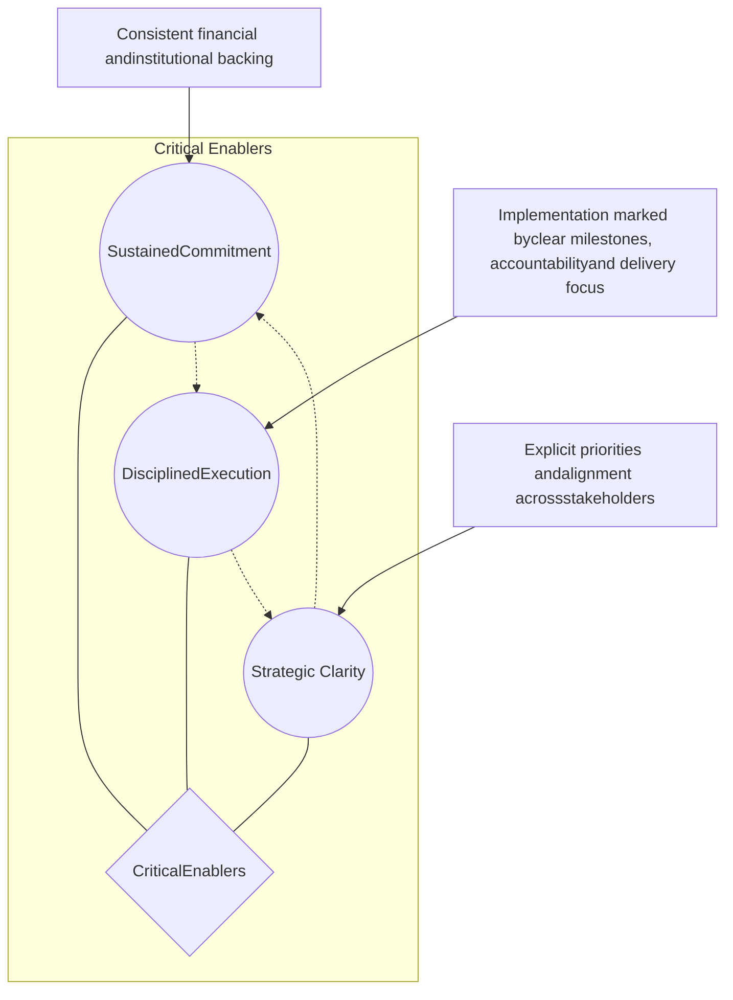
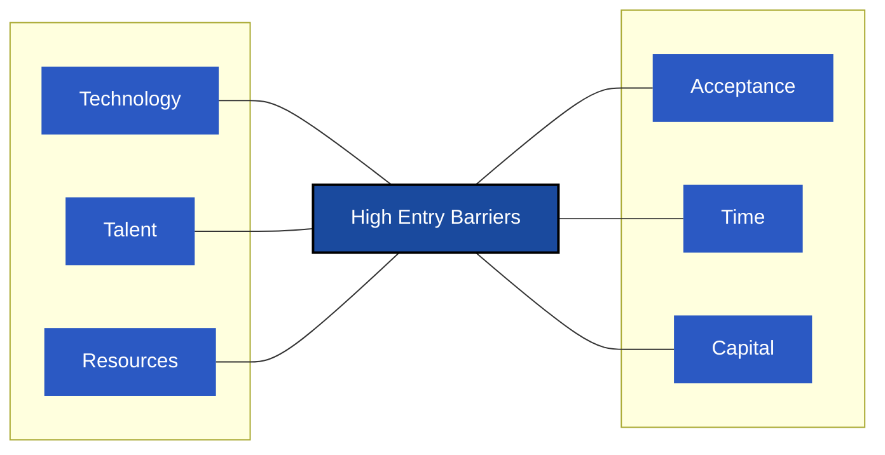

NITI Aayog and NITI Frontier Tech Hub logos NITI Frontier Tech Hub logo

# Future of India’s
# Semiconductor
# Industry

May 2026

---

## Disclaimer

This roadmap has been prepared by NITI Frontier Tech Hub (FTH) in consultation with experts and stakeholders. The data used is from secondary sources. Any references to specific organisations, products, services or technologies does not attribute to endorsement but are only for illustrative purposes.

---

# Acknowledgment

W<sub>e</sub> express our sincere gratitude to Shri B.V.R. Subrahmanyam, Former CEO, NITI Aayog, Shri S. Krishnan, Secretary, Ministry of Electronics and Information Technology, Shri. Amitesh Kumar Sinha, Additional Secretary, MeitY & CEO, ISM and Dr. Surinder Singh, Advisor (Technology), ISM for their invaluable contributions. Their guidance has been instrumental in ensuring that the roadmap remains both aspirational in its vision and firmly grounded in present realities.

---

NO_CONTENT_HERE

---

# Expert Contributors

Mr. Akhilesh Tuteja

**Mr. Akhilesh Tuteja**
Head of Clients and Markets, KPMG in India

Mr. Anand Ramamoorthy

**Mr. Anand Ramamoorthy**
VP and Managing Director, Micron India

Mr. Deepak Agarwal

**Mr. Deepak Agarwal**
CVP Silicon Design Engineering and Site Lead at AMD Bengaluru, AMD India

Mr. Gokul V Subramaniam

**Mr. Gokul V Subramaniam**
President, Intel India

Prof. V. Ramgopal Rao

**Prof. V. Ramgopal Rao**
Group Vice-Chancellor, the Birla Institute of Technology and Science (BITS) Pilani

Mr. Shanker Trivedi

**Mr. Shanker Trivedi**
Former Senior Vice President-Enterprise Business, NVIDIA

Mr. Vinod Dham

**Mr. Vinod Dham**
(Father of the Pentium Chip) Advisor to Ministry of Electronics, Government of India

Ms. Vrinda Kapoor

**Ms. Vrinda Kapoor**
Co-Founder and CEO, Bharat Semi

# Lead Contributors

**Ms. Sonica Bajaj**, Partner, Clients and Markets, KPMG in India

**Mr. Abhishek Gupta**, Partner, Clients and Markets, KPMG in India

**Mr. Amit Bhargava**, National Leader, Mining and Metals, KPMG in India

**Mr. Balamurali Radhakrishnan**, Manager, Clients and Markets, KPMG in India

---

NO_CONTENT_HERE

---

circuit board graphic

# Message

One of the biggest strategic risks to Viksit Bharat is a growing dependence on imported black-box technologies. For India to become a developed nation, technological sovereignty is foundational. And that sovereignty must begin at the infrastructure layer. Semiconductors sit at the heart of this foundation, powering everything from AI, defence and manufacturing to mobility, energy systems, communications and citizen services.

Ashok Kumar Lahiri portrait

India has already covered important ground. The India Semiconductor Mission, early investments in design, manufacturing and packaging and deepening partnerships with the US, Japan and Europe have created strong momentum. The progress has been faster than many expected. The next decade will be critical in converting this momentum into durable national capability.

The NITI Frontier Tech Hub roadmap sets out a clear ambition for India's semiconductor future. It identifies a practical and phased pathway to get there. It recognises that India cannot do everything at once and therefore must choose a few strategic priorities and go deep—whether in design, advanced packaging, compound semiconductors or other emerging opportunities where India can leapfrog parts of the global value chain.

At NITI Aayog, our focus is to move strategy to action. This roadmap is designed with that intent. It identifies the key priorities for the next ten years, the enabling conditions required and the opportunities where India can build leadership rather than remain a downstream participant. The task ahead is to align government, industry, academia, startups and global partners behind a shared national mission. India has the conviction, capability and urgency to make this happen.

**Ashok Kumar Lahiri**
Vice Chairman
NITI Aayog

---

# Message

Photograph of Rajiv Gauba

India’s ability to build a resilient semiconductor ecosystem will be central to sustaining high growth, deepening industrial competitiveness and securing strategic autonomy. In an era of geopolitical uncertainty, supply-chain realignment and accelerating technology competition, semiconductors are no longer just components; they are the foundational infrastructure powering AI, telecom, electric mobility, defence, healthcare, digital infrastructure and advanced manufacturing. Reducing semiconductor import dependence and building trusted domestic capabilities is, therefore, a critical imperative for Viksit Bharat.

The Future of India's Semiconductor Industry roadmap, developed by the NITI Frontier Tech Hub, provides a timely and practical pathway for India to move from aspiration to execution. It rightly focuses on areas where India can leapfrog and become globally competitive—advanced packaging, compound semiconductors and design leadership and more. Its five strategic pillars—Pioneering, Policy and Investment, Production, People and Partnership—offer a phased, actionable framework for government, industry and academia to work together with clarity, urgency and discipline. The opportunity is significant, but the window will not remain open indefinitely. India must act now to convert semiconductors from a strategic vulnerability into a source of national strength.

**Rajiv Gauba**
Member
NITI Aayog

---

# Foreword

Photograph of S. Krishnan

MeitY has been at the forefront of one of India's most consequential industrial missions: building a domestic semiconductor ecosystem that is resilient, globally competitive and strategically sovereign. Through the India Semiconductor Mission (ISM), significant ground has been covered. Commitments for India's first fabrication facility at Dholera, investments in assembly, testing and packaging, the Design Linked Incentive scheme for fabless companies and deepening technology partnerships with the United States, Japan and the European Union all reflect the seriousness and scale of intent with which the Government of India has approached this mission.

With ISM 2.0 announced in the Union Budget 2026, the Ministry now enters a more demanding phase, one focused on ecosystem deepening rather than ecosystem initiation. The priorities have sharpened: advanced packaging, compound semiconductors, critical design infrastructure, longterm capital mobilisation and the institutional governance necessary to sustain momentum over the long haul.

The Future of India's Semiconductor Industry roadmap arrives at precisely the right moment. Developed through NITI Aayog's Frontier Tech Hub, it provides the Ministry with a structured, actionable framework that directly complements and reinforces our ongoing work. At its core, the roadmap is organised around five mutually reinforcing pillars: Pioneering, Policy and Investment, Production, People and Partnership, that together provide a comprehensive architecture for building a globally competitive indigenous ecosystem. This framework sets out the necessary enablers to strengthen R&D capabilities in next-generation materials, while recommending the tactical leverage of agentic AI to deepen expertise across the design and packaging lifecycle. Its ambition to position India among top three hubs for OSAT and advanced packaging closely aligns with India's inherent strength. Unlocks articulated in this roadmap to realise these objectives, along with a strong emphasis on holistic skill development, offer valuable inputs as MeitY refines the implementation design of ISM 2.0.

The Ministry welcomes this roadmap as a rigorous, forward-looking contribution to India's semiconductor dialogue. With sustained policy commitment, coordinated execution and the kind of strategic clarity this roadmap articulates, India is well positioned to convert its semiconductor ambition into enduring industrial and strategic reality.

**S. Krishnan**
Secretary, MeitY

---

# Foreword

Photograph of Nidhi Chhibber

Among the many imperatives that will shape the journey to Viksit Bharat, few are as strategically consequential as building a sovereign and resilient semiconductor ecosystem. Semiconductors are no longer merely components in an electronic device but the foundational currency of geopolitical power, economic competitiveness and national security in the 21st century.

The Government of India has recognised this reality with decisive clarity. Through the India Semiconductor Mission (ISM), India signalled its intent to become an active architect of its own technological destiny. The early results have been encouraging, with investments committed in fabrication, assembly, testing and packaging. India's formidable design talent, which already accounts for nearly one-fifth of the global semiconductor design workforce, provides the country with a distinct and enduring advantage.

The window of strategic opportunity that is currently open, driven by global supply chain realignment, the China-plus-one imperative and the accelerating fragmentation of the old-world order of centralized chip production—will not remain open indefinitely.

It is in this context that this roadmap, Future of India's Semiconductor Industry, assumes particular significance. Drawing on the collective wisdom of an eminent Expert Council comprising leaders from across industry and other institutions of national and global standing, this roadmap charts a clear-eyed vision for what India must aspire to by 2035 and, more importantly, how it can get there.

NITI Aayog remains committed to working alongside the Centre and state governments, industry and academia to translate this strategic vision into time-bound, measurable outcomes. The cost of inaction is not merely economic but strategic. The nation needs to secure its own supply of semiconductors to fully secure its defence systems, its digital public infrastructure, or its long-term economic sovereignty.

This roadmap is an invitation to policymakers, investors, technologists and institution builders to act with the urgency and ambition that this decisive decade demands.

**Nidhi Chhibber**
CEO, NITI Aayog

---

Abstract engineering drawing of circuit lines and nodes

# Foreword

Photograph of Debjani Ghosh

As semiconductors become the foundation of modern economic power, national security, digital sovereignty and technological competitiveness, resilience across the semiconductor supply chain will be central to India’s national resilience. Chips now underpin defence systems, telecom networks, energy infrastructure, mobility, healthcare, AI and digital public infrastructure. Securing trusted access to them is therefore not only an industrial priority, but a strategic necessity.

India has taken important early steps through the India Semiconductor Mission. Investments in fabrication, assembly, testing and packaging, along with India’s deep design talent base, provide a strong foundation. Yet, as the technology landscape continues to evolve rapidly, India must look ahead to identify emerging opportunities to leapfrog, rather than only strengthening its ability to catch up.

This roadmap makes a timely case for such foresight. Future value in semiconductors will increasingly come from advanced packaging, chiplets, heterogeneous integration, compound semiconductors, wide-bandgap materials such as SiC and GaN, specialised chips for AI and 5G/6G and system-level design. These are the opportunities India must recognise early and act upon decisively.

The challenge is not merely to participate in the global ecosystem, but to become indispensable to it. India must build on its structural strengths—design talent, software capability, engineering depth, domestic demand, materials potential and trusted partnerships—while investing in frontier R&D, advanced OSAT, critical materials, semiconductor IP, skilled talent and long-term institutional capacity.

I extend my sincere gratitude to the experts and practitioners who contributed to this roadmap. Their collective insight has helped shape an ambitious yet grounded agenda that can play an important role in India’s journey towards semiconductor leadership.

**Debjani Ghosh**
Distinguished Fellow
NITI Aayog

---

NO_CONTENT_HERE

---


Future of India’s Semiconductor industry

13

NITI Aayog logo

NITI Frontier Tech Hub logo

# Executive Summary

Semiconductors sit at the core of modern economic power. They serve as the critical backbone powering artificial intelligence, telecommunications, electric mobility, defence systems, healthcare technologies and digital public infrastructure. Given their pivotal role in technology-driven advancements, semiconductors are not just strategic assets but central to economic resilience and national security. They are imperative to India’s aspiration to become a developed nation by 2047. With intensifying geopolitical pressures and technology competition leading to the fragmentation of global supply chains, building domestic capabilities to design, manufacture and integrate semiconductors will decisively shape India’s future growth and strategic autonomy.

## A Rapidly Evolving Demand Landscape

The global semiconductor industry is entering a phase of sustained, technology-led expansion. This transition is largely driven by artificial intelligence (AI)-centric computing, 5G/6G networks, electric vehicles, data centres, industrial automation and edge intelligence. Demand is moving beyond general-purpose chips toward specialised architectures, accompanied by a growing emphasis on advanced packaging, heterogeneous integration and system-level performance. By 2035, the global semiconductor market is expected to exceed USD 1.5 trillion<sup>1</sup>. India’s semiconductor demand is growing even faster, underpinned by strong domestic consumption across electronics, automotive, telecom, energy and defence. The country’s semiconductor market is projected to reach around USD 200 billion<sup>1</sup> by 2035. However, despite the growing domestic demand, nearly 90–95 per cent<sup>2</sup> of this demand is currently met through imports, leading to large foreign exchange outflows and increasing the vulnerability of critical sectors to supply-chain disruptions. This widening gap between demand growth and limited domestic capability represents a critical strategic vulnerability and yet also a historic opportunity.

## Government of India’s Push and ISM 2.0

Recognising this imperative, the Government of India (GoI) has taken decisive steps through the India Semiconductor Mission (ISM) to nurture domestic capabilities across design, manufacturing and ecosystem development. Initial traction has been gained in mobilising investments in fabrication, assembly and testing, as well as in strengthening India’s already significant design talent base. Building on this momentum, the Union Budget 2026 announced ISM 2.0, signalling a clear transition from ecosystem initiation to ecosystem deepening and scale-up. ISM 2.0 sharpens its focus on advanced packaging, compound semiconductors, critical design infrastructure, policy stability and long-term capital mobilisation. This underscores the reality that semiconductor leadership requires sustained, mission-mode commitment over a decade or more.

1

<sup>1)</sup> Estimates based on inputs from experts

<sup>2)</sup> India’s semiconductor market value to reach USD108 billion by 2030, India Briefing, 16 April 2025


---


Future of India’s Semiconductor industry 14

NITI Aayog logo NITI Frontier Tech Hub logo

# Vision 2035: Becoming Indispensable, Not Imitative

Winning the semiconductor race will not be easy if India continues to run the existing race; instead, it should shift gears and target becoming the ecosystem player that the global semiconductor industry cannot run without. This requires India to pivot away from the catch-up game in the foundry race and focus on winning the “More-than-Moore” era, where advanced packaging, system integration and manufacturing scale matter as much as transistor nodes. compound semiconductors such as Silicon Carbide (SiC) and Gallium Nitride (GaN). Together, they will power India’s automotive, energy, industrial, telecom and strategic sectors—ensuring that technologies critical to India’s future are built on Indian soil. When it comes to advanced-node capability, the strategy most suitable for India is a selective and pragmatic approach aligned with national interest.

By 2035, India should target building a USD 120-150 billion semiconductor value chain by choosing leadership and purpose over participation. Instead of chasing the global wafer race from behind, India should define its own pathway—one that is not only distinct but shaped by strategic self-sufficiency, ecosystem strength and global indispensability. At the same time, India will play to its greatest strengths, including its design talent, high-quality workforce and materials and chemistry ecosystem potential. Building on these advantages, it should aim to emerge as a global leader in semiconductor design and system architecture, a top-three destination for outsourced semiconductor assembly and test (OSAT) and advanced packaging and a trusted supplier of critical semiconductor materials, particularly wide-bandgap and advanced packaging materials. In these domains, India should aspire to set standards, shape supply chains and create enduring global dependence, rather than limit itself to mere participation.

At the core of this vision is a resilient and disciplined manufacturing foundation, anchored by world-class fabs that focus on what matters most to India’s economy and strategic autonomy: mature-node logic, specialty analog and mixed-signal chips and

## Exhibit 1: India’s semiconductor vision

<table>
  <thead>
    <tr>
        <th>Strategic Pillars</th>
        <th>Vision 2035</th>
        <th>Strategic Goals</th>
    </tr>
  </thead>
  <tbody>
    <tr>
        <td>Strategic self-sufficiency</td>
        <td rowspan="3">USD 120-150 Billion<br/>Semiconductor Value Chain<br/>(2035)</td>
<td>Dominance in mature node and compound semiconductors; pursuit of advanced nodes aligned with strategic relevance</td>
    </tr>
<tr>
        <td>Ecosystem strength</td>
<td>Building expertise in design and system architecture to drive innovation</td>
    </tr>
<tr>
        <td>Global indispensability</td>
<td>Top-three destination for OSAT and advanced packaging</td>
    </tr>
  </tbody>
</table>

This vision positions India not just as a manufacturing location, but as a central pillar of the global semiconductor ecosystem—where chips are designed, integrated, packaged, powered and made ready for the world. Through focus, scale and strategic clarity, India will transform semiconductors from an import dependency into a source of economic strength, technological sovereignty and global influence.

2


---


NITI Aayog logo

15 Future of India’s Semiconductor industry

NITI Frontier Tech Hub logo

# Strategy to Achieve the Vision by 2035

Realising this ambition requires deliberate choices about where India competes and how it allocates capital, talent and policy attention. While leadership in advanced-node wafer manufacturing remains a long-term aspiration, establishing strong dominance in mature and compound nodes should be a near-term priority. In addition, India should aim to secure self-reliance for domestic demand while aggressively targeting a top-three global position in advanced packaging. Simultaneously, India should strive to integrate itself into the core of global semiconductor supply chains by emerging as a critical global supplier of wide-bandgap materials such as SiC and GaN. Overall, India’s strategy is anchored in five mutually reinforcing pillars (Exhibit 3).

## A Decisive Decade Ahead

Semiconductors represent one of the most consequential industrial opportunities of the coming decade for India. While the cost of inaction is clear—rising import dependence, strategic vulnerability and lost value creation—the opportunity is equally profound. With sustained commitment, disciplined execution and strategic clarity (Exhibit 2), India can secure its place as an indispensable node in the global semiconductor ecosystem. This, in turn, will enable the conversion of semiconductor capability into enduring economic and strategic advantage.

**Exhibit 2: Critical enablers capable of shaping India’s ascent**



3


---

Exhibit 3: Five strategic pillars strategy to strengthen the indigenous ecosystem

```mermaid
graph TD
    Start(( )) --> Pioneering
    Pioneering --> Policy_and_Investment
    Policy_and_Investment --> Production
    Production --> People
    People --> Partnership
    Partnership --> End(( ))

    subgraph Pioneering
        P1[1. Sovereign Access to EDA, IP and MPW Infrastructure]
        P2[2. National Design and Packaging Co-Design Platform]
        P3[3. Design-to-Deployment Market Anchoring]
        P4[4. AI-Enabled Semiconductor Engineering Mission]
        P5[5. National Frontier Semiconductor Research Programme]
        P6[6. Strategic Semiconductor IP and Patent Programme]
    end

    subgraph Production
        PR1[1. Production Governance, Scale and Global Integration]
        PR2[2. Advanced Packaging and OSAT as a National Differentiator]
        PR3[3. Materials, Substrates and Upstream Manufacturing]
        PR4[4. Wafer Fabrication Strategy: Scale Where India Has Structural Advantage]
        PR5[5. Secure and Mission Critical Manufacturing]
    end

    subgraph Policy_and_Investment [Policy and Investment]
        PI1[1. Institutional Governance and Policy Stability]
        PI2[2. Full Stack Incentive and Risk Sharing Regime]
        PI3[3. Demand Creation and Market Anchoring]
        PI4[4. National Semiconductor Capital Framework]
        PI5[5. Export Enablement and Global Market Access]
    end

    subgraph People
        PE1[1. National Semiconductor Talent Pyramid]
        PE2[2. Fab Ready Technician Pipeline Scale and Reliability]
        PE3[3. Institutional Coordination and Talent Governance]
        PE4[4. Engineering Talent for Design, Manufacturing and Advanced Packaging]
        PE5[5. Global Talent Infusion and Solution Architects]
        PE6[6. Advanced Research and Materials Talent]
    end

    subgraph Partnership
        PA1[1. Strategic Geopolitical and Trusted Nation Partnerships]
        PA2[2. Partnership Governance and Execution]
        PA3[3. Talent, Academic and Institutional Partnerships]
        PA4[4. Industrial and Supply Chain Partnerships]
        PA5[5. Technology and R&D Partnerships for Frontier Capability]
        PA6[6. Critical Minerals and Upstream Resource Partnerships]
    end
```



4


---

# Table of Contents

PAGE 01 Executive summary icon # Executive summary

01 Semiconductor landscape image ## Semiconductor Landscape by 2035
PAGE 05

## Semiconductor Imperative: Why We Must Act NOW
PAGE 09 02 Semiconductor imperative image

What should our aspirations be image ## What Should Our Aspirations Be: Vision 2035
PAGE 12

## Building the Ecosystem: No Easy Task
PAGE 14 04 Building the ecosystem image

05 India's semiconductor roadmap image ## India’s Semiconductor Roadmap
PAGE 19

## Conclusion
PAGE 38 06

**Annexure: Global Semiconductor Incentive Policy Analysis** Arrow icon PAGE 39

**Abbreviations** Arrow icon PAGE 46

**Glossary** Arrow icon PAGE 50

---

NITI Aayog logo NITI Frontier Tech Hub logo

## Chapter 01

# Semiconductor Landscape by 2035

Semiconductors are the foundation of technologies driving the future, including AI, the Internet of Things (IoT) and the expansion of 5G/6G networks. In addition, rising computational demands from data centres and cutting-edge innovations such as autonomous vehicles and quantum computing are creating unprecedented demand for semiconductors. As electronic components become critical across industries and the digital revolution enters its next phase, the importance of semiconductors will continue to grow.

The global semiconductor value chain is highly interconnected, with crucial activities spread across regions that specialise in them. However, this deeply interdependent value chain has exposed vital industries to significant vulnerabilities in the past, stemming from natural disruptions and geopolitical tensions, prompting major countries to accelerate efforts to build resilient local ecosystems.

**Table 1: Semiconductors across key end-use sectors**

<table>
  <thead>
    <tr>
        <th>Sector</th>
        <th>What Is Changing</th>
        <th>Role of Semiconductors</th>
        <th>Specialised Chips Required</th>
    </tr>
  </thead>
  <tbody>
    <tr>
        <td><strong>Automotive</strong></td>
<td>EVs, ADAS, software-defined vehicles</td>
<td>Chips control power, sensing, compute and autonomy, making silicon the core vehicle architecture</td>
<td>SiC/GaN power devices, ADAS/AI SoCs, sensor ICs, automotive MCUs</td>
    </tr>
<tr>
        <td><strong>Consumer Electronics</strong></td>
<td>AI-native, immersive devices</td>
<td>SoCs and edge-AI chips define device intelligence, performance and differentiation</td>
<td>Advanced SoCs, edge-AI NPUs, memory, image &amp; RF chips</td>
    </tr>
<tr>
        <td><strong>Telecom (5G/6G)</strong></td>
<td>Ultra-low latency, massive connectivity</td>
<td>RF and baseband chips set network capacity, energy efficiency and signal fidelity</td>
<td>RF front-end (GaN/SiGe), baseband processors, photonic IO</td>
    </tr>
<tr>
        <td><strong>Computing and Data Centres</strong></td>
<td>AI-first, hyperscale computing</td>
<td>Accelerators, chiplets and HBM determine AI scale, cost and energy limits</td>
<td>AI accelerators, HBM, chiplets, high-speed interconnects</td>
    </tr>
<tr>
        <td><strong>Industrial and Manufacturing</strong></td>
<td>Industry 4.0, automation</td>
<td>Industrial chips form the real-time control and decision layer of smart factories</td>
<td>Industrial MCUs, edge-AI, motor-control &amp; power chips</td>
    </tr>
  </tbody>
</table>

5


---

NITI Aayog logo NITI Frontier Tech Hub logo

<table>
  <tbody>
    <tr>
        <td><strong>Power &amp; Energy</strong></td>
<td>Electrification, renewables, smart grids</td>
<td>Power semiconductors govern efficiency, conversion and grid stability</td>
<td>Wide-bandgap power semiconductors (SiC/GaN), grid ICs</td>
    </tr>
<tr>
        <td><strong>Defence &amp; Aerospace</strong></td>
<td>Autonomous, network-centric systems</td>
<td>Trusted chips underpin sensing, secure comms, guidance and decision superiority</td>
<td>Radiation-hardened processors, secure SoCs, RF &amp; power chips</td>
    </tr>
<tr>
        <td><strong>Healthcare</strong></td>
<td>Digital diagnostics, precision care</td>
<td>Sensors and processors are the intelligence core of diagnosis and monitoring</td>
<td>Medical sensors, low-power processors, edge-AI biochips</td>
    </tr>
<tr>
        <td><strong>Agriculture</strong></td>
<td>Precision, data-driven farming</td>
<td>Chips convert field data into edge intelligence for farm-level decisions</td>
<td> </td>
    </tr>
  </tbody>
</table>

Exhibit 4: Global semiconductor market (USD Bn) by 2035

<table>
  <thead>
    <tr>
        <th>Year</th>
        <th>Market Size (USD Bn)</th>
    </tr>
  </thead>
  <tbody>
    <tr>
        <td>2024</td>
<td>631</td>
    </tr>
<tr>
        <td>2030P</td>
<td>1,029</td>
    </tr>
<tr>
        <td>2035P</td>
<td>1,547</td>
    </tr>
  </tbody>
</table>

Source: Semiconductor Industry Association (SIA). Note: Semiconductor sales as per SIA are considered as market size and it is assumed that global semiconductor sales will grow at a CAGR of 8.5 per cent. Projections are based on this CAGR. P stands for projection.

Close-up photograph of a blue printed circuit board (PCB) with various electronic components and traces

6


---

NITI Aayog logo NITI Frontier Tech Hub logo

The global semiconductor market grew at a compounded annual growth rate (CAGR) of 6.5 per cent<sup>1</sup> between 2014 and 2024 and is expected to grow at a slightly higher CAGR of 8.5 per cent<sup>2</sup> over the next 5 to 10 years, underpinned by next-generation, technology-led growth drivers. Parallel to the global semiconductor industry’s rapid surge, India’s semiconductor demand is also on an accelerated growth path. It is projected to grow at a CAGR of 19 per cent, reaching around USD 90 billion by FY2030 and potentially expanding further to over USD 200 billion by FY2035 if this momentum continues.

Exhibit 5: India’s semiconductor demand trajectory is underpinned by strong surge in demand from electronics manufacturing, accelerated rollout of data centres and cloud infrastructure, rising semiconductor content in automotive, particularly electric vehicles and ADAS and the widespread adoption of AI across consumer devices and enterprise workloads

<table>
  <thead>
    <tr>
        <th>Year</th>
        <th>Electronics production (USD, Bn)</th>
        <th>Total semiconductor demand (USD, Bn)</th>
    </tr>
  </thead>
  <tbody>
    <tr>
        <td>FY23</td>
<td>103</td>
<td>28</td>
    </tr>
<tr>
        <td>FY24</td>
<td>115</td>
<td>32</td>
    </tr>
<tr>
        <td>FY25</td>
<td>134</td>
<td>37</td>
    </tr>
<tr>
        <td>FY26 E</td>
<td>159</td>
<td>44</td>
    </tr>
<tr>
        <td>FY28F</td>
<td>267</td>
<td>73</td>
    </tr>
<tr>
        <td>FY30F</td>
<td>317</td>
<td>87</td>
    </tr>
<tr>
        <td>FY35F</td>
<td>750</td>
<td>206</td>
    </tr>
  </tbody>
</table>

Source: Estimates based on inputs from experts; Figures are rounded off.

The global semiconductor landscape is entering a transformative phase, driven not just by advances in AI, telecommunications (5G/6G), IoT and electric mobility, but by the fundamentally different types of chips these technologies demand. The shift toward AI accelerators such as GPUs, NPUs and domain specific processors is redefining semiconductor design requirements, pushing the industry beyond traditional logic chips toward heterogeneous, application optimised architectures. This transition is triggering profound changes across the semiconductor value chain, from the materials used (advanced nodes, compound semiconductors and wide bandgap materials) to manufacturing processes (specialised fabrication, co-design with software and energy efficient nodes) and increasingly to advanced packaging techniques, such as chiplets, 2.5D/3D integration and system in package solutions. As performance, power efficiency and scalability become more dependent on packaging and integration rather than pure transistor scaling, semiconductors are evolving from standalone components into tightly integrated systems that underpin the digital economy. This structural shift presents a timely opportunity for India to leapfrog legacy stages and position itself as a competitive force across critical segments of the global semiconductor supply chain.

To realise this opportunity, India needs to move beyond being a downstream consumer to becoming a co-creator of frontier technologies that will shape global compute leadership. This calls for building capabilities in design, advanced packaging and strategic manufacturing.

<sup>1)</sup> Semiconductor Industry Association (SIA)

<sup>2)</sup> Estimates based on inputs from experts

7


---


NITI Aayog logo

NITI Frontier Tech Hub logo

Exhibit 6: Prospective trajectory of the semiconductor landscape

# Key Factors Defining the Semiconductor Landscape

**How is the Demand for Semiconductor Evolving**

* Surge in demand for high performance computing

* Quantum computing and edge use cases are gaining prominence

* Purpose-built silicon across industry verticals (a shift away from one-size-fits-all chip architectures toward application-specific integrated circuits (ASIC))

* Explosion of AI workloads across consumer devices, industrial automation, healthcare and autonomous systems

* Massive device interconnectivity (IoT, autonomous systems and smart cities)

down arrow icon

**How is the Industry Responding**

* Miniaturisation evolves into an era of material science and heterogeneous integration

* Thermal management and energy efficiency take centre stage as node sizes approach 2nm, leading to advances in material science—SiC, GaN, graphene and 2D materials

* Innovations in 3D-packaging and chiplets create new pathways to performance

* Quantum materials and neuromorphic architectures begin to mature, offering glimpses into the next frontier of computing

down arrow icon

**Potential Opportunities for India to Leapfrog**

* AI-powered energy-efficient chip design and IPs for next-generation networks and smart devices

* Investing in next-generation quantum and neuromorphic computing architectures for advanced performance

* GaN and SiC-based chips for EVs, renewable energy and telecom infrastructure

* Advanced Packaging & Chiplets

* Specialised RF chips catering to interconnectivity needs across wireless communication systems (including 5G/6G, IoT, radar and satellite links)

With strategic foresight and bold strategies, India can position itself to leapfrog in the semiconductor value chain.

8


---


NITI Aayog logo

NITI Frontier Tech Hub logo

## Chapter 02

# Semiconductor Imperative: Why We Must Act NOW

India’s semiconductor landscape is undergoing a significant transformation, supported by government initiatives such as ISM. The country’s first fabrication plant is expected to commence production by 2028<sup>1</sup>. While leading firms are committing investments in the assembly and packaging segment, global fabless design majors have their captive design centres in India, leveraging the country’s deep pool of skilled professionals, who account for 20 per cent<sup>2</sup> of the global semiconductor design workforce.

India’s semiconductor manufacturing is at a nascent stage, resulting in a heavy reliance on imports to meet domestic demand.

With chips becoming the foundation of everything from smartphones to defence systems, countries are racing globally to build semiconductor self-sufficiency. Rising geopolitical tensions, supply-chain vulnerabilities and the strategic importance of chip technology are majorly driving this global push. For India, the urgency is even greater due to four reasons (Exhibit 7).

Although the initial progress is encouraging,

Exhibit 7: Why building domestic ecosystem is urgent priority

Why Building Domestic Ecosystem Is Urgent Priority?

Significant Import Dependence

National Security Risk

Drain on Forex

Societal Upliftment

Close-up of a semiconductor circuit board

9

<sup>1)</sup> India's first semiconductor fab in Gujarat's Dholera by 2028, Moneycontrol , 31 March 2026

<sup>2)</sup> Ministry of Electronics and Information Technology


---


NITI Aayog logo

Frontier NITI Tech Hub logo

## 2.1. Significant Import Dependence

India’s local ecosystem is not ready to fully meet domestic demand for semiconductors—90-95 per cent<sup>3</sup> of the current consumption is met through imports. Compounding the risk, global semiconductor supply is currently concentrated in a handful of countries. As a result, disruptions in the operations of major semiconductor firms and natural disasters in countries such as Taiwan and China, considered a crucial link in the value chain, could trigger a shortage of semiconductors, as seen during the Covid-19 pandemic. This could in turn expose crucial industries—such as automobiles, consumer electronics, healthcare, defence, among others—that heavily rely on semiconductors to any untoward disruptions in the global supply chain. As the share of electronic components in these sectors increases, the economic cost of such disruptions will only intensify. Importantly, ensuring the indigenous availability of semiconductors is imperative for building a robust domestic electronics manufacturing ecosystem.

## 2.2. National Security Risk

Chips have become increasingly important to national security and defence programmes. As many semiconductor parts used in defence systems are produced outside India, deploying them in our aerospace and defence programmes is increasing threats to national security. For instance, electronic systems within our defence platforms, along with unmanned aerial vehicles (UAVs), naval and airborne platforms, depend on semiconductor imports. As India enhances its defence capabilities through modernisation, it will require a reliable source of semiconductors, preferably the domestic one that is well positioned to safeguard the autonomy of our defence programmes.

Abstract digital circuit board illustration

10

<sup>3)</sup> India’s semiconductor market value to reach USD108 billion by 2030, India Briefing, 16 April 2025


---

NITI Aayog logo

NITI Frontier Tech Hub logo

## 2.3. Drain on Forex

India’s heavy reliance on imported semiconductor products has led to sizeable foreign exchange outflows over the years. India, for instance, cumulatively spent almost USD 150 billion<sup>4</sup> on importing crucial semiconductor products during FY17-FY25. With demand for advanced technologies expected to rise, a substantial increase in semiconductor imports is indispensable. India’s imports of semiconductor products grew at a CAGR of 23 per cent between FY17 and FY25, and if this pace persists, the annual import cost could increase to USD 240 billion<sup>5</sup> by 2035.

Exhibit 8: India’s imports of semiconductor products steadily increase

<table>
  <thead>
    <tr>
        <th>Fiscal Year</th>
        <th>Imports (USD, Bn)</th>
    </tr>
  </thead>
  <tbody>
    <tr>
        <td>FY17</td>
<td>5.7</td>
    </tr>
<tr>
        <td>FY18</td>
<td>7.1</td>
    </tr>
<tr>
        <td>FY19</td>
<td>11.9</td>
    </tr>
<tr>
        <td>FY20</td>
<td>12.8</td>
    </tr>
<tr>
        <td>FY21</td>
<td>11.9</td>
    </tr>
<tr>
        <td>FY22</td>
<td>21.6</td>
    </tr>
<tr>
        <td>FY23</td>
<td>19.9</td>
    </tr>
<tr>
        <td>FY24</td>
<td>28.7</td>
    </tr>
<tr>
        <td>FY25</td>
<td>30.3</td>
    </tr>
  </tbody>
</table>

Source: Ministry of Commerce and Industry; Notes: HS codes of 8541 and 8542 are used for this analysis

## 2.4. Societal Upliftment

Next-generation telecom technologies such as 5G and 6G promise to bridge the digital divide and democratise access to essential services. These technologies can help expand rural connectivity, enable the delivery of remote healthcare solutions in underserved regions and support precision-driven smart agriculture. However, the affordability of 5G/6G-enabled

devices is a prerequisite to realising these benefits. The societal benefits of advancements in telecom technologies can be made accessible to the masses by lowering the cost of 5G/6G-enabled handsets. The role that India-made chips can play in this effort will be decisive.

> Growth icon
> Despite their critical role in driving economic growth and societal upliftment, semiconductors are often viewed through the narrow lens of software and technology. Recognising the pivotal role of semiconductors and sustaining their growth is vital to cementing India’s position in the global value chain and building an inclusive, resilient society—both indispensable to accelerating India’s journey towards ‘Viksit Bharat 2047’.

11

<sup>4)</sup> Ministry of Commerce and Industry

<sup>5)</sup> Estimates derived from the CAGR of imports of HS codes 8541 and 8542


---


NITI Aayog logo

NITI Frontier Tech Hub logo

## Chapter 03

# What Should Our Aspirations Be: Vision 2035

India is well positioned as a formidable contender in the global semiconductor race, underpinned by robust technical expertise, vast domestic demand for electronics and a forward-looking policy ecosystem. Meaningful progress has already been made, driven by initiatives like ISM, which have helped build capabilities across design, manufacturing and innovation. Carrying this momentum further, India should strive to achieve self-sufficiency in meeting domestic demand and emerge as a strategic node in the global semiconductor supply chain.

## Potential Outcomes 2035

**Pioneering design capabilities in frontier technologies**
* Lead frontier chip design for AI, quantum and HPC using local AI talent, targeting 100+ advanced IPs by 2035
* Build expertise in advanced packaging across CoWoS, HBM-logic integration, PMP, FOWLP, etc.
* Build expertise in next generation material usage for semiconductor manufacturing

**Significant global player**
* 10-13 per cent of the global chip market
* Become the top 3 global destination for advanced OSAT capacity
* Become the top supplier and own the wide-bandgap materials wave (SiC & GaN)

**Pursuit of self-sufficiency**
* Chip self-sufficiency of 15-25 per cent of local demand by 2030 and 35-50 per cent by 2035
* Create value self-sufficiency of 35 to 40 per cent by 2030 and 55 to 70 per cent by 2035 in the semiconductor supply chain by targeting to become USD 120-150 billion industry by 2035

**Differentiation through low-cost, locally relevant chip**
* Build chips for affordable 5G/6G phones, edge CPUs, micro controllers, sensors (camera) and charger ICs, targeting exports to 50+ nations

12


---


NITI Aayog logo

NITI Frontier Tech Hub logo

# Potential outcome 1: Pioneering Chip Design for Frontier Technologies

India should aspire to emerge as a global hub for frontier semiconductor innovation by leading advanced chip design for AI, quantum and high-performance computing, with an ambition to create more than 100 breakthrough IPs by 2035. With the north star of achieving self-sustenance in the entire semiconductor value chain, India should focus on creating a differentiation and niche in areas where value is shifting fastest and where entry barriers are lower. Some of these areas include advanced packaging and advanced material science.

# Potential outcome 2: Emerge as a Significant Global Player

India should aspire to account for at least 10-13 per cent of the global semiconductor market, building the foundation for a USD 200 billion industry by 2035. This vision reflects a bold national ambition to scale innovation, manufacturing and design leadership, positioning India as a pivotal force in the future global semiconductor landscape.

To achieve this objective, India needs to pick the right battleground and rather than playing the catching up game in the wafer race, it should prioritise building proficiency in areas where India has the potential to outshine and which are potential choke points in the current supply chain. It should have a laser sharp focus to become the top three global destination for advanced packaging and becoming the top supplier of wide bandgap material like SiC and GaN and become an indispensable part of the semiconductor supply chain.

# Potential outcome 3: Pursuit of Self-Sufficiency

While manufacturing every chip at home remains the long-term goal, India should start with building strong capabilities on mature and compound nodes and target achieving self-sufficiency for India in these segments. India should target chip self-sufficiency of 15-25 per cent of local demand by 2030 and 35-50 per cent by 2035. It should also ensure that most of the value in every chip flows through India be it through chip design, advanced packaging or critical material supply. India should target 35-40 per cent of value retention by 2030 and 55-70 per cent by 2035 for every chip consumed in India.

# Potential outcome 4: Differentiation Through Low-Cost, Locally Relevant Chips

India will become a global hub for high-volume, high-quality semiconductor products by designing and manufacturing chips for affordable 5G/6G phones, edge CPUs, microcontrollers, sensors and charger ICs. This vision aims to power mass market innovation at scale and position India as a trusted exporter to more than 50 nations.

13


---


NITI Aayog logo

NITI Frontier Tech Hub logo

## Chapter 04

# Building the Ecosystem: No Easy Task

While the urgency to build the domestic semiconductor ecosystem is apparent, achieving it is far from easy. The evolution of the semiconductor ecosystem faces six challenges (Exhibit 9), which act as significant entry barriers.

**Exhibit 9: Key challenges for the semiconductor ecosystem**



### 4.1. Technological Complexities Acting as a Barrier to Advancement

The chip design process has become increasingly complex due to the rise of AI applications, which demand compute-intensive chips to power GPUs and high-performance computing systems. High licensing costs of EDA tools and their steep learning curves limit the ability of small firms to scale innovation by depriving them of access to critical design infrastructure. In addition, design teams face the challenge of keeping pace with new process nodes and architectures to adapt to evolving performance, power and integration requirements of advanced systems.

Photograph of a person in a cleanroom environment working on electronic components with white gloves

14


---

NITI Aayog logo

NITI Frontier Tech Hub logo

## From Obstacles to Opportunities

AI solutions are helping design firms navigate the intricate design process with remarkable precision and reduce design and R&D costs, while improving time to market performance. By leveraging its deep talent pool in artificial intelligence, India can excel in developing custom design solutions tailored to domestic use cases, driving innovation across sectors like healthcare, agriculture and smart infrastructure.

Simultaneously, quantum technologies offer transformative potential in solving India’s complex challenges—from secure communications to advanced simulations in climate and energy. This will, however, require building capabilities in the design of quantum processors, classical control systems and co-designed quantum architecture. Additionally, power-aware design and modular design are domains that promise to open up enormous opportunities.

Exhibit 10: Key technological innovations driving the semiconductor design process

<table>
  <thead>
    <tr>
        <th>01</th>
        <th>02</th>
        <th>03</th>
        <th>04</th>
        <th>05</th>
    </tr>
  </thead>
  <tbody>
    <tr>
        <td><strong>Custom-design</strong></td>
<td><strong>Quantum computing</strong></td>
<td><strong>AI-driven chips</strong></td>
<td><strong>Power-aware Design</strong></td>
<td><strong>Modular design</strong></td>
    </tr>
<tr>
        <td>Global majors are moving beyond general-purpose solutions to build custom-designed chips tailored for specific applications</td>
<td>Advancements in quantum computing open new frontiers in processing and information technology</td>
<td>AI’s ability to navigate complex, multi-variable design spaces with remarkable precision to shape the future of semiconductor design</td>
<td>Power-aware optimisation at the design stage is central to sustainability and managing thermal constraints</td>
<td>Integration of smaller, specialised chiplets into a single package using 3D stacking or interposers, enabling functional heterogeneity</td>
    </tr>
  </tbody>
</table>

# 4.2. Talent Scarcity—Intricate Tasks Require Specialised Skills

Semiconductor manufacturing involves intricate processes. Lithography—which transfers complex design patterns just nanometres in size onto a silicon wafer—requires an extremely high-level of precision, as even slight deviations in the pattern will render chips useless. Similarly, it is critically important to precisely remove materials from the wafer to create a designed structure, as this process is key to achieving desired performance and speed. Both processes require highly specialised engineers and

technicians. Other supply chain segments such as advanced packaging, testing and fabrication also require specialised skills in which India is currently facing shortages. Similarly, India is lagging significantly behind on R&D infrastructure. While India has a strong talent pool in software and design, its capabilities in hardware R&D are still developing. A greater emphasis on R&D is necessary to innovate in chip design and manufacturing processes that align with global standards.

15


---


NITI Aayog logo

NITI Frontier Tech Hub logo

**Exhibit 11: Future skills for semiconductor success**

# Building the Talent Backbone for India’s Semiconductor Future Semiconductor talent icon

<table>
  <thead>
    <tr>
        <th>Design</th>
        <th>Manufacturing</th>
        <th>Advanced packaging</th>
    </tr>
  </thead>
  <tbody>
    <tr>
        <td>VLSI design</td>
<td>Process engineers<br/>(lithography, etching, deposition, doping/Ion implantation)</td>
<td>2.5D integration</td>
    </tr>
<tr>
        <td>Embedded system design</td>
<td>Cleanroom technicians</td>
<td>3D stacking</td>
    </tr>
<tr>
        <td>AI/ML algorithms</td>
<td>Equipment technicians</td>
<td>Wafer-level packaging</td>
    </tr>
<tr>
        <td>EDA proficiency</td>
<td>Wafer probing and testing</td>
<td>System-in-Package</td>
    </tr>
<tr>
        <td>Analog design</td>
<td>Gas and chemicals<br/>(parts-per-billion purity for semiconductor production)</td>
<td>Flip-chip technology</td>
    </tr>
<tr>
        <td>Verification engineering</td>
<td>Material engineers<br/>(Proficiency in XRD, SEM and AFM)</td>
<td>Embedded die substrate packing</td>
    </tr>
  </tbody>
</table>

## 4.3. High Resource Requirement Pushes Up Operating Costs

The semiconductor manufacturing process is exceptionally energy-intensive, as it requires substantial, uninterrupted power to heat silicon, run lithography tools and sustain cleanroom environments. It is estimated that overall power consumption of the global semiconductor industry is equivalent to around 0.3 per cent<sup>6</sup> of the world’s electricity use. Power consumption tends to increase as manufacturing technology advances—Extreme Ultraviolet (EUV) lithography for instance requires significantly higher electricity than traditional lithography tools. Manufacturing semiconductors also requires thousands of gallons of high-grade water, which is primarily used across different phases to remove residual chemicals and contaminants from the wafer surface, among others. Advanced filtration and recycling systems are necessary to generate water with the required purity levels, which not only adds to process intricacy but also increases operational costs.

16


---

NITI Aayog logo

NITI Frontier Tech Hub logo

# 4.4. Securing Acceptance for Made-in-India Chips: No Easy Task

The global semiconductor supply chain is highly specialised, with a clear division of activities among a handful of countries depending upon their respective strengths. For years, original design manufacturers (ODMs) headquartered in the US—known for their design expertise—have developed design architectures in line with both local and global demand and have factories and packaging units in East Asia to manufacture semiconductors and complete the final stage of production for real-world use. Suppliers from East Asian nations have built strong trust with these ODMs due to decades of their efforts to attain volume reliability and technical performance, which led to entrenched relationships. For India to entrench in this ecosystem, it will require India-made chips to meet rigorous global standards and performance benchmarks, which will take time and sustained efforts.

Exhibit 12: Geographical spread of semiconductor value chain\*

<table>
  <thead>
    <tr>
        <th>Region</th>
        <th>EDA and Core IP</th>
        <th>Chip design</th>
        <th>Equipment</th>
        <th>Materials</th>
        <th>Wafer fabrication</th>
        <th>ATP</th>
    </tr>
  </thead>
  <tbody>
    <tr>
        <td>USA</td>
<td>Yes</td>
<td>Yes</td>
<td>Yes</td>
<td>Yes</td>
<td>Yes</td>
<td>Yes</td>
    </tr>
<tr>
        <td>Europe</td>
<td>Yes</td>
<td>Yes</td>
<td>Yes</td>
<td>Yes</td>
<td>Yes</td>
<td>Yes</td>
    </tr>
<tr>
        <td>China</td>
<td> </td>
<td>Yes</td>
<td>Yes</td>
<td>Yes</td>
<td>Yes</td>
<td>Yes</td>
    </tr>
<tr>
        <td>South Korea</td>
<td> </td>
<td>Yes</td>
<td>Yes</td>
<td>Yes</td>
<td>Yes</td>
<td>Yes</td>
    </tr>
<tr>
        <td>Japan</td>
<td> </td>
<td>Yes</td>
<td>Yes</td>
<td>Yes</td>
<td>Yes</td>
<td>Yes</td>
    </tr>
<tr>
        <td>Taiwan</td>
<td> </td>
<td>Yes</td>
<td> </td>
<td>Yes</td>
<td>Yes</td>
<td>Yes</td>
    </tr>
  </tbody>
</table>

\*Countries covered here are indicative only, not exhaustive; This exhibit indicates ecosystem presence only. Capabilities vary significantly by node, segment and scale.

Abstract blue digital light trails

17


---


NITI Aayog logo

NITI Frontier Tech Hub logo

# 4.5. Long Gestation Period Makes Slow Returns on Semiconductors

Typically, fab units require four to five years before commencing production. During the gestation phase, these units need to invest in purchasing more than 50 specialised equipment from global players. Even after the production is over, processes like yield optimisation and reliability test take several quarters before chips reach the market. Although a fabless unit does not demand as large an initial investment as a fab unit, the time lag before revenues monetise can still extend over multiple years. Finally, given the complex manufacturing process and the requirement of specialised skills, the time needed for incubating talent is significantly longer than in most other industries.

# 4.6. Semiconductors, an Extensively High Capital Bet

Building a modern analog fab typically requires over USD 5 billion in capital investment, with costs rising sharply for advanced nodes—leading-edge 3 nm fabs cost over USD 15 billion to construct. Advanced packaging units, while less capital-intensive than fabs, still demand hundreds of millions of dollars to achieve global-scale quality and precision. Establishing a state-of-the-art fabless design house—complete with EDA tools, IP integration and the ability to support advanced smartphone features—can easily require investments to the tune of several hundred million dollars. Reusing mature-node designs, however, can reduce this to well below USD 100 million. To strategically position India in the semiconductor domain, it is estimated that the country would require a growth capital investment of USD 135–180 billion over the next decade, which will be essential to build capacity across fabs, advanced packaging, design and ecosystem infrastructure.

Abstract digital representation of semiconductor pathways and light bokeh

18


---

NITI Aayog logo

NITI Frontier Tech Hub logo

## Chapter 05

# India’s Semiconductor Roadmap

India needs a holistic framework comprising innovation, policy, manufacturing, talent and collaboration to build a resilient and globally competitive semiconductor ecosystem. This framework should be centred on five strategic pillars—Pioneering, Policy and Investment, Production, People and Partnership—each serving as a key enabler of advancement. Actionable imperatives under each pillar are structured across short- (0–2 years), medium- (3–5 years) and long-term (6–10 years) horizons, enabling a phased and sequenced approach to capability creation, scale-up and global integration. Together, these pillars provide a structured pathway for India to transition to a significant global player while building a robust indigenous ecosystem.

Exhibit 13: Strategic pillars required to build a competitive ecosystem

**Strategic pillars (5Ps)**

```mermaid
graph TD
    P1[<b>Pioneering</b>(Materials, R&D andagentic AI forsemiconductorengineering)]
    P2[<b>Policy andinvestment</b>(Enablersand trust)]
    P3[<b>Production</b>(Fabs andpackaging)]
    P4[<b>People</b>(Talent andskilling)]
    P5[<b>Partnership</b>(Ecosystemand IP)]

    subgraph Pillars
        P1
        P2
        P3
        P4
        P5
    end
```

# Pioneering icon 5.1 Pioneering

The Pioneering pillar focuses on strengthening our ability to drive innovation and advanced research by building sovereign design and research capabilities, R&D excellence and harnessing agentic AI for semiconductor engineering. Developing end-to-end design competence across compound and specialty semiconductors (SiC, GaN and diamond), advanced substrates and interposers, 2.5D and 3D integration, chiplet-based architectures, fan-out wafer-level packaging (FOWLP) and panel-level packaging (PLP) and system-in-package (SiP) solutions should be priority areas under this pillar. Further, the focus should be on building deep capabilities in materials science and package aware silicon design. The objective is to move India from a services-led design base to a creator of differentiated IP, architectures and integration technologies that define next generation systems.

19


---


NITI Aayog logo

NITI Frontier Tech Hub logo

# Short-term

## Sovereign Access to EDA, IP and MPW Infrastructure

Lower structural barriers to advanced semiconductor design by providing assured national access to critical tools and fabrication pathways

### Key actions

* Create tiered subsidies and credits for startups, Micro, Small and Medium Enterprises (MSMEs) and academia

* Curate a vetted IP catalogue covering cores, interconnects, memory controllers, RF and packaging IP

* Regular multi-project wafer (MPW) shuttles and addressing the issue of infrequent fabrication windows, thereby lowering prototyping costs

### Outcome

* Increased tape-out velocity and first-pass success

* Broader participation of startups, academia and MSMEs in advanced design

## National Design and Packaging Co-Design Platform

decorative dot

Create a unified platform that integrates silicon design, package design and system integration, enabling rapid prototyping and commercialisation

### Scope

* Package aware IC design: Design for Packaging (DFP), Design for Testability (DFT) and Design for Manufacturability (DFM)

* Chiplet architectures and interconnect standards

* Advanced packaging capabilities: SiP, FOWLP and PLP

* System level co-design: thermal, power delivery and signal integrity co-design

### Key Actions

* Establish a National Design Hub with embedded advanced packaging and board bring-up labs

* Develop chiplet-ready reference designs, open interface specifications and validated design kits

* Enable substrate and interposer design capability alongside silicon IP and EDA workflows

### Outcome

* Reduced dependency on offshore packaging innovation

* Faster system-level prototyping and commercialisation

20


---


NITI Aayog logo

NITI Frontier Tech Hub logo

# Design-to-Deployment Market Anchoring

Ensure that pioneering design capabilities translate into real systems and sustained demand

**Key Actions**
* Anchor early deployments with defence, telecom, EVs, railways, energy and public digital infrastructure
* Enable dual-use commercialisation of strategic chipsets
* Integrate startups with PLI-backed original equipment manufacturers (OEMs) through structured co-development frameworks

**Outcome**
* Faster transition from prototype to volume
* Creation of globally competitive, India-designed semiconductor products

# AI-Enabled Semiconductor Engineering Mission

decorative dot

Deploy agentic and AI-assisted systems to compress learning curves and scale scarce expertise across the design and packaging lifecycle

**Key Actions**
* Fund AI-for-EDA and AI-for-Packaging pilots integrated with commercial flows
* Release open datasets and synthetic benchmarks for training models
* Certify AI-assisted flows for safety-critical and defence applications

**Outcome**
* Significant reduction in design cycle time and engineering effort
* Democratisation of advanced design skills

# Medium-term

## National Frontier Semiconductor Research Programme

decorative dot

Establish a coordinated national programme for pre-competitive and applied research in next-generation semiconductor materials and devices, with a focus on advancing technology readiness

21


---

NITI Aayog logo

NITI Frontier Tech Hub logo

# Scope

* Wide bandgap and ultra-wide bandgap materials: SiC, GaN, diamond and Ga<sub>2</sub>O<sub>3</sub>

* Advanced substrates and material science: organic, glass and silicon interposers

* Next generation device architecture: Silicon photonics, RF/6G devices, neuromorphic and quantum adjacent devices

* Package–device co-optimisation and thermo-mechanical reliability

# Key Actions

* Establish five to six government funded Centres of Convergence anchored at IISc/IITs/CSIR labs with pilot lines and value chain analysis (VCA) memorandum of understandings (MoUs) with global foundries

* Create national materials and integration testbeds accessible to startups and academia

* Mandate shared IP and data frameworks with clear background/foreground IP rules

# Outcome

* Accelerated technology readiness level (TRL) progression in frontier technologies

* A pipeline of reusable IPs, reference flows and standards contributions

# Long-term

## Strategic Semiconductor IP and Patent Programme

Build a defensible and exportable national IP base in high-leverage technology domains decorative dot

# Priority Domains

* Advanced packaging and chiplet architectures

* Wide bandgap and novel materials

* RF/6G, photonics, AI accelerators and system level integration

# Key Actions

* Set explicit national IP targets with patent bounties and fast-track prosecution

* Acquire or license critical global IP through a sovereign semiconductor IP fund

* Drive standards participation—Joint Electron Device Engineering Council (JEDEC), Institute of Electrical and Electronics Engineers (IEEE), 3rd Generation Partnership Project (3GPP)—and Standard Essential Patent (SEP) creation

* License key semiconductor IPs such as ARM cores to strengthen domestic design and manufacturing capabilities

* Establish public-private R&D body modelled on Taiwan’s Industrial Technology Research Institute (ITRI), to acquire, master and de-risk foundational process technologies before transferring them to domestic commercial entities

# Outcome

* Reduced royalty outflows and stronger freedom to operate

* Global visibility and influence in emerging standards

22


---

NITI Aayog logo

NITI Frontier Tech Hub logo

# Policy and investment icon 5.2 Policy and investment

Building a globally competitive semiconductor ecosystem in India will require nearly USD 135–180 billion in cumulative semiconductor investments over the next decade, directed toward growth capital across design, fabrication, advanced packaging, materials and supporting infrastructure. GoI should commit at least one-third of the required investment to de-risk projects and anchor long-term investor confidence. This, in turn, can crowd in private capital at scale. Fabs, advanced packaging, compound semiconductors and critical design infrastructure should be prioritised for public funding. Alongside funding support, the focus should also be on stability, predictable incentives and coordinated execution across the value chain.

# Short-term

## Institutional Governance and Policy Stability

Ensure disciplined execution through empowered institutions and predictable governance

<table>
    <tr>
        <th>Key Actions</th>
        <th>Outcome</th>
    </tr>
<tr>
        <td>* Establish an autonomous national semiconductor nodal agency with technical and financial authority<br/>* Implement a single window clearance and fast-track approval mechanism for semiconductor investments<br/>* Publish and maintain a multi-year semiconductor policy stability framework, with defined review cycles</td>
<td>* Faster decision-making and reduced execution risk<br/>* Stronger investor confidence and accountability</td>
    </tr>
</table>

23


---


NITI Aayog logo

NITI Frontier Tech Hub logo

# Full Stack Incentive and Risk Sharing Regime

Replace fragmented incentives with a tiered, value-chain-wide incentive framework aligned to capital intensity, technology risk and strategic importance bullet icon

## Design Principles

* Higher support for fabs, advanced packaging and compound semiconductors

* Outcome-linked incentives tied to capacity, yield, localisation and exports

* Long-term policy visibility (10-year horizon) to reduce regulatory uncertainty

## Key Actions

* Notify a Full Stack Semiconductor Incentive Policy covering design, IP, fabs, OSAT, materials and equipment

* Introduce credit guarantees and offtake-linked risk buffers for high capex projects

* Establish a continuous incentive effectiveness review mechanism

## Outcome

* Synchronised growth across the semiconductor value chain

* Reduced cost of capital and improved global competitiveness

# Medium-term

# Demand Creation and Market Anchoring

Create predictable, long-term demand to underpin investment scale and accelerate ecosystem maturity bullet icon

## Key Actions

* Introduce phased domestic chip adoption mandates across government, defence, telecom, railways, energy and automotive sectors

* Provide procurement incentives for India-designed and India-manufactured chips

* Establish a national demand aggregation platform to consolidate public-sector requirements

* Expand and deepen the Design Linked Incentive (DLI) scheme to cover MPW access and advanced packaging prototypes

* Promote AI native devices, data centre hardware and strategic electronics as anchor demand segments

## Outcome

* Predictable baseline demand for domestic fabs and OSATs

* Faster transition from pilot to volume production

24


---


NITI Aayog logo

NITI Frontier Tech Hub logo

# National Semiconductor Capital Framework

decorative dot

Establish a coherent public capital architecture to mobilise large-scale private investment and reduce the structural risk of semiconductor projects

## Key Instruments

* Government commitment of ~USD 45–60 billion over ten years as anchor capital

* Semiconductor Support Fund (SSF) for equity, mezzanine finance and first loss protection

* National Investment and Infrastructure Fund (NIIF) Semiconductor Vertical for co-investment with global and domestic investors

## Focus Areas

* Greenfield and brownfield fabs (mature, advanced—aligned with strategic relevance—as well as compound nodes)

* Advanced packaging and OSAT expansion

* Strategic design infrastructure and R&D platforms

## Outcome

* Improved project bankability and faster financial closure

* Sustained pipeline of investable semiconductor projects

## Long-term

# Export Enablement and Global Market Access

Position India as a competitive global supplier, particularly in advanced packaging and mature node manufacturing

## Key actions

* Launch EXIM-backed buyer credit for semiconductor packaging and system level exports

* Create dedicated export-financing windows for OSATs and fabless firms

* Conduct targeted global outreach to anchor long-term sourcing relationships

## Outcome

* Improved export competitiveness and global customer acquisition

* Integration of Indian facilities into global semiconductor supply chains

25


---


NITI Aayog logo

NITI Frontier Tech Hub logo

# 5.3 Production

India’s semiconductor production strategy must be anchored in selective depth, capital efficiency and system-level differentiation, rather than attempting to replicate the full global manufacturing spectrum. Production focus should therefore be concentrated across four priority segments:

i. wafer fabrication, spanning mature logic, compound semiconductors and select advanced nodes;

ii. advanced packaging and OSAT, including 2.5D/3D integration, chiplets, FOWLP and SiP;

iii. critical materials and substrates, particularly for compound semiconductors and advanced packaging; and

iv. secure and mission critical manufacturing, aligned with defence, aerospace and strategic infrastructure needs.

This approach enables India to address the bulk of domestic semiconductor demand, reduce import dependence and position itself as a globally competitive hub for high value manufacturing and advanced integration, while avoiding excessive capital exposure in undifferentiated segments.

The production initiatives under Section 5.3 are consolidated into a single, integrated framework built around five execution pillars.

Photograph of electronic components on a breadboard

26


---


NITI Aayog logo

NITI Frontier Tech Hub logo

# Short-term

# Production Governance, Scale and Global Integration

Production capacity must scale in a disciplined, globally integrated manner.

<table>
    <tr>
        <th>Key Actions</th>
        <th>Outcome</th>
    </tr>
<tr>
        <td>* Develop replicable national semiconductor manufacturing zones (NSZ 1, NSZ 2) with standardised governance and utilities<br/>* Implement demand-assurance and long-term procurement mechanisms to stabilise utilisation<br/>* Align domestic production with export markets, particularly in automotive, industrial and advanced packaging services<br/>* Establish small modular reactors for generating nuclear energy, to meet the emerging high demands for semiconductor manufacturing</td>
<td>* Faster ramp-up and higher utilisation of assets<br/>* Integration of Indian facilities into global supply chains</td>
    </tr>
</table>

Close-up photograph of a semiconductor circuit board with various electronic components

27


---


NITI Aayog logo

NITI Frontier Tech Hub logo

# Advanced Packaging and OSAT as a National Differentiator

Advanced packaging must be treated as a core production pillar, not a downstream activity.

<table>
  <thead>
    <tr>
        <th>Production Focus</th>
        <th>Key Actions</th>
    </tr>
  </thead>
  <tbody>
    <tr>
        <td>* 2.5D and 3D integration (interposers and hybrid bonding)<br/>* Chiplet assembly and heterogeneous integration<br/>* FOWLP and PLP<br/>* SiP for automotive, telecom, defence and AI systems</td>
<td>* Establish a National Centre for Advanced Packaging (NCAP) with pilot lines for chiplets, HBM class integration and advanced substrates<br/>* Scale OSAT capacity aligned with both domestic fabs and global customers<br/>* Co-locate packaging R&amp;D, reliability labs and design for package services within NSZs<br/>* National post-silicon validation lab to enable end-to-end capability with industry grade validation and certification</td>
    </tr>
  </tbody>
</table>

### Outcome

* Global competitiveness in packaging-led system performance
* Reduced reliance on offshore OSAT innovation and integration

### Medium-term

# Materials, Substrates and Upstream Manufacturing

Production resilience depends on control over materials and substrates, especially as packaging and compound semiconductors scale.

<table>
  <thead>
    <tr>
        <th>Production Focus</th>
        <th>Key Actions</th>
    </tr>
  </thead>
  <tbody>
    <tr>
        <td>* SiC and GaN substrates, epitaxy and device grade materials<br/>* Advanced packaging substrates (ABF (Ajinomoto Build-up Film), glass and organic interposers)<br/>* Specialty chemicals, gases and consumables critical to fabs and OSATs</td>
<td>* Incentivise co-location of material suppliers within NSZs<br/>* Create long-term offtake and demand assurance contracts for domestic suppliers<br/>* Establish targeted programmes for substrates and interposer manufacturing, linked to packaging scale up</td>
    </tr>
  </tbody>
</table>

### Outcome

* Lower supply-chain risk and improved cost control
* Higher domestic value addition across the production stack

28


---


NITI Aayog logo

NITI Frontier Tech Hub logo

# Wafer Fabrication Strategy: Scale Where India Has Structural Advantage

decorative icon

India’s fab strategy should be demand aligned, phased and differentiated.

## Production Focus

* Two to three mature logic and mixed signal nodes (28–65 nm) for automotive, industrial, power management, display and IoT

* Two specialty fabs: analog and mixed signal—Power Management Integrated Circuits (PMICs), RF front-end supporting components, industrial analog and sensor interfaces

* Two compound semiconductor fabs for SiC and GaN power and RF devices

* One selective advanced nodes (14–7 nm) primarily to anchor strategic national requirement, rather than volume parity

## Key Actions

* Establish fab clusters within National Semiconductor Zones (NSZs) with six nines utility reliability

* Prioritise automotive, industrial, RF/analog, PMIC and embedded NVM device families

* Incentivise compound semiconductor fabs as a distinct category, with integrated substrate and epitaxy capability

## Outcome

* Rapid import substitution in high volume domestic segments

* Strategic entry into advanced nodes without unsustainable capital exposure

# Long-term

# Secure and Mission Critical Manufacturing

decorative icon

Certain semiconductor applications require trusted, controlled production environments.

## Production Focus

* Defence, aerospace, secure communications and strategic infrastructure chips

* Radiation-hardened, high reliability and tamper-resistant devices

## Key Actions

* Establish secure fabs and packaging lines with air-gapped networks and controlled supply chains

* Develop domestic capability in post-silicon validation, certification and audit

* Integrate secure production with indigenous design and IP ownership

## Outcome

* Reduced national security risk

* Trusted domestic supply for mission critical systems

29


---


NITI Aayog logo

NITI Frontier Tech Hub logo

# People icon 5.4 People

The availability of specialised skills directly determines the speed, yield and reliability of manufacturing and innovation in semiconductors, which are both talent-intensive and precision-driven. For India, building a globally competitive semiconductor ecosystem will depend as much on depth and quality of talent as on capital investment. As it takes longer to develop semiconductor-specific expertise, talent development must be treated as a strategic and immediate national priority.

Creating a balanced, end-to-end talent pyramid—spanning shop floor technicians, manufacturing and design engineers, advanced packaging specialists, materials scientists and system level solution architects—is the appropriate people strategy for India. Such a strategy is closely aligned with the country’s production ambitions across fabs, advanced packaging units and a growing materials and substrate base through 2035.

## Short-term

## National Semiconductor Talent Pyramid

India’s semiconductor workforce strategy should be organised around four distinct but interconnected talent layers:

* **01 Fab-ready technicians and operators** (execution and yield stability)
* **02 Manufacturing, packaging and design engineers** (process, integration and sign off)
* **03 Advanced researchers and materials scientists** (frontier R&D and IP creation)
* **04 System and solution architects** (end-to-end product and platform leadership)

Each layer requires different training models, timelines and institutional anchors.

30


---


NITI Aayog logo

NITI Frontier Tech Hub logo

## Fab-Ready Technician Pipeline (Scale and Reliability)

decorative dot

High volume semiconductor manufacturing depends on disciplined execution at the shop floor level. India must prioritise the creation of a large, standardised pipeline of fab-ready technicians, trained specifically for cleanroom operations, equipment handling, contamination control, statistical process control (SPC) and yield management.

### Key Actions

* Establish a National Fab Academy, staffed by global fab veterans, to train technicians for fabs, OSATs and materials plants

* Create a polytechnic and ITI network offering semiconductor aligned diplomas and certifications

* Mandate apprenticeship and on-site training with fabs and OSATs as a core component

## Institutional Coordination and Talent Governance

decorative dot

To avoid fragmentation, India’s semiconductor talent initiatives must be centrally coordinated and aligned with production and investment plans.

### Key Actions

* Align talent planning with the national semiconductor nodal agency responsible for roadmap execution

* Establish clear workforce projections and skill standards linked to fab, OSAT and materials investments

* Periodically review curricula, certification standards and training capacity to reflect evolving technology needs

31


---

NITI Aayog logo

NITI Frontier Tech Hub logo

# Medium-term

## Engineering Talent for Design, Manufacturing and Advanced Packaging

decorative dot

India must significantly deepen its pool of semiconductor engineers, moving beyond generic VLSI skills to expertise in process integration, advanced packaging, materials engineering, reliability and package aware design.

<table>
  <thead>
    <tr>
        <th>Key Actions</th>
        <th>Indicative Focus Areas</th>
    </tr>
  </thead>
  <tbody>
    <tr>
        <td>* Standardise industry-co-designed undergraduate and postgraduate curricula in VLSI, semiconductor manufacturing, materials science and advanced packaging<br/>* Mandate tape-out and packaging aware design experience as part of engineering education<br/>* Expand access to EDA tools, MPW runs and packaging pilot lines for universities</td>
<td>* Process and yield engineering (fabs and compound semiconductors)<br/>* OSAT and advanced packaging engineering (2.5D/3D, chiplets, SiP)<br/>* DFM, DFT and DFP</td>
    </tr>
  </tbody>
</table>

This layer forms the core operational backbone of the ecosystem.

## Global Talent Infusion and Solution Architects

decorative dot

India faces a critical shortage of system-level solution architects—professionals with deep, hands-on experience across silicon design, packaging, manufacturing and system integration. These roles are essential for complex chiplet-based systems, advanced packaging platforms and high reliability applications.

<table>
  <thead>
    <tr>
        <th colspan="5">Key Actions</th>
    </tr>
  </thead>
  <tbody>
    <tr>
        <td>* Launch a global talent infusion programme to attract experienced semiconductor professionals</td>
<td>including the Indian diaspora<br/>* Provide targeted incentives for solution architects</td>
<td>yield leaders and packaging specialists<br/>* Embed global experts within fabs</td>
<td>OSATs</td>
<td>design hubs and training academies with clear knowledge transfer mandates</td>
    </tr>
  </tbody>
</table>

This layer accelerates learning curves and reduces execution risk across the ecosystem.

32


---

NITI Aayog logo

NITI Frontier Tech Hub logo

# Long-term

## Advanced Research and Materials Talent

To support the ambitions outlined under the Pioneering pillar, India must cultivate a strong cohort of researchers and materials scientists capable of advancing wide-bandgap semiconductors, substrates, interposers, photonics and next generation devices.

## Key Actions

* Strengthen centres for nanoelectronics and materials research at IITs, IISc and national labs

* Create structured industry–academia research programmes aligned to fab and packaging roadmaps

* Provide stable funding for pre-competitive semiconductor research and shared testbeds

This layer ensures long-term technological leadership and indigenous IP creation.

Photograph of a microscope objective lens focusing on a slide

33


---


NITI Aayog logo

NITI Frontier Tech Hub logo

# 5.5 Partnership

Building a globally competitive ecosystem is hard to achieve in isolation. Deep, long-term partnerships are inevitable to build such ecosystems, owing to the scale, complexity and capital intensity of the semiconductor value chain. Partnerships are strategic instruments for India to accelerate capability building, de-risk investments and access frontier technologies. They can also integrate domestic industry into global semiconductor supply chains. What India needs is a partnership strategy that goes beyond transactional cooperation and is centred on outcome-linked collaborations. Such partnerships should be designed to strengthen design capability, manufacturing scale, advanced packaging leadership, materials resilience and talent depth, aligned with the national roadmap to 2035.

## Short-term

## Strategic Geopolitical and Trusted Nation Partnerships

As semiconductor technologies become increasingly shaped by export controls, technology blocs and national security considerations, India must position itself as a trusted, long-term partner within allied and friendly semiconductor ecosystems.

<table>
    <tr>
        <th>Priority Partners</th>
        <th>Key Actions</th>
    </tr>
<tr>
        <td>

 * United States<br/>

 * Japan<br/>

 * European Union (including key member states)<br/>

 * South Korea and other trusted technology partners</td>
<td>

 * Secure assured access to critical tools, equipment servicing and lifecycle support, including Deep Ultraviolet (DUV)/Extreme Ultraviolet (EUV) tool ecosystems<br/>

 * Establish emergency support and continuity clauses to protect against geopolitical or supply chain disruptions<br/>

 * Leverage India’s market scale, talent base and packaging capacity as strategic value propositions</td>
    </tr>
</table>

<table>
    <tr>
        <th>Outcome</th>
    </tr>
<tr>
        <td>

 * Reduced exposure to export control shocks<br/>

 * Enhanced confidence among global investors and technology providers</td>
    </tr>
</table>

34


---


NITI Aayog logo

NITI Frontier Tech Hub logo

## Partnership Governance and Execution

To avoid fragmentation and low impact MoUs, India’s partnership efforts must be centrally coordinated and outcome-driven.

### Key Actions

* Align all semiconductor partnerships under the national semiconductor nodal agency

* Define clear objectives, milestones and KPIs for each partnership

* Periodically review partnerships for capability impact, technology transfer and ecosystem value creation

## Talent, Academic and Institutional Partnerships

Global leadership in semiconductors is underpinned by world-class academic and talent ecosystems. India must therefore treat talent partnerships as strategic infrastructure.

### Key Actions | Outcome

* Establish long-term academic partnerships with top global universities and research institutions for curriculum co-development, faculty exchange and joint research | * Rapid uplift in teaching quality, research depth and system-level expertise

* Create structured global faculty and expert mobility programmes, with semester long residencies in India | * Reduced dependence on expatriate talent over time

* Embed global experts within fabs, OSATs, design hubs and training academies, with explicit knowledge transfer mandates | EMPTY

### Medium-term

## Industrial and Supply Chain Partnerships

To scale production efficiently and credibly, India must anchor industrial partnerships that combine global operational expertise with domestic capital, infrastructure and demand.

35


---

NITI Aayog logo

Frontier NITI Tech Hub logo

<table>
    <tr>
        <th>Focus Areas</th>
        <th>Key Actions</th>
    </tr>
<tr>
        <td>* Joint ventures for mature-node fabs, compound semiconductors and OSATs</td>
<td>* Establish a dedicated joint venture facilitation mechanism within the national semiconductor nodal agency</td>
    </tr>
<tr>
        <td>* Partnerships for advanced packaging scale up, including substrates and interposers</td>
<td>* Offer preferential incentives and fast track approvals for high quality global–Indian partnerships</td>
    </tr>
<tr>
        <td>* Strategic alliances across materials, chemicals, gases and equipment refurbishing</td>
<td>* Structure partnerships to ensure meaningful technology transfer and local capability building, not just asset deployment</td>
    </tr>
</table>

<table>
    <tr>
        <th>Outcome</th>
    </tr>
<tr>
        <td>* Faster ramp up of fabs and packaging units</td>
    </tr>
<tr>
        <td>* Integration of Indian facilities into global supply chains</td>
    </tr>
</table>

# Technology and R&D Partnerships for Frontier Capability

India must embed itself deeply into global semiconductor R&D networks to accelerate learning curves and avoid technological isolation, particularly in areas where global leadership is still evolving.

<table>
    <tr>
        <th>Priority Domains</th>
        <th>Key Actions</th>
    </tr>
<tr>
        <td>* Advanced packaging and heterogeneous integration</td>
<td>* Participate as a funding and research partner in global consortia (e.g., IMEC and Fraunhofer like models)</td>
    </tr>
<tr>
        <td>* Compound semiconductors and wide-bandgap materials</td>
<td>* Establish joint R&amp;D labs and satellite teams in India, with shared IP and co-ownership frameworks</td>
    </tr>
<tr>
        <td>* Advanced nodes, device architectures and lithography adjacent research</td>
<td>* Align pre-competitive research agendas with India’s fab, packaging and materials roadmaps</td>
    </tr>
<tr>
        <td>* Photonics, RF/6G and next generation interconnects</td>
<td></td>
    </tr>
</table>

<table>
    <tr>
        <th>Outcome</th>
    </tr>
<tr>
        <td>* Faster absorption of frontier technologies</td>
    </tr>
<tr>
        <td>* Stronger domestic IP generation and standards participation</td>
    </tr>
</table>

36


---


NITI Aayog logo

NITI Frontier Tech Hub logo

# Long-term

## Critical Minerals and Upstream Resource Partnerships

Upstream materials and critical minerals are emerging as strategic chokepoints in the semiconductor value chain. India must proactively secure long-term access to these inputs.

<table>
  <thead>
    <tr>
        <th>Key Actions</th>
        <th>Outcome</th>
    </tr>
  </thead>
  <tbody>
    <tr>
        <td>* Forge long-term offtake and investment partnerships with resource-rich nations, particularly in Africa and other friendly regions<br/>* Support joint processing and refining facilities closer to resource sites<br/>* Establish national coordination for critical mineral sourcing, stockpiling and risk management</td>
<td>* Reduced upstream supply risk for fabs, packaging and power electronics<br/>* Improved cost stability and resilience</td>
    </tr>
  </tbody>
</table>

37


---


NITI Aayog logo

NITI Frontier Tech Hub logo

# Conclusion

Building an indigenous semiconductor ecosystem is one of the most strategically important industrial transformations of the next decade—more so as global supply chains realign and advanced electronics become central to economic competitiveness. It represents a pivotal moment for India to shift from being a design execution hub to building capabilities across the semiconductor value chain. Achieving this requires multi stakeholder partnerships involving cross ministerial collaboration, deep industry and academia participation and a strong research and talent foundation.

While enhancing domestic design capabilities will be essential, India should progress toward owning advanced IPs, developing next-generation architectures and building system-level innovation capacity to achieve this goal. At the same time, expanding domestic manufacturing—spanning mature nodes, compound semiconductors and advanced

packaging—will reduce import dependence and create a resilient supply base for sectors such as telecom, automotive, defence and clean energy.

The pace of progress in building the semiconductor ecosystem is critically determined by talent and research excellence. As a result, developing the necessary talent pipeline through specialised training, industry–academia collaboration and hands on semiconductor education is imperative. In parallel, India must invest in frontier research areas like GaN/SiC devices, 2D materials, quantum technologies and neuromorphic computing to ensure long-term technological leadership.

With sustained commitment and strategic clarity, India can build a competitive semiconductor ecosystem that strengthens economic resilience and positions the nation as a key player in the future of advanced technology.

38


---

NITI Aayog logo NITI Frontier Tech Hub logo

# Annexure

## Global Semiconductor Incentive Policy Analysis

A fierce global race to secure semiconductor leadership is reshaping industrial policy worldwide. Nations such as the U.S., China, South Korea and the EU have committed hundreds of billions of dollars to build resilient domestic ecosystems—reshoring manufacturing, incentivizing local design and fortifying regional supply chains. This push marks a decisive shift from centralized production toward strategic fragmentation, prioritizing security and sovereignty over pure efficiency. While distributed investments may dilute traditional cost advantages, semiconductors are no longer treated as ordinary commodities; they are viewed as instruments of economic power and geopolitical influence. In this context, localization of critical operations has become a non-negotiable imperative, driving unprecedented policy interventions and incentive frameworks across the globe.

### Cross-country comparison:

#### US Creating Helpful Incentives to Produce Semiconductors (Chips) Act

**Strategic goal:** Reducing dependency on offshore chip manufacturing, ensuring greater supply chain security and resiliency, encouraging production at the leading edge and growing a workforce to support the achievement of these goals.

**Chips Act**

* The US CHIPS Act allocates a total of USD 52.7 billion in funding across various programs to boost domestic semiconductor manufacturing, research and workforce development:
    

    * USD 39 billion for Manufacturing Incentives: This is the largest portion, aimed at encouraging companies to build, expand, or modernize semiconductor fabrication facilities ("fabs") in the U.S.. This amount includes USD 2 billion specifically designated for mature legacy chips used in the automotive and defense industries. This fund is administered by the Department of Commerce (DOC).
    

    * USD 13.2 billion for R&D and Workforce Development: This funding is dedicated to fostering a robust domestic ecosystem for semiconductor innovation and cultivating a skilled workforce.
        

        * USD11 billion goes to the DOC for R&D programs, including initiatives like the National Semiconductor Technology Center (NSTC), National Advanced Packaging Manufacturing Program (NAPMP), CHIPS Metrology Program and CHIPS Manufacturing USA Institute.
        

        * USD 2 billion goes to the Department of Defense (DoD) to fund microelectronics research, fabrication and workforce training through a National Network for Microelectronics R&D.
        

        * USD 200 million is allocated to the National Science Foundation (NSF) to support semiconductor workforce growth and education initiatives

* USD 500 million for International Technology Security and Innovation Fund: This money is overseen by the Department of State to coordinate with international partners on semiconductor supply chain security and innovation activities.

* USD 1.5 billion for Wireless Supply Chains: This amount funds the USA Telecommunications Act of 2020 to enhance the competitiveness of hardware and software supply chains for open RAN 5G networks

* The CHIPS Act provided a 25 percent tax credit, initially valued by the Congressional Budget Office at USD 46 billion, for investments in chip manufacturing facilities.

* Loans and Loan Guarantees: The Act authorised up to USD 75 billion in lending capacity. The government acts as a guarantor or direct lender, but these funds are not part of the direct grant money and do not count against the USD 52.7 billion appropriation.

* In November 2023, the Commerce Department outlined a plan to invest USD 3 billion in CHIPS Act funds to expand U.S. advanced packaging capability.

39


---


NITI Aayog logo

NITI Frontier Tech Hub logo

# US Chips Act continued

## Government structure

* President Biden and the Department of Commerce have taken a number of institutional steps to ensure the implementation of the CHIPS Act:

* The White House, pursuant to the CHIPS Act, has established a Subcommittee for Microelectronics Leadership within the President’s National Science and Technology Council. The subcommittee is tasked with developing a national strategy for microelectronics research, development, manufacturing and supply chain security.

* The White House has established the CHIPS Innovation Steering Council to “coordinate and develop the policies needed to effectively implement the [CHIPS] Act within the executive branch.”

* The Commerce Department has established two offices within NIST:

    * The CHIPS Program Office (CPO) is tasked with awarding CHIPS Act funding, engaging stakeholders and coordinating semiconductor-related activities of the federal agencies. At the end of November 2023, Adrienne Elrod, director of external and government affairs at CPO, reported that CPO had hired over 150 staffers; as of July 2024, it had received over 670 expressions of interest from semiconductor firms proposing investments in chips research, production and construction of facilities.

    * The CHIPS R&D Office is to oversee the NSTC, the NAPMP, the CHIPS Manufacturing USA Institute and CHIPS metrology research, receiving advisory support from an Industrial Advisory Committee staffed with industry and academic experts in microelectronics fields.

    * Importantly, the two offices are to jointly engage with comparable organizations in allied and partner countries.

## Funding utilisation - US Chips Act

<table>
  <thead>
    <tr>
        <th>Companies</th>
        <th>Direct funding (USD million)</th>
        <th>Loan (USD million)</th>
    </tr>
  </thead>
  <tbody>
    <tr>
        <td>Intel</td>
<td>8,500</td>
<td>11,000</td>
    </tr>
<tr>
        <td>Samsung</td>
<td>6,400</td>
<td> </td>
    </tr>
<tr>
        <td>Micron</td>
<td>6,140</td>
<td>7,500</td>
    </tr>
<tr>
        <td>TSMC</td>
<td>6,600</td>
<td>5,000</td>
    </tr>
<tr>
        <td>Secure enclave</td>
<td>1,500</td>
<td> </td>
    </tr>
<tr>
        <td>Texas instrument</td>
<td>1,600</td>
<td>3,000</td>
    </tr>
<tr>
        <td>Global Foundries</td>
<td>1,500</td>
<td>1,600</td>
    </tr>
<tr>
        <td>Administrative cost (CHIPS office)</td>
<td>780</td>
<td> </td>
    </tr>
<tr>
        <td>Others</td>
<td>1,747</td>
<td>700</td>
    </tr>
<tr>
        <td>Unallocated</td>
<td>4,233</td>
<td>46,200</td>
    </tr>
<tr>
        <td><strong>Total</strong></td>
<td><strong>39,000</strong></td>
<td><strong>75,000</strong></td>
    </tr>
  </tbody>
</table>

40


---


NITI Aayog logo

Frontier NITI Tech Hub logo

# EU Chips Act

**Strategic goal:** Reducing dependency on offshore chip manufacturing, ensuring greater supply chain security and resiliency, encouraging production at the leading edge and growing a workforce to support the achievement of these goals.

## EU Chips Act

* EU Chips Act involves at least EUR 43 billion (USD 50 billion) in identified public funding, with the expectation that this will spur a roughly equal amount of private investment. Most of the public funding will be provided by the governments of the member states, not through the commission.

* The EU Chips Act is designed to ensure Europe’s “strategic autonomy” and sovereignty by enabling a secure supply of critical chips. To do this, the European Union is creating three “pillars”:

* **The Joint Undertaking:** The first pillar is a public-private collaboration designated as the EU Chips Joint Undertaking (JU). It focuses on developing advanced chip technology (2 nm and below, quantum chips and new production methods for such technologies). Themes include semiconductor research, pilot lines, standards, certification for energy efficiency and security of chips, skills and networking of semiconductor research centers. Pillar one will reportedly be publicly funded with EUR11 billion. This effort roughly corresponds to the U.S. plan for the NSTC.

* **Support Advanced Chip Production in Europe:** The second pillar which is to absorb the bulk of EU public funding, will seek to establish vertically integrated manufacturing centers and “open EU foundries,” which will produce chips designed by others for third parties. To qualify, projects must be “first-of-kind” in the European Union, involving novel technology nodes, substrate materials, or other innovations that enhance chip performance, such as reduced power requirements and durability. Participating second-pillar companies will receive priority access to the pilot lines established pursuant to the first pillar. Companies participating in the second pillar are eligible for financial support from the European Union and member states, with funding reportedly totaling some USD 30 billion. Companies like Infineon and STMicro as well as Intel are seeking a portion of these funds to support new facilities.

* **Monitoring Supply:** The third pillar will seek to ensure continuity of supply in the event of a chip shortage. It will involve monitoring to provide early warning of looming shortages, coordinated procurement and a mandatory shift in production toward scarce chip types, with favorable investment terms offered to companies as a quid pro quo.

## Governance structure

Governance of the EU Chips Act will be divided between the European Semiconductor Board and the Chips Joint Undertaking. The board will comprise representatives of the member states and be chaired by the European Commission. The Governing Board of the Chips Joint Undertaking consists of representatives from participating member states, corporate representatives and the European Commission. Within the commission, the Chips Act is the responsibility of the Directorate-General for Communications Networks, Content and Technology (DG-CNET).

# Disbursement – EU Chips Act

<table>
  <thead>
    <tr>
        <th>Companies</th>
        <th>Direct funding (USD million)</th>
    </tr>
  </thead>
  <tbody>
    <tr>
        <td>Intel</td>
<td>12,760</td>
    </tr>
<tr>
        <td>Global foundries</td>
<td>9,431</td>
    </tr>
<tr>
        <td>Wolfspeed</td>
<td>696</td>
    </tr>
<tr>
        <td>Infineon</td>
<td>1,160</td>
    </tr>
<tr>
        <td>STMelectronics</td>
<td>340</td>
    </tr>
<tr>
        <td>Unallocated</td>
<td>25,493</td>
    </tr>
<tr>
        <td> </td>
<td>49,880</td>
    </tr>
  </tbody>
</table>

41


---


NITI Aayog logo

NITI Frontier Tech Hub logo

# Japan semiconductor incentive program

**Strategic goal:** Japan’s semiconductor revitalization strategy consists of three steps: (i) strengthening domestic production capacity; (ii) forming alliances with the U.S. on next-generation technology; and (iii) developing game-changing future technology

* The Japanese government earmarked JPY3.9 trillion (USD 28 billion) from fiscal year 2021 to 2023 to

<table>
  <thead>
    <tr>
      <th>support the semiconductor industry, equivalent to 0.7 percent of GDP</th>
      <th></th>
      <th></th>
      <th></th>
    </tr>
<tr>
      <th>USD million</th>
      <th>FY21</th>
      <th>FY22</th>
      <th>FY23</th>
    </tr>
  </thead>
  <tbody>
    <tr>
      <td>Capital for advanced semiconductor (5G Promotion Act)</td>
<td>4,400</td>
<td>3,200</td>
<td>4,500</td>
    </tr>
<tr>
      <td>Capital for general semiconductor</td>
<td>336</td>
<td>2,600</td>
<td>4,100</td>
    </tr>
<tr>
      <td>R&D (Post 5G R&D Fund)</td>
<td>786</td>
<td>3,500</td>
<td>4,600</td>
    </tr>
<tr>
      <td></td>
<td>5,522</td>
<td>9,300</td>
<td>13,200</td>
    </tr>
  </tbody>
</table>

* As part of the first step, Japan Advanced Semiconductor Manufacturing (JASM)—a joint venture between TSMC, Sony and Denso—has opened a new plant in Kumamoto to produce 12‒28 nanometer (nm) logic chips

* The second step involves Rapidus, a government-backed startup with a consortium of eight major Japanese companies—Toyota, Sony, Denso, Kioxia, NEC, NTT, Softbank and Mitsubishi UFJ. Rapidus is collaborating with IBM and IMEC, Europe’s leading microelectronics R&D center, to mass-produce 2nm chips by 2027

* It has established Leading-Edge Semiconductor Technology Center (LSTC), which spearheads R&D while Rapidus handles production

* In the third step, Japan aims to produce game-changing technology based on the convergence of photonics and electronics, which would benefit artificial intelligence data centers and 6G technologies that demand ultra-high speed data transmission, low latency and energy efficiency

## Governance structure

Japan’s semiconductor incentives are governed through a centralized framework led by the Ministry of Economy, Trade and Industry (METI), which sets national strategy and approves eligible projects. Implementation is carried out by NEDO, the New Energy and Industrial Technology Development Organization, which administers major programs such as the Specified Semiconductor Funding Program, a ¥1.699 trillion initiative established under the Act on Promotion of Developing/Supplying and Introducing Systems Making Use of Specified Advanced ICT Technologies. METI provides policy direction and oversight, while NEDO evaluates applications, allocates subsidies and monitors project progress. This governance structure ensures that semiconductor funding is tightly aligned with Japan’s industrial strategy and national security priorities.

<table>
  <thead>
    <tr>
        <th>Subsidy disbursement</th>
        <th>USD million</th>
    </tr>
  </thead>
  <tbody>
    <tr>
        <td>JASM</td>
<td>8,050</td>
    </tr>
<tr>
        <td>KIOXIA (JP) and Western Digital (US)</td>
<td>1,620</td>
    </tr>
<tr>
        <td>Micron (US)</td>
<td>1,420</td>
    </tr>
<tr>
        <td>Rapidus</td>
<td>6,067</td>
    </tr>
<tr>
        <td>ESPA based support</td>
<td>2,497</td>
    </tr>
<tr>
        <td><strong>Total</strong></td>
<td><strong>19,654</strong></td>
    </tr>
  </tbody>
</table>

42


---

NITI Aayog logo NITI Frontier Tech Hub logo

# South Korea Semiconductor Incentives

* South Korea introduced a KRW 33 trillion (USD 23.25 billion) support package aimed at bolstering its semiconductor sector in 2025, which was 26 per cent higher than the 26 trillion won (about USD 18 billion) announced last year.

* This incentive focuses on providing low-cost loans, subsidies and other financial incentives to stimulate investment in the semiconductor sector and also aims to facilitate the development of advanced chips by expanding financial assistance for research and development activities and high-tech manufacturing equipment.

* This package includes expanded infrastructure subsidies—covering up to 70 per cent of corporate underground transmission costs and doubling budget support limits for mega-clusters.

* The country also supports the semiconductor industry through its ‘K-Chips Act’, which was introduced in 2025. This act raises investment tax credits for semiconductor firms by five percentage points, with large and mid-sized companies seeing a boost from 15 per cent to 20 per cent and smaller firms from 25 per cent to 30 per cent. Additionally, R&D tax credits have been extended until 2031, ensuring long-term financial incentives for innovation.

## Governance structure

South Korea’s semiconductor incentives are governed through a coordinated, state led framework centered on the Ministry of Trade, Industry and Energy (MOTIE), which designs national semiconductor strategy and oversees major support programs. Financial support—such as low interest loans and credit guarantees—is administered primarily through state owned institutions like the Korea Development Bank (KDB) and the Korea Credit Guarantee Fund, ensuring rapid deployment of capital to chipmakers. Tax incentives are implemented through the National Tax Service under the K Chips Act, which provides enhanced credits for facility investment and R&D.

## Companies receiving funding support

* **Samsung Electronics & SK Hynix**: These are the primary intended beneficiaries of the support package, as they are the world's top memory chipmakers and are involved in building the massive semiconductor "mega clusters" outside Seoul using hundreds of billions in private investment. The government's financial support programs aim to back their investments and enhance their competitiveness.

* **Samsung Electronics** has secured a KRW 2 trillion loan from KDB under this facility (low interest rate in the range of 2 per cent)

* **Fabless Companies and SMEs**: Approximately USD 732 million (around 1 trillion won) has been specifically earmarked for funding programs designed to assist fabless companies and small and medium enterprises (SMEs) in the semiconductor material, component and equipment sectors.

Close-up photograph of laboratory equipment with purple liquid in multi-well plates

43


---

NITI Aayog logo Frontier NITI Tech Hub logo

# China semiconductor incentives

**Goal:** To increase self-sufficiency to 40 per cent by 2020 and 70 per cent by 2025 with increased emphasis on IP generation, performance metrics and supply chain resilience.

## Governance structure

China employs a range of semiconductor incentives, with the primary mechanism being the National Integrated Circuit Industry Investment Fund (known as the "Big Fund"). This fund, combined with tax breaks and local government support, aims to achieve self-sufficiency in the semiconductor industry.

China's Semiconductor Incentives

The incentives are comprehensive and include:

* **Large-scale state-guided investment funds:** The "Big Fund" has three phases with a combined total of over USD 100 billion. Phase I was about USD 20 billion (2014), Phase II was about USD 20 billion (2019) and Phase III, launched in May 2024, is valued at approximately USD 47.5 billion (344 billion yuan).

* **Tax Incentives:** Corporate income tax exemptions are offered for various technology nodes (e.g., 10-year exemption for advanced 28nm and below nodes).

* **Subsidies and low-interest loans:** Direct subsidies and preferential loans from state-owned banks are channeled to key companies.

* **R&D support:** Tax credits for R&D investments and the establishment of national innovation centers.

* **Procurement Preferences:** New incentives require data centers to use local chips to qualify for subsidies that cut energy bills by up to half.

The total indicative investment made by the Govt. over last 10 years is summarized below:

<table>
  <thead>
    <tr>
        <th>China incentives</th>
        <th>USD million</th>
    </tr>
  </thead>
  <tbody>
    <tr>
        <td>Big fund</td>
<td>100,000</td>
    </tr>
<tr>
        <td>Regional subsidies</td>
<td>16,392</td>
    </tr>
<tr>
        <td>Equipment capex</td>
<td>100,000</td>
    </tr>
<tr>
        <td>Subsidy and policy incentives</td>
<td>96,000</td>
    </tr>
<tr>
        <td>R&amp;D tax relief</td>
<td>11,830</td>
    </tr>
<tr>
        <td><strong>Total</strong></td>
<td><strong>324,222</strong></td>
    </tr>
  </tbody>
</table>

## Companies receiving funding support

* China's semiconductor incentive system is a "state-commanded but market-driven" hybrid model, characterized by centralized strategic direction from Beijing and decentralized implementation through a mix of central and local government financing. Key to this governance is the National Integrated Circuit Industry Investment Fund, or "Big Fund," a state-backed investment engine with multiple phases (totaling over USD 100 billion across the first three funds) that directs massive capital into priority areas of the supply chain, such as front-end manufacturing and R&D.

44


---


NITI Aayog logo

NITI Frontier Tech Hub logo

# Companies received incentives - China

<table>
  <thead>
    <tr>
        <th>Company Name</th>
        <th>Project focus</th>
        <th>Reported Funding/Support Details</th>
    </tr>
  </thead>
  <tbody>
    <tr>
        <td><strong>SMIC (Semiconductor Manufacturing International Corp)</strong></td>
<td>General chip manufacturing and foundry operations</td>
<td>Received approximately 2.6 billion yuan (~USD360 million USD) in government subsidies in 2023. Also a major recipient of Big Fund investments</td>
    </tr>
<tr>
        <td><strong>Hua Hong Semiconductor</strong></td>
<td>Chip manufacturing and foundry operations, including mature process nodes</td>
<td>Received 778.9 million yuan (~USD107 million USD) in government subsidies in 2023.</td>
    </tr>
<tr>
        <td><strong>Sanan Optoelectronics</strong></td>
<td>Manufacturing of epitaxial wafers and chips</td>
<td>Received 1.7 billion yuan (~USD 235 million USD) in government subsidies in 2023.</td>
    </tr>
<tr>
        <td><strong>NAURA Technology Group</strong></td>
<td>Semiconductor equipment manufacturing</td>
<td>Received 931.7 million yuan (~USD 129 million USD) in government subsidies in 2023.</td>
    </tr>
<tr>
        <td><strong>ChangXin Memory Technologies</strong></td>
<td>Memory chip (DRAM) production</td>
<td>Received substantial funding and is a notable investment of the Big Fund</td>
    </tr>
<tr>
        <td><strong>YMTC (Yangtze Memory Technologies Co.)</strong></td>
<td>Memory chip (NAND) production</td>
<td>An earlier phase of the Big Fund planned to invest 12.9 billion yuan in YMTC</td>
    </tr>
<tr>
        <td><strong>Huawei (HiSilicon)</strong></td>
<td>Advanced chip design, AI, 5G development</td>
<td>Benefits from general industry support and state-sponsored innovation drives</td>
    </tr>
<tr>
        <td><strong>Ingenic Semiconductor</strong></td>
<td>Chip design</td>
<td>Received funding and is a major investment of the Big Fund</td>
    </tr>
  </tbody>
</table>

Close-up photograph of a semiconductor chip on a circuit board

45


---


NITI Aayog logo

NITI Frontier Tech Hub logo

# Abbreviations

<table>
  <thead>
    <tr>
        <th>Abbreviation</th>
        <th>Expansion</th>
    </tr>
  </thead>
  <tbody>
    <tr>
        <td>ABF</td>
<td>Ajinomoto Build-up Film</td>
    </tr>
<tr>
        <td>ADAS</td>
<td>Advanced Driver Assistance Systems</td>
    </tr>
<tr>
        <td>AI</td>
<td>Artificial Intelligence</td>
    </tr>
<tr>
        <td>ARM</td>
<td>Advanced RISC Machines</td>
    </tr>
<tr>
        <td>ASIC</td>
<td>Application-Specific Integrated Circuits</td>
    </tr>
<tr>
        <td>CAGR</td>
<td>Compounded Annual Growth Rate</td>
    </tr>
<tr>
        <td>CoWoS</td>
<td>Chip-on-Wafer-on-Substrate</td>
    </tr>
<tr>
        <td>CPU</td>
<td>Central Processing Unit</td>
    </tr>
<tr>
        <td>CPO</td>
<td>CHIPS Program Office</td>
    </tr>
<tr>
        <td>CSIR</td>
<td>Council of Scientific and Industrial Research</td>
    </tr>
<tr>
        <td>DFM</td>
<td>Design for Manufacturability</td>
    </tr>
<tr>
        <td>DFP</td>
<td>Design for Packaging</td>
    </tr>
<tr>
        <td>DFT</td>
<td>Design for Testability</td>
    </tr>
<tr>
        <td>DLI</td>
<td>Design Linked Incentive</td>
    </tr>
<tr>
        <td>DRAM</td>
<td>Dynamic Random Access Memory</td>
    </tr>
<tr>
        <td>DUV</td>
<td>Deep Ultraviolet</td>
    </tr>
<tr>
        <td>EDA</td>
<td>Electronic Design Automation</td>
    </tr>
<tr>
        <td>EUV</td>
<td>Extreme Ultraviolet Lithography</td>
    </tr>
  </tbody>
</table>

46


---

NITI Aayog logo

NITI Frontier Tech Hub logo

<table>
  <thead>
    <tr>
        <th>Abbreviation</th>
        <th>Expansion</th>
    </tr>
  </thead>
  <tbody>
    <tr>
        <td><strong>EV</strong></td>
<td>Electric Vehicle</td>
    </tr>
<tr>
        <td><strong>EXIM</strong></td>
<td>Export-Import</td>
    </tr>
<tr>
        <td><strong>FOWLP</strong></td>
<td>Fan-Out Wafer-Level Packaging</td>
    </tr>
<tr>
        <td><strong>Ga<sub>2</sub>O<sub>3</sub></strong></td>
<td>Gallium Oxide</td>
    </tr>
<tr>
        <td><strong>GaN</strong></td>
<td>Gallium Nitride</td>
    </tr>
<tr>
        <td><strong>GoI</strong></td>
<td>Government of India</td>
    </tr>
<tr>
        <td><strong>GPU</strong></td>
<td>Graphics Processing Unit</td>
    </tr>
<tr>
        <td><strong>HBM</strong></td>
<td>High Bandwidth Memory</td>
    </tr>
<tr>
        <td><strong>HPC</strong></td>
<td>High-Performance Computing</td>
    </tr>
<tr>
        <td><strong>IC</strong></td>
<td>Integrated Circuit</td>
    </tr>
<tr>
        <td><strong>IISc</strong></td>
<td>Indian Institute of Science</td>
    </tr>
<tr>
        <td><strong>IITs</strong></td>
<td>Indian Institutes of Technology</td>
    </tr>
<tr>
        <td><strong>IMEC</strong></td>
<td>Interuniversity Microelectronics Centre</td>
    </tr>
<tr>
        <td><strong>IO</strong></td>
<td>Input/Output</td>
    </tr>
<tr>
        <td><strong>IoT</strong></td>
<td>Internet of Things</td>
    </tr>
<tr>
        <td><strong>IP</strong></td>
<td>Intellectual Property</td>
    </tr>
<tr>
        <td><strong>ISM</strong></td>
<td>India Semiconductor Mission</td>
    </tr>
<tr>
        <td><strong>ITRI</strong></td>
<td>Industrial Technology Research Institute</td>
    </tr>
<tr>
        <td><strong>ITI</strong></td>
<td>Industrial Training Institute</td>
    </tr>
  </tbody>
</table>

47


---

NITI Aayog logo

NITI Frontier Tech Hub logo

<table>
  <thead>
    <tr>
        <th>Abbreviation</th>
        <th>Expansion</th>
    </tr>
  </thead>
  <tbody>
    <tr>
        <td>JEDEC</td>
<td>Joint Electron Device Engineering Council</td>
    </tr>
<tr>
        <td>JU</td>
<td>Joint Undertaking</td>
    </tr>
<tr>
        <td>KDB</td>
<td>Korea Development Bank</td>
    </tr>
<tr>
        <td>LSTC</td>
<td>Leading-Edge Semiconductor Technology Center</td>
    </tr>
<tr>
        <td>MCU</td>
<td>Microcontroller Unit</td>
    </tr>
<tr>
        <td>METI</td>
<td>Ministry of Economy, Trade and Industry</td>
    </tr>
<tr>
        <td>ML</td>
<td>Machine Learning</td>
    </tr>
<tr>
        <td>MoU</td>
<td>Memorandum of Understanding</td>
    </tr>
<tr>
        <td>MOTIE</td>
<td>Ministry of Trade, Industry and Energy</td>
    </tr>
<tr>
        <td>MSME</td>
<td>Micro, Small and Medium Enterprises</td>
    </tr>
<tr>
        <td>NAPMP</td>
<td>National Advanced Packaging Manufacturing Program</td>
    </tr>
<tr>
        <td>NAND</td>
<td>NAND Flash Memory</td>
    </tr>
<tr>
        <td>NCAP</td>
<td>National Centre for Advanced Packaging</td>
    </tr>
<tr>
        <td>NIIF</td>
<td>National Investment and Infrastructure Fund</td>
    </tr>
<tr>
        <td>NSZ</td>
<td>National Semiconductor Zone</td>
    </tr>
<tr>
        <td>NSTC</td>
<td>National Semiconductor Technology Center</td>
    </tr>
<tr>
        <td>NPU</td>
<td>Neural Processing Unit</td>
    </tr>
<tr>
        <td>NVM</td>
<td>Non-Volatile Memory</td>
    </tr>
<tr>
        <td>ODM</td>
<td>Original Design Manufacturer</td>
    </tr>
  </tbody>
</table>

48


---

NITI Aayog logo

NITI Frontier Tech Hub logo

<table>
  <thead>
    <tr>
        <th>Abbreviation</th>
        <th>Expansion</th>
    </tr>
  </thead>
  <tbody>
    <tr>
        <td>OEM</td>
<td>Original Equipment Manufacturer</td>
    </tr>
<tr>
        <td>OSAT</td>
<td>Outsourced Semiconductor Assembly and Test</td>
    </tr>
<tr>
        <td>PLP</td>
<td>Panel-Level Packaging</td>
    </tr>
<tr>
        <td>PMIC</td>
<td>Power Management Integrated Circuit</td>
    </tr>
<tr>
        <td>R&amp;D</td>
<td>Research and Development</td>
    </tr>
<tr>
        <td>RAN</td>
<td>Radio Access Network</td>
    </tr>
<tr>
        <td>RF</td>
<td>Radio Frequency</td>
    </tr>
<tr>
        <td>SEP</td>
<td>Standard Essential Patent</td>
    </tr>
<tr>
        <td>SiC</td>
<td>Silicon Carbide</td>
    </tr>
<tr>
        <td>SiP</td>
<td>System-in-Package</td>
    </tr>
<tr>
        <td>SoC</td>
<td>System on Chip</td>
    </tr>
<tr>
        <td>SPC</td>
<td>Statistical Process Control</td>
    </tr>
<tr>
        <td>3GPP</td>
<td>Third Generation Partnership Project</td>
    </tr>
<tr>
        <td>TRL</td>
<td>Technology Readiness Level</td>
    </tr>
<tr>
        <td>UAV</td>
<td>Unmanned Aerial Vehicles</td>
    </tr>
<tr>
        <td>VCA</td>
<td>Value Chain Analysis</td>
    </tr>
<tr>
        <td>VLSI</td>
<td>Very Large-Scale Integration</td>
    </tr>
  </tbody>
</table>

49


---


NITI Aayog logo

NITI Frontier Tech Hub logo

# Glossary

**ADAS (Advanced Driver Assistance Systems):** A set of electronic systems that assist drivers by enabling features such as lane keeping, adaptive cruise control, collision avoidance and automated parking.

**DFT (Design for Testability):** Design techniques that enable effective testing, diagnosis and yield learning at wafer, package and system levels, especially critical for chiplet based and advanced packages.

**ABF (Ajinomoto Build up Film):** High performance dielectric material used in advanced IC substrates and interposers to enable fine line wiring and high-density packaging

**DUV (Deep Ultraviolet):** A semiconductor lithography technology using 248 nm and 193 nm wavelength ultraviolet light for patterning integrated circuits, widely used across mature and advanced nodes.

**AI (Artificial Intelligence):** Computer systems capable of performing tasks that typically require human intelligence, such as learning, reasoning, pattern recognition and decision making.

**EUV (Extreme Ultraviolet):** An advanced lithography technology using a 13.5 nm wavelength to enable patterning at leading edge technology nodes (e.g., 7 nm and below), reducing multi patterning complexity.

**ARM:** A semiconductor IP architecture and ecosystem developed by Arm Ltd., widely used for low power, high efficiency processors in mobile, automotive, IoT and embedded systems.

**EV (Electric Vehicle):** A vehicle powered by electric motors using energy stored in batteries, offering lower emissions and higher energy efficiency compared to internal combustion engine vehicles.

**ASIC (Application Specific Integrated Circuit):** A custom designed semiconductor chip optimised for a specific application, delivering higher performance, higher efficiency and lower power consumption than general purpose processors.

**FOWLP (Fan Out Wafer Level Packaging):** An advanced packaging technique that redistributes electrical connections beyond the chip boundary, enabling thinner form factors, higher I/O density and improved electrical performance.

**ATMP (Assembly, Testing, Marking and Packaging):** The back-end semiconductor manufacturing process involving chip assembly, functional testing, identification marking and final packaging for end use deployment.

**Ga₂O₃ (Gallium Oxide):** An ultra wide-bandgap semiconductor material with very high breakdown voltage, under research for next generation high power and high voltage electronic applications.

**CoWoS (Chip on Wafer on Substrate):** An advanced 2.5D packaging technology that integrates multiple high performance chips using a silicon interposer to enable high bandwidth, low latency and improved power efficiency.

**GaN (Gallium Nitride):** A wide-bandgap semiconductor material used in high frequency and high-power applications, including fast chargers, RF systems, data centres and power electronics.

**DFM (Design for Manufacturability):** A design methodology that ensures semiconductor designs are robust against manufacturing variability, maximising yield, reliability and scalability during volume production.

**HBM (High Bandwidth Memory):** A high-performance memory technology that uses 3D stacking and wide interfaces to deliver very high data transfer rates and energy efficiency, widely used in AI and HPC systems.

**DFP (Design for Packaging):** A package aware design approach that optimises die architecture, I/O placement, power delivery and thermal performance to align with advanced packaging technologies.

50


---


NITI Aayog logo

Frontier NITI Tech Hub logo

**IP (Intellectual Property):** In semiconductors, reusable and licensable design blocks—such as processor cores, interface controllers and PHYs—that reduce development time and cost.

**SiP (System in Package):** An advanced integration approach that combines multiple ICs, passives and components into a single package to deliver system level functionality in a compact form factor.

**JEDEC (Joint Electron Device Engineering Council):** An international standards body that develops global standards for semiconductor devices, memory technologies, interfaces and packaging.

**SPC (Statistical Process Control):** A manufacturing methodology that uses statistical techniques to monitor and control semiconductor processes, ensuring process stability, defect reduction and yield optimisation.

**IEEE (Institute of Electrical and Electronics Engineers):** A global standards and professional organisation that defines foundational standards across electronics, computing, communications and semiconductor technologies.

**3GPP (3rd Generation Partnership Project):** A global collaboration that develops cellular communication standards, including 4G LTE, 5G and future generations, critical for mobile and connectivity semiconductors.

**MPW Shuttles (Multi-Project Wafer Shuttles):** Shared wafer fabrication runs that manufacture multiple chip designs together, reducing prototyping cost and time-to-silicon.

**Technology Readiness Level (TRL):** A standardised framework that measures the maturity of a technology from basic research to full commercial deployment.

**Original Design Manufacturers (ODMs):** Companies that design and engineer complete electronic products or systems, which are manufactured and sold under another company’s brand. They play a key role in defining system specifications that drive semiconductor and component demand.

**VCA (Value Chain Analysis):** A structured approach to map value creation, dependencies and gaps across the end-to-end semiconductor value chain.

**PMIC (Power Management Integrated Circuit):** A semiconductor device that manages voltage regulation, power sequencing, monitoring and protection to ensure efficient and reliable operation of electronic systems.

**SEP (Standard Essential Patent):** A patent that is indispensable for implementing a technical standard and is typically licensed under FRAND (Fair, Reasonable and Non-Discriminatory) terms.

**SiC (Silicon Carbide):** A wide bandgap semiconductor material suited for high power, high temperature and high voltage applications, widely used in EV powertrains and energy infrastructure.

51


---

NITI Aayog logo featuring the State Emblem of India and the text "NITI Aayog"